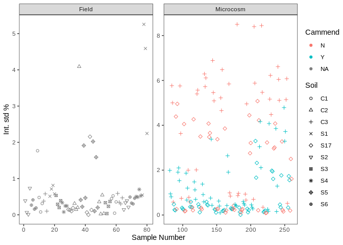
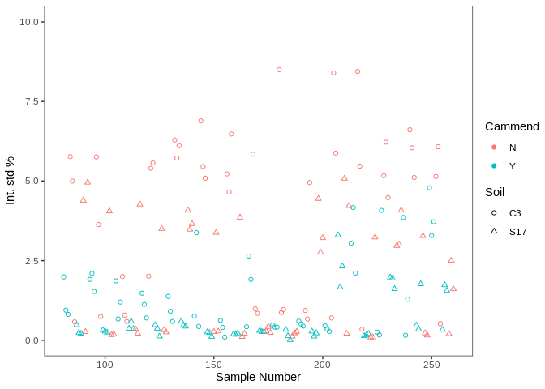
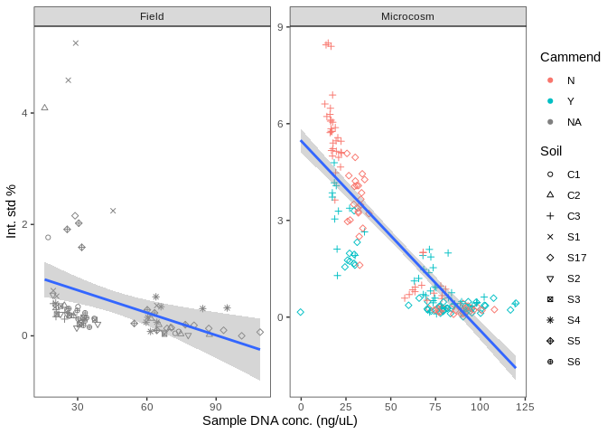
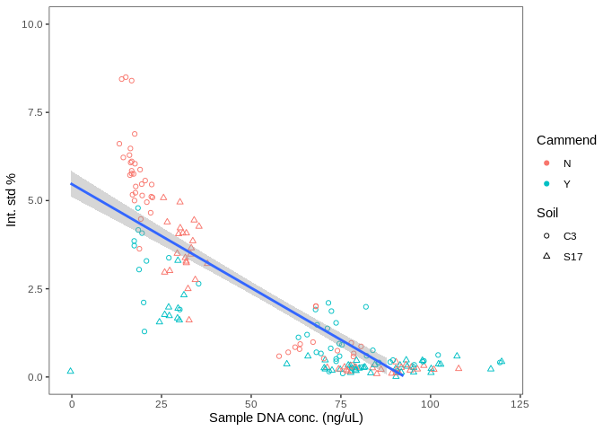
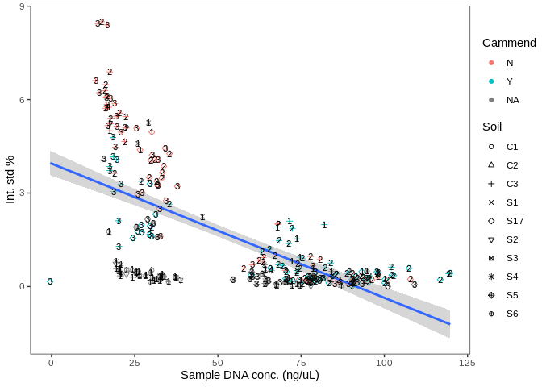
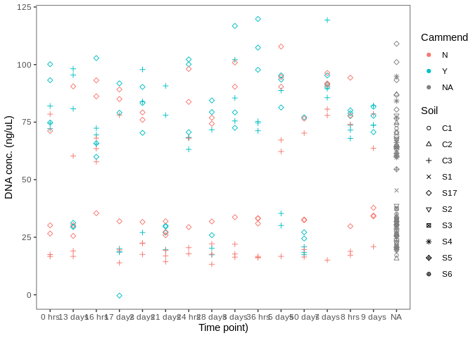
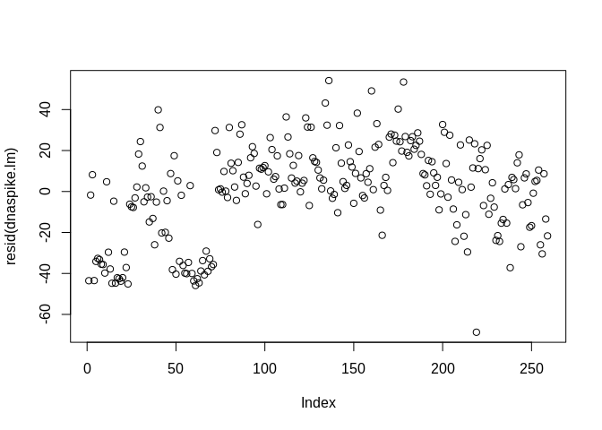
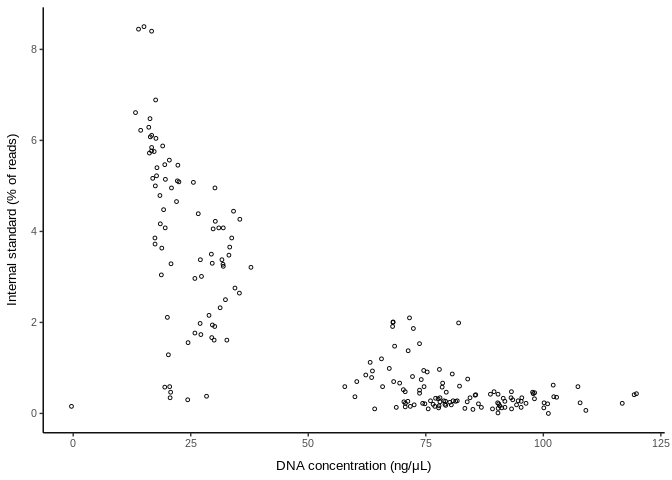
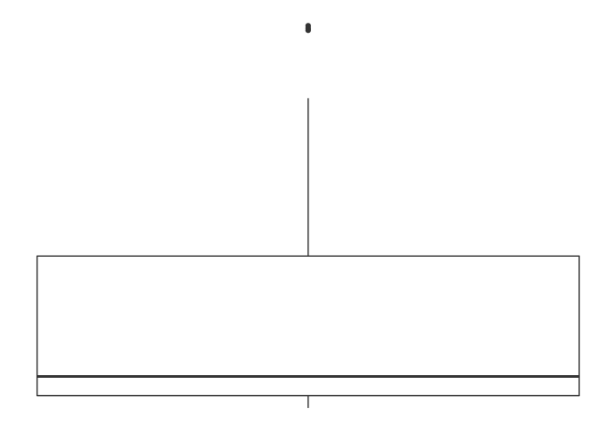
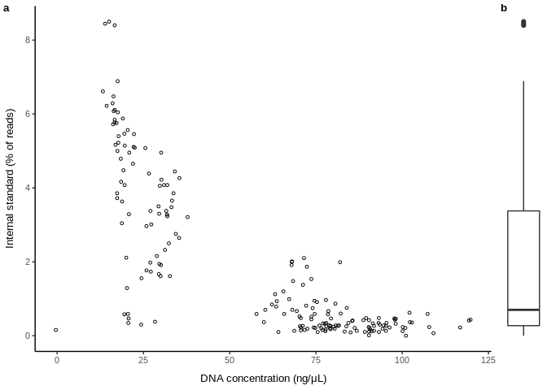

Dunlop growth rate - internal standard normalization
================
Cassi Wattenburger
2/22/2019

**Goal of this script:** Normalize rarefied data by internal standard
read count.

# Import libraries

``` r
library("phyloseq")
library("ape")
library("vegan")
library("ggplot2")
library("reshape")
library("plyr")
library("dplyr")

sessionInfo()
```

    ## R version 3.6.3 (2020-02-29)
    ## Platform: x86_64-pc-linux-gnu (64-bit)
    ## Running under: Ubuntu 18.04.4 LTS
    ## 
    ## Matrix products: default
    ## BLAS:   /usr/lib/x86_64-linux-gnu/blas/libblas.so.3.7.1
    ## LAPACK: /usr/lib/x86_64-linux-gnu/lapack/liblapack.so.3.7.1
    ## 
    ## locale:
    ##  [1] LC_CTYPE=en_US.UTF-8       LC_NUMERIC=C              
    ##  [3] LC_TIME=en_US.UTF-8        LC_COLLATE=en_US.UTF-8    
    ##  [5] LC_MONETARY=en_US.UTF-8    LC_MESSAGES=en_US.UTF-8   
    ##  [7] LC_PAPER=en_US.UTF-8       LC_NAME=C                 
    ##  [9] LC_ADDRESS=C               LC_TELEPHONE=C            
    ## [11] LC_MEASUREMENT=en_US.UTF-8 LC_IDENTIFICATION=C       
    ## 
    ## attached base packages:
    ## [1] stats     graphics  grDevices utils     datasets  methods   base     
    ## 
    ## other attached packages:
    ## [1] dplyr_1.0.2     plyr_1.8.6      reshape_0.8.8   ggplot2_3.3.2  
    ## [5] vegan_2.5-6     lattice_0.20-41 permute_0.9-5   ape_5.4-1      
    ## [9] phyloseq_1.30.0
    ## 
    ## loaded via a namespace (and not attached):
    ##  [1] tidyselect_1.1.0    xfun_0.18           reshape2_1.4.4     
    ##  [4] purrr_0.3.4         splines_3.6.3       rhdf5_2.30.1       
    ##  [7] colorspace_1.4-1    vctrs_0.3.4         generics_0.0.2     
    ## [10] htmltools_0.5.0     stats4_3.6.3        mgcv_1.8-31        
    ## [13] yaml_2.2.1          survival_3.1-12     rlang_0.4.8        
    ## [16] pillar_1.4.6        withr_2.3.0         glue_1.4.2         
    ## [19] BiocGenerics_0.32.0 foreach_1.5.0       lifecycle_0.2.0    
    ## [22] stringr_1.4.0       zlibbioc_1.32.0     Biostrings_2.54.0  
    ## [25] munsell_0.5.0       gtable_0.3.0        codetools_0.2-16   
    ## [28] evaluate_0.14       Biobase_2.46.0      knitr_1.30         
    ## [31] IRanges_2.20.2      biomformat_1.14.0   parallel_3.6.3     
    ## [34] Rcpp_1.0.5          scales_1.1.1        S4Vectors_0.24.4   
    ## [37] jsonlite_1.7.1      XVector_0.26.0      digest_0.6.25      
    ## [40] stringi_1.5.3       grid_3.6.3          ade4_1.7-15        
    ## [43] tools_3.6.3         magrittr_1.5        tibble_3.0.3       
    ## [46] cluster_2.1.0       crayon_1.3.4        pkgconfig_2.0.3    
    ## [49] MASS_7.3-51.6       ellipsis_0.3.1      Matrix_1.2-18      
    ## [52] data.table_1.13.0   rmarkdown_2.4       iterators_1.0.12   
    ## [55] Rhdf5lib_1.8.0      R6_2.4.1            multtest_2.42.0    
    ## [58] igraph_1.2.6        nlme_3.1-147        compiler_3.6.3

# Import rarefied data

``` r
load("rdata.files/gr_physeq.rarefy.RData")

# Pull data out of phyloseq
count <- data.frame(otu_table(physeq.rarefy))
tax <- data.frame(tax_table(physeq.rarefy))
meta <- data.frame(sample_data(physeq.rarefy))
```

# Identify internal standard ASV

``` r
# Find identifiers associated with spike-in genus Aquifex
tax.aquifex <- subset(tax, Genus=="Aquifex")
id.aquifex <- row.names(tax.aquifex)

# Create new row with summed spike-in counts
count.asv <- count
count.asv$ASV <- rownames(count)
count.spike <- filter(count.asv, ASV %in% id.aquifex)
rownames(count.spike) <- count.spike$ASV
count.spike <- count.spike[,-260]
count.spike <- as.matrix(count.spike)
spikesum <- colSums(count.spike)
spikesum <- as.data.frame(spikesum)
```

DADA2 seems to have split the internal standard into ~6 ASVs, but the
read count abundance of the other 5 is minimal to none. Not sure what
causes this behavior, but may be due to sequencing errors.

# Calculate proportion of internal standard per sample

``` r
# Calculate proportion of spike-in in each sample
totalsum <- colSums(count)
totalsum <- as.data.frame(totalsum)
totalspikesum <- merge(totalsum, spikesum, by=0)
totalspikesum <- mutate(totalspikesum, percent=(spikesum/totalsum)*100)

# Reformat
rownames(totalspikesum) <- totalspikesum[,1]
#totalspikesum$Row.names <- gsub("sa","", totalspikesum$Row.names)
#totalspikesum$Row.names <- as.numeric(totalspikesum$Row.names)
totalspikesum <- merge(meta, totalspikesum, by=0)
rownames(totalspikesum) <- totalspikesum[,1]
totalspikesum <- totalspikesum[,-c(1,12)]
```

``` r
# Add dna conc. metadata
dnaconc <- read.csv("growthrate_dnaext.csv")
totalspikesum <- merge(totalspikesum, dnaconc, by=1)
```

Spike percentage visualizations:

``` r
ggplot(totalspikesum, aes(x=SampleID, y=percent)) +
  geom_point(aes(color=Cammend, shape=Soil)) +
  facet_wrap(~Experiment, scales="free") +
  scale_shape_manual(values=1:nlevels(totalspikesum$Soil)) +
  labs(x="Sample Number", y="Int. std %") +
  theme_test()
```

<!-- -->

``` r
ggplot(totalspikesum[totalspikesum$Experiment=="Microcosm",], aes(x=SampleID, y=percent)) +
  geom_point(aes(color=Cammend, shape=Soil)) +
  scale_shape_manual(values=1:nlevels(totalspikesum$Soil)) +
  labs(x="Sample Number", y="Int. std %") +
  theme_test() +
  theme(title=element_text(size=12),
      axis.text=element_text(size=12),
      axis.title=element_text(size=12)) +
  scale_y_continuous(limits=c(0,10)) +
  theme_test()
```

<!-- -->

``` r
ggplot(totalspikesum, aes(x=Conc., y=percent)) +
  geom_point(aes(color=Cammend, shape=Soil)) +
  geom_smooth(method="lm", weight=0.5) +
  facet_wrap(~Experiment, scales="free") +
  scale_shape_manual(values=1:nlevels(totalspikesum$Soil)) +
  labs(x="Sample DNA conc. (ng/uL)", y="Int. std %") +
  theme_test()
```

<!-- -->

``` r
ggplot(totalspikesum[totalspikesum$Experiment=="Microcosm",], aes(x=Conc., y=percent)) +
  geom_point(aes(color=Cammend, shape=Soil)) +
  geom_smooth(method="lm", weight=0.5) +
  scale_shape_manual(values=1:nlevels(totalspikesum$Soil)) +
  labs(x="Sample DNA conc. (ng/uL)", y="Int. std %") +
  theme_test() +
  theme(title=element_text(size=12),
      axis.text=element_text(size=12),
      axis.title=element_text(size=12)) +
  scale_y_continuous(limits=c(0,10)) +
  theme_test()
```

<!-- -->

``` r
ggplot(totalspikesum, aes(x=Conc., y=percent)) +
  geom_point(aes(color=Cammend, shape=Soil)) +
  geom_smooth(method="lm", weight=0.5) +
  geom_text(aes(label=Box), size=3) +
  scale_shape_manual(values=1:nlevels(totalspikesum$Soil)) +
  labs(x="Sample DNA conc. (ng/uL)", y="Int. std %") +
  theme_test()
```

<!-- -->

``` r
ggplot(totalspikesum, aes(x=TimePoint, y=Conc.)) +
  geom_point(aes(color=Cammend, shape=Soil)) +
  geom_smooth(method="lm", weight=0.5) +
  #geom_text(aes(label=TimePoint), size=3) +
  scale_shape_manual(values=1:nlevels(totalspikesum$Soil)) +
  labs(x="Time point)", y="DNA conc. (ng/uL)") +
  theme(axis.text.x = element_text(angle = 45, hjust = 1)) +
  theme_test()
```

<!-- -->

Strange gap in the samples. What’s that about?

Is there a an effect of kit box used on DNA concentration?

``` r
totalspikesum$Box <- as.factor(totalspikesum$Box)
kruskal.test(Conc. ~ Box, data=totalspikesum)
```

    ## 
    ##  Kruskal-Wallis rank sum test
    ## 
    ## data:  Conc. by Box
    ## Kruskal-Wallis chi-squared = 29.29, df = 2, p-value = 4.362e-07

``` r
# p-value = 4.362e-07

totalspikesum$Box <- as.factor(totalspikesum$Experiment)
kruskal.test(Conc. ~ Experiment, data=totalspikesum)
```

    ## 
    ##  Kruskal-Wallis rank sum test
    ## 
    ## data:  Conc. by Experiment
    ## Kruskal-Wallis chi-squared = 7.7025, df = 1, p-value = 0.005514

Unfortunately, I didn’t randomize my DNA extractions, so this is
confounded by samples processed in one kit being more similar to one
another in other ways ie plot location, point in time series, treatment.

``` r
# Add aggregated spike info back into count table
count.m <- as.matrix(count)
count.trans <- t(count.m)
spikesum$Sample <- rownames(spikesum)
count.trans.spike <- merge(count.trans, spikesum, by=0)
rownames(count.trans.spike) <- count.trans.spike[,1]
count.trans.spike <- count.trans.spike[,-1]
count.trans.spike <- count.trans.spike[,-33015]
```

**Statistics**

Summary: Min, max, average, standard deviation of percent internal
standard:

``` r
t(data.frame(min = min(totalspikesum$percent),
           min.without.0s = min(totalspikesum[totalspikesum$percent > 0,]$percent),
           number.of.0s = nrow(totalspikesum[totalspikesum$percent == 0,]),
           max = max(totalspikesum$percent),
           avg = mean(totalspikesum$percent),
           stdev = sd(totalspikesum$percent)))
```

    ##                      [,1]
    ## min            0.00000000
    ## min.without.0s 0.01111111
    ## number.of.0s   1.00000000
    ## max            8.50000000
    ## avg            1.60175890
    ## stdev          1.99158058

There was one sample that did not have any internal standard.

Is there a correlation between spike-in percentage and DNA
concentration?

Hypothesis: negative correlation, more community DNA should result in a
smaller proportion of the internal standard.

Linear regression:

``` r
dnaspike.lm = lm(Conc. ~ percent, totalspikesum)
plot(resid(dnaspike.lm)) # check normality of model fit
```

<!-- -->

Nope, use Spearman correlation instead
(non-parametric).

``` r
dnaspike.spear = cor.test(totalspikesum$Conc., log(totalspikesum$percent), method="spearman")
dnaspike.spear
```

    ## 
    ##  Spearman's rank correlation rho
    ## 
    ## data:  totalspikesum$Conc. and log(totalspikesum$percent)
    ## S = 4816277, p-value < 2.2e-16
    ## alternative hypothesis: true rho is not equal to 0
    ## sample estimates:
    ##        rho 
    ## -0.6632972

Ties warning. Use permuted Spearman correlation instead.

See:
<https://stats.stackexchange.com/questions/50015/spearman-correlation-in-the-presence-of-many-ties-how-to-spot-a-problem>

``` r
# Create permuted spearman correlation function (test rho is less than 0)
spearman_permute = function(x, y) {
  set.seed(1) # make sure it is reproducible
  perm.estimates = c()
  for (i in 1:1000) { # permute 1000 times
    perm = sample(y) # randomize response variable
    perm.test = suppressWarnings(cor.test(x, perm, method="spearman", alternative="less")) # spearman correlation with permuted data
    perm.estimates = append(perm.estimates, perm.test$estimate) # permuted estimates
  }
  actual.test = suppressWarnings(cor.test(x, y, method="spearman", alternative="less")) # spearman correlation with actual data
  actual.estimate = actual.test$estimate # actual data estimate (rho)
  est.exceed = sum(abs(perm.estimates) < actual.estimate) # number of permutations that are less than the actual test rho
  est.equal = sum(abs(perm.estimates) == actual.estimate) # number of permutations that equal the actual test rho
  print(est.exceed)
  permuted.pval = (est.exceed + est.equal/2) / length(perm.estimates) # proportion of exceedances: the p-value
  return(c(permuted.pval, actual.estimate)) # the permuted p-value and estimate (rho)
}

# Test
dnaspike.spearperm = spearman_permute(totalspikesum$Conc., log(totalspikesum$percent)) # plotting as log, and relationship doesn't look linear
```

    ## [1] 0

``` r
dnaspike.spearperm
```

    ##                   rho 
    ##  0.0000000 -0.6632972

Permuted spearman estimate agrees exactly with non-permuted.

# Normalize ASV abundances by internal standard

Taxa reads / internal standard reads in the sample.

``` r
# create dataframe to store normalized data
df.norm <- data.frame(matrix(NA, nrow=nrow(count.trans.spike), ncol=ncol(count.trans.spike)))
rownames(df.norm) <- row.names(count.trans.spike)
colnames(df.norm) <- colnames(count.trans.spike)

# Divide each taxa count (column) by corresponding spike count (spikesum column)
for (i in 1:ncol(count.trans.spike)) {
  df.norm[,i] <- count.trans.spike[,i]/count.trans.spike$spikesum
}
```

Reformat and save.

``` r
# Add metadata to normalized data
count.meta.norm <- merge(meta, df.norm, by=0)

# Subset microcosm samples
microcosm.norm <- filter(count.meta.norm, Experiment %in% c("Microcosm"))
rownames(microcosm.norm) <- microcosm.norm[,2]

# Subset in-field samples
field.norm = filter(count.meta.norm, Experiment %in% c("Field"))
rownames(field.norm) <- field.norm[,2]
field.norm = field.norm[,-c(1,3:5,8:11)]
```

``` r
save(microcosm.norm, file="r.output/gr_microcosm.norm.RData")
save(field.norm, file="r.output/gr_field.norm.RData")
```

``` r
# Reformat
microcosm.norm <- microcosm.norm[,-c(1,3:4,7:8,11)]
microcosm.norm.melt <- melt(microcosm.norm, id.vars=c("SampleID","Cammend","Soil","TimePoint","Days"))
field.norm.melt <- melt(field.norm, id.vars=c("SampleID","Soil","Block"))
```

``` r
# Add taxonomy
tax$ASV <- rownames(tax)
microcosm.norm.tax <- merge(microcosm.norm.melt, tax, by.x=6, by.y=7)
field.norm.tax <- merge(field.norm.melt, tax, by.x=4, by.y=7)
```

``` r
save(microcosm.norm.tax, file="r.output/gr_microcosm.norm.tax.RData")
save(field.norm.tax, file="r.output/gr_field.norm.tax.RData")
```

# Figures

These will be edited in adobe illustrator for minor adjustments to
aesthetics.

``` r
library(tidyverse)
library(cowplot)

# Clean up the dataframe for plotting
intstd = totalspikesum %>%
  select(Sample=SampleID, Soil, Amendment=Cammend, Block, Day=Days, Experiment, spikesum, totalsum, DNA_conc=Conc., Box) %>% # clean up
  filter(Soil %in% c("C3", "S17")) %>% # relevant soils
  mutate(spike_perc = (spikesum/totalsum)*100, Box = as.factor(Box)) # percent spike-in per sample

# Plot relationship with DNA conc.
p1 = intstd %>%
  ggplot(aes(x=DNA_conc, y=spike_perc)) +
  geom_point(size=1, shape=1) +
  labs(x="DNA concentration (ng/\u03BCL)", y="Internal standard (% of reads)") +
  theme(panel.grid.major = element_blank(), 
        panel.grid.minor = element_blank(),
        panel.background = element_blank(), 
        axis.line = element_line(colour = "black"),
        axis.title.x = element_text(margin = unit(c(3, 0, 0, 0), "mm"), size=10),
        axis.title.y = element_text(margin = unit(c(0, 3, 0, 0), "mm"), size=10),
        axis.text = element_text(size = 8))
p1
```

<!-- -->

``` r
# 
p2 = intstd %>%
  ggplot(aes(x=DNA_conc, y=spike_perc)) +
  geom_boxplot() +
  theme(panel.grid.major = element_blank(), 
        panel.grid.minor = element_blank(),
        panel.background = element_blank(), 
        axis.line = element_blank(),
        axis.title.x = element_blank(),
        axis.title.y = element_blank(),
        axis.text = element_blank(),
        axis.ticks=element_blank())
p2
```

<!-- -->

``` r
dnaspike.plot = plot_grid(p1, p2, align="h", axis="b", rel_widths=c(1, 0.1), labels=c("a","b"), label_size=10)
dnaspike.plot
```

<!-- -->

``` r
library(Cairo)
ggsave(plot = dnaspike.plot, file = "figures/fig_dnavsintstd.pdf", device=cairo_pdf, width = 90, height = 90, unit="mm")
```
