Dunlop growth rates - data exploration and summary statistics
================
Cassandra Wattenburger
11/10/2020

**Goal of this script:** Explore the properties of the data and
descriptive statistics of in-situ growth rates.

# Import libraries

``` r
library(tidyverse)
library(cowplot)
library(phyloseq)
library(lmerTest)
library(emmeans)

sessionInfo()
```

    ## R version 3.6.3 (2020-02-29)
    ## Platform: x86_64-pc-linux-gnu (64-bit)
    ## Running under: Ubuntu 18.04.4 LTS
    ## 
    ## Matrix products: default
    ## BLAS:   /usr/lib/x86_64-linux-gnu/blas/libblas.so.3.7.1
    ## LAPACK: /usr/lib/x86_64-linux-gnu/lapack/liblapack.so.3.7.1
    ## 
    ## locale:
    ##  [1] LC_CTYPE=en_US.UTF-8       LC_NUMERIC=C              
    ##  [3] LC_TIME=en_US.UTF-8        LC_COLLATE=en_US.UTF-8    
    ##  [5] LC_MONETARY=en_US.UTF-8    LC_MESSAGES=en_US.UTF-8   
    ##  [7] LC_PAPER=en_US.UTF-8       LC_NAME=C                 
    ##  [9] LC_ADDRESS=C               LC_TELEPHONE=C            
    ## [11] LC_MEASUREMENT=en_US.UTF-8 LC_IDENTIFICATION=C       
    ## 
    ## attached base packages:
    ## [1] stats     graphics  grDevices utils     datasets  methods   base     
    ## 
    ## other attached packages:
    ##  [1] emmeans_1.5.2-1 lmerTest_3.1-3  lme4_1.1-23     Matrix_1.2-18  
    ##  [5] phyloseq_1.30.0 cowplot_1.1.0   forcats_0.5.0   stringr_1.4.0  
    ##  [9] dplyr_1.0.2     purrr_0.3.4     readr_1.4.0     tidyr_1.1.2    
    ## [13] tibble_3.0.3    ggplot2_3.3.2   tidyverse_1.3.0
    ## 
    ## loaded via a namespace (and not attached):
    ##  [1] nlme_3.1-147        fs_1.5.0            lubridate_1.7.9    
    ##  [4] httr_1.4.2          numDeriv_2016.8-1.1 tools_3.6.3        
    ##  [7] backports_1.1.10    R6_2.4.1            vegan_2.5-6        
    ## [10] mgcv_1.8-31         DBI_1.1.0           BiocGenerics_0.32.0
    ## [13] colorspace_1.4-1    permute_0.9-5       ade4_1.7-15        
    ## [16] withr_2.3.0         tidyselect_1.1.0    compiler_3.6.3     
    ## [19] cli_2.0.2           rvest_0.3.6         Biobase_2.46.0     
    ## [22] xml2_1.3.2          scales_1.1.1        mvtnorm_1.1-1      
    ## [25] digest_0.6.25       minqa_1.2.4         rmarkdown_2.4      
    ## [28] XVector_0.26.0      pkgconfig_2.0.3     htmltools_0.5.0    
    ## [31] dbplyr_1.4.4        rlang_0.4.8         readxl_1.3.1       
    ## [34] rstudioapi_0.11     generics_0.0.2      jsonlite_1.7.1     
    ## [37] magrittr_1.5        biomformat_1.14.0   Rcpp_1.0.5         
    ## [40] munsell_0.5.0       S4Vectors_0.24.4    Rhdf5lib_1.8.0     
    ## [43] fansi_0.4.1         ape_5.4-1           lifecycle_0.2.0    
    ## [46] stringi_1.5.3       yaml_2.2.1          MASS_7.3-51.6      
    ## [49] zlibbioc_1.32.0     rhdf5_2.30.1        plyr_1.8.6         
    ## [52] grid_3.6.3          blob_1.2.1          parallel_3.6.3     
    ## [55] crayon_1.3.4        lattice_0.20-41     Biostrings_2.54.0  
    ## [58] haven_2.3.1         splines_3.6.3       multtest_2.42.0    
    ## [61] hms_0.5.3           knitr_1.30          pillar_1.4.6       
    ## [64] igraph_1.2.6        boot_1.3-25         estimability_1.3   
    ## [67] reshape2_1.4.4      codetools_0.2-16    stats4_3.6.3       
    ## [70] reprex_0.3.0        glue_1.4.2          evaluate_0.14      
    ## [73] data.table_1.13.0   modelr_0.1.8        nloptr_1.2.2.2     
    ## [76] vctrs_0.3.4         foreach_1.5.0       cellranger_1.1.0   
    ## [79] gtable_0.3.0        assertthat_0.2.1    xfun_0.18          
    ## [82] xtable_1.8-4        broom_0.7.1         survival_3.1-12    
    ## [85] iterators_1.0.12    IRanges_2.20.2      cluster_2.1.0      
    ## [88] statmod_1.4.34      ellipsis_0.3.1

``` r
rm(list=ls())
```

# Load data and clean up

There are inconsistencies in the data structure, variable names, and
metadata that need to be cleaned up for easier manipulation and
analysis.

Internal-standard normalized microcosm and field community data:

``` r
# Original, rarefied phyloseq object (not normalized)
load("rdata.files/gr_physeq.rarefy.RData")
tax = as.data.frame(tax_table(physeq.rarefy)) %>% rownames_to_column(var="ASV") # taxonomy extract

# Microcosms
load("rdata.files/gr_microcosm.norm.tax.RData")
ucosms = microcosm.norm.tax

# Replicates
ucosm.rep1 = seq(81, 260, by=3)
ucosm.rep2 = seq(82, 260, by=3)
ucosm.rep3 = seq(83, 260, by=3)

# Clean up
ucosms = ucosms %>% 
  mutate(Sample = str_remove(SampleID, "sa"), Sample = parse_number(Sample)) %>% # convert sample numbers into numeric (easier manipulation)
  mutate(Replicate = ifelse(Sample %in% ucosm.rep1, 1, ifelse(Sample %in% ucosm.rep2, 2, ifelse(Sample %in% ucosm.rep3, 3, NA)))) %>% # add replicates
  select(Sample, Amendment=Cammend, Soil, Day=Days, Replicate, norm_abund=value, ASV=variable, Domain, Phylum, Class, Order, Family, Genus) # rename/reorder

# Field
load("rdata.files/gr_field.norm.RData")
field = field.norm

# Replicates
field.rep1 = seq(1, 80, by=4)
field.rep2 = seq(2, 80, by=4)
field.rep3 = seq(3, 80, by=4)
field.rep4 = seq(4, 80, by=4)

# Clean up
field = field %>%
  mutate(Sample = str_remove(SampleID, "sa"), Sample = parse_number(Sample)) %>% # convert sample numbers into numeric (easier manipulation)
  pivot_longer(9:33122, names_to = "ASV", values_to="norm_abund") %>% # tidy format
  filter(Soil %in% c("C3", "S17")) %>% # only these plots are relevant
  mutate(Replicate = ifelse(Sample %in% field.rep1, 1, ifelse(Sample %in% field.rep2, 2, ifelse(Sample %in% field.rep3, 3, ifelse(Sample %in% field.rep4, 4, NA))))) %>% # add replciates
  select(Sample, Soil, Block, Replicate, ASV, norm_abund) %>% # rename/reorder
  left_join(tax, by="ASV") # add taxonomy
```

Number of ASVs/phyla in dataset

``` r
# Extract from phyloseq
count = as.data.frame(otu_table(physeq.rarefy))
meta = data.frame(sam_data(physeq.rarefy))

# Remove unused samples
## Only microcosm adn S17/C3 from field relevant
meta.rm = meta %>% subset(Soil == "C3" | Soil == "S17")

count.rm = count %>%
  t() %>%
  as.data.frame() %>%
  merge(meta.rm, by=0) %>%
  column_to_rownames(var="Row.names") %>%
  select(everything(), -(SampleID:Experiment))

# Remove absent ASVs
count.rm0 = colSums(count.rm, dims=1)
count.rm0 = count.rm0[count.rm0 > 0]

# Total ASVs
length(count.rm0)
```

    ## [1] 23634

``` r
asvs = names(count.rm0)

# Total phyla
tax.rm0 = tax[tax$ASV %in% asvs,]
phyla = unique(tax.rm0$Phylum)
```

Estimated in-situ growth rates:

``` r
gr.est = readRDS("rdata.files/gr_gr.final_rm0.rds")

# Clean up
gr.est = gr.est %>% 
  left_join(tax, by="ASV") %>% # add taxonomy
  select(Soil, Amendment, Replicate, label, Slope, k, g, Start, End, Length, ASV, Domain, Phylum, Class, Order, Family, Genus) # rename/reorder
```

``` r
# Save cleaned datasets for use in future scripts
saveRDS(ucosms, file="rdata.files/ucosm.norm.cleaned.rds")
saveRDS(field, file="rdata.files/field.norm.cleaned.rds")
saveRDS(gr.est, file="rdata.files/gr.final.cleaned.rds")
```

# Overview of communities

Number of ASVs/phyla

``` r
# Microcosms
ucosms %>% filter(norm_abund != 0) %>% distinct(ASV) %>% nrow() # total ASVs (not including 0 abundance)
```

    ## [1] 21233

``` r
ucosms %>%  # average ASVs per sample
  filter(norm_abund != 0) %>% 
  group_by(Sample) %>% 
  summarize(num_ASV = length(unique(ASV))) %>% 
  colMeans()
```

    ##   Sample  num_ASV 
    ## 170.5000 604.8444

``` r
ucosms %>% # total phyla, not counting 0 abundance ASVs, or uncertain taxonomic placement
  filter(norm_abund != 0) %>% 
  mutate(Phylum = str_remove(Phylum, "putative "), Phylum = str_remove(Phylum, "unclassified ")) %>%
  distinct(Phylum) %>% 
  nrow()
```

    ## [1] 41

``` r
# Field
field %>% filter(norm_abund != 0) %>% distinct(ASV) %>% nrow() # total ASVs (not including 0 abundance)
```

    ## [1] 5803

``` r
field %>%  # average ASVs per sample
  filter(norm_abund != 0) %>% 
  group_by(Sample) %>% 
  summarize(num_ASV = length(unique(ASV))) %>% 
  colMeans()
```

    ##    Sample   num_ASV 
    ##  38.93333 836.00000

``` r
field %>% # total phyla, not counting 0 abundance ASVs, or uncertain taxonomic placement
  filter(norm_abund != 0) %>% 
  mutate(Phylum = str_remove(Phylum, "putative "), Phylum = str_remove(Phylum, "unclassified ")) %>% 
  distinct(Phylum) %>% 
  nrow() 
```

    ## [1] 37

``` r
# Microcosms and field together (full dataset)
ucosms %>% bind_rows(field) %>% filter(norm_abund != 0) %>% distinct(ASV) %>% nrow() # total ASVs (not including 0 abundance)
```

    ## [1] 23733

``` r
ucosms %>% # average number of ASVs
  bind_rows(field) %>% 
  filter(norm_abund != 0) %>% 
  group_by(Sample) %>% 
  summarize(num_ASV = length(unique(ASV))) %>% 
  colMeans()
```

    ##   Sample  num_ASV 
    ## 160.3795 622.6256

``` r
ucosms %>% # total phyla, not counting 0 abundance ASVs, or uncertain taxonomic placement
  bind_rows(field) %>% 
  filter(norm_abund != 0) %>% 
  mutate(Phylum = str_remove(Phylum, "putative "), Phylum = str_remove(Phylum, "unclassified ")) %>%
  distinct(Phylum) %>% 
  nrow() 
```

    ## [1] 43

``` r
# Estimated growth rates
gr.est %>% distinct(ASV) %>% nrow() # total ASVs (not including 0 abundance)
```

    ## [1] 453

``` r
gr.est %>% # total phyla, not counting 0 abundance ASVs, not counting putative/unclassified
  mutate(Phylum = str_remove(Phylum, "putative "), Phylum = str_remove(Phylum, "unclassified ")) %>% 
  distinct(Phylum) %>% 
  nrow()
```

    ## [1] 15

``` r
# Number of estimates per phylum
gr.est %>% 
  mutate(Phylum = str_remove(Phylum, "putative ")) %>% # roll putative into the phylum
  distinct(ASV, Phylum) %>%
  group_by(Phylum) %>%
  summarize(total = n()) %>%
  arrange(-total)
```

    ## # A tibble: 15 x 2
    ##    Phylum                total
    ##    <chr>                 <int>
    ##  1 Proteobacteria          140
    ##  2 Actinobacteria           88
    ##  3 Acidobacteria            72
    ##  4 Verrucomicrobia          33
    ##  5 Planctomycetes           29
    ##  6 Bacteroidetes            21
    ##  7 Chloroflexi              20
    ##  8 unclassified Bacteria    15
    ##  9 Gemmatimonadetes          9
    ## 10 Firmicutes                7
    ## 11 Nitrospirae               6
    ## 12 Thaumarchaeota            6
    ## 13 Latescibacteria           5
    ## 14 Euryarchaeota             1
    ## 15 Ignavibacteriae           1

``` r
# Number of estimates per treatment
gr.est %>%
  group_by(Soil, Amendment) %>%
  distinct(ASV) %>%
  summarize(total = n())
```

    ## # A tibble: 4 x 3
    ## # Groups:   Soil [2]
    ##   Soil  Amendment total
    ##   <fct> <fct>     <int>
    ## 1 C3    Y           197
    ## 2 C3    N           223
    ## 3 S17   Y           108
    ## 4 S17   N           102

Most abundant phyla

``` r
# Microcosms (tp0)
ucosms %>% 
  filter(Day==0) %>%
  group_by(Replicate, Phylum) %>% 
  summarize(total_abund = sum(norm_abund)) %>%
  ggplot(aes(y=fct_reorder(Phylum, -total_abund), x=total_abund)) +
  geom_boxplot() +
  labs(title="Microcosms at TP0", x="Total normalized abundance", y="Phylum") +
  theme_test()
```

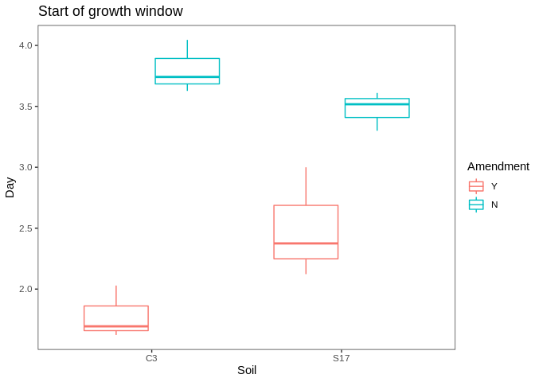<!-- -->

``` r
# Field
field %>% 
  group_by(Replicate, Phylum) %>% 
  summarize(total_abund = sum(norm_abund)) %>%
  ggplot(aes(y=fct_reorder(Phylum, -total_abund), x=total_abund)) +
  geom_boxplot() +
  labs(title="Field", x="Total normalized abundance", y="Phylum") +
  theme_test()
```

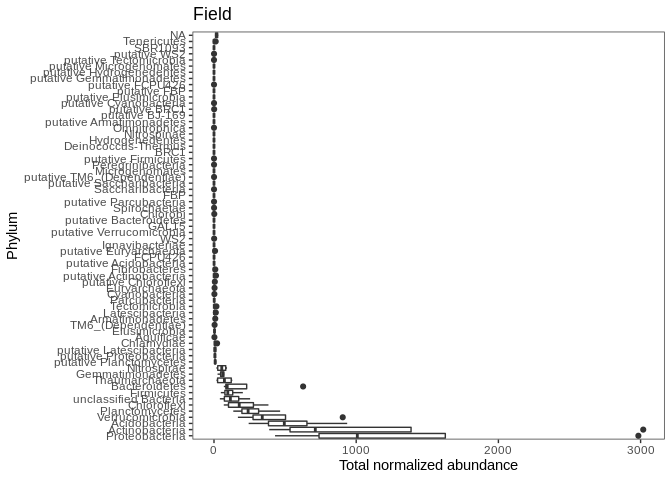<!-- -->

``` r
# Growth rate estimates
gr.est %>% 
  group_by(Replicate, Phylum) %>%
  summarize(num_ASV = length(ASV)) %>%
  ggplot(aes(y=fct_reorder(Phylum, -num_ASV), x=num_ASV)) +
  geom_boxplot() +
  labs(title="Growth estimates", x="Total ASVs", y="Phylum") +
  theme_test()
```

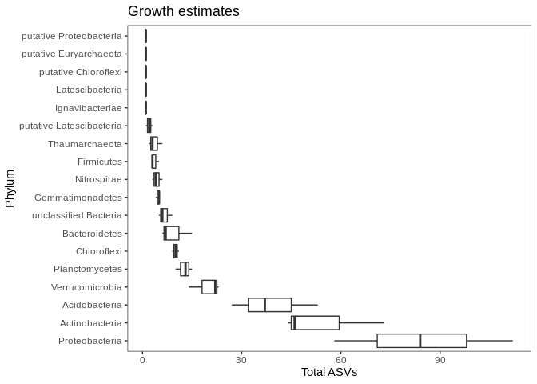<!-- -->

``` r
# Count total ASVs in overall data
gr.est %>% group_by(Phylum) %>% count(Phylum) %>% arrange(-n)
```

    ## # A tibble: 18 x 2
    ## # Groups:   Phylum [18]
    ##    Phylum                       n
    ##    <fct>                    <int>
    ##  1 Proteobacteria             254
    ##  2 Actinobacteria             163
    ##  3 Acidobacteria              117
    ##  4 Verrucomicrobia             59
    ##  5 Planctomycetes              38
    ##  6 Chloroflexi                 30
    ##  7 Bacteroidetes               28
    ##  8 unclassified Bacteria       20
    ##  9 Gemmatimonadetes            14
    ## 10 Nitrospirae                 13
    ## 11 Firmicutes                  11
    ## 12 Thaumarchaeota              11
    ## 13 putative Latescibacteria     6
    ## 14 putative Euryarchaeota       3
    ## 15 Ignavibacteriae              1
    ## 16 Latescibacteria              1
    ## 17 putative Chloroflexi         1
    ## 18 putative Proteobacteria      1

Top 5 most abundant phyla in all data categories are Proteobacteria,
Actinobacteria, Acidobacteria, Verrucomicrobia, and Planctomycetes in
that order.

# Biogeochemical data analysis

Analyze SOM and pH data collected from in-field samples.

### SOM

``` r
# Import data
som = read_csv("biogeochem_data/growthrate_insitu_som.csv")
som = som %>% 
  filter((Soil=="S" & Year==17) | (Soil=="C" & Year==3)) %>%
  mutate(som = (Preignition - Postignition) / (Preignition - Crucible) * 100, # calculate % SOM
         Soil = parse_factor(Soil),
         Soil = recode_factor(Soil, C="Cropped", S="Successional")) # clean up

som %>% 
  ggplot(aes(x=Soil, y=som)) +
  geom_boxplot() +
  labs(y="Soil organic matter (%)") +
  theme_test()
```

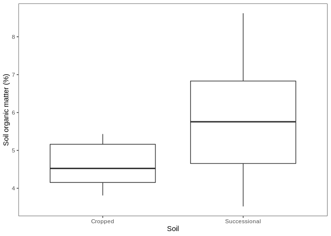<!-- -->

``` r
som %>% 
  ggplot(aes(x=Soil, y=som)) +
  geom_boxplot() +
  facet_wrap(~Block) +
  labs(y="Soil organic matter (%)") +
  theme_test()
```

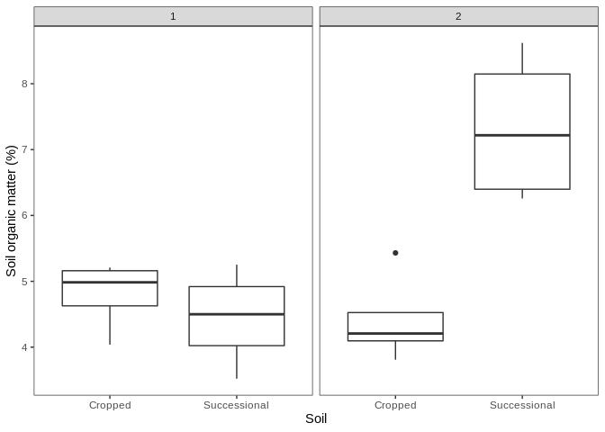<!-- -->

Strong block effect.

**Statistics**

Linear regression \* Soil and Block as fixed effects with interaction
term

``` r
som.lm = lm(som ~ Soil* Block, data=som)

hist(resid(som.lm))
```

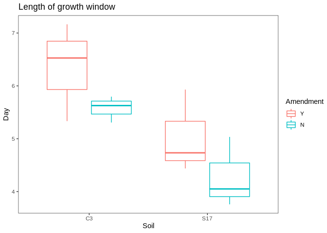<!-- -->

``` r
plot(resid(som.lm), predict(som.lm))
```

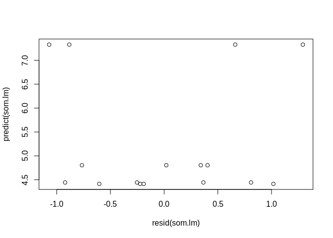<!-- -->

``` r
som.lm2 = lm(log(som) ~ Soil* Block, data=som)

hist(resid(som.lm2))
```

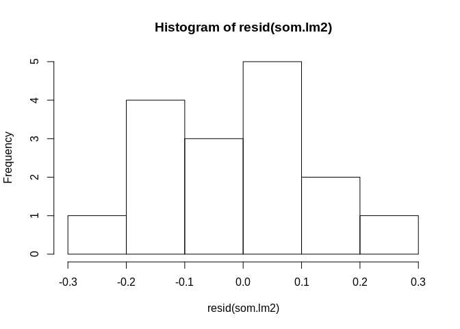<!-- -->

``` r
plot(resid(som.lm2), predict(som.lm2))
```

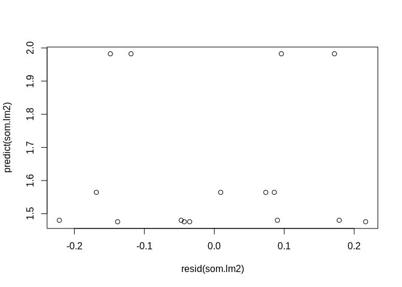<!-- -->

Neither of the residuals look like they fit the assumptions of the
linear model… I’ll do a welch’s t-tests instead, since it looks like
unequal variances seem to be the issue. I can’t add interaction term, so
we’ll do a separate test for each block to account for the interaction.

Welch’s
t-tests

``` r
t.test(som ~ Soil, data=som[som$Block==1,], var.equal=FALSE) # block 1 only
```

    ## 
    ##  Welch Two Sample t-test
    ## 
    ## data:  som by Soil
    ## t = 0.77954, df = 5.4246, p-value = 0.4683
    ## alternative hypothesis: true difference in means is not equal to 0
    ## 95 percent confidence interval:
    ##  -0.8013695  1.5228575
    ## sample estimates:
    ##      mean in group Cropped mean in group Successional 
    ##                   4.803931                   4.443187

``` r
t.test(som ~ Soil, data=som[som$Block==2,], var.equal=FALSE) # block 2 only
```

    ## 
    ##  Welch Two Sample t-test
    ## 
    ## data:  som by Soil
    ## t = -4.2971, df = 4.9461, p-value = 0.007928
    ## alternative hypothesis: true difference in means is not equal to 0
    ## 95 percent confidence interval:
    ##  -4.663725 -1.165279
    ## sample estimates:
    ##      mean in group Cropped mean in group Successional 
    ##                   4.413844                   7.328346

SOM is signficant between soils in block 2 but not block 1. Likely due
to block 2 being downslope of block 1.

### pH

``` r
# Import data
ph = read_csv("biogeochem_data/growthrate_insitu_ph.csv")
ph = ph %>% 
  filter((Soil=="S" & Year==17) | (Soil=="C" & Year==3)) %>%
  mutate(Soil = parse_factor(Soil),
         Soil = recode_factor(Soil, C="Cropped", S="Successional")) # clean up

ph %>% 
  ggplot(aes(x=Soil, y=pH)) +
  geom_boxplot() +
  labs(x="") +
  theme_test()
```

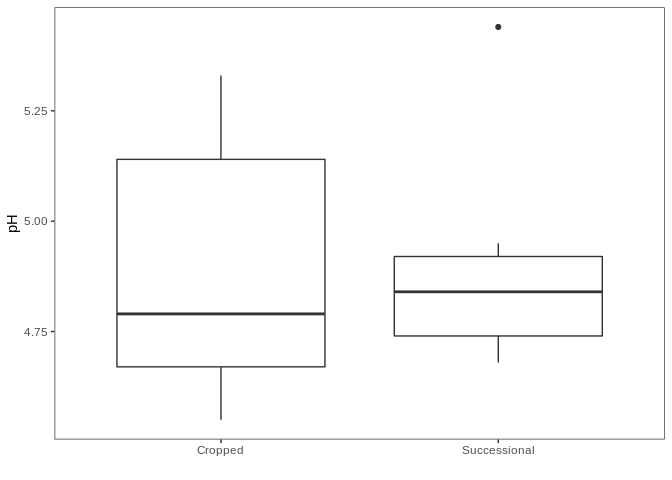<!-- -->

``` r
ph %>% 
  ggplot(aes(x=Soil, y=pH)) +
  geom_boxplot() +
  facet_wrap(~Block) +
  labs(x="") +
  theme_test()
```

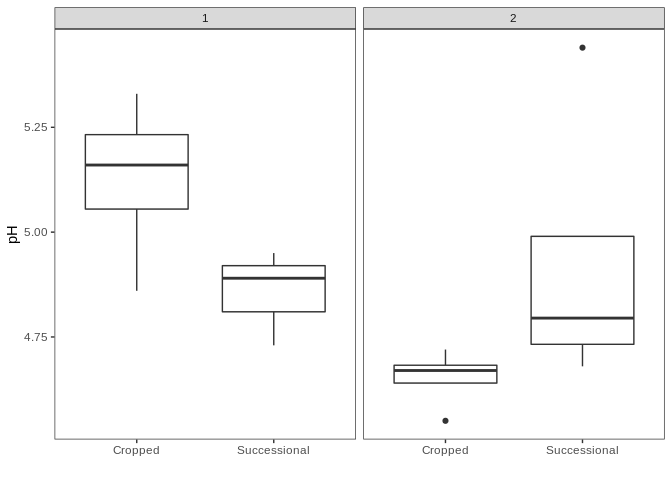<!-- -->

Also looks like there is a strong block effect here.

**Statistics**

Linear regression \* Soil and Block as fixed effects with interaction
term

``` r
ph.lm = lm(pH ~ Soil*Block, data=ph)

hist(resid(ph.lm)) # check normality
```

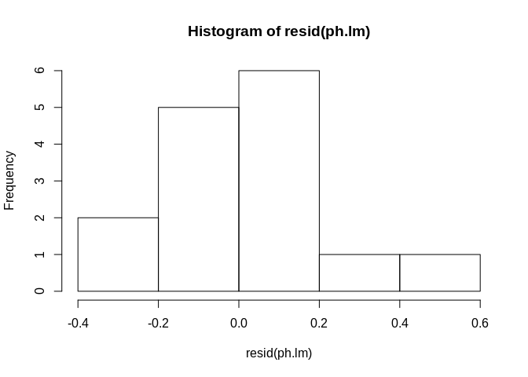<!-- -->

``` r
plot(resid(ph.lm), predict(ph.lm)) # check variances
```

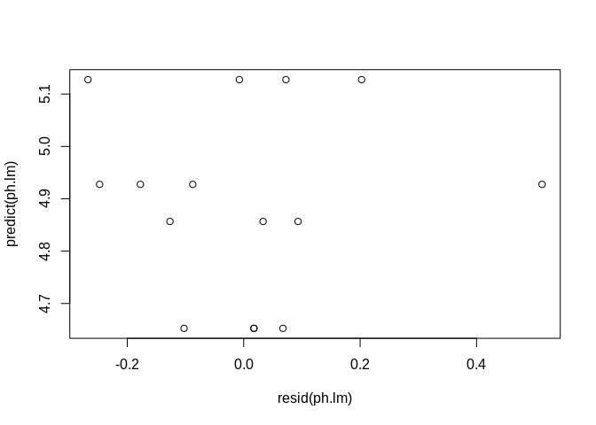<!-- -->

``` r
summary(ph.lm)
```

    ## 
    ## Call:
    ## lm(formula = pH ~ Soil * Block, data = ph)
    ## 
    ## Residuals:
    ##     Min      1Q  Median      3Q     Max 
    ## -0.2675 -0.1146  0.0175  0.0700  0.5125 
    ## 
    ## Coefficients:
    ##                        Estimate Std. Error t value Pr(>|t|)    
    ## (Intercept)              5.6025     0.2437  22.992 1.19e-10 ***
    ## SoilSuccessional        -0.8167     0.3669  -2.226   0.0478 *  
    ## Block                   -0.4750     0.1541  -3.082   0.0104 *  
    ## SoilSuccessional:Block   0.5458     0.2268   2.406   0.0348 *  
    ## ---
    ## Signif. codes:  0 '***' 0.001 '**' 0.01 '*' 0.05 '.' 0.1 ' ' 1
    ## 
    ## Residual standard error: 0.2179 on 11 degrees of freedom
    ##   (1 observation deleted due to missingness)
    ## Multiple R-squared:  0.4682, Adjusted R-squared:  0.3232 
    ## F-statistic: 3.228 on 3 and 11 DF,  p-value: 0.06478

There is a significant soil, block, and interaction between block and
soil for pH.

### Make table of results

``` r
# Merge SOM and pH data
som.ph = full_join(som, ph) %>%
  group_by(Soil) %>%
  summarize(som.avg = mean(som, na.rm=TRUE), som.sd = sd(som, na.rm=TRUE),
            ph.avg = mean(pH, na.rm=TRUE), ph.sd = sd(pH, na.rm=TRUE))
som.ph
```

    ## # A tibble: 2 x 5
    ##   Soil         som.avg som.sd ph.avg ph.sd
    ##   <fct>          <dbl>  <dbl>  <dbl> <dbl>
    ## 1 Cropped         4.61  0.616   4.89 0.289
    ## 2 Successional    5.89  1.79    4.90 0.257
