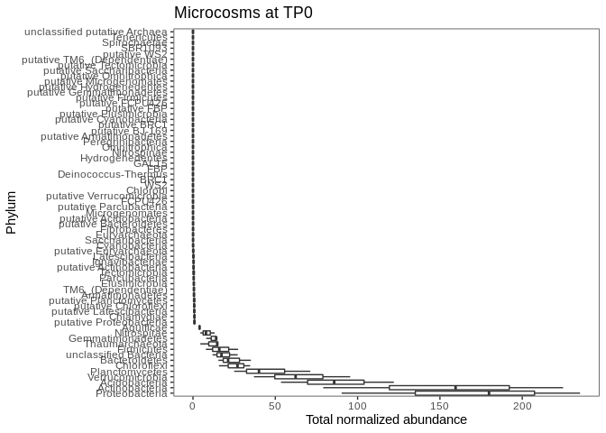
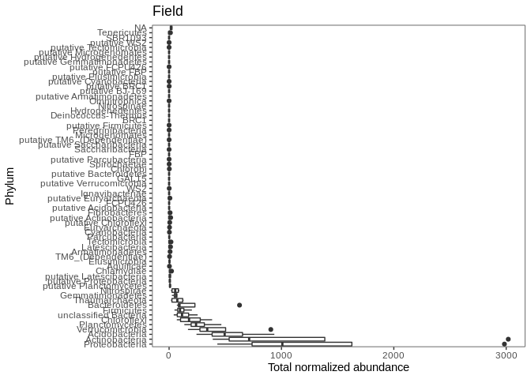
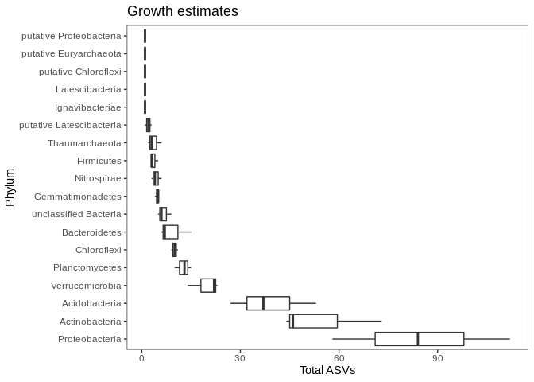
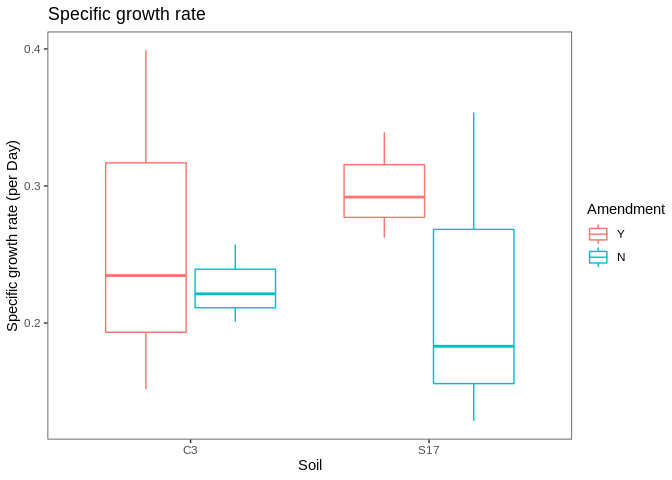

Dunlop growth rates - data exploration and summary statistics
================
Cassandra Wattenburger
11/10/2020

**Goal of this script:** Explore the properties of the data and
descriptive statistics of in-situ growth rates.

# Import libraries

``` r
library(tidyverse)
library(phyloseq)

sessionInfo()
```

    ## R version 3.6.3 (2020-02-29)
    ## Platform: x86_64-pc-linux-gnu (64-bit)
    ## Running under: Ubuntu 18.04.4 LTS
    ## 
    ## Matrix products: default
    ## BLAS:   /usr/lib/x86_64-linux-gnu/blas/libblas.so.3.7.1
    ## LAPACK: /usr/lib/x86_64-linux-gnu/lapack/liblapack.so.3.7.1
    ## 
    ## locale:
    ##  [1] LC_CTYPE=en_US.UTF-8       LC_NUMERIC=C              
    ##  [3] LC_TIME=en_US.UTF-8        LC_COLLATE=en_US.UTF-8    
    ##  [5] LC_MONETARY=en_US.UTF-8    LC_MESSAGES=en_US.UTF-8   
    ##  [7] LC_PAPER=en_US.UTF-8       LC_NAME=C                 
    ##  [9] LC_ADDRESS=C               LC_TELEPHONE=C            
    ## [11] LC_MEASUREMENT=en_US.UTF-8 LC_IDENTIFICATION=C       
    ## 
    ## attached base packages:
    ## [1] stats     graphics  grDevices utils     datasets  methods   base     
    ## 
    ## other attached packages:
    ##  [1] phyloseq_1.30.0 forcats_0.5.0   stringr_1.4.0   dplyr_1.0.2    
    ##  [5] purrr_0.3.4     readr_1.4.0     tidyr_1.1.2     tibble_3.0.3   
    ##  [9] ggplot2_3.3.2   tidyverse_1.3.0
    ## 
    ## loaded via a namespace (and not attached):
    ##  [1] Biobase_2.46.0      httr_1.4.2          splines_3.6.3      
    ##  [4] jsonlite_1.7.1      foreach_1.5.0       modelr_0.1.8       
    ##  [7] assertthat_0.2.1    stats4_3.6.3        blob_1.2.1         
    ## [10] cellranger_1.1.0    yaml_2.2.1          pillar_1.4.6       
    ## [13] backports_1.1.10    lattice_0.20-41     glue_1.4.2         
    ## [16] digest_0.6.25       XVector_0.26.0      rvest_0.3.6        
    ## [19] colorspace_1.4-1    htmltools_0.5.0     Matrix_1.2-18      
    ## [22] plyr_1.8.6          pkgconfig_2.0.3     broom_0.7.1        
    ## [25] haven_2.3.1         zlibbioc_1.32.0     scales_1.1.1       
    ## [28] mgcv_1.8-31         generics_0.0.2      IRanges_2.20.2     
    ## [31] ellipsis_0.3.1      withr_2.3.0         BiocGenerics_0.32.0
    ## [34] cli_2.0.2           survival_3.1-12     magrittr_1.5       
    ## [37] crayon_1.3.4        readxl_1.3.1        evaluate_0.14      
    ## [40] fs_1.5.0            fansi_0.4.1         nlme_3.1-147       
    ## [43] MASS_7.3-51.6       xml2_1.3.2          vegan_2.5-6        
    ## [46] data.table_1.13.0   tools_3.6.3         hms_0.5.3          
    ## [49] lifecycle_0.2.0     Rhdf5lib_1.8.0      S4Vectors_0.24.4   
    ## [52] munsell_0.5.0       reprex_0.3.0        cluster_2.1.0      
    ## [55] Biostrings_2.54.0   ade4_1.7-15         compiler_3.6.3     
    ## [58] rlang_0.4.8         rhdf5_2.30.1        grid_3.6.3         
    ## [61] iterators_1.0.12    biomformat_1.14.0   rstudioapi_0.11    
    ## [64] igraph_1.2.6        rmarkdown_2.4       multtest_2.42.0    
    ## [67] gtable_0.3.0        codetools_0.2-16    DBI_1.1.0          
    ## [70] reshape2_1.4.4      R6_2.4.1            lubridate_1.7.9    
    ## [73] knitr_1.30          permute_0.9-5       ape_5.4-1          
    ## [76] stringi_1.5.3       parallel_3.6.3      Rcpp_1.0.5         
    ## [79] vctrs_0.3.4         dbplyr_1.4.4        tidyselect_1.1.0   
    ## [82] xfun_0.18

# Load data and clean up

There are inconsistencies in the data structure, variable names, and
metadata that need to be cleaned up for easier manipulation and
analysis.

Internal-standard normalized microcosm and field community data:

``` r
# Original, rarefied phyloseq object (not normalized)
load("rdata.files/gr_physeq.rarefy.RData")
tax = as.data.frame(tax_table(physeq.rarefy)) %>% rownames_to_column(var="ASV") # taxonomy extract

# Microcosms
load("rdata.files/gr_microcosm.norm.tax.RData")
ucosms = microcosm.norm.tax

# Replicates
ucosm.rep1 = seq(81, 260, by=3)
ucosm.rep2 = seq(82, 260, by=3)
ucosm.rep3 = seq(83, 260, by=3)

# Clean up
ucosms = ucosms %>% 
  mutate(Sample = str_remove(SampleID, "sa"), Sample = parse_number(Sample)) %>% # convert sample numbers into numeric (easier manipulation)
  mutate(Replicate = ifelse(Sample %in% ucosm.rep1, 1, ifelse(Sample %in% ucosm.rep2, 2, ifelse(Sample %in% ucosm.rep3, 3, NA)))) %>% # add replicates
  select(Sample, Amendment=Cammend, Soil, Day=Days, Replicate, norm_abund=value, ASV=variable, Domain, Phylum, Class, Order, Family, Genus) # rename/reorder

# Field
load("rdata.files/gr_field.norm.RData")
field = field.norm

# Replicates
field.rep1 = seq(1, 80, by=4)
field.rep2 = seq(2, 80, by=4)
field.rep3 = seq(3, 80, by=4)
field.rep4 = seq(4, 80, by=4)

# Clean up
field = field %>%
  mutate(Sample = str_remove(SampleID, "sa"), Sample = parse_number(Sample)) %>% # convert sample numbers into numeric (easier manipulation)
  pivot_longer(9:33122, names_to = "ASV", values_to="norm_abund") %>% # tidy format
  filter(Soil %in% c("C3", "S17")) %>% # only these plots are relevant
  mutate(Replicate = ifelse(Sample %in% field.rep1, 1, ifelse(Sample %in% field.rep2, 2, ifelse(Sample %in% field.rep3, 3, ifelse(Sample %in% field.rep4, 4, NA))))) %>% # add replciates
  select(Sample, Soil, Block, Replicate, ASV, norm_abund) %>% # rename/reorder
  left_join(tax, by="ASV") # add taxonomy
```

Estimated in-situ growth rates:

``` r
gr.est = readRDS("rdata.files/gr_gr.final_rm0.rds")

# Clean up
gr.est = gr.est %>% 
  left_join(tax, by="ASV") %>% # add taxonomy
  select(Soil, Amendment, Replicate, label, Slope, k, g, Start, End, Length, ASV, Domain, Phylum, Class, Order, Family, Genus) # rename/reorder
```

``` r
# Save cleaned datasets for use in future scripts
saveRDS(ucosms, file="rdata.files/ucosm.norm.cleaned.rds")
saveRDS(field, file="rdata.files/field.norm.cleaned.rds")
saveRDS(gr.est, file="rdata.files/gr.final.cleaned.rds")
```

# Overview of community diversity

Number of ASVs/phyla

``` r
# Microcosms
ucosms %>% filter(norm_abund != 0) %>% distinct(ASV) %>% nrow() # total ASVs (not including 0 abundance)
```

    ## [1] 21233

``` r
ucosms %>%  # average ASVs per sample
  filter(norm_abund != 0) %>% 
  group_by(Sample) %>% 
  summarize(num_ASV = length(unique(ASV))) %>% 
  colMeans()
```

    ##   Sample  num_ASV 
    ## 170.5000 604.8444

``` r
ucosms %>% # total phyla, not counting 0 abundance ASVs, or uncertain taxonomic placement
  filter(norm_abund != 0) %>% 
  mutate(Phylum = str_remove(Phylum, "putative "), Phylum = str_remove(Phylum, "unclassified ")) %>%
  distinct(Phylum) %>% 
  nrow()
```

    ## [1] 41

``` r
# Field
field %>% filter(norm_abund != 0) %>% distinct(ASV) %>% nrow() # total ASVs (not including 0 abundance)
```

    ## [1] 5803

``` r
field %>%  # average ASVs per sample
  filter(norm_abund != 0) %>% 
  group_by(Sample) %>% 
  summarize(num_ASV = length(unique(ASV))) %>% 
  colMeans()
```

    ##    Sample   num_ASV 
    ##  38.93333 836.00000

``` r
field %>% # total phyla, not counting 0 abundance ASVs, or uncertain taxonomic placement
  filter(norm_abund != 0) %>% 
  mutate(Phylum = str_remove(Phylum, "putative "), Phylum = str_remove(Phylum, "unclassified ")) %>% 
  distinct(Phylum) %>% 
  nrow() 
```

    ## [1] 37

``` r
# Microcosms and field together (full dataset)
ucosms %>% bind_rows(field) %>% filter(norm_abund != 0) %>% distinct(ASV) %>% nrow() # total ASVs (not including 0 abundance)
```

    ## [1] 23733

``` r
ucosms %>% # average number of ASVs
  bind_rows(field) %>% 
  filter(norm_abund != 0) %>% 
  group_by(Sample) %>% 
  summarize(num_ASV = length(unique(ASV))) %>% 
  colMeans()
```

    ##   Sample  num_ASV 
    ## 160.3795 622.6256

``` r
ucosms %>% # total phyla, not counting 0 abundance ASVs, or uncertain taxonomic placement
  bind_rows(field) %>% 
  filter(norm_abund != 0) %>% 
  mutate(Phylum = str_remove(Phylum, "putative "), Phylum = str_remove(Phylum, "unclassified ")) %>%
  distinct(Phylum) %>% 
  nrow() 
```

    ## [1] 43

``` r
# Estimated growth rates
gr.est %>% distinct(ASV) %>% nrow() # total ASVs (not including 0 abundance)
```

    ## [1] 453

``` r
gr.est %>% # total phyla, not counting 0 abundance ASVs, or uncertain taxonomic placement
  mutate(Phylum = str_remove(Phylum, "putative "), Phylum = str_remove(Phylum, "unclassified ")) %>% 
  distinct(Phylum) %>% 
  nrow() 
```

    ## [1] 15

Most abundant phyla

``` r
# Microcosms (tp0)
ucosms %>% 
  filter(Day==0) %>%
  group_by(Replicate, Phylum) %>% 
  summarize(total_abund = sum(norm_abund)) %>%
  ggplot(aes(y=fct_reorder(Phylum, -total_abund), x=total_abund)) +
  geom_boxplot() +
  labs(title="Microcosms at TP0", x="Total normalized abundance", y="Phylum") +
  theme_test()
```

<!-- -->

``` r
# Field
field %>% 
  group_by(Replicate, Phylum) %>% 
  summarize(total_abund = sum(norm_abund)) %>%
  ggplot(aes(y=fct_reorder(Phylum, -total_abund), x=total_abund)) +
  geom_boxplot() +
  labs(title="Field", x="Total normalized abundance", y="Phylum") +
  theme_test()
```

<!-- -->

``` r
# Growth rate estimates
gr.est %>% 
  group_by(Replicate, Phylum) %>%
  summarize(num_ASV = length(ASV)) %>%
  ggplot(aes(y=fct_reorder(Phylum, -num_ASV), x=num_ASV)) +
  geom_boxplot() +
  labs(title="Growth estimates", x="Total ASVs", y="Phylum") +
  theme_test()
```

<!-- -->

``` r
# Count total ASVs in overall data
gr.est %>% group_by(Phylum) %>% count(Phylum) %>% arrange(-n)
```

    ## # A tibble: 18 x 2
    ## # Groups:   Phylum [18]
    ##    Phylum                       n
    ##    <fct>                    <int>
    ##  1 Proteobacteria             254
    ##  2 Actinobacteria             163
    ##  3 Acidobacteria              117
    ##  4 Verrucomicrobia             59
    ##  5 Planctomycetes              38
    ##  6 Chloroflexi                 30
    ##  7 Bacteroidetes               28
    ##  8 unclassified Bacteria       20
    ##  9 Gemmatimonadetes            14
    ## 10 Nitrospirae                 13
    ## 11 Firmicutes                  11
    ## 12 Thaumarchaeota              11
    ## 13 putative Latescibacteria     6
    ## 14 putative Euryarchaeota       3
    ## 15 Ignavibacteriae              1
    ## 16 Latescibacteria              1
    ## 17 putative Chloroflexi         1
    ## 18 putative Proteobacteria      1

Top 5 most abundant phyla in all data categories are Proteobacteria,
Actinobacteria, Acidobacteria, Verrucomicrobia, and Planctomycetes in
that order.

# Growth estimate summaries

Start of growth

``` r
gr.est %>%
  group_by(Soil, Amendment, Replicate) %>%
  summarize(avg_start = mean(Start)) %>%
  ggplot(aes(x=Soil, y=avg_start, color=Amendment)) +
  geom_boxplot() +
  labs(title="Start of growth window", y="Day") +
  theme_test()
```

<!-- -->

End of growth window

``` r
gr.est %>%
  group_by(Soil, Amendment, Replicate) %>%
  summarize(avg_end = mean(End)) %>%
  ggplot(aes(x=Soil, y=avg_end, color=Amendment)) +
  geom_boxplot() +
  labs(title="End of growth window", y="Day") +
  theme_test()
```

<!-- -->

Length of growth window

``` r
gr.est %>%
  group_by(Soil, Amendment, Replicate) %>%
  summarize(avg_len = mean(Length)) %>%
  ggplot(aes(x=Soil, y=avg_len, color=Amendment)) +
  geom_boxplot() +
  labs(title="Length of growth window", y="Day") +
  theme_test()
```

<!-- -->

Specific growth rates

``` r
gr.est %>%
  group_by(Soil, Amendment, Replicate) %>%
  summarize(avg_k = mean(k)) %>%
  ggplot(aes(x=Soil, y=avg_k, color=Amendment)) +
  geom_boxplot() +
  labs(title="Specific growth rate", y="Specific growth rate (per Day)") +
  theme_test()
```

<!-- -->

Create table

``` r
gr.est %>%
  group_by(Soil, Amendment) %>%
  summarize(avg_k = mean(k), sd_k = sd(k), avg_start = mean(Start), sd_start = sd(Start), avg_end = mean(End), sd_end = sd(End), avg_len = mean(Length), sd_len = sd(Length))
```

    ## # A tibble: 4 x 10
    ## # Groups:   Soil [2]
    ##   Soil  Amendment avg_k  sd_k avg_start sd_start avg_end sd_end avg_len sd_len
    ##   <fct> <fct>     <dbl> <dbl>     <dbl>    <dbl>   <dbl>  <dbl>   <dbl>  <dbl>
    ## 1 C3    Y         0.268 0.159      1.75     1.08    7.31   2.12    6.57   2.35
    ## 2 C3    N         0.235 0.123      3.81     1.83    8.43   2.11    5.62   1.66
    ## 3 S17   Y         0.296 0.178      2.49     2.00    6.76   2.41    5.27   2.40
    ## 4 S17   N         0.219 0.190      3.53     3.10    7.04   2.94    4.51   1.70

Generation time (note that short generation times are fast growth, long
generation times are slow growth)

``` r
gr.est %>% summarize(min_g=min(g), max_g=max(g), mean_g=mean(g))
```

    ##       min_g   max_g   mean_g
    ## 1 0.7039976 63.5031 5.043394

# Overlapping estimates between treatments

``` r
# Isolate treatment ASV names
gr.C3.asv = gr.est %>% filter(Soil=="C3") %>% distinct(ASV)
gr.S17.asv = gr.est %>% filter(Soil=="S17") %>% distinct(ASV)
gr.C3y.asv = gr.est %>% filter(Soil=="C3", Amendment=="Y") %>% distinct(ASV)
gr.C3n.asv = gr.est %>% filter(Soil=="C3", Amendment=="N") %>% distinct(ASV)
gr.S17y.asv = gr.est %>% filter(Soil=="S17", Amendment=="Y") %>% distinct(ASV)
gr.S17n.asv = gr.est %>% filter(Soil=="S17", Amendment=="N") %>% distinct(ASV)

# Overlap
inner_join(gr.C3.asv, gr.S17.asv) %>% nrow()
```

    ## [1] 88

``` r
inner_join(gr.C3y.asv, gr.C3n.asv) %>% nrow()
```

    ## [1] 77

``` r
inner_join(gr.S17y.asv, gr.S17n.asv) %>% nrow()
```

    ## [1] 12
