Dunlop growth rates - biomass and growth rates
================
Cassandra Wattenburger
12/19/2020

**Goal of this script:** Explore relationship between biomass and growth
rates

Main hypothesis: From Sam’s full cyc work. High biomass microbial
communities are less responsive to C inputs/avialability (up to a point)
because the C is accessed by more cells and distiributed more evenly
among community. In low biomass microbial communities, less cells will
have more access to the available C. This will result in moderate growth
by many taxa in the high biomass soil but rapid growth by few taxa in
the low biomass soil.

Here, we are considering the successional and cropped soils as proxies
for high and low biomass communities respectively to see if we can find
evidence for this hypothesis.

# Import libraries

``` r
library(tidyverse)

sessionInfo()
```

    ## R version 3.6.3 (2020-02-29)
    ## Platform: x86_64-pc-linux-gnu (64-bit)
    ## Running under: Ubuntu 18.04.4 LTS
    ## 
    ## Matrix products: default
    ## BLAS:   /usr/lib/x86_64-linux-gnu/blas/libblas.so.3.7.1
    ## LAPACK: /usr/lib/x86_64-linux-gnu/lapack/liblapack.so.3.7.1
    ## 
    ## locale:
    ##  [1] LC_CTYPE=en_US.UTF-8       LC_NUMERIC=C              
    ##  [3] LC_TIME=en_US.UTF-8        LC_COLLATE=en_US.UTF-8    
    ##  [5] LC_MONETARY=en_US.UTF-8    LC_MESSAGES=en_US.UTF-8   
    ##  [7] LC_PAPER=en_US.UTF-8       LC_NAME=C                 
    ##  [9] LC_ADDRESS=C               LC_TELEPHONE=C            
    ## [11] LC_MEASUREMENT=en_US.UTF-8 LC_IDENTIFICATION=C       
    ## 
    ## attached base packages:
    ## [1] stats     graphics  grDevices utils     datasets  methods   base     
    ## 
    ## other attached packages:
    ## [1] forcats_0.5.0   stringr_1.4.0   dplyr_1.0.2     purrr_0.3.4    
    ## [5] readr_1.4.0     tidyr_1.1.2     tibble_3.0.3    ggplot2_3.3.2  
    ## [9] tidyverse_1.3.0
    ## 
    ## loaded via a namespace (and not attached):
    ##  [1] Rcpp_1.0.5       cellranger_1.1.0 pillar_1.4.6     compiler_3.6.3  
    ##  [5] dbplyr_1.4.4     tools_3.6.3      digest_0.6.25    lubridate_1.7.9 
    ##  [9] jsonlite_1.7.1   evaluate_0.14    lifecycle_0.2.0  gtable_0.3.0    
    ## [13] pkgconfig_2.0.3  rlang_0.4.8      reprex_0.3.0     cli_2.0.2       
    ## [17] rstudioapi_0.11  DBI_1.1.0        yaml_2.2.1       haven_2.3.1     
    ## [21] xfun_0.18        withr_2.3.0      xml2_1.3.2       httr_1.4.2      
    ## [25] knitr_1.30       fs_1.5.0         hms_0.5.3        generics_0.0.2  
    ## [29] vctrs_0.3.4      grid_3.6.3       tidyselect_1.1.0 glue_1.4.2      
    ## [33] R6_2.4.1         fansi_0.4.1      readxl_1.3.1     rmarkdown_2.4   
    ## [37] modelr_0.1.8     blob_1.2.1       magrittr_1.5     backports_1.1.10
    ## [41] scales_1.1.1     ellipsis_0.3.1   htmltools_0.5.0  rvest_0.3.6     
    ## [45] assertthat_0.2.1 colorspace_1.4-1 stringi_1.5.3    munsell_0.5.0   
    ## [49] broom_0.7.1      crayon_1.3.4

``` r
rm(list=ls())
```

# Assess biomass between soils

Using DNA extraction yield as a proxy for microbial biomass. First check
if there is evidence for a difference in DNA yield between the cropped
and successional soils.

### Import data

``` r
# Field and ucosm community data
ucosm = readRDS("rdata.files/ucosm.norm.cleaned.rds")
field = readRDS("rdata.files/field.norm.cleaned.rds")

# DNA data
dna = read_csv("growthrate_dnaext.csv")

# Combine
ucosm.field.dna = bind_rows(field, ucosm) %>%
  inner_join(dna, by = c("Sample"="SampleID")) %>% # combine ucosm and field samples
  rename(dna_conc = Conc., dna_kit = Box) %>% # add dna data
  mutate(Type = if_else(Sample %in% 1:80, "Field", "Microcosm")) # Name based on experiment type

# Estimated growth rates
gr.est = readRDS("rdata.files/gr.final.cleaned.rds")
```

### Visualize

``` r
# Field
ucosm.field.dna %>%
  distinct(Sample, Soil, Amendment, Block, Type, dna_conc) %>%
  filter(Type=="Field") %>%
  ggplot(aes(x=Soil, y=dna_conc)) +
  geom_boxplot() +
  facet_wrap(~Block) +
  theme_test()
```

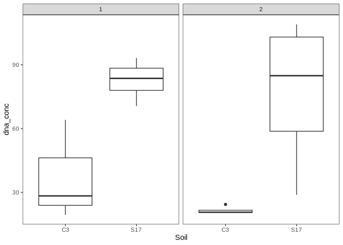<!-- -->

``` r
# Microcosm
ucosm.field.dna %>%
  distinct(Sample, Soil, Amendment, Day, Type, dna_conc) %>%
  filter(Type=="Microcosm", Amendment=="N", Day==0) %>% # unamended, day 0 samples only
  ggplot(aes(x=Soil, y=dna_conc)) +
  geom_boxplot() +
  geom_point() +
  theme_test()
```

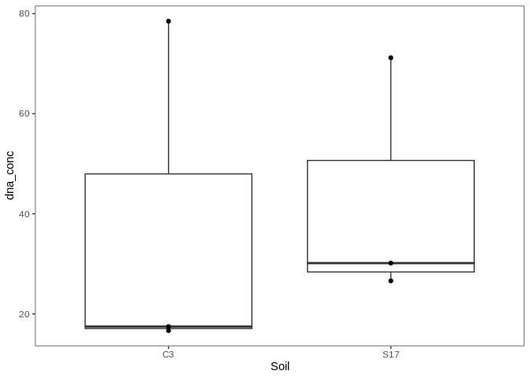<!-- -->

### Statistics

**Field soil**

  - Only testing block 1 because that’s where the soil for the
    microcosms originated
  - Simple linear model

<!-- end list -->

``` r
# Isolate data
field.block1 = ucosm.field.dna %>%
  filter(Type=="Field", Block==1) %>%
  distinct(Sample, Soil, dna_conc)

# Fit linear model
field.block1.lm = lm(dna_conc ~ Soil, field.block1)
hist(resid(field.block1.lm))
```

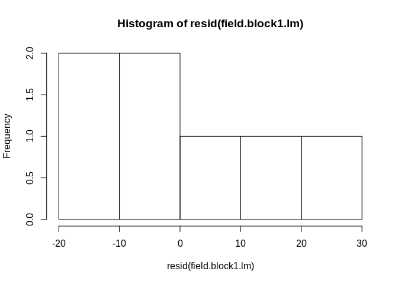<!-- -->

``` r
plot(predict(field.block1.lm), resid(field.block1.lm))
```

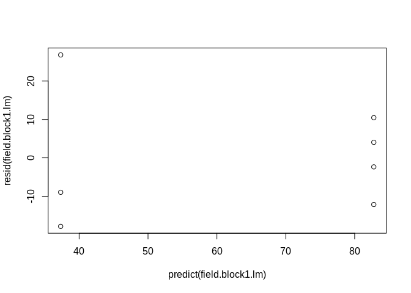<!-- -->
Assumption of normality violated, try log transform.

``` r
# Fit linear model
field.block1.lm2 = lm(log(dna_conc) ~ Soil, field.block1)
hist(resid(field.block1.lm2))
```

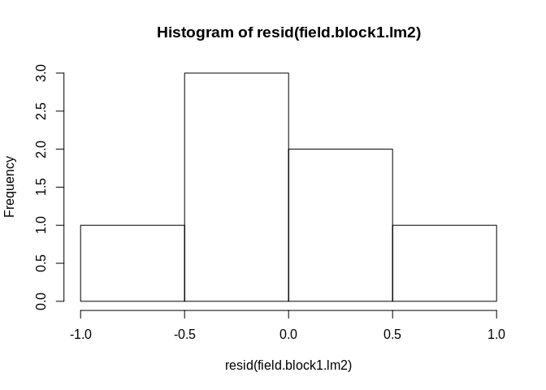<!-- -->

``` r
plot(predict(field.block1.lm2), resid(field.block1.lm2))
```

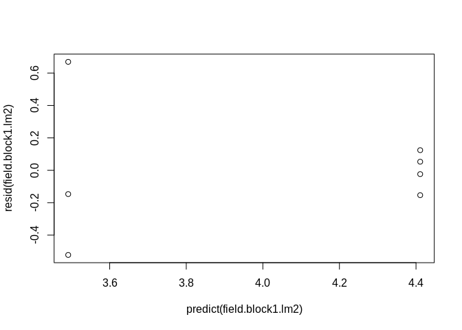<!-- -->

Improved, but hetereskedasticity is worse. I think it’s ok for
interpretation though.

``` r
summary(field.block1.lm2)
```

    ## 
    ## Call:
    ## lm(formula = log(dna_conc) ~ Soil, data = field.block1)
    ## 
    ## Residuals:
    ##        1        2        3        4        5        6        7 
    ## -0.14674 -0.52242  0.66916 -0.15357  0.05293  0.12423 -0.02359 
    ## 
    ## Coefficients:
    ##             Estimate Std. Error t value Pr(>|t|)    
    ## (Intercept)   3.4917     0.2287  15.267 2.19e-05 ***
    ## SoilS17       0.9193     0.3026   3.038   0.0288 *  
    ## ---
    ## Signif. codes:  0 '***' 0.001 '**' 0.01 '*' 0.05 '.' 0.1 ' ' 1
    ## 
    ## Residual standard error: 0.3961 on 5 degrees of freedom
    ## Multiple R-squared:  0.6487, Adjusted R-squared:  0.5784 
    ## F-statistic: 9.232 on 1 and 5 DF,  p-value: 0.0288

Significant.

**Microcosm soil**

  - Testing only day 0, unamended samples. Represent starting commnunity
    in subset of samples that showed bimodal growth rate distributions
  - simple linear model

<!-- end list -->

``` r
# Isolate data
ucosm.n0 = ucosm.field.dna %>%
  filter(Type=="Microcosm", Day==0, Amendment=="N") %>%
  distinct(Sample, Soil, dna_conc)

# Fit linear model
ucosm.n0.lm = lm(dna_conc ~ Soil, ucosm.n0)
hist(resid(ucosm.n0.lm))
```

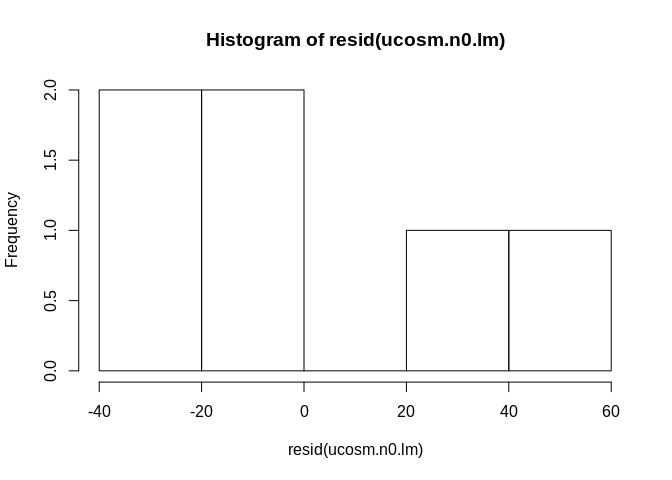<!-- -->

``` r
plot(predict(ucosm.n0.lm), resid(ucosm.n0.lm))
```

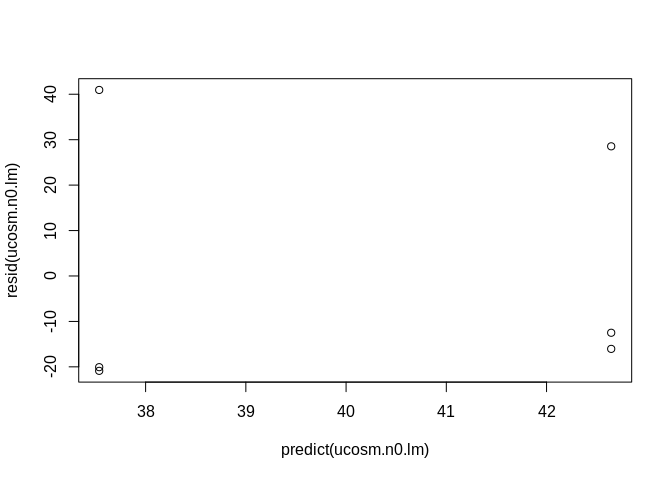<!-- -->

Same problem. Try log transform.

``` r
# Fit linear model, log transform
ucosm.n0.lm2 = lm(log(dna_conc) ~ Soil, ucosm.n0)
hist(resid(ucosm.n0.lm2))
```

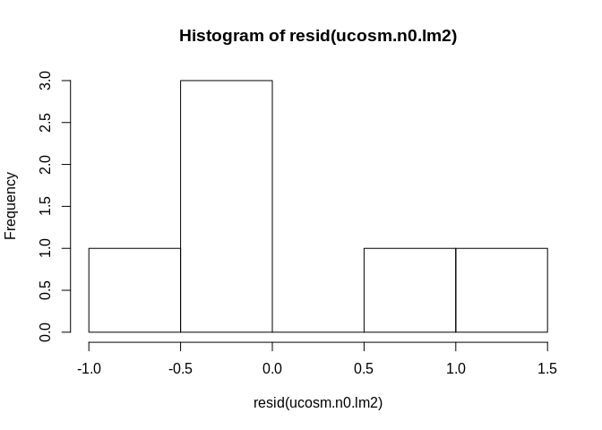<!-- -->

``` r
plot(predict(ucosm.n0.lm2), resid(ucosm.n0.lm2))
```

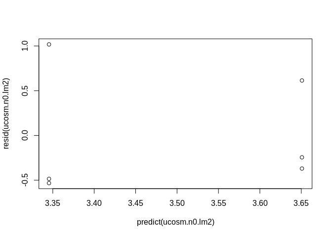<!-- -->

``` r
summary(ucosm.n0.lm2)
```

    ## 
    ## Call:
    ## lm(formula = log(dna_conc) ~ Soil, data = ucosm.n0)
    ## 
    ## Residuals:
    ##       1       2       3       4       5       6 
    ## -0.4850  1.0174 -0.5324 -0.3699  0.6144 -0.2446 
    ## 
    ## Coefficients:
    ##             Estimate Std. Error t value Pr(>|t|)   
    ## (Intercept)   3.3454     0.4211   7.944  0.00136 **
    ## SoilS17       0.3054     0.5955   0.513  0.63514   
    ## ---
    ## Signif. codes:  0 '***' 0.001 '**' 0.01 '*' 0.05 '.' 0.1 ' ' 1
    ## 
    ## Residual standard error: 0.7294 on 4 degrees of freedom
    ## Multiple R-squared:  0.06168,    Adjusted R-squared:  -0.1729 
    ## F-statistic: 0.2629 on 1 and 4 DF,  p-value: 0.6351

Not significant. The higher-level of processing and incubation period
before the start of the experiment may have equalized the microbial
communities compared to in field conditions. Despite this, I’m still
going to look into possible correlations with growth rates because
legacy effects from field soil may still be present. Sam also used
highly-processed soil in his microcosms.

# Growth rates and biomass

Going to test two metrics to test hypothesis.

1.  Proportion of growing taxa compared to total taxa present in
    community (prediction: high biomass = greater proportion of
    community grows because resources distributed more evenly)
2.  Ratio of slow and fast growers (prediction: high biomass = higher
    ratio of slow to fast)

**Proportion of taxa that grew compared to total taxa**

``` r
# Total number of taxa
ucosm.biomass = ucosm %>% 
  filter(norm_abund > 0, Amendment=="N", Day==0) %>% # filter non-present ASVs, only keep unammended samples
  group_by(Sample, Soil, Replicate) %>%
  summarize(total_asv = length(ASV))

# Total number of taxa that grew
gr.totals = gr.est %>% group_by(Soil, Replicate) %>% summarize(growing_asv = length(ASV))

# Combine dataframes and calculate metric
ucosm.propgrow = inner_join(ucosm.biomass, gr.totals) %>%
  mutate(prop_grow = growing_asv/total_asv)

# Add DNA data
ucosm.propgrow = inner_join(ucosm.propgrow, dna, by=c("Sample"="SampleID")) %>%
  rename(dna_conc = Conc., dna_kit = Box)
```

Visualize

``` r
# By soil
ucosm.propgrow %>%
  ggplot(aes(x=Soil, y=prop_grow)) +
  geom_point() +
  theme_test()
```

<!-- -->

``` r
# By DNA conc
ucosm.propgrow %>%
  ggplot(aes(x=dna_conc, y=prop_grow, color=Soil)) +
  geom_point() +
  theme_test()
```

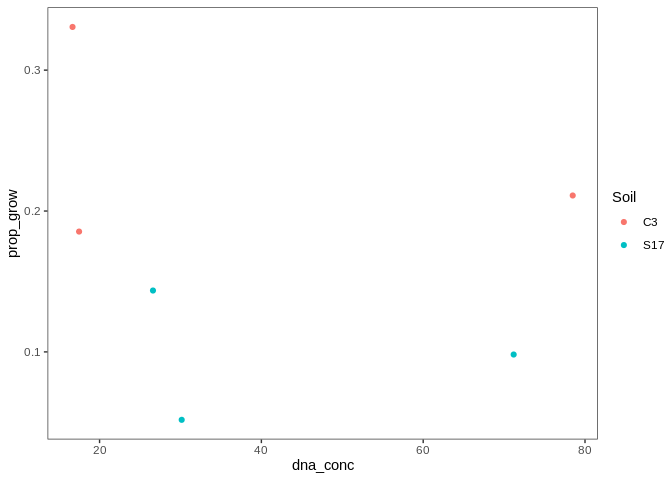<!-- -->

Statistics

  - Simple linear regression
  - proportion of community that grew vs. dna yield

<!-- end list -->

``` r
propgrow.lm = lm(prop_grow ~ dna_conc, ucosm.propgrow)
hist(resid(propgrow.lm))
```

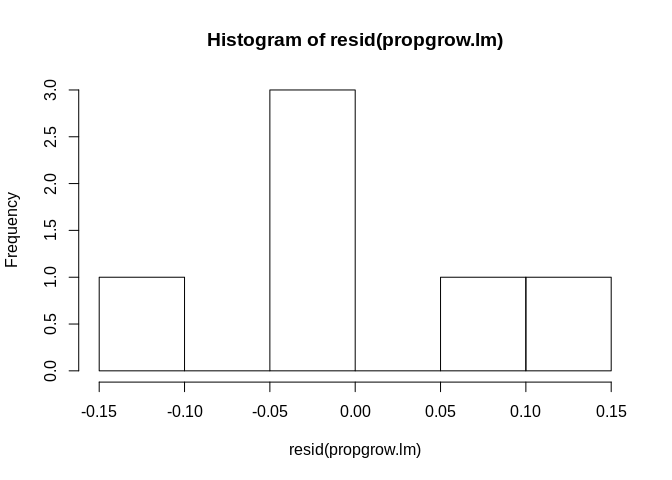<!-- -->

``` r
plot(resid(propgrow.lm), predict(propgrow.lm))
```

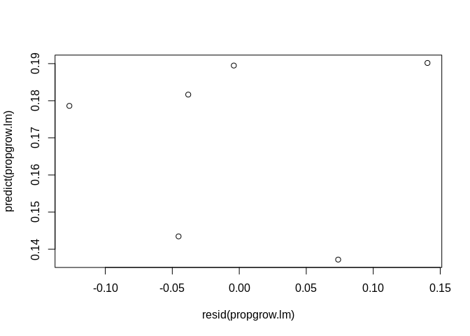<!-- -->

``` r
summary(propgrow.lm)
```

    ## 
    ## Call:
    ## lm(formula = prop_grow ~ dna_conc, data = ucosm.propgrow)
    ## 
    ## Residuals:
    ##         1         2         3         4         5         6 
    ##  0.140473 -0.004069  0.073817 -0.038091 -0.045315 -0.126815 
    ## 
    ## Coefficients:
    ##               Estimate Std. Error t value Pr(>|t|)  
    ## (Intercept)  0.2044465  0.0813881   2.512   0.0659 .
    ## dna_conc    -0.0008568  0.0017205  -0.498   0.6446  
    ## ---
    ## Signif. codes:  0 '***' 0.001 '**' 0.01 '*' 0.05 '.' 0.1 ' ' 1
    ## 
    ## Residual standard error: 0.1058 on 4 degrees of freedom
    ## Multiple R-squared:  0.05838,    Adjusted R-squared:  -0.177 
    ## F-statistic: 0.248 on 1 and 4 DF,  p-value: 0.6446

**Slow vs fast groups**

``` r
# Need sample numbers added to dataframe

# Import group labels
gr.groups = readRDS("rdata.files/gr.groups.rds")

# Label taxa in microcosm soils
gr.label.crop = gr.est %>%
  filter(Soil=="C3", Amendment=="N") %>%
  inner_join(gr.groups, by=c("Soil", "ASV"))

gr.label.succ = gr.est %>%
  filter(Soil=="S17", Amendment=="N") %>%
  inner_join(gr.groups, by=c("Soil", "ASV"))

gr.label = bind_rows(gr.label.crop, gr.label.succ)
  
gr.label.slowfast = gr.label %>%
  group_by(Soil, Replicate, group) %>% 
  summarize(group_count = length(ASV)) %>%
  pivot_wider(names_from=group, values_from=group_count) %>%
  mutate(prop_slowfast = slow/fast)

# Add sample metadata
meta = select(ucosm, Sample, Day, Amendment, Soil, Replicate) %>%
  filter(Day==0, Amendment=="N") %>%
  distinct()

gr.label.slowfast = inner_join(gr.label.slowfast, meta, by=c("Soil", "Replicate"))

# Add DNA conc. data
gr.label.slowfast = inner_join(gr.label.slowfast, dna, by=c("Sample"="SampleID")) %>%
  rename(dna_conc = Conc., dna_kit = Box)
```

Visualize

``` r
# By soil
gr.label.slowfast %>%
  ggplot(aes(x=Soil, y=prop_slowfast, color=Soil)) +
  geom_point() +
  theme_test()
```

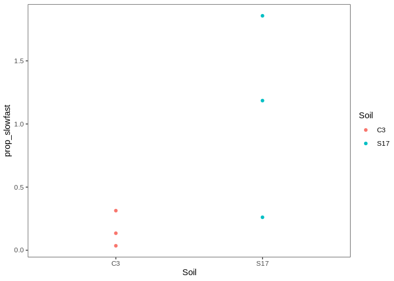<!-- -->

``` r
# vs. DNA conc.
gr.label.slowfast %>%
  ggplot(aes(x=dna_conc, y=prop_slowfast, color=Soil)) +
  geom_point() +
  theme_test()
```

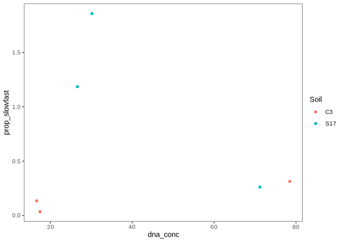<!-- -->
