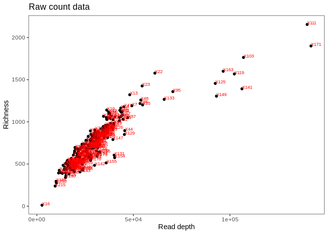
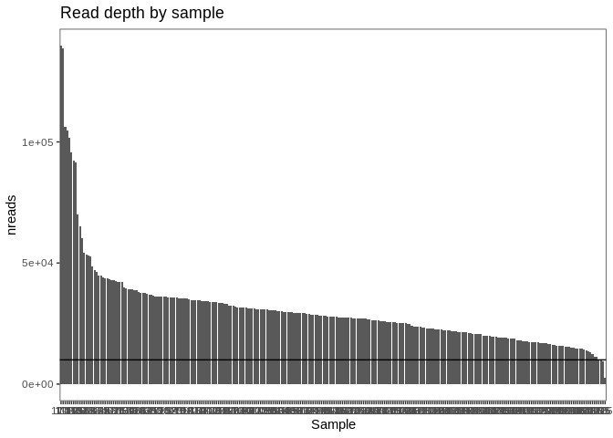

Dunlop - rarefy
================
Cassi Wattenburger
2/12/2019

# Import libraries

``` r
library("phyloseq")
library("ape")
library("vegan")
library("ggplot2")
library("reshape")
library("dplyr")

sessionInfo()
```

    ## R version 3.6.3 (2020-02-29)
    ## Platform: x86_64-pc-linux-gnu (64-bit)
    ## Running under: Ubuntu 18.04.4 LTS
    ## 
    ## Matrix products: default
    ## BLAS:   /usr/lib/x86_64-linux-gnu/blas/libblas.so.3.7.1
    ## LAPACK: /usr/lib/x86_64-linux-gnu/lapack/liblapack.so.3.7.1
    ## 
    ## locale:
    ##  [1] LC_CTYPE=en_US.UTF-8       LC_NUMERIC=C              
    ##  [3] LC_TIME=en_US.UTF-8        LC_COLLATE=en_US.UTF-8    
    ##  [5] LC_MONETARY=en_US.UTF-8    LC_MESSAGES=en_US.UTF-8   
    ##  [7] LC_PAPER=en_US.UTF-8       LC_NAME=C                 
    ##  [9] LC_ADDRESS=C               LC_TELEPHONE=C            
    ## [11] LC_MEASUREMENT=en_US.UTF-8 LC_IDENTIFICATION=C       
    ## 
    ## attached base packages:
    ## [1] stats     graphics  grDevices utils     datasets  methods   base     
    ## 
    ## other attached packages:
    ## [1] dplyr_1.1.0     reshape_0.8.8   ggplot2_3.4.1   vegan_2.5-7    
    ## [5] lattice_0.20-41 permute_0.9-5   ape_5.5         phyloseq_1.30.0
    ## 
    ## loaded via a namespace (and not attached):
    ##  [1] tidyselect_1.2.0    xfun_0.28           reshape2_1.4.4     
    ##  [4] splines_3.6.3       rhdf5_2.30.1        generics_0.1.1     
    ##  [7] colorspace_2.0-2    vctrs_0.5.2         htmltools_0.5.4    
    ## [10] stats4_3.6.3        mgcv_1.8-31         yaml_2.2.1         
    ## [13] survival_3.1-12     utf8_1.2.2          rlang_1.0.6        
    ## [16] pillar_1.6.4        withr_2.5.0         glue_1.6.2         
    ## [19] BiocGenerics_0.32.0 foreach_1.5.2       lifecycle_1.0.3    
    ## [22] plyr_1.8.6          stringr_1.5.0       zlibbioc_1.32.0    
    ## [25] Biostrings_2.54.0   munsell_0.5.0       gtable_0.3.0       
    ## [28] codetools_0.2-16    evaluate_0.14       Biobase_2.46.0     
    ## [31] knitr_1.36          IRanges_2.20.2      fastmap_1.1.0      
    ## [34] biomformat_1.14.0   parallel_3.6.3      fansi_0.5.0        
    ## [37] Rcpp_1.0.8.3        scales_1.2.1        S4Vectors_0.24.4   
    ## [40] jsonlite_1.7.2      XVector_0.26.0      digest_0.6.28      
    ## [43] stringi_1.7.5       grid_3.6.3          ade4_1.7-18        
    ## [46] cli_3.6.0           tools_3.6.3         magrittr_2.0.1     
    ## [49] tibble_3.1.6        cluster_2.1.4       crayon_1.4.2       
    ## [52] pkgconfig_2.0.3     MASS_7.3-51.6       ellipsis_0.3.2     
    ## [55] Matrix_1.5-3        data.table_1.14.2   rmarkdown_2.11     
    ## [58] rstudioapi_0.13     iterators_1.0.14    Rhdf5lib_1.8.0     
    ## [61] R6_2.5.1            multtest_2.42.0     igraph_1.2.8       
    ## [64] nlme_3.1-147        compiler_3.6.3

# Import raw data

``` r
# import count table, taxonomy table, tree, metadata
# growthrate.counts.finalv2.tsv is the same as the original, but I fixe a # in the header that screwed things up
otu <- read.table(file="/home/cassi/dunlop_popdynamics/output/growthrate.counts.finalv2.tsv", sep = '\t', header=TRUE)
tax <- read.table(file="/home/cassi/dunlop_popdynamics/output/growthrate.taxonomy.final.tsv", sep = '\t', header=TRUE)
meta <- read.table(file="../metadata/growthrate_metadata.tsv", sep = '\t', header=TRUE)
tree <- read_tree("/home/cassi/dunlop_popdynamics/output/growthrate.tree.final.nwk")
```

``` r
# time point info for microcosm data
tp <- read.csv("../metadata/growthrate_timepoint_metadata.csv")
meta <- merge(meta, tp, by=1)

# experiment metadata (field sample or microcosm sample?)
meta <- mutate(meta, Experiment=(ifelse(is.na(Cammend), paste("Field"), paste("Microcosm"))))
```

``` r
# remove sequencing controls
otu.noctrl <- otu[, -which(names(otu) %in% c("X261","X262","X263","X264","X265","X266","X267","X268","X269","X270",
                                             "X271","X272","X273","X274","X275","X276","X277","X278","X279","X280",
                                             "X281","X282","X283","X284","X285","X286","X287"))]
```

# Compare min/max read depth

``` r
# see the ratio of largest to smallest seq depth
# min and max sequencing depth
rownames(otu.noctrl) <- otu.noctrl[,1]
otu.noctrl <- otu.noctrl[,-1]
otu.noctrl.trans <- t(otu.noctrl)
depth <- rowSums(otu.noctrl.trans)
min(depth)
max(depth)
min(depth)/max(depth)
```

That’s a huge desparity in read depth. Rarefication may be the best
solution compared to CSS normalization; CSS normalization can’t correct
for the correlation b/w richness and read depth, but rarefication can.

``` r
# calculate richness of each sample
otu.noctrl.trans <- t(otu.noctrl)
rich <- specnumber(otu.noctrl.trans) 
depth.df <- as.data.frame(depth)
rich.df <- as.data.frame(rich)
depth.rich <- merge(depth.df, rich.df, by=0)
```

# Richness by read depth bias

``` r
ggplot(depth.rich, aes(x=depth, y=rich)) +
  geom_point() +
  labs(title="Raw count data", x="Read depth", y="Richness") +
  geom_text(aes(label=Row.names), hjust=0, vjust=0, size=2.5, color="red") +
  theme_test()
```

<!-- -->

I’ll rarefy the
data.

# Create phyloseq object

``` r
# Reformat otu count, taxonomy, metadata dataframes so that phyloseq accepts them
rownames(otu) <- otu[,1]
otu <- otu[,-1]
#rownames(otu) <- sort(rownames(otu)) #!!!!!!!!!!!!! THIS IS A PROBLEM, doesn't sort rest of dataframe!!!
colnames(otu) <- gsub("X", "sa", colnames(otu))
otu.m <- as.matrix(otu)
rownames(tax) <- tax[,1]
tax <- tax[,-1] 
#rownames(tax) <- sort(rownames(tax)) #!!!!!!!!!!!!! THIS IS A PROBLEM, doesn't sort rest of dataframe!!!
tax.m <- as.matrix(tax)
rownames(meta) <- meta[,1]

# Create phyloseq object
OTU <- otu_table(otu.m,taxa_are_rows=TRUE)
TAX <- tax_table(tax.m)
SAM <- sample_data(meta, errorIfNULL=TRUE)
TREE <- tree
physeq.raw <- phyloseq(OTU, TAX, TREE, SAM)
```

Raw data phyloseq object:

``` r
physeq.raw
```

    ## phyloseq-class experiment-level object
    ## otu_table()   OTU Table:         [ 48437 taxa and 287 samples ]
    ## sample_data() Sample Data:       [ 287 samples by 10 sample variables ]
    ## tax_table()   Taxonomy Table:    [ 48437 taxa by 6 taxonomic ranks ]
    ## phy_tree()    Phylogenetic Tree: [ 48437 tips and 48188 internal nodes ]

``` r
save(physeq.raw, file="rdata.files/gr_physeq.raw.RData")
```

# Remove non-prokaryotic ASVs

Remove controls first:

``` r
# Remove controls from phyloseq object
all.raw = sample_names(physeq.raw)
remove.ctrls = c("sa261","sa262","sa263","sa264","sa265","sa266","sa267","sa268","sa269","sa270", "sa271","sa272","sa273","sa274","sa275","sa276","sa277","sa278","sa279","sa280","sa281","sa282","sa283","sa284","sa285","sa286","sa287")
keep.raw = all.raw[!(all.raw %in% remove.ctrls)]
physeq.raw.noctrl = subset_samples(physeq.raw, rownames(sample_data(physeq.raw)) %in% keep.raw)
```

Remove chloroplast, mitochondrial, unknown, and Eukaryotic domain
sequences:

``` r
# Remove chloroplasts, mitochondria, unknown domains
chloro = subset_taxa(physeq.raw.noctrl, Class=="Chloroplast")
mito = subset_taxa(physeq.raw.noctrl, Family=="Mitochondria")
unknown = subset_taxa(physeq.raw.noctrl, Domain=="Unassigned")
unknown2 = subset_taxa(physeq.raw.noctrl, Domain=="putative Unassigned")
unknown3 = subset_taxa(physeq.raw.noctrl, Domain=="putative Bacteria")
eukarya = subset_taxa(physeq.raw.noctrl, Domain=="Eukaryota")
eukarya2 = subset_taxa(physeq.raw.noctrl, Domain=="putative Eukaryota")

# Remove non-prokarotes from dataset
allnames = taxa_names(physeq.raw.noctrl)
chloronames = taxa_names(chloro)
mitonames = taxa_names(mito)
unknownnames = taxa_names(unknown)
unknownnames2 = taxa_names(unknown2)
unknownnames3 = taxa_names(unknown3)
euknames = taxa_names(eukarya)
euknames2 = taxa_names(eukarya2)
keeptaxa1 = allnames[!(allnames %in% chloronames)]
keeptaxa2 = keeptaxa1[!(keeptaxa1 %in% mitonames)]
keeptaxa3 = keeptaxa2[!(keeptaxa2 %in% unknownnames)]
keeptaxa4 = keeptaxa3[!(keeptaxa3 %in% unknownnames2)]
keeptaxa5 = keeptaxa4[!(keeptaxa4 %in% unknownnames3)]
keeptaxa6 = keeptaxa5[!(keeptaxa5 %in% euknames)]
keeptaxa7 = keeptaxa6[!(keeptaxa6 %in% euknames2)]
# keeptaxa7 has all the taxa names that we will keep for analysis

physeq.raw.pruned = prune_taxa(keeptaxa7, physeq.raw.noctrl)
physeq.raw.pruned
```

``` r
save(physeq.raw.pruned, file="../rdata.files/gr_physeq.raw.pruned.RData")
```

# Rarefy

``` r
load("../rdata.files/gr_physeq.raw.pruned.RData")

# look at read depth distribution by sample
reads.raw = data.frame(nreads = sample_sums(physeq.raw.pruned))
sam = data.frame(sample_data(physeq.raw.pruned))
read.sam <- merge(reads.raw, sam, by=0)
```

``` r
ggplot(read.sam, aes(x=reorder(SampleID, -nreads), y=nreads)) +
  geom_bar(stat="identity") +
  ggtitle("Read depth by sample") +
  labs(x="Sample") +
  geom_hline(yintercept=10000) +
  theme_test()
```

<!-- -->

Black line is at 10K reads.

Samples under 5k-12k reads:

``` r
nrow(subset(read.sam, nreads<5000))
```

    ## [1] 1

``` r
nrow(subset(read.sam, nreads<6000))
```

    ## [1] 1

``` r
nrow(subset(read.sam, nreads<7000))
```

    ## [1] 1

``` r
nrow(subset(read.sam, nreads<8000))
```

    ## [1] 1

``` r
nrow(subset(read.sam, nreads<9000))
```

    ## [1] 1

``` r
nrow(subset(read.sam, nreads<10000))
```

    ## [1] 3

``` r
nrow(subset(read.sam, nreads<11000))
```

    ## [1] 4

``` r
nrow(subset(read.sam, nreads<12000))
```

    ## [1] 6

I’ll rarefy to 9,000 taxa per sample, and lose 1 sample.

Rarefied dataset:

``` r
physeq.rarefy = rarefy_even_depth(physeq.raw.pruned, 9000, rngseed=2018)
```

Sample 16 was lost due to low read depth.

``` r
save(physeq.rarefy, file="../rdata.files/gr_physeq.rarefy.RData")
```
