Dunlop - growth metrics by treatment
================
Cassandra Wattenburger
2/13/2021

# Import libraries

``` r
library(tidyverse)
library(cowplot)
library(data.table)
library(phyloseq)
library(lmerTest)

sessionInfo()
```

    ## R version 3.6.3 (2020-02-29)
    ## Platform: x86_64-pc-linux-gnu (64-bit)
    ## Running under: Ubuntu 18.04.4 LTS
    ## 
    ## Matrix products: default
    ## BLAS:   /usr/lib/x86_64-linux-gnu/blas/libblas.so.3.7.1
    ## LAPACK: /usr/lib/x86_64-linux-gnu/lapack/liblapack.so.3.7.1
    ## 
    ## locale:
    ##  [1] LC_CTYPE=en_US.UTF-8       LC_NUMERIC=C              
    ##  [3] LC_TIME=en_US.UTF-8        LC_COLLATE=en_US.UTF-8    
    ##  [5] LC_MONETARY=en_US.UTF-8    LC_MESSAGES=en_US.UTF-8   
    ##  [7] LC_PAPER=en_US.UTF-8       LC_NAME=C                 
    ##  [9] LC_ADDRESS=C               LC_TELEPHONE=C            
    ## [11] LC_MEASUREMENT=en_US.UTF-8 LC_IDENTIFICATION=C       
    ## 
    ## attached base packages:
    ## [1] stats     graphics  grDevices utils     datasets  methods   base     
    ## 
    ## other attached packages:
    ##  [1] lmerTest_3.1-3    lme4_1.1-27.1     Matrix_1.5-3      phyloseq_1.30.0  
    ##  [5] data.table_1.14.2 cowplot_1.1.1     forcats_0.5.1     stringr_1.5.0    
    ##  [9] dplyr_1.1.0       purrr_1.0.1       readr_2.1.0       tidyr_1.3.0      
    ## [13] tibble_3.1.6      ggplot2_3.4.1     tidyverse_1.3.1  
    ## 
    ## loaded via a namespace (and not attached):
    ##  [1] nlme_3.1-147        fs_1.5.0            lubridate_1.8.0    
    ##  [4] httr_1.4.2          numDeriv_2016.8-1.1 tools_3.6.3        
    ##  [7] backports_1.3.0     vegan_2.5-7         utf8_1.2.2         
    ## [10] R6_2.5.1            mgcv_1.8-31         DBI_1.1.1          
    ## [13] BiocGenerics_0.32.0 colorspace_2.0-2    permute_0.9-5      
    ## [16] ade4_1.7-18         withr_2.5.0         tidyselect_1.2.0   
    ## [19] compiler_3.6.3      cli_3.6.0           rvest_1.0.2        
    ## [22] Biobase_2.46.0      xml2_1.3.2          scales_1.2.1       
    ## [25] digest_0.6.28       minqa_1.2.4         rmarkdown_2.11     
    ## [28] XVector_0.26.0      pkgconfig_2.0.3     htmltools_0.5.4    
    ## [31] dbplyr_2.1.1        fastmap_1.1.0       rlang_1.0.6        
    ## [34] readxl_1.3.1        rstudioapi_0.13     generics_0.1.1     
    ## [37] jsonlite_1.7.2      magrittr_2.0.1      biomformat_1.14.0  
    ## [40] Rcpp_1.0.8.3        munsell_0.5.0       S4Vectors_0.24.4   
    ## [43] Rhdf5lib_1.8.0      fansi_0.5.0         ape_5.5            
    ## [46] lifecycle_1.0.3     stringi_1.7.5       yaml_2.2.1         
    ## [49] MASS_7.3-51.6       zlibbioc_1.32.0     rhdf5_2.30.1       
    ## [52] plyr_1.8.6          grid_3.6.3          parallel_3.6.3     
    ## [55] crayon_1.4.2        lattice_0.20-41     Biostrings_2.54.0  
    ## [58] haven_2.4.3         splines_3.6.3       multtest_2.42.0    
    ## [61] hms_1.1.1           knitr_1.36          pillar_1.6.4       
    ## [64] igraph_1.2.8        boot_1.3-25         reshape2_1.4.4     
    ## [67] codetools_0.2-16    stats4_3.6.3        reprex_2.0.1       
    ## [70] glue_1.6.2          evaluate_0.14       modelr_0.1.8       
    ## [73] nloptr_1.2.2.3      vctrs_0.5.2         tzdb_0.2.0         
    ## [76] foreach_1.5.2       cellranger_1.1.0    gtable_0.3.0       
    ## [79] assertthat_0.2.1    xfun_0.28           broom_0.7.10       
    ## [82] survival_3.1-12     iterators_1.0.14    IRanges_2.20.2     
    ## [85] cluster_2.1.4       ellipsis_0.3.2

``` r
rm(list=ls())
```

# Import growth data

``` r
growth <- readRDS("../rdata.files/gr_gr.paprica.clean.rds")
```

# Calculate community-level parameters:

Average across ASVs to get a value for each replicate

``` r
# Replicate averages
growth.trt <- growth %>%
  group_by(Soil, Amendment, Replicate) %>%
  summarize(start_day = mean(start_day),
            end_day = mean(end_day),
            start_abund_corr = mean(start_abund/n16S, na.rm=TRUE),
            change_abund_corr = mean((end_abund-start_abund)/n16S, na.rm=TRUE),
            k = mean(k),
            g = mean(g),
            n16S = mean(n16S, na.rm=TRUE)) %>% # archaea have no 16S estimates in this version of PAPRICA
  ungroup()
```

Description:

``` r
growth_overall <- growth %>%
  summarize(min_start_day = min(start_day),
            max_start_day = max(start_day),
            mean_start_day = mean(start_day),
            sd_start_day = sd(start_day),
            min_end_day = min(end_day),
            max_end_day = max(end_day),
            mean_end_day = mean(end_day),
            sd_end_day = sd(end_day),
            min_g = min(g),
            max_g = max(g),
            mean_g = mean(g),
            sd_g = sd(g)) %>% 
  ungroup()

growth_overall
```

    ##   min_start_day max_start_day mean_start_day sd_start_day min_end_day
    ## 1             0            21       1.415019     3.225131       0.667
    ##   max_end_day mean_end_day sd_end_day     min_g   max_g   mean_g     sd_g
    ## 1          50     11.98725    12.9648 0.7039976 63.5031 5.043394 6.276538

# Start of growth window

The day of the start of the growth window is being used as a proxy for
lag time. The later a growth window starts, the longer lag the bacteria
experienced before starting growth.

``` r
growth.trt %>%
  ggplot(aes(x=Soil, y=start_day, color=Amendment)) +
  geom_point() +
  labs(title="Start of growth", y="Day") +
  theme_test()
```

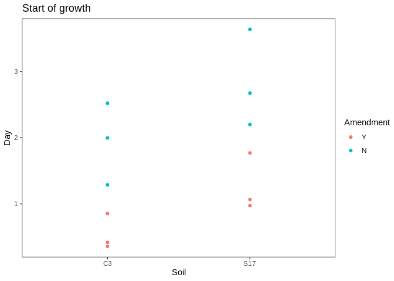<!-- -->

**Statistics**

ANOVA

``` r
strtday.trt.lm = lm(start_day ~ Soil + Amendment + Soil*Amendment, data=growth.trt)
hist(resid(strtday.trt.lm)) # check normality
```

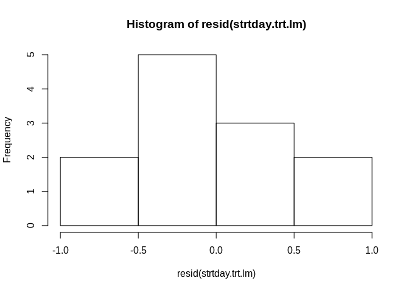<!-- -->

``` r
plot(predict(strtday.trt.lm), resid(strtday.trt.lm)) # check heteroskedasticity
```

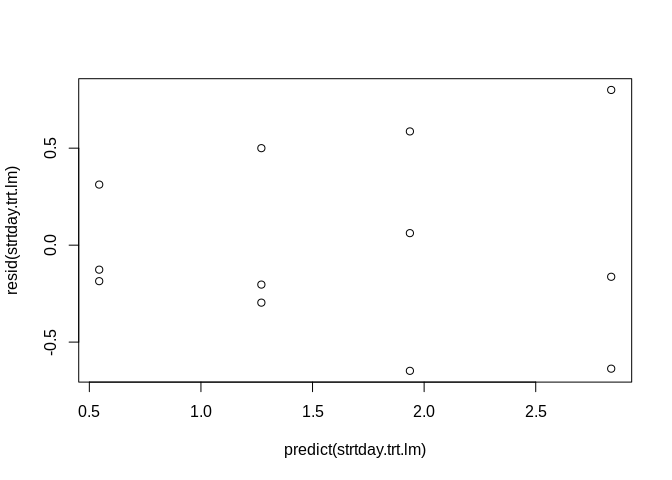<!-- -->

``` r
anova(strtday.trt.lm)
```

    ## Analysis of Variance Table
    ## 
    ## Response: start_day
    ##                Df Sum Sq Mean Sq F value  Pr(>F)   
    ## Soil            1 1.9891  1.9891  6.7201 0.03200 * 
    ## Amendment       1 6.5688  6.5688 22.1926 0.00152 **
    ## Soil:Amendment  1 0.0231  0.0231  0.0779 0.78720   
    ## Residuals       8 2.3679  0.2960                   
    ## ---
    ## Signif. codes:  0 '***' 0.001 '**' 0.01 '*' 0.05 '.' 0.1 ' ' 1

Post hoc:

  - Cropped water vs C-amended
  - Successional water vs C-amended
  - Cropped vs successional, water
  - Cropped vs successional, C-amended

Fit simple linear model and check residuals:

``` r
# Contrasts
strtday.trt.lm1 <- lm(start_day ~ Amendment, data=growth.trt[growth.trt$Soil=="C3",], var.equal = TRUE)
hist(resid(strtday.trt.lm1)) # check normality
```

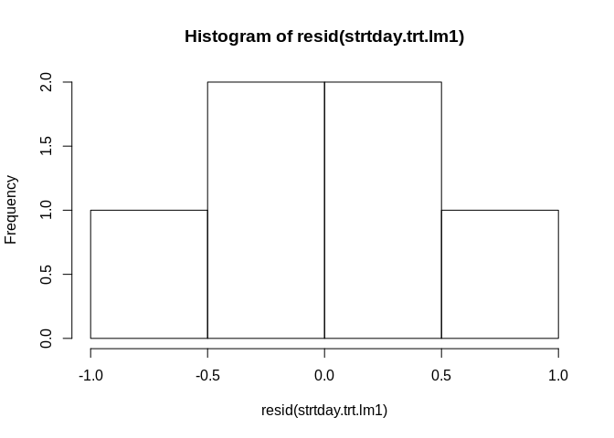<!-- -->

``` r
plot(predict(strtday.trt.lm1), resid(strtday.trt.lm1)) # check heteroskedasticity
```

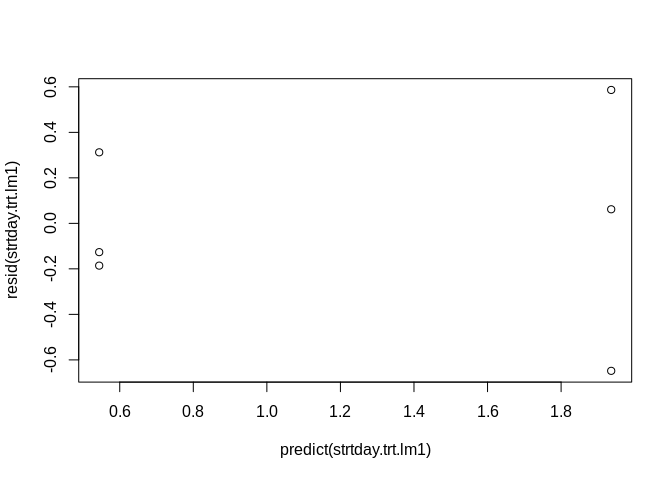<!-- -->

``` r
# Welch's t-tests
strtday.trt.welch1 <- t.test(start_day ~ Amendment, data=growth.trt[growth.trt$Soil=="C3",], var.equal = FALSE)
strtday.trt.welch2 <- t.test(start_day ~ Amendment, data=growth.trt[growth.trt$Soil=="S17",], var.equal = FALSE)
strtday.trt.welch3 <- t.test(start_day ~ Soil, data=growth.trt[growth.trt$Amendment=="Y",], var.equal = FALSE)
strtday.trt.welch4 <- t.test(start_day ~ Soil, data=growth.trt[growth.trt$Amendment=="N",], var.equal = FALSE)

# Adjust p-values
strtday.trt.adjpvals <- p.adjust(p <- c(strtday.trt.welch1$p.value, strtday.trt.welch2$p.value, 
                                        strtday.trt.welch3$p.value, strtday.trt.welch4$p.value),
                                        method="BH", n=length(p))

# Results
strtday.trt.results <- data.frame(contrast = c("Cropped, water vs C-amended", 
                                               "Successional, water vs C-amended", 
                                               "C-amended, cropped vs successional", 
                                               "Water, cropped vs successional"), pvals = strtday.trt.adjpvals)
strtday.trt.results
```

    ##                             contrast      pvals
    ## 1        Cropped, water vs C-amended 0.08894385
    ## 2   Successional, water vs C-amended 0.08894385
    ## 3 C-amended, cropped vs successional 0.11014070
    ## 4     Water, cropped vs successional 0.18070172

# End of growth window

``` r
growth.trt %>%
  ggplot(aes(x=Soil, y=end_day, color=Amendment)) +
  geom_point(alpha=0.5) +
  labs(title="End of growth", y="Day") +
  theme_test()
```

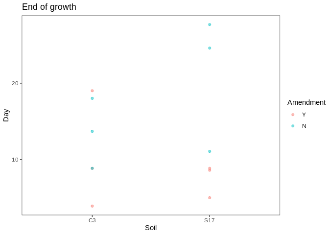<!-- -->

**Statistics**

ANOVA

``` r
endday.trt.lm = lm(end_day ~ Soil + Amendment + Soil*Amendment, data=growth.trt)
hist(resid(endday.trt.lm)) # check normality
```

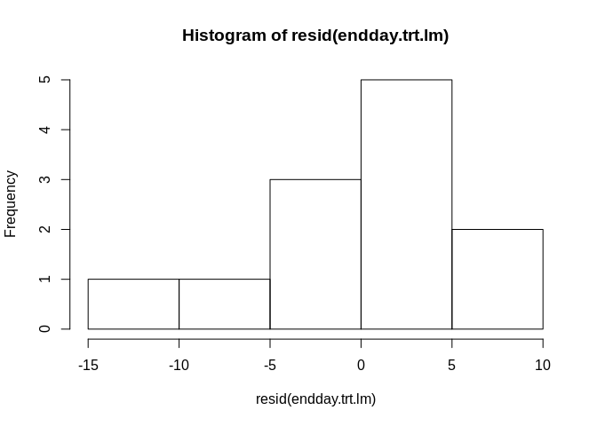<!-- -->

``` r
plot(predict(endday.trt.lm), resid(endday.trt.lm))
```

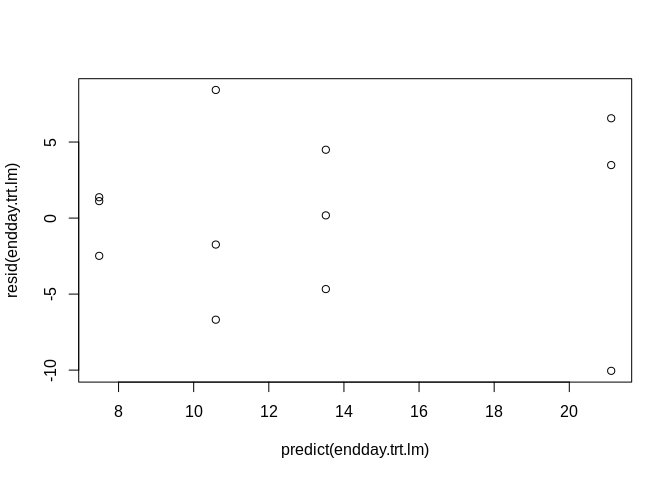<!-- -->

``` r
anova(endday.trt.lm)
```

    ## Analysis of Variance Table
    ## 
    ## Response: end_day
    ##                Df Sum Sq Mean Sq F value  Pr(>F)  
    ## Soil            1  15.14  15.141  0.3714 0.55915  
    ## Amendment       1 205.68 205.683  5.0453 0.05489 .
    ## Soil:Amendment  1  85.90  85.898  2.1070 0.18468  
    ## Residuals       8 326.14  40.768                  
    ## ---
    ## Signif. codes:  0 '***' 0.001 '**' 0.01 '*' 0.05 '.' 0.1 ' ' 1

End of growth is not affected by soil or amendment. Trends are similar
to start of growth data, though.

# Growth rate

``` r
growth.trt %>%
  ggplot(aes(x=Soil, y=k, color=Amendment)) +
  geom_point(alpha=0.5) +
  labs(title="Specific growth rate", y="k") +
  theme_test()
```

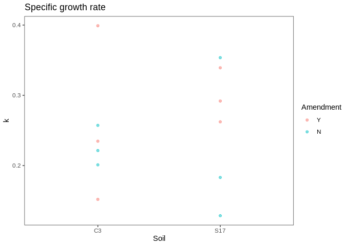<!-- -->

**Statistics**

ANOVA

``` r
k.trt.lm = lm(k ~ Soil + Amendment + Soil*Amendment, data=growth.trt)
hist(resid(k.trt.lm)) # check normality
```

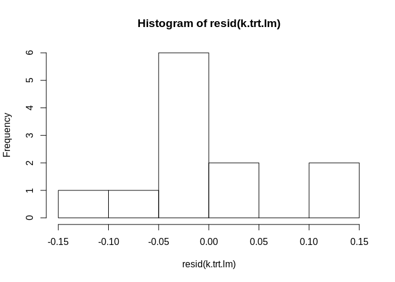<!-- -->

``` r
plot(predict(k.trt.lm), resid(k.trt.lm))
```

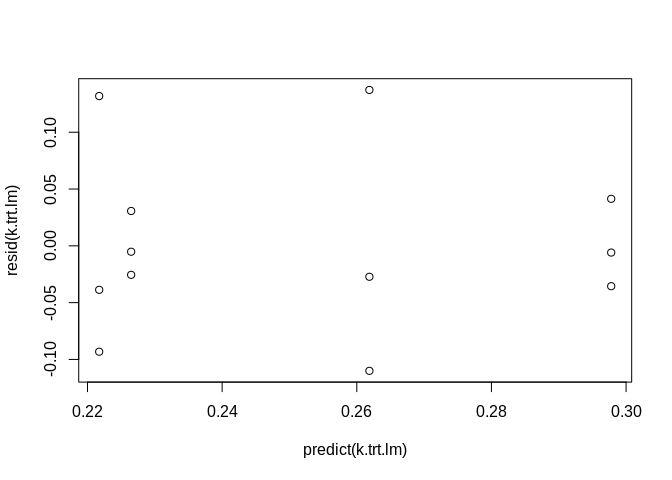<!-- -->

``` r
anova(k.trt.lm)
```

    ## Analysis of Variance Table
    ## 
    ## Response: k
    ##                Df   Sum Sq   Mean Sq F value Pr(>F)
    ## Soil            1 0.000729 0.0007287  0.0913 0.7703
    ## Amendment       1 0.009314 0.0093144  1.1667 0.3116
    ## Soil:Amendment  1 0.001240 0.0012403  0.1554 0.7038
    ## Residuals       8 0.063871 0.0079839

Trends almost support second hypothesis, but data is too variable.

# Change in abundance

  - 16S copy number corrected

<!-- end list -->

``` r
growth.trt %>%
  ggplot(aes(x=Soil, y=change_abund_corr, color=Amendment)) +
  geom_point(alpha=0.5) +
  labs(title="Change in abundance", y="change in abundance") +
  theme_test()
```

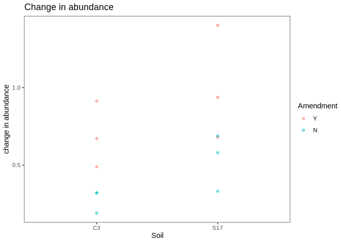<!-- -->

**Statistics**

ANOVA

  - log transformation improves
heteroskedasticity

<!-- end list -->

``` r
changeabund.trt.lm = lm(change_abund_corr ~ Soil + Amendment + Soil:Amendment, data=growth.trt)
hist(resid(changeabund.trt.lm)) # check normality
```

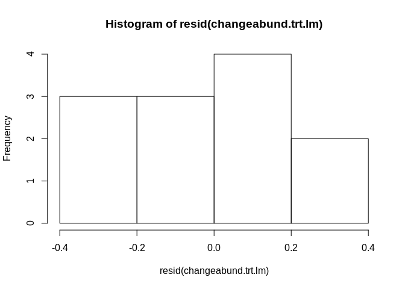<!-- -->

``` r
plot(predict(changeabund.trt.lm), resid(changeabund.trt.lm)) # check heteroskedasticity
```

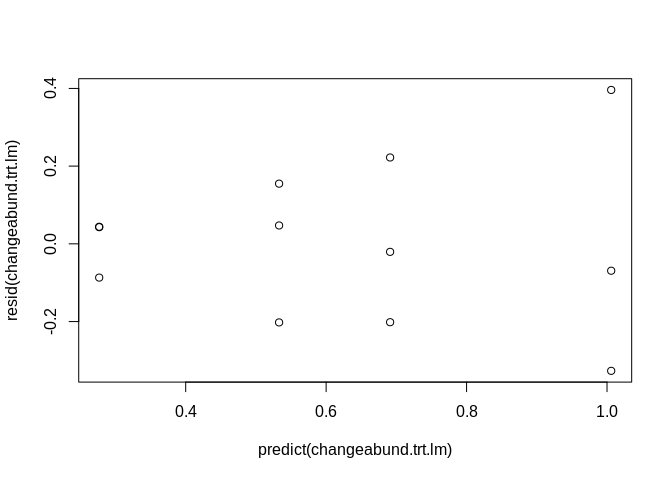<!-- -->

``` r
anova(changeabund.trt.lm)
```

    ## Analysis of Variance Table
    ## 
    ## Response: change_abund_corr
    ##                Df  Sum Sq Mean Sq F value  Pr(>F)  
    ## Soil            1 0.24455 0.24455  4.4731 0.06735 .
    ## Amendment       1 0.59035 0.59035 10.7981 0.01109 *
    ## Soil:Amendment  1 0.00258 0.00258  0.0472 0.83344  
    ## Residuals       8 0.43737 0.05467                  
    ## ---
    ## Signif. codes:  0 '***' 0.001 '**' 0.01 '*' 0.05 '.' 0.1 ' ' 1

Post hoc:

  - Cropped water vs C-amended
  - Successional water vs C-amended

Try simple linear model and check residuals

``` r
# Cropped water vs C-amended
test1 <- lm(change_abund_corr ~ Amendment, data=growth.trt[growth.trt$Soil=="C3",])
hist(resid(test1))
```

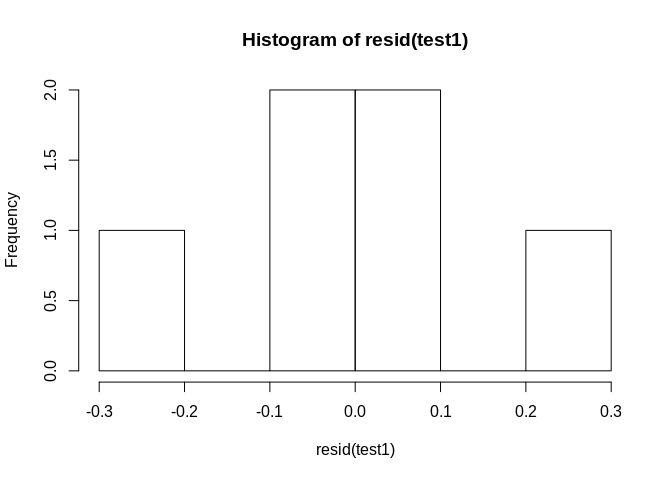<!-- -->

``` r
plot(predict(test1), resid(test1))
```

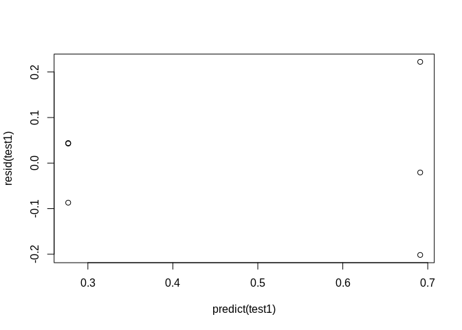<!-- -->

``` r
# log transform
test2 <- lm(log(change_abund_corr) ~ Amendment, data=growth.trt[growth.trt$Soil=="C3",])
hist(resid(test2))
```

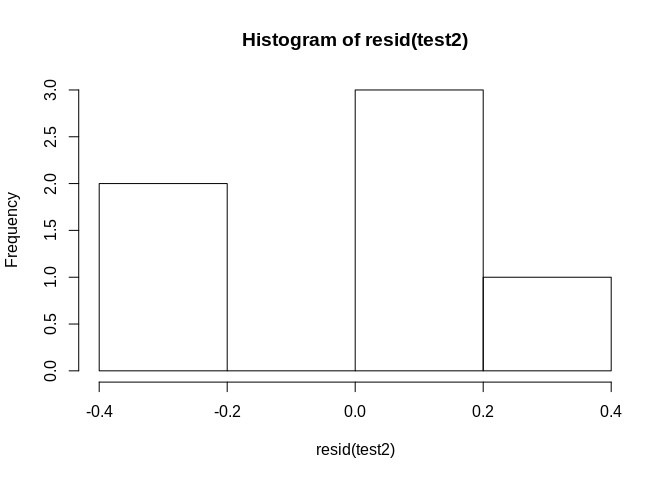<!-- -->

``` r
plot(predict(test2), resid(test2))
```

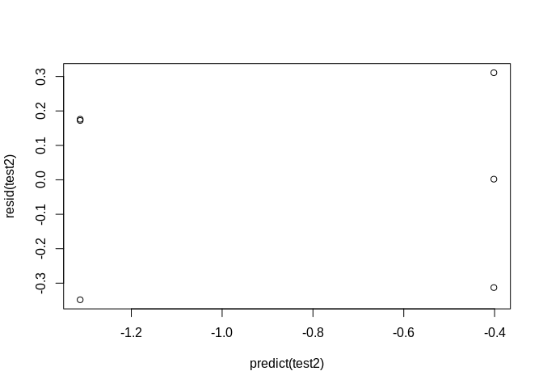<!-- -->

``` r
# Cropped water vs C-amended
changeabund.trt.ph.welch1 <-  t.test(change_abund_corr ~ Amendment, data=growth.trt[growth.trt$Soil=="C3",], var.equal=FALSE)

# Successional water vs C-amended
changeabund.trt.ph.welch2 <-  t.test(change_abund_corr ~ Amendment, data=growth.trt[growth.trt$Soil=="S17",], var.equal=FALSE)

# Adjust p-values
changeabund.trt.ph.padj <- p.adjust(p <- c(changeabund.trt.ph.welch1$p.value, changeabund.trt.ph.welch2$p.value),
                    method = "BH", n=length(p))

# Show results
data.frame("Contrast" = c("Cropped, water vs C-amended", "Successional, water vs C-amended"),
           "p_value" = changeabund.trt.ph.padj)
```

    ##                           Contrast   p_value
    ## 1      Cropped, water vs C-amended 0.1289584
    ## 2 Successional, water vs C-amended 0.1411899

# Predicted 16S copy number

``` r
# Visualize
growth.trt %>%
  ggplot(aes(x=Soil, y=n16S)) +
  geom_jitter(aes(shape=Amendment), width=0.1) +
  scale_shape_manual(values=c(19,1)) +
  theme_test()
```

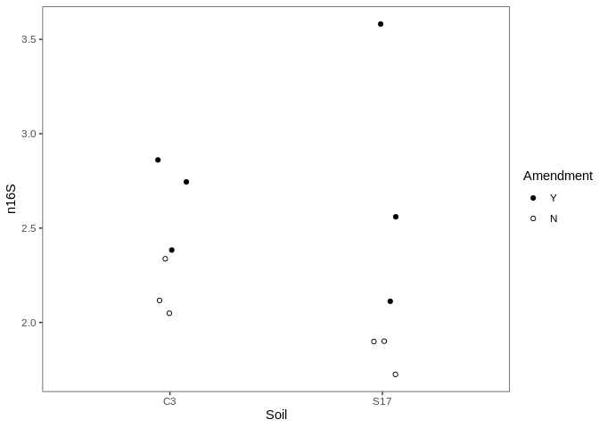<!-- -->

**Statistics**

ANOVA

``` r
growth.16s.lm = lm(n16S ~ Soil + Amendment + Soil:Amendment, data=growth.trt)
hist(resid(growth.16s.lm)) # check normality
```

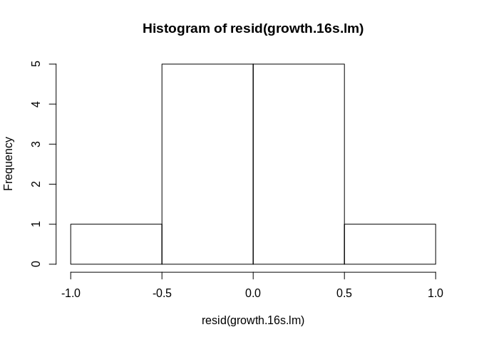<!-- -->

``` r
plot(predict(growth.16s.lm), resid(growth.16s.lm)) # check heteroskedasticity
```

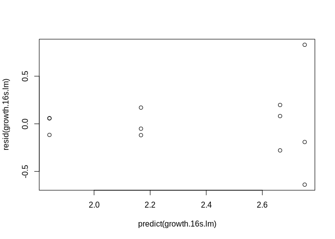<!-- -->

``` r
anova(growth.16s.lm)
```

    ## Analysis of Variance Table
    ## 
    ## Response: n16S
    ##                Df  Sum Sq Mean Sq F value  Pr(>F)  
    ## Soil            1 0.04267 0.04267  0.2581 0.62513  
    ## Amendment       1 1.48312 1.48312  8.9720 0.01719 *
    ## Soil:Amendment  1 0.12861 0.12861  0.7780 0.40348  
    ## Residuals       8 1.32244 0.16531                  
    ## ---
    ## Signif. codes:  0 '***' 0.001 '**' 0.01 '*' 0.05 '.' 0.1 ' ' 1

# Figures

``` r
plot <- growth.trt %>%
  pivot_longer(c(start_day, change_abund_corr, k, n16S), names_to = "growth_metric") %>%
  mutate(Soil = fct_recode(Soil, Cropped = "C3", Successional = "S17"),
         Amendment = fct_recode(Amendment, `Water + Resources` = "Y", `Water only`= "N"),
         growth_metric = fct_relevel(growth_metric, c("start_day", "change_abund", "k", "n16S"))) %>%
  ggplot(aes(y=value, x=Soil)) +
  geom_jitter(aes(shape=Amendment), width=0.1) +
  scale_shape_manual(values=c(19,1)) +
  facet_wrap(~growth_metric, scales="free", nrow=1) +
  theme_classic() +
  theme(
        axis.title = element_blank(),
        text = element_text(size=9),
        strip.text.x = element_text(size = 10, hjust = 0),
        legend.position = "bottom",
        legend.title=element_blank(),
        strip.background = element_blank())
plot
```

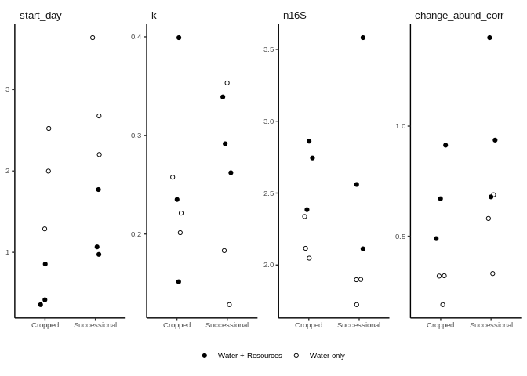<!-- -->

``` r
ggsave(plot, filename="../figures/fig_growthparams_overall.svg", units="mm", width=180, height=60, device="svg")
```
