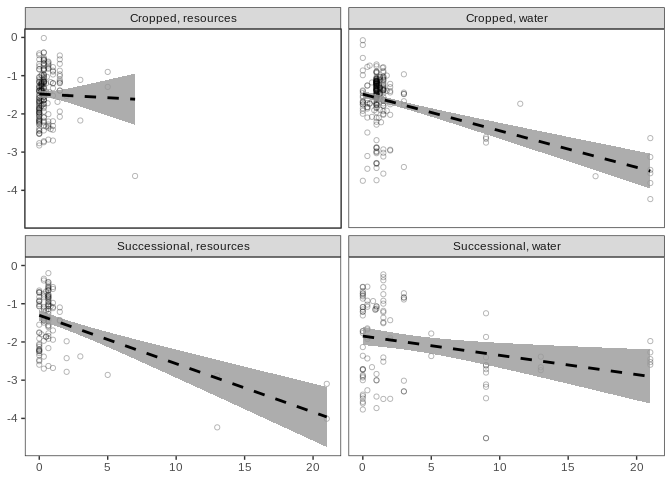

Dunlop - growth parameters analysis
================
Cassandra Wattenburger
2/13/2021

# Import libraries

``` r
library(tidyverse)
library(cowplot)

sessionInfo()
```

    ## R version 3.6.3 (2020-02-29)
    ## Platform: x86_64-pc-linux-gnu (64-bit)
    ## Running under: Ubuntu 18.04.4 LTS
    ## 
    ## Matrix products: default
    ## BLAS:   /usr/lib/x86_64-linux-gnu/blas/libblas.so.3.7.1
    ## LAPACK: /usr/lib/x86_64-linux-gnu/lapack/liblapack.so.3.7.1
    ## 
    ## locale:
    ##  [1] LC_CTYPE=en_US.UTF-8       LC_NUMERIC=C              
    ##  [3] LC_TIME=en_US.UTF-8        LC_COLLATE=en_US.UTF-8    
    ##  [5] LC_MONETARY=en_US.UTF-8    LC_MESSAGES=en_US.UTF-8   
    ##  [7] LC_PAPER=en_US.UTF-8       LC_NAME=C                 
    ##  [9] LC_ADDRESS=C               LC_TELEPHONE=C            
    ## [11] LC_MEASUREMENT=en_US.UTF-8 LC_IDENTIFICATION=C       
    ## 
    ## attached base packages:
    ## [1] stats     graphics  grDevices utils     datasets  methods   base     
    ## 
    ## other attached packages:
    ##  [1] cowplot_1.1.1   forcats_0.5.1   stringr_1.5.0   dplyr_1.1.0    
    ##  [5] purrr_1.0.1     readr_2.1.0     tidyr_1.3.0     tibble_3.1.6   
    ##  [9] ggplot2_3.4.1   tidyverse_1.3.1
    ## 
    ## loaded via a namespace (and not attached):
    ##  [1] tidyselect_1.2.0 xfun_0.28        haven_2.4.3      colorspace_2.0-2
    ##  [5] vctrs_0.5.2      generics_0.1.1   htmltools_0.5.4  yaml_2.2.1      
    ##  [9] utf8_1.2.2       rlang_1.0.6      pillar_1.6.4     withr_2.5.0     
    ## [13] glue_1.6.2       DBI_1.1.1        dbplyr_2.1.1     modelr_0.1.8    
    ## [17] readxl_1.3.1     lifecycle_1.0.3  munsell_0.5.0    gtable_0.3.0    
    ## [21] cellranger_1.1.0 rvest_1.0.2      evaluate_0.14    knitr_1.36      
    ## [25] tzdb_0.2.0       fastmap_1.1.0    fansi_0.5.0      broom_0.7.10    
    ## [29] Rcpp_1.0.8.3     backports_1.3.0  scales_1.2.1     jsonlite_1.7.2  
    ## [33] fs_1.5.0         hms_1.1.1        digest_0.6.28    stringi_1.7.5   
    ## [37] grid_3.6.3       cli_3.6.0        tools_3.6.3      magrittr_2.0.1  
    ## [41] crayon_1.4.2     pkgconfig_2.0.3  ellipsis_0.3.2   xml2_1.3.2      
    ## [45] reprex_2.0.1     lubridate_1.8.0  assertthat_0.2.1 rmarkdown_2.11  
    ## [49] httr_1.4.2       rstudioapi_0.13  R6_2.5.1         compiler_3.6.3

``` r
rm(list=ls())
```

# Import data

``` r
growth <- readRDS("../rdata.files/gr_gr.paprica.clean.rds")
```

# Population level

Average across replicates for each ASV in each treatment to produce
growth parameters for each ASV.

``` r
# ASV averages
growth_asv <- growth %>%
  group_by(Soil, Amendment, ASV, Phylum, Class, Order, Family, Genus) %>%
  summarize(start_day = mean(start_day),
            end_day = mean(end_day),
            start_abund = mean(start_abund),
            end_abund = mean(end_abund),
            change_abund = mean(end_abund-start_abund),
            start_abund_corr = mean(start_abund/n16S, na.rm=TRUE),
            change_abund_corr = mean(change_abund/n16S, na.rm=TRUE),
            k = mean(k),
            g = mean(g),
            n16S = mean(n16S),
            genome_size = mean(genome_size))
```

### Specific growth rate vs. 16S copy number

The 16S rRNA gene encodes the ribosomal RNA. Without ribosomes, growth
isn’t possible, and more copies of this gene has been correlated with
faster maximal growth rates. Does this relationship hold in-situ?

Hypothesis: Positive correlation between 16S copy number and growth rate

**Visualize**

``` r
# Visualize
growth_asv %>% ggplot(aes(x=log(k), y=log(n16S))) +
  geom_point() +
  labs(title="All data") +
  theme_test()
```

<!-- -->

``` r
growth_asv %>% ggplot(aes(x=log(k), y=log(n16S))) +
  geom_point() +
  facet_wrap(Soil~Amendment) +
  labs(title="By treatment") +
  theme_test()
```

<!-- -->

Not exactly what I expected. It appears that low copy number taxa are
also capable of fast growth, but not vice-versa. It’s true that low copy
number taxa have been observed growing rapidly, if enough ribosomes have
been produced. Could it be possible that these low copy number taxa were
already growing at the start of the incubation and didn’t have to
produce ribosomes in response to the wet-up?

**Statistics:**

Due to the odd shape, I’m going to use a non-parametric test.

Spearman correlation with permutation, because the data inherently
contains ties.

See:
<https://stats.stackexchange.com/questions/50015/spearman-correlation-in-the-presence-of-many-ties-how-to-spot-a-problem>

``` r
# Create permuted spearman correlation function
spearman_permute = function(x, y) {
  set.seed(1) # make sure it is reproducible
  perm.estimates = c()
  for (i in 1:1000) { # permute 1000 times
    perm = sample(y) # randomize response variable
    perm.test = suppressWarnings(cor.test(x, perm, method="spearman", alternative="greater")) # spearman correlation with permuted data
    perm.estimates = append(perm.estimates, perm.test$estimate) # permuted estimates
  }
  actual.test = suppressWarnings(cor.test(x, y, method="spearman", alternative="greater")) # spearman correlation with actual data
  actual.estimate = actual.test$estimate # actual data estimate (rho)
  est.exceed = sum(abs(perm.estimates) > actual.estimate) # number of permutations that exceed the non-permuted data rho
  est.equal = sum(abs(perm.estimates) == actual.estimate) # number of permutations that equal the non-permuted data rho
  permuted.pval = (est.exceed + est.equal/2) / length(perm.estimates) # proportion of exceedances: the p-value
  return(c(permuted.pval, actual.estimate)) # the p=value (expand out to include actual estimate)
}

# Tests
n16Sk.all.spearperm <- spearman_permute(log(growth_asv$n16S), log(growth_asv$k))

n16Sk.C3y.spearperm <- spearman_permute(log(growth_asv[growth_asv$Soil=="C3" & growth_asv$Amendment=="Y",]$n16S), log(growth_asv[growth_asv$Soil=="C3" & growth_asv$Amendment=="Y",]$k))

n16Sk.C3n.spearperm <- spearman_permute(log(growth_asv[growth_asv$Soil=="C3" & growth_asv$Amendment=="N",]$n16S), 
                                      log(growth_asv[growth_asv$Soil=="C3" & growth_asv$Amendment=="N",]$k))

n16Sk.S17y.spearperm <- spearman_permute(log(growth_asv[growth_asv$Soil=="S17" & growth_asv$Amendment=="Y",]$n16S), 
                                       log(growth_asv[growth_asv$Soil=="S17" & growth_asv$Amendment=="Y",]$k))

n16Sk.S17n.spearperm <- spearman_permute(log(growth_asv[growth_asv$Soil=="S17" & growth_asv$Amendment=="N",]$n16S), 
                                       log(growth_asv[growth_asv$Soil=="S17" & growth_asv$Amendment=="N",]$k))

# Multiple test correction
n16Sk.spearperm.pvals <- c(n16Sk.all.spearperm[1], n16Sk.C3y.spearperm[1], n16Sk.C3n.spearperm[1], n16Sk.S17y.spearperm[1], n16Sk.S17n.spearperm[1])
n16Sk.spearperm.padj <- p.adjust(n16Sk.spearperm.pvals, method="hochberg", n=length(n16Sk.spearperm.pvals))

# Estimates
n16Sk.spearperm.rhos <- c(n16Sk.all.spearperm[2], n16Sk.C3y.spearperm[2], n16Sk.C3n.spearperm[2], n16Sk.S17y.spearperm[2], n16Sk.S17n.spearperm[2])

# Results table
n16Sk.spearperm.results <- data.frame(Soil = c("overall", rep("C3", 2), rep("S17", 2)), Amendment=c("overall","Y","N","Y","N"), 
                                      p.adj=n16Sk.spearperm.padj, rho = n16Sk.spearperm.rhos)
n16Sk.spearperm.results
```

    ##      Soil Amendment p.adj        rho
    ## 1 overall   overall 0.005 0.16596392
    ## 2      C3         Y 0.016 0.21193302
    ## 3      C3         N 0.870 0.01046229
    ## 4     S17         Y 0.036 0.22631537
    ## 5     S17         N 0.027 0.25875620

There are weak positive correlations for most treatments except cropped
water.

## n16S vs lag time

If low copy number taxa were already growing at the start of the
experiment, there is a good chance the growth window started early as
well. Let’s investigate.

Hypothesis: No relationship

**Visualize**

``` r
# Visualize
growth_asv %>% ggplot(aes(x=start_day, y=n16S)) +
  geom_point() +
  labs(title="All data") +
  theme_test()
```

<!-- -->

``` r
growth_asv %>% ggplot(aes(x=start_day, y=n16S)) +
  geom_point() +
  facet_wrap(Soil~Amendment) +
  labs(title="By treatment") +
  theme_test()
```

<!-- -->

Indeed, most of the low copy number taxa have an early start day. Others
seem to lag - perhaps not growing before start of experiment, but did
when water/C was added?

**Model**

Might be able to fit an assymptotic model?

``` r
# Self starting asymptotic model
# expression is Asym+(R0-Asym)*exp(-exp(lrc)*input)
n16sstrt.fit <- nls(n16S ~ SSasymp(start_day, Asym, R0, lrc), data = growth_asv)
summary(n16sstrt.fit)
```

    ## 
    ## Formula: n16S ~ SSasymp(start_day, Asym, R0, lrc)
    ## 
    ## Parameters:
    ##      Estimate Std. Error t value Pr(>|t|)    
    ## Asym   1.5927     0.4779   3.332 0.000912 ***
    ## R0     2.3919     0.1237  19.341  < 2e-16 ***
    ## lrc   -1.5915     1.3103  -1.215 0.224994    
    ## ---
    ## Signif. codes:  0 '***' 0.001 '**' 0.01 '*' 0.05 '.' 0.1 ' ' 1
    ## 
    ## Residual standard error: 1.94 on 619 degrees of freedom
    ## 
    ## Number of iterations to convergence: 7 
    ## Achieved convergence tolerance: 4.601e-06
    ##   (8 observations deleted due to missingness)

``` r
# BROKEN?

# Predict values based on model
growth_asv$predict_nls <- predict(n16sstrt.fit)

# Plot with nonlinear model
growth_asv %>%
  ggplot(aes(x=start_day, y=n16S)) +
  geom_point() +
  geom_line(aes(y=predict_nls)) +
  theme_test() 
```

02/10/21 After consulting with statistician, decided that best course is
to not try to shoehorn this data into a particular model. Best to
present data graphically and build biological explanation from there.

Permutation approach:

  - Shuffle 16S copy number and start day pairings
  - Calculate average 16S copy number after day 3 (chosen as “slow”
    responders)
  - Repeat 1000x
  - See how likely actual result is based on permuted results, if the
    actual result is less than the 50th lowest average consitutes 95% CI

One way to try to establish that the pattern observed is non-random, ie
show that the tail at the end is a real signal.

``` r
actual <- growth_asv %>%
  na.omit() %>%
  filter(start_day > 3) %>%
  group_by() %>%
  summarize(avg_n16S = mean(n16S))

# Permute
perm.n16S <- c()
for (i in 1:1000) {
  dat <- growth_asv %>% na.omit()
  dat$n16S <- sample(dat$n16S, replace=FALSE) # shuffle 16S copy number column
  avg.n16S <- dat %>%
    filter(start_day > 3) %>%
    group_by() %>%
    summarize(avg_n16S = mean(n16S)) %>%
    as.numeric()
  perm.n16S <- c(perm.n16S, avg.n16S)
}

hist(perm.n16S)
```

<!-- -->

``` r
perm.n16S <- sort(perm.n16S)
actual < perm.n16S[50]
```

    ##      avg_n16S
    ## [1,]     TRUE

Statistical evidence (P \< 0.05) that the low value past day 3 isn’t
just due to random chance.

Spearman rank correlation:

``` r
cor.test(growth_asv$start_day, growth_asv$n16S, method="spearman")
```

    ## 
    ##  Spearman's rank correlation rho
    ## 
    ## data:  growth_asv$start_day and growth_asv$n16S
    ## S = 42369732, p-value = 0.1599
    ## alternative hypothesis: true rho is not equal to 0
    ## sample estimates:
    ##         rho 
    ## -0.05642077

### 16S copy number vs change in abundance

``` r
growth_asv %>%
  mutate(change_abund = end_abund - start_abund) %>% # calculate change in abundance
  ggplot(aes(x=n16S, y=log(change_abund))) +
  geom_point() +
  geom_smooth(method="lm") +
  facet_wrap(Soil~Amendment) +
  theme_test()
```

<!-- -->

16S copy number corrected:

``` r
growth_asv %>%
  ggplot(aes(x=n16S, y=log(change_abund_corr))) +
  geom_point() +
  geom_smooth(method="lm") +
  facet_wrap(Soil~Amendment) +
  theme_test()
```

<!-- -->

Negative correlations? This totally changes the result. In this case, I
think it is better to go with the corrected result, since we know that
16S copy number will affect measured abundances.

**Statistics**

``` r
# Treatments
n16S_chabund_pcor <- data.frame()
for (s in c("C3", "S17")) {
  for (a in c("Y", "N")) {
    data_sub <- filter(growth_asv, Soil==s & Amendment==a)
    pcor <- cor.test(log(data_sub$change_abund_corr), data_sub$n16S, method="pearson")
    this_row <-  data.frame("Soil"=s, "Amendment"=a, "estimate"=pcor$estimate, "pvalue"=pcor$p.value)
    n16S_chabund_pcor <- bind_rows(n16S_chabund_pcor, this_row)
  }
}

# Multiple test correction
padj <- p.adjust(n16S_chabund_pcor$pvalue, method="holm", n=4)
n16S_chabund_pcor <- bind_cols(n16S_chabund_pcor, padj=padj)

# Results
n16S_chabund_pcor
```

    ##         Soil Amendment   estimate       pvalue         padj
    ## cor...1   C3         Y -0.2487544 4.385770e-04 1.315731e-03
    ## cor...2   C3         N -0.4472090 5.115422e-12 2.046169e-11
    ## cor...3  S17         Y -0.2779892 3.579999e-03 7.159997e-03
    ## cor...4  S17         N -0.2461113 1.265094e-02 1.265094e-02

### Change in abundance vs specific growth rate

  - Using corrected 16S copy number abundance

Hypotheses:

1.  Correlation will depend on soil habitat and C-amendment, fast and
    slow bacteria more successful in different niches
2.  Positive correlation in cropped/C-amended trts, negative correlation
    in successional/water control

<!-- end list -->

``` r
growth_asv %>%
  ggplot(aes(x=log(k), y=log(change_abund_corr))) +
  geom_point() +
  geom_smooth(method="lm") +
  facet_wrap(Soil~Amendment) +
  theme_test() 
```

<!-- -->

Seems to be strong positive correlation in water control, C-amended less
so.

**Statistics**

Pearson correlations with multiple test correction.

``` r
# Treatments
k_chabund_pcor <- data.frame()
for (s in c("C3", "S17")) {
  for (a in c("Y", "N")) {
    data_sub <- filter(growth_asv, Soil==s & Amendment==a)
    pcor <- cor.test(log(data_sub$change_abund_corr), log(data_sub$k), method="pearson")
    this_row <-  data.frame("Soil"=s, "Amendment"=a, "estimate"=pcor$estimate, "pvalue"=pcor$p.value)
    k_chabund_pcor <- bind_rows(k_chabund_pcor, this_row)
  }
}

# Multiple test correction
padj <- p.adjust(k_chabund_pcor$pvalue, method="holm", n=4)
k_chabund_pcor <- bind_cols(k_chabund_pcor, padj=padj)

# Results
k_chabund_pcor
```

    ##         Soil Amendment   estimate       pvalue         padj
    ## cor...1   C3         Y -0.0648206 3.667205e-01 3.667205e-01
    ## cor...2   C3         N  0.3518308 1.086452e-07 4.345809e-07
    ## cor...3  S17         Y  0.1395609 1.497139e-01 2.994279e-01
    ## cor...4  S17         N  0.4745283 4.689338e-07 1.406801e-06

Possible interpretation: faster growing taxa are more competitive for
flush of resources released by wetting and amendment, but when extra C
is added, competition is decreased and slow growing taxa are able to
have a slice of the pie, attenuating relationship. Interesting in light
of change in abundance by treatment data from other script, this means
that fast taxa aren’t necessarily growing more, but than slow taxa are
also growing more than they would, creating greater abundance changes
overall.

### Lag time vs specific growth rate

Hypothesis: negative correlation, faster growers start earlier

``` r
growth_asv %>%
  ggplot(aes(x=log(k), y=start_day)) +
  geom_point() +
  geom_smooth(method="lm") +
  facet_wrap(Soil~Amendment) +
  theme_test() 
```

<!-- -->

**Statistics**

Pearson correlations with multiple test correction.

``` r
# Treatments
k_lag_pcor <- data.frame()
for (s in c("C3", "S17")) {
  for (a in c("Y", "N")) {
    data_sub <- filter(growth_asv, Soil==s & Amendment==a)
    pcor <- cor.test(log(data_sub$change_abund_corr), data_sub$n16S, method="pearson")
    this_row <-  data.frame("Soil"=s, "Amendment"=a, "estimate"=pcor$estimate, "pvalue"=pcor$p.value)
    k_lag_pcor <- bind_rows(k_lag_pcor, this_row)
  }
}

# Multiple test correction
padj <- p.adjust(k_lag_pcor$pvalue, method="holm", n=4)
k_lag_pcor <- bind_cols(k_lag_pcor, padj=padj)

# Results
k_lag_pcor
```

    ##         Soil Amendment   estimate       pvalue         padj
    ## cor...1   C3         Y -0.2487544 4.385770e-04 1.315731e-03
    ## cor...2   C3         N -0.4472090 5.115422e-12 2.046169e-11
    ## cor...3  S17         Y -0.2779892 3.579999e-03 7.159997e-03
    ## cor...4  S17         N -0.2461113 1.265094e-02 1.265094e-02

Overall negative correlation.

### Length of growth vs specific growth rate

Hypothesis: negative correlation, faster growers do so for a shorter
duration than slower growers

``` r
growth_asv %>%
  mutate(length_days = end_day - start_day) %>% # calculate length of growth window
  ggplot(aes(x=log(k), y=length_days)) +
  geom_point() +
  geom_smooth(method="lm") +
  facet_wrap(Soil~Amendment) +
  theme_test() 
```

<!-- -->

**Statistics**

Pearson correlations with multiple test correction.

``` r
# Add groth length
growth_asv <- growth_asv %>%
  mutate(length_days = end_day - start_day)

# All data
lengthk.all.pcor <- cor.test(log(growth_asv$k), growth_asv$length_days,
                        method="pearson")

# Treatments
lengthk.pcor <- data.frame()
for (s in c("C3", "S17")) {
  for (a in c("Y", "N")) {
    data.sub <- filter(growth_asv, Soil==s & Amendment==a)
    pcor <- cor.test(log(data.sub$k), data.sub$length_days, method="pearson")
    newrow <-  data.frame("Soil"=s, "Amendment"=a, "estimate"=pcor$estimate, "pvalue"=pcor$p.value)
    lengthk.pcor <- bind_rows(lengthk.pcor, newrow)
  }
}

# Multiple test correction
padj <- p.adjust(c(lengthk.pcor$pvalue, lengthk.all.pcor$p.value), method="holm", n=5)

# Make summary table
lengthk.pcor <- lengthk.pcor %>%
  bind_rows(data.frame("Soil"="both", "Amendment"="both", # add overall result
                       "estimate"=lengthk.all.pcor$estimate, 
                       "pvalue"=lengthk.all.pcor$p.value)) %>%
  bind_cols(padj) %>% # add adjusted p-values
  rename(padj=5) %>%
  select(everything(), -pvalue)

# Results
lengthk.pcor
```

    ##         Soil Amendment   estimate          padj
    ## cor...1   C3         Y -0.8430750  7.981657e-54
    ## cor...2   C3         N -0.8074995  4.315704e-52
    ## cor...3  S17         Y -0.8648865  3.331151e-33
    ## cor...4  S17         N -0.8100416  6.419436e-25
    ## cor...5 both      both -0.8085042 4.898574e-146

# k x lag/length in quartiles

Summarize:

``` r
hist(growth_asv$k) 
```

<!-- -->

``` r
min(growth_asv$k)
```

    ## [1] 0.01091517

``` r
max(growth_asv$k)
```

    ## [1] 0.9845874

``` r
# Bin into equal width quartiles
quart_width <- (max(growth_asv$k) - min(growth_asv$k))/4
growth_asv_qrt <- growth_asv %>% 
  mutate(quartile =  case_when(k <= min(growth_asv$k) + quart_width ~ 1,
                                k > min(growth_asv$k) + quart_width 
                                & k <= min(growth_asv$k) + quart_width*2 ~ 2,
                                k > min(growth_asv$k) + quart_width*2 
                                & k <= min(growth_asv$k) + quart_width*3 ~ 3,
                                k > min(growth_asv$k) + quart_width*3 ~ 4),
         length = end_day - start_day) %>% 
  select(ASV, quartile, k, start_day, length)

growth_asv_qrt %>% 
  group_by(quartile) %>% 
  summarize(lag_avg = mean(start_day, na.rm=TRUE),
            lag_sd = sd(start_day, na.rm=TRUE),
            length_avg = mean(length, na.rm=TRUE),
            length_sd = sd(length, na.rm=TRUE)) %>% 
  ungroup()
```

    ## # A tibble: 4 × 5
    ##   quartile lag_avg lag_sd length_avg length_sd
    ##      <dbl>   <dbl>  <dbl>      <dbl>     <dbl>
    ## 1        1   2.09   4.47      16.3      13.3  
    ## 2        2   0.872  0.913      4.74      2.89 
    ## 3        3   0.544  0.483      1.51      0.735
    ## 4        4   0.5    0.624      0.967     0.415

# Figures

Change in abundance vs specific growth rate:

``` r
plot3 <- growth_asv %>%
  mutate(Treatment = paste0(Soil, Amendment),
         Treatment = fct_recode(Treatment, 'Cropped, water' = "C3N", 'Cropped, resources' = "C3Y",
                                'Successional, water' = "S17N", 'Successional, resources' = "S17Y"),
         Treatment = factor(Treatment, levels=c("Cropped, water", "Cropped, resources",
                                                 "Successional, water", "Successional, resources"))) %>%
  ggplot(aes(x=log(k), y=log(change_abund_corr))) +
  geom_point(shape=1, alpha= 0.5) +
  geom_smooth(method="lm", linetype=2, color="black", alpha=0.8) +
  facet_wrap(~Treatment) +
  #labs(x=bquote("ln specific growth rate"~day^-1), y=expression(~Delta*"N")) +
  theme_test() +
  theme(text = element_text(size=9),
        strip.text.x = element_text(size = 9, hjust = 0),
        strip.background = element_blank(),
        axis.title = element_blank())
plot3
```

<!-- -->

``` r
ggsave(plot3, filename = "../figures/fig_chabundxk.svg", units="mm", width=85, height=100, device="svg")
```

16S copy number vs growth rates

``` r
plot1 <- growth_asv %>%
  ggplot(aes(y=log(k), x=n16S)) +
  geom_point(shape=1, alpha= 0.3) +
  labs(title = "Overall", y=bquote('ln specific growth rate'~day^-1), x=expression(paste("Predicted ", italic("rrn" ), " copy number"))) +
  theme_classic() +
  theme(plot.title = element_text(size=9),
        text = element_text(size=9),
        axis.title=element_blank())

plot2 <- growth_asv %>%
  mutate(Treatment = paste0(Soil, Amendment),
         Treatment = fct_recode(Treatment, 'Cropped, water' = "C3N", 'Cropped, resources' = "C3Y",
                                'Successional, water' = "S17N", 'Successional, resources' = "S17Y"),
         Treatment = factor(Treatment, levels=c("Cropped, water", "Cropped, resources",
                                                 "Successional, water", "Successional, resources"))) %>%
  ggplot(aes(y=log(k), x=n16S)) +
  geom_point(shape=1, alpha= 0.35) +
  facet_wrap(~Treatment) +
  labs(subtitle="Treatments", y="", x=expression(paste("Predicted ", italic("rrn" ), " copy number"))) +
  theme_test() +
  theme(text = element_text(size=9),
        strip.text.x = element_text(size = 9, hjust = 0),
        axis.line = element_line(colour = "black"),
        axis.title = element_blank(),
        strip.background = element_blank())

figure <- plot_grid(plot1, plot2, ncol=2, rel_widths = c(0.8,1))
figure

ggsave(figure, filename = "../figures/fig_16Sxk.svg", units="mm", width=160, height=70, device="svg")
```

16S copy number vs growth rates v2

``` r
plot2 <- growth_asv %>%
  mutate(treatment = case_when(Soil=="C3" & Amendment=="Y" ~ "Cropped, resources",
                               Soil=="C3" & Amendment=="N" ~ "Cropped, water",
                               Soil=="S17" & Amendment=="Y" ~ "Successional, resources",
                               Soil=="S17" & Amendment=="N" ~ "Successional, water")) %>%
  ggplot(aes(y=log(k), x=log(n16S))) +
  geom_point(shape=1, alpha= 0.35) +
  facet_wrap(~treatment) +
  labs(y="", x=expression(paste("Predicted ", italic("rrn" ), " copy number"))) +
  theme_test() +
  theme(text = element_text(size=9),
        strip.text.x = element_text(size = 9, hjust = 0),
        axis.line = element_line(colour = "black"),
        axis.title = element_blank(),
        strip.background = element_blank())
plot2
```

``` r
ggsave(plot2, filename = "../figures/fig_rrnxk.svg", units="mm", width=85, height=85, device="svg")
```

rrn copy number vs start of growth

``` r
plot4 <- growth_asv %>% 
  mutate(treatment = case_when(Soil=="C3" & Amendment=="Y" ~ "Cropped, resources",
                               Soil=="C3" & Amendment=="N" ~ "Cropped, water",
                               Soil=="S17" & Amendment=="Y" ~ "Successional, resources",
                               Soil=="S17" & Amendment=="N" ~ "Successional, water")) %>%
  ggplot(aes(y=start_day, x=n16S)) +
  geom_point(shape=1, alpha=0.3) +
  facet_wrap(~treatment) +
  #labs(x=expression(paste("Predicted ", italic("rrn" ), " copy number")), y="Lag time (days)") +
  theme_test() +
  theme(text = element_text(size=9),
        strip.text.x = element_text(size = 9, hjust = 0),
        axis.line = element_line(colour = "black"),
        axis.title = element_blank(),
        strip.background = element_blank())
plot4
```

<!-- -->

``` r
ggsave(plot4, file="../figures/fig_rrnxlag.svg", units="mm", width=85, height=85, device="svg")
```

Supplemental: start of growth vs growth rate

``` r
plot5 <- growth_asv %>% 
  mutate(treatment = case_when(Soil=="C3" & Amendment=="Y" ~ "Cropped, resources",
                               Soil=="C3" & Amendment=="N" ~ "Cropped, water",
                               Soil=="S17" & Amendment=="Y" ~ "Successional, resources",
                               Soil=="S17" & Amendment=="N" ~ "Successional, water")) %>%
  ggplot(aes(y=log(k), x=start_day)) +
  geom_point(shape=1, alpha=0.3) +
  facet_wrap(~treatment) +
  geom_smooth(method="lm", linetype=2, color="black", alpha=0.8) +
  #labs(x="Lag time (days)", y=bquote('ln specific growth rate'~day^-1)) +
  theme_test() +
  theme(axis.title = element_blank())
plot5
```

<!-- -->

``` r
ggsave(plot5, file="../figures/suppfig_kxlag.svg", units="mm", width=85, height=85, device="svg")
```

Supplemental: length of growth vs growth rate

``` r
plot5 <- growth_asv %>% 
  mutate(treatment = case_when(Soil=="C3" & Amendment=="Y" ~ "Cropped, resources",
                               Soil=="C3" & Amendment=="N" ~ "Cropped, water",
                               Soil=="S17" & Amendment=="Y" ~ "Successional, resources",
                               Soil=="S17" & Amendment=="N" ~ "Successional, water")) %>%
  ggplot(aes(y=log(k), x=length_days)) +
  geom_point(shape=1, alpha=0.3) +
  facet_wrap(~treatment) +
  geom_smooth(method="lm", linetype=2, color="black", alpha=0.8) +
  #labs(x="Length of growth (days)", y=bquote('ln specific growth rate'~day^-1)) +
  theme_test() +
  theme(axis.title = element_blank())
plot5
```

<!-- -->

``` r
ggsave(plot5, file="../figures/suppfig_kxlength.svg", units="mm", width=85, height=85, device="svg")
```
