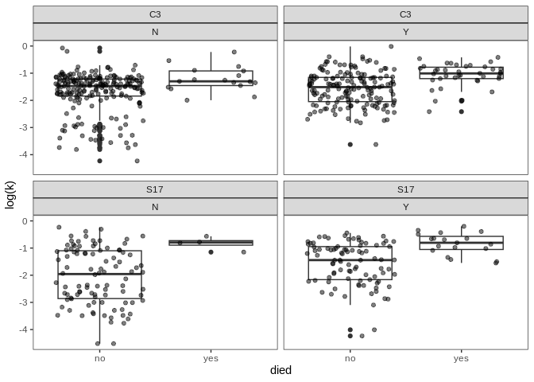
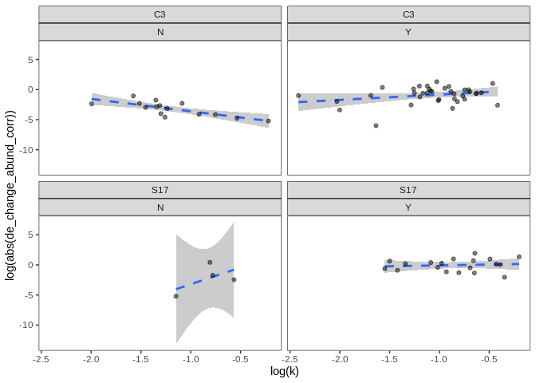
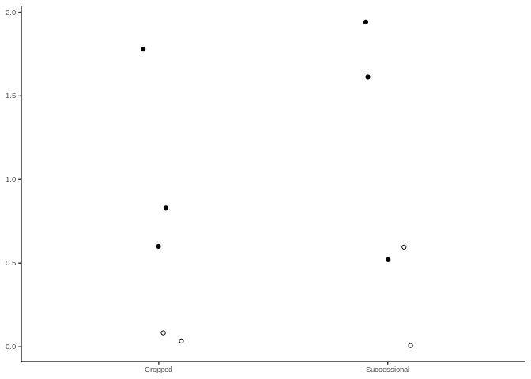

Dunlop - death parameters analysis
================
Cassandra Wattenburger
12/3/2021

``` r
rm(list=ls())

library("tidyverse")

sessionInfo()
```

    ## R version 3.6.3 (2020-02-29)
    ## Platform: x86_64-pc-linux-gnu (64-bit)
    ## Running under: Ubuntu 18.04.4 LTS
    ## 
    ## Matrix products: default
    ## BLAS:   /usr/lib/x86_64-linux-gnu/blas/libblas.so.3.7.1
    ## LAPACK: /usr/lib/x86_64-linux-gnu/lapack/liblapack.so.3.7.1
    ## 
    ## locale:
    ##  [1] LC_CTYPE=en_US.UTF-8       LC_NUMERIC=C              
    ##  [3] LC_TIME=en_US.UTF-8        LC_COLLATE=en_US.UTF-8    
    ##  [5] LC_MONETARY=en_US.UTF-8    LC_MESSAGES=en_US.UTF-8   
    ##  [7] LC_PAPER=en_US.UTF-8       LC_NAME=C                 
    ##  [9] LC_ADDRESS=C               LC_TELEPHONE=C            
    ## [11] LC_MEASUREMENT=en_US.UTF-8 LC_IDENTIFICATION=C       
    ## 
    ## attached base packages:
    ## [1] stats     graphics  grDevices utils     datasets  methods   base     
    ## 
    ## other attached packages:
    ## [1] forcats_0.5.1   stringr_1.5.0   dplyr_1.1.0     purrr_1.0.1    
    ## [5] readr_2.1.0     tidyr_1.3.0     tibble_3.1.6    ggplot2_3.4.1  
    ## [9] tidyverse_1.3.1
    ## 
    ## loaded via a namespace (and not attached):
    ##  [1] tidyselect_1.2.0 xfun_0.28        haven_2.4.3      colorspace_2.0-2
    ##  [5] vctrs_0.5.2      generics_0.1.1   htmltools_0.5.4  yaml_2.2.1      
    ##  [9] utf8_1.2.2       rlang_1.0.6      pillar_1.6.4     withr_2.5.0     
    ## [13] glue_1.6.2       DBI_1.1.1        dbplyr_2.1.1     modelr_0.1.8    
    ## [17] readxl_1.3.1     lifecycle_1.0.3  munsell_0.5.0    gtable_0.3.0    
    ## [21] cellranger_1.1.0 rvest_1.0.2      evaluate_0.14    knitr_1.36      
    ## [25] tzdb_0.2.0       fastmap_1.1.0    fansi_0.5.0      broom_0.7.10    
    ## [29] Rcpp_1.0.8.3     backports_1.3.0  scales_1.2.1     jsonlite_1.7.2  
    ## [33] fs_1.5.0         hms_1.1.1        digest_0.6.28    stringi_1.7.5   
    ## [37] grid_3.6.3       cli_3.6.0        tools_3.6.3      magrittr_2.0.1  
    ## [41] crayon_1.4.2     pkgconfig_2.0.3  ellipsis_0.3.2   xml2_1.3.2      
    ## [45] reprex_2.0.1     lubridate_1.8.0  assertthat_0.2.1 rmarkdown_2.11  
    ## [49] httr_1.4.2       rstudioapi_0.13  R6_2.5.1         compiler_3.6.3

# Import data

``` r
# Growth and death estimates
growth <- readRDS("../rdata.files/gr_gr.paprica.clean.rds") %>% 
  rename(gr_start_day=start_day, gr_end_day=end_day,
         gr_start_abund=start_abund, gr_end_abund=end_abund) %>% 
  mutate(Label = paste0(Soil, Amendment, Replicate, ASV),
         gr_change_abund = gr_end_abund - gr_start_abund,
         gr_length = gr_end_day - gr_start_day)

death <- readRDS("../rdata.files/gr_death_estimates.rds") %>% 
  select(everything(), -c(start_pt, end_pt, Domain:Genus, decay)) %>% 
  rename(de_rate=death_rate, de_start_day=start_day, de_end_day=end_day, de_length = length_days,
         de_start_abund=start_abund, de_end_abund=end_abund, de_change_abund = change_abund)

# Normalized abundances
norm <- readRDS("../rdata.files/gr_ucosm.norm.clean.rds") %>% 
  mutate(Label = paste0(Soil, Amendment, Replicate, ASV)) %>% 
  select(Label, Soil, Amendment, Replicate, ASV, Day, Domain:Genus, norm_abund) %>% 
  filter(norm_abund > 0)

# Taxa with estimated growth and then death
growth_death <- inner_join(growth, death) %>% 
  select(Label, Soil, Amendment, Replicate, Domain:Genus, ASV,
         k, g, gr_start_day, gr_end_day, gr_start_abund, gr_end_abund, gr_change_abund, gr_length,
         de_rate, half_time, de_start_day, de_end_day, de_start_abund, de_end_abund, de_change_abund, de_length,
         edge_num:n16S)
```

# Descriptive stats

### How many death estimates?

Total:

``` r
nrow(growth_death)
```

    ## [1] 80

``` r
length(as.character(unique(growth_death$ASV)))
```

    ## [1] 73

### Number of ASVs per treatment

``` r
death_asvs <- growth_death %>%
  group_by(Soil, Amendment) %>% 
  summarize(num_est = length(unique(ASV))) %>%
  ungroup()
  
death_asvs
```

    ## # A tibble: 4 × 3
    ##   Soil  Amendment num_est
    ##   <chr> <chr>       <int>
    ## 1 C3    N              17
    ## 2 C3    Y              38
    ## 3 S17   N               4
    ## 4 S17   Y              19

### Overall descriptive stats

Start, end, and length of death:

``` r
death_overall <- growth_death %>%
  group_by() %>% 
  summarize(de_start_day_min = min(de_start_day),
            de_start_day_max = max(de_start_day),
            de_start_day_mean = mean(de_start_day),
            de_start_day_sd = sd(de_start_day),
            de_end_day_min = min(de_end_day),
            de_end_day_max = max(de_end_day),
            de_end_day_mean = mean(de_end_day),
            de_end_day_sd = sd(de_end_day)) %>%
  ungroup()
  
death_overall
```

    ## # A tibble: 1 × 8
    ##   de_start_day_min de_start_day_max de_start_day_mean de_start_day_sd
    ##              <dbl>            <dbl>             <dbl>           <dbl>
    ## 1            0.667               21              6.31            5.04
    ## # … with 4 more variables: de_end_day_min <dbl>, de_end_day_max <dbl>,
    ## #   de_end_day_mean <dbl>, de_end_day_sd <dbl>

Halving times:

``` r
death_g <- growth_death %>% 
  group_by() %>% 
  summarize(half_time_min = min(half_time),
            half_time_max = max(half_time),
            half_time_mean = mean(half_time),
            half_time_sd = sd(half_time)) %>% 
  ungroup()

death_g
```

    ## # A tibble: 1 × 4
    ##   half_time_min half_time_max half_time_mean half_time_sd
    ##           <dbl>         <dbl>          <dbl>        <dbl>
    ## 1          1.35          72.8           11.7         13.3

### Phyla represented

``` r
# Number of phyla
length(unique(as.character(growth_death$Phylum)))
```

    ## [1] 12

``` r
# Which phyla
death_phyla <- growth_death %>% 
  group_by(Phylum) %>% 
  summarize(num_est = n()) %>%
  ungroup() %>% 
  arrange(desc(num_est))
  
death_phyla
```

    ## # A tibble: 12 × 2
    ##    Phylum                num_est
    ##    <fct>                   <int>
    ##  1 Proteobacteria             31
    ##  2 Actinobacteria             22
    ##  3 Acidobacteria               6
    ##  4 Verrucomicrobia             5
    ##  5 Chloroflexi                 4
    ##  6 Bacteroidetes               3
    ##  7 Thaumarchaeota              3
    ##  8 unclassified Bacteria       2
    ##  9 Firmicutes                  1
    ## 10 Gemmatimonadetes            1
    ## 11 Planctomycetes              1
    ## 12 putative Chloroflexi        1

# Community level

Overview of soil treatment affects on measured community overall.

### Proportion of taxa that grew then died vs just grew

``` r
count_growth <- growth %>% 
  group_by(Soil, Amendment, Replicate) %>% 
  summarize(growth_count = n()) %>% 
  ungroup()

count_death <- death %>% 
  group_by(Soil, Amendment, Replicate) %>% 
  summarize(death_count = n()) %>% 
  ungroup()

# Proportion
prop_death <- inner_join(count_growth, count_death) %>% 
  mutate(prop =death_count/growth_count)

# Graph
prop_death %>% 
  ggplot(aes(x=Soil, y=prop, color=Amendment)) +
  geom_point() +
  theme_test()
```

<!-- -->

``` r
# Aggregate parameters
growth_death_agg <- growth_death %>% 
  group_by(Soil, Amendment, Replicate) %>% 
    summarize(k = mean(k), g = mean(g),
            gr_start_day = mean(gr_start_day), gr_end_day = mean(gr_end_day), 
            gr_length = mean(gr_length),
            gr_start_abund_corr = mean(gr_start_abund/n16S, na.rm = TRUE), # 16S copy num correction
            gr_change_abund_corr = mean(gr_change_abund/n16S, na.rm = TRUE), # 16S copy num correction
            de_rate = mean(de_rate),
            de_start_day = mean(de_start_day), de_end_day = mean(de_end_day), 
            de_length = mean(de_length),
            de_start_abund_corr = mean(de_start_abund/n16S, na.rm = TRUE), # 16S copy num correction
            de_change_abund_corr = mean(de_change_abund/n16S, na.rm = TRUE)) %>% # 16S copy num correction
  ungroup() 
```

### Death rate

``` r
growth_death_agg %>%
  ggplot(aes(x=Soil, y=de_rate, color=Amendment)) +
  geom_point() +
  theme_test()
```

<!-- -->

### Death change abundance

``` r
growth_death_agg %>% 
  ggplot(aes(x=Soil, y=abs(de_change_abund_corr), color=Amendment)) +
  geom_point() +
  theme_test()
```

<!-- -->

Seems like trend of greater changes in abundance due to death in amended
soils?

**Statistics**

Linear
model:

``` r
chabund_agg_lm <- lm(abs(de_change_abund_corr) ~ Soil + Amendment + Soil*Amendment, data=growth_death_agg)
hist(resid(chabund_agg_lm)) # normal enough
```

<!-- -->

``` r
plot(predict(chabund_agg_lm), resid(chabund_agg_lm)) # unequal variance, log transform makes worse
```

<!-- -->

Welch’s t-test:

  - Non-transformed data

<!-- end list -->

``` r
# Cropped
chabund_agg_welch <- t.test(abs(de_change_abund_corr) ~ Amendment, data=growth_death_agg, var.equal=FALSE)
chabund_agg_welch
```

    ## 
    ##  Welch Two Sample t-test
    ## 
    ## data:  abs(de_change_abund_corr) by Amendment
    ## t = -3.5147, df = 7.2961, p-value = 0.009164
    ## alternative hypothesis: true difference in means is not equal to 0
    ## 95 percent confidence interval:
    ##  -1.7243339 -0.3440891
    ## sample estimates:
    ## mean in group N mean in group Y 
    ##       0.1800754       1.2142868

# ASV level

Average each ASV across replicates to get a parameter estimate for each
taxa in each treatment. This allows a more nuanced investigation of how
soil treatments interact with growth responses of individual
ASVs/populations rather than the community as a whole.

``` r
# Average growth estimates for each ASV
growth_asv <- growth %>%
  group_by(ASV, Soil, Amendment) %>% 
  summarize(k = mean(k), g = mean(g),
            gr_start_day = mean(gr_start_day), gr_end_day = mean(gr_end_day), 
            gr_length = mean(gr_length),
            gr_start_abund_corr = mean(gr_start_abund/n16S, na.rm=TRUE),
            gr_change_abund_corr = mean(gr_change_abund/n16S, na.rm=TRUE),
            n16S = mean(n16S, na.rm=TRUE)) %>% 
  ungroup()

# Average death estimates for each ASV
# Logarithmic only
death_asv_log <- death %>% 
  group_by(ASV, Soil, Amendment) %>% 
  summarize(de_rate = mean(de_rate),
            de_start_day = mean(de_start_day), de_end_day = mean(de_end_day), 
            de_length = mean(de_length),
            de_start_abund = mean(de_start_abund), de_end_abund = mean(de_end_abund), 
            de_change_abund = mean(de_change_abund)) %>% 
  ungroup()

# Both growth and death
growth_death_asv <- growth_death %>%
  group_by(ASV, Soil, Amendment) %>% 
  summarize(k = mean(k), g = mean(g),
            gr_start_day = mean(gr_start_day), gr_end_day = mean(gr_end_day), 
            gr_length = mean(gr_length),
            gr_start_abund_corr = mean(gr_start_abund/n16S, na.rm=TRUE),
            gr_change_abund_corr = mean(gr_change_abund/n16S, na.rm=TRUE),
            de_rate = mean(de_rate),
            de_start_day = mean(de_start_day), de_end_day = mean(de_end_day), 
            de_length = mean(de_length),
            de_start_abund_corr = mean(de_start_abund/n16S, na.rm=TRUE),
            de_change_abund_corr = mean(de_change_abund/n16S, na.rm=TRUE),
            n16S = mean(n16S, na.rm=TRUE)) %>% 
  ungroup()
```

### Growth rate vs did death happen at all

``` r
# Presence/absence of death in growing ASVs
no_death_asv <- anti_join(growth_asv, death_asv_log, by=c("ASV", "Soil", "Amendment")) %>% 
  add_column(died ="no")

growth_death_asv <- growth_death_asv %>% 
  add_column(died="yes")

# Include ASVs without detected death after growth
all_asv <- bind_rows(no_death_asv, growth_death_asv) %>% 
  mutate()
```

``` r
# Graph
all_asv %>% 
  ggplot(aes(x=died, y=log(k))) +
  geom_boxplot() +
  geom_jitter(alpha=0.5) +
  facet_wrap(Soil~Amendment) +
  theme_test()
```

<!-- -->

### Growth change abundance vs death yes/no

Hypothesis: Taxa that grew more biomass more likely to experience death
afterwards \* boom/bust lifestyle \* didn’t sample enough/long enough to
slower/less growth and death

``` r
# Graph
all_asv %>% 
  ggplot(aes(x=died, y=log(gr_change_abund_corr))) +
  geom_boxplot() +
  geom_jitter(alpha=0.5) +
  facet_wrap(Soil~Amendment) +
  theme_test()
```

    ## Warning: Removed 8 rows containing non-finite values (`stat_boxplot()`).

    ## Warning: Removed 8 rows containing missing values (`geom_point()`).

<!-- -->

### Growth rate vs death rate

Hypothesis: Taxa with faster growth rate more likely to experience
faster death \* boom/bust lifestyle

``` r
# Graph
growth_death_asv %>% 
  ggplot(aes(x=log(k), y=log(abs(de_rate)))) +
  geom_smooth(method="lm", linetype=2, alpha=0.5) +
  geom_point(alpha=0.5) +
  facet_wrap(Soil~Amendment) +
  theme_test()
```

<!-- -->

Perhaps a trend of slight positive relationship.

**Statistics**

Pearson correlations with multiple test correction

``` r
# Treatments
growthrate_deathrate_pcor_trts <- data.frame()
for (s in c("C3", "S17")) {
  for (a in c("Y", "N")) {
    data_sub <- filter(growth_death_asv, Soil==s & Amendment==a)
    pcor <- cor.test(data_sub$k, abs(data_sub$de_rate), method="pearson")
    this_row <-  data.frame("Soil"=s, "Amendment"=a, "estimate"=pcor$estimate, "pvalue"=pcor$p.value)
    growthrate_deathrate_pcor_trts <- bind_rows(growthrate_deathrate_pcor_trts, this_row)
  }
}

# Multiple test correction
padj <- p.adjust(growthrate_deathrate_pcor_trts$pvalue, method="holm", n=4)
growthrate_deathrate_pcor_trts <- bind_cols(growthrate_deathrate_pcor_trts, padj=padj)

# Results
growthrate_deathrate_pcor_trts
```

    ##         Soil Amendment  estimate     pvalue       padj
    ## cor...1   C3         Y 0.3298772 0.04311640 0.12934920
    ## cor...2   C3         N 0.1151868 0.65977586 1.00000000
    ## cor...3  S17         Y 0.5405026 0.01688262 0.06753048
    ## cor...4  S17         N 0.2762204 0.72377960 1.00000000

### Growth rate vs death change in abundance

``` r
# Graph
growth_death_asv %>% 
  ggplot(aes(x=log(k), y=log(abs(de_change_abund_corr)))) +
  geom_smooth(method="lm", linetype=2, alpha=0.5) +
  geom_point(alpha=0.5) +
  facet_wrap(Soil~Amendment) +
  theme_test()
```

    ## Warning: Removed 3 rows containing non-finite values (`stat_smooth()`).

    ## Warning: Removed 3 rows containing missing values (`geom_point()`).

<!-- -->

### Growth change in abundance vs death rate

Hypothesis: Taxa that grew more more likely to experience faster death

``` r
# Graph
growth_death_asv %>% 
  ggplot(aes(x=log(gr_change_abund_corr), y=log(abs(de_rate)))) + # cannot take ln of negative number
  geom_point(alpha=0.5) +
  geom_smooth(method="lm", linetype=2, alpha=0.5) +
  facet_wrap(Soil~Amendment) +
  theme_test()
```

    ## Warning: Removed 3 rows containing non-finite values (`stat_smooth()`).

    ## Warning: Removed 3 rows containing missing values (`geom_point()`).

<!-- -->

**Statistics**

Pearson correlations with multiple test correction

``` r
# Treatments
grchabund_deathrate_pcor_trts <- data.frame()
for (s in c("C3", "S17")) {
  for (a in c("Y", "N")) {
    data_sub <- filter(growth_death_asv, Soil==s & Amendment==a)
    pcor <- cor.test(log(data_sub$gr_change_abund_corr), log(abs(data_sub$de_rate)), method="pearson")
    this_row <-  data.frame("Soil"=s, "Amendment"=a, "estimate"=pcor$estimate, "pvalue"=pcor$p.value)
    grchabund_deathrate_pcor_trts <- bind_rows(grchabund_deathrate_pcor_trts, this_row)
  }
}

# Multiple test correction
padj <- p.adjust(grchabund_deathrate_pcor_trts$pvalue, method="holm", n=4)
grchabund_deathrate_pcor_trts <- bind_cols(grchabund_deathrate_pcor_trts, padj=padj)

# Results
grchabund_deathrate_pcor_trts
```

    ##         Soil Amendment   estimate    pvalue      padj
    ## cor...1   C3         Y  0.1360777 0.4219375 1.0000000
    ## cor...2   C3         N -0.4400529 0.1006963 0.4027853
    ## cor...3  S17         Y  0.1700391 0.4864541 1.0000000
    ## cor...4  S17         N -0.0658960 0.9341040 1.0000000

### Growth change in abundance vs death change in abundance

Hypothesis: Taxa that accumulated more biomass during growth can and
will lose more biomass to death

``` r
# Graph
growth_death_asv %>%
  filter(died=="yes") %>%
  ggplot(aes(x=log(gr_change_abund_corr), y=log(abs(de_change_abund_corr)))) +
  geom_point(alpha=0.5) +
  geom_smooth(method="lm", linetype=2, alpha=0.5) +
  facet_wrap(Soil~Amendment) +
  theme_test()
```

    ## Warning: Removed 3 rows containing non-finite values (`stat_smooth()`).

    ## Warning: Removed 3 rows containing missing values (`geom_point()`).

<!-- -->

**Statistics**

Pearson correlations with multiple test correction

``` r
# Treatments
chabund_growth_death_pcor <- data.frame()
for (s in c("C3", "S17")) {
  for (a in c("Y", "N")) {
    data_sub <- filter(growth_death_asv, Soil==s & Amendment==a)
    pcor <- cor.test(log(data_sub$gr_change_abund_corr), log(abs(data_sub$de_change_abund_corr)), method="pearson")
    this_row <-  data.frame("Soil"=s, "Amendment"=a, "estimate"=pcor$estimate, "pvalue"=pcor$p.value)
    chabund_growth_death_pcor <- bind_rows(chabund_growth_death_pcor, this_row)
  }
}

# Multiple test correction
padj <- p.adjust(chabund_growth_death_pcor$pvalue, method="holm", n=4)
chabund_growth_death_pcor_trts <- bind_cols(chabund_growth_death_pcor, padj=padj)

# Results
chabund_growth_death_pcor
```

    ##         Soil Amendment  estimate       pvalue
    ## cor...1   C3         Y 0.7600547 4.857547e-08
    ## cor...2   C3         N 0.4262101 1.131577e-01
    ## cor...3  S17         Y 0.9391237 2.612469e-09
    ## cor...4  S17         N 0.2896381 7.103619e-01

Positive correlation between growth and death change in abundance in
amended but not unamended soil. More growth means more potential for
losses to death?

# Figures

Aggregate death change in abundance

``` r
plot <- growth_death_agg %>% 
   mutate(Soil = fct_recode(Soil, Cropped = "C3", Successional = "S17"),
          Amendment = as_factor(Amendment),
         Amendment = fct_recode(Amendment, Resources = "Y", Water = "N"),
         Amendment = fct_relevel(Amendment, c("Resources", "Water"))) %>% 
  ggplot(aes(x=Soil, y=abs(de_change_abund_corr))) +
  geom_jitter(aes(shape=Amendment), width=0.1) +
  scale_shape_manual(values=c(19,1)) +
  theme_classic() +
  theme(axis.title = element_blank(),
        text = element_text(size=9),
        strip.text.x = element_text(size = 10, hjust = 0),
        legend.position = "none",
        strip.background = element_blank())
plot
```

<!-- -->

``` r
ggsave(plot, filename="../figures/fig_sample_deathchabund.svg", units="mm", width=85, height=85, device="svg")
```

Growth vs death change in abundance

``` r
plot <- growth_death_asv %>%
  mutate(Treatment = paste0(Soil, Amendment),
         Treatment = fct_recode(Treatment, 'Cropped, water' = "C3N", 'Cropped, resources' = "C3Y",
                                'Successional, water' = "S17N", 'Successional, resources' = "S17Y"),
         Treatment = factor(Treatment, levels=c("Cropped, water", "Cropped, resources",
                                                 "Successional, water", "Successional, resources"))) %>%
  filter(died=="yes") %>%
  ggplot(aes(x=log(gr_change_abund_corr), y=log(abs(de_change_abund_corr)))) +
  geom_point(shape=1, alpha= 0.5) +
  geom_smooth(method="lm", linetype=2, color="black", alpha=0.5) +
  facet_wrap(~Treatment) +
  theme_test() +
  theme(text = element_text(size=9),
        strip.text.x = element_text(size = 9, hjust = 0),
        strip.background = element_blank(),
        axis.title = element_blank())
plot
```

    ## Warning: Removed 3 rows containing non-finite values (`stat_smooth()`).

    ## Warning: Removed 3 rows containing missing values (`geom_point()`).

<!-- -->

``` r
ggsave(plot, filename = "../figures/fig_growthxdeathchabund.svg", units="mm", width=85, height=85, device="svg")
```
