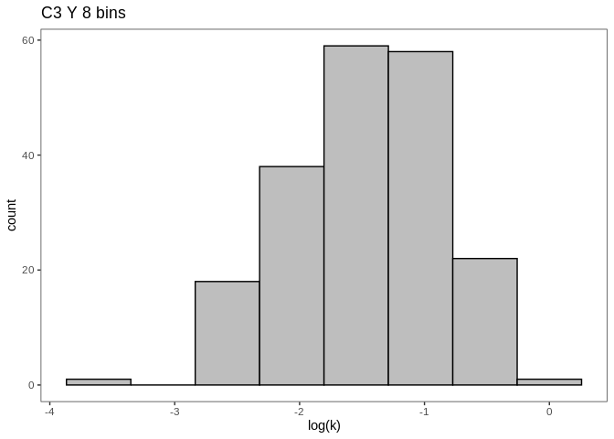
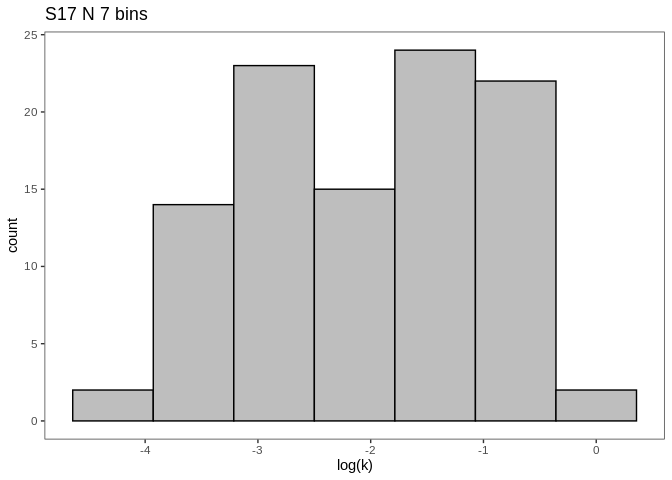

Dunlop - growth rate distributions
================
Cassandra Wattenburger
2/13/2021

# Import libraries

``` r
library(tidyverse)
library(cowplot)
library(data.table)
library(phyloseq)
library(lmerTest)

sessionInfo()
```

    ## R version 3.6.3 (2020-02-29)
    ## Platform: x86_64-pc-linux-gnu (64-bit)
    ## Running under: Ubuntu 18.04.4 LTS
    ## 
    ## Matrix products: default
    ## BLAS:   /usr/lib/x86_64-linux-gnu/blas/libblas.so.3.7.1
    ## LAPACK: /usr/lib/x86_64-linux-gnu/lapack/liblapack.so.3.7.1
    ## 
    ## locale:
    ##  [1] LC_CTYPE=en_US.UTF-8       LC_NUMERIC=C              
    ##  [3] LC_TIME=en_US.UTF-8        LC_COLLATE=en_US.UTF-8    
    ##  [5] LC_MONETARY=en_US.UTF-8    LC_MESSAGES=en_US.UTF-8   
    ##  [7] LC_PAPER=en_US.UTF-8       LC_NAME=C                 
    ##  [9] LC_ADDRESS=C               LC_TELEPHONE=C            
    ## [11] LC_MEASUREMENT=en_US.UTF-8 LC_IDENTIFICATION=C       
    ## 
    ## attached base packages:
    ## [1] stats     graphics  grDevices utils     datasets  methods   base     
    ## 
    ## other attached packages:
    ##  [1] lmerTest_3.1-3    lme4_1.1-27.1     Matrix_1.5-3      phyloseq_1.30.0  
    ##  [5] data.table_1.14.2 cowplot_1.1.1     forcats_0.5.1     stringr_1.5.0    
    ##  [9] dplyr_1.1.0       purrr_1.0.1       readr_2.1.0       tidyr_1.3.0      
    ## [13] tibble_3.1.6      ggplot2_3.4.1     tidyverse_1.3.1  
    ## 
    ## loaded via a namespace (and not attached):
    ##  [1] nlme_3.1-147        fs_1.5.0            lubridate_1.8.0    
    ##  [4] httr_1.4.2          numDeriv_2016.8-1.1 tools_3.6.3        
    ##  [7] backports_1.3.0     vegan_2.5-7         utf8_1.2.2         
    ## [10] R6_2.5.1            mgcv_1.8-31         DBI_1.1.1          
    ## [13] BiocGenerics_0.32.0 colorspace_2.0-2    permute_0.9-5      
    ## [16] ade4_1.7-18         withr_2.5.0         tidyselect_1.2.0   
    ## [19] compiler_3.6.3      cli_3.6.0           rvest_1.0.2        
    ## [22] Biobase_2.46.0      xml2_1.3.2          scales_1.2.1       
    ## [25] digest_0.6.28       minqa_1.2.4         rmarkdown_2.11     
    ## [28] XVector_0.26.0      pkgconfig_2.0.3     htmltools_0.5.4    
    ## [31] dbplyr_2.1.1        fastmap_1.1.0       rlang_1.0.6        
    ## [34] readxl_1.3.1        rstudioapi_0.13     generics_0.1.1     
    ## [37] jsonlite_1.7.2      magrittr_2.0.1      biomformat_1.14.0  
    ## [40] Rcpp_1.0.8.3        munsell_0.5.0       S4Vectors_0.24.4   
    ## [43] Rhdf5lib_1.8.0      fansi_0.5.0         ape_5.5            
    ## [46] lifecycle_1.0.3     stringi_1.7.5       yaml_2.2.1         
    ## [49] MASS_7.3-51.6       zlibbioc_1.32.0     rhdf5_2.30.1       
    ## [52] plyr_1.8.6          grid_3.6.3          parallel_3.6.3     
    ## [55] crayon_1.4.2        lattice_0.20-41     Biostrings_2.54.0  
    ## [58] haven_2.4.3         splines_3.6.3       multtest_2.42.0    
    ## [61] hms_1.1.1           knitr_1.36          pillar_1.6.4       
    ## [64] igraph_1.2.8        boot_1.3-25         reshape2_1.4.4     
    ## [67] codetools_0.2-16    stats4_3.6.3        reprex_2.0.1       
    ## [70] glue_1.6.2          evaluate_0.14       modelr_0.1.8       
    ## [73] nloptr_1.2.2.3      vctrs_0.5.2         tzdb_0.2.0         
    ## [76] foreach_1.5.2       cellranger_1.1.0    gtable_0.3.0       
    ## [79] assertthat_0.2.1    xfun_0.28           broom_0.7.10       
    ## [82] survival_3.1-12     iterators_1.0.14    IRanges_2.20.2     
    ## [85] cluster_2.1.4       ellipsis_0.3.2

``` r
rm(list=ls())
```

# Import growth data

``` r
growth <- readRDS("../rdata.files/gr_gr.paprica.clean.rds")
```

**Average across replicates**

``` r
# ASV averages
growth.asv <- growth %>%
  group_by(Soil, Amendment, ASV, Phylum, Class, Order, Family, Genus) %>%
  summarize(start_day = mean(start_day),
            length = mean(end_day - start_day),
            change_abund_corr = mean((end_abund-start_abund)/n16S),
            k = mean(k),
            g = mean(g),
            n16S = mean(n16S),
            genome_size = mean(genome_size))
```

**Visualize**

Kernel density graphs

See:
<https://www.statsmodels.org/dev/examples/notebooks/generated/kernel_density.html>

``` r
growth.asv %>% 
  filter(Amendment=="N") %>%
  ggplot(aes(x=log(k), color=Soil, fill=Soil)) +
  geom_density(alpha=0.5) +
  labs(title="Only water", x="log specific growth rate", y="Kernel Density") +
  theme_test() +
  theme(#legend.position="none",
        title=element_text(size=12),
        axis.text=element_text(size=12),
        axis.title=element_text(size=12)) +
  scale_color_manual(labels = c("Cropped", "Successional"), values=c("#F8766D","#00BFC4")) +
  scale_fill_manual(labels = c("Cropped", "Successional"), values=c("#F8766D","#00BFC4")) +
  scale_y_continuous(limits=c(0,1)) +
  scale_x_continuous(limits=c(-5,0))
```

<!-- -->

``` r
growth.asv %>% 
  filter(Amendment=="Y") %>%
  ggplot(aes(x=log(k), color=Soil, fill=Soil)) +
  geom_density(alpha=0.5) +
  labs(title="C-amended", x="log specific growth rate", y="Kernel Density") +
  theme_test() +
  theme(#legend.position="none",
        title=element_text(size=12),
        axis.text=element_text(size=12),
        axis.title=element_text(size=12)) +
  scale_color_manual(labels = c("Cropped", "Successional"), values=c("#F8766D","#00BFC4")) +
  scale_fill_manual(labels = c("Cropped", "Successional"), values=c("#F8766D","#00BFC4")) +
  scale_y_continuous(limits=c(0,1)) +
  scale_x_continuous(limits=c(-5,0))
```

<!-- -->

``` r
growth.asv %>% 
  filter(Soil=="C3") %>%
  ggplot(aes(x=log(k), color=Amendment, fill=Amendment)) +
  geom_density(alpha=0.5) +
  labs(title="Cropped", x="log specific growth rate", y="Kernel Density") +
  theme_test() +
  theme(#legend.position="none",
        title=element_text(size=12),
        axis.text=element_text(size=12),
        axis.title=element_text(size=12)) +
  scale_color_manual(labels = c("C-added", "Water control"), values=c("#E78E43", "#423EC5")) +
  scale_fill_manual(labels = c("C-added", "Water control"), values=c("#E78E43", "#423EC5")) +
  scale_y_continuous(limits=c(0,1)) +
  scale_x_continuous(limits=c(-5,0))
```

<!-- -->

``` r
growth.asv %>% 
  filter(Soil=="S17") %>%
  ggplot(aes(x=log(k), color=Amendment, fill=Amendment)) +
  geom_density(alpha=0.5) +
  labs(title="Successional", x="log specific growth rate", y="Kernel Density") +
  theme_test() +
  theme(#legend.position="none",
        title=element_text(size=12),
        axis.text=element_text(size=12),
        axis.title=element_text(size=12)) +
  scale_color_manual(labels = c("C-added", "Water control"), values=c("#E78E43", "#423EC5")) +
  scale_fill_manual(labels = c("C-added", "Water control"), values=c("#E78E43", "#423EC5")) +
  scale_y_continuous(limits=c(0,1)) +
  scale_x_continuous(limits=c(-5,0))
```

<!-- -->

# Growth rate distribution binning

Hypothesis: growth rate distributions will differ by soil and by
amendment.

In order to conduct tests on the distirbution of the data, I need to bin
it discretely. The bins will need to be equal width and have the same
start and end points across treatments so that they are comparable, and
the number of bins must be chosen to simplify the data without losing
too much of the “shape” of the distribution (see smoothed histograms
above for reference).

**By treatment**

Ranging from 5 to 10 bins.

``` r
for (s in c("C3", "S17")) {
  for (a in c("Y", "N")) {
    for (i in 5:10) {
      print(growth.asv %>%
        filter(Soil==s, Amendment==a) %>%
        ggplot(aes(x=log(k))) +
        geom_histogram(bins=i, color="black", fill="gray") +
        theme_test() +
        labs(title=paste(s, a, i, "bins")))
    }
  }
}
```

<!-- --><!-- --><!-- --><!-- --><!-- --><!-- --><!-- --><!-- --><!-- --><!-- --><!-- --><!-- --><!-- --><!-- --><!-- --><!-- --><!-- --><!-- --><!-- --><!-- --><!-- --><!-- --><!-- --><!-- -->

It looks like 5 bins is definitely too few. I’ll choose 8 bins because
they best capture the distribution shape/bimodal nature of water
control.

There need to be the same number and width of bins in each dataset.

Caculate min, max, and range of specific growth rate values in whole
dataset:

``` r
print(paste("Min:", min(log(growth.asv$k))))
```

    ## [1] "Min: -4.51760171995445"

``` r
print(paste("Max:", max(log(growth.asv$k))))
```

    ## [1] "Max: -0.0155326196739766"

``` r
print(paste("Range:", max(log(growth.asv$k)) - min(log(growth.asv$k))))
```

    ## [1] "Range: 4.50206910028048"

Calculate bin width based on range:

``` r
width <- (max(log(growth.asv$k))-min(log(growth.asv$k)))/8
print(paste("Bin width:", width))
```

    ## [1] "Bin width: 0.56275863753506"

``` r
kmin <- min(log(growth.asv$k))
```

Apply to data:

``` r
# Bin data based on boundaries chosen and log k
growth.bins <- growth %>%
  mutate(bin = case_when(log(k) < kmin+width ~ 1,
                         log(k) < kmin+width*2 ~ 2,
                         log(k) < kmin+width*3 ~ 3,
                         log(k) < kmin+width*4 ~ 4,
                         log(k) < kmin+width*5 ~ 5,
                         log(k) < kmin+width*6 ~ 6,
                         log(k) < kmin+width*7 ~ 7,
                         log(k) > kmin+width*7 ~ 8))

# Calculate bin information (proportion, frequency)
bin.data <- data.frame()
for (s in as.character(unique(growth.bins$Soil))) { 
  for (a in as.character(unique(growth.bins$Amendment))) {
    for (r in as.character(unique(growth.bins$Replicate))) {
      total = nrow(growth.bins[growth.bins$Soil==s & growth.bins$Amendment==a & growth.bins$Replicate==r,])
      for (b in as.character(unique(growth.bins$bin))) {
        bin = growth.bins[growth.bins$Soil==s & growth.bins$Amendment==a & growth.bins$Replicate==r & growth.bins$bin==b,]
        binfreq = nrow(bin)
        binratio = binfreq/total
        thisrow = data.frame("Soil"=s, "Amendment"=a, "Replicate"=r, "Bin"=b, "bin_freq" = binfreq, "bin_ratio" = binratio)
        bin.data = rbind(bin.data, thisrow)   
      }
    }
  }
}

# Relevel bin factor
bin.data$Bin = factor(bin.data$Bin, levels=c(1,2,3,4,5,6,7,8))
```

Plot bins:

``` r
ggplot(bin.data) +
  geom_boxplot(aes(x=Bin, y=bin_ratio, color=Soil)) +
  facet_wrap(~Amendment) +
  theme_test() +
  labs(x="Slow to fast", y="Proportion of total taxa")
```

<!-- -->

``` r
ggplot(bin.data) +
  geom_boxplot(aes(x=Bin, y=bin_freq, color=Soil)) +
  facet_wrap(~Amendment) +
  theme_test() +
  labs(x="Slow to fast", y="Frequency")
```

<!-- -->

``` r
ggplot(bin.data) +
  geom_boxplot(aes(x=Bin, y=bin_ratio, color=Amendment)) +
  facet_wrap(~Soil) +
  scale_color_manual(values=c("#E78E43", "#423EC5")) +
  theme_test() +
  labs(x="Slow to fast", y="Proportion of total taxa")
```

<!-- -->

``` r
ggplot(bin.data) +
  geom_boxplot(aes(x=Bin, y=bin_freq, color=Amendment)) +
  facet_wrap(~Soil) +
  scale_color_manual(values=c("#E78E43", "#423EC5")) +
  theme_test() +
  labs(x="Slow to fast", y="Frequency")
```

<!-- -->

**Statistics**

First, I want to know if the distribution of growth rates differs by
habitat or amendment. I’ll use a contingency table and Fisher’s exact
test.

See:
<http://www.biostathandbook.com/fishers.html>

``` r
# Average replicates and round (Fisher's needs integers, not continuous numbers)
bin.trt <- bin.data %>% 
  group_by(Soil, Amendment, Bin) %>% 
  summarize(bin_freq = mean(bin_freq)) %>% 
  mutate(bin_freq_rnd = round(bin_freq))

# Make contingency tables
conting.y <- dcast(bin.trt[bin.trt$Amendment=="Y",], Soil~ Bin, value.var="bin_freq_rnd")
conting.y <- conting.y[,-1] %>% as.matrix()

conting.n <- dcast(bin.trt[bin.trt$Amendment=="N",], Soil ~ Bin, value.var="bin_freq_rnd")
conting.n <- conting.n[,-1] %>% as.matrix()

conting.C3 <- dcast(bin.trt[bin.trt$Soil=="C3",], Amendment ~ Bin, value.var="bin_freq_rnd")
conting.C3 <- conting.C3[,-1] %>% as.matrix()

conting.S17 <- dcast(bin.trt[bin.trt$Soil=="S17",], Amendment ~ Bin, value.var="bin_freq_rnd")
conting.S17 <- conting.S17[,-1] %>% as.matrix()

# Run Fisher's exact tests
set.seed(1)
fish.testy = fisher.test(conting.y, simulate.p.value = TRUE)
fish.testn = fisher.test(conting.n, simulate.p.value = TRUE)
fish.testC3 = fisher.test(conting.C3, simulate.p.value = TRUE)
fish.testS17 = fisher.test(conting.S17, simulate.p.value = TRUE)

# Multiple test correction
fish.pvals = c(fish.testn$p.value, fish.testy$p.value, fish.testC3$p.value, fish.testS17$p.value)
fish.padj = p.adjust(fish.pvals, method="BH", n=length(fish.pvals))
print(paste("Unamended cropped vs Succ., adj. p-value:", fish.padj[1]))
```

    ## [1] "Unamended cropped vs Succ., adj. p-value: 0.00199900049975012"

``` r
print(paste("Amended cropped vs Succ., adj. p-value:", fish.padj[2]))
```

    ## [1] "Amended cropped vs Succ., adj. p-value: 0.662168915542229"

``` r
print(paste("Cropped amended vs unamended, adj. p-value:", fish.padj[3]))
```

    ## [1] "Cropped amended vs unamended, adj. p-value: 0.00199900049975012"

``` r
print(paste("Succ. amended vs unamended, adj. p-value:", fish.padj[4]))
```

    ## [1] "Succ. amended vs unamended, adj. p-value: 0.291854072963518"

Cropped vs. successional water control significant. Cropped water
control vs. C-amended signficiant.

# Figures

## Kernel density k

``` r
plot <- growth.asv %>%
  mutate(Soil = fct_recode(Soil, Cropped = "C3", Successional = "S17"),
         Amendment = fct_relevel(Amendment, c("N", "Y")),
         Amendment = fct_recode(Amendment, 'Resource amendment' = "Y", 'Water amendment' = "N")) %>%
  ggplot() +
  geom_density(aes(x=log(k), fill=Soil), alpha=0.5) +
  scale_fill_manual(values = c("#676366", "#FFFFFF")) +
  facet_wrap(~Amendment, nrow=2, scales="fixed") +
  #labs(y="Kernel density", x=bquote('ln specific growth rate'~day^-1)) +
  theme_classic() +
  theme(axis.title = element_blank(),
        text = element_text(size=9),
        strip.text.x = element_text(size = 10, hjust = 0),
        legend.position = "right",
        legend.justification = "top",
        strip.background = element_blank())
plot
```

<!-- -->

``` r
ggsave(plot, filename="../figures/fig_kdistributions.svg", units="mm", width=100, height=85, device="svg")
```

## Raw histograms k

``` r
plot2 <- growth.asv %>%
  mutate(treatment = case_when(Soil=="C3" & Amendment=="N" ~ "Cropped, water",
                               Soil=="C3" & Amendment=="Y" ~ "Cropped, resources",
                               Soil=="S17" & Amendment=="N" ~ "Successional, water",
                               Soil=="S17" & Amendment=="Y" ~ "Successional, resources")) %>%
  ggplot() +
  geom_histogram(aes(x=log(k)), color="black") +
  scale_fill_manual(values = c("#676366", "#FFFFFF")) +
  facet_wrap(~treatment, scales="fixed") +
  #labs(x=bquote('ln specific growth rate'~day^-1), y="Frequency") +
  theme_test() +
  theme(text = element_text(size=8),
        axis.title = element_blank(),
        strip.text.x = element_text(size = 8, hjust = 0),
        legend.position = "right",
        legend.justification = "top")
plot2
```

<!-- -->

``` r
ggsave(plot2, filename="../figures/suppfig_khist.svg", units="mm", width=85, height=60, device="svg")
```

## Fisher bins k

``` r
plot3 <- bin.data %>%
  mutate(Soil = fct_recode(Soil, Cropped = "C3", Successional = "S17"),
         Amendment = fct_relevel(Amendment, c("N", "Y")),
         Amendment = fct_recode(Amendment, 'Resources + water' = "Y", 'Water only' = "N")) %>%
  ggplot() +
  geom_boxplot(aes(x=Bin, y=bin_freq, fill=Amendment)) +
  facet_wrap(~Soil) +
  scale_fill_manual(values = c("#676366", "#FFFFFF")) +
  theme_test() +
  theme(axis.title = element_blank(),
        legend.title = element_blank())
plot3
```

<!-- -->

``` r
ggsave(plot3, filename="../figures/suppfig_kbins.svg", units="mm", width=120, height=60, device="svg")
```

## Kernel density lag

``` r
plot4 <- growth.asv %>%
  mutate(Soil = fct_recode(Soil, Cropped = "C3", Successional = "S17"),
         Amendment = fct_relevel(Amendment, c("N", "Y")),
         Amendment = fct_recode(Amendment, 'Resources + water' = "Y", 'Water only' = "N"),
         start_day_psuedo = start_day + 0.01) %>%
  ggplot() +
  geom_density(aes(x=log(start_day_psuedo), fill=Soil), alpha=0.5) +
  scale_fill_manual(values = c("#676366", "#FFFFFF")) +
  facet_wrap(~Amendment, scales="fixed") +
  #labs(y="Kernel density", x="Lag time (days)") +
  theme_test() +
  theme(text = element_text(size=9),
        axis.title = element_blank(),
        strip.text.x = element_text(size = 10, hjust = 0),
        legend.position = "right",
        legend.justification = "top",
        strip.background = element_blank())
plot4
```

<!-- -->

``` r
ggsave(plot4, filename="../figures/suppfig_lagdistributions.svg", units="mm", width=180, height=60, device="svg")
```

``` r
plot5 <- growth.asv %>%
  mutate(Soil = fct_recode(Soil, Cropped = "C3", Successional = "S17"),
         Amendment = fct_relevel(Amendment, c("N", "Y")),
         Amendment = fct_recode(Amendment, 'Resources + water' = "Y", 'Water only' = "N")) %>%
  ggplot() +
  geom_density(aes(x=log(change_abund_corr), fill=Soil), alpha=0.5) +
  scale_fill_manual(values = c("#676366", "#FFFFFF")) +
  facet_wrap(~Amendment, scales="fixed") +
  #labs(y="Kernel density", x="Delta N") +
  theme_test() +
  theme(text = element_text(size=9),
        axis.title = element_blank(),
        strip.text.x = element_text(size = 10, hjust = 0),
        legend.position = "right",
        legend.justification = "top",
        strip.background = element_blank())
plot5
```

<!-- -->

``` r
ggsave(plot5, filename="../figures/suppfig_chabunddist.svg", units="mm", width=180, height=60, device="svg")
```
