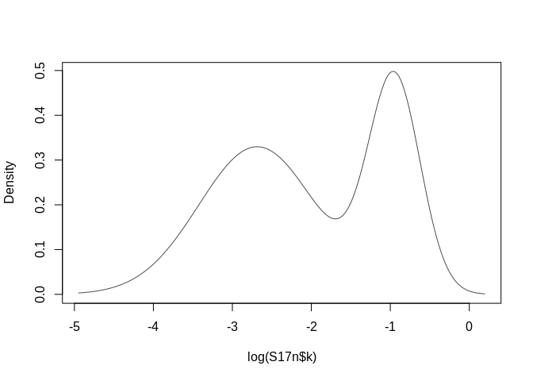
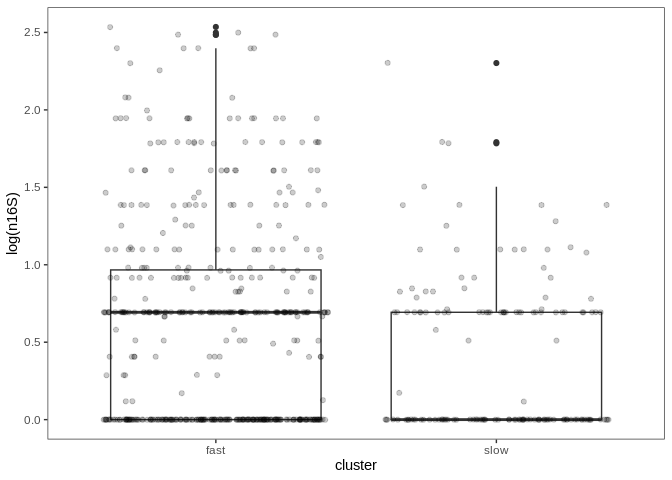

Dunlop - clusters
================
Cassandra Wattenburger
3/8/2021

# Import libraries

``` r
library(tidyverse)
library(mclust)

sessionInfo()
```

    ## R version 3.6.3 (2020-02-29)
    ## Platform: x86_64-pc-linux-gnu (64-bit)
    ## Running under: Ubuntu 18.04.4 LTS
    ## 
    ## Matrix products: default
    ## BLAS:   /usr/lib/x86_64-linux-gnu/blas/libblas.so.3.7.1
    ## LAPACK: /usr/lib/x86_64-linux-gnu/lapack/liblapack.so.3.7.1
    ## 
    ## locale:
    ##  [1] LC_CTYPE=en_US.UTF-8       LC_NUMERIC=C              
    ##  [3] LC_TIME=en_US.UTF-8        LC_COLLATE=en_US.UTF-8    
    ##  [5] LC_MONETARY=en_US.UTF-8    LC_MESSAGES=en_US.UTF-8   
    ##  [7] LC_PAPER=en_US.UTF-8       LC_NAME=C                 
    ##  [9] LC_ADDRESS=C               LC_TELEPHONE=C            
    ## [11] LC_MEASUREMENT=en_US.UTF-8 LC_IDENTIFICATION=C       
    ## 
    ## attached base packages:
    ## [1] stats     graphics  grDevices utils     datasets  methods   base     
    ## 
    ## other attached packages:
    ##  [1] mclust_5.4.8    forcats_0.5.1   stringr_1.5.0   dplyr_1.1.0    
    ##  [5] purrr_1.0.1     readr_2.1.0     tidyr_1.3.0     tibble_3.1.6   
    ##  [9] ggplot2_3.4.1   tidyverse_1.3.1
    ## 
    ## loaded via a namespace (and not attached):
    ##  [1] tidyselect_1.2.0 xfun_0.28        haven_2.4.3      colorspace_2.0-2
    ##  [5] vctrs_0.5.2      generics_0.1.1   htmltools_0.5.4  yaml_2.2.1      
    ##  [9] utf8_1.2.2       rlang_1.0.6      pillar_1.6.4     withr_2.5.0     
    ## [13] glue_1.6.2       DBI_1.1.1        dbplyr_2.1.1     modelr_0.1.8    
    ## [17] readxl_1.3.1     lifecycle_1.0.3  munsell_0.5.0    gtable_0.3.0    
    ## [21] cellranger_1.1.0 rvest_1.0.2      evaluate_0.14    knitr_1.36      
    ## [25] tzdb_0.2.0       fastmap_1.1.0    fansi_0.5.0      broom_0.7.10    
    ## [29] Rcpp_1.0.8.3     backports_1.3.0  scales_1.2.1     jsonlite_1.7.2  
    ## [33] fs_1.5.0         hms_1.1.1        digest_0.6.28    stringi_1.7.5   
    ## [37] grid_3.6.3       cli_3.6.0        tools_3.6.3      magrittr_2.0.1  
    ## [41] crayon_1.4.2     pkgconfig_2.0.3  ellipsis_0.3.2   xml2_1.3.2      
    ## [45] reprex_2.0.1     lubridate_1.8.0  assertthat_0.2.1 rmarkdown_2.11  
    ## [49] httr_1.4.2       rstudioapi_0.13  R6_2.5.1         compiler_3.6.3

``` r
rm(list=ls())

set.seed(2) # mclust uses EM algorhythm which is iterative and random
```

# Import data

``` r
growth <- readRDS("../rdata.files/gr_gr.paprica.clean.rds")
```

Average across replicates to get a single estimated growth rate for each
taxa in each treatment.

``` r
# Average across replicates for each ASV
growth.asv <- growth %>%
  group_by(Soil, Amendment, ASV) %>%
  summarize(k = mean(k),
            start_day = mean(start_day),
            end_day = mean(end_day),
            start_abund = mean(start_abund),
            end_abund = mean(end_abund)) %>% 
  ungroup()

# Including PAPRICA results
# Have to remove archaea because they weren't predicted by program (NAs)
growth.paprica.asv <- growth %>%
  na.omit() %>%
  group_by(Soil, Amendment, ASV) %>%
  summarize(k = mean(k),
            start_day = mean(start_day),
            end_day = mean(end_day),
            start_abund = mean(start_abund),
            end_abund = mean(end_abund),
            n16S = mean(n16S),
            genome_size = mean(genome_size)) %>% 
  ungroup()
```

Visualize distributions:

``` r
# Averaged across replicates
growth.asv %>%
  ggplot(aes(x=log(k), color=Soil)) +
  geom_density() +
  facet_wrap(~Amendment) +
  theme_test()
```

<!-- -->

# Fit models and cluster

### Successional water control

``` r
# Subset
S17n <- growth.paprica.asv %>% 
  filter(Soil=="S17" & Amendment=="N")

# Fit univariate gaussian mixture model
S17n.mclust <- densityMclust(log(S17n$k))
```

<!-- -->

``` r
summary(S17n.mclust)
```

    ## ------------------------------------------------------- 
    ## Density estimation via Gaussian finite mixture modeling 
    ## ------------------------------------------------------- 
    ## 
    ## Mclust V (univariate, unequal variance) model with 2 components: 
    ## 
    ##  log-likelihood   n df       BIC       ICL
    ##       -135.5659 102  5 -294.2567 -305.1814

``` r
plot(S17n.mclust$BIC)
```

<!-- -->

``` r
S17n.mclust$parameters
```

    ## $pro
    ## [1] 0.6099345 0.3900655
    ## 
    ## $mean
    ##          1          2 
    ## -2.6863247 -0.9485628 
    ## 
    ## $variance
    ## $variance$modelName
    ## [1] "V"
    ## 
    ## $variance$d
    ## [1] 1
    ## 
    ## $variance$G
    ## [1] 2
    ## 
    ## $variance$sigmasq
    ## [1] 0.5446453 0.1064588
    ## 
    ## $variance$scale
    ## [1] 0.5446453 0.1064588

``` r
plot(S17n.mclust, what = "density", data = log(S17n$k))
```

<!-- -->

``` r
# Bootstrap CIs of parameters
S17n.boot <- MclustBootstrap(S17n.mclust, nboot=999, type="bs", verbose=FALSE)
summary(S17n.boot, what = "ci")
```

    ## ---------------------------------------------------------- 
    ## Resampling confidence intervals 
    ## ---------------------------------------------------------- 
    ## Model                      = V 
    ## Num. of mixture components = 2 
    ## Replications               = 999 
    ## Type                       = nonparametric bootstrap 
    ## Confidence level           = 0.95 
    ## 
    ## Mixing probabilities:
    ##               1         2
    ## 2.5%  0.4549065 0.2693822
    ## 97.5% 0.7306178 0.5450935
    ## 
    ## Means:
    ##               1          2
    ## 2.5%  -2.998660 -1.1498545
    ## 97.5% -2.392717 -0.8022029
    ## 
    ## Variances:
    ##               1          2
    ## 2.5%  0.2167898 0.04646792
    ## 97.5% 0.8332584 0.21706213

``` r
plot(S17n.boot, what = "mean")
```

<!-- --><!-- -->

``` r
# Add classifications
S17n.class <- S17n %>%
  add_column(classification = S17n.mclust$classification) %>%
  mutate(classification = as_factor(classification))

S17n.class %>% 
  ggplot(aes(x=log(k), color=classification)) +
  geom_histogram() +
  theme_test()
```

<!-- -->

### Cropped water control

``` r
# Subset
C3n <- growth.paprica.asv %>% 
  filter(Soil=="C3" & Amendment=="N")

# Fit univariate gaussian mixture model
C3n.mclust <- densityMclust(log(C3n$k))
```

<!-- -->

``` r
summary(C3n.mclust)
```

    ## ------------------------------------------------------- 
    ## Density estimation via Gaussian finite mixture modeling 
    ## ------------------------------------------------------- 
    ## 
    ## Mclust E (univariate, equal variance) model with 2 components: 
    ## 
    ##  log-likelihood   n df       BIC       ICL
    ##       -177.4464 216  4 -376.3939 -378.1705

``` r
plot(C3n.mclust$BIC)
```

<!-- -->

``` r
C3n.mclust$parameters
```

    ## $pro
    ## [1] 0.1523888 0.8476112
    ## 
    ## $mean
    ##        1        2 
    ## -3.16476 -1.39807 
    ## 
    ## $variance
    ## $variance$modelName
    ## [1] "E"
    ## 
    ## $variance$d
    ## [1] 1
    ## 
    ## $variance$G
    ## [1] 2
    ## 
    ## $variance$sigmasq
    ## [1] 0.1323439
    ## 
    ## 
    ## $Vinv
    ## NULL

``` r
plot(C3n.mclust, what = "density", data = log(C3n$k))
```

<!-- -->

``` r
# Bootstrap CIs of parameters
C3n.boot <- MclustBootstrap(C3n.mclust, nboot=999, type="bs", verbose=FALSE)
summary(C3n.boot, what = "ci")
```

    ## ---------------------------------------------------------- 
    ## Resampling confidence intervals 
    ## ---------------------------------------------------------- 
    ## Model                      = E 
    ## Num. of mixture components = 2 
    ## Replications               = 999 
    ## Type                       = nonparametric bootstrap 
    ## Confidence level           = 0.95 
    ## 
    ## Mixing probabilities:
    ##               1         2
    ## 2.5%  0.1034367 0.7956422
    ## 97.5% 0.2043578 0.8965633
    ## 
    ## Means:
    ##               1         2
    ## 2.5%  -3.329078 -1.448967
    ## 97.5% -3.021379 -1.345500
    ## 
    ## Variances:
    ##               1         2
    ## 2.5%  0.1046892 0.1046892
    ## 97.5% 0.1678718 0.1678718

``` r
plot(C3n.boot, what = "mean")
```

<!-- --><!-- -->

``` r
# Add classifications
C3n.class <- C3n %>%
  add_column(classification = C3n.mclust$classification) %>%
  mutate(classification = as_factor(classification))

C3n.class %>% 
  ggplot(aes(x=log(k), color=classification)) +
  geom_histogram() +
  theme_test()
```

<!-- -->

### Successional C-amended

``` r
# Subset
S17y <- growth.paprica.asv %>% 
  filter(Soil=="S17" & Amendment=="Y")

# Fit univariate gaussian mixture model
S17y.mclust <- densityMclust(log(S17y$k))
```

<!-- -->

``` r
summary(S17y.mclust)
```

    ## ------------------------------------------------------- 
    ## Density estimation via Gaussian finite mixture modeling 
    ## ------------------------------------------------------- 
    ## 
    ## Mclust V (univariate, unequal variance) model with 2 components: 
    ## 
    ##  log-likelihood   n df       BIC       ICL
    ##       -113.5914 108  5 -250.5935 -281.5699

``` r
plot(S17y.mclust$BIC)
```

<!-- -->

``` r
S17y.mclust$parameters
```

    ## $pro
    ## [1] 0.5709715 0.4290285
    ## 
    ## $mean
    ##          1          2 
    ## -1.9094029 -0.8487241 
    ## 
    ## $variance
    ## $variance$modelName
    ## [1] "V"
    ## 
    ## $variance$d
    ## [1] 1
    ## 
    ## $variance$G
    ## [1] 2
    ## 
    ## $variance$sigmasq
    ## [1] 0.53885630 0.06900647
    ## 
    ## $variance$scale
    ## [1] 0.53885630 0.06900647

``` r
plot(S17y.mclust, what = "density", data = log(S17y$k))
```

<!-- -->

``` r
# Bootstrap CIs of parameters
S17y.boot <- MclustBootstrap(S17y.mclust, nboot=999, type="bs", verbose=FALSE)
summary(S17y.boot, what = "ci")
```

    ## ---------------------------------------------------------- 
    ## Resampling confidence intervals 
    ## ---------------------------------------------------------- 
    ## Model                      = V 
    ## Num. of mixture components = 2 
    ## Replications               = 999 
    ## Type                       = nonparametric bootstrap 
    ## Confidence level           = 0.95 
    ## 
    ## Mixing probabilities:
    ##               1         2
    ## 2.5%  0.3678230 0.2942293
    ## 97.5% 0.7057707 0.6321770
    ## 
    ## Means:
    ##               1          2
    ## 2.5%  -2.221636 -0.9942722
    ## 97.5% -1.737387 -0.7335852
    ## 
    ## Variances:
    ##               1          2
    ## 2.5%  0.1910675 0.03060422
    ## 97.5% 0.8170680 0.12051595

``` r
plot(S17y.boot, what = "mean")
```

<!-- --><!-- -->

``` r
# Add classifications
S17y.class <- S17y %>%
  add_column(classification = S17y.mclust$classification) %>%
  mutate(classification = as_factor(classification))

S17y.class %>% 
  ggplot(aes(x=log(k), color=classification)) +
  geom_histogram() +
  theme_test()
```

<!-- -->

### Cropped C-amended

``` r
# Subset
C3y <- growth.paprica.asv %>% 
  filter(Soil=="C3" & Amendment=="Y")

# Fit univariate gaussian mixture model
C3y.mclust <- densityMclust(log(C3y$k))
```

<!-- -->

``` r
summary(C3y.mclust)
```

    ## ------------------------------------------------------- 
    ## Density estimation via Gaussian finite mixture modeling 
    ## ------------------------------------------------------- 
    ## 
    ## Mclust X (univariate normal) model with 1 component: 
    ## 
    ##  log-likelihood   n df       BIC       ICL
    ##       -178.5981 196  2 -367.7525 -367.7525

``` r
plot(C3y.mclust$BIC)
```

<!-- -->

``` r
C3y.mclust$parameters
```

    ## $pro
    ## [1] 1
    ## 
    ## $mean
    ## [1] -1.490981
    ## 
    ## $variance
    ## $variance$modelName
    ## [1] "X"
    ## 
    ## $variance$d
    ## [1] 1
    ## 
    ## $variance$G
    ## [1] 1
    ## 
    ## $variance$sigmasq
    ## [1] 0.3622404

``` r
plot(C3y.mclust, what = "density", data = log(C3y$k))
```

<!-- -->

``` r
C3y.boot <- MclustBootstrap(C3y.mclust, nboot=999, type="bs", verbose=FALSE)

# Add classifications
C3y.class <- C3y %>%
  add_column(classification = C3y.mclust$classification) %>%
  mutate(classification = as_factor(classification))
```

It looks like a model with a single distribution best fits this
treatment, rather than 2 distributions.

# Cluster traits

``` r
S17n_clusters <- S17n %>% 
  add_column(cluster=S17n.mclust$classification) %>% 
  mutate(cluster = if_else(cluster==1, "slow", "fast"))

S17y_clusters <- S17y %>% 
  add_column(cluster=S17y.mclust$classification) %>% 
  mutate(cluster = if_else(cluster==1, "slow", "fast"))

C3n_clusters <- C3n %>% 
  add_column(cluster=C3n.mclust$classification) %>% 
  mutate(cluster = if_else(cluster==1, "slow", "fast"))

C3y_clusters <- C3y %>% 
  add_column(cluster=C3y.mclust$classification) %>% 
  mutate(cluster = "fast")

# Combine
growth_clusters <- bind_rows(S17n_clusters, S17y_clusters) %>% 
  bind_rows(C3n_clusters) %>% 
  bind_rows(C3y_clusters)
```

``` r
saveRDS(growth_clusters, "../rdata.files/gr_growth_clusters.rds")
```

## Specific growth rate

Visualize:

``` r
# Soil
growth_clusters %>% 
  ggplot(aes(x=cluster, y=log(k))) +
  geom_boxplot() +
  geom_jitter(alpha=0.2) +
  facet_wrap(~Soil) +
  theme_test()
```

<!-- -->

``` r
# Amendment
growth_clusters %>% 
  ggplot(aes(x=cluster, y=log(k))) +
  geom_boxplot() +
  geom_jitter(alpha=0.2) +
  facet_wrap(~Amendment) +
  theme_test()
```

<!-- -->

``` r
# All
growth_clusters %>% 
  ggplot(aes(x=cluster, y=log(k), fill=Amendment)) +
  geom_boxplot() +
  geom_jitter(alpha=0.2) +
  facet_wrap(~Soil) +
  theme_test()
```

<!-- -->

Statistics:

1.  slow in successional resources vs water
2.  fast in successional resources vs water
3.  fast vs fast in cropped
4.  slow in water amendment, cropped vs successional
5.  fast in water amendment, cropped vs successional

Will do multiple test correction once appropriate tests are applied to
each.

Remove intermediate cluster because not sure how comparable it is to
fast or slow clusters.

``` r
# Prep data for stats
growth_clusters_stat <- growth_clusters %>% 
  mutate(start_day = start_day+0.0001, # add small amount to all times to allow log
         change_abund_corr = (end_abund-start_abund)/n16S) %>% # change in abundance copy number corrected
  filter(cluster %in% c("fast", "slow")) # remove intermediate cluster from comparisons
```

``` r
# Effect of amendment on clusters

# Slow successional water vs resources
lm1 <- lm(log(k) ~ Amendment, filter(growth_clusters, cluster=="slow" & Soil=="S17"))
hist(resid(lm1)) # normal 
```

<!-- -->

``` r
plot(predict(lm1), resid(lm1)) # variance OK w/log transform
```

<!-- -->

``` r
pval1 <- anova(lm1)$`Pr(>F)`[1]

# Fast successional water vs resources
lm2 <- lm(log(k) ~ Amendment, filter(growth_clusters, cluster=="fast" & Soil=="S17"))
hist(resid(lm2)) # normal 
```

<!-- -->

``` r
plot(predict(lm2), resid(lm2)) # variance OK w/log transform
```

<!-- -->

``` r
pval2 <- anova(lm2)$`Pr(>F)`[1]

# Fast vs intermediate cropped
# Intermediate has much more overlap with fast cluster ASVs in water only trt
lm4 <- lm(k ~ Amendment, filter(growth_clusters, cluster=="fast" & Soil=="C3"))
hist(resid(lm4)) # very right tailed w/o log
```

<!-- -->

``` r
plot(predict(lm4), resid(lm4)) # variance OK w/o log
```

<!-- -->

``` r
# I'll take non-parametric data over unequal variances
# Switch to kruskal wallis (non-parametric)
kw4 <- kruskal.test(k ~ Amendment, filter(growth_clusters, (cluster=="fast" & Soil=="C3")))
pval4 <- kw4$p.value

# Effect of soil history on clusters?

# Cropped vs successional, slow water
lm5 <- lm(log(k) ~ Soil, filter(growth_clusters, Amendment=="N" & cluster=="slow"))
hist(resid(lm5)) # normal w/ or w/o log 
```

<!-- -->

``` r
plot(predict(lm5), resid(lm5)) # variance bad w/or w/o log
```

<!-- -->

``` r
# Switch to Welch's t-test (unequal variances)
wt5 <- t.test(k ~ Soil, filter(growth_clusters, Amendment=="N" & cluster=="slow"))
pval5 <- wt5$p.value

# Cropped vs successional, fast water
lm6 <- lm(log(k) ~ Soil, filter(growth_clusters, Amendment=="N" & cluster=="fast"))
hist(resid(lm6)) # normal w/log
```

<!-- -->

``` r
plot(predict(lm6), resid(lm6)) # variance bad w/ or w/o log
```

<!-- -->

``` r
# switch to welch's t-test (unequal variances)
wt6 <- t.test(log(k) ~ Soil, filter(growth_clusters, Amendment=="N" & cluster=="fast"))
pval6 <- wt6$p.value

# Multiple test correction
pvals_df <- data.frame(test=c(1, 2, 3, 4, 5), pval=c(pval1, pval2, pval4, pval5, pval6))
pvals_adj <- p.adjust(pvals_df$pval, method="holm", n=5)
pvals_df <- bind_cols(pvals_df, pvals_adj=pvals_adj)
pvals_df %>% 
  mutate(sig = if_else(pvals_adj < 0.05, "*", "n.s."))
```

    ##   test         pval    pvals_adj  sig
    ## 1    1 4.819585e-07 1.927834e-06    *
    ## 2    2 4.559531e-02 9.119062e-02 n.s.
    ## 3    3 2.885872e-01 2.885872e-01 n.s.
    ## 4    4 1.108305e-05 3.324914e-05    *
    ## 5    5 6.979074e-12 3.489537e-11    *

## Others

  - Lag time
  - Change in abundance
  - n16S

Visualize:

``` r
# Lag time
growth_clusters %>% 
  mutate(start_day = start_day+0.0001) %>% # add small amount to all times to allow log
  ggplot(aes(x=cluster, y=log(start_day), color=Amendment)) +
  geom_boxplot() +
  geom_jitter(alpha=0.2) +
  facet_wrap(~Soil) +
  theme_test()
```

<!-- -->

``` r
# Change in abundance
growth_clusters %>% 
  mutate(change_abund_corr = (end_abund-start_abund)/n16S) %>% # change in abundance copy number corrected
  ggplot(aes(x=cluster, y=log(change_abund_corr), color=Amendment)) +
  geom_boxplot() +
  geom_jitter(alpha=0.2) +
  facet_wrap(~Soil) +
  theme_test()
```

<!-- -->

``` r
# 16S copy number
growth_clusters %>% 
  ggplot(aes(x=cluster, y=log(n16S), color=Amendment)) +
  geom_boxplot() +
  geom_jitter(alpha=0.2) +
  facet_wrap(~Soil) +
  theme_test()
```

<!-- -->

``` r
# Lag time
lag_lm <- lm(log(start_day) ~cluster, growth_clusters_stat)
hist(resid(lag_lm)) # not normal w/ or w/o log
```

<!-- -->

``` r
plot(predict(lag_lm), resid(lag_lm)) # variance is ok with log
```

<!-- -->

``` r
# Use Kruskal Wallis
kruskal.test(log(start_day) ~ cluster, growth_clusters_stat)
```

    ## 
    ##  Kruskal-Wallis rank sum test
    ## 
    ## data:  log(start_day) by cluster
    ## Kruskal-Wallis chi-squared = 12.809, df = 1, p-value = 0.000345

``` r
# Change in abundance
chabund_lm <- lm(log(change_abund_corr) ~ cluster, growth_clusters_stat)
hist(resid(chabund_lm)) # normal with log transform
```

<!-- -->

``` r
plot(predict(chabund_lm), resid(chabund_lm)) # variance OK
```

<!-- -->

``` r
anova(chabund_lm)
```

    ## Analysis of Variance Table
    ## 
    ## Response: log(change_abund_corr)
    ##            Df  Sum Sq Mean Sq F value  Pr(>F)   
    ## cluster     1   13.62 13.6192  7.3322 0.00696 **
    ## Residuals 620 1151.63  1.8575                   
    ## ---
    ## Signif. codes:  0 '***' 0.001 '**' 0.01 '*' 0.05 '.' 0.1 ' ' 1

``` r
# n16S
n16S_lm <- lm(log(n16S) ~ cluster, growth_clusters_stat)
hist(resid(n16S_lm)) # not normal w/ or w/o log transform
```

<!-- -->

``` r
plot(predict(n16S_lm), resid(n16S_lm)) # variance good w/log transform
```

<!-- -->

``` r
# Use Kruskal Wallis test
kruskal.test(log(n16S) ~ cluster, growth_clusters_stat)
```

    ## 
    ##  Kruskal-Wallis rank sum test
    ## 
    ## data:  log(n16S) by cluster
    ## Kruskal-Wallis chi-squared = 7.5954, df = 1, p-value = 0.005852

Visualize stats comparisons:

``` r
# Lag time
growth_clusters %>% 
  filter(cluster %in% c("fast", "slow")) %>% 
  mutate(start_day = start_day+0.0001) %>% # add small amount to all times to allow log
  ggplot(aes(x=cluster, y=log(start_day))) +
  geom_boxplot() +
  geom_jitter(alpha=0.2) +
  #facet_wrap(~Soil) +
  theme_test()
```

<!-- -->

``` r
# Change in abundance
growth_clusters %>% 
  filter(cluster %in% c("fast", "slow")) %>% 
  mutate(change_abund_corr = (end_abund-start_abund)/n16S) %>% # change in abundance copy number corrected
  ggplot(aes(x=cluster, y=log(change_abund_corr))) +
  geom_boxplot() +
  geom_jitter(alpha=0.2) +
  #facet_wrap(~Soil) +
  theme_test()
```

<!-- -->

``` r
# 16S copy number
growth_clusters %>% 
  filter(cluster %in% c("fast", "slow")) %>% 
  ggplot(aes(x=cluster, y=log(n16S))) +
  geom_boxplot() +
  geom_jitter(alpha=0.2) +
  #facet_wrap(~Soil) +
  theme_test()
```

<!-- -->

# Ovelap between amendments

``` r
# Identify overlapping ASVs in growth estimates between treatments across amendment levels

# Successional
S17y <- filter(growth_clusters, Soil=="S17", Amendment=="Y") %>% 
  select(ASV)
S17n <- filter(growth_clusters, Soil=="S17", Amendment=="N") %>% 
  select(ASV)
S17_overlap_asvs <- inner_join(S17y, S17n)
S17_overlap_asvs <- as.character(S17_overlap_asvs$ASV)
length(S17_overlap_asvs)
```

    ## [1] 12

``` r
S17_growth_overlap <- growth_clusters %>% 
  filter(Soil=="S17" & ASV %in% S17_overlap_asvs) 

# Cropped
C3y <- filter(growth_clusters, Soil=="C3", Amendment=="Y") %>% 
  select(ASV)
C3n <- filter(growth_clusters, Soil=="C3", Amendment=="N") %>% 
  select(ASV)
C3_overlap_asvs <- inner_join(C3y, C3n)
C3_overlap_asvs <- as.character(C3_overlap_asvs$ASV)
length(C3_overlap_asvs)
```

    ## [1] 76

``` r
C3_growth_overlap <- growth_clusters %>% 
  filter(Soil=="C3" & ASV %in% C3_overlap_asvs) 
```

Did k increase with amendment among overlapping taxa?

``` r
S17_growth_overlap %>% 
  mutate(Amendment = as_factor(Amendment),
         Amendment = fct_relevel(Amendment, "N", "Y")) %>% 
  ggplot(aes(x=Amendment, y=k, color=cluster)) +
  geom_point() +
  geom_line(aes(group=ASV)) +
  labs(title="Successional") +
  theme_test()
```

<!-- -->

``` r
C3_growth_overlap %>% 
  mutate(Amendment = as_factor(Amendment),
         Amendment = fct_relevel(Amendment, "N", "Y")) %>% 
  ggplot(aes(x=Amendment, y=k, color=cluster)) +
  geom_point() +
  geom_line(aes(group=ASV)) +
  labs(title="Cropped") +
  theme_test()
```

<!-- -->

Statistics:

Paired t-tests

``` r
# Successional
t.test(k ~ Amendment, S17_growth_overlap, paired=TRUE)
```

    ## 
    ##  Paired t-test
    ## 
    ## data:  k by Amendment
    ## t = 0.27148, df = 11, p-value = 0.791
    ## alternative hypothesis: true difference in means is not equal to 0
    ## 95 percent confidence interval:
    ##  -0.1281509  0.1642124
    ## sample estimates:
    ## mean of the differences 
    ##              0.01803073

``` r
# Cropped
t.test(k ~ Amendment, C3_growth_overlap, paired=TRUE)
```

    ## 
    ##  Paired t-test
    ## 
    ## data:  k by Amendment
    ## t = 0.40088, df = 75, p-value = 0.6897
    ## alternative hypothesis: true difference in means is not equal to 0
    ## 95 percent confidence interval:
    ##  -0.02701611  0.04062837
    ## sample estimates:
    ## mean of the differences 
    ##              0.00680613

# Figures

## Cluster densities

Code to create and plot clusters borrowed from
<https://github.com/jlw-ecoevo/eggo/blob/master/Scripts/RefSeq_Analysis.R>

``` r
# Generate clusters for graphing, scaled to proportion
C3n.clusters <- data.frame(x = seq(-5,0.5,0.01),
                    cl1 = dnorm(seq(-5,0.5,0.01),
                              mean = C3n.mclust$parameters$mean[1],
                              sd = sqrt(C3n.mclust$p$variance$sigmasq))*C3n.mclust$parameters$pro[1],
                    cl2 = dnorm(seq(-5,0.5,0.01),
                              mean = C3n.mclust$parameters$mean[2],
                              sd = sqrt(C3n.mclust$p$variance$sigmasq))*C3n.mclust$parameters$pro[2])

# Plot
plot1 <- growth.asv %>%
  filter(Soil=="C3", Amendment=="N") %>%
  ggplot() +
  geom_polygon(data=C3n.clusters, aes(x=x, y=cl1), linetype=2, alpha=0.6, color="black", fill="blue") +
  geom_polygon(data=C3n.clusters, aes(x=x, y=cl2), linetype=2, alpha=0.6, color="black", fill="red") +
  geom_density(aes(x=log(k))) +
  labs(title="Cropped, water", y="Kernel density", x="Specific growth rate (units), ln") +
  ylim(0,1) +
  theme_classic() +
  theme(plot.title = element_text(size=9),
        text = element_text(size=9),
        strip.background = element_blank(),
        axis.line = element_line(colour = "black"),
        axis.title = element_blank())
plot1
```

<!-- -->

``` r
# Generate clusters for graphing, scaled to proportion
C3y.clusters <- data.frame(x = seq(-5,0.5,0.01),
                    cl1 = dnorm(seq(-5,0.5,0.01),
                              mean = C3y.mclust$parameters$mean[1],
                              sd = sqrt(C3y.mclust$parameters$variance$sigmasq)))

# Plot
plot2 <- growth.asv %>%
  filter(Soil=="C3", Amendment=="Y") %>%
  ggplot() +
  geom_polygon(data=C3y.clusters, aes(x=x, y=cl1), linetype=2, alpha=0.6, color="black", fill="red") +
  geom_density(aes(x=log(k))) +
  labs(title="Cropped, resources", y="Kernel density", x="Specific growth rate (units), ln") +
  ylim(0,1) +
  theme_classic() +
  theme(plot.title = element_text(size=9),
        text = element_text(size=9),
        strip.background = element_blank(),
        axis.line = element_line(colour = "black"),
        axis.title = element_blank())
plot2
```

<!-- -->

``` r
# Generate clusters for graphing, scaled to proportion
S17n.clusters <- data.frame(x = seq(-5,0.5,0.01),
                    cl1 = dnorm(seq(-5,0.5,0.01),
                              mean = S17n.mclust$parameters$mean[1],
                              sd = sqrt(S17n.mclust$p$variance$sigmasq[1]))*S17n.mclust$parameters$pro[1],
                    cl2 = dnorm(seq(-5,0.5,0.01),
                              mean = S17n.mclust$parameters$mean[2],
                              sd = sqrt(S17n.mclust$p$variance$sigmasq[2]))*S17n.mclust$parameters$pro[2])

# Plot
plot3 <- growth.asv %>%
  filter(Soil=="S17", Amendment=="N") %>%
  ggplot() +
  geom_polygon(data=S17n.clusters, aes(x=x, y=cl1), linetype=2, alpha=0.6, color="black", fill="blue") +
  geom_polygon(data=S17n.clusters, aes(x=x, y=cl2), linetype=2, alpha=0.6, color="black", fill="red") +
  geom_density(aes(x=log(k))) +
  labs(title="Successional, water", y="Kernel density", x="Specific growth rate (units), ln") +
  ylim(0,0.7) +
  theme_classic() +
  theme(plot.title = element_text(size=9),
        text = element_text(size=9),
        strip.background = element_blank(),
        axis.line = element_line(colour = "black"),
        axis.title = element_blank())
plot3
```

<!-- -->

``` r
# Generate clusters for graphing, scaled to proportion
S17y.clusters <- data.frame(x = seq(-5,0.5,0.01),
                    cl1 = dnorm(seq(-5,0.5,0.01),
                              mean = S17y.mclust$parameters$mean[1],
                              sd = sqrt(S17y.mclust$p$variance$sigmasq[1]))*S17y.mclust$parameters$pro[1],
                    cl2 = dnorm(seq(-5,0.5,0.01),
                              mean = S17y.mclust$parameters$mean[2],
                              sd = sqrt(S17y.mclust$p$variance$sigmasq[2]))*S17y.mclust$parameters$pro[2])

# Plot
plot4 <- growth.asv %>%
  filter(Soil=="S17", Amendment=="Y") %>%
  ggplot() +
  geom_polygon(data=S17y.clusters, aes(x=x, y=cl1), linetype=2, alpha=0.6, color="black", fill="blue") +
  geom_polygon(data=S17y.clusters, aes(x=x, y=cl2), linetype=2, alpha=0.6, color="black", fill="red") +
  geom_density(aes(x=log(k))) +
  labs(title="Successional, resources", y="Kernel density", x="Specific growth rate (units), ln") +
  ylim(0,0.7) +
  theme_classic() +
  theme(plot.title = element_text(size=9),
        text = element_text(size=9),
        strip.background = element_blank(),
        axis.line = element_line(colour = "black"),
        axis.title = element_blank())
plot4
```

<!-- -->

``` r
library(cowplot)
figure <- plot_grid(plot1, plot2, plot3, plot4)
figure
```

<!-- -->

``` r
ggsave(figure, filename="../figures/fig_groups.svg", units="mm", width=85, height=85, device="svg")
```

## Slow and fast shift in successional

``` r
plot_clusterk <- growth_clusters %>%
  mutate(Soil = if_else(Soil=="S17", "Successional", "Cropped"),
         Amendment = if_else(Amendment=="Y", "Resources + water", "Water only")) %>% 
  ggplot(aes(x=cluster, y=log(k), fill=Amendment)) +
  geom_boxplot() +
  facet_wrap(~Soil) +
  scale_fill_manual(values = c("#676366", "#FFFFFF")) +
  theme_test() +
  theme(axis.title = element_blank(),
        axis.text = element_text(size=10),
        text = element_text(size=9),
        strip.text.x = element_text(size = 11, hjust = 0),
        legend.title = element_blank(),
        legend.position = "right",
        legend.justification = "top",
        legend.text = element_text(size=10),
        strip.background = element_blank())
plot_clusterk
```

<!-- -->

``` r
ggsave(plot_clusterk, filename = "../figures/fig_clusterk.svg", units="mm", width=140, height=100, device="svg")
```

## BIC values

``` r
C3n.bic <- data.frame(Clusters = 1:9, E = C3n.mclust$BIC[,1], V = C3n.mclust$BIC[,2]) %>% 
  pivot_longer(cols = -Clusters, names_to = "Model", values_to="BIC") %>% 
  add_column(Treatment = "Cropped, water")

C3y.bic <- data.frame(Clusters = 1:9, E = C3y.mclust$BIC[,1], V = C3y.mclust$BIC[,2]) %>% 
  pivot_longer(cols = -Clusters, names_to = "Model", values_to="BIC") %>% 
  add_column(Treatment = "Cropped, resources")

S17n.bic <- data.frame(Clusters = 1:9, E = S17n.mclust$BIC[,1], V = S17n.mclust$BIC[,2]) %>% 
  pivot_longer(cols = -Clusters, names_to = "Model", values_to="BIC") %>% 
  add_column(Treatment = "Successional, water")

S17y.bic <- data.frame(Clusters = 1:9, E = S17y.mclust$BIC[,1], V = S17y.mclust$BIC[,2]) %>% 
  pivot_longer(cols = -Clusters, names_to = "Model", values_to="BIC") %>% 
  add_column(Treatment = "Successional, resources")

all.bic <- bind_rows(C3n.bic, C3y.bic, S17n.bic, S17y.bic)

plot_bic <- all.bic %>% 
  ggplot(aes(shape=Model, x=Clusters, y=BIC)) +
  geom_point() +
  geom_line(aes(linetype=Model)) +
  facet_wrap(~Treatment, scales="free") +
  labs(x="Number of clusters") +
  scale_x_continuous(breaks = seq(1, 9, by = 1)) +
  theme_test()
plot_bic
```

<!-- -->

``` r
ggsave(plot_bic, filename = "../figures/suppfig_bic.svg", units="mm", width=140, height=100, device="svg")
```

## Bootstrapped cluster means

``` r
# Succesional water only
S17n.boot.mean <- S17n.boot$mean %>% as.data.frame()
colnames(S17n.boot.mean) <- c("slow", "fast")
S17n.boot.mean <- S17n.boot.mean %>% 
  add_column(Soil="Successional",
             Amendment="Water only",
             intermediate=NA) %>% 
  select(Soil, Amendment, slow, fast, intermediate)

# Succesional resources + water
S17y.boot.mean <- S17y.boot$mean %>% as.data.frame()
colnames(S17y.boot.mean) <- c("slow", "fast")
S17y.boot.mean <- S17y.boot.mean %>% 
  add_column(Soil="Successional",
             Amendment="Resources + water",
             intermediate=NA) %>% 
  select(Soil, Amendment, slow, fast, intermediate)

# Cropped water only
C3n.boot.mean <- C3n.boot$mean %>% as.data.frame()
colnames(C3n.boot.mean) <- c("slow", "fast")
C3n.boot.mean <- C3n.boot.mean %>% 
  add_column(Soil="Cropped",
             Amendment="Water only",
             intermediate=NA) %>% 
  select(Soil, Amendment, slow, fast, intermediate)

# Cropped resources + water
C3y.boot.mean <- C3y.boot$mean %>% as.data.frame()
colnames(C3y.boot.mean) <- c("intermediate")
C3y.boot.mean <- C3y.boot.mean %>% 
  add_column(Soil="Cropped",
             Amendment="Resources + water",
             fast=NA,
             slow=NA) %>% 
  select(Soil, Amendment, slow, fast, intermediate)

# Combine
boot_mean_all <- add_row(S17n.boot.mean, S17y.boot.mean) %>% 
  add_row(C3n.boot.mean) %>% 
  add_row(C3y.boot.mean)

# Long format
boot_mean_all <- boot_mean_all %>% 
  pivot_longer(slow:intermediate, names_to="cluster", values_to="mean")
```

Visualize:

``` r
plot_bootstrap <- boot_mean_all %>% 
  mutate(name=paste0(Soil, ", ", Amendment, ", ", cluster)) %>% 
  ggplot(aes(x=Soil, y=mean, color=cluster)) +
  geom_boxplot() +
  facet_wrap(~Amendment) +
  labs(x="", y="Bootstrapped means (ln specific growth rate) ") +
  scale_color_manual(values=c("blue", "purple", "red")) +
  theme_test() 
plot_bootstrap
```

<!-- -->

``` r
ggsave(plot_bootstrap, filename = "../figures/suppfig_meanboot.svg", units="mm", width=140, height=100, device="svg")
```
