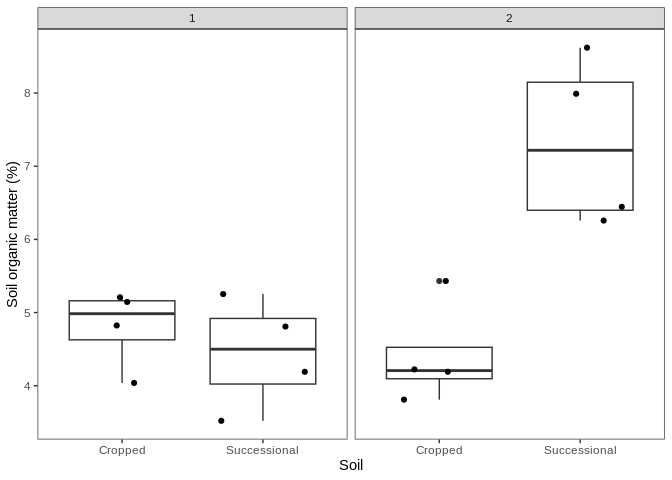

Dunlop - SOM and pH
================
Cassandra Wattenburger
2/16/2021

# Import libraries

``` r
library(tidyverse)

sessionInfo()
```

    ## R version 3.6.3 (2020-02-29)
    ## Platform: x86_64-pc-linux-gnu (64-bit)
    ## Running under: Ubuntu 18.04.4 LTS
    ## 
    ## Matrix products: default
    ## BLAS:   /usr/lib/x86_64-linux-gnu/blas/libblas.so.3.7.1
    ## LAPACK: /usr/lib/x86_64-linux-gnu/lapack/liblapack.so.3.7.1
    ## 
    ## locale:
    ##  [1] LC_CTYPE=en_US.UTF-8       LC_NUMERIC=C              
    ##  [3] LC_TIME=en_US.UTF-8        LC_COLLATE=en_US.UTF-8    
    ##  [5] LC_MONETARY=en_US.UTF-8    LC_MESSAGES=en_US.UTF-8   
    ##  [7] LC_PAPER=en_US.UTF-8       LC_NAME=C                 
    ##  [9] LC_ADDRESS=C               LC_TELEPHONE=C            
    ## [11] LC_MEASUREMENT=en_US.UTF-8 LC_IDENTIFICATION=C       
    ## 
    ## attached base packages:
    ## [1] stats     graphics  grDevices utils     datasets  methods   base     
    ## 
    ## other attached packages:
    ## [1] forcats_0.5.1   stringr_1.5.0   dplyr_1.1.0     purrr_1.0.1    
    ## [5] readr_2.1.0     tidyr_1.3.0     tibble_3.1.6    ggplot2_3.4.1  
    ## [9] tidyverse_1.3.1
    ## 
    ## loaded via a namespace (and not attached):
    ##  [1] tidyselect_1.2.0 xfun_0.39        haven_2.4.3      colorspace_2.1-0
    ##  [5] vctrs_0.5.2      generics_0.1.3   htmltools_0.5.5  yaml_2.3.7      
    ##  [9] utf8_1.2.3       rlang_1.1.1      pillar_1.6.4     withr_2.5.0     
    ## [13] glue_1.6.2       DBI_1.1.3        dbplyr_2.1.1     modelr_0.1.8    
    ## [17] readxl_1.3.1     lifecycle_1.0.3  munsell_0.5.0    gtable_0.3.3    
    ## [21] cellranger_1.1.0 rvest_1.0.2      evaluate_0.21    knitr_1.36      
    ## [25] tzdb_0.2.0       fastmap_1.1.1    fansi_1.0.4      broom_0.7.10    
    ## [29] Rcpp_1.0.10      backports_1.4.1  scales_1.2.1     jsonlite_1.8.4  
    ## [33] fs_1.6.2         hms_1.1.1        digest_0.6.31    stringi_1.7.12  
    ## [37] grid_3.6.3       cli_3.6.1        tools_3.6.3      magrittr_2.0.3  
    ## [41] crayon_1.5.2     pkgconfig_2.0.3  ellipsis_0.3.2   xml2_1.3.4      
    ## [45] reprex_2.0.1     lubridate_1.8.0  assertthat_0.2.1 rmarkdown_2.11  
    ## [49] httr_1.4.6       rstudioapi_0.14  R6_2.5.1         compiler_3.6.3

``` r
rm(list=ls())
```

# Soil organic matter

``` r
# Import data
som = read_csv("../data_biogeochem/growthrate_insitu_som.csv")
som = som %>% 
  filter((Soil=="S" & Year==17) | (Soil=="C" & Year==3)) %>%
  mutate(som = (Preignition - Postignition) / (Preignition - Crucible) * 100, # calculate % SOM
         Soil = parse_factor(Soil),
         Soil = recode_factor(Soil, C="Cropped", S="Successional")) # clean up

som %>% 
  ggplot(aes(x=Soil, y=som)) +
  geom_boxplot() +
  geom_jitter() +
  labs(y="Soil organic matter (%)") +
  theme_test()
```

<!-- -->

``` r
som %>% 
  ggplot(aes(x=Soil, y=som)) +
  geom_boxplot() +
  geom_jitter() +
  facet_wrap(~Block) +
  labs(y="Soil organic matter (%)") +
  theme_test()
```

<!-- -->

**Statistics**

Simple linear model:

Consulted statistician, with block having such a storng effect,
suggested to use as main effect with interaction term.

``` r
som.lm = lm(som ~ Soil+Block+Soil*Block, data=som)

hist(resid(som.lm))
```

<!-- -->

``` r
plot(predict(som.lm), resid(som.lm))
```

<!-- -->

``` r
anova(som.lm)
```

    ## Analysis of Variance Table
    ## 
    ## Response: som
    ##            Df  Sum Sq Mean Sq F value   Pr(>F)   
    ## Soil        1  6.5217  6.5217  9.6736 0.009017 **
    ## Block       1  6.2254  6.2254  9.2341 0.010297 * 
    ## Soil:Block  1 10.7272 10.7272 15.9117 0.001797 **
    ## Residuals  12  8.0901  0.6742                    
    ## ---
    ## Signif. codes:  0 '***' 0.001 '**' 0.01 '*' 0.05 '.' 0.1 ' ' 1

# pH

``` r
# Import data
ph = read_csv("../data_biogeochem/growthrate_insitu_ph.csv")
ph = ph %>% 
  filter((Soil=="S" & Year==17) | (Soil=="C" & Year==3)) %>%
  mutate(Soil = parse_factor(Soil),
         Soil = recode_factor(Soil, C="Cropped", S="Successional")) # clean up

ph %>% 
  ggplot(aes(x=Soil, y=pH)) +
  geom_boxplot() +
  geom_jitter() +
  labs(x="") +
  theme_test()
```

<!-- -->

``` r
ph %>% 
  ggplot(aes(x=Soil, y=pH)) +
  geom_boxplot() +
  facet_wrap(~Block) +
  labs(x="") +
  geom_jitter() +
  theme_test()
```

<!-- -->

**Statistics**

Simple linear model

  - Soil and Block as main effects with interaction term

<!-- end list -->

``` r
ph.lm = lm(pH ~ Soil + Block + Soil*Block, data=ph)

hist(resid(ph.lm)) # check normality
```

<!-- -->

``` r
plot(predict(ph.lm), resid(ph.lm)) # check variances
```

<!-- -->

``` r
anova(ph.lm)
```

    ## Analysis of Variance Table
    ## 
    ## Response: pH
    ##            Df  Sum Sq  Mean Sq F value  Pr(>F)  
    ## Soil        1 0.00019 0.000190  0.0040 0.95064  
    ## Block       1 0.18484 0.184835  3.8913 0.07420 .
    ## Soil:Block  1 0.27502 0.275016  5.7899 0.03485 *
    ## Residuals  11 0.52249 0.047499                  
    ## ---
    ## Signif. codes:  0 '***' 0.001 '**' 0.01 '*' 0.05 '.' 0.1 ' ' 1

### Make table of results

``` r
# Merge SOM and pH data
som.ph = full_join(som, ph) %>%
  group_by(Soil) %>%
  summarize(som.avg = mean(som, na.rm=TRUE), som.sd = sd(som, na.rm=TRUE),
            ph.avg = mean(pH, na.rm=TRUE), ph.sd = sd(pH, na.rm=TRUE))
som.ph
```

    ## # A tibble: 2 × 5
    ##   Soil         som.avg som.sd ph.avg ph.sd
    ##   <fct>          <dbl>  <dbl>  <dbl> <dbl>
    ## 1 Cropped         4.61  0.616   4.89 0.289
    ## 2 Successional    5.89  1.79    4.90 0.257
