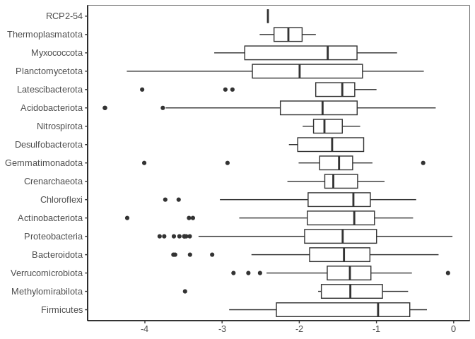

Dunlop - revisions
================
Cassandra Wattenburger
6/8/2023

# Import libraries

``` r
library(tidyverse)
library(mclust)

sessionInfo()
```

    ## R version 3.6.3 (2020-02-29)
    ## Platform: x86_64-pc-linux-gnu (64-bit)
    ## Running under: Ubuntu 18.04.4 LTS
    ## 
    ## Matrix products: default
    ## BLAS:   /usr/lib/x86_64-linux-gnu/blas/libblas.so.3.7.1
    ## LAPACK: /usr/lib/x86_64-linux-gnu/lapack/liblapack.so.3.7.1
    ## 
    ## locale:
    ##  [1] LC_CTYPE=en_US.UTF-8       LC_NUMERIC=C              
    ##  [3] LC_TIME=en_US.UTF-8        LC_COLLATE=en_US.UTF-8    
    ##  [5] LC_MONETARY=en_US.UTF-8    LC_MESSAGES=en_US.UTF-8   
    ##  [7] LC_PAPER=en_US.UTF-8       LC_NAME=C                 
    ##  [9] LC_ADDRESS=C               LC_TELEPHONE=C            
    ## [11] LC_MEASUREMENT=en_US.UTF-8 LC_IDENTIFICATION=C       
    ## 
    ## attached base packages:
    ## [1] stats     graphics  grDevices utils     datasets  methods   base     
    ## 
    ## other attached packages:
    ##  [1] mclust_6.0.0    forcats_0.5.1   stringr_1.5.0   dplyr_1.1.0    
    ##  [5] purrr_1.0.1     readr_2.1.0     tidyr_1.3.0     tibble_3.1.6   
    ##  [9] ggplot2_3.4.1   tidyverse_1.3.1
    ## 
    ## loaded via a namespace (and not attached):
    ##  [1] tidyselect_1.2.0 xfun_0.39        haven_2.4.3      colorspace_2.1-0
    ##  [5] vctrs_0.5.2      generics_0.1.3   htmltools_0.5.5  yaml_2.3.7      
    ##  [9] utf8_1.2.3       rlang_1.1.1      pillar_1.6.4     withr_2.5.0     
    ## [13] glue_1.6.2       DBI_1.1.3        dbplyr_2.1.1     modelr_0.1.8    
    ## [17] readxl_1.3.1     lifecycle_1.0.3  munsell_0.5.0    gtable_0.3.3    
    ## [21] cellranger_1.1.0 rvest_1.0.2      evaluate_0.21    knitr_1.36      
    ## [25] tzdb_0.2.0       fastmap_1.1.1    fansi_1.0.4      broom_0.7.10    
    ## [29] Rcpp_1.0.10      backports_1.4.1  scales_1.2.1     jsonlite_1.8.4  
    ## [33] fs_1.6.2         hms_1.1.1        digest_0.6.31    stringi_1.7.12  
    ## [37] grid_3.6.3       cli_3.6.1        tools_3.6.3      magrittr_2.0.3  
    ## [41] crayon_1.5.2     pkgconfig_2.0.3  ellipsis_0.3.2   xml2_1.3.4      
    ## [45] reprex_2.0.1     lubridate_1.8.0  assertthat_0.2.1 rmarkdown_2.11  
    ## [49] httr_1.4.6       rstudioapi_0.14  R6_2.5.1         compiler_3.6.3

``` r
rm(list=ls())
```

# Import data

``` r
# Growth and death estimates
growth <- readRDS("../rdata.files/gr_gr.paprica.clean.rds")
death <- readRDS("../rdata.files/gr_death_estimates.rds") 
tax_old <- bind_rows(growth, death) %>% 
  select(ASV, Domain:Genus) %>% 
  unique()

# Clusters
clust <- readRDS("../rdata.files/gr_growth_clusters.rds")
  
# Reclassified ASVs
tax_new <- read_tsv("../reclassify_silva138/taxonomy.fixed.tsv") %>% 
  rename(ASV = OTU) %>% 
  mutate(across(c("Domain":"Genus"), ~ gsub("[a-z]__", "", .x)),
         Genus_reformat = gsub("\\t.+", "", Genus))
tax_new
```

    ## # A tibble: 48,437 × 8
    ##    ASV      Domain  Phylum   Class   Order   Family   Genus      Genus_reformat 
    ##    <chr>    <chr>   <chr>    <chr>   <chr>   <chr>    <chr>      <chr>          
    ##  1 d78d0f7… Bacter… Verruco… Chlamy… Chlamy… Simkani… "Ga007414… Ga0074140      
    ##  2 0d431f1… Bacter… Plancto… Planct… Gemmat… Gemmata… "uncultur… uncultured     
    ##  3 ad47913… Bacter… Methylo… Methyl… Rokuba… Rokubac… "Rokubact… Rokubacteriales
    ##  4 097bf57… Bacter… Proteob… Gammap… Pseudo… Pseudom… "Pseudomo… Pseudomonas    
    ##  5 1b8a559… Bacter… Plancto… Phycis… Tepidi… WD2101_… "WD2101_s… WD2101_soil_gr…
    ##  6 711c958… Bacter… Patesci… Parcub… Candid… Candida… "Candidat… Candidatus_Jor…
    ##  7 6cbebc3… Bacter… Plancto… Phycis… Tepidi… CPla-3_… "CPla-3_t… CPla-3_termite…
    ##  8 10c97dc… Bacter… Plancto… Phycis… mle1-8  mle1-8   "mle1-8"   mle1-8         
    ##  9 4115c93… Bacter… Bactero… Kapaba… Kapaba… Kapabac… "Kapabact… Kapabacteriales
    ## 10 52722a4… Bacter… Chlorof… Ktedon… Ktedon… Ktedono… "uncultur… uncultured     
    ## # … with 48,427 more rows

# Taxonomy classification changes

``` r
tax_compare <- tax_old %>% 
  rename(Domain_old = Domain, Phylum_old = Phylum, Class_old = Class, Order_old = Order, Family_old = Family, Genus_old = Genus) %>% 
  left_join(tax_new)
tax_compare
```

    ##                                  ASV Domain_old               Phylum_old
    ## 1   7fb5f0552a6c5d02e7d3ab7a23e72431   Bacteria          Verrucomicrobia
    ## 2   13efa1273a971a5ffc37c3c5064acb9e   Bacteria           Actinobacteria
    ## 3   5489f226d0816b06d648e9ff74e5335d   Bacteria           Proteobacteria
    ## 4   2cd1eb59a35a3ef45c33807652304187   Bacteria           Proteobacteria
    ## 5   a29a1bd6e6654d95b0f69028b0c408b6   Bacteria           Actinobacteria
    ## 6   b1c917b08f0b57bc0abaceecc84a209b   Bacteria           Actinobacteria
    ## 7   e1f9e5f4409e4398535d48bd3d09a906   Bacteria           Actinobacteria
    ## 8   26c010a94f9b854581e4d258986d31ca   Bacteria           Actinobacteria
    ## 9   ee66b723928b2fc3d5a5409e60bdf0c7   Bacteria           Actinobacteria
    ## 10  966f96eea341f47769fbe29a4add42c4   Bacteria           Proteobacteria
    ## 11  a6873fd6a84653d16a0a4bf0b6721776   Bacteria              Chloroflexi
    ## 12  25eea6b99d47e81dd5061b38cf39b64c   Bacteria           Proteobacteria
    ## 13  fbf7394721f54247ba26349632bc52ab   Bacteria           Proteobacteria
    ## 14  74a5860c8e12fb18614524642b0be5ba   Bacteria           Actinobacteria
    ## 15  a64f363c22e4ad6c7fd1eeca30e650de   Bacteria           Actinobacteria
    ## 16  bf070f829889348d8a0eceb14b0c1210   Bacteria           Actinobacteria
    ## 17  3a661981c7aefc87d66e88547968054c   Bacteria            Acidobacteria
    ## 18  a27c5b452fec5709d15a1434bde28d71   Bacteria           Actinobacteria
    ## 19  f8753215694ad73ff192db608a6eaaa3   Bacteria           Actinobacteria
    ## 20  49a76279bbe2eca1b4eb7d7260fb1e84   Bacteria           Actinobacteria
    ## 21  d84be5218dee5235255b1a5d53dfdf30   Bacteria           Proteobacteria
    ## 22  2ab64dccbb90c23267ce413637903d5d   Bacteria           Actinobacteria
    ## 23  18309f6be5b3e8fe4cb0f9ca08493cf7   Bacteria           Actinobacteria
    ## 24  2857204de797331ae43adfdfb55d10aa   Bacteria           Proteobacteria
    ## 25  b0fca72f74987b46a7bbb035f9600f14   Bacteria           Proteobacteria
    ## 26  f3c22b32df7d52902afb5eb11b65cb91   Bacteria           Actinobacteria
    ## 27  6ded3c8001b6778635b45527b5654719   Bacteria           Proteobacteria
    ## 28  5bcab5f6d967c83f24b9fa3f35e7b418   Bacteria               Firmicutes
    ## 29  5b673c3b8fdc83b84c94faf819d555b7   Bacteria           Proteobacteria
    ## 30  c2392fd4c9d870badcd6b08bb114b913   Bacteria           Proteobacteria
    ## 31  4c054e25cbfcf8c96b53bfeac32918e8   Bacteria           Actinobacteria
    ## 32  934a0cbb245490374e5f5a3d24243d6b   Bacteria           Proteobacteria
    ## 33  551e0cb66a40680d0fd1203cd5083c83   Bacteria            Acidobacteria
    ## 34  5a2e7094b8dfe27a0c35f8d06fc76acf   Bacteria           Actinobacteria
    ## 35  56cd7367e402478d6b12fb57423cefc0   Bacteria          Verrucomicrobia
    ## 36  0dbb9affba1360bee94f5c147f1c0fd6   Bacteria              Chloroflexi
    ## 37  180fe49a80ec0f025ddaec116aa40f27   Bacteria           Actinobacteria
    ## 38  9da398d4bc12b2a83b83f0a990752d0e   Bacteria           Proteobacteria
    ## 39  0d6aa96916b7b7a9cf836b5836d3a7b5   Bacteria           Actinobacteria
    ## 40  245d9b13939f1514788b14302b3de5e2   Bacteria           Actinobacteria
    ## 41  fea9278d3c15c82ab4f764b437cf3617   Bacteria            Acidobacteria
    ## 42  fd94c816efebe35824d7f164222602be   Bacteria           Proteobacteria
    ## 43  bc5a26481ce2b67ebbc6e73daaa6276c   Bacteria           Actinobacteria
    ## 44  a9885dee9e99bdd84764f707cc1c9458   Bacteria           Proteobacteria
    ## 45  00d9c1f5fb90af7120e13c2e308746ce   Bacteria          Verrucomicrobia
    ## 46  f7aeb4b86b3d42ce5580dab93179080d   Bacteria           Proteobacteria
    ## 47  dfc0e7ffc73205238e30b675bcc8fdc7   Bacteria           Actinobacteria
    ## 48  cfb6d122671917f2be00e2486c4b8292   Bacteria           Proteobacteria
    ## 49  45aee044788eab63089516e195e32401   Bacteria           Actinobacteria
    ## 50  d93dd206797d9eeb7ffe22e4333119ab   Bacteria           Proteobacteria
    ## 51  66a83d47919b1aaa50b98d1feb713836   Bacteria           Proteobacteria
    ## 52  a260b4380f4cc177acb75798cdff2edd   Bacteria           Actinobacteria
    ## 53  785c6212af3414b11d074b8310f5cd16   Bacteria           Actinobacteria
    ## 54  5e5743ba6662cbc713ffba8e913d7a14   Bacteria           Actinobacteria
    ## 55  5cda2444c72673016ef2552292d74320   Bacteria           Actinobacteria
    ## 56  6e6db996d958b3c808069461b058dc7c   Bacteria           Actinobacteria
    ## 57  cb85b394ebfeaf93ee43b1413f558ccc   Bacteria           Actinobacteria
    ## 58  1da4631d4ffb5f5c36e0d0a54dd0f53d   Bacteria            Acidobacteria
    ## 59  5009e08df4ab2958c754d040bc66cffa   Bacteria            Acidobacteria
    ## 60  5b12b0419470ae620c9db47d22431322   Bacteria              Chloroflexi
    ## 61  8be114ccb93b9e7920fc2e2db66bc4e7   Bacteria            Acidobacteria
    ## 62  3df757d73e956428e98c51f1c09a6dba   Bacteria           Proteobacteria
    ## 63  700107b31ac7cc09b177fa2720aee78c   Bacteria              Chloroflexi
    ## 64  cb7f64fc5968c673669a96c3590ba54d   Bacteria           Proteobacteria
    ## 65  aeef15c1e082889808e5de3c32cec492   Bacteria           Actinobacteria
    ## 66  9a3392803159c426e515e2fac34542eb   Bacteria           Actinobacteria
    ## 67  c226360dc3c42edeb5172aa664af11b4   Bacteria           Proteobacteria
    ## 68  b4270bb044384df11097551675877326   Bacteria           Proteobacteria
    ## 69  28ffcdcfc4c5e9d79c11e34a4ce54ca6   Bacteria           Proteobacteria
    ## 70  e2f460716e1369a84342b0f88d474150   Bacteria           Proteobacteria
    ## 71  5a948b369e6a4a7473fca311b8cd4ab9   Bacteria           Proteobacteria
    ## 72  eb427612819eb7cd023d0af38f746c48   Bacteria          Verrucomicrobia
    ## 73  aa89a9a5064bd87bb277eddd3f05d67a   Bacteria           Proteobacteria
    ## 74  830b54cd80e688c8f8cda75d49fc2afd   Bacteria           Actinobacteria
    ## 75  c633a160d187e9f4db9e79760dc54641   Bacteria           Actinobacteria
    ## 76  4b8e45b195db6ed56c2861497f2eed57   Bacteria            Acidobacteria
    ## 77  9eb08feb9daacf76f86b8c10026ac506   Bacteria            Acidobacteria
    ## 78  fd4777017dc33c7520e6438dda68a73a   Bacteria           Actinobacteria
    ## 79  3c4bdf631e1ada248dc17debbc618da4   Bacteria    unclassified Bacteria
    ## 80  16a28e0e8a95b764c9acc9d2488868d3   Bacteria           Actinobacteria
    ## 81  f0b2c50ca00fbe877986888ebfd4ddb2   Bacteria           Planctomycetes
    ## 82  86bffd70e67661b3fe10036d2d882d51   Bacteria           Planctomycetes
    ## 83  1fce6bb917dc5072ed9d4cd7b8e9de7f   Bacteria           Proteobacteria
    ## 84  02066fbd1b08b0f2be13ae5201b221d0   Bacteria            Acidobacteria
    ## 85  fe92750f184b55dc1236e2150c6dd800   Bacteria    unclassified Bacteria
    ## 86  c92f5eb5b2a7fa10ae8b976648ec3be1   Bacteria            Acidobacteria
    ## 87  aecae9d790a63cf565c1b5cdbd02ebdd   Bacteria           Actinobacteria
    ## 88  695cd98fb9d9e4316f8724cec92297e5   Bacteria          Verrucomicrobia
    ## 89  dc8a7a6d87d1d44ee4b573338bb11c88   Bacteria           Proteobacteria
    ## 90  660b1ebb54b3883d210da2a89f41c284   Bacteria           Planctomycetes
    ## 91  426c17e2141ebb3a0c49c3109190095f   Bacteria           Actinobacteria
    ## 92  efa6c86064fff7a139e3bed97aa46576   Bacteria            Acidobacteria
    ## 93  ab14de2b9e10ff058325dd11aa422ee2   Bacteria           Proteobacteria
    ## 94  fd0c746ffcbf8933d20be3ee87bdea6a   Bacteria            Acidobacteria
    ## 95  9eb85d6e8a42af457bd8eb4c1bbf35a6   Bacteria           Proteobacteria
    ## 96  1e75b8498993e0dfe9fbd6f33ae54e5e   Bacteria           Proteobacteria
    ## 97  6047c1d546a2de1c47684db6bfeb114d   Bacteria           Actinobacteria
    ## 98  d3051c0720e214b88e2b514df5c53db7   Bacteria           Actinobacteria
    ## 99  ba6045ea28fb60b88954a4b83b29913a   Bacteria          Verrucomicrobia
    ## 100 6f2839bf00ad7b2f53ff75c6a9335cac   Bacteria            Acidobacteria
    ## 101 ddb25332e3646dfd98b141a12ca01e71   Bacteria           Actinobacteria
    ## 102 c20f855545a7f960b58bd7e2e1b43391   Bacteria              Nitrospirae
    ## 103 71816da4428f57ace5fa93a73a833f12   Bacteria              Chloroflexi
    ## 104 e41980e99db6201bd33cec053f6f686b   Bacteria           Actinobacteria
    ## 105 e11a06d96e7ec1e292e649053cfd768c   Bacteria          Verrucomicrobia
    ## 106 9080ca55a25e66021e57a8eb4fc82add   Bacteria           Planctomycetes
    ## 107 b4d19872629a7e5ade3e9a5448bc884d   Bacteria           Actinobacteria
    ## 108 847342ba4720518f4a96f699c1078741   Bacteria           Actinobacteria
    ## 109 134e1c859ff430e9a868dde840931a76   Bacteria           Proteobacteria
    ## 110 7dbe8b57d3fb5d4aa8369ba6509f46c6   Bacteria           Proteobacteria
    ## 111 17597ce751804e4b754f1bfce8ae3c66   Bacteria           Actinobacteria
    ## 112 13e4a5f455c50b2e805e017ca450ade2   Bacteria           Proteobacteria
    ## 113 28c42c1eb87776e7f0d49aef13870ece   Bacteria           Proteobacteria
    ## 114 66903552e1640b2cfd3c06d111ada008   Bacteria            Acidobacteria
    ## 115 9f207c3ed139846307091bdfd674df9d   Bacteria           Actinobacteria
    ## 116 b54ac475ae9522227eecf0dea1f043dc   Bacteria          Verrucomicrobia
    ## 117 067bc308f1e1da3cc2694bdb4d309026   Bacteria           Proteobacteria
    ## 118 87902efe4dbfc3fec2d941800a43a4ee   Bacteria         Gemmatimonadetes
    ## 119 8c56bf1b1b0c58fdb779b2235bca3b2b   Bacteria           Proteobacteria
    ## 120 75319b6314ba453fe03eb300aafcf11b   Bacteria               Firmicutes
    ## 121 f6821dacb060608f4898dae06de3cfec   Bacteria           Actinobacteria
    ## 122 1dccd87cf4128d2e6c452b19315eba41   Bacteria            Acidobacteria
    ## 123 605596ecf2947cdef19b946e1a0dc6ea   Bacteria            Bacteroidetes
    ## 124 9e314e22f8b64660b7510fc78469ef95   Bacteria           Proteobacteria
    ## 125 3c62d1639fd57df120e5a1d3c40e5b21   Bacteria           Proteobacteria
    ## 126 0e7914232890196c738adb31eaf26d63   Bacteria           Proteobacteria
    ## 127 8443b289bc9ad5100fb04d8fb79965b0   Bacteria    unclassified Bacteria
    ## 128 41003f15e478a12630730503e079bcc9   Bacteria           Proteobacteria
    ## 129 54e8d56352bcaabd7ffc8657847276c3   Bacteria           Proteobacteria
    ## 130 8c59b14983a5dad85cecc4e4a8dd152d   Bacteria            Acidobacteria
    ## 131 5f164cfb845a9cf0cf46c59bfc916004   Bacteria           Actinobacteria
    ## 132 3463e6ba3b1683491802c2baaa5e5187   Bacteria          Verrucomicrobia
    ## 133 c624dcd6d5ac8cafd82c8bdddf72a57d   Bacteria           Actinobacteria
    ## 134 1ce7f012b6b28dffdbc04466ff3c088d   Bacteria           Proteobacteria
    ## 135 931ddb2f821a8f126d8cff16cbeef716   Bacteria           Proteobacteria
    ## 136 31e319d601c4d3fac5045ce02b28ef1a   Bacteria           Actinobacteria
    ## 137 96bcd7705bcf71cdd9d89ef48b3281ba   Bacteria           Proteobacteria
    ## 138 c853f2c009e537a70be865e28a1c8c4e   Bacteria           Proteobacteria
    ## 139 6702db2c3fb7bb6e12e09fe310bbb967   Bacteria           Proteobacteria
    ## 140 35db81c95c0e0cc5a1442ba489904bef   Bacteria           Actinobacteria
    ## 141 a115fc56e14ba5edfb012a080c996623   Bacteria           Proteobacteria
    ## 142 00e31c9f64e0bdf0d9c353b0ffeda2b5   Bacteria           Proteobacteria
    ## 143 892005046f5aa8b439bd705b1e28633b   Bacteria           Proteobacteria
    ## 144 5b18237cf385326c2cda6c3441ba8d40   Bacteria           Proteobacteria
    ## 145 f1123c2585e3273b6855edda4ac30a5c   Bacteria           Proteobacteria
    ## 146 2537e483a08b7f810f4caa60235a858a   Bacteria           Planctomycetes
    ## 147 17da2455692bf28bf557d762c8e034ac   Bacteria           Actinobacteria
    ## 148 74bd182c683185ad6ab76579ced65fd8   Bacteria           Planctomycetes
    ## 149 b7f9209daad2c3dc483381158506a79f   Bacteria           Proteobacteria
    ## 150 1d6cc48db68f66ced39d8c8eb1a99595   Bacteria           Proteobacteria
    ## 151 588ef615f071b498d2737fedd0762a57   Bacteria           Proteobacteria
    ## 152 e689c226348d4fa908bd59719525594c   Bacteria           Actinobacteria
    ## 153 4b50653c9802367d2af9b5e446b79527   Bacteria            Bacteroidetes
    ## 154 7f827f39e69cbcbd697e8f0bb9d189c7   Bacteria           Actinobacteria
    ## 155 9c14195a40325ebecc88c2b9d8c1b9aa   Bacteria            Acidobacteria
    ## 156 0ab66e0afc42f5996c80d95ba5aba37d   Bacteria            Acidobacteria
    ## 157 18f0dbf6cdd35e37d7009d48cec36904   Bacteria              Chloroflexi
    ## 158 d0dff1f6eae0320a5eb8221aa70fcd38   Bacteria           Planctomycetes
    ## 159 7169223c874c8d33b16984fdcaea14ad   Bacteria           Proteobacteria
    ## 160 91dfc1ae30778e83d1ea4c517d8d73e5   Bacteria          Verrucomicrobia
    ## 161 8e60800186dcbab63b6a9ce7ac09e103   Bacteria              Chloroflexi
    ## 162 7973aa419def53853b85234d1c4930dc   Bacteria           Proteobacteria
    ## 163 efdd7620bb28b2e6d806cf42d41cfe00   Bacteria               Firmicutes
    ## 164 513539d2ba09ebdb51ecfc453c58d838   Bacteria           Actinobacteria
    ## 165 233666baae382d915522c4d673827dd8   Bacteria           Proteobacteria
    ## 166 0cc80a814ce62264be8bc17a0444bcc7   Bacteria           Proteobacteria
    ## 167 4bc72f98feac933730bfd3defd1eff7a   Bacteria           Proteobacteria
    ## 168 0d7871c5c607f93cdc754213addab74e   Bacteria           Actinobacteria
    ## 169 c330e1f0550ededb9ea2193b98012696   Bacteria            Acidobacteria
    ## 170 f9660a565b2f11fc257ab92f88a2d57f   Bacteria           Proteobacteria
    ## 171 3c771c43772038f8218b747117c635b3   Bacteria            Bacteroidetes
    ## 172 7782b1795ae4a78b417d6ae4dcad2294   Bacteria              Nitrospirae
    ## 173 720c3dad504b3f74f0d96726e47ceb56   Bacteria           Actinobacteria
    ## 174 c7f076af521e51244446e77387434877   Bacteria           Actinobacteria
    ## 175 808a42c9e12aea33b7bf02a098392cd7    Archaea           Thaumarchaeota
    ## 176 0883ee7e1373951256a2856285852690   Bacteria           Actinobacteria
    ## 177 8405f2cd85e49b2ba66b2246cdeb5523   Bacteria              Chloroflexi
    ## 178 a86430d6c90e958d9a74cd6f418883a3   Bacteria           Proteobacteria
    ## 179 8f9be9295cbcf6d6ef7238691b44915f   Bacteria           Actinobacteria
    ## 180 158f8c9adb68c1321f14c9ec5df11ec1   Bacteria            Acidobacteria
    ## 181 481f96db83bf80909a46613cf5fda26b   Bacteria           Proteobacteria
    ## 182 ad999caf082d59fd7e6d04a7cf2143bd   Bacteria           Actinobacteria
    ## 183 7b2f433df15c2ae38fc8dba4444b857a   Bacteria           Actinobacteria
    ## 184 8f24abb870243f1d0130f16d634d4f39   Bacteria           Proteobacteria
    ## 185 2cd322c9b717f050fd42f5c7b4e8b9e1   Bacteria           Actinobacteria
    ## 186 30a8d07e083f9af965bea8bae19fca04   Bacteria              Chloroflexi
    ## 187 9bebb8f8ce321976749b322cbf3e6790   Bacteria           Actinobacteria
    ## 188 6cb2020db74c51c5ad38d4f5bb72ad04   Bacteria            Acidobacteria
    ## 189 dec663d82dea3909ae5203f65f13b84a   Bacteria           Proteobacteria
    ## 190 ffa1fd2a4f14e98df2f8e9609ba617f6   Bacteria            Bacteroidetes
    ## 191 a9766f1faf11cb757da441f2dbd6b7a3   Bacteria           Proteobacteria
    ## 192 e64e5cd639b4e44d1a2bed20feb7d86d   Bacteria           Proteobacteria
    ## 193 bbb12a385b1fa60b3133c1b1ec09174e   Bacteria           Proteobacteria
    ## 194 f430cb50ac92ceee0a3f857f76da6008   Bacteria           Proteobacteria
    ## 195 886696e15dcafb46c9d953b67f89ded1   Bacteria         Gemmatimonadetes
    ## 196 43d5f162125cd7bf8ece35b3170c1042   Bacteria           Proteobacteria
    ## 197 b8bff9622de2c53c2391678019adb8b9   Bacteria           Proteobacteria
    ## 198 984beda7fdec28c3b9d6201d5c30d388   Bacteria           Proteobacteria
    ## 199 ead9d430f5e3138e79fff4d17043c8db   Bacteria           Proteobacteria
    ## 200 8d0a3f1883d21820c574e4d148d3d7e3   Bacteria           Proteobacteria
    ## 201 e5fc321d936f8df29e824c6f79ebaeba   Bacteria         Gemmatimonadetes
    ## 202 784978f47b3419284829198cfbd032ce   Bacteria           Proteobacteria
    ## 203 a860339330ea0974dc02f13ee5a6d5c9   Bacteria            Acidobacteria
    ## 204 65c6daf8e027e49e170104d837d78f81   Bacteria         Gemmatimonadetes
    ## 205 0cbd8880429e1177a30ba5cc245ec3d3   Bacteria            Acidobacteria
    ## 206 e8eaa19717b2697ed7e0296fda5e5ff9   Bacteria           Proteobacteria
    ## 207 72c62d4d052f5aa131c9a91316104cf6    Archaea           Thaumarchaeota
    ## 208 d9c0ad13ea3fdf43316bd9734f22b835   Bacteria              Chloroflexi
    ## 209 32a82ec1feaddd3217825677827fb185   Bacteria           Proteobacteria
    ## 210 03cb34fffafb9c622726c198171b651d   Bacteria           Proteobacteria
    ## 211 62341cba96c415a57c1889653e605c0f    Archaea           Thaumarchaeota
    ## 212 c6448f849302b88fe1e9c28563f5e436   Bacteria          Ignavibacteriae
    ## 213 ca74d40e23b699812980a9a0c8acaf7d   Bacteria           Proteobacteria
    ## 214 6417df5405a9488579c768f16d0ca587    Archaea   putative Euryarchaeota
    ## 215 6e85120c4fcfa24a0e7cb5c5b22e462d   Bacteria           Proteobacteria
    ## 216 99c151c2526d7ae49cf545f74ffc4736   Bacteria putative Latescibacteria
    ## 217 692a26188cb2e4528d0add62ea0d77f1   Bacteria            Acidobacteria
    ## 218 1b3c91b4f7cb3e4a91b2adc2624ba1db   Bacteria          Verrucomicrobia
    ## 219 de61552554b6846fe3b6b79f84c97e74   Bacteria            Acidobacteria
    ## 220 98661a875fbcab0453c5a2dad5f6989c   Bacteria          Verrucomicrobia
    ## 221 af3b1e74326ea73dd5151e6642a5afc2   Bacteria            Acidobacteria
    ## 222 3e7278743356baf30abb625a3756ee08   Bacteria          Verrucomicrobia
    ## 223 f82dbccc362b75022c59220dbc23b5e4   Bacteria    unclassified Bacteria
    ## 224 13c3b37c2524d685e08653d9413d6377   Bacteria putative Latescibacteria
    ## 225 90d5dd24a96f52357d9f024d96b56703   Bacteria            Acidobacteria
    ## 226 3c8e616f70b1f369ce3d81035ef58bbd   Bacteria            Acidobacteria
    ## 227 4cd2b3bc93535af904e59e80791ac630   Bacteria            Acidobacteria
    ## 228 601d50a062b0c1bf30149e1898a0e901   Bacteria            Acidobacteria
    ## 229 4446e30111859e675e3c8cb7fb3eedd6   Bacteria            Acidobacteria
    ## 230 ae9ec2db8473c9dca8c3cbeb73b34498   Bacteria           Proteobacteria
    ## 231 c426ed7cf2d2b6eb54171c002b57de94   Bacteria           Proteobacteria
    ## 232 9687e8c82c01a331eb97cc550314d7bd   Bacteria          Verrucomicrobia
    ## 233 30c30176914853af52180565ad1b03f7   Bacteria          Verrucomicrobia
    ## 234 726f2f83fcaccc13003386947c137373   Bacteria               Firmicutes
    ## 235 6dcdd2808e4064196e43ce259e5159f5   Bacteria           Planctomycetes
    ## 236 5c3226496544112c57dc02411fc22e64   Bacteria           Actinobacteria
    ## 237 bbc7ccea955e100a0e4467f2e438957d   Bacteria           Proteobacteria
    ## 238 86bb7569d8fc1b6a5edeb254c3409583   Bacteria           Proteobacteria
    ## 239 aac50359d4752f8471d7002eb9763226   Bacteria           Planctomycetes
    ## 240 ebe4710437ccd6013ec87d556b448de0   Bacteria           Actinobacteria
    ## 241 8e02b0341e644775e79262559a0fedda   Bacteria           Proteobacteria
    ## 242 6cf676fe4ff67d9e45d030ef0c59d4c9   Bacteria    unclassified Bacteria
    ## 243 9b1b699a1a0290925fbe5425c25e8c59   Bacteria            Acidobacteria
    ## 244 04b455ddc06f0cfd6d51fca2fb12c15b   Bacteria            Acidobacteria
    ## 245 1c3d62f9cadb72f55718b353a58bc98a   Bacteria            Acidobacteria
    ## 246 2d525d7bde61a4912a2100a2ab31b7bf   Bacteria            Bacteroidetes
    ## 247 f3f4c58f399d2e2006529d0886efc2e7   Bacteria           Proteobacteria
    ## 248 24927138e8b781195b1a4a439f2a40e6   Bacteria           Proteobacteria
    ## 249 e6f7a4b167876acad9b08f632c3a547f   Bacteria          Verrucomicrobia
    ## 250 08e28eca8844694824dca4b533cbe250   Bacteria              Nitrospirae
    ## 251 3bff4a7210bc8f2b45492d04c01f7be9   Bacteria           Proteobacteria
    ## 252 aeac5e653d0591e5ce9ff688b5642471   Bacteria    unclassified Bacteria
    ## 253 cff2f9f244669f8833ce114f1917f1ee   Bacteria          Verrucomicrobia
    ## 254 dcbf29c673f5b20da2d8a41e0b081821   Bacteria           Proteobacteria
    ## 255 fb01657d1fa6d867c5940630d19b776f   Bacteria           Proteobacteria
    ## 256 6f1657c46e57a121afc59f6ad32699f3   Bacteria         Gemmatimonadetes
    ## 257 ea098ffa651b7162c911c0fab8b15b2e   Bacteria            Acidobacteria
    ## 258 5dd334f50eda715c3e4f8d524c0f843e   Bacteria              Nitrospirae
    ## 259 35f49f1c876f526c13b88230bc1ea401   Bacteria           Proteobacteria
    ## 260 d28cd0afe852ffd7e021e296d2d5880b   Bacteria            Bacteroidetes
    ## 261 1116a445eb86917db170ed95cdb7e8bd   Bacteria            Bacteroidetes
    ## 262 7e13967173772ec029fce7f56b1fa9b1   Bacteria           Actinobacteria
    ## 263 454e80ae9c51abaeb0f49618d4890685   Bacteria            Bacteroidetes
    ## 264 f0af2a52efde04f3f4f8d764186e157e   Bacteria putative Latescibacteria
    ## 265 4859e22cecd39091b56926526ae57dd8   Bacteria           Proteobacteria
    ## 266 0ef3d3d113f84709616dd3e71cbee0ea   Bacteria         Gemmatimonadetes
    ## 267 c7c5913cc6c9b66f13522c56a1404ae5   Bacteria putative Latescibacteria
    ## 268 ce1339559c3f047c6dc487dda0b61f1e   Bacteria    unclassified Bacteria
    ## 269 f2ec05df2a03ae5f769cfc022f995bde   Bacteria     putative Chloroflexi
    ## 270 ac28e943ddc70002e5a01308b075326c   Bacteria         Gemmatimonadetes
    ## 271 42d0fa3ea92471d0d0d47e3f641af3a9   Bacteria          Verrucomicrobia
    ## 272 6a771d7a3de42ac8a0a12da3b0d9a388   Bacteria           Proteobacteria
    ## 273 7a29cc693ac1b467e7b84529ec3713f9    Archaea           Thaumarchaeota
    ## 274 39b3851875946d56bcb8534362c2b996   Bacteria           Proteobacteria
    ## 275 9df64213190650aed5f7e3f5a06bdbbc   Bacteria              Chloroflexi
    ## 276 42a5ce66829298147fee6b3c3cc227db   Bacteria          Verrucomicrobia
    ## 277 3168c100065ad09292aa7af761992269   Bacteria           Planctomycetes
    ## 278 43ccdf4a5a9434b9b74ac3808e016fc2   Bacteria            Bacteroidetes
    ## 279 75701bfb0715c4abcc5958b60c526385   Bacteria          Verrucomicrobia
    ## 280 88e98edc679edbcbd798958b93408dc4    Archaea           Thaumarchaeota
    ## 281 f2b3556d494d0dff52781a507839c8c3   Bacteria           Actinobacteria
    ## 282 d8481980ca9310c80b781d62b034a992   Bacteria           Proteobacteria
    ## 283 98912394bfe8ae3105b9575ea793e685   Bacteria           Proteobacteria
    ## 284 3bc4b46928bc07e28d62ed3c891eab95   Bacteria            Acidobacteria
    ## 285 2b6cb450e25ce7ad8ae4dc927b4ef133    Archaea           Thaumarchaeota
    ## 286 49f5a69aa2a06b44cb710043be236ccc   Bacteria            Acidobacteria
    ## 287 286d80b01371bc50377c27aefaf0ca08   Bacteria           Proteobacteria
    ## 288 7c8c1f3d971565f28b16822a8401225a   Bacteria            Acidobacteria
    ## 289 e02f93f690a002a68b322a52ace26f04   Bacteria            Acidobacteria
    ## 290 40fcf189c6063bd5f5a98bada5a53b6b   Bacteria            Bacteroidetes
    ## 291 dc3413bcb3fcff30c26ef59ab0da9cab   Bacteria           Proteobacteria
    ## 292 f34ff488e9d783a9bf687a20f21720b4   Bacteria           Proteobacteria
    ## 293 78a8d0a8749d7d0b397e83a2ef4b811d   Bacteria          Verrucomicrobia
    ## 294 68c96301504f5faa86b9424ca38d0126   Bacteria            Acidobacteria
    ## 295 b88bf215c5ebdfaf394aabbfd1ee084c   Bacteria           Proteobacteria
    ## 296 78d66ece71c54dc97d23d3f3e4476ffb   Bacteria          Verrucomicrobia
    ## 297 1988ec827a073f0ffe6d735d204dc6d6   Bacteria            Acidobacteria
    ## 298 7bd9fe78c8070a485d00fad7699cc6e3   Bacteria            Bacteroidetes
    ## 299 8c118305828e4853567a9c28013fe4ba   Bacteria              Chloroflexi
    ## 300 70a915b9825ea15dbf3322417e0ab51c   Bacteria              Chloroflexi
    ## 301 4ce464f57ecf8528fba59f3f910d5ca9   Bacteria          Verrucomicrobia
    ## 302 46f5cef03998292f4594b1bfc9c29da4   Bacteria            Acidobacteria
    ## 303 bc9ece68e2e3bacd1d4c08b8147080da   Bacteria            Bacteroidetes
    ## 304 6e174a2ade5a6c98f7ab7c4ef6d44553   Bacteria           Actinobacteria
    ## 305 99d7b9511e322b60e3f350d8a580052f   Bacteria           Proteobacteria
    ## 306 688e54fa121524cfba27e44884794568   Bacteria            Bacteroidetes
    ## 307 86f839d1a331e7bc489d61e2bc91c5d0   Bacteria           Planctomycetes
    ## 308 3d28362bfd064ec4f0696b5707457806   Bacteria           Proteobacteria
    ## 309 a44247f1ec6bd6a562519a41854b08b2   Bacteria            Acidobacteria
    ## 310 c913702b4c15c84bc3cf62ca60ca1705   Bacteria           Proteobacteria
    ## 311 2548ecdf9dc389f363b87d738186c4c0   Bacteria    unclassified Bacteria
    ## 312 e81325ee6d318c6be10ac9cd1379634a   Bacteria              Chloroflexi
    ## 313 4fd4ce0d4fd44918435f569742090871   Bacteria            Acidobacteria
    ## 314 ba9318527fe12e56da91dae10ab61fc0   Bacteria           Planctomycetes
    ## 315 b1052804ba5bd7c2a32033f2a0b2e4e2   Bacteria              Nitrospirae
    ## 316 81d22ae2bf08d0b248bfbc94549f7331   Bacteria            Acidobacteria
    ## 317 78f9e6732e91dd966bef870216c64028   Bacteria            Acidobacteria
    ## 318 a7ac0dcc613090e818efbe1627db0aaf   Bacteria            Bacteroidetes
    ## 319 2f7109033a0ca116daacc4c615df2447   Bacteria            Acidobacteria
    ## 320 e519f224f4ea20df256c0d93c153ad0e   Bacteria            Acidobacteria
    ## 321 c854eff70cc6e47b53c31577935067e4   Bacteria           Proteobacteria
    ## 322 0053bbfcd8cc5b633995e7c7925e615b   Bacteria           Planctomycetes
    ## 323 efb9b479f1871150b7a262f86f73c00b   Bacteria            Acidobacteria
    ## 324 14b1b69bef9793181e521da4efaf5678   Bacteria            Acidobacteria
    ## 325 71d340d759fc17b7494996d855b63e63   Bacteria           Actinobacteria
    ## 326 e082aebe64ea1d94454fe2c72c4f0a63   Bacteria            Acidobacteria
    ## 327 b567284e7db6b7531623114a6c2d630a   Bacteria           Proteobacteria
    ## 328 4abb34a85c9bdbad7eb4638e50e95462   Bacteria           Proteobacteria
    ## 329 8258186365d49edb3e54cd5cc8ebb31a   Bacteria           Planctomycetes
    ## 330 fef3083964b7c1865979f3d8576385db   Bacteria            Acidobacteria
    ## 331 a75ba1a12e98b0c9927ca8cf698f8c59   Bacteria           Planctomycetes
    ## 332 f414c6cd84cfcf99ef5b0a8d42480172   Bacteria           Proteobacteria
    ## 333 f9ae06e157c7cd1af91430d8bc98e052   Bacteria           Proteobacteria
    ## 334 e1462f76b1bc929cf9b3c56171de68a4   Bacteria           Planctomycetes
    ## 335 2975576af7ec342f2faf93c5c9e0ac24   Bacteria           Proteobacteria
    ## 336 ceb02cf60f397373ae42ed9248fe49ad   Bacteria    unclassified Bacteria
    ## 337 1f86d3a4a56a27eaa9e0cb71b62d1860   Bacteria           Proteobacteria
    ## 338 12a00233f8be435fd4a941c420160c9b   Bacteria    unclassified Bacteria
    ## 339 8ee19ab6397f5235bf893fbd98c71f83   Bacteria              Chloroflexi
    ## 340 17748c2863ce323d8fcfe9b76f54783c   Bacteria          Latescibacteria
    ## 341 7f2264a27ef091b92c1fdd95010a2b43   Bacteria           Proteobacteria
    ## 342 e0887176d18059eda156538a46d2e07d   Bacteria              Chloroflexi
    ## 343 dd788cf0d843a4ccd324030310560175   Bacteria           Proteobacteria
    ## 344 5b977613282207c73b376d5557dc861c   Bacteria    unclassified Bacteria
    ## 345 23dffc43124b8969f69c5c2312633678   Bacteria           Actinobacteria
    ## 346 280e808a5c8fcc6e5f4944ca2b7e9f9c   Bacteria           Planctomycetes
    ## 347 db191f97db41ab98cb6bcb525ab56dcc   Bacteria           Actinobacteria
    ## 348 adc942773889a4c3f634e9a9d84d5c92   Bacteria           Planctomycetes
    ## 349 54c692cf9daa5d3659d6e072693f53ca   Bacteria           Proteobacteria
    ## 350 5962f84cd4a63de07a3fb5833df62a88   Bacteria           Actinobacteria
    ## 351 00767ed596251ecfd263e616b144cf97   Bacteria            Bacteroidetes
    ## 352 df06a420c74f91111a4df9f8a5744261   Bacteria           Actinobacteria
    ## 353 41b8e6aab867029dd2e1977349858344   Bacteria           Actinobacteria
    ## 354 6464be27fa36510a48546f11842dface   Bacteria          Verrucomicrobia
    ## 355 9a6f21b524dd983cacd3f02d3f4cf0b5   Bacteria           Actinobacteria
    ## 356 63c9b12323520cfaa70f3880446ae007   Bacteria           Actinobacteria
    ## 357 e8e618d25c813c6b121975ad8eebae26   Bacteria              Chloroflexi
    ## 358 9e23f6088c584f6ebcc47da8d0ee65a4   Bacteria           Planctomycetes
    ## 359 da77113eab1e4e424ca7063617691f1c   Bacteria            Acidobacteria
    ## 360 cec973c03d49c9bb2dfade6866e619db   Bacteria           Actinobacteria
    ## 361 ce5e87d1d0ba3ee06c7dfc6b52bedb77   Bacteria           Actinobacteria
    ## 362 fd1b0977f5da82ccfc4accba047d034f   Bacteria            Acidobacteria
    ## 363 8a02100ad7654f2306214db1e5cc65b6   Bacteria           Actinobacteria
    ## 364 66bab37697b556dcd96ec4376b2d8c48   Bacteria         Gemmatimonadetes
    ## 365 09b9dc34bcc1cc6bb5ae292b4de3c25b   Bacteria           Proteobacteria
    ## 366 5cdf84b65a637652f3d1798b56ff82f7   Bacteria          Verrucomicrobia
    ## 367 503d84fbcd8ed030f3626d970d3c7e45   Bacteria           Proteobacteria
    ## 368 08751d52fd608147a0742e18b3007ad3   Bacteria           Proteobacteria
    ## 369 7801ab2f8aef27667d9beea5ab5d6c64   Bacteria              Chloroflexi
    ## 370 f22af0ca5e8fa50f6a45ad742f7ae9dc   Bacteria            Acidobacteria
    ## 371 c518cf1392cb1eb0cad2e66aef629a64   Bacteria            Bacteroidetes
    ## 372 2b2291e975bb6bf6481b87f46febf7c6   Bacteria           Actinobacteria
    ## 373 1705452dae4967317ff9ebabd0bb0f16   Bacteria            Acidobacteria
    ## 374 84781ed74a7d62cae9023261ea064a45   Bacteria           Planctomycetes
    ## 375 77246d551c4ae85c78036affa7c461ad   Bacteria           Proteobacteria
    ## 376 6d6c14e4f62ef55ec2c9cfe5bdaa9fe6   Bacteria           Planctomycetes
    ## 377 a80dd6d3c0fd248461ba65b95fce1a67   Bacteria           Actinobacteria
    ## 378 1a0f7fb001fbd7174677ac73acb996bd   Bacteria               Firmicutes
    ## 379 cfa5e951fd346ea1cd9b2ea0254dd5d9   Bacteria               Firmicutes
    ## 380 0b4f28566b6a7ee679fa78da297bcd54   Bacteria               Firmicutes
    ## 381 c8e764e3ecdf78535f52b4225d8f2b33   Bacteria           Actinobacteria
    ## 382 aee11eda1fb0a81927f0e2ea83915a3d   Bacteria           Actinobacteria
    ## 383 4b2544b81a01a3355506bfbba84889e1   Bacteria           Planctomycetes
    ## 384 5bb87dfc85bd836513411403b0f86f3e   Bacteria            Acidobacteria
    ## 385 bd5465611ccdc8b5263416e49acdd224   Bacteria           Planctomycetes
    ## 386 51614d29b61fd7eb915011363bfeaf5f   Bacteria           Planctomycetes
    ## 387 186682d74d991161cabf3237f75c9975   Bacteria           Planctomycetes
    ## 388 f5c1a1a80945ec967a002d5b1e6cd7f8   Bacteria           Actinobacteria
    ## 389 b236c31457e77d3eb68a41e64a935e35   Bacteria           Proteobacteria
    ## 390 92488061599b63c420c125a9bcc0c79c   Bacteria  putative Proteobacteria
    ## 391 7f1647245bb70ce108095620c5cc56fc   Bacteria           Planctomycetes
    ## 392 92a1d0e21b21f89268cfbfe230b15290   Bacteria            Acidobacteria
    ## 393 74f89fbce9c4134f1c52130bb93ff90c   Bacteria           Proteobacteria
    ## 394 6e51baaf80717e73928270bf30a87bc5   Bacteria           Proteobacteria
    ## 395 ea18c9b5f6fac15e9e832404b2d6dec9   Bacteria           Proteobacteria
    ## 396 a2b6c95517f07cbcf8d30d7e58a61db6   Bacteria              Chloroflexi
    ## 397 60a4d0f9aa75c290d249c539722d9147   Bacteria    unclassified Bacteria
    ## 398 5ad57a2d2de0310c36c44d074094a917   Bacteria            Acidobacteria
    ## 399 10c97828f0ed8f2bb8e3c613b899ec62   Bacteria            Acidobacteria
    ## 400 c21b10552be5488160e7f63f20f8b1f1   Bacteria            Acidobacteria
    ## 401 78c5d8bdb3d8b90053e38dac85e8788f   Bacteria           Proteobacteria
    ## 402 88a6a44d074b429b5856319c617fa618   Bacteria            Bacteroidetes
    ## 403 a868c0cb314cacd8cda6d33e00af5e0e   Bacteria            Bacteroidetes
    ## 404 580835638998c2b302a9b589d3d53f07   Bacteria            Bacteroidetes
    ## 405 c68ec242ee8fdbb583fa63e645acd3cf   Bacteria            Acidobacteria
    ## 406 353e490b70f701ff4dbf70bf3e9b0edf   Bacteria            Acidobacteria
    ## 407 453db977b8e8136726003fe94cda1ee7   Bacteria            Acidobacteria
    ## 408 2cf875239cd0e4631818529a7bcd9abd   Bacteria           Planctomycetes
    ## 409 0adc5d3c78de69d57262bb3a995b2f27   Bacteria           Actinobacteria
    ## 410 20f7262043d3cdc7404ee8f458fd4500   Bacteria           Proteobacteria
    ## 411 dbc3ec718da733db9d16954355399662   Bacteria           Proteobacteria
    ## 412 9e6518e80c7c3f5393071268f76e3c87   Bacteria          Verrucomicrobia
    ## 413 8b3f3c786099fc7b6ac0f6cecd457631   Bacteria           Proteobacteria
    ## 414 2ce5ccae181d32a1bc2c3c9dd0aec196   Bacteria           Proteobacteria
    ## 415 4f38a2cc0859ffd1b41337a806472787   Bacteria           Proteobacteria
    ## 416 8f285152b375a10a58d67ea5eb952b44   Bacteria          Verrucomicrobia
    ## 417 f9d68ecc8813404de0776d6834201dcd   Bacteria            Acidobacteria
    ## 418 ceaa4d64d7cdf4c21f193d1bbecda9d1   Bacteria              Nitrospirae
    ## 419 a4d4959293abdd1dc4b2d14f2b43a958   Bacteria           Proteobacteria
    ## 420 f8e3d426e4e465258fe478961c36bceb   Bacteria          Verrucomicrobia
    ## 421 970d976b0fbc0a6b5369c3fa5c8b06d3   Bacteria            Acidobacteria
    ## 422 ee2e7ace192db36a48051a439ca2f942   Bacteria           Proteobacteria
    ## 423 4e5d47adfc334343154a5ef5f00d8cf3   Bacteria          Verrucomicrobia
    ## 424 f543523a8f905d28145a129bcf12b02f   Bacteria            Acidobacteria
    ## 425 92a392ad61d4101419cc7970027b898f   Bacteria           Proteobacteria
    ## 426 ec40f9775e68acbaf6e45e450a72ca9e   Bacteria            Acidobacteria
    ## 427 3a7a5791b7e1b933eaf43524be641403   Bacteria           Proteobacteria
    ## 428 9c10d44fd74184a36caec743ce43a744   Bacteria    unclassified Bacteria
    ## 429 22a5b75d6af090fed63f5bd9a5523de4   Bacteria           Proteobacteria
    ## 430 417704d913ed578262c4d75d655c2707   Bacteria            Acidobacteria
    ## 431 349da1a32c878eda9b6fc1a04e5d3394   Bacteria            Bacteroidetes
    ## 432 2e4c004f5109ce2940344b3498d2eeb2   Bacteria           Proteobacteria
    ## 433 6f4f1bef10f2cecb27fd77b6a25ac9e7   Bacteria            Bacteroidetes
    ## 434 230a3873edceddccd322e031a790b7c4   Bacteria           Planctomycetes
    ## 435 5813159276e2f54553d6f42b7767dc58   Bacteria           Actinobacteria
    ## 436 2c39728136787539810e0855d053cb5e   Bacteria           Proteobacteria
    ## 437 80773be0f596773a06b5b5a9592591d9   Bacteria           Proteobacteria
    ## 438 471a40689810cc7549a6c46ea326dae2   Bacteria           Proteobacteria
    ## 439 e066abeb2f145feca745c612626b3c86   Bacteria    unclassified Bacteria
    ## 440 4ed176526c6c04cb4c80c172fa076684   Bacteria           Planctomycetes
    ## 441 3daf20f2f262d382093e1e0199a30895   Bacteria           Proteobacteria
    ## 442 6e1ab23dd73ac2e7b6b35fe21a38246f   Bacteria            Acidobacteria
    ## 443 2d4134f2f333eae4ebd7c669d0479765   Bacteria          Verrucomicrobia
    ## 444 a04eeb8e0ed0ca6841c04bb366d1d73b   Bacteria          Verrucomicrobia
    ## 445 0343b75cfbbef21cd68c2f1cb85f9def   Bacteria           Actinobacteria
    ## 446 72afc741796754a1a4e4c4c5a467ce6b   Bacteria          Verrucomicrobia
    ## 447 fa3893f561776a2dc569ebd1a27afc2f   Bacteria          Verrucomicrobia
    ## 448 d363082a1e166e62530c276255763c69   Bacteria           Proteobacteria
    ## 449 79059430412c8cb5d78d75f7718e6bdd   Bacteria            Acidobacteria
    ## 450 9e00126f031e21ea32f9c14e9c87ce9b   Bacteria         Gemmatimonadetes
    ## 451 a350bba6cadae1aba1099317e0a51b44   Bacteria            Acidobacteria
    ## 452 f3f14d67df44ef7f4e4346cc0965b553   Bacteria    unclassified Bacteria
    ## 453 0dfc1beb7fa50073292f988302d0bb0a   Bacteria           Actinobacteria
    ##                                  Class_old
    ## 1                           Spartobacteria
    ## 2                           Acidimicrobiia
    ## 3                      Alphaproteobacteria
    ## 4                      Alphaproteobacteria
    ## 5                           Actinobacteria
    ## 6                           Actinobacteria
    ## 7                           Actinobacteria
    ## 8                           Actinobacteria
    ## 9                          Thermoleophilia
    ## 10                     Alphaproteobacteria
    ## 11                         Ktedonobacteria
    ## 12                     Deltaproteobacteria
    ## 13                     Alphaproteobacteria
    ## 14                               MB-A2-108
    ## 15                               MB-A2-108
    ## 16                               MB-A2-108
    ## 17                            Solibacteres
    ## 18                         Thermoleophilia
    ## 19                         Thermoleophilia
    ## 20                          Actinobacteria
    ## 21                     Alphaproteobacteria
    ## 22                          Actinobacteria
    ## 23                          Actinobacteria
    ## 24                     Alphaproteobacteria
    ## 25                     Alphaproteobacteria
    ## 26                               MB-A2-108
    ## 27                     Deltaproteobacteria
    ## 28                                 Bacilli
    ## 29                     Alphaproteobacteria
    ## 30                     Alphaproteobacteria
    ## 31                         Thermoleophilia
    ## 32                     Alphaproteobacteria
    ## 33                              Subgroup_2
    ## 34                         Thermoleophilia
    ## 35                        OPB35_soil_group
    ## 36                             Caldilineae
    ## 37                          Actinobacteria
    ## 38                     Alphaproteobacteria
    ## 39                         Thermoleophilia
    ## 40                          Actinobacteria
    ## 41                          Blastocatellia
    ## 42                      Betaproteobacteria
    ## 43                          Actinobacteria
    ## 44                     Gammaproteobacteria
    ## 45                          Spartobacteria
    ## 46                     Alphaproteobacteria
    ## 47                          Actinobacteria
    ## 48                     Gammaproteobacteria
    ## 49                         Thermoleophilia
    ## 50                     Alphaproteobacteria
    ## 51                     Alphaproteobacteria
    ## 52                          Actinobacteria
    ## 53                         Thermoleophilia
    ## 54                          Actinobacteria
    ## 55                          Acidimicrobiia
    ## 56                          Actinobacteria
    ## 57                         Thermoleophilia
    ## 58                              Subgroup_2
    ## 59                              Holophagae
    ## 60                         Ktedonobacteria
    ## 61                              Holophagae
    ## 62                     Gammaproteobacteria
    ## 63                                  KD4-96
    ## 64                     Deltaproteobacteria
    ## 65                          Actinobacteria
    ## 66                          Acidimicrobiia
    ## 67                     Alphaproteobacteria
    ## 68                      Betaproteobacteria
    ## 69                     Alphaproteobacteria
    ## 70                      Betaproteobacteria
    ## 71                     Alphaproteobacteria
    ## 72                          Spartobacteria
    ## 73                     Gammaproteobacteria
    ## 74                          Actinobacteria
    ## 75                         Thermoleophilia
    ## 76                           Acidobacteria
    ## 77                              Subgroup_2
    ## 78                         Thermoleophilia
    ## 79                   unclassified Bacteria
    ## 80                          Actinobacteria
    ## 81                           Phycisphaerae
    ## 82                           Phycisphaerae
    ## 83                      Betaproteobacteria
    ## 84                            Solibacteres
    ## 85                   unclassified Bacteria
    ## 86                              Subgroup_6
    ## 87                          Actinobacteria
    ## 88                          Spartobacteria
    ## 89                     Alphaproteobacteria
    ## 90                           Phycisphaerae
    ## 91                          Actinobacteria
    ## 92                           Acidobacteria
    ## 93                     Gammaproteobacteria
    ## 94                              Subgroup_2
    ## 95                     Alphaproteobacteria
    ## 96                     Alphaproteobacteria
    ## 97                         Thermoleophilia
    ## 98                          Acidimicrobiia
    ## 99                          Spartobacteria
    ## 100                          Acidobacteria
    ## 101                         Acidimicrobiia
    ## 102                             Nitrospira
    ## 103                          putative TK10
    ## 104                         Actinobacteria
    ## 105                         Spartobacteria
    ## 106                       Planctomycetacia
    ## 107                        Thermoleophilia
    ## 108                         Actinobacteria
    ## 109                    Alphaproteobacteria
    ## 110                    Alphaproteobacteria
    ## 111                         Actinobacteria
    ## 112                     Betaproteobacteria
    ## 113                    Alphaproteobacteria
    ## 114                          Acidobacteria
    ## 115                         Actinobacteria
    ## 116                       OPB35_soil_group
    ## 117                    Deltaproteobacteria
    ## 118                       Gemmatimonadetes
    ## 119                    Alphaproteobacteria
    ## 120                                Bacilli
    ## 121                         Actinobacteria
    ## 122                          Acidobacteria
    ## 123                       Sphingobacteriia
    ## 124                     Betaproteobacteria
    ## 125                    Alphaproteobacteria
    ## 126                     Betaproteobacteria
    ## 127                  unclassified Bacteria
    ## 128                     Betaproteobacteria
    ## 129                     Betaproteobacteria
    ## 130                          Acidobacteria
    ## 131                         Acidimicrobiia
    ## 132                       OPB35_soil_group
    ## 133                        Thermoleophilia
    ## 134                    Alphaproteobacteria
    ## 135                     Betaproteobacteria
    ## 136                        Thermoleophilia
    ## 137                    Alphaproteobacteria
    ## 138                     Betaproteobacteria
    ## 139                     Betaproteobacteria
    ## 140                         Actinobacteria
    ## 141                    Alphaproteobacteria
    ## 142                    Alphaproteobacteria
    ## 143                    Alphaproteobacteria
    ## 144                     Betaproteobacteria
    ## 145                    Gammaproteobacteria
    ## 146                       Planctomycetacia
    ## 147                        Thermoleophilia
    ## 148                       Planctomycetacia
    ## 149                    Alphaproteobacteria
    ## 150                     Betaproteobacteria
    ## 151                     Betaproteobacteria
    ## 152                         Acidimicrobiia
    ## 153                       Sphingobacteriia
    ## 154                        Thermoleophilia
    ## 155                             Subgroup_6
    ## 156                             Subgroup_6
    ## 157                        Ktedonobacteria
    ## 158                       Planctomycetacia
    ## 159                    Alphaproteobacteria
    ## 160                       OPB35_soil_group
    ## 161                       putative SBR2076
    ## 162                    Gammaproteobacteria
    ## 163                                Bacilli
    ## 164               putative Thermoleophilia
    ## 165                    Gammaproteobacteria
    ## 166                    Gammaproteobacteria
    ## 167                    Gammaproteobacteria
    ## 168                        Thermoleophilia
    ## 169                          Acidobacteria
    ## 170                     Betaproteobacteria
    ## 171                       Sphingobacteriia
    ## 172                             Nitrospira
    ## 173                         Actinobacteria
    ## 174                        Thermoleophilia
    ## 175         Soil_Crenarchaeotic_Group(SCG)
    ## 176                         Actinobacteria
    ## 177                                 KD4-96
    ## 178                    Gammaproteobacteria
    ## 179                         Actinobacteria
    ## 180                             Subgroup_6
    ## 181                     Betaproteobacteria
    ## 182                         Actinobacteria
    ## 183                        Thermoleophilia
    ## 184                     Betaproteobacteria
    ## 185                        Thermoleophilia
    ## 186                         Thermomicrobia
    ## 187                         Actinobacteria
    ## 188                          Acidobacteria
    ## 189                    Gammaproteobacteria
    ## 190                       Sphingobacteriia
    ## 191                     Betaproteobacteria
    ## 192                    Alphaproteobacteria
    ## 193                    Alphaproteobacteria
    ## 194                     Betaproteobacteria
    ## 195                       Gemmatimonadetes
    ## 196                    Alphaproteobacteria
    ## 197                    Gammaproteobacteria
    ## 198                    Gammaproteobacteria
    ## 199                     Betaproteobacteria
    ## 200                     Betaproteobacteria
    ## 201                       Gemmatimonadetes
    ## 202                    Alphaproteobacteria
    ## 203                             Holophagae
    ## 204                       Gemmatimonadetes
    ## 205                         Blastocatellia
    ## 206                     Betaproteobacteria
    ## 207 South_African_Gold_Mine_Gp_1(SAGMCG-1)
    ## 208                                 KD4-96
    ## 209                     Betaproteobacteria
    ## 210                    Gammaproteobacteria
    ## 211 South_African_Gold_Mine_Gp_1(SAGMCG-1)
    ## 212                         Ignavibacteria
    ## 213                    Gammaproteobacteria
    ## 214    unclassified putative Euryarchaeota
    ## 215                    Gammaproteobacteria
    ## 216  unclassified putative Latescibacteria
    ## 217                           Solibacteres
    ## 218                       OPB35_soil_group
    ## 219                             Subgroup_2
    ## 220                         Spartobacteria
    ## 221                             Subgroup_6
    ## 222                         Spartobacteria
    ## 223                  unclassified Bacteria
    ## 224  unclassified putative Latescibacteria
    ## 225                             Subgroup_2
    ## 226                             Subgroup_6
    ## 227                             Holophagae
    ## 228                             Holophagae
    ## 229                          Acidobacteria
    ## 230                    Deltaproteobacteria
    ## 231                    Alphaproteobacteria
    ## 232                       OPB35_soil_group
    ## 233                         Spartobacteria
    ## 234                                Bacilli
    ## 235                       Planctomycetacia
    ## 236                         Actinobacteria
    ## 237                     Betaproteobacteria
    ## 238                     Betaproteobacteria
    ## 239                                  OM190
    ## 240                         Actinobacteria
    ## 241                     Betaproteobacteria
    ## 242                  unclassified Bacteria
    ## 243                           Solibacteres
    ## 244                         Blastocatellia
    ## 245                            Subgroup_17
    ## 246                       Sphingobacteriia
    ## 247                     Betaproteobacteria
    ## 248                    Deltaproteobacteria
    ## 249                         Spartobacteria
    ## 250                             Nitrospira
    ## 251                    Deltaproteobacteria
    ## 252                  unclassified Bacteria
    ## 253                         Spartobacteria
    ## 254                    Gammaproteobacteria
    ## 255                    Gammaproteobacteria
    ## 256                       Gemmatimonadetes
    ## 257                           Solibacteres
    ## 258                             Nitrospira
    ## 259                     Betaproteobacteria
    ## 260                       Sphingobacteriia
    ## 261                       Sphingobacteriia
    ## 262                        Thermoleophilia
    ## 263                       Sphingobacteriia
    ## 264  unclassified putative Latescibacteria
    ## 265                    Alphaproteobacteria
    ## 266                       Gemmatimonadetes
    ## 267  unclassified putative Latescibacteria
    ## 268                  unclassified Bacteria
    ## 269      unclassified putative Chloroflexi
    ## 270                       Gemmatimonadetes
    ## 271                       OPB35_soil_group
    ## 272                    Alphaproteobacteria
    ## 273         Soil_Crenarchaeotic_Group(SCG)
    ## 274                     Betaproteobacteria
    ## 275                                 KD4-96
    ## 276                         Spartobacteria
    ## 277                          Phycisphaerae
    ## 278                       Sphingobacteriia
    ## 279                       OPB35_soil_group
    ## 280         Soil_Crenarchaeotic_Group(SCG)
    ## 281                         Actinobacteria
    ## 282                     Betaproteobacteria
    ## 283                     Betaproteobacteria
    ## 284                         Blastocatellia
    ## 285 South_African_Gold_Mine_Gp_1(SAGMCG-1)
    ## 286                             Subgroup_6
    ## 287                     Betaproteobacteria
    ## 288                          Acidobacteria
    ## 289                           Solibacteres
    ## 290                       Sphingobacteriia
    ## 291                    Deltaproteobacteria
    ## 292                    Alphaproteobacteria
    ## 293                         Spartobacteria
    ## 294                             Subgroup_6
    ## 295                    Gammaproteobacteria
    ## 296                       OPB35_soil_group
    ## 297                           Solibacteres
    ## 298                       Sphingobacteriia
    ## 299                              JG37-AG-4
    ## 300                            Gitt-GS-136
    ## 301                         Spartobacteria
    ## 302                            Subgroup_22
    ## 303                             Cytophagia
    ## 304                         Actinobacteria
    ## 305                    Gammaproteobacteria
    ## 306                       Sphingobacteriia
    ## 307                          Phycisphaerae
    ## 308                     Betaproteobacteria
    ## 309                         Blastocatellia
    ## 310                     Betaproteobacteria
    ## 311                  unclassified Bacteria
    ## 312                                   TK10
    ## 313                             Holophagae
    ## 314                          Phycisphaerae
    ## 315                             Nitrospira
    ## 316                          Acidobacteria
    ## 317                           Solibacteres
    ## 318                             Cytophagia
    ## 319                         Blastocatellia
    ## 320                           Solibacteres
    ## 321                     Betaproteobacteria
    ## 322                          Phycisphaerae
    ## 323                           Solibacteres
    ## 324                             Subgroup_6
    ## 325                         Actinobacteria
    ## 326                           Solibacteres
    ## 327                     Betaproteobacteria
    ## 328                    Deltaproteobacteria
    ## 329                                  OM190
    ## 330                         Blastocatellia
    ## 331                                  OM190
    ## 332                     Betaproteobacteria
    ## 333                     Betaproteobacteria
    ## 334                                 BD7-11
    ## 335                     Betaproteobacteria
    ## 336                  unclassified Bacteria
    ## 337                     Betaproteobacteria
    ## 338                  unclassified Bacteria
    ## 339                                 KD4-96
    ## 340           unclassified Latescibacteria
    ## 341                    Deltaproteobacteria
    ## 342                                 KD4-96
    ## 343                     Betaproteobacteria
    ## 344                  unclassified Bacteria
    ## 345                         Acidimicrobiia
    ## 346                       Planctomycetacia
    ## 347                         Actinobacteria
    ## 348                       Planctomycetacia
    ## 349                    Alphaproteobacteria
    ## 350                         Acidimicrobiia
    ## 351                       Sphingobacteriia
    ## 352                         Actinobacteria
    ## 353                         Actinobacteria
    ## 354                         Spartobacteria
    ## 355                        Thermoleophilia
    ## 356            unclassified Actinobacteria
    ## 357                         Thermomicrobia
    ## 358                       Planctomycetacia
    ## 359                             Subgroup_2
    ## 360                         Actinobacteria
    ## 361                        Thermoleophilia
    ## 362                             Subgroup_6
    ## 363                        Thermoleophilia
    ## 364                       Gemmatimonadetes
    ## 365                    Alphaproteobacteria
    ## 366                       OPB35_soil_group
    ## 367                    Alphaproteobacteria
    ## 368                    Gammaproteobacteria
    ## 369                        Ktedonobacteria
    ## 370                          Acidobacteria
    ## 371                       Sphingobacteriia
    ## 372                        Thermoleophilia
    ## 373                          Acidobacteria
    ## 374                       Planctomycetacia
    ## 375                     Betaproteobacteria
    ## 376                       Planctomycetacia
    ## 377                        Thermoleophilia
    ## 378                                Bacilli
    ## 379                                Bacilli
    ## 380                                Bacilli
    ## 381                         Actinobacteria
    ## 382                         Actinobacteria
    ## 383                          Phycisphaerae
    ## 384                           Solibacteres
    ## 385                       Planctomycetacia
    ## 386                       Planctomycetacia
    ## 387                       Planctomycetacia
    ## 388                         Acidimicrobiia
    ## 389                    Gammaproteobacteria
    ## 390   unclassified putative Proteobacteria
    ## 391                          Phycisphaerae
    ## 392                          Acidobacteria
    ## 393                    Alphaproteobacteria
    ## 394                    Deltaproteobacteria
    ## 395                    Deltaproteobacteria
    ## 396                              JG37-AG-4
    ## 397                  unclassified Bacteria
    ## 398                             Subgroup_5
    ## 399                             Subgroup_2
    ## 400                             Subgroup_6
    ## 401                     Betaproteobacteria
    ## 402                       Sphingobacteriia
    ## 403                             Cytophagia
    ## 404                       Sphingobacteriia
    ## 405                           Solibacteres
    ## 406                             Subgroup_6
    ## 407                          Acidobacteria
    ## 408                          Phycisphaerae
    ## 409                        Thermoleophilia
    ## 410                     Betaproteobacteria
    ## 411                    Gammaproteobacteria
    ## 412                       OPB35_soil_group
    ## 413                    Alphaproteobacteria
    ## 414                    Alphaproteobacteria
    ## 415                    Alphaproteobacteria
    ## 416                       OPB35_soil_group
    ## 417                             Subgroup_6
    ## 418                             Nitrospira
    ## 419                    Deltaproteobacteria
    ## 420                       OPB35_soil_group
    ## 421                          Acidobacteria
    ## 422                     Betaproteobacteria
    ## 423                       OPB35_soil_group
    ## 424                          Acidobacteria
    ## 425                    Deltaproteobacteria
    ## 426                          Acidobacteria
    ## 427                    Deltaproteobacteria
    ## 428                  unclassified Bacteria
    ## 429                    Deltaproteobacteria
    ## 430                          Acidobacteria
    ## 431                             Cytophagia
    ## 432                    Gammaproteobacteria
    ## 433                       Sphingobacteriia
    ## 434                       Planctomycetacia
    ## 435                         Actinobacteria
    ## 436                    Alphaproteobacteria
    ## 437                     Betaproteobacteria
    ## 438                    Alphaproteobacteria
    ## 439                  unclassified Bacteria
    ## 440                          Phycisphaerae
    ## 441                    Deltaproteobacteria
    ## 442                          Acidobacteria
    ## 443                       OPB35_soil_group
    ## 444                       OPB35_soil_group
    ## 445                         Acidimicrobiia
    ## 446                               Opitutae
    ## 447                               Opitutae
    ## 448                     Betaproteobacteria
    ## 449                             Subgroup_2
    ## 450                       Gemmatimonadetes
    ## 451                             Subgroup_6
    ## 452                  unclassified Bacteria
    ## 453                        Thermoleophilia
    ##                                               Order_old
    ## 1                                    Chthoniobacterales
    ## 2                                      Acidimicrobiales
    ## 3                                      Sphingomonadales
    ## 4                                           Rhizobiales
    ## 5                                            Frankiales
    ## 6                                            Frankiales
    ## 7                                         Micrococcales
    ## 8                                         Micrococcales
    ## 9                                   Solirubrobacterales
    ## 10                                     Rhodospirillales
    ## 11                                    Ktedonobacterales
    ## 12                                         Myxococcales
    ## 13                                     Sphingomonadales
    ## 14                               unclassified MB-A2-108
    ## 15                               unclassified MB-A2-108
    ## 16                               unclassified MB-A2-108
    ## 17                                       Solibacterales
    ## 18                                           Gaiellales
    ## 19                                           Gaiellales
    ## 20                                           Frankiales
    ## 21                                          Rhizobiales
    ## 22                                     Streptomycetales
    ## 23                                    Micromonosporales
    ## 24                                          Rhizobiales
    ## 25                                          Rhizobiales
    ## 26                               unclassified MB-A2-108
    ## 27                                      Desulfurellales
    ## 28                                           Bacillales
    ## 29                                          Rhizobiales
    ## 30                                          Rhizobiales
    ## 31                                           Gaiellales
    ## 32                                          Rhizobiales
    ## 33                              unclassified Subgroup_2
    ## 34                                           Gaiellales
    ## 35                        unclassified OPB35_soil_group
    ## 36                                        Caldilineales
    ## 37                                    Corynebacteriales
    ## 38                                          Rhizobiales
    ## 39                                           Gaiellales
    ## 40                                        Micrococcales
    ## 41                                     Blastocatellales
    ## 42                                      Burkholderiales
    ## 43                                  Propionibacteriales
    ## 44                                      Xanthomonadales
    ## 45                                   Chthoniobacterales
    ## 46                                          Rhizobiales
    ## 47                                    Corynebacteriales
    ## 48                                      Pseudomonadales
    ## 49                                  Solirubrobacterales
    ## 50                                          Rhizobiales
    ## 51                                          Rhizobiales
    ## 52                                           Frankiales
    ## 53                                  Solirubrobacterales
    ## 54                                        Micrococcales
    ## 55                                     Acidimicrobiales
    ## 56                                           Frankiales
    ## 57                                           Gaiellales
    ## 58                              unclassified Subgroup_2
    ## 59                                           Subgroup_7
    ## 60                                    Ktedonobacterales
    ## 61                              unclassified Holophagae
    ## 62                                      Xanthomonadales
    ## 63                                  unclassified KD4-96
    ## 64                                         Myxococcales
    ## 65                                    Micromonosporales
    ## 66                                     Acidimicrobiales
    ## 67                                     Rhodospirillales
    ## 68                                      Burkholderiales
    ## 69                                          Rhizobiales
    ## 70                                              SC-I-84
    ## 71                                     Rhodospirillales
    ## 72                                   Chthoniobacterales
    ## 73                                      Xanthomonadales
    ## 74                                        Micrococcales
    ## 75                                           Gaiellales
    ## 76                                     Acidobacteriales
    ## 77                              unclassified Subgroup_2
    ## 78                                           Gaiellales
    ## 79                                unclassified Bacteria
    ## 80                                  Propionibacteriales
    ## 81                                     Tepidisphaerales
    ## 82                                     Tepidisphaerales
    ## 83                                     putative SC-I-84
    ## 84                                       Solibacterales
    ## 85                                unclassified Bacteria
    ## 86                              unclassified Subgroup_6
    ## 87                                     Streptomycetales
    ## 88                                   Chthoniobacterales
    ## 89                                          Rhizobiales
    ## 90                                     Tepidisphaerales
    ## 91                                           Frankiales
    ## 92                                     Acidobacteriales
    ## 93                                      Xanthomonadales
    ## 94                              unclassified Subgroup_2
    ## 95                                     Rhodospirillales
    ## 96                                          Rhizobiales
    ## 97                                           Gaiellales
    ## 98                                     Acidimicrobiales
    ## 99                                   Chthoniobacterales
    ## 100                                    Acidobacteriales
    ## 101                                    Acidimicrobiales
    ## 102                             unclassified Nitrospira
    ## 103                          unclassified putative TK10
    ## 104                                          Frankiales
    ## 105                                  Chthoniobacterales
    ## 106                                    Planctomycetales
    ## 107                                 Solirubrobacterales
    ## 108                                 Propionibacteriales
    ## 109                                         Rhizobiales
    ## 110                                         Rhizobiales
    ## 111                                       Micrococcales
    ## 112                                     Burkholderiales
    ## 113                                         Rhizobiales
    ## 114                                    Acidobacteriales
    ## 115                                   Corynebacteriales
    ## 116                       unclassified OPB35_soil_group
    ## 117                                     Desulfurellales
    ## 118                                    Gemmatimonadales
    ## 119                                         Rhizobiales
    ## 120                                          Bacillales
    ## 121                                          Frankiales
    ## 122                                    Acidobacteriales
    ## 123                                  Sphingobacteriales
    ## 124                                     Burkholderiales
    ## 125                                         Rhizobiales
    ## 126                                     Burkholderiales
    ## 127                               unclassified Bacteria
    ## 128                                     Burkholderiales
    ## 129                                     Burkholderiales
    ## 130                                    Acidobacteriales
    ## 131                                    Acidimicrobiales
    ## 132                       unclassified OPB35_soil_group
    ## 133                                          Gaiellales
    ## 134                                         Rhizobiales
    ## 135                                     Burkholderiales
    ## 136                                 Solirubrobacterales
    ## 137                                         Rhizobiales
    ## 138                                     Burkholderiales
    ## 139                                     Burkholderiales
    ## 140                                   Corynebacteriales
    ## 141                                         Rhizobiales
    ## 142                                         Rhizobiales
    ## 143                                         Rhizobiales
    ## 144                                     Burkholderiales
    ## 145                                     Xanthomonadales
    ## 146                                    Planctomycetales
    ## 147                                 Solirubrobacterales
    ## 148                                    Planctomycetales
    ## 149                                         Rhizobiales
    ## 150                     unclassified Betaproteobacteria
    ## 151                                              B1-7BS
    ## 152                                    Acidimicrobiales
    ## 153                                  Sphingobacteriales
    ## 154                                 Solirubrobacterales
    ## 155                             unclassified Subgroup_6
    ## 156                             unclassified Subgroup_6
    ## 157                                   Ktedonobacterales
    ## 158                                    Planctomycetales
    ## 159                                         Rhizobiales
    ## 160                       unclassified OPB35_soil_group
    ## 161                       unclassified putative SBR2076
    ## 162                                     Xanthomonadales
    ## 163                                          Bacillales
    ## 164               unclassified putative Thermoleophilia
    ## 165                                     Pseudomonadales
    ## 166                                     Xanthomonadales
    ## 167                                     Xanthomonadales
    ## 168                                 Solirubrobacterales
    ## 169                                    Acidobacteriales
    ## 170                                     Burkholderiales
    ## 171                                  Sphingobacteriales
    ## 172                                       Nitrospirales
    ## 173                                          Frankiales
    ## 174                                          Gaiellales
    ## 175         unclassified Soil_Crenarchaeotic_Group(SCG)
    ## 176                                          Frankiales
    ## 177                                 unclassified KD4-96
    ## 178                                     Xanthomonadales
    ## 179                                   Pseudonocardiales
    ## 180                             unclassified Subgroup_6
    ## 181                                    Nitrosomonadales
    ## 182                                       Micrococcales
    ## 183                                 Solirubrobacterales
    ## 184                                     Burkholderiales
    ## 185                                          Gaiellales
    ## 186                                        JG30-KF-CM45
    ## 187                                   Corynebacteriales
    ## 188                                    Acidobacteriales
    ## 189                                     Pseudomonadales
    ## 190                                  Sphingobacteriales
    ## 191                                     Burkholderiales
    ## 192                                    Sphingomonadales
    ## 193                                         Rhizobiales
    ## 194                                     Burkholderiales
    ## 195                                    Gemmatimonadales
    ## 196                                     Caulobacterales
    ## 197                                     Pseudomonadales
    ## 198                                     Xanthomonadales
    ## 199                                     Burkholderiales
    ## 200                     unclassified Betaproteobacteria
    ## 201                                    Gemmatimonadales
    ## 202                                    Rhodospirillales
    ## 203                                        Holophagales
    ## 204                                    Gemmatimonadales
    ## 205                                    Blastocatellales
    ## 206                                             SC-I-84
    ## 207                                       Unknown_Order
    ## 208                                 unclassified KD4-96
    ## 209                                             SC-I-84
    ## 210                    unclassified Gammaproteobacteria
    ## 211                                       Unknown_Order
    ## 212                                   Ignavibacteriales
    ## 213                                     Xanthomonadales
    ## 214                 unclassified putative Euryarchaeota
    ## 215                                     Xanthomonadales
    ## 216               unclassified putative Latescibacteria
    ## 217                                      Solibacterales
    ## 218                       unclassified OPB35_soil_group
    ## 219                             unclassified Subgroup_2
    ## 220                                  Chthoniobacterales
    ## 221                             unclassified Subgroup_6
    ## 222                                  Chthoniobacterales
    ## 223                               unclassified Bacteria
    ## 224               unclassified putative Latescibacteria
    ## 225                             unclassified Subgroup_2
    ## 226                             unclassified Subgroup_6
    ## 227                                          Subgroup_7
    ## 228                                         Subgroup_10
    ## 229                                    Acidobacteriales
    ## 230                                        Myxococcales
    ## 231                                     Caulobacterales
    ## 232                       unclassified OPB35_soil_group
    ## 233                                  Chthoniobacterales
    ## 234                                          Bacillales
    ## 235                                    Planctomycetales
    ## 236                                   Corynebacteriales
    ## 237                                             SC-I-84
    ## 238                                    Nitrosomonadales
    ## 239                                  unclassified OM190
    ## 240                                          Frankiales
    ## 241                                     Burkholderiales
    ## 242                               unclassified Bacteria
    ## 243                                      Solibacterales
    ## 244                                    Blastocatellales
    ## 245                            unclassified Subgroup_17
    ## 246                                  Sphingobacteriales
    ## 247                                    Nitrosomonadales
    ## 248                                        Myxococcales
    ## 249                                  Chthoniobacterales
    ## 250                                       Nitrospirales
    ## 251                                     Desulfurellales
    ## 252                               unclassified Bacteria
    ## 253                                  Chthoniobacterales
    ## 254                                     Xanthomonadales
    ## 255                                     Xanthomonadales
    ## 256                                    Gemmatimonadales
    ## 257                                      Solibacterales
    ## 258                                       Nitrospirales
    ## 259                                     Burkholderiales
    ## 260                                  Sphingobacteriales
    ## 261                                  Sphingobacteriales
    ## 262                                          Gaiellales
    ## 263                                  Sphingobacteriales
    ## 264               unclassified putative Latescibacteria
    ## 265                                         Rhizobiales
    ## 266                                    Gemmatimonadales
    ## 267               unclassified putative Latescibacteria
    ## 268                               unclassified Bacteria
    ## 269                   unclassified putative Chloroflexi
    ## 270                                    Gemmatimonadales
    ## 271                       unclassified OPB35_soil_group
    ## 272                                         Rhizobiales
    ## 273         unclassified Soil_Crenarchaeotic_Group(SCG)
    ## 274                                             SC-I-84
    ## 275                                 unclassified KD4-96
    ## 276                                  Chthoniobacterales
    ## 277                                    Tepidisphaerales
    ## 278                                  Sphingobacteriales
    ## 279                       unclassified OPB35_soil_group
    ## 280         unclassified Soil_Crenarchaeotic_Group(SCG)
    ## 281                                 Propionibacteriales
    ## 282                                    Nitrosomonadales
    ## 283                                       Rhodocyclales
    ## 284                                    Blastocatellales
    ## 285 unclassified South_African_Gold_Mine_Gp_1(SAGMCG-1)
    ## 286                             unclassified Subgroup_6
    ## 287                                     putative B1-7BS
    ## 288                                    Acidobacteriales
    ## 289                                      Solibacterales
    ## 290                                  Sphingobacteriales
    ## 291                                        Myxococcales
    ## 292                                     Caulobacterales
    ## 293                                  Chthoniobacterales
    ## 294                             unclassified Subgroup_6
    ## 295                                     Xanthomonadales
    ## 296                       unclassified OPB35_soil_group
    ## 297                                      Solibacterales
    ## 298                                  Sphingobacteriales
    ## 299                              unclassified JG37-AG-4
    ## 300                            unclassified Gitt-GS-136
    ## 301                                  Chthoniobacterales
    ## 302                            unclassified Subgroup_22
    ## 303                                        Cytophagales
    ## 304                                   Micromonosporales
    ## 305                                     Xanthomonadales
    ## 306                                  Sphingobacteriales
    ## 307                                    Tepidisphaerales
    ## 308                                     Burkholderiales
    ## 309                                    Blastocatellales
    ## 310                                       Rhodocyclales
    ## 311                               unclassified Bacteria
    ## 312                                   unclassified TK10
    ## 313                                          Subgroup_7
    ## 314                                     Phycisphaerales
    ## 315                                       Nitrospirales
    ## 316                                    Acidobacteriales
    ## 317                                      Solibacterales
    ## 318                                        Cytophagales
    ## 319                                    Blastocatellales
    ## 320                                      Solibacterales
    ## 321                                    Nitrosomonadales
    ## 322                                    Tepidisphaerales
    ## 323                                      Solibacterales
    ## 324                             unclassified Subgroup_6
    ## 325                                   Micromonosporales
    ## 326                                      Solibacterales
    ## 327                                             SC-I-84
    ## 328                                        Myxococcales
    ## 329                                  unclassified OM190
    ## 330                                    Blastocatellales
    ## 331                                  unclassified OM190
    ## 332                                    Nitrosomonadales
    ## 333                                    Nitrosomonadales
    ## 334                                 unclassified BD7-11
    ## 335                                    Nitrosomonadales
    ## 336                               unclassified Bacteria
    ## 337                                     Burkholderiales
    ## 338                               unclassified Bacteria
    ## 339                                 unclassified KD4-96
    ## 340                        unclassified Latescibacteria
    ## 341                                        Myxococcales
    ## 342                                 unclassified KD4-96
    ## 343                                             SC-I-84
    ## 344                               unclassified Bacteria
    ## 345                                    Acidimicrobiales
    ## 346                                    Planctomycetales
    ## 347                                    Streptomycetales
    ## 348                                    Planctomycetales
    ## 349                                    Sphingomonadales
    ## 350                                    Acidimicrobiales
    ## 351                                  Sphingobacteriales
    ## 352                                 Propionibacteriales
    ## 353                                       Micrococcales
    ## 354                                  Chthoniobacterales
    ## 355                                          Gaiellales
    ## 356                         unclassified Actinobacteria
    ## 357                                        JG30-KF-CM45
    ## 358                                    Planctomycetales
    ## 359                             unclassified Subgroup_2
    ## 360                                    Catenulisporales
    ## 361                                          Gaiellales
    ## 362                             unclassified Subgroup_6
    ## 363                                 Solirubrobacterales
    ## 364                                    Gemmatimonadales
    ## 365                                     Caulobacterales
    ## 366                       unclassified OPB35_soil_group
    ## 367                                         Rhizobiales
    ## 368                                     Xanthomonadales
    ## 369                                               C0119
    ## 370                                    Acidobacteriales
    ## 371                                  Sphingobacteriales
    ## 372                                          Gaiellales
    ## 373                                    Acidobacteriales
    ## 374                                    Planctomycetales
    ## 375                                             SC-I-84
    ## 376                                    Planctomycetales
    ## 377                                          Gaiellales
    ## 378                                          Bacillales
    ## 379                                          Bacillales
    ## 380                                          Bacillales
    ## 381                                 Streptosporangiales
    ## 382                                          Frankiales
    ## 383                                    Tepidisphaerales
    ## 384                                      Solibacterales
    ## 385                                    Planctomycetales
    ## 386                                    Planctomycetales
    ## 387                                    Planctomycetales
    ## 388                                    Acidimicrobiales
    ## 389                    unclassified Gammaproteobacteria
    ## 390                unclassified putative Proteobacteria
    ## 391                                     Phycisphaerales
    ## 392                                    Acidobacteriales
    ## 393                                         Rhizobiales
    ## 394                                        Myxococcales
    ## 395                                        Myxococcales
    ## 396                              unclassified JG37-AG-4
    ## 397                               unclassified Bacteria
    ## 398                             unclassified Subgroup_5
    ## 399                             unclassified Subgroup_2
    ## 400                             unclassified Subgroup_6
    ## 401                                             SC-I-84
    ## 402                                  Sphingobacteriales
    ## 403                                        Cytophagales
    ## 404                                  Sphingobacteriales
    ## 405                                      Solibacterales
    ## 406                             unclassified Subgroup_6
    ## 407                                    Acidobacteriales
    ## 408                                    Tepidisphaerales
    ## 409                                          Gaiellales
    ## 410                     unclassified Betaproteobacteria
    ## 411                                     Xanthomonadales
    ## 412                       unclassified OPB35_soil_group
    ## 413                                         Rhizobiales
    ## 414                                    Rhodospirillales
    ## 415                                         Rhizobiales
    ## 416                       unclassified OPB35_soil_group
    ## 417                             unclassified Subgroup_6
    ## 418                                       Nitrospirales
    ## 419                                     Desulfurellales
    ## 420                       unclassified OPB35_soil_group
    ## 421                                    Acidobacteriales
    ## 422                     unclassified Betaproteobacteria
    ## 423                       unclassified OPB35_soil_group
    ## 424                                    Acidobacteriales
    ## 425                                     Desulfurellales
    ## 426                                    Acidobacteriales
    ## 427                                        Myxococcales
    ## 428                               unclassified Bacteria
    ## 429                                        Myxococcales
    ## 430                                    Acidobacteriales
    ## 431                                        Cytophagales
    ## 432                                     Xanthomonadales
    ## 433                                  Sphingobacteriales
    ## 434                                    Planctomycetales
    ## 435                                   Corynebacteriales
    ## 436                                    Rhodospirillales
    ## 437                                    Nitrosomonadales
    ## 438                                         Rhizobiales
    ## 439                               unclassified Bacteria
    ## 440                                    Tepidisphaerales
    ## 441                                        Myxococcales
    ## 442                                    Acidobacteriales
    ## 443                       unclassified OPB35_soil_group
    ## 444                       unclassified OPB35_soil_group
    ## 445                                    Acidimicrobiales
    ## 446                                          Opitutales
    ## 447                                          Opitutales
    ## 448                                             SC-I-84
    ## 449                             unclassified Subgroup_2
    ## 450                                    Gemmatimonadales
    ## 451                             unclassified Subgroup_6
    ## 452                               unclassified Bacteria
    ## 453                                          Gaiellales
    ##                                              Family_old
    ## 1                                      DA101_soil_group
    ## 2                                             Iamiaceae
    ## 3                                     Sphingomonadaceae
    ## 4                                     Xanthobacteraceae
    ## 5                                   Geodermatophilaceae
    ## 6                                       Acidothermaceae
    ## 7                                        Micrococcaceae
    ## 8                                        Micrococcaceae
    ## 9                                         Elev-16S-1332
    ## 10                                     Acetobacteraceae
    ## 11                                         HSB_OF53-F07
    ## 12                                   Phaselicystidaceae
    ## 13                                    Sphingomonadaceae
    ## 14                               unclassified MB-A2-108
    ## 15                               unclassified MB-A2-108
    ## 16                               unclassified MB-A2-108
    ## 17                         Solibacteraceae_(Subgroup_3)
    ## 18                                           uncultured
    ## 19                                          Gaiellaceae
    ## 20                                      Nakamurellaceae
    ## 21                                    Xanthobacteraceae
    ## 22                                    Streptomycetaceae
    ## 23                                   Micromonosporaceae
    ## 24                                    Xanthobacteraceae
    ## 25                                    Hyphomicrobiaceae
    ## 26                               unclassified MB-A2-108
    ## 27                                     Desulfurellaceae
    ## 28                              unclassified Bacillales
    ## 29                                    Xanthobacteraceae
    ## 30                                    Xanthobacteraceae
    ## 31                                           uncultured
    ## 32                                    Xanthobacteraceae
    ## 33                              unclassified Subgroup_2
    ## 34                              unclassified Gaiellales
    ## 35                        unclassified OPB35_soil_group
    ## 36                                       Caldilineaceae
    ## 37                                     Mycobacteriaceae
    ## 38                                    Xanthobacteraceae
    ## 39                                           uncultured
    ## 40                                   Intrasporangiaceae
    ## 41                       Blastocatellaceae_(Subgroup_4)
    ## 42                                       Comamonadaceae
    ## 43                                      Nocardioidaceae
    ## 44                                     Xanthomonadaceae
    ## 45                                     DA101_soil_group
    ## 46                             unclassified Rhizobiales
    ## 47                                         Nocardiaceae
    ## 48                                     Pseudomonadaceae
    ## 49                                           Gsoil-1167
    ## 50                                    Hyphomicrobiaceae
    ## 51                                    Bradyrhizobiaceae
    ## 52                                          Frankiaceae
    ## 53                                  putative Gsoil-1167
    ## 54                                   Intrasporangiaceae
    ## 55                                  putative uncultured
    ## 56                                      Acidothermaceae
    ## 57                                           uncultured
    ## 58                              unclassified Subgroup_2
    ## 59                              unclassified Subgroup_7
    ## 60                                         HSB_OF53-F07
    ## 61                              unclassified Holophagae
    ## 62                                     Xanthomonadaceae
    ## 63                                  unclassified KD4-96
    ## 64                                        Haliangiaceae
    ## 65                                   Micromonosporaceae
    ## 66                                  putative uncultured
    ## 67                                           JG37-AG-20
    ## 68                                     Burkholderiaceae
    ## 69                                    Hyphomicrobiaceae
    ## 70                                 unclassified SC-I-84
    ## 71                                                DA111
    ## 72                                     DA101_soil_group
    ## 73                       Xanthomonadales_Incertae_Sedis
    ## 74                                   Intrasporangiaceae
    ## 75                                           uncultured
    ## 76                       Acidobacteriaceae_(Subgroup_1)
    ## 77                              unclassified Subgroup_2
    ## 78                                          Gaiellaceae
    ## 79                                unclassified Bacteria
    ## 80                                      Nocardioidaceae
    ## 81                                    Tepidisphaeraceae
    ## 82                                    Tepidisphaeraceae
    ## 83                        unclassified putative SC-I-84
    ## 84                         Solibacteraceae_(Subgroup_3)
    ## 85                                unclassified Bacteria
    ## 86                              unclassified Subgroup_6
    ## 87                                    Streptomycetaceae
    ## 88                               Xiphinematobacteraceae
    ## 89                                        Roseiarcaceae
    ## 90                                    Tepidisphaeraceae
    ## 91                                      Acidothermaceae
    ## 92                       Acidobacteriaceae_(Subgroup_1)
    ## 93                                           uncultured
    ## 94                              unclassified Subgroup_2
    ## 95                      Rhodospirillales_Incertae_Sedis
    ## 96                                    Xanthobacteraceae
    ## 97                                           uncultured
    ## 98                                    Acidimicrobiaceae
    ## 99                                     DA101_soil_group
    ## 100                      Acidobacteriaceae_(Subgroup_1)
    ## 101                                          uncultured
    ## 102                             unclassified Nitrospira
    ## 103                          unclassified putative TK10
    ## 104                                 Geodermatophilaceae
    ## 105                                    DA101_soil_group
    ## 106                                   Planctomycetaceae
    ## 107                    unclassified Solirubrobacterales
    ## 108                                     Nocardioidaceae
    ## 109                                   Bradyrhizobiaceae
    ## 110                                   Hyphomicrobiaceae
    ## 111                                  Intrasporangiaceae
    ## 112                                    Burkholderiaceae
    ## 113                                   Bradyrhizobiaceae
    ## 114                      Acidobacteriaceae_(Subgroup_1)
    ## 115                                    Mycobacteriaceae
    ## 116                       unclassified OPB35_soil_group
    ## 117                                    Desulfurellaceae
    ## 118                                   Gemmatimonadaceae
    ## 119                                   Xanthobacteraceae
    ## 120                                putative Bacillaceae
    ## 121                                     Acidothermaceae
    ## 122                      Acidobacteriaceae_(Subgroup_1)
    ## 123                                    Chitinophagaceae
    ## 124                                      Comamonadaceae
    ## 125                                   Xanthobacteraceae
    ## 126                                    Burkholderiaceae
    ## 127                               unclassified Bacteria
    ## 128                                      Comamonadaceae
    ## 129                                    Burkholderiaceae
    ## 130                      Acidobacteriaceae_(Subgroup_1)
    ## 131                                          uncultured
    ## 132                       unclassified OPB35_soil_group
    ## 133                                          uncultured
    ## 134                                   Bradyrhizobiaceae
    ## 135                                    Burkholderiaceae
    ## 136                                       Elev-16S-1332
    ## 137                                        Rhizobiaceae
    ## 138                                    Oxalobacteraceae
    ## 139                                      Comamonadaceae
    ## 140                                        Nocardiaceae
    ## 141                            unclassified Rhizobiales
    ## 142                                        Rhizobiaceae
    ## 143                                  Phyllobacteriaceae
    ## 144                                    Burkholderiaceae
    ## 145                                    Xanthomonadaceae
    ## 146                                   Planctomycetaceae
    ## 147                                             YNPFFP1
    ## 148                                   Planctomycetaceae
    ## 149                                   Hyphomicrobiaceae
    ## 150                     unclassified Betaproteobacteria
    ## 151                                 unclassified B1-7BS
    ## 152                                   Acidimicrobiaceae
    ## 153                                    Chitinophagaceae
    ## 154                                           FFCH13075
    ## 155                             unclassified Subgroup_6
    ## 156                             unclassified Subgroup_6
    ## 157                                        HSB_OF53-F07
    ## 158                                   Planctomycetaceae
    ## 159                                   Hyphomicrobiaceae
    ## 160                       unclassified OPB35_soil_group
    ## 161                       unclassified putative SBR2076
    ## 162                                    Xanthomonadaceae
    ## 163                                      Planococcaceae
    ## 164               unclassified putative Thermoleophilia
    ## 165                                    Pseudomonadaceae
    ## 166                                    Xanthomonadaceae
    ## 167                                    Xanthomonadaceae
    ## 168                                       Elev-16S-1332
    ## 169                      Acidobacteriaceae_(Subgroup_1)
    ## 170                                    Burkholderiaceae
    ## 171                                    Chitinophagaceae
    ## 172                                           0319-6A21
    ## 173                                     Acidothermaceae
    ## 174                                         Gaiellaceae
    ## 175         unclassified Soil_Crenarchaeotic_Group(SCG)
    ## 176                                     Acidothermaceae
    ## 177                                 unclassified KD4-96
    ## 178                                    Xanthomonadaceae
    ## 179                                  Pseudonocardiaceae
    ## 180                             unclassified Subgroup_6
    ## 181                                   Nitrosomonadaceae
    ## 182                                  Intrasporangiaceae
    ## 183                    unclassified Solirubrobacterales
    ## 184                                    Oxalobacteraceae
    ## 185                                          uncultured
    ## 186                           unclassified JG30-KF-CM45
    ## 187                                    Mycobacteriaceae
    ## 188                      Acidobacteriaceae_(Subgroup_1)
    ## 189                                       Moraxellaceae
    ## 190                                    Chitinophagaceae
    ## 191                                    Burkholderiaceae
    ## 192                                   Sphingomonadaceae
    ## 193                                 Methylobacteriaceae
    ## 194                                    Oxalobacteraceae
    ## 195                                   Gemmatimonadaceae
    ## 196                                    Caulobacteraceae
    ## 197                                    Pseudomonadaceae
    ## 198                                    Xanthomonadaceae
    ## 199                                    Oxalobacteraceae
    ## 200                     unclassified Betaproteobacteria
    ## 201                                   Gemmatimonadaceae
    ## 202                                                MND8
    ## 203                                       Holophagaceae
    ## 204                                   Gemmatimonadaceae
    ## 205                      Blastocatellaceae_(Subgroup_4)
    ## 206                                unclassified SC-I-84
    ## 207                                      Unknown_Family
    ## 208                                 unclassified KD4-96
    ## 209                                unclassified SC-I-84
    ## 210                    unclassified Gammaproteobacteria
    ## 211                                      Unknown_Family
    ## 212                                      putative BSV26
    ## 213                                          uncultured
    ## 214                 unclassified putative Euryarchaeota
    ## 215                                    Xanthomonadaceae
    ## 216               unclassified putative Latescibacteria
    ## 217                        Solibacteraceae_(Subgroup_3)
    ## 218                       unclassified OPB35_soil_group
    ## 219                             unclassified Subgroup_2
    ## 220                                    DA101_soil_group
    ## 221                             unclassified Subgroup_6
    ## 222                                    DA101_soil_group
    ## 223                               unclassified Bacteria
    ## 224               unclassified putative Latescibacteria
    ## 225                             unclassified Subgroup_2
    ## 226                             unclassified Subgroup_6
    ## 227                             unclassified Subgroup_7
    ## 228                                              ABS-19
    ## 229                      Acidobacteriaceae_(Subgroup_1)
    ## 230                                       Archangiaceae
    ## 231                                     Hyphomonadaceae
    ## 232                       unclassified OPB35_soil_group
    ## 233                              Xiphinematobacteraceae
    ## 234                             unclassified Bacillales
    ## 235                                   Planctomycetaceae
    ## 236                                    Mycobacteriaceae
    ## 237                                unclassified SC-I-84
    ## 238                                   Nitrosomonadaceae
    ## 239                                  unclassified OM190
    ## 240                                     Sporichthyaceae
    ## 241                                      Comamonadaceae
    ## 242                               unclassified Bacteria
    ## 243                        Solibacteraceae_(Subgroup_3)
    ## 244                      Blastocatellaceae_(Subgroup_4)
    ## 245                            unclassified Subgroup_17
    ## 246                                           PHOS-HE51
    ## 247                                   Nitrosomonadaceae
    ## 248                                       Polyangiaceae
    ## 249                                    DA101_soil_group
    ## 250                                           0319-6A21
    ## 251                                    Desulfurellaceae
    ## 252                               unclassified Bacteria
    ## 253                                    DA101_soil_group
    ## 254                                    Xanthomonadaceae
    ## 255                      Xanthomonadales_Incertae_Sedis
    ## 256                                   Gemmatimonadaceae
    ## 257                        Solibacteraceae_(Subgroup_3)
    ## 258                                           0319-6A21
    ## 259                                    Oxalobacteraceae
    ## 260                                    Chitinophagaceae
    ## 261                                    Chitinophagaceae
    ## 262                             unclassified Gaiellales
    ## 263                                    Chitinophagaceae
    ## 264               unclassified putative Latescibacteria
    ## 265                                          KF-JG30-B3
    ## 266                                   Gemmatimonadaceae
    ## 267               unclassified putative Latescibacteria
    ## 268                               unclassified Bacteria
    ## 269                   unclassified putative Chloroflexi
    ## 270                                   Gemmatimonadaceae
    ## 271                       unclassified OPB35_soil_group
    ## 272                                   Hyphomicrobiaceae
    ## 273         unclassified Soil_Crenarchaeotic_Group(SCG)
    ## 274                                unclassified SC-I-84
    ## 275                                 unclassified KD4-96
    ## 276                                    DA101_soil_group
    ## 277                                   Tepidisphaeraceae
    ## 278                                    Chitinophagaceae
    ## 279                       unclassified OPB35_soil_group
    ## 280         unclassified Soil_Crenarchaeotic_Group(SCG)
    ## 281                                     Nocardioidaceae
    ## 282                                   Nitrosomonadaceae
    ## 283                                      Rhodocyclaceae
    ## 284                      Blastocatellaceae_(Subgroup_4)
    ## 285 unclassified South_African_Gold_Mine_Gp_1(SAGMCG-1)
    ## 286                             unclassified Subgroup_6
    ## 287                        unclassified putative B1-7BS
    ## 288                      Acidobacteriaceae_(Subgroup_1)
    ## 289                        Solibacteraceae_(Subgroup_3)
    ## 290                                    Chitinophagaceae
    ## 291                           unclassified Myxococcales
    ## 292                                    Caulobacteraceae
    ## 293                                    DA101_soil_group
    ## 294                             unclassified Subgroup_6
    ## 295                      Xanthomonadales_Incertae_Sedis
    ## 296                       unclassified OPB35_soil_group
    ## 297                        Solibacteraceae_(Subgroup_3)
    ## 298                                    Chitinophagaceae
    ## 299                              unclassified JG37-AG-4
    ## 300                            unclassified Gitt-GS-136
    ## 301                              Xiphinematobacteraceae
    ## 302                            unclassified Subgroup_22
    ## 303                                       Cytophagaceae
    ## 304                                  Micromonosporaceae
    ## 305                      Xanthomonadales_Incertae_Sedis
    ## 306                                      Saprospiraceae
    ## 307                                   Tepidisphaeraceae
    ## 308                                    Oxalobacteraceae
    ## 309                      Blastocatellaceae_(Subgroup_4)
    ## 310                                      Rhodocyclaceae
    ## 311                               unclassified Bacteria
    ## 312                                   unclassified TK10
    ## 313                             unclassified Subgroup_7
    ## 314                                    Phycisphaeraceae
    ## 315                                           0319-6A21
    ## 316                      Acidobacteriaceae_(Subgroup_1)
    ## 317                        Solibacteraceae_(Subgroup_3)
    ## 318                                       Cytophagaceae
    ## 319                      Blastocatellaceae_(Subgroup_4)
    ## 320                        Solibacteraceae_(Subgroup_3)
    ## 321                                     Gallionellaceae
    ## 322                                   Tepidisphaeraceae
    ## 323                        Solibacteraceae_(Subgroup_3)
    ## 324                             unclassified Subgroup_6
    ## 325                                  Micromonosporaceae
    ## 326                        Solibacteraceae_(Subgroup_3)
    ## 327                                unclassified SC-I-84
    ## 328                              putative Polyangiaceae
    ## 329                                  unclassified OM190
    ## 330                      Blastocatellaceae_(Subgroup_4)
    ## 331                                  unclassified OM190
    ## 332                                   Nitrosomonadaceae
    ## 333                                   Nitrosomonadaceae
    ## 334                                 unclassified BD7-11
    ## 335                                   Nitrosomonadaceae
    ## 336                               unclassified Bacteria
    ## 337                                    Oxalobacteraceae
    ## 338                               unclassified Bacteria
    ## 339                                 unclassified KD4-96
    ## 340                        unclassified Latescibacteria
    ## 341                                       Polyangiaceae
    ## 342                                 unclassified KD4-96
    ## 343                                unclassified SC-I-84
    ## 344                               unclassified Bacteria
    ## 345                                   Acidimicrobiaceae
    ## 346                                   Planctomycetaceae
    ## 347                                   Streptomycetaceae
    ## 348                                   Planctomycetaceae
    ## 349                                   Sphingomonadaceae
    ## 350                                          uncultured
    ## 351                                    Chitinophagaceae
    ## 352                                     Nocardioidaceae
    ## 353                                   Cellulomonadaceae
    ## 354                                 Chthoniobacteraceae
    ## 355                                          uncultured
    ## 356                         unclassified Actinobacteria
    ## 357                           unclassified JG30-KF-CM45
    ## 358                                   Planctomycetaceae
    ## 359                             unclassified Subgroup_2
    ## 360                                   Catenulisporaceae
    ## 361                                          uncultured
    ## 362                             unclassified Subgroup_6
    ## 363                    unclassified Solirubrobacterales
    ## 364                                   Gemmatimonadaceae
    ## 365                                     Hyphomonadaceae
    ## 366                       unclassified OPB35_soil_group
    ## 367                                   Bradyrhizobiaceae
    ## 368                                    Xanthomonadaceae
    ## 369                                  unclassified C0119
    ## 370                      Acidobacteriaceae_(Subgroup_1)
    ## 371                                    Chitinophagaceae
    ## 372                                         Gaiellaceae
    ## 373                      Acidobacteriaceae_(Subgroup_1)
    ## 374                                   Planctomycetaceae
    ## 375                                unclassified SC-I-84
    ## 376                          putative Planctomycetaceae
    ## 377                                         Gaiellaceae
    ## 378                                      Planococcaceae
    ## 379                                      Planococcaceae
    ## 380                             unclassified Bacillales
    ## 381                                Streptosporangiaceae
    ## 382                                     Acidothermaceae
    ## 383                                   Tepidisphaeraceae
    ## 384                        Solibacteraceae_(Subgroup_3)
    ## 385                                   Planctomycetaceae
    ## 386                                   Planctomycetaceae
    ## 387                                   Planctomycetaceae
    ## 388                                   Acidimicrobiaceae
    ## 389                    unclassified Gammaproteobacteria
    ## 390                unclassified putative Proteobacteria
    ## 391                                    Phycisphaeraceae
    ## 392                      Acidobacteriaceae_(Subgroup_1)
    ## 393                          Rhizobiales_Incertae_Sedis
    ## 394                                       Haliangiaceae
    ## 395                                             BIrii41
    ## 396                              unclassified JG37-AG-4
    ## 397                               unclassified Bacteria
    ## 398                             unclassified Subgroup_5
    ## 399                             unclassified Subgroup_2
    ## 400                             unclassified Subgroup_6
    ## 401                                unclassified SC-I-84
    ## 402                                    Chitinophagaceae
    ## 403                                       Cytophagaceae
    ## 404                                    Chitinophagaceae
    ## 405                        Solibacteraceae_(Subgroup_3)
    ## 406                             unclassified Subgroup_6
    ## 407                      Acidobacteriaceae_(Subgroup_1)
    ## 408                                   Tepidisphaeraceae
    ## 409                                          uncultured
    ## 410                     unclassified Betaproteobacteria
    ## 411                                    Xanthomonadaceae
    ## 412                       unclassified OPB35_soil_group
    ## 413                          Rhizobiales_Incertae_Sedis
    ## 414                                            KCM-B-15
    ## 415                          Rhizobiales_Incertae_Sedis
    ## 416                       unclassified OPB35_soil_group
    ## 417                             unclassified Subgroup_6
    ## 418                                           0319-6A21
    ## 419                                    Desulfurellaceae
    ## 420                       unclassified OPB35_soil_group
    ## 421                      Acidobacteriaceae_(Subgroup_1)
    ## 422                     unclassified Betaproteobacteria
    ## 423                       unclassified OPB35_soil_group
    ## 424                      Acidobacteriaceae_(Subgroup_1)
    ## 425                                    Desulfurellaceae
    ## 426                      Acidobacteriaceae_(Subgroup_1)
    ## 427                           unclassified Myxococcales
    ## 428                               unclassified Bacteria
    ## 429                                             BIrii41
    ## 430                      Acidobacteriaceae_(Subgroup_1)
    ## 431                                       Cytophagaceae
    ## 432                      Xanthomonadales_Incertae_Sedis
    ## 433                                 Sphingobacteriaceae
    ## 434                                   Planctomycetaceae
    ## 435                                    Mycobacteriaceae
    ## 436                                               DA111
    ## 437                                   Nitrosomonadaceae
    ## 438                                   Hyphomicrobiaceae
    ## 439                               unclassified Bacteria
    ## 440                                   Tepidisphaeraceae
    ## 441                                       Haliangiaceae
    ## 442                      Acidobacteriaceae_(Subgroup_1)
    ## 443                       unclassified OPB35_soil_group
    ## 444                       unclassified OPB35_soil_group
    ## 445                                           Iamiaceae
    ## 446                                         Opitutaceae
    ## 447                                         Opitutaceae
    ## 448                                unclassified SC-I-84
    ## 449                             unclassified Subgroup_2
    ## 450                                   Gemmatimonadaceae
    ## 451                             unclassified Subgroup_6
    ## 452                               unclassified Bacteria
    ## 453                                          uncultured
    ##                                               Genus_old   Domain
    ## 1                         unclassified DA101_soil_group Bacteria
    ## 2                                                 Iamia Bacteria
    ## 3                                          Sphingomonas Bacteria
    ## 4                                           Variibacter Bacteria
    ## 5                                          Blastococcus Bacteria
    ## 6                                          Acidothermus Bacteria
    ## 7                           unclassified Micrococcaceae Bacteria
    ## 8                                          Arthrobacter Bacteria
    ## 9                            unclassified Elev-16S-1332 Bacteria
    ## 10                                          Acidicaldus Bacteria
    ## 11                            unclassified HSB_OF53-F07 Bacteria
    ## 12                                        Phaselicystis Bacteria
    ## 13                                         Sphingomonas Bacteria
    ## 14                               unclassified MB-A2-108 Bacteria
    ## 15                               unclassified MB-A2-108 Bacteria
    ## 16                               unclassified MB-A2-108 Bacteria
    ## 17                                           Bryobacter Bacteria
    ## 18                              unclassified uncultured Bacteria
    ## 19                                              Gaiella Bacteria
    ## 20                                          Nakamurella Bacteria
    ## 21                                          Variibacter Bacteria
    ## 22                                        Kitasatospora Bacteria
    ## 23                                    putative Hamadaea Bacteria
    ## 24                       unclassified Xanthobacteraceae Bacteria
    ## 25                                        Pedomicrobium Bacteria
    ## 26                               unclassified MB-A2-108 Bacteria
    ## 27                                                  H16 Bacteria
    ## 28                              unclassified Bacillales Bacteria
    ## 29                       unclassified Xanthobacteraceae Bacteria
    ## 30                                  putative uncultured Bacteria
    ## 31                              unclassified uncultured Bacteria
    ## 32                       unclassified Xanthobacteraceae Bacteria
    ## 33                              unclassified Subgroup_2 Bacteria
    ## 34                              unclassified Gaiellales Bacteria
    ## 35                        unclassified OPB35_soil_group Bacteria
    ## 36                                           uncultured Bacteria
    ## 37                                        Mycobacterium Bacteria
    ## 38                       unclassified Xanthobacteraceae Bacteria
    ## 39                              unclassified uncultured Bacteria
    ## 40                      unclassified Intrasporangiaceae Bacteria
    ## 41                                  putative uncultured Bacteria
    ## 42                                          Ramlibacter Bacteria
    ## 43                                         Nocardioides Bacteria
    ## 44                                          Thermomonas Bacteria
    ## 45                        unclassified DA101_soil_group Bacteria
    ## 46                             unclassified Rhizobiales Bacteria
    ## 47                                          Rhodococcus Bacteria
    ## 48                                          Pseudomonas Bacteria
    ## 49                              unclassified Gsoil-1167 Bacteria
    ## 50                                       Hyphomicrobium Bacteria
    ## 51                       unclassified Bradyrhizobiaceae Bacteria
    ## 52                                     Jatrophihabitans Bacteria
    ## 53                     unclassified putative Gsoil-1167 Bacteria
    ## 54                                          Terrabacter Bacteria
    ## 55                     unclassified putative uncultured Bacteria
    ## 56                                         Acidothermus Bacteria
    ## 57                              unclassified uncultured Bacteria
    ## 58                              unclassified Subgroup_2 Bacteria
    ## 59                              unclassified Subgroup_7 Bacteria
    ## 60                            unclassified HSB_OF53-F07 Bacteria
    ## 61                              unclassified Holophagae Bacteria
    ## 62                                           Arenimonas Bacteria
    ## 63                                  unclassified KD4-96 Bacteria
    ## 64                                           Haliangium Bacteria
    ## 65                                    Dactylosporangium Bacteria
    ## 66                     unclassified putative uncultured Bacteria
    ## 67                              unclassified JG37-AG-20 Bacteria
    ## 68                        Burkholderia-Paraburkholderia Bacteria
    ## 69                                              Devosia Bacteria
    ## 70                                 unclassified SC-I-84 Bacteria
    ## 71                                   unclassified DA111 Bacteria
    ## 72                        unclassified DA101_soil_group Bacteria
    ## 73                                          Acidibacter Bacteria
    ## 74                                  putative Oryzihumus Bacteria
    ## 75                              unclassified uncultured Bacteria
    ## 76                                           uncultured Bacteria
    ## 77                              unclassified Subgroup_2 Bacteria
    ## 78                                              Gaiella Bacteria
    ## 79                                unclassified Bacteria Bacteria
    ## 80                                         Nocardioides Bacteria
    ## 81                       unclassified Tepidisphaeraceae Bacteria
    ## 82                       unclassified Tepidisphaeraceae Bacteria
    ## 83                        unclassified putative SC-I-84 Bacteria
    ## 84                                           Bryobacter Bacteria
    ## 85                                unclassified Bacteria Bacteria
    ## 86                              unclassified Subgroup_6 Bacteria
    ## 87                                         Streptomyces Bacteria
    ## 88                         Candidatus_Xiphinematobacter Bacteria
    ## 89                                           Roseiarcus Bacteria
    ## 90                       unclassified Tepidisphaeraceae Bacteria
    ## 91                                         Acidothermus Bacteria
    ## 92                                           uncultured Bacteria
    ## 93                              unclassified uncultured Bacteria
    ## 94                              unclassified Subgroup_2 Bacteria
    ## 95                    putative Candidatus_Alysiosphaera Bacteria
    ## 96                                          Variibacter Bacteria
    ## 97                              unclassified uncultured Bacteria
    ## 98                                           uncultured Bacteria
    ## 99                        unclassified DA101_soil_group Bacteria
    ## 100         unclassified Acidobacteriaceae_(Subgroup_1) Bacteria
    ## 101                             unclassified uncultured Bacteria
    ## 102                             unclassified Nitrospira Bacteria
    ## 103                          unclassified putative TK10 Bacteria
    ## 104                    unclassified Geodermatophilaceae Bacteria
    ## 105                       unclassified DA101_soil_group Bacteria
    ## 106                                        Planctomyces Bacteria
    ## 107                    unclassified Solirubrobacterales Bacteria
    ## 108                                        Nocardioides Bacteria
    ## 109                      unclassified Bradyrhizobiaceae Bacteria
    ## 110                                      Hyphomicrobium Bacteria
    ## 111                     unclassified Intrasporangiaceae Bacteria
    ## 112                       Burkholderia-Paraburkholderia Bacteria
    ## 113                                      Bradyrhizobium Bacteria
    ## 114                                        Edaphobacter Bacteria
    ## 115                                       Mycobacterium Bacteria
    ## 116                       unclassified OPB35_soil_group Bacteria
    ## 117                                                 H16 Bacteria
    ## 118                                          uncultured Bacteria
    ## 119                      unclassified Xanthobacteraceae Bacteria
    ## 120                   unclassified putative Bacillaceae Bacteria
    ## 121                                        Acidothermus Bacteria
    ## 122                                          uncultured Bacteria
    ## 123                       unclassified Chitinophagaceae Bacteria
    ## 124                         unclassified Comamonadaceae Bacteria
    ## 125                                 putative uncultured Bacteria
    ## 126                       Burkholderia-Paraburkholderia Bacteria
    ## 127                               unclassified Bacteria Bacteria
    ## 128                         unclassified Comamonadaceae Bacteria
    ## 129                       Burkholderia-Paraburkholderia Bacteria
    ## 130                                          uncultured Bacteria
    ## 131                             unclassified uncultured Bacteria
    ## 132                       unclassified OPB35_soil_group Bacteria
    ## 133                             unclassified uncultured Bacteria
    ## 134                                      Bradyrhizobium Bacteria
    ## 135                       Burkholderia-Paraburkholderia Bacteria
    ## 136                          unclassified Elev-16S-1332 Bacteria
    ## 137                                           Rhizobium Bacteria
    ## 138                                            Massilia Bacteria
    ## 139                         unclassified Comamonadaceae Bacteria
    ## 140                                            Nocardia Bacteria
    ## 141                            unclassified Rhizobiales Bacteria
    ## 142                                  putative Rhizobium Bacteria
    ## 143                     unclassified Phyllobacteriaceae Bacteria
    ## 144                       Burkholderia-Paraburkholderia Bacteria
    ## 145                                              Dyella Bacteria
    ## 146                                      Singulisphaera Bacteria
    ## 147                                unclassified YNPFFP1 Bacteria
    ## 148                                             Gemmata Bacteria
    ## 149                                       Pedomicrobium Bacteria
    ## 150                     unclassified Betaproteobacteria Bacteria
    ## 151                                 unclassified B1-7BS Bacteria
    ## 152                      unclassified Acidimicrobiaceae Bacteria
    ## 153                                     Flavisolibacter Bacteria
    ## 154                              unclassified FFCH13075 Bacteria
    ## 155                             unclassified Subgroup_6 Bacteria
    ## 156                             unclassified Subgroup_6 Bacteria
    ## 157                           unclassified HSB_OF53-F07 Bacteria
    ## 158                                          uncultured Bacteria
    ## 159                                      Hyphomicrobium Bacteria
    ## 160                       unclassified OPB35_soil_group Bacteria
    ## 161                       unclassified putative SBR2076 Bacteria
    ## 162                                       Rhodanobacter Bacteria
    ## 163                         unclassified Planococcaceae Bacteria
    ## 164               unclassified putative Thermoleophilia Bacteria
    ## 165                                         Pseudomonas Bacteria
    ## 166                                       Rhodanobacter Bacteria
    ## 167                                          Dokdonella Bacteria
    ## 168                          unclassified Elev-16S-1332 Bacteria
    ## 169         unclassified Acidobacteriaceae_(Subgroup_1) Bacteria
    ## 170                       Burkholderia-Paraburkholderia Bacteria
    ## 171                                     Flavisolibacter Bacteria
    ## 172                              unclassified 0319-6A21 Bacteria
    ## 173                                        Acidothermus Bacteria
    ## 174                                             Gaiella Bacteria
    ## 175         unclassified Soil_Crenarchaeotic_Group(SCG)  Archaea
    ## 176                                        Acidothermus Bacteria
    ## 177                                 unclassified KD4-96 Bacteria
    ## 178                       unclassified Xanthomonadaceae Bacteria
    ## 179                                      Pseudonocardia Bacteria
    ## 180                             unclassified Subgroup_6 Bacteria
    ## 181                                          uncultured Bacteria
    ## 182                     unclassified Intrasporangiaceae Bacteria
    ## 183                    unclassified Solirubrobacterales Bacteria
    ## 184                                            Massilia Bacteria
    ## 185                             unclassified uncultured Bacteria
    ## 186                           unclassified JG30-KF-CM45 Bacteria
    ## 187                                       Mycobacterium Bacteria
    ## 188                                      Acidobacterium Bacteria
    ## 189                                       Acinetobacter Bacteria
    ## 190                       unclassified Chitinophagaceae Bacteria
    ## 191                                         Cupriavidus Bacteria
    ## 192                                        Sphingomonas Bacteria
    ## 193                                    Methylobacterium Bacteria
    ## 194                                            Massilia Bacteria
    ## 195                                          uncultured Bacteria
    ## 196                                         Caulobacter Bacteria
    ## 197                                         Pseudomonas Bacteria
    ## 198                       unclassified Xanthomonadaceae Bacteria
    ## 199                                            Massilia Bacteria
    ## 200                     unclassified Betaproteobacteria Bacteria
    ## 201                                        Gemmatimonas Bacteria
    ## 202                                   unclassified MND8 Bacteria
    ## 203                          unclassified Holophagaceae Bacteria
    ## 204                      unclassified Gemmatimonadaceae Bacteria
    ## 205                                                RB41 Bacteria
    ## 206                                unclassified SC-I-84 Bacteria
    ## 207                             Candidatus_Nitrosotalea  Archaea
    ## 208                                 unclassified KD4-96 Bacteria
    ## 209                                unclassified SC-I-84 Bacteria
    ## 210                    unclassified Gammaproteobacteria Bacteria
    ## 211                             Candidatus_Nitrosotalea  Archaea
    ## 212                         unclassified putative BSV26 Bacteria
    ## 213                             unclassified uncultured Bacteria
    ## 214                 unclassified putative Euryarchaeota  Archaea
    ## 215                       unclassified Xanthomonadaceae Bacteria
    ## 216               unclassified putative Latescibacteria Bacteria
    ## 217                                          Bryobacter Bacteria
    ## 218                       unclassified OPB35_soil_group Bacteria
    ## 219                             unclassified Subgroup_2 Bacteria
    ## 220                       unclassified DA101_soil_group Bacteria
    ## 221                             unclassified Subgroup_6 Bacteria
    ## 222                       unclassified DA101_soil_group Bacteria
    ## 223                               unclassified Bacteria Bacteria
    ## 224               unclassified putative Latescibacteria Bacteria
    ## 225                             unclassified Subgroup_2 Bacteria
    ## 226                             unclassified Subgroup_6 Bacteria
    ## 227                             unclassified Subgroup_7 Bacteria
    ## 228                                 unclassified ABS-19 Bacteria
    ## 229                                          uncultured Bacteria
    ## 230                                    Anaeromyxobacter Bacteria
    ## 231                                          Woodsholea Bacteria
    ## 232                       unclassified OPB35_soil_group Bacteria
    ## 233                        Candidatus_Xiphinematobacter Bacteria
    ## 234                             unclassified Bacillales Bacteria
    ## 235                      unclassified Planctomycetaceae Bacteria
    ## 236                                       Mycobacterium Bacteria
    ## 237                                unclassified SC-I-84 Bacteria
    ## 238                                          uncultured Bacteria
    ## 239                                  unclassified OM190 Bacteria
    ## 240                                         Sporichthya Bacteria
    ## 241                                         Ramlibacter Bacteria
    ## 242                               unclassified Bacteria Bacteria
    ## 243                               Candidatus_Solibacter Bacteria
    ## 244         unclassified Blastocatellaceae_(Subgroup_4) Bacteria
    ## 245                            unclassified Subgroup_17 Bacteria
    ## 246                              unclassified PHOS-HE51 Bacteria
    ## 247                                          uncultured Bacteria
    ## 248                                           Sorangium Bacteria
    ## 249                       unclassified DA101_soil_group Bacteria
    ## 250                              unclassified 0319-6A21 Bacteria
    ## 251                                                 H16 Bacteria
    ## 252                               unclassified Bacteria Bacteria
    ## 253                       unclassified DA101_soil_group Bacteria
    ## 254                       unclassified Xanthomonadaceae Bacteria
    ## 255                                          uncultured Bacteria
    ## 256                                          uncultured Bacteria
    ## 257                               Candidatus_Solibacter Bacteria
    ## 258                              unclassified 0319-6A21 Bacteria
    ## 259                                            Massilia Bacteria
    ## 260                                          uncultured Bacteria
    ## 261                              putative Dinghuibacter Bacteria
    ## 262                             unclassified Gaiellales Bacteria
    ## 263                       unclassified Chitinophagaceae Bacteria
    ## 264               unclassified putative Latescibacteria Bacteria
    ## 265                             unclassified KF-JG30-B3 Bacteria
    ## 266                                          uncultured Bacteria
    ## 267               unclassified putative Latescibacteria Bacteria
    ## 268                               unclassified Bacteria Bacteria
    ## 269                   unclassified putative Chloroflexi Bacteria
    ## 270                                        Gemmatimonas Bacteria
    ## 271                       unclassified OPB35_soil_group Bacteria
    ## 272                                         Rhodoplanes Bacteria
    ## 273         unclassified Soil_Crenarchaeotic_Group(SCG)  Archaea
    ## 274                                unclassified SC-I-84 Bacteria
    ## 275                                 unclassified KD4-96 Bacteria
    ## 276                       unclassified DA101_soil_group Bacteria
    ## 277                      unclassified Tepidisphaeraceae Bacteria
    ## 278                                          Terrimonas Bacteria
    ## 279                       unclassified OPB35_soil_group Bacteria
    ## 280         unclassified Soil_Crenarchaeotic_Group(SCG)  Archaea
    ## 281                        unclassified Nocardioidaceae Bacteria
    ## 282                                          uncultured Bacteria
    ## 283                                            Azoarcus Bacteria
    ## 284                                                RB41 Bacteria
    ## 285 unclassified South_African_Gold_Mine_Gp_1(SAGMCG-1)  Archaea
    ## 286                             unclassified Subgroup_6 Bacteria
    ## 287                        unclassified putative B1-7BS Bacteria
    ## 288                                          uncultured Bacteria
    ## 289                                          Bryobacter Bacteria
    ## 290                       unclassified Chitinophagaceae Bacteria
    ## 291                           unclassified Myxococcales Bacteria
    ## 292                                    Phenylobacterium Bacteria
    ## 293                       unclassified DA101_soil_group Bacteria
    ## 294                             unclassified Subgroup_6 Bacteria
    ## 295                                         Acidibacter Bacteria
    ## 296                       unclassified OPB35_soil_group Bacteria
    ## 297                               Candidatus_Solibacter Bacteria
    ## 298                       unclassified Chitinophagaceae Bacteria
    ## 299                              unclassified JG37-AG-4 Bacteria
    ## 300                            unclassified Gitt-GS-136 Bacteria
    ## 301                        Candidatus_Xiphinematobacter Bacteria
    ## 302                            unclassified Subgroup_22 Bacteria
    ## 303                                          uncultured Bacteria
    ## 304                     unclassified Micromonosporaceae Bacteria
    ## 305                                      Steroidobacter Bacteria
    ## 306                                          uncultured Bacteria
    ## 307                      unclassified Tepidisphaeraceae Bacteria
    ## 308                       unclassified Oxalobacteraceae Bacteria
    ## 309                                               11-24 Bacteria
    ## 310                                       Denitratisoma Bacteria
    ## 311                               unclassified Bacteria Bacteria
    ## 312                                   unclassified TK10 Bacteria
    ## 313                             unclassified Subgroup_7 Bacteria
    ## 314                                              SM1A02 Bacteria
    ## 315                              unclassified 0319-6A21 Bacteria
    ## 316                                          uncultured Bacteria
    ## 317                               Candidatus_Solibacter Bacteria
    ## 318                                          uncultured Bacteria
    ## 319                                                RB41 Bacteria
    ## 320                                          Bryobacter Bacteria
    ## 321                                 putative uncultured Bacteria
    ## 322                      unclassified Tepidisphaeraceae Bacteria
    ## 323                               Candidatus_Solibacter Bacteria
    ## 324                             unclassified Subgroup_6 Bacteria
    ## 325                     unclassified Micromonosporaceae Bacteria
    ## 326                                          Bryobacter Bacteria
    ## 327                                unclassified SC-I-84 Bacteria
    ## 328                 unclassified putative Polyangiaceae Bacteria
    ## 329                                  unclassified OM190 Bacteria
    ## 330                                 putative uncultured Bacteria
    ## 331                                  unclassified OM190 Bacteria
    ## 332                                          uncultured Bacteria
    ## 333                                          uncultured Bacteria
    ## 334                                 unclassified BD7-11 Bacteria
    ## 335                                          uncultured Bacteria
    ## 336                               unclassified Bacteria Bacteria
    ## 337                       unclassified Oxalobacteraceae Bacteria
    ## 338                               unclassified Bacteria Bacteria
    ## 339                                 unclassified KD4-96 Bacteria
    ## 340                        unclassified Latescibacteria Bacteria
    ## 341                                           Sorangium Bacteria
    ## 342                                 unclassified KD4-96 Bacteria
    ## 343                                unclassified SC-I-84 Bacteria
    ## 344                               unclassified Bacteria Bacteria
    ## 345                                          uncultured Bacteria
    ## 346                                          Isosphaera Bacteria
    ## 347                                        Streptomyces Bacteria
    ## 348                                 putative uncultured Bacteria
    ## 349                               putative Sphingomonas Bacteria
    ## 350                             unclassified uncultured Bacteria
    ## 351                       unclassified Chitinophagaceae Bacteria
    ## 352                                           Kribbella Bacteria
    ## 353                                        Cellulomonas Bacteria
    ## 354                                      Chthoniobacter Bacteria
    ## 355                             unclassified uncultured Bacteria
    ## 356                         unclassified Actinobacteria Bacteria
    ## 357                           unclassified JG30-KF-CM45 Bacteria
    ## 358                                          uncultured Bacteria
    ## 359                             unclassified Subgroup_2 Bacteria
    ## 360                                       Catenulispora Bacteria
    ## 361                             unclassified uncultured Bacteria
    ## 362                             unclassified Subgroup_6 Bacteria
    ## 363                    unclassified Solirubrobacterales Bacteria
    ## 364                                        Gemmatimonas Bacteria
    ## 365                                          Woodsholea Bacteria
    ## 366                       unclassified OPB35_soil_group Bacteria
    ## 367                             putative Bradyrhizobium Bacteria
    ## 368                                         Luteibacter Bacteria
    ## 369                                  unclassified C0119 Bacteria
    ## 370                                        Edaphobacter Bacteria
    ## 371                                 putative uncultured Bacteria
    ## 372                                             Gaiella Bacteria
    ## 373                                      Acidobacterium Bacteria
    ## 374                                        Pir4_lineage Bacteria
    ## 375                                unclassified SC-I-84 Bacteria
    ## 376             unclassified putative Planctomycetaceae Bacteria
    ## 377                                             Gaiella Bacteria
    ## 378                         unclassified Planococcaceae Bacteria
    ## 379                             putative Lysinibacillus Bacteria
    ## 380                             unclassified Bacillales Bacteria
    ## 381                                   Streptosporangium Bacteria
    ## 382                                        Acidothermus Bacteria
    ## 383                      unclassified Tepidisphaeraceae Bacteria
    ## 384                               Candidatus_Solibacter Bacteria
    ## 385                                        Pir4_lineage Bacteria
    ## 386                      unclassified Planctomycetaceae Bacteria
    ## 387                                             Gemmata Bacteria
    ## 388                                 putative uncultured Bacteria
    ## 389                    unclassified Gammaproteobacteria Bacteria
    ## 390                unclassified putative Proteobacteria Bacteria
    ## 391                                          uncultured Bacteria
    ## 392                                          uncultured Bacteria
    ## 393                                      Rhizomicrobium Bacteria
    ## 394                                          Haliangium Bacteria
    ## 395                                unclassified BIrii41 Bacteria
    ## 396                              unclassified JG37-AG-4 Bacteria
    ## 397                               unclassified Bacteria Bacteria
    ## 398                             unclassified Subgroup_5 Bacteria
    ## 399                             unclassified Subgroup_2 Bacteria
    ## 400                             unclassified Subgroup_6 Bacteria
    ## 401                                unclassified SC-I-84 Bacteria
    ## 402                                          Terrimonas Bacteria
    ## 403                                          uncultured Bacteria
    ## 404                       unclassified Chitinophagaceae Bacteria
    ## 405                               Candidatus_Solibacter Bacteria
    ## 406                             unclassified Subgroup_6 Bacteria
    ## 407                               Candidatus_Koribacter Bacteria
    ## 408                      unclassified Tepidisphaeraceae Bacteria
    ## 409                             unclassified uncultured Bacteria
    ## 410                     unclassified Betaproteobacteria Bacteria
    ## 411                       unclassified Xanthomonadaceae Bacteria
    ## 412                       unclassified OPB35_soil_group Bacteria
    ## 413                                      Rhizomicrobium Bacteria
    ## 414                               unclassified KCM-B-15 Bacteria
    ## 415                                      Rhizomicrobium Bacteria
    ## 416                       unclassified OPB35_soil_group Bacteria
    ## 417                             unclassified Subgroup_6 Bacteria
    ## 418                              unclassified 0319-6A21 Bacteria
    ## 419                                                 H16 Bacteria
    ## 420                       unclassified OPB35_soil_group Bacteria
    ## 421                                          uncultured Bacteria
    ## 422                     unclassified Betaproteobacteria Bacteria
    ## 423                       unclassified OPB35_soil_group Bacteria
    ## 424                                          uncultured Bacteria
    ## 425                                                 H16 Bacteria
    ## 426                                          uncultured Bacteria
    ## 427                           unclassified Myxococcales Bacteria
    ## 428                               unclassified Bacteria Bacteria
    ## 429                                unclassified BIrii41 Bacteria
    ## 430                                          uncultured Bacteria
    ## 431                                          uncultured Bacteria
    ## 432                                         Acidibacter Bacteria
    ## 433                                    Mucilaginibacter Bacteria
    ## 434                      unclassified Planctomycetaceae Bacteria
    ## 435                                       Mycobacterium Bacteria
    ## 436                                  unclassified DA111 Bacteria
    ## 437                                          uncultured Bacteria
    ## 438                                       Pedomicrobium Bacteria
    ## 439                               unclassified Bacteria Bacteria
    ## 440                      unclassified Tepidisphaeraceae Bacteria
    ## 441                                          Haliangium Bacteria
    ## 442                                          uncultured Bacteria
    ## 443                       unclassified OPB35_soil_group Bacteria
    ## 444                       unclassified OPB35_soil_group Bacteria
    ## 445                                               Iamia Bacteria
    ## 446                                            Opitutus Bacteria
    ## 447                                            Opitutus Bacteria
    ## 448                                unclassified SC-I-84 Bacteria
    ## 449                             unclassified Subgroup_2 Bacteria
    ## 450                                        Gemmatimonas Bacteria
    ## 451                             unclassified Subgroup_6 Bacteria
    ## 452                               unclassified Bacteria Bacteria
    ## 453                             unclassified uncultured Bacteria
    ##                Phylum               Class                              Order
    ## 1   Verrucomicrobiota    Verrucomicrobiae                 Chthoniobacterales
    ## 2    Actinobacteriota      Acidimicrobiia                     Microtrichales
    ## 3      Proteobacteria Alphaproteobacteria                   Sphingomonadales
    ## 4      Proteobacteria Alphaproteobacteria                        Rhizobiales
    ## 5    Actinobacteriota      Actinobacteria                         Frankiales
    ## 6    Actinobacteriota      Actinobacteria                         Frankiales
    ## 7    Actinobacteriota      Actinobacteria                      Micrococcales
    ## 8    Actinobacteriota      Actinobacteria                      Micrococcales
    ## 9    Actinobacteriota     Thermoleophilia                Solirubrobacterales
    ## 10     Proteobacteria Alphaproteobacteria                    Acetobacterales
    ## 11        Chloroflexi     Ktedonobacteria                  Ktedonobacterales
    ## 12        Myxococcota           Polyangia                       Polyangiales
    ## 13     Proteobacteria Alphaproteobacteria                   Sphingomonadales
    ## 14   Actinobacteriota           MB-A2-108                          MB-A2-108
    ## 15   Actinobacteriota           MB-A2-108                          MB-A2-108
    ## 16   Actinobacteriota           MB-A2-108                          MB-A2-108
    ## 17    Acidobacteriota      Acidobacteriae                     Bryobacterales
    ## 18   Actinobacteriota     Thermoleophilia                         Gaiellales
    ## 19   Actinobacteriota     Thermoleophilia                         Gaiellales
    ## 20   Actinobacteriota      Actinobacteria                         Frankiales
    ## 21     Proteobacteria Alphaproteobacteria                        Rhizobiales
    ## 22   Actinobacteriota      Actinobacteria                   Streptomycetales
    ## 23   Actinobacteriota      Actinobacteria                  Micromonosporales
    ## 24     Proteobacteria Alphaproteobacteria                        Rhizobiales
    ## 25     Proteobacteria Alphaproteobacteria                        Rhizobiales
    ## 26   Actinobacteriota           MB-A2-108                          MB-A2-108
    ## 27        Myxococcota         bacteriap25                        bacteriap25
    ## 28         Firmicutes             Bacilli                         Bacillales
    ## 29     Proteobacteria Alphaproteobacteria                        Rhizobiales
    ## 30     Proteobacteria Alphaproteobacteria                        Rhizobiales
    ## 31   Actinobacteriota     Thermoleophilia                         Gaiellales
    ## 32     Proteobacteria Alphaproteobacteria                        Rhizobiales
    ## 33    Acidobacteriota      Acidobacteriae                         Subgroup_2
    ## 34   Actinobacteriota     Thermoleophilia                         Gaiellales
    ## 35  Verrucomicrobiota    Verrucomicrobiae                     Pedosphaerales
    ## 36        Chloroflexi        Anaerolineae                      Caldilineales
    ## 37   Actinobacteriota      Actinobacteria                  Corynebacteriales
    ## 38     Proteobacteria Alphaproteobacteria                        Rhizobiales
    ## 39   Actinobacteriota     Thermoleophilia                         Gaiellales
    ## 40   Actinobacteriota      Actinobacteria                      Micrococcales
    ## 41    Acidobacteriota      Blastocatellia                   Blastocatellales
    ## 42     Proteobacteria Gammaproteobacteria                    Burkholderiales
    ## 43   Actinobacteriota      Actinobacteria                Propionibacteriales
    ## 44     Proteobacteria Gammaproteobacteria                    Xanthomonadales
    ## 45  Verrucomicrobiota    Verrucomicrobiae                 Chthoniobacterales
    ## 46     Proteobacteria Alphaproteobacteria                        Rhizobiales
    ## 47   Actinobacteriota      Actinobacteria                  Corynebacteriales
    ## 48     Proteobacteria Gammaproteobacteria                    Pseudomonadales
    ## 49   Actinobacteriota     Thermoleophilia                Solirubrobacterales
    ## 50     Proteobacteria Alphaproteobacteria                        Rhizobiales
    ## 51     Proteobacteria Alphaproteobacteria                        Rhizobiales
    ## 52   Actinobacteriota      Actinobacteria                         Frankiales
    ## 53   Actinobacteriota     Thermoleophilia                Solirubrobacterales
    ## 54   Actinobacteriota      Actinobacteria                      Micrococcales
    ## 55   Actinobacteriota      Acidimicrobiia                          IMCC26256
    ## 56   Actinobacteriota      Actinobacteria                         Frankiales
    ## 57   Actinobacteriota     Thermoleophilia                         Gaiellales
    ## 58    Acidobacteriota      Acidobacteriae                         Subgroup_2
    ## 59    Acidobacteriota          Holophagae                         Subgroup_7
    ## 60        Chloroflexi     Ktedonobacteria                  Ktedonobacterales
    ## 61    Acidobacteriota          Holophagae                         Subgroup_7
    ## 62     Proteobacteria Gammaproteobacteria                    Xanthomonadales
    ## 63        Chloroflexi              KD4-96                             KD4-96
    ## 64        Myxococcota           Polyangia                       Haliangiales
    ## 65   Actinobacteriota      Actinobacteria                  Micromonosporales
    ## 66   Actinobacteriota      Acidimicrobiia                          IMCC26256
    ## 67     Proteobacteria Alphaproteobacteria                         uncultured
    ## 68     Proteobacteria Gammaproteobacteria                    Burkholderiales
    ## 69     Proteobacteria Alphaproteobacteria                        Rhizobiales
    ## 70     Proteobacteria Gammaproteobacteria                    Burkholderiales
    ## 71     Proteobacteria Alphaproteobacteria                         Elsterales
    ## 72  Verrucomicrobiota    Verrucomicrobiae                 Chthoniobacterales
    ## 73     Proteobacteria Gammaproteobacteria Gammaproteobacteria_Incertae_Sedis
    ## 74   Actinobacteriota      Actinobacteria                      Micrococcales
    ## 75   Actinobacteriota     Thermoleophilia                         Gaiellales
    ## 76    Acidobacteriota      Acidobacteriae                   Acidobacteriales
    ## 77    Acidobacteriota      Acidobacteriae                         Subgroup_2
    ## 78   Actinobacteriota     Thermoleophilia                         Gaiellales
    ## 79        Chloroflexi        Anaerolineae                     Anaerolineales
    ## 80   Actinobacteriota      Actinobacteria                Propionibacteriales
    ## 81    Planctomycetota       Phycisphaerae                   Tepidisphaerales
    ## 82    Planctomycetota       Phycisphaerae                   Tepidisphaerales
    ## 83     Proteobacteria Gammaproteobacteria                    Burkholderiales
    ## 84    Acidobacteriota      Acidobacteriae                     Bryobacterales
    ## 85   Actinobacteriota     Thermoleophilia                         Gaiellales
    ## 86    Acidobacteriota    Vicinamibacteria                 Vicinamibacterales
    ## 87   Actinobacteriota      Actinobacteria                   Streptomycetales
    ## 88  Verrucomicrobiota    Verrucomicrobiae                 Chthoniobacterales
    ## 89     Proteobacteria Alphaproteobacteria                        Rhizobiales
    ## 90    Planctomycetota       Phycisphaerae                   Tepidisphaerales
    ## 91   Actinobacteriota      Actinobacteria                         Frankiales
    ## 92    Acidobacteriota      Acidobacteriae                   Acidobacteriales
    ## 93     Proteobacteria Gammaproteobacteria                              CCD24
    ## 94    Acidobacteriota      Acidobacteriae                         Subgroup_2
    ## 95     Proteobacteria Alphaproteobacteria                       Tistrellales
    ## 96     Proteobacteria Alphaproteobacteria                        Rhizobiales
    ## 97   Actinobacteriota     Thermoleophilia                         Gaiellales
    ## 98   Actinobacteriota      Acidimicrobiia                     Microtrichales
    ## 99  Verrucomicrobiota    Verrucomicrobiae                 Chthoniobacterales
    ## 100   Acidobacteriota      Acidobacteriae                   Acidobacteriales
    ## 101  Actinobacteriota      Acidimicrobiia                          IMCC26256
    ## 102      Nitrospirota         Nitrospiria                      Nitrospirales
    ## 103       Chloroflexi                TK10                               TK10
    ## 104  Actinobacteriota      Actinobacteria                         Frankiales
    ## 105 Verrucomicrobiota    Verrucomicrobiae                 Chthoniobacterales
    ## 106   Planctomycetota      Planctomycetes                   Planctomycetales
    ## 107  Actinobacteriota     Thermoleophilia                Solirubrobacterales
    ## 108  Actinobacteriota      Actinobacteria                Propionibacteriales
    ## 109    Proteobacteria Alphaproteobacteria                        Rhizobiales
    ## 110    Proteobacteria Alphaproteobacteria                        Rhizobiales
    ## 111  Actinobacteriota      Actinobacteria                      Micrococcales
    ## 112    Proteobacteria Gammaproteobacteria                    Burkholderiales
    ## 113    Proteobacteria Alphaproteobacteria                        Rhizobiales
    ## 114   Acidobacteriota      Acidobacteriae                   Acidobacteriales
    ## 115  Actinobacteriota      Actinobacteria                  Corynebacteriales
    ## 116 Verrucomicrobiota    Verrucomicrobiae                     Pedosphaerales
    ## 117  Desulfobacterota          uncultured                         uncultured
    ## 118   Gemmatimonadota    Gemmatimonadetes                   Gemmatimonadales
    ## 119    Proteobacteria Alphaproteobacteria                        Rhizobiales
    ## 120        Firmicutes             Bacilli                         Bacillales
    ## 121  Actinobacteriota      Actinobacteria                         Frankiales
    ## 122   Acidobacteriota      Acidobacteriae                   Acidobacteriales
    ## 123      Bacteroidota         Bacteroidia                    Chitinophagales
    ## 124    Proteobacteria Gammaproteobacteria                    Burkholderiales
    ## 125    Proteobacteria Alphaproteobacteria                        Rhizobiales
    ## 126    Proteobacteria Gammaproteobacteria                    Burkholderiales
    ## 127   Planctomycetota      Planctomycetes                         Gemmatales
    ## 128    Proteobacteria Gammaproteobacteria                    Burkholderiales
    ## 129    Proteobacteria Gammaproteobacteria                    Burkholderiales
    ## 130   Acidobacteriota      Acidobacteriae                   Acidobacteriales
    ## 131  Actinobacteriota      Acidimicrobiia                          IMCC26256
    ## 132 Verrucomicrobiota    Verrucomicrobiae                     Pedosphaerales
    ## 133  Actinobacteriota     Thermoleophilia                         Gaiellales
    ## 134    Proteobacteria Alphaproteobacteria                        Rhizobiales
    ## 135    Proteobacteria Gammaproteobacteria                    Burkholderiales
    ## 136  Actinobacteriota     Thermoleophilia                Solirubrobacterales
    ## 137    Proteobacteria Alphaproteobacteria                        Rhizobiales
    ## 138    Proteobacteria Gammaproteobacteria                    Burkholderiales
    ## 139    Proteobacteria Gammaproteobacteria                    Burkholderiales
    ## 140  Actinobacteriota      Actinobacteria                  Corynebacteriales
    ## 141    Proteobacteria Alphaproteobacteria                        Rhizobiales
    ## 142    Proteobacteria Alphaproteobacteria                        Rhizobiales
    ## 143    Proteobacteria Alphaproteobacteria                        Rhizobiales
    ## 144    Proteobacteria Gammaproteobacteria                    Burkholderiales
    ## 145    Proteobacteria Gammaproteobacteria                    Xanthomonadales
    ## 146   Planctomycetota      Planctomycetes                      Isosphaerales
    ## 147  Actinobacteriota     Thermoleophilia                Solirubrobacterales
    ## 148   Planctomycetota      Planctomycetes                         Gemmatales
    ## 149    Proteobacteria Alphaproteobacteria                        Rhizobiales
    ## 150    Proteobacteria Gammaproteobacteria                    Burkholderiales
    ## 151    Proteobacteria Gammaproteobacteria                    Burkholderiales
    ## 152  Actinobacteriota      Acidimicrobiia                     Microtrichales
    ## 153      Bacteroidota         Bacteroidia                    Chitinophagales
    ## 154  Actinobacteriota     Thermoleophilia                Solirubrobacterales
    ## 155   Acidobacteriota    Vicinamibacteria                 Vicinamibacterales
    ## 156   Acidobacteriota    Vicinamibacteria                 Vicinamibacterales
    ## 157       Chloroflexi     Ktedonobacteria                  Ktedonobacterales
    ## 158   Planctomycetota      Planctomycetes                         Gemmatales
    ## 159    Proteobacteria Alphaproteobacteria                        Rhizobiales
    ## 160 Verrucomicrobiota    Verrucomicrobiae                     Pedosphaerales
    ## 161       Chloroflexi        Anaerolineae                        RBG-13-54-9
    ## 162    Proteobacteria Gammaproteobacteria                    Xanthomonadales
    ## 163        Firmicutes             Bacilli                         Bacillales
    ## 164  Actinobacteriota     Thermoleophilia                         Gaiellales
    ## 165    Proteobacteria Gammaproteobacteria                    Pseudomonadales
    ## 166    Proteobacteria Gammaproteobacteria                    Xanthomonadales
    ## 167    Proteobacteria Gammaproteobacteria                    Xanthomonadales
    ## 168  Actinobacteriota     Thermoleophilia                Solirubrobacterales
    ## 169   Acidobacteriota      Acidobacteriae                   Acidobacteriales
    ## 170    Proteobacteria Gammaproteobacteria                    Burkholderiales
    ## 171      Bacteroidota         Bacteroidia                    Chitinophagales
    ## 172 Methylomirabilota    Methylomirabilia                    Rokubacteriales
    ## 173  Actinobacteriota      Actinobacteria                         Frankiales
    ## 174  Actinobacteriota     Thermoleophilia                         Gaiellales
    ## 175     Crenarchaeota     Nitrososphaeria                  Nitrososphaerales
    ## 176  Actinobacteriota      Actinobacteria                         Frankiales
    ## 177       Chloroflexi              KD4-96                             KD4-96
    ## 178    Proteobacteria Gammaproteobacteria                    Xanthomonadales
    ## 179  Actinobacteriota      Actinobacteria                  Pseudonocardiales
    ## 180   Acidobacteriota    Vicinamibacteria                 Vicinamibacterales
    ## 181    Proteobacteria Gammaproteobacteria                    Burkholderiales
    ## 182  Actinobacteriota      Actinobacteria                      Micrococcales
    ## 183  Actinobacteriota     Thermoleophilia                Solirubrobacterales
    ## 184    Proteobacteria Gammaproteobacteria                    Burkholderiales
    ## 185  Actinobacteriota     Thermoleophilia                         Gaiellales
    ## 186       Chloroflexi        Chloroflexia                  Thermomicrobiales
    ## 187  Actinobacteriota      Actinobacteria                  Corynebacteriales
    ## 188   Acidobacteriota      Acidobacteriae                   Acidobacteriales
    ## 189    Proteobacteria Gammaproteobacteria                    Pseudomonadales
    ## 190      Bacteroidota         Bacteroidia                    Chitinophagales
    ## 191    Proteobacteria Gammaproteobacteria                    Burkholderiales
    ## 192    Proteobacteria Alphaproteobacteria                   Sphingomonadales
    ## 193    Proteobacteria Alphaproteobacteria                        Rhizobiales
    ## 194    Proteobacteria Gammaproteobacteria                    Burkholderiales
    ## 195   Gemmatimonadota    Gemmatimonadetes                   Gemmatimonadales
    ## 196    Proteobacteria Alphaproteobacteria                    Caulobacterales
    ## 197    Proteobacteria Gammaproteobacteria                    Pseudomonadales
    ## 198    Proteobacteria Gammaproteobacteria                    Xanthomonadales
    ## 199    Proteobacteria Gammaproteobacteria                    Burkholderiales
    ## 200    Proteobacteria Gammaproteobacteria                    Burkholderiales
    ## 201   Gemmatimonadota    Gemmatimonadetes                   Gemmatimonadales
    ## 202    Proteobacteria Alphaproteobacteria                         uncultured
    ## 203   Acidobacteriota          Holophagae                       Holophagales
    ## 204   Gemmatimonadota    Gemmatimonadetes                   Gemmatimonadales
    ## 205   Acidobacteriota      Blastocatellia                    Pyrinomonadales
    ## 206    Proteobacteria Gammaproteobacteria                    Burkholderiales
    ## 207     Crenarchaeota     Nitrososphaeria                    Nitrosotaleales
    ## 208       Chloroflexi              KD4-96                             KD4-96
    ## 209    Proteobacteria Gammaproteobacteria                    Burkholderiales
    ## 210    Proteobacteria Gammaproteobacteria                        KF-JG30-C25
    ## 211     Crenarchaeota     Nitrososphaeria                    Nitrosotaleales
    ## 212      Bacteroidota           Kryptonia                       Kryptoniales
    ## 213    Proteobacteria Gammaproteobacteria                              WD260
    ## 214  Thermoplasmatota      Thermoplasmata       unclassified  Thermoplasmata
    ## 215    Proteobacteria Gammaproteobacteria                    Xanthomonadales
    ## 216  Latescibacterota    Latescibacterota                   Latescibacterota
    ## 217   Acidobacteriota      Acidobacteriae                     Bryobacterales
    ## 218 Verrucomicrobiota    Verrucomicrobiae                     Pedosphaerales
    ## 219   Acidobacteriota      Acidobacteriae                         Subgroup_2
    ## 220 Verrucomicrobiota    Verrucomicrobiae                 Chthoniobacterales
    ## 221   Acidobacteriota    Vicinamibacteria                 Vicinamibacterales
    ## 222 Verrucomicrobiota    Verrucomicrobiae                 Chthoniobacterales
    ## 223  Latescibacterota    Latescibacterota                   Latescibacterota
    ## 224  Latescibacterota    Latescibacterota                   Latescibacterota
    ## 225   Acidobacteriota      Acidobacteriae                         Subgroup_2
    ## 226   Acidobacteriota    Vicinamibacteria                 Vicinamibacterales
    ## 227   Acidobacteriota          Holophagae                         Subgroup_7
    ## 228   Acidobacteriota Thermoanaerobaculia              Thermoanaerobaculales
    ## 229   Acidobacteriota      Acidobacteriae                   Acidobacteriales
    ## 230       Myxococcota          Myxococcia                       Myxococcales
    ## 231    Proteobacteria Alphaproteobacteria                    Caulobacterales
    ## 232 Verrucomicrobiota    Verrucomicrobiae                     Pedosphaerales
    ## 233 Verrucomicrobiota    Verrucomicrobiae                 Chthoniobacterales
    ## 234        Firmicutes             Bacilli                         Bacillales
    ## 235   Planctomycetota      Planctomycetes                       Pirellulales
    ## 236  Actinobacteriota      Actinobacteria                  Corynebacteriales
    ## 237    Proteobacteria Gammaproteobacteria                    Burkholderiales
    ## 238    Proteobacteria Gammaproteobacteria                    Burkholderiales
    ## 239   Planctomycetota               OM190                              OM190
    ## 240  Actinobacteriota      Actinobacteria                         Frankiales
    ## 241    Proteobacteria Gammaproteobacteria                    Burkholderiales
    ## 242   Gemmatimonadota    Gemmatimonadetes                   Gemmatimonadales
    ## 243   Acidobacteriota      Acidobacteriae                     Solibacterales
    ## 244   Acidobacteriota      Blastocatellia                   Blastocatellales
    ## 245   Acidobacteriota    Vicinamibacteria                        Subgroup_17
    ## 246      Bacteroidota         Bacteroidia                 Sphingobacteriales
    ## 247    Proteobacteria Gammaproteobacteria                    Burkholderiales
    ## 248       Myxococcota           Polyangia                       Polyangiales
    ## 249 Verrucomicrobiota    Verrucomicrobiae                 Chthoniobacterales
    ## 250 Methylomirabilota    Methylomirabilia                    Rokubacteriales
    ## 251  Desulfobacterota          uncultured                         uncultured
    ## 252  Latescibacterota     Latescibacteria                  Latescibacterales
    ## 253 Verrucomicrobiota    Verrucomicrobiae                 Chthoniobacterales
    ## 254    Proteobacteria Gammaproteobacteria                    Xanthomonadales
    ## 255    Proteobacteria Gammaproteobacteria                 Steroidobacterales
    ## 256   Gemmatimonadota    Gemmatimonadetes                   Gemmatimonadales
    ## 257   Acidobacteriota      Acidobacteriae                     Solibacterales
    ## 258 Methylomirabilota    Methylomirabilia                    Rokubacteriales
    ## 259    Proteobacteria Gammaproteobacteria                    Burkholderiales
    ## 260      Bacteroidota         Bacteroidia                    Chitinophagales
    ## 261      Bacteroidota         Bacteroidia                    Chitinophagales
    ## 262  Actinobacteriota     Thermoleophilia                         Gaiellales
    ## 263      Bacteroidota         Bacteroidia                    Chitinophagales
    ## 264  Latescibacterota    Latescibacterota                   Latescibacterota
    ## 265    Proteobacteria Alphaproteobacteria                        Rhizobiales
    ## 266   Gemmatimonadota    Gemmatimonadetes                   Gemmatimonadales
    ## 267  Latescibacterota    Latescibacterota                   Latescibacterota
    ## 268  Latescibacterota    Latescibacterota                   Latescibacterota
    ## 269       Chloroflexi     Ktedonobacteria                  Ktedonobacterales
    ## 270   Gemmatimonadota    Gemmatimonadetes                   Gemmatimonadales
    ## 271 Verrucomicrobiota    Verrucomicrobiae                     Pedosphaerales
    ## 272    Proteobacteria Alphaproteobacteria                        Rhizobiales
    ## 273     Crenarchaeota     Nitrososphaeria                  Nitrososphaerales
    ## 274    Proteobacteria Gammaproteobacteria                    Burkholderiales
    ## 275       Chloroflexi              KD4-96                             KD4-96
    ## 276 Verrucomicrobiota    Verrucomicrobiae                 Chthoniobacterales
    ## 277   Planctomycetota       Phycisphaerae                   Tepidisphaerales
    ## 278      Bacteroidota         Bacteroidia                    Chitinophagales
    ## 279 Verrucomicrobiota    Verrucomicrobiae                     Pedosphaerales
    ## 280     Crenarchaeota     Nitrososphaeria                  Nitrososphaerales
    ## 281  Actinobacteriota      Actinobacteria                Propionibacteriales
    ## 282    Proteobacteria Gammaproteobacteria                    Burkholderiales
    ## 283    Proteobacteria Gammaproteobacteria                    Burkholderiales
    ## 284   Acidobacteriota      Blastocatellia                    Pyrinomonadales
    ## 285     Crenarchaeota     Nitrososphaeria                    Nitrosotaleales
    ## 286   Acidobacteriota    Vicinamibacteria                 Vicinamibacterales
    ## 287    Proteobacteria Gammaproteobacteria                    Burkholderiales
    ## 288   Acidobacteriota      Acidobacteriae                   Acidobacteriales
    ## 289   Acidobacteriota      Acidobacteriae                     Bryobacterales
    ## 290      Bacteroidota         Bacteroidia                    Chitinophagales
    ## 291       Myxococcota          Myxococcia                       Myxococcales
    ## 292    Proteobacteria Alphaproteobacteria                    Caulobacterales
    ## 293 Verrucomicrobiota    Verrucomicrobiae                 Chthoniobacterales
    ## 294   Acidobacteriota    Vicinamibacteria                 Vicinamibacterales
    ## 295    Proteobacteria Gammaproteobacteria                       JG36-TzT-191
    ## 296 Verrucomicrobiota    Verrucomicrobiae                     Pedosphaerales
    ## 297   Acidobacteriota      Acidobacteriae                     Solibacterales
    ## 298      Bacteroidota         Bacteroidia                    Chitinophagales
    ## 299       Chloroflexi                 AD3                                AD3
    ## 300       Chloroflexi         Gitt-GS-136                        Gitt-GS-136
    ## 301 Verrucomicrobiota    Verrucomicrobiae                 Chthoniobacterales
    ## 302   Acidobacteriota         Subgroup_22                        Subgroup_22
    ## 303      Bacteroidota         Bacteroidia                       Cytophagales
    ## 304  Actinobacteriota      Actinobacteria                  Micromonosporales
    ## 305    Proteobacteria Gammaproteobacteria                 Steroidobacterales
    ## 306      Bacteroidota         Bacteroidia                    Chitinophagales
    ## 307   Planctomycetota       Phycisphaerae                   Tepidisphaerales
    ## 308    Proteobacteria Gammaproteobacteria                    Burkholderiales
    ## 309   Acidobacteriota      Blastocatellia                              11-24
    ## 310    Proteobacteria Gammaproteobacteria                    Burkholderiales
    ## 311  Actinobacteriota     Thermoleophilia                         Gaiellales
    ## 312       Chloroflexi               OLB14                              OLB14
    ## 313   Acidobacteriota          Holophagae                         Subgroup_7
    ## 314   Planctomycetota       Phycisphaerae                    Phycisphaerales
    ## 315 Methylomirabilota    Methylomirabilia                    Rokubacteriales
    ## 316   Acidobacteriota      Acidobacteriae                   Acidobacteriales
    ## 317   Acidobacteriota      Acidobacteriae                     Solibacterales
    ## 318      Bacteroidota         Bacteroidia                       Cytophagales
    ## 319   Acidobacteriota      Blastocatellia                    Pyrinomonadales
    ## 320   Acidobacteriota      Acidobacteriae                     Bryobacterales
    ## 321    Proteobacteria Gammaproteobacteria                    Burkholderiales
    ## 322   Planctomycetota       Phycisphaerae                   Tepidisphaerales
    ## 323   Acidobacteriota      Acidobacteriae                     Solibacterales
    ## 324   Acidobacteriota    Vicinamibacteria                 Vicinamibacterales
    ## 325  Actinobacteriota      Actinobacteria                  Micromonosporales
    ## 326   Acidobacteriota      Acidobacteriae                     Bryobacterales
    ## 327    Proteobacteria Gammaproteobacteria                    Burkholderiales
    ## 328       Myxococcota           Polyangia                            mle1-27
    ## 329   Planctomycetota               OM190                              OM190
    ## 330   Acidobacteriota      Blastocatellia                   Blastocatellales
    ## 331   Planctomycetota               OM190                              OM190
    ## 332    Proteobacteria Gammaproteobacteria                    Burkholderiales
    ## 333    Proteobacteria Gammaproteobacteria                    Burkholderiales
    ## 334   Planctomycetota              BD7-11                             BD7-11
    ## 335    Proteobacteria Gammaproteobacteria                    Burkholderiales
    ## 336  Latescibacterota    Latescibacterota                   Latescibacterota
    ## 337    Proteobacteria Gammaproteobacteria                    Burkholderiales
    ## 338  Latescibacterota    Latescibacterota                   Latescibacterota
    ## 339       Chloroflexi              KD4-96                             KD4-96
    ## 340  Latescibacterota    Latescibacterota                   Latescibacterota
    ## 341       Myxococcota           Polyangia                       Polyangiales
    ## 342       Chloroflexi              KD4-96                             KD4-96
    ## 343    Proteobacteria Gammaproteobacteria                    Burkholderiales
    ## 344 Verrucomicrobiota          Chlamydiae                       Chlamydiales
    ## 345  Actinobacteriota      Acidimicrobiia                     Microtrichales
    ## 346   Planctomycetota      Planctomycetes                      Isosphaerales
    ## 347  Actinobacteriota      Actinobacteria                   Streptomycetales
    ## 348   Planctomycetota      Planctomycetes                         Gemmatales
    ## 349    Proteobacteria Alphaproteobacteria                   Sphingomonadales
    ## 350  Actinobacteriota      Acidimicrobiia                          IMCC26256
    ## 351      Bacteroidota         Bacteroidia                    Chitinophagales
    ## 352  Actinobacteriota      Actinobacteria                Propionibacteriales
    ## 353  Actinobacteriota      Actinobacteria                      Micrococcales
    ## 354 Verrucomicrobiota    Verrucomicrobiae                 Chthoniobacterales
    ## 355  Actinobacteriota     Thermoleophilia                         Gaiellales
    ## 356  Actinobacteriota     Thermoleophilia                         Gaiellales
    ## 357       Chloroflexi        Chloroflexia                  Thermomicrobiales
    ## 358   Planctomycetota      Planctomycetes                         Gemmatales
    ## 359   Acidobacteriota      Acidobacteriae                         Subgroup_2
    ## 360  Actinobacteriota      Actinobacteria                   Catenulisporales
    ## 361  Actinobacteriota     Thermoleophilia                         Gaiellales
    ## 362   Acidobacteriota    Vicinamibacteria                 Vicinamibacterales
    ## 363  Actinobacteriota     Thermoleophilia                Solirubrobacterales
    ## 364   Gemmatimonadota    Gemmatimonadetes                   Gemmatimonadales
    ## 365    Proteobacteria Alphaproteobacteria                    Caulobacterales
    ## 366 Verrucomicrobiota    Verrucomicrobiae                     Pedosphaerales
    ## 367    Proteobacteria Alphaproteobacteria                        Rhizobiales
    ## 368    Proteobacteria Gammaproteobacteria                    Xanthomonadales
    ## 369       Chloroflexi     Ktedonobacteria                              C0119
    ## 370   Acidobacteriota      Acidobacteriae                   Acidobacteriales
    ## 371      Bacteroidota         Bacteroidia                    Chitinophagales
    ## 372  Actinobacteriota     Thermoleophilia                         Gaiellales
    ## 373   Acidobacteriota      Acidobacteriae                   Acidobacteriales
    ## 374   Planctomycetota      Planctomycetes                       Pirellulales
    ## 375    Proteobacteria Gammaproteobacteria                    Burkholderiales
    ## 376   Planctomycetota      Planctomycetes                         Gemmatales
    ## 377  Actinobacteriota     Thermoleophilia                         Gaiellales
    ## 378        Firmicutes             Bacilli                         Bacillales
    ## 379        Firmicutes             Bacilli                         Bacillales
    ## 380        Firmicutes             Bacilli                         Bacillales
    ## 381  Actinobacteriota      Actinobacteria                Streptosporangiales
    ## 382  Actinobacteriota      Actinobacteria                         Frankiales
    ## 383   Planctomycetota       Phycisphaerae                   Tepidisphaerales
    ## 384   Acidobacteriota      Acidobacteriae                     Solibacterales
    ## 385   Planctomycetota      Planctomycetes                       Pirellulales
    ## 386   Planctomycetota      Planctomycetes                      Isosphaerales
    ## 387   Planctomycetota      Planctomycetes                         Gemmatales
    ## 388  Actinobacteriota      Acidimicrobiia                     Microtrichales
    ## 389    Proteobacteria Gammaproteobacteria                              R7C24
    ## 390  Desulfobacterota          uncultured                         uncultured
    ## 391   Planctomycetota       Phycisphaerae                    Phycisphaerales
    ## 392   Acidobacteriota      Acidobacteriae                   Acidobacteriales
    ## 393    Proteobacteria Alphaproteobacteria                      Micropepsales
    ## 394       Myxococcota           Polyangia                       Haliangiales
    ## 395       Myxococcota           Polyangia                       Polyangiales
    ## 396       Chloroflexi                 AD3                                AD3
    ## 397  Latescibacterota    Latescibacterota                   Latescibacterota
    ## 398   Acidobacteriota          Subgroup_5                         Subgroup_5
    ## 399   Acidobacteriota      Acidobacteriae                         Subgroup_2
    ## 400   Acidobacteriota    Vicinamibacteria                 Vicinamibacterales
    ## 401    Proteobacteria Gammaproteobacteria                    Burkholderiales
    ## 402      Bacteroidota         Bacteroidia                    Chitinophagales
    ## 403      Bacteroidota         Bacteroidia                       Cytophagales
    ## 404      Bacteroidota         Bacteroidia                    Chitinophagales
    ## 405   Acidobacteriota      Acidobacteriae                     Solibacterales
    ## 406   Acidobacteriota    Vicinamibacteria                 Vicinamibacterales
    ## 407   Acidobacteriota      Acidobacteriae                   Acidobacteriales
    ## 408   Planctomycetota       Phycisphaerae                   Tepidisphaerales
    ## 409  Actinobacteriota     Thermoleophilia                         Gaiellales
    ## 410    Proteobacteria Gammaproteobacteria                    Burkholderiales
    ## 411    Proteobacteria Gammaproteobacteria                    Xanthomonadales
    ## 412 Verrucomicrobiota    Verrucomicrobiae                     Pedosphaerales
    ## 413    Proteobacteria Alphaproteobacteria                      Micropepsales
    ## 414    Proteobacteria Alphaproteobacteria                         uncultured
    ## 415    Proteobacteria Alphaproteobacteria                      Micropepsales
    ## 416 Verrucomicrobiota    Verrucomicrobiae                     Pedosphaerales
    ## 417   Acidobacteriota    Vicinamibacteria                 Vicinamibacterales
    ## 418 Methylomirabilota    Methylomirabilia                    Rokubacteriales
    ## 419  Desulfobacterota          uncultured                         uncultured
    ## 420 Verrucomicrobiota    Verrucomicrobiae                     Pedosphaerales
    ## 421   Acidobacteriota      Acidobacteriae                   Acidobacteriales
    ## 422    Proteobacteria Gammaproteobacteria                    Burkholderiales
    ## 423 Verrucomicrobiota    Verrucomicrobiae                     Pedosphaerales
    ## 424   Acidobacteriota      Acidobacteriae                   Acidobacteriales
    ## 425           RCP2-54             RCP2-54                            RCP2-54
    ## 426   Acidobacteriota      Acidobacteriae                   Acidobacteriales
    ## 427       Myxococcota          Myxococcia                       Myxococcales
    ## 428   Planctomycetota               OM190                              OM190
    ## 429       Myxococcota           Polyangia                       Polyangiales
    ## 430   Acidobacteriota      Acidobacteriae                   Acidobacteriales
    ## 431      Bacteroidota         Bacteroidia                       Cytophagales
    ## 432    Proteobacteria Gammaproteobacteria Gammaproteobacteria_Incertae_Sedis
    ## 433      Bacteroidota         Bacteroidia                 Sphingobacteriales
    ## 434   Planctomycetota      Planctomycetes                         Gemmatales
    ## 435  Actinobacteriota      Actinobacteria                  Corynebacteriales
    ## 436    Proteobacteria Alphaproteobacteria                         Elsterales
    ## 437    Proteobacteria Gammaproteobacteria                    Burkholderiales
    ## 438    Proteobacteria Alphaproteobacteria                        Rhizobiales
    ## 439   Acidobacteriota         Subgroup_22                        Subgroup_22
    ## 440   Planctomycetota       Phycisphaerae                   Tepidisphaerales
    ## 441       Myxococcota           Polyangia                       Haliangiales
    ## 442   Acidobacteriota      Acidobacteriae                   Acidobacteriales
    ## 443 Verrucomicrobiota    Verrucomicrobiae                     Pedosphaerales
    ## 444 Verrucomicrobiota    Verrucomicrobiae                     Pedosphaerales
    ## 445  Actinobacteriota      Acidimicrobiia                     Microtrichales
    ## 446 Verrucomicrobiota    Verrucomicrobiae                         Opitutales
    ## 447 Verrucomicrobiota    Verrucomicrobiae                         Opitutales
    ## 448    Proteobacteria Gammaproteobacteria                    Burkholderiales
    ## 449   Acidobacteriota      Acidobacteriae                         Subgroup_2
    ## 450   Gemmatimonadota    Gemmatimonadetes                   Gemmatimonadales
    ## 451   Acidobacteriota    Vicinamibacteria                 Vicinamibacterales
    ## 452   Planctomycetota               OM190                              OM190
    ## 453  Actinobacteriota     Thermoleophilia                         Gaiellales
    ##                             Family
    ## 1              Chthoniobacteraceae
    ## 2     unclassified  Microtrichales
    ## 3                Sphingomonadaceae
    ## 4                Xanthobacteraceae
    ## 5              Geodermatophilaceae
    ## 6                  Acidothermaceae
    ## 7                   Micrococcaceae
    ## 8                   Micrococcaceae
    ## 9                            67-14
    ## 10                Acetobacteraceae
    ## 11              Ktedonobacteraceae
    ## 12              Phaselicystidaceae
    ## 13               Sphingomonadaceae
    ## 14                       MB-A2-108
    ## 15                       MB-A2-108
    ## 16                       MB-A2-108
    ## 17                 Bryobacteraceae
    ## 18                      uncultured
    ## 19                     Gaiellaceae
    ## 20                 Nakamurellaceae
    ## 21               Xanthobacteraceae
    ## 22               Streptomycetaceae
    ## 23              Micromonosporaceae
    ## 24               Xanthobacteraceae
    ## 25               Hyphomicrobiaceae
    ## 26                       MB-A2-108
    ## 27                     bacteriap25
    ## 28                     Bacillaceae
    ## 29               Xanthobacteraceae
    ## 30               Xanthobacteraceae
    ## 31                      uncultured
    ## 32               Xanthobacteraceae
    ## 33                      Subgroup_2
    ## 34                      uncultured
    ## 35                 Pedosphaeraceae
    ## 36                  Caldilineaceae
    ## 37                Mycobacteriaceae
    ## 38               Xanthobacteraceae
    ## 39                      uncultured
    ## 40              Intrasporangiaceae
    ## 41               Blastocatellaceae
    ## 42                  Comamonadaceae
    ## 43                 Nocardioidaceae
    ## 44                Xanthomonadaceae
    ## 45             Chthoniobacteraceae
    ## 46                Beijerinckiaceae
    ## 47                    Nocardiaceae
    ## 48                Pseudomonadaceae
    ## 49            Solirubrobacteraceae
    ## 50              Methyloligellaceae
    ## 51               Xanthobacteraceae
    ## 52                     Frankiaceae
    ## 53            Solirubrobacteraceae
    ## 54              Intrasporangiaceae
    ## 55                       IMCC26256
    ## 56                 Acidothermaceae
    ## 57                      uncultured
    ## 58                      Subgroup_2
    ## 59                      Subgroup_7
    ## 60              Ktedonobacteraceae
    ## 61                      Subgroup_7
    ## 62                Xanthomonadaceae
    ## 63                          KD4-96
    ## 64                   Haliangiaceae
    ## 65              Micromonosporaceae
    ## 66                       IMCC26256
    ## 67                      uncultured
    ## 68                Burkholderiaceae
    ## 69                     Devosiaceae
    ## 70                            A21b
    ## 71                      uncultured
    ## 72             Chthoniobacteraceae
    ## 73                  Unknown_Family
    ## 74              Intrasporangiaceae
    ## 75                      uncultured
    ## 76                      uncultured
    ## 77                      Subgroup_2
    ## 78                     Gaiellaceae
    ## 79                 Anaerolineaceae
    ## 80                 Nocardioidaceae
    ## 81               WD2101_soil_group
    ## 82               WD2101_soil_group
    ## 83                            A21b
    ## 84                 Bryobacteraceae
    ## 85                      uncultured
    ## 86                      uncultured
    ## 87               Streptomycetaceae
    ## 88          Xiphinematobacteraceae
    ## 89                Beijerinckiaceae
    ## 90               WD2101_soil_group
    ## 91                 Acidothermaceae
    ## 92                      uncultured
    ## 93                           CCD24
    ## 94                      Subgroup_2
    ## 95                 Geminicoccaceae
    ## 96               Xanthobacteraceae
    ## 97                      uncultured
    ## 98              Ilumatobacteraceae
    ## 99             Chthoniobacteraceae
    ## 100 Acidobacteriaceae_(Subgroup_1)
    ## 101                      IMCC26256
    ## 102                 Nitrospiraceae
    ## 103                           TK10
    ## 104            Geodermatophilaceae
    ## 105            Chthoniobacteraceae
    ## 106                     uncultured
    ## 107           Solirubrobacteraceae
    ## 108                Nocardioidaceae
    ## 109              Xanthobacteraceae
    ## 110             Methyloligellaceae
    ## 111             Intrasporangiaceae
    ## 112               Burkholderiaceae
    ## 113              Xanthobacteraceae
    ## 114 Acidobacteriaceae_(Subgroup_1)
    ## 115               Mycobacteriaceae
    ## 116                Pedosphaeraceae
    ## 117                     uncultured
    ## 118              Gemmatimonadaceae
    ## 119              Xanthobacteraceae
    ## 120                    Bacillaceae
    ## 121                Acidothermaceae
    ## 122                     uncultured
    ## 123               Chitinophagaceae
    ## 124                 Comamonadaceae
    ## 125              Xanthobacteraceae
    ## 126               Burkholderiaceae
    ## 127                    Gemmataceae
    ## 128                 Comamonadaceae
    ## 129               Burkholderiaceae
    ## 130                     uncultured
    ## 131                      IMCC26256
    ## 132                Pedosphaeraceae
    ## 133                     uncultured
    ## 134              Xanthobacteraceae
    ## 135               Burkholderiaceae
    ## 136                          67-14
    ## 137                   Rhizobiaceae
    ## 138               Oxalobacteraceae
    ## 139                 Comamonadaceae
    ## 140                   Nocardiaceae
    ## 141     Rhizobiales_Incertae_Sedis
    ## 142                   Rhizobiaceae
    ## 143                   Rhizobiaceae
    ## 144               Burkholderiaceae
    ## 145             Rhodanobacteraceae
    ## 146                 Isosphaeraceae
    ## 147           Solirubrobacteraceae
    ## 148                    Gemmataceae
    ## 149              Hyphomicrobiaceae
    ## 150                         B1-7BS
    ## 151              Nitrosomonadaceae
    ## 152             Ilumatobacteraceae
    ## 153               Chitinophagaceae
    ## 154                          67-14
    ## 155                     uncultured
    ## 156                     uncultured
    ## 157             Ktedonobacteraceae
    ## 158                    Gemmataceae
    ## 159              Hyphomicrobiaceae
    ## 160                Pedosphaeraceae
    ## 161                    RBG-13-54-9
    ## 162             Rhodanobacteraceae
    ## 163                    Bacillaceae
    ## 164                     uncultured
    ## 165               Pseudomonadaceae
    ## 166             Rhodanobacteraceae
    ## 167             Rhodanobacteraceae
    ## 168                          67-14
    ## 169                     uncultured
    ## 170               Burkholderiaceae
    ## 171               Chitinophagaceae
    ## 172                Rokubacteriales
    ## 173                Acidothermaceae
    ## 174                    Gaiellaceae
    ## 175             Nitrososphaeraceae
    ## 176                Acidothermaceae
    ## 177                         KD4-96
    ## 178               Xanthomonadaceae
    ## 179             Pseudonocardiaceae
    ## 180                     uncultured
    ## 181              Nitrosomonadaceae
    ## 182             Intrasporangiaceae
    ## 183           Solirubrobacteraceae
    ## 184               Oxalobacteraceae
    ## 185                     uncultured
    ## 186                   JG30-KF-CM45
    ## 187               Mycobacteriaceae
    ## 188 Acidobacteriaceae_(Subgroup_1)
    ## 189                  Moraxellaceae
    ## 190               Chitinophagaceae
    ## 191               Burkholderiaceae
    ## 192              Sphingomonadaceae
    ## 193               Beijerinckiaceae
    ## 194               Oxalobacteraceae
    ## 195              Gemmatimonadaceae
    ## 196               Caulobacteraceae
    ## 197               Pseudomonadaceae
    ## 198             Rhodanobacteraceae
    ## 199               Oxalobacteraceae
    ## 200              Nitrosomonadaceae
    ## 201              Gemmatimonadaceae
    ## 202                     uncultured
    ## 203                  Holophagaceae
    ## 204              Gemmatimonadaceae
    ## 205               Pyrinomonadaceae
    ## 206                           A21b
    ## 207               Nitrosotaleaceae
    ## 208                         KD4-96
    ## 209                        SC-I-84
    ## 210                    KF-JG30-C25
    ## 211               Nitrosotaleaceae
    ## 212                          BSV26
    ## 213                          WD260
    ## 214   unclassified  Thermoplasmata
    ## 215             Rhodanobacteraceae
    ## 216               Latescibacterota
    ## 217                Bryobacteraceae
    ## 218                Pedosphaeraceae
    ## 219                     Subgroup_2
    ## 220            Chthoniobacteraceae
    ## 221            Vicinamibacteraceae
    ## 222            Chthoniobacteraceae
    ## 223               Latescibacterota
    ## 224               Latescibacterota
    ## 225                     Subgroup_2
    ## 226                     uncultured
    ## 227                     Subgroup_7
    ## 228         Thermoanaerobaculaceae
    ## 229                     uncultured
    ## 230          Anaeromyxobacteraceae
    ## 231                Hyphomonadaceae
    ## 232                Pedosphaeraceae
    ## 233         Xiphinematobacteraceae
    ## 234                    Bacillaceae
    ## 235                  Pirellulaceae
    ## 236               Mycobacteriaceae
    ## 237                        SC-I-84
    ## 238              Nitrosomonadaceae
    ## 239                          OM190
    ## 240                Sporichthyaceae
    ## 241                 Comamonadaceae
    ## 242              Gemmatimonadaceae
    ## 243                Solibacteraceae
    ## 244              Blastocatellaceae
    ## 245                    Subgroup_17
    ## 246                        AKYH767
    ## 247              Nitrosomonadaceae
    ## 248                  Polyangiaceae
    ## 249            Chthoniobacteraceae
    ## 250                Rokubacteriales
    ## 251                     uncultured
    ## 252             Latescibacteraceae
    ## 253            Chthoniobacteraceae
    ## 254             Rhodanobacteraceae
    ## 255            Steroidobacteraceae
    ## 256              Gemmatimonadaceae
    ## 257                Solibacteraceae
    ## 258                Rokubacteriales
    ## 259               Oxalobacteraceae
    ## 260               Chitinophagaceae
    ## 261               Chitinophagaceae
    ## 262                     uncultured
    ## 263               Chitinophagaceae
    ## 264               Latescibacterota
    ## 265                     KF-JG30-B3
    ## 266              Gemmatimonadaceae
    ## 267               Latescibacterota
    ## 268               Latescibacterota
    ## 269                    JG30-KF-AS9
    ## 270              Gemmatimonadaceae
    ## 271                Pedosphaeraceae
    ## 272              Xanthobacteraceae
    ## 273             Nitrososphaeraceae
    ## 274                        SC-I-84
    ## 275                         KD4-96
    ## 276            Chthoniobacteraceae
    ## 277              WD2101_soil_group
    ## 278               Chitinophagaceae
    ## 279                Pedosphaeraceae
    ## 280             Nitrososphaeraceae
    ## 281                Nocardioidaceae
    ## 282              Nitrosomonadaceae
    ## 283                 Rhodocyclaceae
    ## 284               Pyrinomonadaceae
    ## 285               Nitrosotaleaceae
    ## 286            Vicinamibacteraceae
    ## 287              Nitrosomonadaceae
    ## 288                     uncultured
    ## 289                Bryobacteraceae
    ## 290               Chitinophagaceae
    ## 291                  Myxococcaceae
    ## 292               Caulobacteraceae
    ## 293            Chthoniobacteraceae
    ## 294                     uncultured
    ## 295                   JG36-TzT-191
    ## 296                Pedosphaeraceae
    ## 297                Solibacteraceae
    ## 298               Chitinophagaceae
    ## 299                            AD3
    ## 300                    Gitt-GS-136
    ## 301         Xiphinematobacteraceae
    ## 302                    Subgroup_22
    ## 303                Microscillaceae
    ## 304             Micromonosporaceae
    ## 305            Steroidobacteraceae
    ## 306                 Saprospiraceae
    ## 307              WD2101_soil_group
    ## 308               Oxalobacteraceae
    ## 309                          11-24
    ## 310                 Rhodocyclaceae
    ## 311                     uncultured
    ## 312                          OLB14
    ## 313                     Subgroup_7
    ## 314               Phycisphaeraceae
    ## 315                Rokubacteriales
    ## 316                     uncultured
    ## 317                Solibacteraceae
    ## 318                Microscillaceae
    ## 319               Pyrinomonadaceae
    ## 320                Bryobacteraceae
    ## 321                Gallionellaceae
    ## 322              WD2101_soil_group
    ## 323                Solibacteraceae
    ## 324                     uncultured
    ## 325             Micromonosporaceae
    ## 326                Bryobacteraceae
    ## 327                        SC-I-84
    ## 328                        mle1-27
    ## 329                          OM190
    ## 330              Blastocatellaceae
    ## 331                          OM190
    ## 332              Nitrosomonadaceae
    ## 333              Nitrosomonadaceae
    ## 334                         BD7-11
    ## 335              Nitrosomonadaceae
    ## 336               Latescibacterota
    ## 337               Oxalobacteraceae
    ## 338               Latescibacterota
    ## 339                         KD4-96
    ## 340               Latescibacterota
    ## 341                  Polyangiaceae
    ## 342                         KD4-96
    ## 343                           A21b
    ## 344                   Simkaniaceae
    ## 345             Ilumatobacteraceae
    ## 346                 Isosphaeraceae
    ## 347              Streptomycetaceae
    ## 348                    Gemmataceae
    ## 349              Sphingomonadaceae
    ## 350                      IMCC26256
    ## 351               Chitinophagaceae
    ## 352                Nocardioidaceae
    ## 353              Cellulomonadaceae
    ## 354            Chthoniobacteraceae
    ## 355                     uncultured
    ## 356                     uncultured
    ## 357                   JG30-KF-CM45
    ## 358                    Gemmataceae
    ## 359                     Subgroup_2
    ## 360              Catenulisporaceae
    ## 361                     uncultured
    ## 362                     uncultured
    ## 363           Solirubrobacteraceae
    ## 364              Gemmatimonadaceae
    ## 365                Hyphomonadaceae
    ## 366                Pedosphaeraceae
    ## 367              Xanthobacteraceae
    ## 368             Rhodanobacteraceae
    ## 369                          C0119
    ## 370 Acidobacteriaceae_(Subgroup_1)
    ## 371               Chitinophagaceae
    ## 372                    Gaiellaceae
    ## 373 Acidobacteriaceae_(Subgroup_1)
    ## 374                  Pirellulaceae
    ## 375                        SC-I-84
    ## 376                    Gemmataceae
    ## 377                    Gaiellaceae
    ## 378       unclassified  Bacillales
    ## 379                    Bacillaceae
    ## 380                    Bacillaceae
    ## 381           Streptosporangiaceae
    ## 382                Acidothermaceae
    ## 383              WD2101_soil_group
    ## 384                Solibacteraceae
    ## 385                  Pirellulaceae
    ## 386                 Isosphaeraceae
    ## 387                    Gemmataceae
    ## 388             Ilumatobacteraceae
    ## 389                          R7C24
    ## 390                     uncultured
    ## 391               Phycisphaeraceae
    ## 392                     uncultured
    ## 393                 Micropepsaceae
    ## 394                  Haliangiaceae
    ## 395                        BIrii41
    ## 396                            AD3
    ## 397               Latescibacterota
    ## 398                     Subgroup_5
    ## 399                     Subgroup_2
    ## 400                     uncultured
    ## 401                        SC-I-84
    ## 402               Chitinophagaceae
    ## 403                Microscillaceae
    ## 404               Chitinophagaceae
    ## 405                Solibacteraceae
    ## 406                     uncultured
    ## 407                Koribacteraceae
    ## 408              WD2101_soil_group
    ## 409                     uncultured
    ## 410              Nitrosomonadaceae
    ## 411             Rhodanobacteraceae
    ## 412                Pedosphaeraceae
    ## 413                 Micropepsaceae
    ## 414                     uncultured
    ## 415                 Micropepsaceae
    ## 416                Pedosphaeraceae
    ## 417                     uncultured
    ## 418                Rokubacteriales
    ## 419                     uncultured
    ## 420                Pedosphaeraceae
    ## 421                     uncultured
    ## 422                        SC-I-84
    ## 423                Pedosphaeraceae
    ## 424                     uncultured
    ## 425                        RCP2-54
    ## 426                     uncultured
    ## 427                  Myxococcaceae
    ## 428                          OM190
    ## 429                        BIrii41
    ## 430                     uncultured
    ## 431                Microscillaceae
    ## 432                 Unknown_Family
    ## 433            Sphingobacteriaceae
    ## 434                    Gemmataceae
    ## 435               Mycobacteriaceae
    ## 436                     uncultured
    ## 437              Nitrosomonadaceae
    ## 438              Hyphomicrobiaceae
    ## 439                    Subgroup_22
    ## 440              WD2101_soil_group
    ## 441                  Haliangiaceae
    ## 442                     uncultured
    ## 443                Pedosphaeraceae
    ## 444                Pedosphaeraceae
    ## 445                     uncultured
    ## 446                    Opitutaceae
    ## 447                    Opitutaceae
    ## 448                        SC-I-84
    ## 449                     Subgroup_2
    ## 450              Gemmatimonadaceae
    ## 451                     uncultured
    ## 452                          OM190
    ## 453                     uncultured
    ##                                                            Genus
    ## 1    Candidatus_Udaeobacter\tputative  uncultured_Spartobacteria
    ## 2                                   unclassified  Microtrichales
    ## 3                                                   Sphingomonas
    ## 4                        uncultured\tputative  uncultured_forest
    ## 5                                                   Blastococcus
    ## 6                             Acidothermus\tuncultured_bacterium
    ## 7                                   unclassified  Micrococcaceae
    ## 8                                         putative  Arthrobacter
    ## 9                    67-14\tputative  uncultured_actinobacterium
    ## 10                              uncultured\tputative  metagenome
    ## 11                        HSB_OF53-F07\tuncultured_Ktedonobacter
    ## 12                       Phaselicystis\tuncultured_Polyangiaceae
    ## 13                                                  Sphingomonas
    ## 14                                                     MB-A2-108
    ## 15                         MB-A2-108\tuncultured_Kineosporiaceae
    ## 16                               MB-A2-108\tuncultured_bacterium
    ## 17                                                    Bryobacter
    ## 18                                                    uncultured
    ## 19               Gaiella\tputative  uncultured_Conexibacteraceae
    ## 20                                                   Nakamurella
    ## 21                                                    uncultured
    ## 22                                       putative  Kitasatospora
    ## 23                                 Hamadaea\tHamadaea_tsunoensis
    ## 24                                                    uncultured
    ## 25                                                 Pedomicrobium
    ## 26                                         MB-A2-108\tmetagenome
    ## 27                        bacteriap25\tputative  uncultured_soil
    ## 28                                                      Bacillus
    ## 29                  Pseudolabrys\tputative  uncultured_bacterium
    ## 30                                                    uncultured
    ## 31                                                    uncultured
    ## 32                                          putative  uncultured
    ## 33                          Subgroup_2\tuncultured_Acidobacteria
    ## 34                                                    uncultured
    ## 35                                 unclassified  Pedosphaeraceae
    ## 36                          uncultured\tuncultured_Caldilineales
    ## 37                                                 Mycobacterium
    ## 38                                                  Pseudolabrys
    ## 39                                                    uncultured
    ## 40                              unclassified  Intrasporangiaceae
    ## 41                                               JGI_0001001-H03
    ## 42                                                   Ramlibacter
    ## 43                                                  Nocardioides
    ## 44                                unclassified  Xanthomonadaceae
    ## 45  Candidatus_Udaeobacter\tputative  uncultured_Prosthecobacter
    ## 46                                unclassified  Beijerinckiaceae
    ## 47                                                   Rhodococcus
    ## 48                                                   Pseudomonas
    ## 49                            Conexibacter\tuncultured_bacterium
    ## 50                                                    uncultured
    ## 51                               unclassified  Xanthobacteraceae
    ## 52                        Jatrophihabitans\tuncultured_bacterium
    ## 53                  Conexibacter\tputative  uncultured_bacterium
    ## 54                                                   Terrabacter
    ## 55                                                     IMCC26256
    ## 56                                                  Acidothermus
    ## 57                        uncultured\tuncultured_Rubrobacterales
    ## 58                                                    Subgroup_2
    ## 59                        Subgroup_7\tuncultured_proteobacterium
    ## 60                                 HSB_OF53-F07\tuncultured_soil
    ## 61                                                    Subgroup_7
    ## 62                                                    Arenimonas
    ## 63                                                        KD4-96
    ## 64                                        Haliangium\tmetagenome
    ## 65                                             Dactylosporangium
    ## 66                               IMCC26256\tuncultured_bacterium
    ## 67             uncultured\tputative  Rhodospirillaceae_bacterium
    ## 68                    Burkholderia-Caballeronia-Paraburkholderia
    ## 69                                                       Devosia
    ## 70                                                          A21b
    ## 71                    uncultured\tputative  uncultured_bacterium
    ## 72                  Candidatus_Udaeobacter\tuncultured_bacterium
    ## 73                             Acidibacter\tuncultured_bacterium
    ## 74                              Oryzihumus\tuncultured_bacterium
    ## 75                        uncultured\tuncultured_Solirubrobacter
    ## 76                                                    uncultured
    ## 77                                                    Subgroup_2
    ## 78                       Gaiella\tputative  uncultured_bacterium
    ## 79                                          putative  uncultured
    ## 80                                                  Nocardioides
    ## 81                            WD2101_soil_group\tuncultured_soil
    ## 82                                             WD2101_soil_group
    ## 83                                    A21b\tuncultured_bacterium
    ## 84                                                    Bryobacter
    ## 85                               uncultured\tbacterium_Ellin6517
    ## 86                              uncultured\tuncultured_bacterium
    ## 87                                                  Streptomyces
    ## 88      Candidatus_Xiphinematobacter\tuncultured_Verrucomicrobia
    ## 89                              Roseiarcus\tuncultured_bacterium
    ## 90                       WD2101_soil_group\tuncultured_bacterium
    ## 91                                                  Acidothermus
    ## 92                                                    uncultured
    ## 93                                                         CCD24
    ## 94                                                    Subgroup_2
    ## 95                                 unclassified  Geminicoccaceae
    ## 96                                                    uncultured
    ## 97                                                    uncultured
    ## 98                                                    uncultured
    ## 99                                        Candidatus_Udaeobacter
    ## 100               Occallatibacter\tputative  bacterium_Ellin5239
    ## 101                                                    IMCC26256
    ## 102                                                   Nitrospira
    ## 103                                                         TK10
    ## 104                  Blastococcus\tGeodermatophilaceae_bacterium
    ## 105                                       Candidatus_Udaeobacter
    ## 106                          uncultured\tuncultured_Planctomyces
    ## 107                           Conexibacter\tuncultured_bacterium
    ## 108                                                 Nocardioides
    ## 109                                     putative  Bradyrhizobium
    ## 110                                         putative  uncultured
    ## 111                             Oryzihumus\tuncultured_bacterium
    ## 112                   Burkholderia-Caballeronia-Paraburkholderia
    ## 113                                               Bradyrhizobium
    ## 114                                                 Edaphobacter
    ## 115                                                Mycobacterium
    ## 116                                               ADurb.Bin063-1
    ## 117                      uncultured\tputative  uncultured_sludge
    ## 118                                                   uncultured
    ## 119                                                 Pseudolabrys
    ## 120                                                     Bacillus
    ## 121                                                 Acidothermus
    ## 122                                uncultured\tuncultured_forest
    ## 123                             uncultured\tuncultured_bacterium
    ## 124                                 unclassified  Comamonadaceae
    ## 125                                         putative  uncultured
    ## 126                   Burkholderia-Caballeronia-Paraburkholderia
    ## 127                             uncultured\tuncultured_bacterium
    ## 128                                 unclassified  Comamonadaceae
    ## 129                   Burkholderia-Caballeronia-Paraburkholderia
    ## 130                                                   uncultured
    ## 131                                                    IMCC26256
    ## 132                  Pedosphaeraceae\tuncultured_Verrucomicrobia
    ## 133                                                   uncultured
    ## 134                                               Bradyrhizobium
    ## 135                   Burkholderia-Caballeronia-Paraburkholderia
    ## 136                                            67-14\tmetagenome
    ## 137           Allorhizobium-Neorhizobium-Pararhizobium-Rhizobium
    ## 138                                                     Massilia
    ## 139                                                   Variovorax
    ## 140                               Nocardia\tNocardia_niigatensis
    ## 141                         Alsobacter\tAlsobacter_metallidurans
    ## 142           Allorhizobium-Neorhizobium-Pararhizobium-Rhizobium
    ## 143                                   unclassified  Rhizobiaceae
    ## 144                   Burkholderia-Caballeronia-Paraburkholderia
    ## 145                                                       Dyella
    ## 146                                               Singulisphaera
    ## 147                           Conexibacter\tuncultured_bacterium
    ## 148                                                      Gemmata
    ## 149                Pedomicrobium\tputative  uncultured_bacterium
    ## 150                       B1-7BS\tputative  uncultured_bacterium
    ## 151                                                       mle1-7
    ## 152                             uncultured\tuncultured_bacterium
    ## 153                                              Flavisolibacter
    ## 154                                                        67-14
    ## 155           uncultured\tputative  uncultured_Acidobacteriaceae
    ## 156                                                   uncultured
    ## 157                                                 HSB_OF53-F07
    ## 158                                                   uncultured
    ## 159                 Hyphomicrobium\tuncultured_Hyphomicrobiaceae
    ## 160                  Pedosphaeraceae\tuncultured_Prosthecobacter
    ## 161                            RBG-13-54-9\tuncultured_bacterium
    ## 162                                                Rhodanobacter
    ## 163                                                     Bacillus
    ## 164                              uncultured\tbacterium_Ellin6515
    ## 165                                                  Pseudomonas
    ## 166                             unclassified  Rhodanobacteraceae
    ## 167                            Dokdonella\tuncultured_Dokdonella
    ## 168                                            67-14\tmetagenome
    ## 169               uncultured\tputative  uncultured_Acidobacteria
    ## 170                   Burkholderia-Caballeronia-Paraburkholderia
    ## 171                                              Flavisolibacter
    ## 172                        Rokubacteriales\tuncultured_bacterium
    ## 173                 Acidothermus\tputative  uncultured_bacterium
    ## 174                                Gaiella\tputative  metagenome
    ## 175                       Nitrososphaeraceae\tuncultured_compost
    ## 176                 Acidothermus\tputative  uncultured_bacterium
    ## 177                                                       KD4-96
    ## 178                                                   Lysobacter
    ## 179                                               Pseudonocardia
    ## 180                                                   uncultured
    ## 181                            MND1\tuncultured_Burkholderiaceae
    ## 182                             unclassified  Intrasporangiaceae
    ## 183                                                   uncultured
    ## 184                                                     Massilia
    ## 185                                                   uncultured
    ## 186                           JG30-KF-CM45\tuncultured_bacterium
    ## 187                                                Mycobacterium
    ## 188                                                    Acidipila
    ## 189                                                Acinetobacter
    ## 190                               unclassified  Chitinophagaceae
    ## 191                                                  Cupriavidus
    ## 192                                                 Sphingomonas
    ## 193                               Methylobacterium-Methylorubrum
    ## 194                                                     Massilia
    ## 195                             uncultured\tuncultured_bacterium
    ## 196                                                  Caulobacter
    ## 197                                                  Pseudomonas
    ## 198                         Rhodanobacter\tuncultured_Dokdonella
    ## 199                                                     Massilia
    ## 200                                 GOUTA6\tuncultured_bacterium
    ## 201                 Gemmatimonas\tputative  uncultured_bacterium
    ## 202                                                   uncultured
    ## 203                                                    Holophaga
    ## 204                          uncultured\tAcidobacteria_bacterium
    ## 205                                                         RB41
    ## 206                    A21b\tputative  uncultured_Rhodocyclaceae
    ## 207       Candidatus_Nitrosotalea\tputative  uncultured_archaeon
    ## 208                                                       KD4-96
    ## 209                                          SC-I-84\tmetagenome
    ## 210                                KF-JG30-C25\tuncultured_gamma
    ## 211                 Candidatus_Nitrosotalea\tuncultured_archaeon
    ## 212                                  BSV26\tuncultured_bacterium
    ## 213                                  WD260\tuncultured_bacterium
    ## 214                                 unclassified  Thermoplasmata
    ## 215                   Rhodanobacter\tuncultured_Xanthomonadaceae
    ## 216             Latescibacterota\tputative  uncultured_bacterium
    ## 217                                                   Bryobacter
    ## 218                                               ADurb.Bin063-1
    ## 219                                                   Subgroup_2
    ## 220                                       Candidatus_Udaeobacter
    ## 221                                          Vicinamibacteraceae
    ## 222                                       Candidatus_Udaeobacter
    ## 223                                 Latescibacterota\tmetagenome
    ## 224                            Latescibacterota\tuncultured_soil
    ## 225                         Subgroup_2\tuncultured_Acidobacteria
    ## 226                                                   uncultured
    ## 227                                                   Subgroup_7
    ## 228                                                  Subgroup_10
    ## 229                                                   uncultured
    ## 230                                             Anaeromyxobacter
    ## 231                                                        SWB02
    ## 232                                unclassified  Pedosphaeraceae
    ## 233      Candidatus_Xiphinematobacter\tuncultured_Spartobacteria
    ## 234                                                     Bacillus
    ## 235                                                   uncultured
    ## 236                                                Mycobacterium
    ## 237                                    SC-I-84\tunculturedganism
    ## 238                   MND1\tputative  uncultured_proteobacterium
    ## 239                                                        OM190
    ## 240                          Sporichthya\tSporichthya_polymorpha
    ## 241                                                  Ramlibacter
    ## 242                                                 Gemmatimonas
    ## 243                                        Candidatus_Solibacter
    ## 244                                              JGI_0001001-H03
    ## 245           Subgroup_17\tputative  uncultured_Acidobacteriales
    ## 246                                AKYH767\tuncultured_bacterium
    ## 247                                                    Ellin6067
    ## 248                                             Pajaroellobacter
    ## 249                                       Candidatus_Udaeobacter
    ## 250                                              Rokubacteriales
    ## 251                                       uncultured\tmetagenome
    ## 252                               Latescibacteraceae\tmetagenome
    ## 253           Candidatus_Udaeobacter\tuncultured_Prosthecobacter
    ## 254                   Rhodanobacter\tuncultured_Xanthomonadaceae
    ## 255                                 uncultured\tuncultured_gamma
    ## 256                                       uncultured\tmetagenome
    ## 257    Candidatus_Solibacter\tputative  uncultured_Acidobacteria
    ## 258                                  Rokubacteriales\tmetagenome
    ## 259                                                     Massilia
    ## 260                                                         Puia
    ## 261                          Dinghuibacter\tuncultured_bacterium
    ## 262                                                   uncultured
    ## 263                       uncultured\tuncultured_Ferruginibacter
    ## 264                                             Latescibacterota
    ## 265                                                   KF-JG30-B3
    ## 266                                                   uncultured
    ## 267                            Latescibacterota\tuncultured_soil
    ## 268                  Latescibacterota\tuncultured_Acidobacterium
    ## 269                                                  JG30-KF-AS9
    ## 270                        Gemmatimonas\tuncultured_Gemmatimonas
    ## 271                              ADurb.Bin063-1\tuncultured_soil
    ## 272                                                  Rhodoplanes
    ## 273                    Nitrososphaeraceae\tunidentified_archaeon
    ## 274                                                      SC-I-84
    ## 275                                                       KD4-96
    ## 276                                       Candidatus_Udaeobacter
    ## 277                      WD2101_soil_group\tuncultured_bacterium
    ## 278                                                   Terrimonas
    ## 279                        Pedosphaeraceae\tuncultured_bacterium
    ## 280                    Nitrososphaeraceae\tunidentified_archaeon
    ## 281                      Nocardioides\tputative  Marmoricola_sp.
    ## 282                                                         MND1
    ## 283                                                     Azoarcus
    ## 284                                                         RB41
    ## 285                                             Nitrosotaleaceae
    ## 286                                          Vicinamibacteraceae
    ## 287                                                       mle1-7
    ## 288                                                   uncultured
    ## 289                                                   Bryobacter
    ## 290            uncultured\tputative  uncultured_Chitinophagaceae
    ## 291                                  unclassified  Myxococcaceae
    ## 292                                             Phenylobacterium
    ## 293                                       Candidatus_Udaeobacter
    ## 294                                                   uncultured
    ## 295           JG36-TzT-191\tputative  uncultured_proteobacterium
    ## 296                                unclassified  Pedosphaeraceae
    ## 297                                        Candidatus_Solibacter
    ## 298                                         putative  uncultured
    ## 299                                    AD3\tuncultured_bacterium
    ## 300                                                  Gitt-GS-136
    ## 301 Candidatus_Xiphinematobacter\tputative  uncultured_bacterium
    ## 302                            Subgroup_22\tuncultured_Holophaga
    ## 303                            uncultured\tuncultured_Candidatus
    ## 304                                    Luedemannella\tmetagenome
    ## 305                                               Steroidobacter
    ## 306                                                   uncultured
    ## 307                                            WD2101_soil_group
    ## 308                                                     Massilia
    ## 309                              11-24\tuncultured_Acidobacteria
    ## 310                             uncultured\tuncultured_bacterium
    ## 311                                                   uncultured
    ## 312                                  OLB14\tuncultured_bacterium
    ## 313             Subgroup_7\tputative  uncultured_proteobacterium
    ## 314                       SM1A02\tputative  uncultured_bacterium
    ## 315                        Rokubacteriales\tuncultured_bacterium
    ## 316                                                   uncultured
    ## 317                                        Candidatus_Solibacter
    ## 318                                                   uncultured
    ## 319                                                         RB41
    ## 320                                                   Bryobacter
    ## 321                                        putative  Gallionella
    ## 322                                            WD2101_soil_group
    ## 323                                        Candidatus_Solibacter
    ## 324                                                   uncultured
    ## 325                             unclassified  Micromonosporaceae
    ## 326                                                   Bryobacter
    ## 327                                                      SC-I-84
    ## 328                                                      mle1-27
    ## 329                        OM190\tputative  uncultured_bacterium
    ## 330                                                   uncultured
    ## 331                                     OM190\tuncultured_Crater
    ## 332                                                         MND1
    ## 333                   MND1\tputative  uncultured_Burkholderiales
    ## 334                                 BD7-11\tuncultured_bacterium
    ## 335                                                    Ellin6067
    ## 336                                             Latescibacterota
    ## 337                               unclassified  Oxalobacteraceae
    ## 338                       Latescibacterota\tuncultured_bacterium
    ## 339                               KD4-96\tuncultured_Chloroflexi
    ## 340                            Latescibacterota\tuncultured_soil
    ## 341                   Pajaroellobacter\tuncultured_Polyangiaceae
    ## 342                                 KD4-96\tuncultured_bacterium
    ## 343                                   A21b\tuncultured_bacterium
    ## 344                   uncultured\tputative  uncultured_bacterium
    ## 345                             uncultured\tuncultured_bacterium
    ## 346                                                  Aquisphaera
    ## 347                                                 Streptomyces
    ## 348                                                   uncultured
    ## 349                Sphingomonas\tSphingomonas_oligoaromativorans
    ## 350                         IMCC26256\tuncultured_Ferrimicrobium
    ## 351                      uncultured\tuncultured_Chitinophagaceae
    ## 352                                                    Kribbella
    ## 353                                                 Cellulomonas
    ## 354                   Chthoniobacter\tuncultured_Verrucomicrobia
    ## 355                          uncultured\tuncultured_Conexibacter
    ## 356                                       uncultured\tmetagenome
    ## 357                                                 JG30-KF-CM45
    ## 358                             uncultured\tuncultured_bacterium
    ## 359                         Subgroup_2\tuncultured_Acidobacteria
    ## 360                                                Catenulispora
    ## 361                                                   uncultured
    ## 362                   uncultured\tputative  uncultured_bacterium
    ## 363           Conexibacter\tputative  uncultured_actinobacterium
    ## 364                           Gemmatimonas\tputative  metagenome
    ## 365                                  SWB02\tuncultured_bacterium
    ## 366                                    putative  Pedosphaeraceae
    ## 367                                               Bradyrhizobium
    ## 368                                                  Luteibacter
    ## 369                                  C0119\tuncultured_bacterium
    ## 370                                                 Edaphobacter
    ## 371                    uncultured\tuncultured_Sphingobacteriales
    ## 372                          Gaiella\tuncultured_actinobacterium
    ## 373                                        Acidipila\tmetagenome
    ## 374                                  unclassified  Pirellulaceae
    ## 375                        SC-I-84\tuncultured_Nitrosomonadaceae
    ## 376                                                   uncultured
    ## 377                      Gaiella\tputative  uncultured_bacterium
    ## 378                                     unclassified  Bacillales
    ## 379                                                     Bacillus
    ## 380                                                     Bacillus
    ## 381                                            Streptosporangium
    ## 382                           Acidothermus\tuncultured_bacterium
    ## 383                      WD2101_soil_group\tuncultured_bacterium
    ## 384                                        Candidatus_Solibacter
    ## 385                                     Pir4_lineage\tmetagenome
    ## 386                                       uncultured\tmetagenome
    ## 387                                Gemmata\tuncultured_bacterium
    ## 388                      uncultured\tuncultured_Acidimicrobiales
    ## 389                                                        R7C24
    ## 390                                                   uncultured
    ## 391                             uncultured\tuncultured_bacterium
    ## 392                            uncultured\tuncultured_Candidatus
    ## 393                   uncultured\tuncultured_Alphaproteobacteria
    ## 394                                                   Haliangium
    ## 395                                                      BIrii41
    ## 396               AD3\tputative  uncultured_Thermoflavimicrobium
    ## 397                                             Latescibacterota
    ## 398                         Subgroup_5\tuncultured_Acidobacteria
    ## 399                           Subgroup_2\tuncultured_eubacterium
    ## 400                                                   uncultured
    ## 401                                                      SC-I-84
    ## 402                                                   uncultured
    ## 403                            uncultured\tuncultured_Candidatus
    ## 404                                         putative  uncultured
    ## 405                                        Candidatus_Solibacter
    ## 406                         uncultured\tuncultured_Acidobacteria
    ## 407                                        Candidatus_Koribacter
    ## 408                           WD2101_soil_group\tuncultured_soil
    ## 409             uncultured\tputative  uncultured_actinobacterium
    ## 410                                                        IS-44
    ## 411                   Rhodanobacter\tuncultured_Xanthomonadaceae
    ## 412                                               ADurb.Bin063-1
    ## 413                                                   uncultured
    ## 414                     uncultured\tuncultured_Bradyrhizobiaceae
    ## 415                                       uncultured\tmetagenome
    ## 416                               Ellin516\tuncultured_bacterium
    ## 417                      uncultured\tuncultured_Acidobacteriales
    ## 418                        Rokubacteriales\tuncultured_bacterium
    ## 419                                                   uncultured
    ## 420                                               ADurb.Bin063-1
    ## 421                                                   uncultured
    ## 422                                     SC-I-84\tuncultured_beta
    ## 423                         ADurb.Bin063-1\tuncultured_bacterium
    ## 424               uncultured\tputative  uncultured_Acidobacteria
    ## 425                                                      RCP2-54
    ## 426                                                   uncultured
    ## 427                                  unclassified  Myxococcaceae
    ## 428                                  OM190\tuncultured_bacterium
    ## 429                                BIrii41\tputative  metagenome
    ## 430                                                   uncultured
    ## 431                                                   uncultured
    ## 432                                                  Acidibacter
    ## 433                                             Mucilaginibacter
    ## 434                         uncultured\tuncultured_planctomycete
    ## 435                                                Mycobacterium
    ## 436                                                   uncultured
    ## 437                    Ellin6067\tputative  uncultured_bacterium
    ## 438                Pedomicrobium\tputative  uncultured_bacterium
    ## 439                                                  Subgroup_22
    ## 440               WD2101_soil_group\tuncultured_Planctomycetales
    ## 441                                                   Haliangium
    ## 442                                                   uncultured
    ## 443                                unclassified  Pedosphaeraceae
    ## 444         ADurb.Bin063-1\tputative  uncultured_Verrucomicrobia
    ## 445                             uncultured\tuncultured_Iamiaceae
    ## 446          Lacunisphaera\tputative  uncultured_proteobacterium
    ## 447                                                Lacunisphaera
    ## 448                                     SC-I-84\tuncultured_beta
    ## 449                 Subgroup_2\tputative  uncultured_eubacterium
    ## 450                 Gemmatimonas\tputative  uncultured_bacterium
    ## 451                   uncultured\tputative  uncultured_bacterium
    ## 452                     OM190\tputative  uncultured_Planctomyces
    ## 453                                                   uncultured
    ##                                         Genus_reformat
    ## 1                               Candidatus_Udaeobacter
    ## 2                         unclassified  Microtrichales
    ## 3                                         Sphingomonas
    ## 4                                           uncultured
    ## 5                                         Blastococcus
    ## 6                                         Acidothermus
    ## 7                         unclassified  Micrococcaceae
    ## 8                               putative  Arthrobacter
    ## 9                                                67-14
    ## 10                                          uncultured
    ## 11                                        HSB_OF53-F07
    ## 12                                       Phaselicystis
    ## 13                                        Sphingomonas
    ## 14                                           MB-A2-108
    ## 15                                           MB-A2-108
    ## 16                                           MB-A2-108
    ## 17                                          Bryobacter
    ## 18                                          uncultured
    ## 19                                             Gaiella
    ## 20                                         Nakamurella
    ## 21                                          uncultured
    ## 22                             putative  Kitasatospora
    ## 23                                            Hamadaea
    ## 24                                          uncultured
    ## 25                                       Pedomicrobium
    ## 26                                           MB-A2-108
    ## 27                                         bacteriap25
    ## 28                                            Bacillus
    ## 29                                        Pseudolabrys
    ## 30                                          uncultured
    ## 31                                          uncultured
    ## 32                                putative  uncultured
    ## 33                                          Subgroup_2
    ## 34                                          uncultured
    ## 35                       unclassified  Pedosphaeraceae
    ## 36                                          uncultured
    ## 37                                       Mycobacterium
    ## 38                                        Pseudolabrys
    ## 39                                          uncultured
    ## 40                    unclassified  Intrasporangiaceae
    ## 41                                     JGI_0001001-H03
    ## 42                                         Ramlibacter
    ## 43                                        Nocardioides
    ## 44                      unclassified  Xanthomonadaceae
    ## 45                              Candidatus_Udaeobacter
    ## 46                      unclassified  Beijerinckiaceae
    ## 47                                         Rhodococcus
    ## 48                                         Pseudomonas
    ## 49                                        Conexibacter
    ## 50                                          uncultured
    ## 51                     unclassified  Xanthobacteraceae
    ## 52                                    Jatrophihabitans
    ## 53                                        Conexibacter
    ## 54                                         Terrabacter
    ## 55                                           IMCC26256
    ## 56                                        Acidothermus
    ## 57                                          uncultured
    ## 58                                          Subgroup_2
    ## 59                                          Subgroup_7
    ## 60                                        HSB_OF53-F07
    ## 61                                          Subgroup_7
    ## 62                                          Arenimonas
    ## 63                                              KD4-96
    ## 64                                          Haliangium
    ## 65                                   Dactylosporangium
    ## 66                                           IMCC26256
    ## 67                                          uncultured
    ## 68          Burkholderia-Caballeronia-Paraburkholderia
    ## 69                                             Devosia
    ## 70                                                A21b
    ## 71                                          uncultured
    ## 72                              Candidatus_Udaeobacter
    ## 73                                         Acidibacter
    ## 74                                          Oryzihumus
    ## 75                                          uncultured
    ## 76                                          uncultured
    ## 77                                          Subgroup_2
    ## 78                                             Gaiella
    ## 79                                putative  uncultured
    ## 80                                        Nocardioides
    ## 81                                   WD2101_soil_group
    ## 82                                   WD2101_soil_group
    ## 83                                                A21b
    ## 84                                          Bryobacter
    ## 85                                          uncultured
    ## 86                                          uncultured
    ## 87                                        Streptomyces
    ## 88                        Candidatus_Xiphinematobacter
    ## 89                                          Roseiarcus
    ## 90                                   WD2101_soil_group
    ## 91                                        Acidothermus
    ## 92                                          uncultured
    ## 93                                               CCD24
    ## 94                                          Subgroup_2
    ## 95                       unclassified  Geminicoccaceae
    ## 96                                          uncultured
    ## 97                                          uncultured
    ## 98                                          uncultured
    ## 99                              Candidatus_Udaeobacter
    ## 100                                    Occallatibacter
    ## 101                                          IMCC26256
    ## 102                                         Nitrospira
    ## 103                                               TK10
    ## 104                                       Blastococcus
    ## 105                             Candidatus_Udaeobacter
    ## 106                                         uncultured
    ## 107                                       Conexibacter
    ## 108                                       Nocardioides
    ## 109                           putative  Bradyrhizobium
    ## 110                               putative  uncultured
    ## 111                                         Oryzihumus
    ## 112         Burkholderia-Caballeronia-Paraburkholderia
    ## 113                                     Bradyrhizobium
    ## 114                                       Edaphobacter
    ## 115                                      Mycobacterium
    ## 116                                     ADurb.Bin063-1
    ## 117                                         uncultured
    ## 118                                         uncultured
    ## 119                                       Pseudolabrys
    ## 120                                           Bacillus
    ## 121                                       Acidothermus
    ## 122                                         uncultured
    ## 123                                         uncultured
    ## 124                       unclassified  Comamonadaceae
    ## 125                               putative  uncultured
    ## 126         Burkholderia-Caballeronia-Paraburkholderia
    ## 127                                         uncultured
    ## 128                       unclassified  Comamonadaceae
    ## 129         Burkholderia-Caballeronia-Paraburkholderia
    ## 130                                         uncultured
    ## 131                                          IMCC26256
    ## 132                                    Pedosphaeraceae
    ## 133                                         uncultured
    ## 134                                     Bradyrhizobium
    ## 135         Burkholderia-Caballeronia-Paraburkholderia
    ## 136                                              67-14
    ## 137 Allorhizobium-Neorhizobium-Pararhizobium-Rhizobium
    ## 138                                           Massilia
    ## 139                                         Variovorax
    ## 140                                           Nocardia
    ## 141                                         Alsobacter
    ## 142 Allorhizobium-Neorhizobium-Pararhizobium-Rhizobium
    ## 143                         unclassified  Rhizobiaceae
    ## 144         Burkholderia-Caballeronia-Paraburkholderia
    ## 145                                             Dyella
    ## 146                                     Singulisphaera
    ## 147                                       Conexibacter
    ## 148                                            Gemmata
    ## 149                                      Pedomicrobium
    ## 150                                             B1-7BS
    ## 151                                             mle1-7
    ## 152                                         uncultured
    ## 153                                    Flavisolibacter
    ## 154                                              67-14
    ## 155                                         uncultured
    ## 156                                         uncultured
    ## 157                                       HSB_OF53-F07
    ## 158                                         uncultured
    ## 159                                     Hyphomicrobium
    ## 160                                    Pedosphaeraceae
    ## 161                                        RBG-13-54-9
    ## 162                                      Rhodanobacter
    ## 163                                           Bacillus
    ## 164                                         uncultured
    ## 165                                        Pseudomonas
    ## 166                   unclassified  Rhodanobacteraceae
    ## 167                                         Dokdonella
    ## 168                                              67-14
    ## 169                                         uncultured
    ## 170         Burkholderia-Caballeronia-Paraburkholderia
    ## 171                                    Flavisolibacter
    ## 172                                    Rokubacteriales
    ## 173                                       Acidothermus
    ## 174                                            Gaiella
    ## 175                                 Nitrososphaeraceae
    ## 176                                       Acidothermus
    ## 177                                             KD4-96
    ## 178                                         Lysobacter
    ## 179                                     Pseudonocardia
    ## 180                                         uncultured
    ## 181                                               MND1
    ## 182                   unclassified  Intrasporangiaceae
    ## 183                                         uncultured
    ## 184                                           Massilia
    ## 185                                         uncultured
    ## 186                                       JG30-KF-CM45
    ## 187                                      Mycobacterium
    ## 188                                          Acidipila
    ## 189                                      Acinetobacter
    ## 190                     unclassified  Chitinophagaceae
    ## 191                                        Cupriavidus
    ## 192                                       Sphingomonas
    ## 193                     Methylobacterium-Methylorubrum
    ## 194                                           Massilia
    ## 195                                         uncultured
    ## 196                                        Caulobacter
    ## 197                                        Pseudomonas
    ## 198                                      Rhodanobacter
    ## 199                                           Massilia
    ## 200                                             GOUTA6
    ## 201                                       Gemmatimonas
    ## 202                                         uncultured
    ## 203                                          Holophaga
    ## 204                                         uncultured
    ## 205                                               RB41
    ## 206                                               A21b
    ## 207                            Candidatus_Nitrosotalea
    ## 208                                             KD4-96
    ## 209                                            SC-I-84
    ## 210                                        KF-JG30-C25
    ## 211                            Candidatus_Nitrosotalea
    ## 212                                              BSV26
    ## 213                                              WD260
    ## 214                       unclassified  Thermoplasmata
    ## 215                                      Rhodanobacter
    ## 216                                   Latescibacterota
    ## 217                                         Bryobacter
    ## 218                                     ADurb.Bin063-1
    ## 219                                         Subgroup_2
    ## 220                             Candidatus_Udaeobacter
    ## 221                                Vicinamibacteraceae
    ## 222                             Candidatus_Udaeobacter
    ## 223                                   Latescibacterota
    ## 224                                   Latescibacterota
    ## 225                                         Subgroup_2
    ## 226                                         uncultured
    ## 227                                         Subgroup_7
    ## 228                                        Subgroup_10
    ## 229                                         uncultured
    ## 230                                   Anaeromyxobacter
    ## 231                                              SWB02
    ## 232                      unclassified  Pedosphaeraceae
    ## 233                       Candidatus_Xiphinematobacter
    ## 234                                           Bacillus
    ## 235                                         uncultured
    ## 236                                      Mycobacterium
    ## 237                                            SC-I-84
    ## 238                                               MND1
    ## 239                                              OM190
    ## 240                                        Sporichthya
    ## 241                                        Ramlibacter
    ## 242                                       Gemmatimonas
    ## 243                              Candidatus_Solibacter
    ## 244                                    JGI_0001001-H03
    ## 245                                        Subgroup_17
    ## 246                                            AKYH767
    ## 247                                          Ellin6067
    ## 248                                   Pajaroellobacter
    ## 249                             Candidatus_Udaeobacter
    ## 250                                    Rokubacteriales
    ## 251                                         uncultured
    ## 252                                 Latescibacteraceae
    ## 253                             Candidatus_Udaeobacter
    ## 254                                      Rhodanobacter
    ## 255                                         uncultured
    ## 256                                         uncultured
    ## 257                              Candidatus_Solibacter
    ## 258                                    Rokubacteriales
    ## 259                                           Massilia
    ## 260                                               Puia
    ## 261                                      Dinghuibacter
    ## 262                                         uncultured
    ## 263                                         uncultured
    ## 264                                   Latescibacterota
    ## 265                                         KF-JG30-B3
    ## 266                                         uncultured
    ## 267                                   Latescibacterota
    ## 268                                   Latescibacterota
    ## 269                                        JG30-KF-AS9
    ## 270                                       Gemmatimonas
    ## 271                                     ADurb.Bin063-1
    ## 272                                        Rhodoplanes
    ## 273                                 Nitrososphaeraceae
    ## 274                                            SC-I-84
    ## 275                                             KD4-96
    ## 276                             Candidatus_Udaeobacter
    ## 277                                  WD2101_soil_group
    ## 278                                         Terrimonas
    ## 279                                    Pedosphaeraceae
    ## 280                                 Nitrososphaeraceae
    ## 281                                       Nocardioides
    ## 282                                               MND1
    ## 283                                           Azoarcus
    ## 284                                               RB41
    ## 285                                   Nitrosotaleaceae
    ## 286                                Vicinamibacteraceae
    ## 287                                             mle1-7
    ## 288                                         uncultured
    ## 289                                         Bryobacter
    ## 290                                         uncultured
    ## 291                        unclassified  Myxococcaceae
    ## 292                                   Phenylobacterium
    ## 293                             Candidatus_Udaeobacter
    ## 294                                         uncultured
    ## 295                                       JG36-TzT-191
    ## 296                      unclassified  Pedosphaeraceae
    ## 297                              Candidatus_Solibacter
    ## 298                               putative  uncultured
    ## 299                                                AD3
    ## 300                                        Gitt-GS-136
    ## 301                       Candidatus_Xiphinematobacter
    ## 302                                        Subgroup_22
    ## 303                                         uncultured
    ## 304                                      Luedemannella
    ## 305                                     Steroidobacter
    ## 306                                         uncultured
    ## 307                                  WD2101_soil_group
    ## 308                                           Massilia
    ## 309                                              11-24
    ## 310                                         uncultured
    ## 311                                         uncultured
    ## 312                                              OLB14
    ## 313                                         Subgroup_7
    ## 314                                             SM1A02
    ## 315                                    Rokubacteriales
    ## 316                                         uncultured
    ## 317                              Candidatus_Solibacter
    ## 318                                         uncultured
    ## 319                                               RB41
    ## 320                                         Bryobacter
    ## 321                              putative  Gallionella
    ## 322                                  WD2101_soil_group
    ## 323                              Candidatus_Solibacter
    ## 324                                         uncultured
    ## 325                   unclassified  Micromonosporaceae
    ## 326                                         Bryobacter
    ## 327                                            SC-I-84
    ## 328                                            mle1-27
    ## 329                                              OM190
    ## 330                                         uncultured
    ## 331                                              OM190
    ## 332                                               MND1
    ## 333                                               MND1
    ## 334                                             BD7-11
    ## 335                                          Ellin6067
    ## 336                                   Latescibacterota
    ## 337                     unclassified  Oxalobacteraceae
    ## 338                                   Latescibacterota
    ## 339                                             KD4-96
    ## 340                                   Latescibacterota
    ## 341                                   Pajaroellobacter
    ## 342                                             KD4-96
    ## 343                                               A21b
    ## 344                                         uncultured
    ## 345                                         uncultured
    ## 346                                        Aquisphaera
    ## 347                                       Streptomyces
    ## 348                                         uncultured
    ## 349                                       Sphingomonas
    ## 350                                          IMCC26256
    ## 351                                         uncultured
    ## 352                                          Kribbella
    ## 353                                       Cellulomonas
    ## 354                                     Chthoniobacter
    ## 355                                         uncultured
    ## 356                                         uncultured
    ## 357                                       JG30-KF-CM45
    ## 358                                         uncultured
    ## 359                                         Subgroup_2
    ## 360                                      Catenulispora
    ## 361                                         uncultured
    ## 362                                         uncultured
    ## 363                                       Conexibacter
    ## 364                                       Gemmatimonas
    ## 365                                              SWB02
    ## 366                          putative  Pedosphaeraceae
    ## 367                                     Bradyrhizobium
    ## 368                                        Luteibacter
    ## 369                                              C0119
    ## 370                                       Edaphobacter
    ## 371                                         uncultured
    ## 372                                            Gaiella
    ## 373                                          Acidipila
    ## 374                        unclassified  Pirellulaceae
    ## 375                                            SC-I-84
    ## 376                                         uncultured
    ## 377                                            Gaiella
    ## 378                           unclassified  Bacillales
    ## 379                                           Bacillus
    ## 380                                           Bacillus
    ## 381                                  Streptosporangium
    ## 382                                       Acidothermus
    ## 383                                  WD2101_soil_group
    ## 384                              Candidatus_Solibacter
    ## 385                                       Pir4_lineage
    ## 386                                         uncultured
    ## 387                                            Gemmata
    ## 388                                         uncultured
    ## 389                                              R7C24
    ## 390                                         uncultured
    ## 391                                         uncultured
    ## 392                                         uncultured
    ## 393                                         uncultured
    ## 394                                         Haliangium
    ## 395                                            BIrii41
    ## 396                                                AD3
    ## 397                                   Latescibacterota
    ## 398                                         Subgroup_5
    ## 399                                         Subgroup_2
    ## 400                                         uncultured
    ## 401                                            SC-I-84
    ## 402                                         uncultured
    ## 403                                         uncultured
    ## 404                               putative  uncultured
    ## 405                              Candidatus_Solibacter
    ## 406                                         uncultured
    ## 407                              Candidatus_Koribacter
    ## 408                                  WD2101_soil_group
    ## 409                                         uncultured
    ## 410                                              IS-44
    ## 411                                      Rhodanobacter
    ## 412                                     ADurb.Bin063-1
    ## 413                                         uncultured
    ## 414                                         uncultured
    ## 415                                         uncultured
    ## 416                                           Ellin516
    ## 417                                         uncultured
    ## 418                                    Rokubacteriales
    ## 419                                         uncultured
    ## 420                                     ADurb.Bin063-1
    ## 421                                         uncultured
    ## 422                                            SC-I-84
    ## 423                                     ADurb.Bin063-1
    ## 424                                         uncultured
    ## 425                                            RCP2-54
    ## 426                                         uncultured
    ## 427                        unclassified  Myxococcaceae
    ## 428                                              OM190
    ## 429                                            BIrii41
    ## 430                                         uncultured
    ## 431                                         uncultured
    ## 432                                        Acidibacter
    ## 433                                   Mucilaginibacter
    ## 434                                         uncultured
    ## 435                                      Mycobacterium
    ## 436                                         uncultured
    ## 437                                          Ellin6067
    ## 438                                      Pedomicrobium
    ## 439                                        Subgroup_22
    ## 440                                  WD2101_soil_group
    ## 441                                         Haliangium
    ## 442                                         uncultured
    ## 443                      unclassified  Pedosphaeraceae
    ## 444                                     ADurb.Bin063-1
    ## 445                                         uncultured
    ## 446                                      Lacunisphaera
    ## 447                                      Lacunisphaera
    ## 448                                            SC-I-84
    ## 449                                         Subgroup_2
    ## 450                                       Gemmatimonas
    ## 451                                         uncultured
    ## 452                                              OM190
    ## 453                                         uncultured

``` r
# Phylum level
tax_compare %>% 
  select(ASV, Phylum_old, Phylum) %>% 
  mutate(same = if_else(Phylum_old==Phylum, TRUE, FALSE))
```

    ##                                  ASV               Phylum_old            Phylum
    ## 1   7fb5f0552a6c5d02e7d3ab7a23e72431          Verrucomicrobia Verrucomicrobiota
    ## 2   13efa1273a971a5ffc37c3c5064acb9e           Actinobacteria  Actinobacteriota
    ## 3   5489f226d0816b06d648e9ff74e5335d           Proteobacteria    Proteobacteria
    ## 4   2cd1eb59a35a3ef45c33807652304187           Proteobacteria    Proteobacteria
    ## 5   a29a1bd6e6654d95b0f69028b0c408b6           Actinobacteria  Actinobacteriota
    ## 6   b1c917b08f0b57bc0abaceecc84a209b           Actinobacteria  Actinobacteriota
    ## 7   e1f9e5f4409e4398535d48bd3d09a906           Actinobacteria  Actinobacteriota
    ## 8   26c010a94f9b854581e4d258986d31ca           Actinobacteria  Actinobacteriota
    ## 9   ee66b723928b2fc3d5a5409e60bdf0c7           Actinobacteria  Actinobacteriota
    ## 10  966f96eea341f47769fbe29a4add42c4           Proteobacteria    Proteobacteria
    ## 11  a6873fd6a84653d16a0a4bf0b6721776              Chloroflexi       Chloroflexi
    ## 12  25eea6b99d47e81dd5061b38cf39b64c           Proteobacteria       Myxococcota
    ## 13  fbf7394721f54247ba26349632bc52ab           Proteobacteria    Proteobacteria
    ## 14  74a5860c8e12fb18614524642b0be5ba           Actinobacteria  Actinobacteriota
    ## 15  a64f363c22e4ad6c7fd1eeca30e650de           Actinobacteria  Actinobacteriota
    ## 16  bf070f829889348d8a0eceb14b0c1210           Actinobacteria  Actinobacteriota
    ## 17  3a661981c7aefc87d66e88547968054c            Acidobacteria   Acidobacteriota
    ## 18  a27c5b452fec5709d15a1434bde28d71           Actinobacteria  Actinobacteriota
    ## 19  f8753215694ad73ff192db608a6eaaa3           Actinobacteria  Actinobacteriota
    ## 20  49a76279bbe2eca1b4eb7d7260fb1e84           Actinobacteria  Actinobacteriota
    ## 21  d84be5218dee5235255b1a5d53dfdf30           Proteobacteria    Proteobacteria
    ## 22  2ab64dccbb90c23267ce413637903d5d           Actinobacteria  Actinobacteriota
    ## 23  18309f6be5b3e8fe4cb0f9ca08493cf7           Actinobacteria  Actinobacteriota
    ## 24  2857204de797331ae43adfdfb55d10aa           Proteobacteria    Proteobacteria
    ## 25  b0fca72f74987b46a7bbb035f9600f14           Proteobacteria    Proteobacteria
    ## 26  f3c22b32df7d52902afb5eb11b65cb91           Actinobacteria  Actinobacteriota
    ## 27  6ded3c8001b6778635b45527b5654719           Proteobacteria       Myxococcota
    ## 28  5bcab5f6d967c83f24b9fa3f35e7b418               Firmicutes        Firmicutes
    ## 29  5b673c3b8fdc83b84c94faf819d555b7           Proteobacteria    Proteobacteria
    ## 30  c2392fd4c9d870badcd6b08bb114b913           Proteobacteria    Proteobacteria
    ## 31  4c054e25cbfcf8c96b53bfeac32918e8           Actinobacteria  Actinobacteriota
    ## 32  934a0cbb245490374e5f5a3d24243d6b           Proteobacteria    Proteobacteria
    ## 33  551e0cb66a40680d0fd1203cd5083c83            Acidobacteria   Acidobacteriota
    ## 34  5a2e7094b8dfe27a0c35f8d06fc76acf           Actinobacteria  Actinobacteriota
    ## 35  56cd7367e402478d6b12fb57423cefc0          Verrucomicrobia Verrucomicrobiota
    ## 36  0dbb9affba1360bee94f5c147f1c0fd6              Chloroflexi       Chloroflexi
    ## 37  180fe49a80ec0f025ddaec116aa40f27           Actinobacteria  Actinobacteriota
    ## 38  9da398d4bc12b2a83b83f0a990752d0e           Proteobacteria    Proteobacteria
    ## 39  0d6aa96916b7b7a9cf836b5836d3a7b5           Actinobacteria  Actinobacteriota
    ## 40  245d9b13939f1514788b14302b3de5e2           Actinobacteria  Actinobacteriota
    ## 41  fea9278d3c15c82ab4f764b437cf3617            Acidobacteria   Acidobacteriota
    ## 42  fd94c816efebe35824d7f164222602be           Proteobacteria    Proteobacteria
    ## 43  bc5a26481ce2b67ebbc6e73daaa6276c           Actinobacteria  Actinobacteriota
    ## 44  a9885dee9e99bdd84764f707cc1c9458           Proteobacteria    Proteobacteria
    ## 45  00d9c1f5fb90af7120e13c2e308746ce          Verrucomicrobia Verrucomicrobiota
    ## 46  f7aeb4b86b3d42ce5580dab93179080d           Proteobacteria    Proteobacteria
    ## 47  dfc0e7ffc73205238e30b675bcc8fdc7           Actinobacteria  Actinobacteriota
    ## 48  cfb6d122671917f2be00e2486c4b8292           Proteobacteria    Proteobacteria
    ## 49  45aee044788eab63089516e195e32401           Actinobacteria  Actinobacteriota
    ## 50  d93dd206797d9eeb7ffe22e4333119ab           Proteobacteria    Proteobacteria
    ## 51  66a83d47919b1aaa50b98d1feb713836           Proteobacteria    Proteobacteria
    ## 52  a260b4380f4cc177acb75798cdff2edd           Actinobacteria  Actinobacteriota
    ## 53  785c6212af3414b11d074b8310f5cd16           Actinobacteria  Actinobacteriota
    ## 54  5e5743ba6662cbc713ffba8e913d7a14           Actinobacteria  Actinobacteriota
    ## 55  5cda2444c72673016ef2552292d74320           Actinobacteria  Actinobacteriota
    ## 56  6e6db996d958b3c808069461b058dc7c           Actinobacteria  Actinobacteriota
    ## 57  cb85b394ebfeaf93ee43b1413f558ccc           Actinobacteria  Actinobacteriota
    ## 58  1da4631d4ffb5f5c36e0d0a54dd0f53d            Acidobacteria   Acidobacteriota
    ## 59  5009e08df4ab2958c754d040bc66cffa            Acidobacteria   Acidobacteriota
    ## 60  5b12b0419470ae620c9db47d22431322              Chloroflexi       Chloroflexi
    ## 61  8be114ccb93b9e7920fc2e2db66bc4e7            Acidobacteria   Acidobacteriota
    ## 62  3df757d73e956428e98c51f1c09a6dba           Proteobacteria    Proteobacteria
    ## 63  700107b31ac7cc09b177fa2720aee78c              Chloroflexi       Chloroflexi
    ## 64  cb7f64fc5968c673669a96c3590ba54d           Proteobacteria       Myxococcota
    ## 65  aeef15c1e082889808e5de3c32cec492           Actinobacteria  Actinobacteriota
    ## 66  9a3392803159c426e515e2fac34542eb           Actinobacteria  Actinobacteriota
    ## 67  c226360dc3c42edeb5172aa664af11b4           Proteobacteria    Proteobacteria
    ## 68  b4270bb044384df11097551675877326           Proteobacteria    Proteobacteria
    ## 69  28ffcdcfc4c5e9d79c11e34a4ce54ca6           Proteobacteria    Proteobacteria
    ## 70  e2f460716e1369a84342b0f88d474150           Proteobacteria    Proteobacteria
    ## 71  5a948b369e6a4a7473fca311b8cd4ab9           Proteobacteria    Proteobacteria
    ## 72  eb427612819eb7cd023d0af38f746c48          Verrucomicrobia Verrucomicrobiota
    ## 73  aa89a9a5064bd87bb277eddd3f05d67a           Proteobacteria    Proteobacteria
    ## 74  830b54cd80e688c8f8cda75d49fc2afd           Actinobacteria  Actinobacteriota
    ## 75  c633a160d187e9f4db9e79760dc54641           Actinobacteria  Actinobacteriota
    ## 76  4b8e45b195db6ed56c2861497f2eed57            Acidobacteria   Acidobacteriota
    ## 77  9eb08feb9daacf76f86b8c10026ac506            Acidobacteria   Acidobacteriota
    ## 78  fd4777017dc33c7520e6438dda68a73a           Actinobacteria  Actinobacteriota
    ## 79  3c4bdf631e1ada248dc17debbc618da4    unclassified Bacteria       Chloroflexi
    ## 80  16a28e0e8a95b764c9acc9d2488868d3           Actinobacteria  Actinobacteriota
    ## 81  f0b2c50ca00fbe877986888ebfd4ddb2           Planctomycetes   Planctomycetota
    ## 82  86bffd70e67661b3fe10036d2d882d51           Planctomycetes   Planctomycetota
    ## 83  1fce6bb917dc5072ed9d4cd7b8e9de7f           Proteobacteria    Proteobacteria
    ## 84  02066fbd1b08b0f2be13ae5201b221d0            Acidobacteria   Acidobacteriota
    ## 85  fe92750f184b55dc1236e2150c6dd800    unclassified Bacteria  Actinobacteriota
    ## 86  c92f5eb5b2a7fa10ae8b976648ec3be1            Acidobacteria   Acidobacteriota
    ## 87  aecae9d790a63cf565c1b5cdbd02ebdd           Actinobacteria  Actinobacteriota
    ## 88  695cd98fb9d9e4316f8724cec92297e5          Verrucomicrobia Verrucomicrobiota
    ## 89  dc8a7a6d87d1d44ee4b573338bb11c88           Proteobacteria    Proteobacteria
    ## 90  660b1ebb54b3883d210da2a89f41c284           Planctomycetes   Planctomycetota
    ## 91  426c17e2141ebb3a0c49c3109190095f           Actinobacteria  Actinobacteriota
    ## 92  efa6c86064fff7a139e3bed97aa46576            Acidobacteria   Acidobacteriota
    ## 93  ab14de2b9e10ff058325dd11aa422ee2           Proteobacteria    Proteobacteria
    ## 94  fd0c746ffcbf8933d20be3ee87bdea6a            Acidobacteria   Acidobacteriota
    ## 95  9eb85d6e8a42af457bd8eb4c1bbf35a6           Proteobacteria    Proteobacteria
    ## 96  1e75b8498993e0dfe9fbd6f33ae54e5e           Proteobacteria    Proteobacteria
    ## 97  6047c1d546a2de1c47684db6bfeb114d           Actinobacteria  Actinobacteriota
    ## 98  d3051c0720e214b88e2b514df5c53db7           Actinobacteria  Actinobacteriota
    ## 99  ba6045ea28fb60b88954a4b83b29913a          Verrucomicrobia Verrucomicrobiota
    ## 100 6f2839bf00ad7b2f53ff75c6a9335cac            Acidobacteria   Acidobacteriota
    ## 101 ddb25332e3646dfd98b141a12ca01e71           Actinobacteria  Actinobacteriota
    ## 102 c20f855545a7f960b58bd7e2e1b43391              Nitrospirae      Nitrospirota
    ## 103 71816da4428f57ace5fa93a73a833f12              Chloroflexi       Chloroflexi
    ## 104 e41980e99db6201bd33cec053f6f686b           Actinobacteria  Actinobacteriota
    ## 105 e11a06d96e7ec1e292e649053cfd768c          Verrucomicrobia Verrucomicrobiota
    ## 106 9080ca55a25e66021e57a8eb4fc82add           Planctomycetes   Planctomycetota
    ## 107 b4d19872629a7e5ade3e9a5448bc884d           Actinobacteria  Actinobacteriota
    ## 108 847342ba4720518f4a96f699c1078741           Actinobacteria  Actinobacteriota
    ## 109 134e1c859ff430e9a868dde840931a76           Proteobacteria    Proteobacteria
    ## 110 7dbe8b57d3fb5d4aa8369ba6509f46c6           Proteobacteria    Proteobacteria
    ## 111 17597ce751804e4b754f1bfce8ae3c66           Actinobacteria  Actinobacteriota
    ## 112 13e4a5f455c50b2e805e017ca450ade2           Proteobacteria    Proteobacteria
    ## 113 28c42c1eb87776e7f0d49aef13870ece           Proteobacteria    Proteobacteria
    ## 114 66903552e1640b2cfd3c06d111ada008            Acidobacteria   Acidobacteriota
    ## 115 9f207c3ed139846307091bdfd674df9d           Actinobacteria  Actinobacteriota
    ## 116 b54ac475ae9522227eecf0dea1f043dc          Verrucomicrobia Verrucomicrobiota
    ## 117 067bc308f1e1da3cc2694bdb4d309026           Proteobacteria  Desulfobacterota
    ## 118 87902efe4dbfc3fec2d941800a43a4ee         Gemmatimonadetes   Gemmatimonadota
    ## 119 8c56bf1b1b0c58fdb779b2235bca3b2b           Proteobacteria    Proteobacteria
    ## 120 75319b6314ba453fe03eb300aafcf11b               Firmicutes        Firmicutes
    ## 121 f6821dacb060608f4898dae06de3cfec           Actinobacteria  Actinobacteriota
    ## 122 1dccd87cf4128d2e6c452b19315eba41            Acidobacteria   Acidobacteriota
    ## 123 605596ecf2947cdef19b946e1a0dc6ea            Bacteroidetes      Bacteroidota
    ## 124 9e314e22f8b64660b7510fc78469ef95           Proteobacteria    Proteobacteria
    ## 125 3c62d1639fd57df120e5a1d3c40e5b21           Proteobacteria    Proteobacteria
    ## 126 0e7914232890196c738adb31eaf26d63           Proteobacteria    Proteobacteria
    ## 127 8443b289bc9ad5100fb04d8fb79965b0    unclassified Bacteria   Planctomycetota
    ## 128 41003f15e478a12630730503e079bcc9           Proteobacteria    Proteobacteria
    ## 129 54e8d56352bcaabd7ffc8657847276c3           Proteobacteria    Proteobacteria
    ## 130 8c59b14983a5dad85cecc4e4a8dd152d            Acidobacteria   Acidobacteriota
    ## 131 5f164cfb845a9cf0cf46c59bfc916004           Actinobacteria  Actinobacteriota
    ## 132 3463e6ba3b1683491802c2baaa5e5187          Verrucomicrobia Verrucomicrobiota
    ## 133 c624dcd6d5ac8cafd82c8bdddf72a57d           Actinobacteria  Actinobacteriota
    ## 134 1ce7f012b6b28dffdbc04466ff3c088d           Proteobacteria    Proteobacteria
    ## 135 931ddb2f821a8f126d8cff16cbeef716           Proteobacteria    Proteobacteria
    ## 136 31e319d601c4d3fac5045ce02b28ef1a           Actinobacteria  Actinobacteriota
    ## 137 96bcd7705bcf71cdd9d89ef48b3281ba           Proteobacteria    Proteobacteria
    ## 138 c853f2c009e537a70be865e28a1c8c4e           Proteobacteria    Proteobacteria
    ## 139 6702db2c3fb7bb6e12e09fe310bbb967           Proteobacteria    Proteobacteria
    ## 140 35db81c95c0e0cc5a1442ba489904bef           Actinobacteria  Actinobacteriota
    ## 141 a115fc56e14ba5edfb012a080c996623           Proteobacteria    Proteobacteria
    ## 142 00e31c9f64e0bdf0d9c353b0ffeda2b5           Proteobacteria    Proteobacteria
    ## 143 892005046f5aa8b439bd705b1e28633b           Proteobacteria    Proteobacteria
    ## 144 5b18237cf385326c2cda6c3441ba8d40           Proteobacteria    Proteobacteria
    ## 145 f1123c2585e3273b6855edda4ac30a5c           Proteobacteria    Proteobacteria
    ## 146 2537e483a08b7f810f4caa60235a858a           Planctomycetes   Planctomycetota
    ## 147 17da2455692bf28bf557d762c8e034ac           Actinobacteria  Actinobacteriota
    ## 148 74bd182c683185ad6ab76579ced65fd8           Planctomycetes   Planctomycetota
    ## 149 b7f9209daad2c3dc483381158506a79f           Proteobacteria    Proteobacteria
    ## 150 1d6cc48db68f66ced39d8c8eb1a99595           Proteobacteria    Proteobacteria
    ## 151 588ef615f071b498d2737fedd0762a57           Proteobacteria    Proteobacteria
    ## 152 e689c226348d4fa908bd59719525594c           Actinobacteria  Actinobacteriota
    ## 153 4b50653c9802367d2af9b5e446b79527            Bacteroidetes      Bacteroidota
    ## 154 7f827f39e69cbcbd697e8f0bb9d189c7           Actinobacteria  Actinobacteriota
    ## 155 9c14195a40325ebecc88c2b9d8c1b9aa            Acidobacteria   Acidobacteriota
    ## 156 0ab66e0afc42f5996c80d95ba5aba37d            Acidobacteria   Acidobacteriota
    ## 157 18f0dbf6cdd35e37d7009d48cec36904              Chloroflexi       Chloroflexi
    ## 158 d0dff1f6eae0320a5eb8221aa70fcd38           Planctomycetes   Planctomycetota
    ## 159 7169223c874c8d33b16984fdcaea14ad           Proteobacteria    Proteobacteria
    ## 160 91dfc1ae30778e83d1ea4c517d8d73e5          Verrucomicrobia Verrucomicrobiota
    ## 161 8e60800186dcbab63b6a9ce7ac09e103              Chloroflexi       Chloroflexi
    ## 162 7973aa419def53853b85234d1c4930dc           Proteobacteria    Proteobacteria
    ## 163 efdd7620bb28b2e6d806cf42d41cfe00               Firmicutes        Firmicutes
    ## 164 513539d2ba09ebdb51ecfc453c58d838           Actinobacteria  Actinobacteriota
    ## 165 233666baae382d915522c4d673827dd8           Proteobacteria    Proteobacteria
    ## 166 0cc80a814ce62264be8bc17a0444bcc7           Proteobacteria    Proteobacteria
    ## 167 4bc72f98feac933730bfd3defd1eff7a           Proteobacteria    Proteobacteria
    ## 168 0d7871c5c607f93cdc754213addab74e           Actinobacteria  Actinobacteriota
    ## 169 c330e1f0550ededb9ea2193b98012696            Acidobacteria   Acidobacteriota
    ## 170 f9660a565b2f11fc257ab92f88a2d57f           Proteobacteria    Proteobacteria
    ## 171 3c771c43772038f8218b747117c635b3            Bacteroidetes      Bacteroidota
    ## 172 7782b1795ae4a78b417d6ae4dcad2294              Nitrospirae Methylomirabilota
    ## 173 720c3dad504b3f74f0d96726e47ceb56           Actinobacteria  Actinobacteriota
    ## 174 c7f076af521e51244446e77387434877           Actinobacteria  Actinobacteriota
    ## 175 808a42c9e12aea33b7bf02a098392cd7           Thaumarchaeota     Crenarchaeota
    ## 176 0883ee7e1373951256a2856285852690           Actinobacteria  Actinobacteriota
    ## 177 8405f2cd85e49b2ba66b2246cdeb5523              Chloroflexi       Chloroflexi
    ## 178 a86430d6c90e958d9a74cd6f418883a3           Proteobacteria    Proteobacteria
    ## 179 8f9be9295cbcf6d6ef7238691b44915f           Actinobacteria  Actinobacteriota
    ## 180 158f8c9adb68c1321f14c9ec5df11ec1            Acidobacteria   Acidobacteriota
    ## 181 481f96db83bf80909a46613cf5fda26b           Proteobacteria    Proteobacteria
    ## 182 ad999caf082d59fd7e6d04a7cf2143bd           Actinobacteria  Actinobacteriota
    ## 183 7b2f433df15c2ae38fc8dba4444b857a           Actinobacteria  Actinobacteriota
    ## 184 8f24abb870243f1d0130f16d634d4f39           Proteobacteria    Proteobacteria
    ## 185 2cd322c9b717f050fd42f5c7b4e8b9e1           Actinobacteria  Actinobacteriota
    ## 186 30a8d07e083f9af965bea8bae19fca04              Chloroflexi       Chloroflexi
    ## 187 9bebb8f8ce321976749b322cbf3e6790           Actinobacteria  Actinobacteriota
    ## 188 6cb2020db74c51c5ad38d4f5bb72ad04            Acidobacteria   Acidobacteriota
    ## 189 dec663d82dea3909ae5203f65f13b84a           Proteobacteria    Proteobacteria
    ## 190 ffa1fd2a4f14e98df2f8e9609ba617f6            Bacteroidetes      Bacteroidota
    ## 191 a9766f1faf11cb757da441f2dbd6b7a3           Proteobacteria    Proteobacteria
    ## 192 e64e5cd639b4e44d1a2bed20feb7d86d           Proteobacteria    Proteobacteria
    ## 193 bbb12a385b1fa60b3133c1b1ec09174e           Proteobacteria    Proteobacteria
    ## 194 f430cb50ac92ceee0a3f857f76da6008           Proteobacteria    Proteobacteria
    ## 195 886696e15dcafb46c9d953b67f89ded1         Gemmatimonadetes   Gemmatimonadota
    ## 196 43d5f162125cd7bf8ece35b3170c1042           Proteobacteria    Proteobacteria
    ## 197 b8bff9622de2c53c2391678019adb8b9           Proteobacteria    Proteobacteria
    ## 198 984beda7fdec28c3b9d6201d5c30d388           Proteobacteria    Proteobacteria
    ## 199 ead9d430f5e3138e79fff4d17043c8db           Proteobacteria    Proteobacteria
    ## 200 8d0a3f1883d21820c574e4d148d3d7e3           Proteobacteria    Proteobacteria
    ## 201 e5fc321d936f8df29e824c6f79ebaeba         Gemmatimonadetes   Gemmatimonadota
    ## 202 784978f47b3419284829198cfbd032ce           Proteobacteria    Proteobacteria
    ## 203 a860339330ea0974dc02f13ee5a6d5c9            Acidobacteria   Acidobacteriota
    ## 204 65c6daf8e027e49e170104d837d78f81         Gemmatimonadetes   Gemmatimonadota
    ## 205 0cbd8880429e1177a30ba5cc245ec3d3            Acidobacteria   Acidobacteriota
    ## 206 e8eaa19717b2697ed7e0296fda5e5ff9           Proteobacteria    Proteobacteria
    ## 207 72c62d4d052f5aa131c9a91316104cf6           Thaumarchaeota     Crenarchaeota
    ## 208 d9c0ad13ea3fdf43316bd9734f22b835              Chloroflexi       Chloroflexi
    ## 209 32a82ec1feaddd3217825677827fb185           Proteobacteria    Proteobacteria
    ## 210 03cb34fffafb9c622726c198171b651d           Proteobacteria    Proteobacteria
    ## 211 62341cba96c415a57c1889653e605c0f           Thaumarchaeota     Crenarchaeota
    ## 212 c6448f849302b88fe1e9c28563f5e436          Ignavibacteriae      Bacteroidota
    ## 213 ca74d40e23b699812980a9a0c8acaf7d           Proteobacteria    Proteobacteria
    ## 214 6417df5405a9488579c768f16d0ca587   putative Euryarchaeota  Thermoplasmatota
    ## 215 6e85120c4fcfa24a0e7cb5c5b22e462d           Proteobacteria    Proteobacteria
    ## 216 99c151c2526d7ae49cf545f74ffc4736 putative Latescibacteria  Latescibacterota
    ## 217 692a26188cb2e4528d0add62ea0d77f1            Acidobacteria   Acidobacteriota
    ## 218 1b3c91b4f7cb3e4a91b2adc2624ba1db          Verrucomicrobia Verrucomicrobiota
    ## 219 de61552554b6846fe3b6b79f84c97e74            Acidobacteria   Acidobacteriota
    ## 220 98661a875fbcab0453c5a2dad5f6989c          Verrucomicrobia Verrucomicrobiota
    ## 221 af3b1e74326ea73dd5151e6642a5afc2            Acidobacteria   Acidobacteriota
    ## 222 3e7278743356baf30abb625a3756ee08          Verrucomicrobia Verrucomicrobiota
    ## 223 f82dbccc362b75022c59220dbc23b5e4    unclassified Bacteria  Latescibacterota
    ## 224 13c3b37c2524d685e08653d9413d6377 putative Latescibacteria  Latescibacterota
    ## 225 90d5dd24a96f52357d9f024d96b56703            Acidobacteria   Acidobacteriota
    ## 226 3c8e616f70b1f369ce3d81035ef58bbd            Acidobacteria   Acidobacteriota
    ## 227 4cd2b3bc93535af904e59e80791ac630            Acidobacteria   Acidobacteriota
    ## 228 601d50a062b0c1bf30149e1898a0e901            Acidobacteria   Acidobacteriota
    ## 229 4446e30111859e675e3c8cb7fb3eedd6            Acidobacteria   Acidobacteriota
    ## 230 ae9ec2db8473c9dca8c3cbeb73b34498           Proteobacteria       Myxococcota
    ## 231 c426ed7cf2d2b6eb54171c002b57de94           Proteobacteria    Proteobacteria
    ## 232 9687e8c82c01a331eb97cc550314d7bd          Verrucomicrobia Verrucomicrobiota
    ## 233 30c30176914853af52180565ad1b03f7          Verrucomicrobia Verrucomicrobiota
    ## 234 726f2f83fcaccc13003386947c137373               Firmicutes        Firmicutes
    ## 235 6dcdd2808e4064196e43ce259e5159f5           Planctomycetes   Planctomycetota
    ## 236 5c3226496544112c57dc02411fc22e64           Actinobacteria  Actinobacteriota
    ## 237 bbc7ccea955e100a0e4467f2e438957d           Proteobacteria    Proteobacteria
    ## 238 86bb7569d8fc1b6a5edeb254c3409583           Proteobacteria    Proteobacteria
    ## 239 aac50359d4752f8471d7002eb9763226           Planctomycetes   Planctomycetota
    ## 240 ebe4710437ccd6013ec87d556b448de0           Actinobacteria  Actinobacteriota
    ## 241 8e02b0341e644775e79262559a0fedda           Proteobacteria    Proteobacteria
    ## 242 6cf676fe4ff67d9e45d030ef0c59d4c9    unclassified Bacteria   Gemmatimonadota
    ## 243 9b1b699a1a0290925fbe5425c25e8c59            Acidobacteria   Acidobacteriota
    ## 244 04b455ddc06f0cfd6d51fca2fb12c15b            Acidobacteria   Acidobacteriota
    ## 245 1c3d62f9cadb72f55718b353a58bc98a            Acidobacteria   Acidobacteriota
    ## 246 2d525d7bde61a4912a2100a2ab31b7bf            Bacteroidetes      Bacteroidota
    ## 247 f3f4c58f399d2e2006529d0886efc2e7           Proteobacteria    Proteobacteria
    ## 248 24927138e8b781195b1a4a439f2a40e6           Proteobacteria       Myxococcota
    ## 249 e6f7a4b167876acad9b08f632c3a547f          Verrucomicrobia Verrucomicrobiota
    ## 250 08e28eca8844694824dca4b533cbe250              Nitrospirae Methylomirabilota
    ## 251 3bff4a7210bc8f2b45492d04c01f7be9           Proteobacteria  Desulfobacterota
    ## 252 aeac5e653d0591e5ce9ff688b5642471    unclassified Bacteria  Latescibacterota
    ## 253 cff2f9f244669f8833ce114f1917f1ee          Verrucomicrobia Verrucomicrobiota
    ## 254 dcbf29c673f5b20da2d8a41e0b081821           Proteobacteria    Proteobacteria
    ## 255 fb01657d1fa6d867c5940630d19b776f           Proteobacteria    Proteobacteria
    ## 256 6f1657c46e57a121afc59f6ad32699f3         Gemmatimonadetes   Gemmatimonadota
    ## 257 ea098ffa651b7162c911c0fab8b15b2e            Acidobacteria   Acidobacteriota
    ## 258 5dd334f50eda715c3e4f8d524c0f843e              Nitrospirae Methylomirabilota
    ## 259 35f49f1c876f526c13b88230bc1ea401           Proteobacteria    Proteobacteria
    ## 260 d28cd0afe852ffd7e021e296d2d5880b            Bacteroidetes      Bacteroidota
    ## 261 1116a445eb86917db170ed95cdb7e8bd            Bacteroidetes      Bacteroidota
    ## 262 7e13967173772ec029fce7f56b1fa9b1           Actinobacteria  Actinobacteriota
    ## 263 454e80ae9c51abaeb0f49618d4890685            Bacteroidetes      Bacteroidota
    ## 264 f0af2a52efde04f3f4f8d764186e157e putative Latescibacteria  Latescibacterota
    ## 265 4859e22cecd39091b56926526ae57dd8           Proteobacteria    Proteobacteria
    ## 266 0ef3d3d113f84709616dd3e71cbee0ea         Gemmatimonadetes   Gemmatimonadota
    ## 267 c7c5913cc6c9b66f13522c56a1404ae5 putative Latescibacteria  Latescibacterota
    ## 268 ce1339559c3f047c6dc487dda0b61f1e    unclassified Bacteria  Latescibacterota
    ## 269 f2ec05df2a03ae5f769cfc022f995bde     putative Chloroflexi       Chloroflexi
    ## 270 ac28e943ddc70002e5a01308b075326c         Gemmatimonadetes   Gemmatimonadota
    ## 271 42d0fa3ea92471d0d0d47e3f641af3a9          Verrucomicrobia Verrucomicrobiota
    ## 272 6a771d7a3de42ac8a0a12da3b0d9a388           Proteobacteria    Proteobacteria
    ## 273 7a29cc693ac1b467e7b84529ec3713f9           Thaumarchaeota     Crenarchaeota
    ## 274 39b3851875946d56bcb8534362c2b996           Proteobacteria    Proteobacteria
    ## 275 9df64213190650aed5f7e3f5a06bdbbc              Chloroflexi       Chloroflexi
    ## 276 42a5ce66829298147fee6b3c3cc227db          Verrucomicrobia Verrucomicrobiota
    ## 277 3168c100065ad09292aa7af761992269           Planctomycetes   Planctomycetota
    ## 278 43ccdf4a5a9434b9b74ac3808e016fc2            Bacteroidetes      Bacteroidota
    ## 279 75701bfb0715c4abcc5958b60c526385          Verrucomicrobia Verrucomicrobiota
    ## 280 88e98edc679edbcbd798958b93408dc4           Thaumarchaeota     Crenarchaeota
    ## 281 f2b3556d494d0dff52781a507839c8c3           Actinobacteria  Actinobacteriota
    ## 282 d8481980ca9310c80b781d62b034a992           Proteobacteria    Proteobacteria
    ## 283 98912394bfe8ae3105b9575ea793e685           Proteobacteria    Proteobacteria
    ## 284 3bc4b46928bc07e28d62ed3c891eab95            Acidobacteria   Acidobacteriota
    ## 285 2b6cb450e25ce7ad8ae4dc927b4ef133           Thaumarchaeota     Crenarchaeota
    ## 286 49f5a69aa2a06b44cb710043be236ccc            Acidobacteria   Acidobacteriota
    ## 287 286d80b01371bc50377c27aefaf0ca08           Proteobacteria    Proteobacteria
    ## 288 7c8c1f3d971565f28b16822a8401225a            Acidobacteria   Acidobacteriota
    ## 289 e02f93f690a002a68b322a52ace26f04            Acidobacteria   Acidobacteriota
    ## 290 40fcf189c6063bd5f5a98bada5a53b6b            Bacteroidetes      Bacteroidota
    ## 291 dc3413bcb3fcff30c26ef59ab0da9cab           Proteobacteria       Myxococcota
    ## 292 f34ff488e9d783a9bf687a20f21720b4           Proteobacteria    Proteobacteria
    ## 293 78a8d0a8749d7d0b397e83a2ef4b811d          Verrucomicrobia Verrucomicrobiota
    ## 294 68c96301504f5faa86b9424ca38d0126            Acidobacteria   Acidobacteriota
    ## 295 b88bf215c5ebdfaf394aabbfd1ee084c           Proteobacteria    Proteobacteria
    ## 296 78d66ece71c54dc97d23d3f3e4476ffb          Verrucomicrobia Verrucomicrobiota
    ## 297 1988ec827a073f0ffe6d735d204dc6d6            Acidobacteria   Acidobacteriota
    ## 298 7bd9fe78c8070a485d00fad7699cc6e3            Bacteroidetes      Bacteroidota
    ## 299 8c118305828e4853567a9c28013fe4ba              Chloroflexi       Chloroflexi
    ## 300 70a915b9825ea15dbf3322417e0ab51c              Chloroflexi       Chloroflexi
    ## 301 4ce464f57ecf8528fba59f3f910d5ca9          Verrucomicrobia Verrucomicrobiota
    ## 302 46f5cef03998292f4594b1bfc9c29da4            Acidobacteria   Acidobacteriota
    ## 303 bc9ece68e2e3bacd1d4c08b8147080da            Bacteroidetes      Bacteroidota
    ## 304 6e174a2ade5a6c98f7ab7c4ef6d44553           Actinobacteria  Actinobacteriota
    ## 305 99d7b9511e322b60e3f350d8a580052f           Proteobacteria    Proteobacteria
    ## 306 688e54fa121524cfba27e44884794568            Bacteroidetes      Bacteroidota
    ## 307 86f839d1a331e7bc489d61e2bc91c5d0           Planctomycetes   Planctomycetota
    ## 308 3d28362bfd064ec4f0696b5707457806           Proteobacteria    Proteobacteria
    ## 309 a44247f1ec6bd6a562519a41854b08b2            Acidobacteria   Acidobacteriota
    ## 310 c913702b4c15c84bc3cf62ca60ca1705           Proteobacteria    Proteobacteria
    ## 311 2548ecdf9dc389f363b87d738186c4c0    unclassified Bacteria  Actinobacteriota
    ## 312 e81325ee6d318c6be10ac9cd1379634a              Chloroflexi       Chloroflexi
    ## 313 4fd4ce0d4fd44918435f569742090871            Acidobacteria   Acidobacteriota
    ## 314 ba9318527fe12e56da91dae10ab61fc0           Planctomycetes   Planctomycetota
    ## 315 b1052804ba5bd7c2a32033f2a0b2e4e2              Nitrospirae Methylomirabilota
    ## 316 81d22ae2bf08d0b248bfbc94549f7331            Acidobacteria   Acidobacteriota
    ## 317 78f9e6732e91dd966bef870216c64028            Acidobacteria   Acidobacteriota
    ## 318 a7ac0dcc613090e818efbe1627db0aaf            Bacteroidetes      Bacteroidota
    ## 319 2f7109033a0ca116daacc4c615df2447            Acidobacteria   Acidobacteriota
    ## 320 e519f224f4ea20df256c0d93c153ad0e            Acidobacteria   Acidobacteriota
    ## 321 c854eff70cc6e47b53c31577935067e4           Proteobacteria    Proteobacteria
    ## 322 0053bbfcd8cc5b633995e7c7925e615b           Planctomycetes   Planctomycetota
    ## 323 efb9b479f1871150b7a262f86f73c00b            Acidobacteria   Acidobacteriota
    ## 324 14b1b69bef9793181e521da4efaf5678            Acidobacteria   Acidobacteriota
    ## 325 71d340d759fc17b7494996d855b63e63           Actinobacteria  Actinobacteriota
    ## 326 e082aebe64ea1d94454fe2c72c4f0a63            Acidobacteria   Acidobacteriota
    ## 327 b567284e7db6b7531623114a6c2d630a           Proteobacteria    Proteobacteria
    ## 328 4abb34a85c9bdbad7eb4638e50e95462           Proteobacteria       Myxococcota
    ## 329 8258186365d49edb3e54cd5cc8ebb31a           Planctomycetes   Planctomycetota
    ## 330 fef3083964b7c1865979f3d8576385db            Acidobacteria   Acidobacteriota
    ## 331 a75ba1a12e98b0c9927ca8cf698f8c59           Planctomycetes   Planctomycetota
    ## 332 f414c6cd84cfcf99ef5b0a8d42480172           Proteobacteria    Proteobacteria
    ## 333 f9ae06e157c7cd1af91430d8bc98e052           Proteobacteria    Proteobacteria
    ## 334 e1462f76b1bc929cf9b3c56171de68a4           Planctomycetes   Planctomycetota
    ## 335 2975576af7ec342f2faf93c5c9e0ac24           Proteobacteria    Proteobacteria
    ## 336 ceb02cf60f397373ae42ed9248fe49ad    unclassified Bacteria  Latescibacterota
    ## 337 1f86d3a4a56a27eaa9e0cb71b62d1860           Proteobacteria    Proteobacteria
    ## 338 12a00233f8be435fd4a941c420160c9b    unclassified Bacteria  Latescibacterota
    ## 339 8ee19ab6397f5235bf893fbd98c71f83              Chloroflexi       Chloroflexi
    ## 340 17748c2863ce323d8fcfe9b76f54783c          Latescibacteria  Latescibacterota
    ## 341 7f2264a27ef091b92c1fdd95010a2b43           Proteobacteria       Myxococcota
    ## 342 e0887176d18059eda156538a46d2e07d              Chloroflexi       Chloroflexi
    ## 343 dd788cf0d843a4ccd324030310560175           Proteobacteria    Proteobacteria
    ## 344 5b977613282207c73b376d5557dc861c    unclassified Bacteria Verrucomicrobiota
    ## 345 23dffc43124b8969f69c5c2312633678           Actinobacteria  Actinobacteriota
    ## 346 280e808a5c8fcc6e5f4944ca2b7e9f9c           Planctomycetes   Planctomycetota
    ## 347 db191f97db41ab98cb6bcb525ab56dcc           Actinobacteria  Actinobacteriota
    ## 348 adc942773889a4c3f634e9a9d84d5c92           Planctomycetes   Planctomycetota
    ## 349 54c692cf9daa5d3659d6e072693f53ca           Proteobacteria    Proteobacteria
    ## 350 5962f84cd4a63de07a3fb5833df62a88           Actinobacteria  Actinobacteriota
    ## 351 00767ed596251ecfd263e616b144cf97            Bacteroidetes      Bacteroidota
    ## 352 df06a420c74f91111a4df9f8a5744261           Actinobacteria  Actinobacteriota
    ## 353 41b8e6aab867029dd2e1977349858344           Actinobacteria  Actinobacteriota
    ## 354 6464be27fa36510a48546f11842dface          Verrucomicrobia Verrucomicrobiota
    ## 355 9a6f21b524dd983cacd3f02d3f4cf0b5           Actinobacteria  Actinobacteriota
    ## 356 63c9b12323520cfaa70f3880446ae007           Actinobacteria  Actinobacteriota
    ## 357 e8e618d25c813c6b121975ad8eebae26              Chloroflexi       Chloroflexi
    ## 358 9e23f6088c584f6ebcc47da8d0ee65a4           Planctomycetes   Planctomycetota
    ## 359 da77113eab1e4e424ca7063617691f1c            Acidobacteria   Acidobacteriota
    ## 360 cec973c03d49c9bb2dfade6866e619db           Actinobacteria  Actinobacteriota
    ## 361 ce5e87d1d0ba3ee06c7dfc6b52bedb77           Actinobacteria  Actinobacteriota
    ## 362 fd1b0977f5da82ccfc4accba047d034f            Acidobacteria   Acidobacteriota
    ## 363 8a02100ad7654f2306214db1e5cc65b6           Actinobacteria  Actinobacteriota
    ## 364 66bab37697b556dcd96ec4376b2d8c48         Gemmatimonadetes   Gemmatimonadota
    ## 365 09b9dc34bcc1cc6bb5ae292b4de3c25b           Proteobacteria    Proteobacteria
    ## 366 5cdf84b65a637652f3d1798b56ff82f7          Verrucomicrobia Verrucomicrobiota
    ## 367 503d84fbcd8ed030f3626d970d3c7e45           Proteobacteria    Proteobacteria
    ## 368 08751d52fd608147a0742e18b3007ad3           Proteobacteria    Proteobacteria
    ## 369 7801ab2f8aef27667d9beea5ab5d6c64              Chloroflexi       Chloroflexi
    ## 370 f22af0ca5e8fa50f6a45ad742f7ae9dc            Acidobacteria   Acidobacteriota
    ## 371 c518cf1392cb1eb0cad2e66aef629a64            Bacteroidetes      Bacteroidota
    ## 372 2b2291e975bb6bf6481b87f46febf7c6           Actinobacteria  Actinobacteriota
    ## 373 1705452dae4967317ff9ebabd0bb0f16            Acidobacteria   Acidobacteriota
    ## 374 84781ed74a7d62cae9023261ea064a45           Planctomycetes   Planctomycetota
    ## 375 77246d551c4ae85c78036affa7c461ad           Proteobacteria    Proteobacteria
    ## 376 6d6c14e4f62ef55ec2c9cfe5bdaa9fe6           Planctomycetes   Planctomycetota
    ## 377 a80dd6d3c0fd248461ba65b95fce1a67           Actinobacteria  Actinobacteriota
    ## 378 1a0f7fb001fbd7174677ac73acb996bd               Firmicutes        Firmicutes
    ## 379 cfa5e951fd346ea1cd9b2ea0254dd5d9               Firmicutes        Firmicutes
    ## 380 0b4f28566b6a7ee679fa78da297bcd54               Firmicutes        Firmicutes
    ## 381 c8e764e3ecdf78535f52b4225d8f2b33           Actinobacteria  Actinobacteriota
    ## 382 aee11eda1fb0a81927f0e2ea83915a3d           Actinobacteria  Actinobacteriota
    ## 383 4b2544b81a01a3355506bfbba84889e1           Planctomycetes   Planctomycetota
    ## 384 5bb87dfc85bd836513411403b0f86f3e            Acidobacteria   Acidobacteriota
    ## 385 bd5465611ccdc8b5263416e49acdd224           Planctomycetes   Planctomycetota
    ## 386 51614d29b61fd7eb915011363bfeaf5f           Planctomycetes   Planctomycetota
    ## 387 186682d74d991161cabf3237f75c9975           Planctomycetes   Planctomycetota
    ## 388 f5c1a1a80945ec967a002d5b1e6cd7f8           Actinobacteria  Actinobacteriota
    ## 389 b236c31457e77d3eb68a41e64a935e35           Proteobacteria    Proteobacteria
    ## 390 92488061599b63c420c125a9bcc0c79c  putative Proteobacteria  Desulfobacterota
    ## 391 7f1647245bb70ce108095620c5cc56fc           Planctomycetes   Planctomycetota
    ## 392 92a1d0e21b21f89268cfbfe230b15290            Acidobacteria   Acidobacteriota
    ## 393 74f89fbce9c4134f1c52130bb93ff90c           Proteobacteria    Proteobacteria
    ## 394 6e51baaf80717e73928270bf30a87bc5           Proteobacteria       Myxococcota
    ## 395 ea18c9b5f6fac15e9e832404b2d6dec9           Proteobacteria       Myxococcota
    ## 396 a2b6c95517f07cbcf8d30d7e58a61db6              Chloroflexi       Chloroflexi
    ## 397 60a4d0f9aa75c290d249c539722d9147    unclassified Bacteria  Latescibacterota
    ## 398 5ad57a2d2de0310c36c44d074094a917            Acidobacteria   Acidobacteriota
    ## 399 10c97828f0ed8f2bb8e3c613b899ec62            Acidobacteria   Acidobacteriota
    ## 400 c21b10552be5488160e7f63f20f8b1f1            Acidobacteria   Acidobacteriota
    ## 401 78c5d8bdb3d8b90053e38dac85e8788f           Proteobacteria    Proteobacteria
    ## 402 88a6a44d074b429b5856319c617fa618            Bacteroidetes      Bacteroidota
    ## 403 a868c0cb314cacd8cda6d33e00af5e0e            Bacteroidetes      Bacteroidota
    ## 404 580835638998c2b302a9b589d3d53f07            Bacteroidetes      Bacteroidota
    ## 405 c68ec242ee8fdbb583fa63e645acd3cf            Acidobacteria   Acidobacteriota
    ## 406 353e490b70f701ff4dbf70bf3e9b0edf            Acidobacteria   Acidobacteriota
    ## 407 453db977b8e8136726003fe94cda1ee7            Acidobacteria   Acidobacteriota
    ## 408 2cf875239cd0e4631818529a7bcd9abd           Planctomycetes   Planctomycetota
    ## 409 0adc5d3c78de69d57262bb3a995b2f27           Actinobacteria  Actinobacteriota
    ## 410 20f7262043d3cdc7404ee8f458fd4500           Proteobacteria    Proteobacteria
    ## 411 dbc3ec718da733db9d16954355399662           Proteobacteria    Proteobacteria
    ## 412 9e6518e80c7c3f5393071268f76e3c87          Verrucomicrobia Verrucomicrobiota
    ## 413 8b3f3c786099fc7b6ac0f6cecd457631           Proteobacteria    Proteobacteria
    ## 414 2ce5ccae181d32a1bc2c3c9dd0aec196           Proteobacteria    Proteobacteria
    ## 415 4f38a2cc0859ffd1b41337a806472787           Proteobacteria    Proteobacteria
    ## 416 8f285152b375a10a58d67ea5eb952b44          Verrucomicrobia Verrucomicrobiota
    ## 417 f9d68ecc8813404de0776d6834201dcd            Acidobacteria   Acidobacteriota
    ## 418 ceaa4d64d7cdf4c21f193d1bbecda9d1              Nitrospirae Methylomirabilota
    ## 419 a4d4959293abdd1dc4b2d14f2b43a958           Proteobacteria  Desulfobacterota
    ## 420 f8e3d426e4e465258fe478961c36bceb          Verrucomicrobia Verrucomicrobiota
    ## 421 970d976b0fbc0a6b5369c3fa5c8b06d3            Acidobacteria   Acidobacteriota
    ## 422 ee2e7ace192db36a48051a439ca2f942           Proteobacteria    Proteobacteria
    ## 423 4e5d47adfc334343154a5ef5f00d8cf3          Verrucomicrobia Verrucomicrobiota
    ## 424 f543523a8f905d28145a129bcf12b02f            Acidobacteria   Acidobacteriota
    ## 425 92a392ad61d4101419cc7970027b898f           Proteobacteria           RCP2-54
    ## 426 ec40f9775e68acbaf6e45e450a72ca9e            Acidobacteria   Acidobacteriota
    ## 427 3a7a5791b7e1b933eaf43524be641403           Proteobacteria       Myxococcota
    ## 428 9c10d44fd74184a36caec743ce43a744    unclassified Bacteria   Planctomycetota
    ## 429 22a5b75d6af090fed63f5bd9a5523de4           Proteobacteria       Myxococcota
    ## 430 417704d913ed578262c4d75d655c2707            Acidobacteria   Acidobacteriota
    ## 431 349da1a32c878eda9b6fc1a04e5d3394            Bacteroidetes      Bacteroidota
    ## 432 2e4c004f5109ce2940344b3498d2eeb2           Proteobacteria    Proteobacteria
    ## 433 6f4f1bef10f2cecb27fd77b6a25ac9e7            Bacteroidetes      Bacteroidota
    ## 434 230a3873edceddccd322e031a790b7c4           Planctomycetes   Planctomycetota
    ## 435 5813159276e2f54553d6f42b7767dc58           Actinobacteria  Actinobacteriota
    ## 436 2c39728136787539810e0855d053cb5e           Proteobacteria    Proteobacteria
    ## 437 80773be0f596773a06b5b5a9592591d9           Proteobacteria    Proteobacteria
    ## 438 471a40689810cc7549a6c46ea326dae2           Proteobacteria    Proteobacteria
    ## 439 e066abeb2f145feca745c612626b3c86    unclassified Bacteria   Acidobacteriota
    ## 440 4ed176526c6c04cb4c80c172fa076684           Planctomycetes   Planctomycetota
    ## 441 3daf20f2f262d382093e1e0199a30895           Proteobacteria       Myxococcota
    ## 442 6e1ab23dd73ac2e7b6b35fe21a38246f            Acidobacteria   Acidobacteriota
    ## 443 2d4134f2f333eae4ebd7c669d0479765          Verrucomicrobia Verrucomicrobiota
    ## 444 a04eeb8e0ed0ca6841c04bb366d1d73b          Verrucomicrobia Verrucomicrobiota
    ## 445 0343b75cfbbef21cd68c2f1cb85f9def           Actinobacteria  Actinobacteriota
    ## 446 72afc741796754a1a4e4c4c5a467ce6b          Verrucomicrobia Verrucomicrobiota
    ## 447 fa3893f561776a2dc569ebd1a27afc2f          Verrucomicrobia Verrucomicrobiota
    ## 448 d363082a1e166e62530c276255763c69           Proteobacteria    Proteobacteria
    ## 449 79059430412c8cb5d78d75f7718e6bdd            Acidobacteria   Acidobacteriota
    ## 450 9e00126f031e21ea32f9c14e9c87ce9b         Gemmatimonadetes   Gemmatimonadota
    ## 451 a350bba6cadae1aba1099317e0a51b44            Acidobacteria   Acidobacteriota
    ## 452 f3f14d67df44ef7f4e4346cc0965b553    unclassified Bacteria   Planctomycetota
    ## 453 0dfc1beb7fa50073292f988302d0bb0a           Actinobacteria  Actinobacteriota
    ##      same
    ## 1   FALSE
    ## 2   FALSE
    ## 3    TRUE
    ## 4    TRUE
    ## 5   FALSE
    ## 6   FALSE
    ## 7   FALSE
    ## 8   FALSE
    ## 9   FALSE
    ## 10   TRUE
    ## 11   TRUE
    ## 12  FALSE
    ## 13   TRUE
    ## 14  FALSE
    ## 15  FALSE
    ## 16  FALSE
    ## 17  FALSE
    ## 18  FALSE
    ## 19  FALSE
    ## 20  FALSE
    ## 21   TRUE
    ## 22  FALSE
    ## 23  FALSE
    ## 24   TRUE
    ## 25   TRUE
    ## 26  FALSE
    ## 27  FALSE
    ## 28   TRUE
    ## 29   TRUE
    ## 30   TRUE
    ## 31  FALSE
    ## 32   TRUE
    ## 33  FALSE
    ## 34  FALSE
    ## 35  FALSE
    ## 36   TRUE
    ## 37  FALSE
    ## 38   TRUE
    ## 39  FALSE
    ## 40  FALSE
    ## 41  FALSE
    ## 42   TRUE
    ## 43  FALSE
    ## 44   TRUE
    ## 45  FALSE
    ## 46   TRUE
    ## 47  FALSE
    ## 48   TRUE
    ## 49  FALSE
    ## 50   TRUE
    ## 51   TRUE
    ## 52  FALSE
    ## 53  FALSE
    ## 54  FALSE
    ## 55  FALSE
    ## 56  FALSE
    ## 57  FALSE
    ## 58  FALSE
    ## 59  FALSE
    ## 60   TRUE
    ## 61  FALSE
    ## 62   TRUE
    ## 63   TRUE
    ## 64  FALSE
    ## 65  FALSE
    ## 66  FALSE
    ## 67   TRUE
    ## 68   TRUE
    ## 69   TRUE
    ## 70   TRUE
    ## 71   TRUE
    ## 72  FALSE
    ## 73   TRUE
    ## 74  FALSE
    ## 75  FALSE
    ## 76  FALSE
    ## 77  FALSE
    ## 78  FALSE
    ## 79  FALSE
    ## 80  FALSE
    ## 81  FALSE
    ## 82  FALSE
    ## 83   TRUE
    ## 84  FALSE
    ## 85  FALSE
    ## 86  FALSE
    ## 87  FALSE
    ## 88  FALSE
    ## 89   TRUE
    ## 90  FALSE
    ## 91  FALSE
    ## 92  FALSE
    ## 93   TRUE
    ## 94  FALSE
    ## 95   TRUE
    ## 96   TRUE
    ## 97  FALSE
    ## 98  FALSE
    ## 99  FALSE
    ## 100 FALSE
    ## 101 FALSE
    ## 102 FALSE
    ## 103  TRUE
    ## 104 FALSE
    ## 105 FALSE
    ## 106 FALSE
    ## 107 FALSE
    ## 108 FALSE
    ## 109  TRUE
    ## 110  TRUE
    ## 111 FALSE
    ## 112  TRUE
    ## 113  TRUE
    ## 114 FALSE
    ## 115 FALSE
    ## 116 FALSE
    ## 117 FALSE
    ## 118 FALSE
    ## 119  TRUE
    ## 120  TRUE
    ## 121 FALSE
    ## 122 FALSE
    ## 123 FALSE
    ## 124  TRUE
    ## 125  TRUE
    ## 126  TRUE
    ## 127 FALSE
    ## 128  TRUE
    ## 129  TRUE
    ## 130 FALSE
    ## 131 FALSE
    ## 132 FALSE
    ## 133 FALSE
    ## 134  TRUE
    ## 135  TRUE
    ## 136 FALSE
    ## 137  TRUE
    ## 138  TRUE
    ## 139  TRUE
    ## 140 FALSE
    ## 141  TRUE
    ## 142  TRUE
    ## 143  TRUE
    ## 144  TRUE
    ## 145  TRUE
    ## 146 FALSE
    ## 147 FALSE
    ## 148 FALSE
    ## 149  TRUE
    ## 150  TRUE
    ## 151  TRUE
    ## 152 FALSE
    ## 153 FALSE
    ## 154 FALSE
    ## 155 FALSE
    ## 156 FALSE
    ## 157  TRUE
    ## 158 FALSE
    ## 159  TRUE
    ## 160 FALSE
    ## 161  TRUE
    ## 162  TRUE
    ## 163  TRUE
    ## 164 FALSE
    ## 165  TRUE
    ## 166  TRUE
    ## 167  TRUE
    ## 168 FALSE
    ## 169 FALSE
    ## 170  TRUE
    ## 171 FALSE
    ## 172 FALSE
    ## 173 FALSE
    ## 174 FALSE
    ## 175 FALSE
    ## 176 FALSE
    ## 177  TRUE
    ## 178  TRUE
    ## 179 FALSE
    ## 180 FALSE
    ## 181  TRUE
    ## 182 FALSE
    ## 183 FALSE
    ## 184  TRUE
    ## 185 FALSE
    ## 186  TRUE
    ## 187 FALSE
    ## 188 FALSE
    ## 189  TRUE
    ## 190 FALSE
    ## 191  TRUE
    ## 192  TRUE
    ## 193  TRUE
    ## 194  TRUE
    ## 195 FALSE
    ## 196  TRUE
    ## 197  TRUE
    ## 198  TRUE
    ## 199  TRUE
    ## 200  TRUE
    ## 201 FALSE
    ## 202  TRUE
    ## 203 FALSE
    ## 204 FALSE
    ## 205 FALSE
    ## 206  TRUE
    ## 207 FALSE
    ## 208  TRUE
    ## 209  TRUE
    ## 210  TRUE
    ## 211 FALSE
    ## 212 FALSE
    ## 213  TRUE
    ## 214 FALSE
    ## 215  TRUE
    ## 216 FALSE
    ## 217 FALSE
    ## 218 FALSE
    ## 219 FALSE
    ## 220 FALSE
    ## 221 FALSE
    ## 222 FALSE
    ## 223 FALSE
    ## 224 FALSE
    ## 225 FALSE
    ## 226 FALSE
    ## 227 FALSE
    ## 228 FALSE
    ## 229 FALSE
    ## 230 FALSE
    ## 231  TRUE
    ## 232 FALSE
    ## 233 FALSE
    ## 234  TRUE
    ## 235 FALSE
    ## 236 FALSE
    ## 237  TRUE
    ## 238  TRUE
    ## 239 FALSE
    ## 240 FALSE
    ## 241  TRUE
    ## 242 FALSE
    ## 243 FALSE
    ## 244 FALSE
    ## 245 FALSE
    ## 246 FALSE
    ## 247  TRUE
    ## 248 FALSE
    ## 249 FALSE
    ## 250 FALSE
    ## 251 FALSE
    ## 252 FALSE
    ## 253 FALSE
    ## 254  TRUE
    ## 255  TRUE
    ## 256 FALSE
    ## 257 FALSE
    ## 258 FALSE
    ## 259  TRUE
    ## 260 FALSE
    ## 261 FALSE
    ## 262 FALSE
    ## 263 FALSE
    ## 264 FALSE
    ## 265  TRUE
    ## 266 FALSE
    ## 267 FALSE
    ## 268 FALSE
    ## 269 FALSE
    ## 270 FALSE
    ## 271 FALSE
    ## 272  TRUE
    ## 273 FALSE
    ## 274  TRUE
    ## 275  TRUE
    ## 276 FALSE
    ## 277 FALSE
    ## 278 FALSE
    ## 279 FALSE
    ## 280 FALSE
    ## 281 FALSE
    ## 282  TRUE
    ## 283  TRUE
    ## 284 FALSE
    ## 285 FALSE
    ## 286 FALSE
    ## 287  TRUE
    ## 288 FALSE
    ## 289 FALSE
    ## 290 FALSE
    ## 291 FALSE
    ## 292  TRUE
    ## 293 FALSE
    ## 294 FALSE
    ## 295  TRUE
    ## 296 FALSE
    ## 297 FALSE
    ## 298 FALSE
    ## 299  TRUE
    ## 300  TRUE
    ## 301 FALSE
    ## 302 FALSE
    ## 303 FALSE
    ## 304 FALSE
    ## 305  TRUE
    ## 306 FALSE
    ## 307 FALSE
    ## 308  TRUE
    ## 309 FALSE
    ## 310  TRUE
    ## 311 FALSE
    ## 312  TRUE
    ## 313 FALSE
    ## 314 FALSE
    ## 315 FALSE
    ## 316 FALSE
    ## 317 FALSE
    ## 318 FALSE
    ## 319 FALSE
    ## 320 FALSE
    ## 321  TRUE
    ## 322 FALSE
    ## 323 FALSE
    ## 324 FALSE
    ## 325 FALSE
    ## 326 FALSE
    ## 327  TRUE
    ## 328 FALSE
    ## 329 FALSE
    ## 330 FALSE
    ## 331 FALSE
    ## 332  TRUE
    ## 333  TRUE
    ## 334 FALSE
    ## 335  TRUE
    ## 336 FALSE
    ## 337  TRUE
    ## 338 FALSE
    ## 339  TRUE
    ## 340 FALSE
    ## 341 FALSE
    ## 342  TRUE
    ## 343  TRUE
    ## 344 FALSE
    ## 345 FALSE
    ## 346 FALSE
    ## 347 FALSE
    ## 348 FALSE
    ## 349  TRUE
    ## 350 FALSE
    ## 351 FALSE
    ## 352 FALSE
    ## 353 FALSE
    ## 354 FALSE
    ## 355 FALSE
    ## 356 FALSE
    ## 357  TRUE
    ## 358 FALSE
    ## 359 FALSE
    ## 360 FALSE
    ## 361 FALSE
    ## 362 FALSE
    ## 363 FALSE
    ## 364 FALSE
    ## 365  TRUE
    ## 366 FALSE
    ## 367  TRUE
    ## 368  TRUE
    ## 369  TRUE
    ## 370 FALSE
    ## 371 FALSE
    ## 372 FALSE
    ## 373 FALSE
    ## 374 FALSE
    ## 375  TRUE
    ## 376 FALSE
    ## 377 FALSE
    ## 378  TRUE
    ## 379  TRUE
    ## 380  TRUE
    ## 381 FALSE
    ## 382 FALSE
    ## 383 FALSE
    ## 384 FALSE
    ## 385 FALSE
    ## 386 FALSE
    ## 387 FALSE
    ## 388 FALSE
    ## 389  TRUE
    ## 390 FALSE
    ## 391 FALSE
    ## 392 FALSE
    ## 393  TRUE
    ## 394 FALSE
    ## 395 FALSE
    ## 396  TRUE
    ## 397 FALSE
    ## 398 FALSE
    ## 399 FALSE
    ## 400 FALSE
    ## 401  TRUE
    ## 402 FALSE
    ## 403 FALSE
    ## 404 FALSE
    ## 405 FALSE
    ## 406 FALSE
    ## 407 FALSE
    ## 408 FALSE
    ## 409 FALSE
    ## 410  TRUE
    ## 411  TRUE
    ## 412 FALSE
    ## 413  TRUE
    ## 414  TRUE
    ## 415  TRUE
    ## 416 FALSE
    ## 417 FALSE
    ## 418 FALSE
    ## 419 FALSE
    ## 420 FALSE
    ## 421 FALSE
    ## 422  TRUE
    ## 423 FALSE
    ## 424 FALSE
    ## 425 FALSE
    ## 426 FALSE
    ## 427 FALSE
    ## 428 FALSE
    ## 429 FALSE
    ## 430 FALSE
    ## 431 FALSE
    ## 432  TRUE
    ## 433 FALSE
    ## 434 FALSE
    ## 435 FALSE
    ## 436  TRUE
    ## 437  TRUE
    ## 438  TRUE
    ## 439 FALSE
    ## 440 FALSE
    ## 441 FALSE
    ## 442 FALSE
    ## 443 FALSE
    ## 444 FALSE
    ## 445 FALSE
    ## 446 FALSE
    ## 447 FALSE
    ## 448  TRUE
    ## 449 FALSE
    ## 450 FALSE
    ## 451 FALSE
    ## 452 FALSE
    ## 453 FALSE

``` r
# Family level
tax_compare %>% 
  select(ASV, Family_old, Family) %>% 
  mutate(same = if_else(Family_old==Family, TRUE, FALSE))
```

    ##                                  ASV
    ## 1   7fb5f0552a6c5d02e7d3ab7a23e72431
    ## 2   13efa1273a971a5ffc37c3c5064acb9e
    ## 3   5489f226d0816b06d648e9ff74e5335d
    ## 4   2cd1eb59a35a3ef45c33807652304187
    ## 5   a29a1bd6e6654d95b0f69028b0c408b6
    ## 6   b1c917b08f0b57bc0abaceecc84a209b
    ## 7   e1f9e5f4409e4398535d48bd3d09a906
    ## 8   26c010a94f9b854581e4d258986d31ca
    ## 9   ee66b723928b2fc3d5a5409e60bdf0c7
    ## 10  966f96eea341f47769fbe29a4add42c4
    ## 11  a6873fd6a84653d16a0a4bf0b6721776
    ## 12  25eea6b99d47e81dd5061b38cf39b64c
    ## 13  fbf7394721f54247ba26349632bc52ab
    ## 14  74a5860c8e12fb18614524642b0be5ba
    ## 15  a64f363c22e4ad6c7fd1eeca30e650de
    ## 16  bf070f829889348d8a0eceb14b0c1210
    ## 17  3a661981c7aefc87d66e88547968054c
    ## 18  a27c5b452fec5709d15a1434bde28d71
    ## 19  f8753215694ad73ff192db608a6eaaa3
    ## 20  49a76279bbe2eca1b4eb7d7260fb1e84
    ## 21  d84be5218dee5235255b1a5d53dfdf30
    ## 22  2ab64dccbb90c23267ce413637903d5d
    ## 23  18309f6be5b3e8fe4cb0f9ca08493cf7
    ## 24  2857204de797331ae43adfdfb55d10aa
    ## 25  b0fca72f74987b46a7bbb035f9600f14
    ## 26  f3c22b32df7d52902afb5eb11b65cb91
    ## 27  6ded3c8001b6778635b45527b5654719
    ## 28  5bcab5f6d967c83f24b9fa3f35e7b418
    ## 29  5b673c3b8fdc83b84c94faf819d555b7
    ## 30  c2392fd4c9d870badcd6b08bb114b913
    ## 31  4c054e25cbfcf8c96b53bfeac32918e8
    ## 32  934a0cbb245490374e5f5a3d24243d6b
    ## 33  551e0cb66a40680d0fd1203cd5083c83
    ## 34  5a2e7094b8dfe27a0c35f8d06fc76acf
    ## 35  56cd7367e402478d6b12fb57423cefc0
    ## 36  0dbb9affba1360bee94f5c147f1c0fd6
    ## 37  180fe49a80ec0f025ddaec116aa40f27
    ## 38  9da398d4bc12b2a83b83f0a990752d0e
    ## 39  0d6aa96916b7b7a9cf836b5836d3a7b5
    ## 40  245d9b13939f1514788b14302b3de5e2
    ## 41  fea9278d3c15c82ab4f764b437cf3617
    ## 42  fd94c816efebe35824d7f164222602be
    ## 43  bc5a26481ce2b67ebbc6e73daaa6276c
    ## 44  a9885dee9e99bdd84764f707cc1c9458
    ## 45  00d9c1f5fb90af7120e13c2e308746ce
    ## 46  f7aeb4b86b3d42ce5580dab93179080d
    ## 47  dfc0e7ffc73205238e30b675bcc8fdc7
    ## 48  cfb6d122671917f2be00e2486c4b8292
    ## 49  45aee044788eab63089516e195e32401
    ## 50  d93dd206797d9eeb7ffe22e4333119ab
    ## 51  66a83d47919b1aaa50b98d1feb713836
    ## 52  a260b4380f4cc177acb75798cdff2edd
    ## 53  785c6212af3414b11d074b8310f5cd16
    ## 54  5e5743ba6662cbc713ffba8e913d7a14
    ## 55  5cda2444c72673016ef2552292d74320
    ## 56  6e6db996d958b3c808069461b058dc7c
    ## 57  cb85b394ebfeaf93ee43b1413f558ccc
    ## 58  1da4631d4ffb5f5c36e0d0a54dd0f53d
    ## 59  5009e08df4ab2958c754d040bc66cffa
    ## 60  5b12b0419470ae620c9db47d22431322
    ## 61  8be114ccb93b9e7920fc2e2db66bc4e7
    ## 62  3df757d73e956428e98c51f1c09a6dba
    ## 63  700107b31ac7cc09b177fa2720aee78c
    ## 64  cb7f64fc5968c673669a96c3590ba54d
    ## 65  aeef15c1e082889808e5de3c32cec492
    ## 66  9a3392803159c426e515e2fac34542eb
    ## 67  c226360dc3c42edeb5172aa664af11b4
    ## 68  b4270bb044384df11097551675877326
    ## 69  28ffcdcfc4c5e9d79c11e34a4ce54ca6
    ## 70  e2f460716e1369a84342b0f88d474150
    ## 71  5a948b369e6a4a7473fca311b8cd4ab9
    ## 72  eb427612819eb7cd023d0af38f746c48
    ## 73  aa89a9a5064bd87bb277eddd3f05d67a
    ## 74  830b54cd80e688c8f8cda75d49fc2afd
    ## 75  c633a160d187e9f4db9e79760dc54641
    ## 76  4b8e45b195db6ed56c2861497f2eed57
    ## 77  9eb08feb9daacf76f86b8c10026ac506
    ## 78  fd4777017dc33c7520e6438dda68a73a
    ## 79  3c4bdf631e1ada248dc17debbc618da4
    ## 80  16a28e0e8a95b764c9acc9d2488868d3
    ## 81  f0b2c50ca00fbe877986888ebfd4ddb2
    ## 82  86bffd70e67661b3fe10036d2d882d51
    ## 83  1fce6bb917dc5072ed9d4cd7b8e9de7f
    ## 84  02066fbd1b08b0f2be13ae5201b221d0
    ## 85  fe92750f184b55dc1236e2150c6dd800
    ## 86  c92f5eb5b2a7fa10ae8b976648ec3be1
    ## 87  aecae9d790a63cf565c1b5cdbd02ebdd
    ## 88  695cd98fb9d9e4316f8724cec92297e5
    ## 89  dc8a7a6d87d1d44ee4b573338bb11c88
    ## 90  660b1ebb54b3883d210da2a89f41c284
    ## 91  426c17e2141ebb3a0c49c3109190095f
    ## 92  efa6c86064fff7a139e3bed97aa46576
    ## 93  ab14de2b9e10ff058325dd11aa422ee2
    ## 94  fd0c746ffcbf8933d20be3ee87bdea6a
    ## 95  9eb85d6e8a42af457bd8eb4c1bbf35a6
    ## 96  1e75b8498993e0dfe9fbd6f33ae54e5e
    ## 97  6047c1d546a2de1c47684db6bfeb114d
    ## 98  d3051c0720e214b88e2b514df5c53db7
    ## 99  ba6045ea28fb60b88954a4b83b29913a
    ## 100 6f2839bf00ad7b2f53ff75c6a9335cac
    ## 101 ddb25332e3646dfd98b141a12ca01e71
    ## 102 c20f855545a7f960b58bd7e2e1b43391
    ## 103 71816da4428f57ace5fa93a73a833f12
    ## 104 e41980e99db6201bd33cec053f6f686b
    ## 105 e11a06d96e7ec1e292e649053cfd768c
    ## 106 9080ca55a25e66021e57a8eb4fc82add
    ## 107 b4d19872629a7e5ade3e9a5448bc884d
    ## 108 847342ba4720518f4a96f699c1078741
    ## 109 134e1c859ff430e9a868dde840931a76
    ## 110 7dbe8b57d3fb5d4aa8369ba6509f46c6
    ## 111 17597ce751804e4b754f1bfce8ae3c66
    ## 112 13e4a5f455c50b2e805e017ca450ade2
    ## 113 28c42c1eb87776e7f0d49aef13870ece
    ## 114 66903552e1640b2cfd3c06d111ada008
    ## 115 9f207c3ed139846307091bdfd674df9d
    ## 116 b54ac475ae9522227eecf0dea1f043dc
    ## 117 067bc308f1e1da3cc2694bdb4d309026
    ## 118 87902efe4dbfc3fec2d941800a43a4ee
    ## 119 8c56bf1b1b0c58fdb779b2235bca3b2b
    ## 120 75319b6314ba453fe03eb300aafcf11b
    ## 121 f6821dacb060608f4898dae06de3cfec
    ## 122 1dccd87cf4128d2e6c452b19315eba41
    ## 123 605596ecf2947cdef19b946e1a0dc6ea
    ## 124 9e314e22f8b64660b7510fc78469ef95
    ## 125 3c62d1639fd57df120e5a1d3c40e5b21
    ## 126 0e7914232890196c738adb31eaf26d63
    ## 127 8443b289bc9ad5100fb04d8fb79965b0
    ## 128 41003f15e478a12630730503e079bcc9
    ## 129 54e8d56352bcaabd7ffc8657847276c3
    ## 130 8c59b14983a5dad85cecc4e4a8dd152d
    ## 131 5f164cfb845a9cf0cf46c59bfc916004
    ## 132 3463e6ba3b1683491802c2baaa5e5187
    ## 133 c624dcd6d5ac8cafd82c8bdddf72a57d
    ## 134 1ce7f012b6b28dffdbc04466ff3c088d
    ## 135 931ddb2f821a8f126d8cff16cbeef716
    ## 136 31e319d601c4d3fac5045ce02b28ef1a
    ## 137 96bcd7705bcf71cdd9d89ef48b3281ba
    ## 138 c853f2c009e537a70be865e28a1c8c4e
    ## 139 6702db2c3fb7bb6e12e09fe310bbb967
    ## 140 35db81c95c0e0cc5a1442ba489904bef
    ## 141 a115fc56e14ba5edfb012a080c996623
    ## 142 00e31c9f64e0bdf0d9c353b0ffeda2b5
    ## 143 892005046f5aa8b439bd705b1e28633b
    ## 144 5b18237cf385326c2cda6c3441ba8d40
    ## 145 f1123c2585e3273b6855edda4ac30a5c
    ## 146 2537e483a08b7f810f4caa60235a858a
    ## 147 17da2455692bf28bf557d762c8e034ac
    ## 148 74bd182c683185ad6ab76579ced65fd8
    ## 149 b7f9209daad2c3dc483381158506a79f
    ## 150 1d6cc48db68f66ced39d8c8eb1a99595
    ## 151 588ef615f071b498d2737fedd0762a57
    ## 152 e689c226348d4fa908bd59719525594c
    ## 153 4b50653c9802367d2af9b5e446b79527
    ## 154 7f827f39e69cbcbd697e8f0bb9d189c7
    ## 155 9c14195a40325ebecc88c2b9d8c1b9aa
    ## 156 0ab66e0afc42f5996c80d95ba5aba37d
    ## 157 18f0dbf6cdd35e37d7009d48cec36904
    ## 158 d0dff1f6eae0320a5eb8221aa70fcd38
    ## 159 7169223c874c8d33b16984fdcaea14ad
    ## 160 91dfc1ae30778e83d1ea4c517d8d73e5
    ## 161 8e60800186dcbab63b6a9ce7ac09e103
    ## 162 7973aa419def53853b85234d1c4930dc
    ## 163 efdd7620bb28b2e6d806cf42d41cfe00
    ## 164 513539d2ba09ebdb51ecfc453c58d838
    ## 165 233666baae382d915522c4d673827dd8
    ## 166 0cc80a814ce62264be8bc17a0444bcc7
    ## 167 4bc72f98feac933730bfd3defd1eff7a
    ## 168 0d7871c5c607f93cdc754213addab74e
    ## 169 c330e1f0550ededb9ea2193b98012696
    ## 170 f9660a565b2f11fc257ab92f88a2d57f
    ## 171 3c771c43772038f8218b747117c635b3
    ## 172 7782b1795ae4a78b417d6ae4dcad2294
    ## 173 720c3dad504b3f74f0d96726e47ceb56
    ## 174 c7f076af521e51244446e77387434877
    ## 175 808a42c9e12aea33b7bf02a098392cd7
    ## 176 0883ee7e1373951256a2856285852690
    ## 177 8405f2cd85e49b2ba66b2246cdeb5523
    ## 178 a86430d6c90e958d9a74cd6f418883a3
    ## 179 8f9be9295cbcf6d6ef7238691b44915f
    ## 180 158f8c9adb68c1321f14c9ec5df11ec1
    ## 181 481f96db83bf80909a46613cf5fda26b
    ## 182 ad999caf082d59fd7e6d04a7cf2143bd
    ## 183 7b2f433df15c2ae38fc8dba4444b857a
    ## 184 8f24abb870243f1d0130f16d634d4f39
    ## 185 2cd322c9b717f050fd42f5c7b4e8b9e1
    ## 186 30a8d07e083f9af965bea8bae19fca04
    ## 187 9bebb8f8ce321976749b322cbf3e6790
    ## 188 6cb2020db74c51c5ad38d4f5bb72ad04
    ## 189 dec663d82dea3909ae5203f65f13b84a
    ## 190 ffa1fd2a4f14e98df2f8e9609ba617f6
    ## 191 a9766f1faf11cb757da441f2dbd6b7a3
    ## 192 e64e5cd639b4e44d1a2bed20feb7d86d
    ## 193 bbb12a385b1fa60b3133c1b1ec09174e
    ## 194 f430cb50ac92ceee0a3f857f76da6008
    ## 195 886696e15dcafb46c9d953b67f89ded1
    ## 196 43d5f162125cd7bf8ece35b3170c1042
    ## 197 b8bff9622de2c53c2391678019adb8b9
    ## 198 984beda7fdec28c3b9d6201d5c30d388
    ## 199 ead9d430f5e3138e79fff4d17043c8db
    ## 200 8d0a3f1883d21820c574e4d148d3d7e3
    ## 201 e5fc321d936f8df29e824c6f79ebaeba
    ## 202 784978f47b3419284829198cfbd032ce
    ## 203 a860339330ea0974dc02f13ee5a6d5c9
    ## 204 65c6daf8e027e49e170104d837d78f81
    ## 205 0cbd8880429e1177a30ba5cc245ec3d3
    ## 206 e8eaa19717b2697ed7e0296fda5e5ff9
    ## 207 72c62d4d052f5aa131c9a91316104cf6
    ## 208 d9c0ad13ea3fdf43316bd9734f22b835
    ## 209 32a82ec1feaddd3217825677827fb185
    ## 210 03cb34fffafb9c622726c198171b651d
    ## 211 62341cba96c415a57c1889653e605c0f
    ## 212 c6448f849302b88fe1e9c28563f5e436
    ## 213 ca74d40e23b699812980a9a0c8acaf7d
    ## 214 6417df5405a9488579c768f16d0ca587
    ## 215 6e85120c4fcfa24a0e7cb5c5b22e462d
    ## 216 99c151c2526d7ae49cf545f74ffc4736
    ## 217 692a26188cb2e4528d0add62ea0d77f1
    ## 218 1b3c91b4f7cb3e4a91b2adc2624ba1db
    ## 219 de61552554b6846fe3b6b79f84c97e74
    ## 220 98661a875fbcab0453c5a2dad5f6989c
    ## 221 af3b1e74326ea73dd5151e6642a5afc2
    ## 222 3e7278743356baf30abb625a3756ee08
    ## 223 f82dbccc362b75022c59220dbc23b5e4
    ## 224 13c3b37c2524d685e08653d9413d6377
    ## 225 90d5dd24a96f52357d9f024d96b56703
    ## 226 3c8e616f70b1f369ce3d81035ef58bbd
    ## 227 4cd2b3bc93535af904e59e80791ac630
    ## 228 601d50a062b0c1bf30149e1898a0e901
    ## 229 4446e30111859e675e3c8cb7fb3eedd6
    ## 230 ae9ec2db8473c9dca8c3cbeb73b34498
    ## 231 c426ed7cf2d2b6eb54171c002b57de94
    ## 232 9687e8c82c01a331eb97cc550314d7bd
    ## 233 30c30176914853af52180565ad1b03f7
    ## 234 726f2f83fcaccc13003386947c137373
    ## 235 6dcdd2808e4064196e43ce259e5159f5
    ## 236 5c3226496544112c57dc02411fc22e64
    ## 237 bbc7ccea955e100a0e4467f2e438957d
    ## 238 86bb7569d8fc1b6a5edeb254c3409583
    ## 239 aac50359d4752f8471d7002eb9763226
    ## 240 ebe4710437ccd6013ec87d556b448de0
    ## 241 8e02b0341e644775e79262559a0fedda
    ## 242 6cf676fe4ff67d9e45d030ef0c59d4c9
    ## 243 9b1b699a1a0290925fbe5425c25e8c59
    ## 244 04b455ddc06f0cfd6d51fca2fb12c15b
    ## 245 1c3d62f9cadb72f55718b353a58bc98a
    ## 246 2d525d7bde61a4912a2100a2ab31b7bf
    ## 247 f3f4c58f399d2e2006529d0886efc2e7
    ## 248 24927138e8b781195b1a4a439f2a40e6
    ## 249 e6f7a4b167876acad9b08f632c3a547f
    ## 250 08e28eca8844694824dca4b533cbe250
    ## 251 3bff4a7210bc8f2b45492d04c01f7be9
    ## 252 aeac5e653d0591e5ce9ff688b5642471
    ## 253 cff2f9f244669f8833ce114f1917f1ee
    ## 254 dcbf29c673f5b20da2d8a41e0b081821
    ## 255 fb01657d1fa6d867c5940630d19b776f
    ## 256 6f1657c46e57a121afc59f6ad32699f3
    ## 257 ea098ffa651b7162c911c0fab8b15b2e
    ## 258 5dd334f50eda715c3e4f8d524c0f843e
    ## 259 35f49f1c876f526c13b88230bc1ea401
    ## 260 d28cd0afe852ffd7e021e296d2d5880b
    ## 261 1116a445eb86917db170ed95cdb7e8bd
    ## 262 7e13967173772ec029fce7f56b1fa9b1
    ## 263 454e80ae9c51abaeb0f49618d4890685
    ## 264 f0af2a52efde04f3f4f8d764186e157e
    ## 265 4859e22cecd39091b56926526ae57dd8
    ## 266 0ef3d3d113f84709616dd3e71cbee0ea
    ## 267 c7c5913cc6c9b66f13522c56a1404ae5
    ## 268 ce1339559c3f047c6dc487dda0b61f1e
    ## 269 f2ec05df2a03ae5f769cfc022f995bde
    ## 270 ac28e943ddc70002e5a01308b075326c
    ## 271 42d0fa3ea92471d0d0d47e3f641af3a9
    ## 272 6a771d7a3de42ac8a0a12da3b0d9a388
    ## 273 7a29cc693ac1b467e7b84529ec3713f9
    ## 274 39b3851875946d56bcb8534362c2b996
    ## 275 9df64213190650aed5f7e3f5a06bdbbc
    ## 276 42a5ce66829298147fee6b3c3cc227db
    ## 277 3168c100065ad09292aa7af761992269
    ## 278 43ccdf4a5a9434b9b74ac3808e016fc2
    ## 279 75701bfb0715c4abcc5958b60c526385
    ## 280 88e98edc679edbcbd798958b93408dc4
    ## 281 f2b3556d494d0dff52781a507839c8c3
    ## 282 d8481980ca9310c80b781d62b034a992
    ## 283 98912394bfe8ae3105b9575ea793e685
    ## 284 3bc4b46928bc07e28d62ed3c891eab95
    ## 285 2b6cb450e25ce7ad8ae4dc927b4ef133
    ## 286 49f5a69aa2a06b44cb710043be236ccc
    ## 287 286d80b01371bc50377c27aefaf0ca08
    ## 288 7c8c1f3d971565f28b16822a8401225a
    ## 289 e02f93f690a002a68b322a52ace26f04
    ## 290 40fcf189c6063bd5f5a98bada5a53b6b
    ## 291 dc3413bcb3fcff30c26ef59ab0da9cab
    ## 292 f34ff488e9d783a9bf687a20f21720b4
    ## 293 78a8d0a8749d7d0b397e83a2ef4b811d
    ## 294 68c96301504f5faa86b9424ca38d0126
    ## 295 b88bf215c5ebdfaf394aabbfd1ee084c
    ## 296 78d66ece71c54dc97d23d3f3e4476ffb
    ## 297 1988ec827a073f0ffe6d735d204dc6d6
    ## 298 7bd9fe78c8070a485d00fad7699cc6e3
    ## 299 8c118305828e4853567a9c28013fe4ba
    ## 300 70a915b9825ea15dbf3322417e0ab51c
    ## 301 4ce464f57ecf8528fba59f3f910d5ca9
    ## 302 46f5cef03998292f4594b1bfc9c29da4
    ## 303 bc9ece68e2e3bacd1d4c08b8147080da
    ## 304 6e174a2ade5a6c98f7ab7c4ef6d44553
    ## 305 99d7b9511e322b60e3f350d8a580052f
    ## 306 688e54fa121524cfba27e44884794568
    ## 307 86f839d1a331e7bc489d61e2bc91c5d0
    ## 308 3d28362bfd064ec4f0696b5707457806
    ## 309 a44247f1ec6bd6a562519a41854b08b2
    ## 310 c913702b4c15c84bc3cf62ca60ca1705
    ## 311 2548ecdf9dc389f363b87d738186c4c0
    ## 312 e81325ee6d318c6be10ac9cd1379634a
    ## 313 4fd4ce0d4fd44918435f569742090871
    ## 314 ba9318527fe12e56da91dae10ab61fc0
    ## 315 b1052804ba5bd7c2a32033f2a0b2e4e2
    ## 316 81d22ae2bf08d0b248bfbc94549f7331
    ## 317 78f9e6732e91dd966bef870216c64028
    ## 318 a7ac0dcc613090e818efbe1627db0aaf
    ## 319 2f7109033a0ca116daacc4c615df2447
    ## 320 e519f224f4ea20df256c0d93c153ad0e
    ## 321 c854eff70cc6e47b53c31577935067e4
    ## 322 0053bbfcd8cc5b633995e7c7925e615b
    ## 323 efb9b479f1871150b7a262f86f73c00b
    ## 324 14b1b69bef9793181e521da4efaf5678
    ## 325 71d340d759fc17b7494996d855b63e63
    ## 326 e082aebe64ea1d94454fe2c72c4f0a63
    ## 327 b567284e7db6b7531623114a6c2d630a
    ## 328 4abb34a85c9bdbad7eb4638e50e95462
    ## 329 8258186365d49edb3e54cd5cc8ebb31a
    ## 330 fef3083964b7c1865979f3d8576385db
    ## 331 a75ba1a12e98b0c9927ca8cf698f8c59
    ## 332 f414c6cd84cfcf99ef5b0a8d42480172
    ## 333 f9ae06e157c7cd1af91430d8bc98e052
    ## 334 e1462f76b1bc929cf9b3c56171de68a4
    ## 335 2975576af7ec342f2faf93c5c9e0ac24
    ## 336 ceb02cf60f397373ae42ed9248fe49ad
    ## 337 1f86d3a4a56a27eaa9e0cb71b62d1860
    ## 338 12a00233f8be435fd4a941c420160c9b
    ## 339 8ee19ab6397f5235bf893fbd98c71f83
    ## 340 17748c2863ce323d8fcfe9b76f54783c
    ## 341 7f2264a27ef091b92c1fdd95010a2b43
    ## 342 e0887176d18059eda156538a46d2e07d
    ## 343 dd788cf0d843a4ccd324030310560175
    ## 344 5b977613282207c73b376d5557dc861c
    ## 345 23dffc43124b8969f69c5c2312633678
    ## 346 280e808a5c8fcc6e5f4944ca2b7e9f9c
    ## 347 db191f97db41ab98cb6bcb525ab56dcc
    ## 348 adc942773889a4c3f634e9a9d84d5c92
    ## 349 54c692cf9daa5d3659d6e072693f53ca
    ## 350 5962f84cd4a63de07a3fb5833df62a88
    ## 351 00767ed596251ecfd263e616b144cf97
    ## 352 df06a420c74f91111a4df9f8a5744261
    ## 353 41b8e6aab867029dd2e1977349858344
    ## 354 6464be27fa36510a48546f11842dface
    ## 355 9a6f21b524dd983cacd3f02d3f4cf0b5
    ## 356 63c9b12323520cfaa70f3880446ae007
    ## 357 e8e618d25c813c6b121975ad8eebae26
    ## 358 9e23f6088c584f6ebcc47da8d0ee65a4
    ## 359 da77113eab1e4e424ca7063617691f1c
    ## 360 cec973c03d49c9bb2dfade6866e619db
    ## 361 ce5e87d1d0ba3ee06c7dfc6b52bedb77
    ## 362 fd1b0977f5da82ccfc4accba047d034f
    ## 363 8a02100ad7654f2306214db1e5cc65b6
    ## 364 66bab37697b556dcd96ec4376b2d8c48
    ## 365 09b9dc34bcc1cc6bb5ae292b4de3c25b
    ## 366 5cdf84b65a637652f3d1798b56ff82f7
    ## 367 503d84fbcd8ed030f3626d970d3c7e45
    ## 368 08751d52fd608147a0742e18b3007ad3
    ## 369 7801ab2f8aef27667d9beea5ab5d6c64
    ## 370 f22af0ca5e8fa50f6a45ad742f7ae9dc
    ## 371 c518cf1392cb1eb0cad2e66aef629a64
    ## 372 2b2291e975bb6bf6481b87f46febf7c6
    ## 373 1705452dae4967317ff9ebabd0bb0f16
    ## 374 84781ed74a7d62cae9023261ea064a45
    ## 375 77246d551c4ae85c78036affa7c461ad
    ## 376 6d6c14e4f62ef55ec2c9cfe5bdaa9fe6
    ## 377 a80dd6d3c0fd248461ba65b95fce1a67
    ## 378 1a0f7fb001fbd7174677ac73acb996bd
    ## 379 cfa5e951fd346ea1cd9b2ea0254dd5d9
    ## 380 0b4f28566b6a7ee679fa78da297bcd54
    ## 381 c8e764e3ecdf78535f52b4225d8f2b33
    ## 382 aee11eda1fb0a81927f0e2ea83915a3d
    ## 383 4b2544b81a01a3355506bfbba84889e1
    ## 384 5bb87dfc85bd836513411403b0f86f3e
    ## 385 bd5465611ccdc8b5263416e49acdd224
    ## 386 51614d29b61fd7eb915011363bfeaf5f
    ## 387 186682d74d991161cabf3237f75c9975
    ## 388 f5c1a1a80945ec967a002d5b1e6cd7f8
    ## 389 b236c31457e77d3eb68a41e64a935e35
    ## 390 92488061599b63c420c125a9bcc0c79c
    ## 391 7f1647245bb70ce108095620c5cc56fc
    ## 392 92a1d0e21b21f89268cfbfe230b15290
    ## 393 74f89fbce9c4134f1c52130bb93ff90c
    ## 394 6e51baaf80717e73928270bf30a87bc5
    ## 395 ea18c9b5f6fac15e9e832404b2d6dec9
    ## 396 a2b6c95517f07cbcf8d30d7e58a61db6
    ## 397 60a4d0f9aa75c290d249c539722d9147
    ## 398 5ad57a2d2de0310c36c44d074094a917
    ## 399 10c97828f0ed8f2bb8e3c613b899ec62
    ## 400 c21b10552be5488160e7f63f20f8b1f1
    ## 401 78c5d8bdb3d8b90053e38dac85e8788f
    ## 402 88a6a44d074b429b5856319c617fa618
    ## 403 a868c0cb314cacd8cda6d33e00af5e0e
    ## 404 580835638998c2b302a9b589d3d53f07
    ## 405 c68ec242ee8fdbb583fa63e645acd3cf
    ## 406 353e490b70f701ff4dbf70bf3e9b0edf
    ## 407 453db977b8e8136726003fe94cda1ee7
    ## 408 2cf875239cd0e4631818529a7bcd9abd
    ## 409 0adc5d3c78de69d57262bb3a995b2f27
    ## 410 20f7262043d3cdc7404ee8f458fd4500
    ## 411 dbc3ec718da733db9d16954355399662
    ## 412 9e6518e80c7c3f5393071268f76e3c87
    ## 413 8b3f3c786099fc7b6ac0f6cecd457631
    ## 414 2ce5ccae181d32a1bc2c3c9dd0aec196
    ## 415 4f38a2cc0859ffd1b41337a806472787
    ## 416 8f285152b375a10a58d67ea5eb952b44
    ## 417 f9d68ecc8813404de0776d6834201dcd
    ## 418 ceaa4d64d7cdf4c21f193d1bbecda9d1
    ## 419 a4d4959293abdd1dc4b2d14f2b43a958
    ## 420 f8e3d426e4e465258fe478961c36bceb
    ## 421 970d976b0fbc0a6b5369c3fa5c8b06d3
    ## 422 ee2e7ace192db36a48051a439ca2f942
    ## 423 4e5d47adfc334343154a5ef5f00d8cf3
    ## 424 f543523a8f905d28145a129bcf12b02f
    ## 425 92a392ad61d4101419cc7970027b898f
    ## 426 ec40f9775e68acbaf6e45e450a72ca9e
    ## 427 3a7a5791b7e1b933eaf43524be641403
    ## 428 9c10d44fd74184a36caec743ce43a744
    ## 429 22a5b75d6af090fed63f5bd9a5523de4
    ## 430 417704d913ed578262c4d75d655c2707
    ## 431 349da1a32c878eda9b6fc1a04e5d3394
    ## 432 2e4c004f5109ce2940344b3498d2eeb2
    ## 433 6f4f1bef10f2cecb27fd77b6a25ac9e7
    ## 434 230a3873edceddccd322e031a790b7c4
    ## 435 5813159276e2f54553d6f42b7767dc58
    ## 436 2c39728136787539810e0855d053cb5e
    ## 437 80773be0f596773a06b5b5a9592591d9
    ## 438 471a40689810cc7549a6c46ea326dae2
    ## 439 e066abeb2f145feca745c612626b3c86
    ## 440 4ed176526c6c04cb4c80c172fa076684
    ## 441 3daf20f2f262d382093e1e0199a30895
    ## 442 6e1ab23dd73ac2e7b6b35fe21a38246f
    ## 443 2d4134f2f333eae4ebd7c669d0479765
    ## 444 a04eeb8e0ed0ca6841c04bb366d1d73b
    ## 445 0343b75cfbbef21cd68c2f1cb85f9def
    ## 446 72afc741796754a1a4e4c4c5a467ce6b
    ## 447 fa3893f561776a2dc569ebd1a27afc2f
    ## 448 d363082a1e166e62530c276255763c69
    ## 449 79059430412c8cb5d78d75f7718e6bdd
    ## 450 9e00126f031e21ea32f9c14e9c87ce9b
    ## 451 a350bba6cadae1aba1099317e0a51b44
    ## 452 f3f14d67df44ef7f4e4346cc0965b553
    ## 453 0dfc1beb7fa50073292f988302d0bb0a
    ##                                              Family_old
    ## 1                                      DA101_soil_group
    ## 2                                             Iamiaceae
    ## 3                                     Sphingomonadaceae
    ## 4                                     Xanthobacteraceae
    ## 5                                   Geodermatophilaceae
    ## 6                                       Acidothermaceae
    ## 7                                        Micrococcaceae
    ## 8                                        Micrococcaceae
    ## 9                                         Elev-16S-1332
    ## 10                                     Acetobacteraceae
    ## 11                                         HSB_OF53-F07
    ## 12                                   Phaselicystidaceae
    ## 13                                    Sphingomonadaceae
    ## 14                               unclassified MB-A2-108
    ## 15                               unclassified MB-A2-108
    ## 16                               unclassified MB-A2-108
    ## 17                         Solibacteraceae_(Subgroup_3)
    ## 18                                           uncultured
    ## 19                                          Gaiellaceae
    ## 20                                      Nakamurellaceae
    ## 21                                    Xanthobacteraceae
    ## 22                                    Streptomycetaceae
    ## 23                                   Micromonosporaceae
    ## 24                                    Xanthobacteraceae
    ## 25                                    Hyphomicrobiaceae
    ## 26                               unclassified MB-A2-108
    ## 27                                     Desulfurellaceae
    ## 28                              unclassified Bacillales
    ## 29                                    Xanthobacteraceae
    ## 30                                    Xanthobacteraceae
    ## 31                                           uncultured
    ## 32                                    Xanthobacteraceae
    ## 33                              unclassified Subgroup_2
    ## 34                              unclassified Gaiellales
    ## 35                        unclassified OPB35_soil_group
    ## 36                                       Caldilineaceae
    ## 37                                     Mycobacteriaceae
    ## 38                                    Xanthobacteraceae
    ## 39                                           uncultured
    ## 40                                   Intrasporangiaceae
    ## 41                       Blastocatellaceae_(Subgroup_4)
    ## 42                                       Comamonadaceae
    ## 43                                      Nocardioidaceae
    ## 44                                     Xanthomonadaceae
    ## 45                                     DA101_soil_group
    ## 46                             unclassified Rhizobiales
    ## 47                                         Nocardiaceae
    ## 48                                     Pseudomonadaceae
    ## 49                                           Gsoil-1167
    ## 50                                    Hyphomicrobiaceae
    ## 51                                    Bradyrhizobiaceae
    ## 52                                          Frankiaceae
    ## 53                                  putative Gsoil-1167
    ## 54                                   Intrasporangiaceae
    ## 55                                  putative uncultured
    ## 56                                      Acidothermaceae
    ## 57                                           uncultured
    ## 58                              unclassified Subgroup_2
    ## 59                              unclassified Subgroup_7
    ## 60                                         HSB_OF53-F07
    ## 61                              unclassified Holophagae
    ## 62                                     Xanthomonadaceae
    ## 63                                  unclassified KD4-96
    ## 64                                        Haliangiaceae
    ## 65                                   Micromonosporaceae
    ## 66                                  putative uncultured
    ## 67                                           JG37-AG-20
    ## 68                                     Burkholderiaceae
    ## 69                                    Hyphomicrobiaceae
    ## 70                                 unclassified SC-I-84
    ## 71                                                DA111
    ## 72                                     DA101_soil_group
    ## 73                       Xanthomonadales_Incertae_Sedis
    ## 74                                   Intrasporangiaceae
    ## 75                                           uncultured
    ## 76                       Acidobacteriaceae_(Subgroup_1)
    ## 77                              unclassified Subgroup_2
    ## 78                                          Gaiellaceae
    ## 79                                unclassified Bacteria
    ## 80                                      Nocardioidaceae
    ## 81                                    Tepidisphaeraceae
    ## 82                                    Tepidisphaeraceae
    ## 83                        unclassified putative SC-I-84
    ## 84                         Solibacteraceae_(Subgroup_3)
    ## 85                                unclassified Bacteria
    ## 86                              unclassified Subgroup_6
    ## 87                                    Streptomycetaceae
    ## 88                               Xiphinematobacteraceae
    ## 89                                        Roseiarcaceae
    ## 90                                    Tepidisphaeraceae
    ## 91                                      Acidothermaceae
    ## 92                       Acidobacteriaceae_(Subgroup_1)
    ## 93                                           uncultured
    ## 94                              unclassified Subgroup_2
    ## 95                      Rhodospirillales_Incertae_Sedis
    ## 96                                    Xanthobacteraceae
    ## 97                                           uncultured
    ## 98                                    Acidimicrobiaceae
    ## 99                                     DA101_soil_group
    ## 100                      Acidobacteriaceae_(Subgroup_1)
    ## 101                                          uncultured
    ## 102                             unclassified Nitrospira
    ## 103                          unclassified putative TK10
    ## 104                                 Geodermatophilaceae
    ## 105                                    DA101_soil_group
    ## 106                                   Planctomycetaceae
    ## 107                    unclassified Solirubrobacterales
    ## 108                                     Nocardioidaceae
    ## 109                                   Bradyrhizobiaceae
    ## 110                                   Hyphomicrobiaceae
    ## 111                                  Intrasporangiaceae
    ## 112                                    Burkholderiaceae
    ## 113                                   Bradyrhizobiaceae
    ## 114                      Acidobacteriaceae_(Subgroup_1)
    ## 115                                    Mycobacteriaceae
    ## 116                       unclassified OPB35_soil_group
    ## 117                                    Desulfurellaceae
    ## 118                                   Gemmatimonadaceae
    ## 119                                   Xanthobacteraceae
    ## 120                                putative Bacillaceae
    ## 121                                     Acidothermaceae
    ## 122                      Acidobacteriaceae_(Subgroup_1)
    ## 123                                    Chitinophagaceae
    ## 124                                      Comamonadaceae
    ## 125                                   Xanthobacteraceae
    ## 126                                    Burkholderiaceae
    ## 127                               unclassified Bacteria
    ## 128                                      Comamonadaceae
    ## 129                                    Burkholderiaceae
    ## 130                      Acidobacteriaceae_(Subgroup_1)
    ## 131                                          uncultured
    ## 132                       unclassified OPB35_soil_group
    ## 133                                          uncultured
    ## 134                                   Bradyrhizobiaceae
    ## 135                                    Burkholderiaceae
    ## 136                                       Elev-16S-1332
    ## 137                                        Rhizobiaceae
    ## 138                                    Oxalobacteraceae
    ## 139                                      Comamonadaceae
    ## 140                                        Nocardiaceae
    ## 141                            unclassified Rhizobiales
    ## 142                                        Rhizobiaceae
    ## 143                                  Phyllobacteriaceae
    ## 144                                    Burkholderiaceae
    ## 145                                    Xanthomonadaceae
    ## 146                                   Planctomycetaceae
    ## 147                                             YNPFFP1
    ## 148                                   Planctomycetaceae
    ## 149                                   Hyphomicrobiaceae
    ## 150                     unclassified Betaproteobacteria
    ## 151                                 unclassified B1-7BS
    ## 152                                   Acidimicrobiaceae
    ## 153                                    Chitinophagaceae
    ## 154                                           FFCH13075
    ## 155                             unclassified Subgroup_6
    ## 156                             unclassified Subgroup_6
    ## 157                                        HSB_OF53-F07
    ## 158                                   Planctomycetaceae
    ## 159                                   Hyphomicrobiaceae
    ## 160                       unclassified OPB35_soil_group
    ## 161                       unclassified putative SBR2076
    ## 162                                    Xanthomonadaceae
    ## 163                                      Planococcaceae
    ## 164               unclassified putative Thermoleophilia
    ## 165                                    Pseudomonadaceae
    ## 166                                    Xanthomonadaceae
    ## 167                                    Xanthomonadaceae
    ## 168                                       Elev-16S-1332
    ## 169                      Acidobacteriaceae_(Subgroup_1)
    ## 170                                    Burkholderiaceae
    ## 171                                    Chitinophagaceae
    ## 172                                           0319-6A21
    ## 173                                     Acidothermaceae
    ## 174                                         Gaiellaceae
    ## 175         unclassified Soil_Crenarchaeotic_Group(SCG)
    ## 176                                     Acidothermaceae
    ## 177                                 unclassified KD4-96
    ## 178                                    Xanthomonadaceae
    ## 179                                  Pseudonocardiaceae
    ## 180                             unclassified Subgroup_6
    ## 181                                   Nitrosomonadaceae
    ## 182                                  Intrasporangiaceae
    ## 183                    unclassified Solirubrobacterales
    ## 184                                    Oxalobacteraceae
    ## 185                                          uncultured
    ## 186                           unclassified JG30-KF-CM45
    ## 187                                    Mycobacteriaceae
    ## 188                      Acidobacteriaceae_(Subgroup_1)
    ## 189                                       Moraxellaceae
    ## 190                                    Chitinophagaceae
    ## 191                                    Burkholderiaceae
    ## 192                                   Sphingomonadaceae
    ## 193                                 Methylobacteriaceae
    ## 194                                    Oxalobacteraceae
    ## 195                                   Gemmatimonadaceae
    ## 196                                    Caulobacteraceae
    ## 197                                    Pseudomonadaceae
    ## 198                                    Xanthomonadaceae
    ## 199                                    Oxalobacteraceae
    ## 200                     unclassified Betaproteobacteria
    ## 201                                   Gemmatimonadaceae
    ## 202                                                MND8
    ## 203                                       Holophagaceae
    ## 204                                   Gemmatimonadaceae
    ## 205                      Blastocatellaceae_(Subgroup_4)
    ## 206                                unclassified SC-I-84
    ## 207                                      Unknown_Family
    ## 208                                 unclassified KD4-96
    ## 209                                unclassified SC-I-84
    ## 210                    unclassified Gammaproteobacteria
    ## 211                                      Unknown_Family
    ## 212                                      putative BSV26
    ## 213                                          uncultured
    ## 214                 unclassified putative Euryarchaeota
    ## 215                                    Xanthomonadaceae
    ## 216               unclassified putative Latescibacteria
    ## 217                        Solibacteraceae_(Subgroup_3)
    ## 218                       unclassified OPB35_soil_group
    ## 219                             unclassified Subgroup_2
    ## 220                                    DA101_soil_group
    ## 221                             unclassified Subgroup_6
    ## 222                                    DA101_soil_group
    ## 223                               unclassified Bacteria
    ## 224               unclassified putative Latescibacteria
    ## 225                             unclassified Subgroup_2
    ## 226                             unclassified Subgroup_6
    ## 227                             unclassified Subgroup_7
    ## 228                                              ABS-19
    ## 229                      Acidobacteriaceae_(Subgroup_1)
    ## 230                                       Archangiaceae
    ## 231                                     Hyphomonadaceae
    ## 232                       unclassified OPB35_soil_group
    ## 233                              Xiphinematobacteraceae
    ## 234                             unclassified Bacillales
    ## 235                                   Planctomycetaceae
    ## 236                                    Mycobacteriaceae
    ## 237                                unclassified SC-I-84
    ## 238                                   Nitrosomonadaceae
    ## 239                                  unclassified OM190
    ## 240                                     Sporichthyaceae
    ## 241                                      Comamonadaceae
    ## 242                               unclassified Bacteria
    ## 243                        Solibacteraceae_(Subgroup_3)
    ## 244                      Blastocatellaceae_(Subgroup_4)
    ## 245                            unclassified Subgroup_17
    ## 246                                           PHOS-HE51
    ## 247                                   Nitrosomonadaceae
    ## 248                                       Polyangiaceae
    ## 249                                    DA101_soil_group
    ## 250                                           0319-6A21
    ## 251                                    Desulfurellaceae
    ## 252                               unclassified Bacteria
    ## 253                                    DA101_soil_group
    ## 254                                    Xanthomonadaceae
    ## 255                      Xanthomonadales_Incertae_Sedis
    ## 256                                   Gemmatimonadaceae
    ## 257                        Solibacteraceae_(Subgroup_3)
    ## 258                                           0319-6A21
    ## 259                                    Oxalobacteraceae
    ## 260                                    Chitinophagaceae
    ## 261                                    Chitinophagaceae
    ## 262                             unclassified Gaiellales
    ## 263                                    Chitinophagaceae
    ## 264               unclassified putative Latescibacteria
    ## 265                                          KF-JG30-B3
    ## 266                                   Gemmatimonadaceae
    ## 267               unclassified putative Latescibacteria
    ## 268                               unclassified Bacteria
    ## 269                   unclassified putative Chloroflexi
    ## 270                                   Gemmatimonadaceae
    ## 271                       unclassified OPB35_soil_group
    ## 272                                   Hyphomicrobiaceae
    ## 273         unclassified Soil_Crenarchaeotic_Group(SCG)
    ## 274                                unclassified SC-I-84
    ## 275                                 unclassified KD4-96
    ## 276                                    DA101_soil_group
    ## 277                                   Tepidisphaeraceae
    ## 278                                    Chitinophagaceae
    ## 279                       unclassified OPB35_soil_group
    ## 280         unclassified Soil_Crenarchaeotic_Group(SCG)
    ## 281                                     Nocardioidaceae
    ## 282                                   Nitrosomonadaceae
    ## 283                                      Rhodocyclaceae
    ## 284                      Blastocatellaceae_(Subgroup_4)
    ## 285 unclassified South_African_Gold_Mine_Gp_1(SAGMCG-1)
    ## 286                             unclassified Subgroup_6
    ## 287                        unclassified putative B1-7BS
    ## 288                      Acidobacteriaceae_(Subgroup_1)
    ## 289                        Solibacteraceae_(Subgroup_3)
    ## 290                                    Chitinophagaceae
    ## 291                           unclassified Myxococcales
    ## 292                                    Caulobacteraceae
    ## 293                                    DA101_soil_group
    ## 294                             unclassified Subgroup_6
    ## 295                      Xanthomonadales_Incertae_Sedis
    ## 296                       unclassified OPB35_soil_group
    ## 297                        Solibacteraceae_(Subgroup_3)
    ## 298                                    Chitinophagaceae
    ## 299                              unclassified JG37-AG-4
    ## 300                            unclassified Gitt-GS-136
    ## 301                              Xiphinematobacteraceae
    ## 302                            unclassified Subgroup_22
    ## 303                                       Cytophagaceae
    ## 304                                  Micromonosporaceae
    ## 305                      Xanthomonadales_Incertae_Sedis
    ## 306                                      Saprospiraceae
    ## 307                                   Tepidisphaeraceae
    ## 308                                    Oxalobacteraceae
    ## 309                      Blastocatellaceae_(Subgroup_4)
    ## 310                                      Rhodocyclaceae
    ## 311                               unclassified Bacteria
    ## 312                                   unclassified TK10
    ## 313                             unclassified Subgroup_7
    ## 314                                    Phycisphaeraceae
    ## 315                                           0319-6A21
    ## 316                      Acidobacteriaceae_(Subgroup_1)
    ## 317                        Solibacteraceae_(Subgroup_3)
    ## 318                                       Cytophagaceae
    ## 319                      Blastocatellaceae_(Subgroup_4)
    ## 320                        Solibacteraceae_(Subgroup_3)
    ## 321                                     Gallionellaceae
    ## 322                                   Tepidisphaeraceae
    ## 323                        Solibacteraceae_(Subgroup_3)
    ## 324                             unclassified Subgroup_6
    ## 325                                  Micromonosporaceae
    ## 326                        Solibacteraceae_(Subgroup_3)
    ## 327                                unclassified SC-I-84
    ## 328                              putative Polyangiaceae
    ## 329                                  unclassified OM190
    ## 330                      Blastocatellaceae_(Subgroup_4)
    ## 331                                  unclassified OM190
    ## 332                                   Nitrosomonadaceae
    ## 333                                   Nitrosomonadaceae
    ## 334                                 unclassified BD7-11
    ## 335                                   Nitrosomonadaceae
    ## 336                               unclassified Bacteria
    ## 337                                    Oxalobacteraceae
    ## 338                               unclassified Bacteria
    ## 339                                 unclassified KD4-96
    ## 340                        unclassified Latescibacteria
    ## 341                                       Polyangiaceae
    ## 342                                 unclassified KD4-96
    ## 343                                unclassified SC-I-84
    ## 344                               unclassified Bacteria
    ## 345                                   Acidimicrobiaceae
    ## 346                                   Planctomycetaceae
    ## 347                                   Streptomycetaceae
    ## 348                                   Planctomycetaceae
    ## 349                                   Sphingomonadaceae
    ## 350                                          uncultured
    ## 351                                    Chitinophagaceae
    ## 352                                     Nocardioidaceae
    ## 353                                   Cellulomonadaceae
    ## 354                                 Chthoniobacteraceae
    ## 355                                          uncultured
    ## 356                         unclassified Actinobacteria
    ## 357                           unclassified JG30-KF-CM45
    ## 358                                   Planctomycetaceae
    ## 359                             unclassified Subgroup_2
    ## 360                                   Catenulisporaceae
    ## 361                                          uncultured
    ## 362                             unclassified Subgroup_6
    ## 363                    unclassified Solirubrobacterales
    ## 364                                   Gemmatimonadaceae
    ## 365                                     Hyphomonadaceae
    ## 366                       unclassified OPB35_soil_group
    ## 367                                   Bradyrhizobiaceae
    ## 368                                    Xanthomonadaceae
    ## 369                                  unclassified C0119
    ## 370                      Acidobacteriaceae_(Subgroup_1)
    ## 371                                    Chitinophagaceae
    ## 372                                         Gaiellaceae
    ## 373                      Acidobacteriaceae_(Subgroup_1)
    ## 374                                   Planctomycetaceae
    ## 375                                unclassified SC-I-84
    ## 376                          putative Planctomycetaceae
    ## 377                                         Gaiellaceae
    ## 378                                      Planococcaceae
    ## 379                                      Planococcaceae
    ## 380                             unclassified Bacillales
    ## 381                                Streptosporangiaceae
    ## 382                                     Acidothermaceae
    ## 383                                   Tepidisphaeraceae
    ## 384                        Solibacteraceae_(Subgroup_3)
    ## 385                                   Planctomycetaceae
    ## 386                                   Planctomycetaceae
    ## 387                                   Planctomycetaceae
    ## 388                                   Acidimicrobiaceae
    ## 389                    unclassified Gammaproteobacteria
    ## 390                unclassified putative Proteobacteria
    ## 391                                    Phycisphaeraceae
    ## 392                      Acidobacteriaceae_(Subgroup_1)
    ## 393                          Rhizobiales_Incertae_Sedis
    ## 394                                       Haliangiaceae
    ## 395                                             BIrii41
    ## 396                              unclassified JG37-AG-4
    ## 397                               unclassified Bacteria
    ## 398                             unclassified Subgroup_5
    ## 399                             unclassified Subgroup_2
    ## 400                             unclassified Subgroup_6
    ## 401                                unclassified SC-I-84
    ## 402                                    Chitinophagaceae
    ## 403                                       Cytophagaceae
    ## 404                                    Chitinophagaceae
    ## 405                        Solibacteraceae_(Subgroup_3)
    ## 406                             unclassified Subgroup_6
    ## 407                      Acidobacteriaceae_(Subgroup_1)
    ## 408                                   Tepidisphaeraceae
    ## 409                                          uncultured
    ## 410                     unclassified Betaproteobacteria
    ## 411                                    Xanthomonadaceae
    ## 412                       unclassified OPB35_soil_group
    ## 413                          Rhizobiales_Incertae_Sedis
    ## 414                                            KCM-B-15
    ## 415                          Rhizobiales_Incertae_Sedis
    ## 416                       unclassified OPB35_soil_group
    ## 417                             unclassified Subgroup_6
    ## 418                                           0319-6A21
    ## 419                                    Desulfurellaceae
    ## 420                       unclassified OPB35_soil_group
    ## 421                      Acidobacteriaceae_(Subgroup_1)
    ## 422                     unclassified Betaproteobacteria
    ## 423                       unclassified OPB35_soil_group
    ## 424                      Acidobacteriaceae_(Subgroup_1)
    ## 425                                    Desulfurellaceae
    ## 426                      Acidobacteriaceae_(Subgroup_1)
    ## 427                           unclassified Myxococcales
    ## 428                               unclassified Bacteria
    ## 429                                             BIrii41
    ## 430                      Acidobacteriaceae_(Subgroup_1)
    ## 431                                       Cytophagaceae
    ## 432                      Xanthomonadales_Incertae_Sedis
    ## 433                                 Sphingobacteriaceae
    ## 434                                   Planctomycetaceae
    ## 435                                    Mycobacteriaceae
    ## 436                                               DA111
    ## 437                                   Nitrosomonadaceae
    ## 438                                   Hyphomicrobiaceae
    ## 439                               unclassified Bacteria
    ## 440                                   Tepidisphaeraceae
    ## 441                                       Haliangiaceae
    ## 442                      Acidobacteriaceae_(Subgroup_1)
    ## 443                       unclassified OPB35_soil_group
    ## 444                       unclassified OPB35_soil_group
    ## 445                                           Iamiaceae
    ## 446                                         Opitutaceae
    ## 447                                         Opitutaceae
    ## 448                                unclassified SC-I-84
    ## 449                             unclassified Subgroup_2
    ## 450                                   Gemmatimonadaceae
    ## 451                             unclassified Subgroup_6
    ## 452                               unclassified Bacteria
    ## 453                                          uncultured
    ##                             Family  same
    ## 1              Chthoniobacteraceae FALSE
    ## 2     unclassified  Microtrichales FALSE
    ## 3                Sphingomonadaceae  TRUE
    ## 4                Xanthobacteraceae  TRUE
    ## 5              Geodermatophilaceae  TRUE
    ## 6                  Acidothermaceae  TRUE
    ## 7                   Micrococcaceae  TRUE
    ## 8                   Micrococcaceae  TRUE
    ## 9                            67-14 FALSE
    ## 10                Acetobacteraceae  TRUE
    ## 11              Ktedonobacteraceae FALSE
    ## 12              Phaselicystidaceae  TRUE
    ## 13               Sphingomonadaceae  TRUE
    ## 14                       MB-A2-108 FALSE
    ## 15                       MB-A2-108 FALSE
    ## 16                       MB-A2-108 FALSE
    ## 17                 Bryobacteraceae FALSE
    ## 18                      uncultured  TRUE
    ## 19                     Gaiellaceae  TRUE
    ## 20                 Nakamurellaceae  TRUE
    ## 21               Xanthobacteraceae  TRUE
    ## 22               Streptomycetaceae  TRUE
    ## 23              Micromonosporaceae  TRUE
    ## 24               Xanthobacteraceae  TRUE
    ## 25               Hyphomicrobiaceae  TRUE
    ## 26                       MB-A2-108 FALSE
    ## 27                     bacteriap25 FALSE
    ## 28                     Bacillaceae FALSE
    ## 29               Xanthobacteraceae  TRUE
    ## 30               Xanthobacteraceae  TRUE
    ## 31                      uncultured  TRUE
    ## 32               Xanthobacteraceae  TRUE
    ## 33                      Subgroup_2 FALSE
    ## 34                      uncultured FALSE
    ## 35                 Pedosphaeraceae FALSE
    ## 36                  Caldilineaceae  TRUE
    ## 37                Mycobacteriaceae  TRUE
    ## 38               Xanthobacteraceae  TRUE
    ## 39                      uncultured  TRUE
    ## 40              Intrasporangiaceae  TRUE
    ## 41               Blastocatellaceae FALSE
    ## 42                  Comamonadaceae  TRUE
    ## 43                 Nocardioidaceae  TRUE
    ## 44                Xanthomonadaceae  TRUE
    ## 45             Chthoniobacteraceae FALSE
    ## 46                Beijerinckiaceae FALSE
    ## 47                    Nocardiaceae  TRUE
    ## 48                Pseudomonadaceae  TRUE
    ## 49            Solirubrobacteraceae FALSE
    ## 50              Methyloligellaceae FALSE
    ## 51               Xanthobacteraceae FALSE
    ## 52                     Frankiaceae  TRUE
    ## 53            Solirubrobacteraceae FALSE
    ## 54              Intrasporangiaceae  TRUE
    ## 55                       IMCC26256 FALSE
    ## 56                 Acidothermaceae  TRUE
    ## 57                      uncultured  TRUE
    ## 58                      Subgroup_2 FALSE
    ## 59                      Subgroup_7 FALSE
    ## 60              Ktedonobacteraceae FALSE
    ## 61                      Subgroup_7 FALSE
    ## 62                Xanthomonadaceae  TRUE
    ## 63                          KD4-96 FALSE
    ## 64                   Haliangiaceae  TRUE
    ## 65              Micromonosporaceae  TRUE
    ## 66                       IMCC26256 FALSE
    ## 67                      uncultured FALSE
    ## 68                Burkholderiaceae  TRUE
    ## 69                     Devosiaceae FALSE
    ## 70                            A21b FALSE
    ## 71                      uncultured FALSE
    ## 72             Chthoniobacteraceae FALSE
    ## 73                  Unknown_Family FALSE
    ## 74              Intrasporangiaceae  TRUE
    ## 75                      uncultured  TRUE
    ## 76                      uncultured FALSE
    ## 77                      Subgroup_2 FALSE
    ## 78                     Gaiellaceae  TRUE
    ## 79                 Anaerolineaceae FALSE
    ## 80                 Nocardioidaceae  TRUE
    ## 81               WD2101_soil_group FALSE
    ## 82               WD2101_soil_group FALSE
    ## 83                            A21b FALSE
    ## 84                 Bryobacteraceae FALSE
    ## 85                      uncultured FALSE
    ## 86                      uncultured FALSE
    ## 87               Streptomycetaceae  TRUE
    ## 88          Xiphinematobacteraceae  TRUE
    ## 89                Beijerinckiaceae FALSE
    ## 90               WD2101_soil_group FALSE
    ## 91                 Acidothermaceae  TRUE
    ## 92                      uncultured FALSE
    ## 93                           CCD24 FALSE
    ## 94                      Subgroup_2 FALSE
    ## 95                 Geminicoccaceae FALSE
    ## 96               Xanthobacteraceae  TRUE
    ## 97                      uncultured  TRUE
    ## 98              Ilumatobacteraceae FALSE
    ## 99             Chthoniobacteraceae FALSE
    ## 100 Acidobacteriaceae_(Subgroup_1)  TRUE
    ## 101                      IMCC26256 FALSE
    ## 102                 Nitrospiraceae FALSE
    ## 103                           TK10 FALSE
    ## 104            Geodermatophilaceae  TRUE
    ## 105            Chthoniobacteraceae FALSE
    ## 106                     uncultured FALSE
    ## 107           Solirubrobacteraceae FALSE
    ## 108                Nocardioidaceae  TRUE
    ## 109              Xanthobacteraceae FALSE
    ## 110             Methyloligellaceae FALSE
    ## 111             Intrasporangiaceae  TRUE
    ## 112               Burkholderiaceae  TRUE
    ## 113              Xanthobacteraceae FALSE
    ## 114 Acidobacteriaceae_(Subgroup_1)  TRUE
    ## 115               Mycobacteriaceae  TRUE
    ## 116                Pedosphaeraceae FALSE
    ## 117                     uncultured FALSE
    ## 118              Gemmatimonadaceae  TRUE
    ## 119              Xanthobacteraceae  TRUE
    ## 120                    Bacillaceae FALSE
    ## 121                Acidothermaceae  TRUE
    ## 122                     uncultured FALSE
    ## 123               Chitinophagaceae  TRUE
    ## 124                 Comamonadaceae  TRUE
    ## 125              Xanthobacteraceae  TRUE
    ## 126               Burkholderiaceae  TRUE
    ## 127                    Gemmataceae FALSE
    ## 128                 Comamonadaceae  TRUE
    ## 129               Burkholderiaceae  TRUE
    ## 130                     uncultured FALSE
    ## 131                      IMCC26256 FALSE
    ## 132                Pedosphaeraceae FALSE
    ## 133                     uncultured  TRUE
    ## 134              Xanthobacteraceae FALSE
    ## 135               Burkholderiaceae  TRUE
    ## 136                          67-14 FALSE
    ## 137                   Rhizobiaceae  TRUE
    ## 138               Oxalobacteraceae  TRUE
    ## 139                 Comamonadaceae  TRUE
    ## 140                   Nocardiaceae  TRUE
    ## 141     Rhizobiales_Incertae_Sedis FALSE
    ## 142                   Rhizobiaceae  TRUE
    ## 143                   Rhizobiaceae FALSE
    ## 144               Burkholderiaceae  TRUE
    ## 145             Rhodanobacteraceae FALSE
    ## 146                 Isosphaeraceae FALSE
    ## 147           Solirubrobacteraceae FALSE
    ## 148                    Gemmataceae FALSE
    ## 149              Hyphomicrobiaceae  TRUE
    ## 150                         B1-7BS FALSE
    ## 151              Nitrosomonadaceae FALSE
    ## 152             Ilumatobacteraceae FALSE
    ## 153               Chitinophagaceae  TRUE
    ## 154                          67-14 FALSE
    ## 155                     uncultured FALSE
    ## 156                     uncultured FALSE
    ## 157             Ktedonobacteraceae FALSE
    ## 158                    Gemmataceae FALSE
    ## 159              Hyphomicrobiaceae  TRUE
    ## 160                Pedosphaeraceae FALSE
    ## 161                    RBG-13-54-9 FALSE
    ## 162             Rhodanobacteraceae FALSE
    ## 163                    Bacillaceae FALSE
    ## 164                     uncultured FALSE
    ## 165               Pseudomonadaceae  TRUE
    ## 166             Rhodanobacteraceae FALSE
    ## 167             Rhodanobacteraceae FALSE
    ## 168                          67-14 FALSE
    ## 169                     uncultured FALSE
    ## 170               Burkholderiaceae  TRUE
    ## 171               Chitinophagaceae  TRUE
    ## 172                Rokubacteriales FALSE
    ## 173                Acidothermaceae  TRUE
    ## 174                    Gaiellaceae  TRUE
    ## 175             Nitrososphaeraceae FALSE
    ## 176                Acidothermaceae  TRUE
    ## 177                         KD4-96 FALSE
    ## 178               Xanthomonadaceae  TRUE
    ## 179             Pseudonocardiaceae  TRUE
    ## 180                     uncultured FALSE
    ## 181              Nitrosomonadaceae  TRUE
    ## 182             Intrasporangiaceae  TRUE
    ## 183           Solirubrobacteraceae FALSE
    ## 184               Oxalobacteraceae  TRUE
    ## 185                     uncultured  TRUE
    ## 186                   JG30-KF-CM45 FALSE
    ## 187               Mycobacteriaceae  TRUE
    ## 188 Acidobacteriaceae_(Subgroup_1)  TRUE
    ## 189                  Moraxellaceae  TRUE
    ## 190               Chitinophagaceae  TRUE
    ## 191               Burkholderiaceae  TRUE
    ## 192              Sphingomonadaceae  TRUE
    ## 193               Beijerinckiaceae FALSE
    ## 194               Oxalobacteraceae  TRUE
    ## 195              Gemmatimonadaceae  TRUE
    ## 196               Caulobacteraceae  TRUE
    ## 197               Pseudomonadaceae  TRUE
    ## 198             Rhodanobacteraceae FALSE
    ## 199               Oxalobacteraceae  TRUE
    ## 200              Nitrosomonadaceae FALSE
    ## 201              Gemmatimonadaceae  TRUE
    ## 202                     uncultured FALSE
    ## 203                  Holophagaceae  TRUE
    ## 204              Gemmatimonadaceae  TRUE
    ## 205               Pyrinomonadaceae FALSE
    ## 206                           A21b FALSE
    ## 207               Nitrosotaleaceae FALSE
    ## 208                         KD4-96 FALSE
    ## 209                        SC-I-84 FALSE
    ## 210                    KF-JG30-C25 FALSE
    ## 211               Nitrosotaleaceae FALSE
    ## 212                          BSV26 FALSE
    ## 213                          WD260 FALSE
    ## 214   unclassified  Thermoplasmata FALSE
    ## 215             Rhodanobacteraceae FALSE
    ## 216               Latescibacterota FALSE
    ## 217                Bryobacteraceae FALSE
    ## 218                Pedosphaeraceae FALSE
    ## 219                     Subgroup_2 FALSE
    ## 220            Chthoniobacteraceae FALSE
    ## 221            Vicinamibacteraceae FALSE
    ## 222            Chthoniobacteraceae FALSE
    ## 223               Latescibacterota FALSE
    ## 224               Latescibacterota FALSE
    ## 225                     Subgroup_2 FALSE
    ## 226                     uncultured FALSE
    ## 227                     Subgroup_7 FALSE
    ## 228         Thermoanaerobaculaceae FALSE
    ## 229                     uncultured FALSE
    ## 230          Anaeromyxobacteraceae FALSE
    ## 231                Hyphomonadaceae  TRUE
    ## 232                Pedosphaeraceae FALSE
    ## 233         Xiphinematobacteraceae  TRUE
    ## 234                    Bacillaceae FALSE
    ## 235                  Pirellulaceae FALSE
    ## 236               Mycobacteriaceae  TRUE
    ## 237                        SC-I-84 FALSE
    ## 238              Nitrosomonadaceae  TRUE
    ## 239                          OM190 FALSE
    ## 240                Sporichthyaceae  TRUE
    ## 241                 Comamonadaceae  TRUE
    ## 242              Gemmatimonadaceae FALSE
    ## 243                Solibacteraceae FALSE
    ## 244              Blastocatellaceae FALSE
    ## 245                    Subgroup_17 FALSE
    ## 246                        AKYH767 FALSE
    ## 247              Nitrosomonadaceae  TRUE
    ## 248                  Polyangiaceae  TRUE
    ## 249            Chthoniobacteraceae FALSE
    ## 250                Rokubacteriales FALSE
    ## 251                     uncultured FALSE
    ## 252             Latescibacteraceae FALSE
    ## 253            Chthoniobacteraceae FALSE
    ## 254             Rhodanobacteraceae FALSE
    ## 255            Steroidobacteraceae FALSE
    ## 256              Gemmatimonadaceae  TRUE
    ## 257                Solibacteraceae FALSE
    ## 258                Rokubacteriales FALSE
    ## 259               Oxalobacteraceae  TRUE
    ## 260               Chitinophagaceae  TRUE
    ## 261               Chitinophagaceae  TRUE
    ## 262                     uncultured FALSE
    ## 263               Chitinophagaceae  TRUE
    ## 264               Latescibacterota FALSE
    ## 265                     KF-JG30-B3  TRUE
    ## 266              Gemmatimonadaceae  TRUE
    ## 267               Latescibacterota FALSE
    ## 268               Latescibacterota FALSE
    ## 269                    JG30-KF-AS9 FALSE
    ## 270              Gemmatimonadaceae  TRUE
    ## 271                Pedosphaeraceae FALSE
    ## 272              Xanthobacteraceae FALSE
    ## 273             Nitrososphaeraceae FALSE
    ## 274                        SC-I-84 FALSE
    ## 275                         KD4-96 FALSE
    ## 276            Chthoniobacteraceae FALSE
    ## 277              WD2101_soil_group FALSE
    ## 278               Chitinophagaceae  TRUE
    ## 279                Pedosphaeraceae FALSE
    ## 280             Nitrososphaeraceae FALSE
    ## 281                Nocardioidaceae  TRUE
    ## 282              Nitrosomonadaceae  TRUE
    ## 283                 Rhodocyclaceae  TRUE
    ## 284               Pyrinomonadaceae FALSE
    ## 285               Nitrosotaleaceae FALSE
    ## 286            Vicinamibacteraceae FALSE
    ## 287              Nitrosomonadaceae FALSE
    ## 288                     uncultured FALSE
    ## 289                Bryobacteraceae FALSE
    ## 290               Chitinophagaceae  TRUE
    ## 291                  Myxococcaceae FALSE
    ## 292               Caulobacteraceae  TRUE
    ## 293            Chthoniobacteraceae FALSE
    ## 294                     uncultured FALSE
    ## 295                   JG36-TzT-191 FALSE
    ## 296                Pedosphaeraceae FALSE
    ## 297                Solibacteraceae FALSE
    ## 298               Chitinophagaceae  TRUE
    ## 299                            AD3 FALSE
    ## 300                    Gitt-GS-136 FALSE
    ## 301         Xiphinematobacteraceae  TRUE
    ## 302                    Subgroup_22 FALSE
    ## 303                Microscillaceae FALSE
    ## 304             Micromonosporaceae  TRUE
    ## 305            Steroidobacteraceae FALSE
    ## 306                 Saprospiraceae  TRUE
    ## 307              WD2101_soil_group FALSE
    ## 308               Oxalobacteraceae  TRUE
    ## 309                          11-24 FALSE
    ## 310                 Rhodocyclaceae  TRUE
    ## 311                     uncultured FALSE
    ## 312                          OLB14 FALSE
    ## 313                     Subgroup_7 FALSE
    ## 314               Phycisphaeraceae  TRUE
    ## 315                Rokubacteriales FALSE
    ## 316                     uncultured FALSE
    ## 317                Solibacteraceae FALSE
    ## 318                Microscillaceae FALSE
    ## 319               Pyrinomonadaceae FALSE
    ## 320                Bryobacteraceae FALSE
    ## 321                Gallionellaceae  TRUE
    ## 322              WD2101_soil_group FALSE
    ## 323                Solibacteraceae FALSE
    ## 324                     uncultured FALSE
    ## 325             Micromonosporaceae  TRUE
    ## 326                Bryobacteraceae FALSE
    ## 327                        SC-I-84 FALSE
    ## 328                        mle1-27 FALSE
    ## 329                          OM190 FALSE
    ## 330              Blastocatellaceae FALSE
    ## 331                          OM190 FALSE
    ## 332              Nitrosomonadaceae  TRUE
    ## 333              Nitrosomonadaceae  TRUE
    ## 334                         BD7-11 FALSE
    ## 335              Nitrosomonadaceae  TRUE
    ## 336               Latescibacterota FALSE
    ## 337               Oxalobacteraceae  TRUE
    ## 338               Latescibacterota FALSE
    ## 339                         KD4-96 FALSE
    ## 340               Latescibacterota FALSE
    ## 341                  Polyangiaceae  TRUE
    ## 342                         KD4-96 FALSE
    ## 343                           A21b FALSE
    ## 344                   Simkaniaceae FALSE
    ## 345             Ilumatobacteraceae FALSE
    ## 346                 Isosphaeraceae FALSE
    ## 347              Streptomycetaceae  TRUE
    ## 348                    Gemmataceae FALSE
    ## 349              Sphingomonadaceae  TRUE
    ## 350                      IMCC26256 FALSE
    ## 351               Chitinophagaceae  TRUE
    ## 352                Nocardioidaceae  TRUE
    ## 353              Cellulomonadaceae  TRUE
    ## 354            Chthoniobacteraceae  TRUE
    ## 355                     uncultured  TRUE
    ## 356                     uncultured FALSE
    ## 357                   JG30-KF-CM45 FALSE
    ## 358                    Gemmataceae FALSE
    ## 359                     Subgroup_2 FALSE
    ## 360              Catenulisporaceae  TRUE
    ## 361                     uncultured  TRUE
    ## 362                     uncultured FALSE
    ## 363           Solirubrobacteraceae FALSE
    ## 364              Gemmatimonadaceae  TRUE
    ## 365                Hyphomonadaceae  TRUE
    ## 366                Pedosphaeraceae FALSE
    ## 367              Xanthobacteraceae FALSE
    ## 368             Rhodanobacteraceae FALSE
    ## 369                          C0119 FALSE
    ## 370 Acidobacteriaceae_(Subgroup_1)  TRUE
    ## 371               Chitinophagaceae  TRUE
    ## 372                    Gaiellaceae  TRUE
    ## 373 Acidobacteriaceae_(Subgroup_1)  TRUE
    ## 374                  Pirellulaceae FALSE
    ## 375                        SC-I-84 FALSE
    ## 376                    Gemmataceae FALSE
    ## 377                    Gaiellaceae  TRUE
    ## 378       unclassified  Bacillales FALSE
    ## 379                    Bacillaceae FALSE
    ## 380                    Bacillaceae FALSE
    ## 381           Streptosporangiaceae  TRUE
    ## 382                Acidothermaceae  TRUE
    ## 383              WD2101_soil_group FALSE
    ## 384                Solibacteraceae FALSE
    ## 385                  Pirellulaceae FALSE
    ## 386                 Isosphaeraceae FALSE
    ## 387                    Gemmataceae FALSE
    ## 388             Ilumatobacteraceae FALSE
    ## 389                          R7C24 FALSE
    ## 390                     uncultured FALSE
    ## 391               Phycisphaeraceae  TRUE
    ## 392                     uncultured FALSE
    ## 393                 Micropepsaceae FALSE
    ## 394                  Haliangiaceae  TRUE
    ## 395                        BIrii41  TRUE
    ## 396                            AD3 FALSE
    ## 397               Latescibacterota FALSE
    ## 398                     Subgroup_5 FALSE
    ## 399                     Subgroup_2 FALSE
    ## 400                     uncultured FALSE
    ## 401                        SC-I-84 FALSE
    ## 402               Chitinophagaceae  TRUE
    ## 403                Microscillaceae FALSE
    ## 404               Chitinophagaceae  TRUE
    ## 405                Solibacteraceae FALSE
    ## 406                     uncultured FALSE
    ## 407                Koribacteraceae FALSE
    ## 408              WD2101_soil_group FALSE
    ## 409                     uncultured  TRUE
    ## 410              Nitrosomonadaceae FALSE
    ## 411             Rhodanobacteraceae FALSE
    ## 412                Pedosphaeraceae FALSE
    ## 413                 Micropepsaceae FALSE
    ## 414                     uncultured FALSE
    ## 415                 Micropepsaceae FALSE
    ## 416                Pedosphaeraceae FALSE
    ## 417                     uncultured FALSE
    ## 418                Rokubacteriales FALSE
    ## 419                     uncultured FALSE
    ## 420                Pedosphaeraceae FALSE
    ## 421                     uncultured FALSE
    ## 422                        SC-I-84 FALSE
    ## 423                Pedosphaeraceae FALSE
    ## 424                     uncultured FALSE
    ## 425                        RCP2-54 FALSE
    ## 426                     uncultured FALSE
    ## 427                  Myxococcaceae FALSE
    ## 428                          OM190 FALSE
    ## 429                        BIrii41  TRUE
    ## 430                     uncultured FALSE
    ## 431                Microscillaceae FALSE
    ## 432                 Unknown_Family FALSE
    ## 433            Sphingobacteriaceae  TRUE
    ## 434                    Gemmataceae FALSE
    ## 435               Mycobacteriaceae  TRUE
    ## 436                     uncultured FALSE
    ## 437              Nitrosomonadaceae  TRUE
    ## 438              Hyphomicrobiaceae  TRUE
    ## 439                    Subgroup_22 FALSE
    ## 440              WD2101_soil_group FALSE
    ## 441                  Haliangiaceae  TRUE
    ## 442                     uncultured FALSE
    ## 443                Pedosphaeraceae FALSE
    ## 444                Pedosphaeraceae FALSE
    ## 445                     uncultured FALSE
    ## 446                    Opitutaceae  TRUE
    ## 447                    Opitutaceae  TRUE
    ## 448                        SC-I-84 FALSE
    ## 449                     Subgroup_2 FALSE
    ## 450              Gemmatimonadaceae  TRUE
    ## 451                     uncultured FALSE
    ## 452                          OM190 FALSE
    ## 453                     uncultured  TRUE

Replace old taxonomic classifications with new:

``` r
growth_new <- growth %>% 
  select(everything(), -c(Domain:Genus)) %>% 
  left_join(tax_new) %>% 
  select(everything(), -Genus) %>% 
  rename(Genus = Genus_reformat)
growth_new
```

    ##     Soil Amendment Replicate                              ASV start_day end_day
    ## 1     C3         Y         1 7fb5f0552a6c5d02e7d3ab7a23e72431     0.000   3.000
    ## 2     C3         Y         1 13efa1273a971a5ffc37c3c5064acb9e     0.000   1.000
    ## 3     C3         Y         1 5489f226d0816b06d648e9ff74e5335d     0.667   1.500
    ## 4     C3         Y         1 2cd1eb59a35a3ef45c33807652304187     0.000   5.000
    ## 5     C3         Y         1 a29a1bd6e6654d95b0f69028b0c408b6     0.000   9.000
    ## 6     C3         Y         1 b1c917b08f0b57bc0abaceecc84a209b     1.000   5.000
    ## 7     C3         Y         1 e1f9e5f4409e4398535d48bd3d09a906     0.000   3.000
    ## 8     C3         Y         1 26c010a94f9b854581e4d258986d31ca     0.333   3.000
    ## 9     C3         Y         1 ee66b723928b2fc3d5a5409e60bdf0c7     0.000   5.000
    ## 10    C3         Y         1 966f96eea341f47769fbe29a4add42c4     1.000   3.000
    ## 11    C3         Y         1 a6873fd6a84653d16a0a4bf0b6721776     0.000   7.000
    ## 12    C3         Y         1 25eea6b99d47e81dd5061b38cf39b64c     0.667   3.000
    ## 13    C3         Y         1 fbf7394721f54247ba26349632bc52ab     0.000   7.000
    ## 14    C3         Y         1 74a5860c8e12fb18614524642b0be5ba     1.500   3.000
    ## 15    C3         Y         1 a64f363c22e4ad6c7fd1eeca30e650de     0.333   5.000
    ## 16    C3         Y         1 bf070f829889348d8a0eceb14b0c1210     0.000   3.000
    ## 17    C3         Y         1 3a661981c7aefc87d66e88547968054c     0.000   7.000
    ## 18    C3         Y         1 a27c5b452fec5709d15a1434bde28d71     0.000   9.000
    ## 19    C3         Y         1 f8753215694ad73ff192db608a6eaaa3     2.000  21.000
    ## 20    C3         Y         1 49a76279bbe2eca1b4eb7d7260fb1e84     1.000  21.000
    ## 21    C3         Y         1 d84be5218dee5235255b1a5d53dfdf30     0.000   9.000
    ## 22    C3         Y         1 2ab64dccbb90c23267ce413637903d5d     1.500  21.000
    ## 23    C3         Y         1 18309f6be5b3e8fe4cb0f9ca08493cf7     0.000   7.000
    ## 24    C3         Y         1 2857204de797331ae43adfdfb55d10aa     0.000   7.000
    ## 25    C3         Y         1 b0fca72f74987b46a7bbb035f9600f14     0.000   7.000
    ## 26    C3         Y         1 f3c22b32df7d52902afb5eb11b65cb91     0.000   5.000
    ## 27    C3         Y         1 6ded3c8001b6778635b45527b5654719     0.000  21.000
    ## 28    C3         Y         1 5bcab5f6d967c83f24b9fa3f35e7b418     0.333  21.000
    ## 29    C3         Y         1 5b673c3b8fdc83b84c94faf819d555b7     0.333   7.000
    ## 30    C3         Y         1 c2392fd4c9d870badcd6b08bb114b913     1.000  21.000
    ## 31    C3         Y         1 4c054e25cbfcf8c96b53bfeac32918e8     0.000  21.000
    ## 32    C3         Y         1 934a0cbb245490374e5f5a3d24243d6b     0.000   7.000
    ## 33    C3         Y         1 551e0cb66a40680d0fd1203cd5083c83     0.000  13.000
    ## 34    C3         Y         1 5a2e7094b8dfe27a0c35f8d06fc76acf     0.000   5.000
    ## 35    C3         Y         1 56cd7367e402478d6b12fb57423cefc0     0.000   7.000
    ## 36    C3         Y         1 0dbb9affba1360bee94f5c147f1c0fd6     0.000  21.000
    ## 37    C3         Y         1 180fe49a80ec0f025ddaec116aa40f27     0.000   7.000
    ## 38    C3         Y         1 9da398d4bc12b2a83b83f0a990752d0e     0.667  21.000
    ## 39    C3         Y         1 0d6aa96916b7b7a9cf836b5836d3a7b5     0.000   3.000
    ## 40    C3         Y         1 245d9b13939f1514788b14302b3de5e2     1.000   7.000
    ## 41    C3         Y         1 fea9278d3c15c82ab4f764b437cf3617     1.500   3.000
    ## 42    C3         Y         1 fd94c816efebe35824d7f164222602be     0.000  13.000
    ## 43    C3         Y         1 bc5a26481ce2b67ebbc6e73daaa6276c     0.000   9.000
    ## 44    C3         Y         1 a9885dee9e99bdd84764f707cc1c9458     0.000   7.000
    ## 45    C3         Y         1 00d9c1f5fb90af7120e13c2e308746ce     0.000   7.000
    ## 46    C3         Y         1 f7aeb4b86b3d42ce5580dab93179080d     0.000  21.000
    ## 47    C3         Y         1 dfc0e7ffc73205238e30b675bcc8fdc7     0.000   3.000
    ## 48    C3         Y         1 cfb6d122671917f2be00e2486c4b8292     0.000   1.000
    ## 49    C3         Y         1 45aee044788eab63089516e195e32401     0.000  21.000
    ## 50    C3         Y         1 d93dd206797d9eeb7ffe22e4333119ab     0.333  21.000
    ## 51    C3         Y         1 66a83d47919b1aaa50b98d1feb713836     0.000   7.000
    ## 52    C3         Y         1 a260b4380f4cc177acb75798cdff2edd     0.000   5.000
    ## 53    C3         Y         1 785c6212af3414b11d074b8310f5cd16     0.000  13.000
    ## 54    C3         Y         1 5e5743ba6662cbc713ffba8e913d7a14     0.333   7.000
    ## 55    C3         Y         1 5cda2444c72673016ef2552292d74320     0.000   7.000
    ## 56    C3         Y         1 6e6db996d958b3c808069461b058dc7c     0.000   7.000
    ## 57    C3         Y         1 cb85b394ebfeaf93ee43b1413f558ccc     0.000   7.000
    ## 58    C3         Y         1 1da4631d4ffb5f5c36e0d0a54dd0f53d     0.000   7.000
    ## 59    C3         Y         1 5009e08df4ab2958c754d040bc66cffa     0.000  13.000
    ## 60    C3         Y         1 5b12b0419470ae620c9db47d22431322     0.333   7.000
    ## 61    C3         Y         1 8be114ccb93b9e7920fc2e2db66bc4e7     0.000  13.000
    ## 62    C3         Y         1 3df757d73e956428e98c51f1c09a6dba     1.000   2.000
    ## 63    C3         Y         1 700107b31ac7cc09b177fa2720aee78c     0.000  21.000
    ## 64    C3         Y         1 cb7f64fc5968c673669a96c3590ba54d     0.000  13.000
    ## 65    C3         Y         1 aeef15c1e082889808e5de3c32cec492     0.000   7.000
    ## 66    C3         Y         1 9a3392803159c426e515e2fac34542eb     0.667  21.000
    ## 67    C3         Y         1 c226360dc3c42edeb5172aa664af11b4     0.000   7.000
    ## 68    C3         Y         1 b4270bb044384df11097551675877326     0.000   3.000
    ## 69    C3         Y         1 28ffcdcfc4c5e9d79c11e34a4ce54ca6     0.000  13.000
    ## 70    C3         Y         1 e2f460716e1369a84342b0f88d474150     0.000  13.000
    ## 71    C3         Y         1 5a948b369e6a4a7473fca311b8cd4ab9     0.000   1.000
    ## 72    C3         Y         1 eb427612819eb7cd023d0af38f746c48     1.500   3.000
    ## 73    C3         Y         1 aa89a9a5064bd87bb277eddd3f05d67a     0.000   3.000
    ## 74    C3         Y         1 830b54cd80e688c8f8cda75d49fc2afd     0.000   5.000
    ## 75    C3         Y         1 c633a160d187e9f4db9e79760dc54641     0.333   5.000
    ## 76    C3         Y         1 4b8e45b195db6ed56c2861497f2eed57     0.000  13.000
    ## 77    C3         Y         1 9eb08feb9daacf76f86b8c10026ac506     0.000   7.000
    ## 78    C3         Y         1 fd4777017dc33c7520e6438dda68a73a     0.333   7.000
    ## 79    C3         Y         1 3c4bdf631e1ada248dc17debbc618da4     0.333   1.000
    ## 80    C3         Y         1 16a28e0e8a95b764c9acc9d2488868d3     0.000   7.000
    ## 81    C3         Y         1 f0b2c50ca00fbe877986888ebfd4ddb2     0.000  13.000
    ## 82    C3         Y         1 86bffd70e67661b3fe10036d2d882d51     1.500   3.000
    ## 83    C3         Y         1 1fce6bb917dc5072ed9d4cd7b8e9de7f     0.333  13.000
    ## 84    C3         Y         1 02066fbd1b08b0f2be13ae5201b221d0     0.000   7.000
    ## 85    C3         Y         1 fe92750f184b55dc1236e2150c6dd800     0.000  13.000
    ## 86    C3         Y         1 c92f5eb5b2a7fa10ae8b976648ec3be1     0.000   1.000
    ## 87    C3         Y         1 aecae9d790a63cf565c1b5cdbd02ebdd     0.000   7.000
    ## 88    C3         Y         1 695cd98fb9d9e4316f8724cec92297e5     0.000   0.667
    ## 89    C3         Y         1 dc8a7a6d87d1d44ee4b573338bb11c88     0.333   7.000
    ## 90    C3         Y         1 660b1ebb54b3883d210da2a89f41c284     0.667   5.000
    ## 91    C3         Y         1 426c17e2141ebb3a0c49c3109190095f     0.000   3.000
    ## 92    C3         Y         1 efa6c86064fff7a139e3bed97aa46576     0.000  21.000
    ## 93    C3         Y         1 ab14de2b9e10ff058325dd11aa422ee2     0.000  21.000
    ## 94    C3         Y         1 fd0c746ffcbf8933d20be3ee87bdea6a     0.000   7.000
    ## 95    C3         Y         1 9eb85d6e8a42af457bd8eb4c1bbf35a6     1.500  21.000
    ## 96    C3         Y         1 1e75b8498993e0dfe9fbd6f33ae54e5e     0.333   7.000
    ## 97    C3         Y         1 6047c1d546a2de1c47684db6bfeb114d     0.000   7.000
    ## 98    C3         Y         1 d3051c0720e214b88e2b514df5c53db7     1.500   7.000
    ## 99    C3         Y         1 ba6045ea28fb60b88954a4b83b29913a     0.333   7.000
    ## 100   C3         Y         1 6f2839bf00ad7b2f53ff75c6a9335cac     0.667  21.000
    ## 101   C3         Y         1 ddb25332e3646dfd98b141a12ca01e71     0.000   5.000
    ## 102   C3         Y         1 c20f855545a7f960b58bd7e2e1b43391     0.000   7.000
    ## 103   C3         Y         1 71816da4428f57ace5fa93a73a833f12     0.000   9.000
    ## 104   C3         Y         1 e41980e99db6201bd33cec053f6f686b     0.000   5.000
    ## 105   C3         Y         1 e11a06d96e7ec1e292e649053cfd768c     0.333  13.000
    ## 106   C3         Y         1 9080ca55a25e66021e57a8eb4fc82add     0.000   5.000
    ## 107   C3         Y         1 b4d19872629a7e5ade3e9a5448bc884d     0.333   5.000
    ## 108   C3         Y         1 847342ba4720518f4a96f699c1078741     1.500   3.000
    ## 109   C3         Y         1 134e1c859ff430e9a868dde840931a76     0.000   7.000
    ## 110   C3         Y         1 7dbe8b57d3fb5d4aa8369ba6509f46c6     0.000   7.000
    ## 111   C3         Y         1 17597ce751804e4b754f1bfce8ae3c66     0.000   7.000
    ## 112   C3         Y         1 13e4a5f455c50b2e805e017ca450ade2     0.000   3.000
    ## 113   C3         Y         1 28c42c1eb87776e7f0d49aef13870ece     0.000   9.000
    ## 114   C3         Y         1 66903552e1640b2cfd3c06d111ada008     1.000   7.000
    ## 115   C3         Y         1 9f207c3ed139846307091bdfd674df9d     0.000   5.000
    ## 116   C3         Y         1 b54ac475ae9522227eecf0dea1f043dc     0.000   7.000
    ## 117   C3         Y         1 067bc308f1e1da3cc2694bdb4d309026     0.000   5.000
    ## 118   C3         Y         1 87902efe4dbfc3fec2d941800a43a4ee     0.333   2.000
    ## 119   C3         Y         1 8c56bf1b1b0c58fdb779b2235bca3b2b     0.000   7.000
    ## 120   C3         Y         1 75319b6314ba453fe03eb300aafcf11b     0.000   3.000
    ## 121   C3         Y         1 f6821dacb060608f4898dae06de3cfec     0.000  13.000
    ## 122   C3         Y         1 1dccd87cf4128d2e6c452b19315eba41     0.000  21.000
    ## 123   C3         Y         1 605596ecf2947cdef19b946e1a0dc6ea     0.000  21.000
    ## 124   C3         Y         1 9e314e22f8b64660b7510fc78469ef95     0.000  13.000
    ## 125   C3         Y         1 3c62d1639fd57df120e5a1d3c40e5b21     0.000   7.000
    ## 126   C3         Y         1 0e7914232890196c738adb31eaf26d63     0.333   3.000
    ## 127   C3         Y         1 8443b289bc9ad5100fb04d8fb79965b0     0.333   1.500
    ## 128   C3         Y         1 41003f15e478a12630730503e079bcc9     0.333  13.000
    ## 129   C3         Y         1 54e8d56352bcaabd7ffc8657847276c3     0.333   3.000
    ## 130   C3         Y         1 8c59b14983a5dad85cecc4e4a8dd152d     1.500   3.000
    ## 131   C3         Y         1 5f164cfb845a9cf0cf46c59bfc916004     3.000  21.000
    ## 132   C3         Y         1 3463e6ba3b1683491802c2baaa5e5187     0.333   2.000
    ## 133   C3         Y         1 c624dcd6d5ac8cafd82c8bdddf72a57d     0.333   7.000
    ## 134   C3         Y         1 1ce7f012b6b28dffdbc04466ff3c088d     0.333  13.000
    ## 135   C3         Y         1 931ddb2f821a8f126d8cff16cbeef716     0.667  21.000
    ## 136   C3         Y         1 31e319d601c4d3fac5045ce02b28ef1a     0.667  21.000
    ## 137   C3         Y         1 96bcd7705bcf71cdd9d89ef48b3281ba     1.000   7.000
    ## 138   C3         Y         1 c853f2c009e537a70be865e28a1c8c4e     1.000   7.000
    ## 139   C3         Y         1 6702db2c3fb7bb6e12e09fe310bbb967     1.000   7.000
    ## 140   C3         Y         1 35db81c95c0e0cc5a1442ba489904bef     2.000   7.000
    ## 141   C3         Y         1 a115fc56e14ba5edfb012a080c996623     1.000   7.000
    ## 142   C3         Y         1 00e31c9f64e0bdf0d9c353b0ffeda2b5     1.500  21.000
    ## 143   C3         Y         1 892005046f5aa8b439bd705b1e28633b     1.500   9.000
    ## 144   C3         Y         1 5b18237cf385326c2cda6c3441ba8d40     1.500   3.000
    ## 145   C3         Y         1 f1123c2585e3273b6855edda4ac30a5c     1.500   7.000
    ## 146   C3         Y         1 2537e483a08b7f810f4caa60235a858a     1.500   7.000
    ## 147   C3         Y         2 5a2e7094b8dfe27a0c35f8d06fc76acf     0.000  28.000
    ## 148   C3         Y         2 2ab64dccbb90c23267ce413637903d5d     0.000  28.000
    ## 149   C3         Y         2 695cd98fb9d9e4316f8724cec92297e5     0.000  28.000
    ## 150   C3         Y         2 5bcab5f6d967c83f24b9fa3f35e7b418     1.000  28.000
    ## 151   C3         Y         2 17da2455692bf28bf557d762c8e034ac     0.000  21.000
    ## 152   C3         Y         2 74bd182c683185ad6ab76579ced65fd8     0.000  21.000
    ## 153   C3         Y         2 b7f9209daad2c3dc483381158506a79f     0.000  28.000
    ## 154   C3         Y         2 1d6cc48db68f66ced39d8c8eb1a99595     0.000  21.000
    ## 155   C3         Y         2 45aee044788eab63089516e195e32401     1.000  21.000
    ## 156   C3         Y         2 588ef615f071b498d2737fedd0762a57     1.000  28.000
    ## 157   C3         Y         2 02066fbd1b08b0f2be13ae5201b221d0     0.667  13.000
    ## 158   C3         Y         2 e689c226348d4fa908bd59719525594c     0.000  21.000
    ## 159   C3         Y         2 ddb25332e3646dfd98b141a12ca01e71     0.000  28.000
    ## 160   C3         Y         2 4b50653c9802367d2af9b5e446b79527     1.500   9.000
    ## 161   C3         Y         2 7f827f39e69cbcbd697e8f0bb9d189c7     0.333   1.500
    ## 162   C3         Y         2 9c14195a40325ebecc88c2b9d8c1b9aa     0.333   9.000
    ## 163   C3         Y         2 6f2839bf00ad7b2f53ff75c6a9335cac     1.000  21.000
    ## 164   C3         Y         2 0ab66e0afc42f5996c80d95ba5aba37d     0.000  21.000
    ## 165   C3         Y         2 9f207c3ed139846307091bdfd674df9d     0.667  21.000
    ## 166   C3         Y         2 3c62d1639fd57df120e5a1d3c40e5b21     0.000  28.000
    ## 167   C3         Y         2 18f0dbf6cdd35e37d7009d48cec36904     0.000  21.000
    ## 168   C3         Y         2 d0dff1f6eae0320a5eb8221aa70fcd38     0.000  21.000
    ## 169   C3         Y         2 7169223c874c8d33b16984fdcaea14ad     7.000  28.000
    ## 170   C3         Y         2 41003f15e478a12630730503e079bcc9     0.000   9.000
    ## 171   C3         Y         2 91dfc1ae30778e83d1ea4c517d8d73e5     0.333  28.000
    ## 172   C3         Y         2 8e60800186dcbab63b6a9ce7ac09e103     0.333  28.000
    ## 173   C3         Y         2 bc5a26481ce2b67ebbc6e73daaa6276c     0.333  21.000
    ## 174   C3         Y         2 96bcd7705bcf71cdd9d89ef48b3281ba     0.333  13.000
    ## 175   C3         Y         2 7973aa419def53853b85234d1c4930dc     0.333   9.000
    ## 176   C3         Y         2 efdd7620bb28b2e6d806cf42d41cfe00     0.333  28.000
    ## 177   C3         Y         2 513539d2ba09ebdb51ecfc453c58d838     0.333   9.000
    ## 178   C3         Y         2 28c42c1eb87776e7f0d49aef13870ece     0.333   9.000
    ## 179   C3         Y         2 c853f2c009e537a70be865e28a1c8c4e     0.667   9.000
    ## 180   C3         Y         2 233666baae382d915522c4d673827dd8     5.000   9.000
    ## 181   C3         Y         2 0cc80a814ce62264be8bc17a0444bcc7     3.000   9.000
    ## 182   C3         Y         2 4bc72f98feac933730bfd3defd1eff7a     5.000   9.000
    ## 183   C3         Y         3 0d7871c5c607f93cdc754213addab74e     0.333   3.000
    ## 184   C3         Y         3 e1f9e5f4409e4398535d48bd3d09a906     0.000   3.000
    ## 185   C3         Y         3 a64f363c22e4ad6c7fd1eeca30e650de     0.333   3.000
    ## 186   C3         Y         3 c330e1f0550ededb9ea2193b98012696     0.333   3.000
    ## 187   C3         Y         3 f9660a565b2f11fc257ab92f88a2d57f     0.333   3.000
    ## 188   C3         Y         3 934a0cbb245490374e5f5a3d24243d6b     0.333   3.000
    ## 189   C3         Y         3 3c771c43772038f8218b747117c635b3     0.333  13.000
    ## 190   C3         Y         3 96bcd7705bcf71cdd9d89ef48b3281ba     0.333   3.000
    ## 191   C3         Y         3 efdd7620bb28b2e6d806cf42d41cfe00     0.000   3.000
    ## 192   C3         Y         3 7782b1795ae4a78b417d6ae4dcad2294     0.333   3.000
    ## 193   C3         Y         3 720c3dad504b3f74f0d96726e47ceb56     0.333   3.000
    ## 194   C3         Y         3 4c054e25cbfcf8c96b53bfeac32918e8     0.333   3.000
    ## 195   C3         Y         3 bf070f829889348d8a0eceb14b0c1210     0.333   3.000
    ## 196   C3         Y         3 aecae9d790a63cf565c1b5cdbd02ebdd     0.333   3.000
    ## 197   C3         Y         3 c7f076af521e51244446e77387434877     0.333   3.000
    ## 198   C3         Y         3 1da4631d4ffb5f5c36e0d0a54dd0f53d     0.333   1.000
    ## 199   C3         Y         3 fbf7394721f54247ba26349632bc52ab     1.000   2.000
    ## 200   C3         Y         3 180fe49a80ec0f025ddaec116aa40f27     0.333   3.000
    ## 201   C3         Y         3 808a42c9e12aea33b7bf02a098392cd7     1.000   3.000
    ## 202   C3         Y         3 0883ee7e1373951256a2856285852690     0.333   3.000
    ## 203   C3         Y         3 8405f2cd85e49b2ba66b2246cdeb5523     0.333   3.000
    ## 204   C3         Y         3 f8753215694ad73ff192db608a6eaaa3     0.667   3.000
    ## 205   C3         Y         3 a9885dee9e99bdd84764f707cc1c9458     0.333  13.000
    ## 206   C3         Y         3 a86430d6c90e958d9a74cd6f418883a3     0.000  13.000
    ## 207   C3         Y         3 b0fca72f74987b46a7bbb035f9600f14     0.333   3.000
    ## 208   C3         Y         3 5e5743ba6662cbc713ffba8e913d7a14     0.333   3.000
    ## 209   C3         Y         3 c624dcd6d5ac8cafd82c8bdddf72a57d     0.667   3.000
    ## 210   C3         Y         3 ddb25332e3646dfd98b141a12ca01e71     0.333   3.000
    ## 211   C3         Y         3 8f9be9295cbcf6d6ef7238691b44915f     0.333   3.000
    ## 212   C3         Y         3 158f8c9adb68c1321f14c9ec5df11ec1     0.333  13.000
    ## 213   C3         Y         3 dfc0e7ffc73205238e30b675bcc8fdc7     0.000   3.000
    ## 214   C3         Y         3 c226360dc3c42edeb5172aa664af11b4     0.333   3.000
    ## 215   C3         Y         3 4b50653c9802367d2af9b5e446b79527     0.000  13.000
    ## 216   C3         Y         3 481f96db83bf80909a46613cf5fda26b     1.000   2.000
    ## 217   C3         Y         3 ad999caf082d59fd7e6d04a7cf2143bd     0.333  13.000
    ## 218   C3         Y         3 700107b31ac7cc09b177fa2720aee78c     0.333   2.000
    ## 219   C3         Y         3 fd94c816efebe35824d7f164222602be     0.667  13.000
    ## 220   C3         Y         3 134e1c859ff430e9a868dde840931a76     0.667   3.000
    ## 221   C3         Y         3 16a28e0e8a95b764c9acc9d2488868d3     0.333   3.000
    ## 222   C3         Y         3 2ab64dccbb90c23267ce413637903d5d     0.333   3.000
    ## 223   C3         Y         3 7b2f433df15c2ae38fc8dba4444b857a     0.333   1.000
    ## 224   C3         Y         3 5489f226d0816b06d648e9ff74e5335d     0.333   3.000
    ## 225   C3         Y         3 28ffcdcfc4c5e9d79c11e34a4ce54ca6     0.333   3.000
    ## 226   C3         Y         3 8f24abb870243f1d0130f16d634d4f39     0.333   3.000
    ## 227   C3         Y         3 830b54cd80e688c8f8cda75d49fc2afd     0.333   1.500
    ## 228   C3         Y         3 2cd322c9b717f050fd42f5c7b4e8b9e1     0.333   1.500
    ## 229   C3         Y         3 30a8d07e083f9af965bea8bae19fca04     1.500   3.000
    ## 230   C3         Y         3 8c56bf1b1b0c58fdb779b2235bca3b2b     0.333   3.000
    ## 231   C3         Y         3 9e314e22f8b64660b7510fc78469ef95     0.333   3.000
    ## 232   C3         Y         3 9bebb8f8ce321976749b322cbf3e6790     0.333   1.500
    ## 233   C3         Y         3 7dbe8b57d3fb5d4aa8369ba6509f46c6     0.333   3.000
    ## 234   C3         Y         3 3c62d1639fd57df120e5a1d3c40e5b21     1.000   3.000
    ## 235   C3         Y         3 e41980e99db6201bd33cec053f6f686b     0.333   3.000
    ## 236   C3         Y         3 e11a06d96e7ec1e292e649053cfd768c     0.333   3.000
    ## 237   C3         Y         3 0e7914232890196c738adb31eaf26d63     1.000   3.000
    ## 238   C3         Y         3 1dccd87cf4128d2e6c452b19315eba41     0.333   2.000
    ## 239   C3         Y         3 b4270bb044384df11097551675877326     0.667   3.000
    ## 240   C3         Y         3 6cb2020db74c51c5ad38d4f5bb72ad04     0.667   3.000
    ## 241   C3         Y         3 54e8d56352bcaabd7ffc8657847276c3     0.333   3.000
    ## 242   C3         Y         3 dec663d82dea3909ae5203f65f13b84a     0.333   1.000
    ## 243   C3         Y         3 26c010a94f9b854581e4d258986d31ca     0.333   2.000
    ## 244   C3         Y         3 ffa1fd2a4f14e98df2f8e9609ba617f6     0.333   1.000
    ## 245   C3         Y         3 a9766f1faf11cb757da441f2dbd6b7a3     0.667   3.000
    ## 246   C3         Y         3 e64e5cd639b4e44d1a2bed20feb7d86d     0.333   9.000
    ## 247   C3         Y         3 bbb12a385b1fa60b3133c1b1ec09174e     0.333   3.000
    ## 248   C3         Y         3 f430cb50ac92ceee0a3f857f76da6008     0.667   3.000
    ## 249   C3         Y         3 886696e15dcafb46c9d953b67f89ded1     0.333   1.000
    ## 250   C3         Y         3 43d5f162125cd7bf8ece35b3170c1042     0.333   9.000
    ## 251   C3         Y         3 b8bff9622de2c53c2391678019adb8b9     0.667   3.000
    ## 252   C3         N         1 984beda7fdec28c3b9d6201d5c30d388     0.000  13.000
    ## 253   C3         N         1 2cd1eb59a35a3ef45c33807652304187     0.000  13.000
    ## 254   C3         N         1 ead9d430f5e3138e79fff4d17043c8db     0.000   0.667
    ## 255   C3         N         1 8d0a3f1883d21820c574e4d148d3d7e3     0.000   1.000
    ## 256   C3         N         1 e5fc321d936f8df29e824c6f79ebaeba     3.000  13.000
    ## 257   C3         N         1 a6873fd6a84653d16a0a4bf0b6721776     2.000  13.000
    ## 258   C3         N         1 784978f47b3419284829198cfbd032ce     1.500   9.000
    ## 259   C3         N         1 7fb5f0552a6c5d02e7d3ab7a23e72431     1.500  13.000
    ## 260   C3         N         1 c330e1f0550ededb9ea2193b98012696     1.000  13.000
    ## 261   C3         N         1 a860339330ea0974dc02f13ee5a6d5c9     2.000   5.000
    ## 262   C3         N         1 1fce6bb917dc5072ed9d4cd7b8e9de7f     3.000  13.000
    ## 263   C3         N         1 65c6daf8e027e49e170104d837d78f81     1.000  13.000
    ## 264   C3         N         1 17597ce751804e4b754f1bfce8ae3c66     1.500  13.000
    ## 265   C3         N         1 a9766f1faf11cb757da441f2dbd6b7a3     0.000   0.667
    ## 266   C3         N         1 0cbd8880429e1177a30ba5cc245ec3d3     1.500  13.000
    ## 267   C3         N         1 e8eaa19717b2697ed7e0296fda5e5ff9     0.000  13.000
    ## 268   C3         N         1 72c62d4d052f5aa131c9a91316104cf6     7.000  13.000
    ## 269   C3         N         1 d9c0ad13ea3fdf43316bd9734f22b835     0.333   1.000
    ## 270   C3         N         1 32a82ec1feaddd3217825677827fb185    21.000  50.000
    ## 271   C3         N         1 8be114ccb93b9e7920fc2e2db66bc4e7     0.667  13.000
    ## 272   C3         N         1 660b1ebb54b3883d210da2a89f41c284     0.000   9.000
    ## 273   C3         N         1 03cb34fffafb9c622726c198171b651d     0.333   5.000
    ## 274   C3         N         1 c20f855545a7f960b58bd7e2e1b43391     1.500  13.000
    ## 275   C3         N         1 62341cba96c415a57c1889653e605c0f     2.000  13.000
    ## 276   C3         N         1 c6448f849302b88fe1e9c28563f5e436     0.000   0.667
    ## 277   C3         N         1 ab14de2b9e10ff058325dd11aa422ee2     1.500  13.000
    ## 278   C3         N         1 ca74d40e23b699812980a9a0c8acaf7d    21.000  50.000
    ## 279   C3         N         1 6417df5405a9488579c768f16d0ca587     1.500  13.000
    ## 280   C3         N         1 6e85120c4fcfa24a0e7cb5c5b22e462d     0.000  13.000
    ## 281   C3         N         1 99c151c2526d7ae49cf545f74ffc4736     1.500  13.000
    ## 282   C3         N         1 3df757d73e956428e98c51f1c09a6dba     1.500  13.000
    ## 283   C3         N         1 692a26188cb2e4528d0add62ea0d77f1     3.000  13.000
    ## 284   C3         N         1 cfb6d122671917f2be00e2486c4b8292     0.000   3.000
    ## 285   C3         N         1 1b3c91b4f7cb3e4a91b2adc2624ba1db     1.000  13.000
    ## 286   C3         N         1 605596ecf2947cdef19b946e1a0dc6ea    21.000  50.000
    ## 287   C3         N         1 134e1c859ff430e9a868dde840931a76     1.500  13.000
    ## 288   C3         N         1 551e0cb66a40680d0fd1203cd5083c83     2.000  13.000
    ## 289   C3         N         1 de61552554b6846fe3b6b79f84c97e74     0.333  13.000
    ## 290   C3         N         1 98661a875fbcab0453c5a2dad5f6989c     0.000  13.000
    ## 291   C3         N         1 af3b1e74326ea73dd5151e6642a5afc2     0.000   9.000
    ## 292   C3         N         1 3e7278743356baf30abb625a3756ee08     1.500  13.000
    ## 293   C3         N         1 f82dbccc362b75022c59220dbc23b5e4     3.000   7.000
    ## 294   C3         N         1 13c3b37c2524d685e08653d9413d6377     1.500  13.000
    ## 295   C3         N         1 3c4bdf631e1ada248dc17debbc618da4     1.000  13.000
    ## 296   C3         N         1 90d5dd24a96f52357d9f024d96b56703     1.500  13.000
    ## 297   C3         N         1 3c8e616f70b1f369ce3d81035ef58bbd     0.333   1.000
    ## 298   C3         N         1 4cd2b3bc93535af904e59e80791ac630     0.333  13.000
    ## 299   C3         N         1 66903552e1640b2cfd3c06d111ada008     3.000  21.000
    ## 300   C3         N         1 934a0cbb245490374e5f5a3d24243d6b    21.000  50.000
    ## 301   C3         N         1 601d50a062b0c1bf30149e1898a0e901     0.333  13.000
    ## 302   C3         N         1 4bc72f98feac933730bfd3defd1eff7a     2.000  13.000
    ## 303   C3         N         1 4446e30111859e675e3c8cb7fb3eedd6     1.500  13.000
    ## 304   C3         N         1 ae9ec2db8473c9dca8c3cbeb73b34498     0.333  21.000
    ## 305   C3         N         1 c426ed7cf2d2b6eb54171c002b57de94     0.333   7.000
    ## 306   C3         N         1 9687e8c82c01a331eb97cc550314d7bd     0.333  13.000
    ## 307   C3         N         1 30c30176914853af52180565ad1b03f7     1.500  13.000
    ## 308   C3         N         1 726f2f83fcaccc13003386947c137373     1.000  13.000
    ## 309   C3         N         1 6dcdd2808e4064196e43ce259e5159f5     0.667  13.000
    ## 310   C3         N         1 5c3226496544112c57dc02411fc22e64     1.000  13.000
    ## 311   C3         N         2 c226360dc3c42edeb5172aa664af11b4     1.000   9.000
    ## 312   C3         N         2 bbc7ccea955e100a0e4467f2e438957d     1.000   2.000
    ## 313   C3         N         2 86bb7569d8fc1b6a5edeb254c3409583     1.000   7.000
    ## 314   C3         N         2 ead9d430f5e3138e79fff4d17043c8db     1.000   9.000
    ## 315   C3         N         2 aac50359d4752f8471d7002eb9763226     1.500  50.000
    ## 316   C3         N         2 ebe4710437ccd6013ec87d556b448de0    21.000  50.000
    ## 317   C3         N         2 8e02b0341e644775e79262559a0fedda     1.500   7.000
    ## 318   C3         N         2 6cf676fe4ff67d9e45d030ef0c59d4c9     1.000   7.000
    ## 319   C3         N         2 984beda7fdec28c3b9d6201d5c30d388     1.000   7.000
    ## 320   C3         N         2 7fb5f0552a6c5d02e7d3ab7a23e72431     1.000   9.000
    ## 321   C3         N         2 9b1b699a1a0290925fbe5425c25e8c59     0.000   9.000
    ## 322   C3         N         2 2cd1eb59a35a3ef45c33807652304187     1.500   9.000
    ## 323   C3         N         2 04b455ddc06f0cfd6d51fca2fb12c15b     1.000   9.000
    ## 324   C3         N         2 1c3d62f9cadb72f55718b353a58bc98a     1.000   7.000
    ## 325   C3         N         2 2d525d7bde61a4912a2100a2ab31b7bf     1.000   3.000
    ## 326   C3         N         2 4b50653c9802367d2af9b5e446b79527     1.000   3.000
    ## 327   C3         N         2 f3f4c58f399d2e2006529d0886efc2e7     1.500   5.000
    ## 328   C3         N         2 24927138e8b781195b1a4a439f2a40e6     0.333   7.000
    ## 329   C3         N         2 e6f7a4b167876acad9b08f632c3a547f     1.000   9.000
    ## 330   C3         N         2 6417df5405a9488579c768f16d0ca587     1.000   9.000
    ## 331   C3         N         2 08e28eca8844694824dca4b533cbe250     0.000   9.000
    ## 332   C3         N         2 3bff4a7210bc8f2b45492d04c01f7be9     1.000   7.000
    ## 333   C3         N         2 aeac5e653d0591e5ce9ff688b5642471     1.000   7.000
    ## 334   C3         N         2 fbf7394721f54247ba26349632bc52ab     1.000   9.000
    ## 335   C3         N         2 cff2f9f244669f8833ce114f1917f1ee     1.000   9.000
    ## 336   C3         N         2 dcbf29c673f5b20da2d8a41e0b081821     0.667   5.000
    ## 337   C3         N         2 fb01657d1fa6d867c5940630d19b776f     1.000  21.000
    ## 338   C3         N         2 6f1657c46e57a121afc59f6ad32699f3     1.000   7.000
    ## 339   C3         N         2 ea098ffa651b7162c911c0fab8b15b2e     2.000   9.000
    ## 340   C3         N         2 5dd334f50eda715c3e4f8d524c0f843e     1.000   9.000
    ## 341   C3         N         2 35f49f1c876f526c13b88230bc1ea401     0.000   5.000
    ## 342   C3         N         2 d28cd0afe852ffd7e021e296d2d5880b     1.500   9.000
    ## 343   C3         N         2 f8753215694ad73ff192db608a6eaaa3     1.000   9.000
    ## 344   C3         N         2 1116a445eb86917db170ed95cdb7e8bd     0.000   9.000
    ## 345   C3         N         2 6e6db996d958b3c808069461b058dc7c     1.000   9.000
    ## 346   C3         N         2 7e13967173772ec029fce7f56b1fa9b1     1.500   7.000
    ## 347   C3         N         2 0883ee7e1373951256a2856285852690     1.000   9.000
    ## 348   C3         N         2 454e80ae9c51abaeb0f49618d4890685    17.000  50.000
    ## 349   C3         N         2 f0af2a52efde04f3f4f8d764186e157e     2.000   9.000
    ## 350   C3         N         2 e2f460716e1369a84342b0f88d474150     1.000   9.000
    ## 351   C3         N         2 c92f5eb5b2a7fa10ae8b976648ec3be1     1.000   9.000
    ## 352   C3         N         2 e1f9e5f4409e4398535d48bd3d09a906     1.000   9.000
    ## 353   C3         N         2 4859e22cecd39091b56926526ae57dd8     0.000   9.000
    ## 354   C3         N         2 0ef3d3d113f84709616dd3e71cbee0ea     0.000   9.000
    ## 355   C3         N         2 c7c5913cc6c9b66f13522c56a1404ae5     1.500   7.000
    ## 356   C3         N         2 ce1339559c3f047c6dc487dda0b61f1e     1.000   7.000
    ## 357   C3         N         2 784978f47b3419284829198cfbd032ce     1.000   9.000
    ## 358   C3         N         2 02066fbd1b08b0f2be13ae5201b221d0     2.000   7.000
    ## 359   C3         N         2 fea9278d3c15c82ab4f764b437cf3617     2.000   7.000
    ## 360   C3         N         2 f7aeb4b86b3d42ce5580dab93179080d     1.500   7.000
    ## 361   C3         N         2 a860339330ea0974dc02f13ee5a6d5c9     1.000   7.000
    ## 362   C3         N         2 d9c0ad13ea3fdf43316bd9734f22b835     1.000   7.000
    ## 363   C3         N         2 f2ec05df2a03ae5f769cfc022f995bde     1.500   5.000
    ## 364   C3         N         2 ac28e943ddc70002e5a01308b075326c     1.000   7.000
    ## 365   C3         N         2 25eea6b99d47e81dd5061b38cf39b64c     1.000   9.000
    ## 366   C3         N         2 42d0fa3ea92471d0d0d47e3f641af3a9     1.000   9.000
    ## 367   C3         N         2 6a771d7a3de42ac8a0a12da3b0d9a388     1.000   7.000
    ## 368   C3         N         2 1b3c91b4f7cb3e4a91b2adc2624ba1db     1.000   9.000
    ## 369   C3         N         2 7a29cc693ac1b467e7b84529ec3713f9     1.000   9.000
    ## 370   C3         N         2 c330e1f0550ededb9ea2193b98012696     1.500   5.000
    ## 371   C3         N         2 39b3851875946d56bcb8534362c2b996     1.000   7.000
    ## 372   C3         N         2 9080ca55a25e66021e57a8eb4fc82add     1.000   7.000
    ## 373   C3         N         2 9e314e22f8b64660b7510fc78469ef95     1.000   9.000
    ## 374   C3         N         2 c20f855545a7f960b58bd7e2e1b43391     1.000   7.000
    ## 375   C3         N         2 72c62d4d052f5aa131c9a91316104cf6     1.000   7.000
    ## 376   C3         N         2 9df64213190650aed5f7e3f5a06bdbbc     1.500   7.000
    ## 377   C3         N         2 7dbe8b57d3fb5d4aa8369ba6509f46c6     1.500   9.000
    ## 378   C3         N         2 0d6aa96916b7b7a9cf836b5836d3a7b5     1.000   9.000
    ## 379   C3         N         2 42a5ce66829298147fee6b3c3cc227db     2.000   7.000
    ## 380   C3         N         2 7782b1795ae4a78b417d6ae4dcad2294     1.000   9.000
    ## 381   C3         N         2 3168c100065ad09292aa7af761992269     0.000   7.000
    ## 382   C3         N         2 43ccdf4a5a9434b9b74ac3808e016fc2     1.500   5.000
    ## 383   C3         N         2 a64f363c22e4ad6c7fd1eeca30e650de     1.000   9.000
    ## 384   C3         N         2 4446e30111859e675e3c8cb7fb3eedd6     1.000   7.000
    ## 385   C3         N         2 5b673c3b8fdc83b84c94faf819d555b7     1.000   9.000
    ## 386   C3         N         2 75701bfb0715c4abcc5958b60c526385     0.000   0.667
    ## 387   C3         N         2 88e98edc679edbcbd798958b93408dc4     1.000   7.000
    ## 388   C3         N         2 f2b3556d494d0dff52781a507839c8c3     1.000   5.000
    ## 389   C3         N         2 65c6daf8e027e49e170104d837d78f81     1.500   7.000
    ## 390   C3         N         2 1da4631d4ffb5f5c36e0d0a54dd0f53d     1.000   9.000
    ## 391   C3         N         2 4bc72f98feac933730bfd3defd1eff7a     0.000   9.000
    ## 392   C3         N         2 d8481980ca9310c80b781d62b034a992     1.000   9.000
    ## 393   C3         N         2 98912394bfe8ae3105b9575ea793e685     1.500   7.000
    ## 394   C3         N         2 3bc4b46928bc07e28d62ed3c891eab95     1.500   5.000
    ## 395   C3         N         2 588ef615f071b498d2737fedd0762a57     1.000   9.000
    ## 396   C3         N         2 2b6cb450e25ce7ad8ae4dc927b4ef133     1.000   9.000
    ## 397   C3         N         2 49f5a69aa2a06b44cb710043be236ccc     0.333   7.000
    ## 398   C3         N         2 9eb08feb9daacf76f86b8c10026ac506     1.000   9.000
    ## 399   C3         N         2 180fe49a80ec0f025ddaec116aa40f27     1.500   5.000
    ## 400   C3         N         2 286d80b01371bc50377c27aefaf0ca08     1.500   9.000
    ## 401   C3         N         2 13e4a5f455c50b2e805e017ca450ade2     1.000   7.000
    ## 402   C3         N         2 af3b1e74326ea73dd5151e6642a5afc2     0.000   9.000
    ## 403   C3         N         2 808a42c9e12aea33b7bf02a098392cd7     1.000   9.000
    ## 404   C3         N         2 245d9b13939f1514788b14302b3de5e2     1.000   9.000
    ## 405   C3         N         2 7c8c1f3d971565f28b16822a8401225a     1.000   9.000
    ## 406   C3         N         2 e02f93f690a002a68b322a52ace26f04     1.000   7.000
    ## 407   C3         N         2 40fcf189c6063bd5f5a98bada5a53b6b     1.500   7.000
    ## 408   C3         N         2 41003f15e478a12630730503e079bcc9     1.000   9.000
    ## 409   C3         N         2 a86430d6c90e958d9a74cd6f418883a3     1.000   9.000
    ## 410   C3         N         2 b4270bb044384df11097551675877326     1.000   9.000
    ## 411   C3         N         2 6e85120c4fcfa24a0e7cb5c5b22e462d     1.000   9.000
    ## 412   C3         N         2 dc3413bcb3fcff30c26ef59ab0da9cab     1.000   7.000
    ## 413   C3         N         2 eb427612819eb7cd023d0af38f746c48     1.500   5.000
    ## 414   C3         N         2 f34ff488e9d783a9bf687a20f21720b4     1.000   9.000
    ## 415   C3         N         2 78a8d0a8749d7d0b397e83a2ef4b811d     1.000   9.000
    ## 416   C3         N         2 ba6045ea28fb60b88954a4b83b29913a     1.000   9.000
    ## 417   C3         N         2 1dccd87cf4128d2e6c452b19315eba41     1.000   9.000
    ## 418   C3         N         2 68c96301504f5faa86b9424ca38d0126     1.000   9.000
    ## 419   C3         N         2 b88bf215c5ebdfaf394aabbfd1ee084c     1.000   9.000
    ## 420   C3         N         2 9c14195a40325ebecc88c2b9d8c1b9aa     1.000   9.000
    ## 421   C3         N         2 78d66ece71c54dc97d23d3f3e4476ffb     0.000   7.000
    ## 422   C3         N         2 62341cba96c415a57c1889653e605c0f     1.500   5.000
    ## 423   C3         N         2 ab14de2b9e10ff058325dd11aa422ee2     1.000   9.000
    ## 424   C3         N         2 3df757d73e956428e98c51f1c09a6dba     1.000   7.000
    ## 425   C3         N         2 1988ec827a073f0ffe6d735d204dc6d6     0.000   9.000
    ## 426   C3         N         2 bf070f829889348d8a0eceb14b0c1210     1.500   9.000
    ## 427   C3         N         2 7bd9fe78c8070a485d00fad7699cc6e3     1.000   9.000
    ## 428   C3         N         2 f0b2c50ca00fbe877986888ebfd4ddb2     1.000   7.000
    ## 429   C3         N         2 00d9c1f5fb90af7120e13c2e308746ce     1.000   9.000
    ## 430   C3         N         2 8c118305828e4853567a9c28013fe4ba     3.000   9.000
    ## 431   C3         N         2 17597ce751804e4b754f1bfce8ae3c66     1.000   9.000
    ## 432   C3         N         2 3c4bdf631e1ada248dc17debbc618da4     1.000   7.000
    ## 433   C3         N         2 70a915b9825ea15dbf3322417e0ab51c     1.000   9.000
    ## 434   C3         N         2 98661a875fbcab0453c5a2dad5f6989c     1.000   9.000
    ## 435   C3         N         2 5e5743ba6662cbc713ffba8e913d7a14     1.000   9.000
    ## 436   C3         N         2 4ce464f57ecf8528fba59f3f910d5ca9     1.000   7.000
    ## 437   C3         N         2 8405f2cd85e49b2ba66b2246cdeb5523     1.000   9.000
    ## 438   C3         N         2 8c56bf1b1b0c58fdb779b2235bca3b2b     1.000   9.000
    ## 439   C3         N         2 700107b31ac7cc09b177fa2720aee78c     1.000   9.000
    ## 440   C3         N         2 46f5cef03998292f4594b1bfc9c29da4     0.000   9.000
    ## 441   C3         N         2 bc9ece68e2e3bacd1d4c08b8147080da     1.000   9.000
    ## 442   C3         N         2 0cbd8880429e1177a30ba5cc245ec3d3     1.500   9.000
    ## 443   C3         N         2 e11a06d96e7ec1e292e649053cfd768c     1.000   9.000
    ## 444   C3         N         2 5b12b0419470ae620c9db47d22431322     1.500   9.000
    ## 445   C3         N         2 134e1c859ff430e9a868dde840931a76     1.000   9.000
    ## 446   C3         N         2 6e174a2ade5a6c98f7ab7c4ef6d44553     1.000   9.000
    ## 447   C3         N         2 99d7b9511e322b60e3f350d8a580052f     1.000   5.000
    ## 448   C3         N         2 688e54fa121524cfba27e44884794568     1.500   7.000
    ## 449   C3         N         2 3e7278743356baf30abb625a3756ee08     1.000   9.000
    ## 450   C3         N         2 86f839d1a331e7bc489d61e2bc91c5d0     2.000   7.000
    ## 451   C3         N         2 3d28362bfd064ec4f0696b5707457806     1.500   9.000
    ## 452   C3         N         2 3a661981c7aefc87d66e88547968054c     1.000   7.000
    ## 453   C3         N         2 a44247f1ec6bd6a562519a41854b08b2     0.333   9.000
    ## 454   C3         N         2 4c054e25cbfcf8c96b53bfeac32918e8     1.500   5.000
    ## 455   C3         N         2 c913702b4c15c84bc3cf62ca60ca1705     0.667   9.000
    ## 456   C3         N         2 2548ecdf9dc389f363b87d738186c4c0     1.500   9.000
    ## 457   C3         N         2 e81325ee6d318c6be10ac9cd1379634a     1.000  17.000
    ## 458   C3         N         3 2cd1eb59a35a3ef45c33807652304187     1.000  50.000
    ## 459   C3         N         3 4fd4ce0d4fd44918435f569742090871     1.000   7.000
    ## 460   C3         N         3 6cf676fe4ff67d9e45d030ef0c59d4c9     1.000   7.000
    ## 461   C3         N         3 6e6db996d958b3c808069461b058dc7c     1.000   7.000
    ## 462   C3         N         3 984beda7fdec28c3b9d6201d5c30d388     3.000  50.000
    ## 463   C3         N         3 7fb5f0552a6c5d02e7d3ab7a23e72431     2.000   7.000
    ## 464   C3         N         3 18309f6be5b3e8fe4cb0f9ca08493cf7     1.000   7.000
    ## 465   C3         N         3 e6f7a4b167876acad9b08f632c3a547f     1.000   7.000
    ## 466   C3         N         3 f3f4c58f399d2e2006529d0886efc2e7     1.000   7.000
    ## 467   C3         N         3 2b6cb450e25ce7ad8ae4dc927b4ef133     1.000   7.000
    ## 468   C3         N         3 6417df5405a9488579c768f16d0ca587     1.000  21.000
    ## 469   C3         N         3 ba9318527fe12e56da91dae10ab61fc0     1.000  50.000
    ## 470   C3         N         3 6702db2c3fb7bb6e12e09fe310bbb967     2.000   7.000
    ## 471   C3         N         3 2548ecdf9dc389f363b87d738186c4c0     1.000   7.000
    ## 472   C3         N         3 a29a1bd6e6654d95b0f69028b0c408b6     1.000   7.000
    ## 473   C3         N         3 8c118305828e4853567a9c28013fe4ba     1.000   2.000
    ## 474   C3         N         3 e1f9e5f4409e4398535d48bd3d09a906     1.000   7.000
    ## 475   C3         N         3 74a5860c8e12fb18614524642b0be5ba     1.000   7.000
    ## 476   C3         N         3 02066fbd1b08b0f2be13ae5201b221d0     1.500   7.000
    ## 477   C3         N         3 892005046f5aa8b439bd705b1e28633b     0.000  50.000
    ## 478   C3         N         3 ac28e943ddc70002e5a01308b075326c     1.500   7.000
    ## 479   C3         N         3 b1052804ba5bd7c2a32033f2a0b2e4e2     1.000   7.000
    ## 480   C3         N         3 e11a06d96e7ec1e292e649053cfd768c     1.000   7.000
    ## 481   C3         N         3 784978f47b3419284829198cfbd032ce     1.000   7.000
    ## 482   C3         N         3 42d0fa3ea92471d0d0d47e3f641af3a9     1.000   7.000
    ## 483   C3         N         3 81d22ae2bf08d0b248bfbc94549f7331     3.000   7.000
    ## 484   C3         N         3 78f9e6732e91dd966bef870216c64028     1.500   7.000
    ## 485   C3         N         3 c624dcd6d5ac8cafd82c8bdddf72a57d     1.000   7.000
    ## 486   C3         N         3 245d9b13939f1514788b14302b3de5e2     1.000   7.000
    ## 487   C3         N         3 8be114ccb93b9e7920fc2e2db66bc4e7     1.000   7.000
    ## 488   C3         N         3 a7ac0dcc613090e818efbe1627db0aaf     1.000  50.000
    ## 489   C3         N         3 39b3851875946d56bcb8534362c2b996     1.000   7.000
    ## 490   C3         N         3 efa6c86064fff7a139e3bed97aa46576     1.000  50.000
    ## 491   C3         N         3 0d6aa96916b7b7a9cf836b5836d3a7b5     1.000   7.000
    ## 492   C3         N         3 2f7109033a0ca116daacc4c615df2447     1.000   5.000
    ## 493   C3         N         3 9eb08feb9daacf76f86b8c10026ac506     1.000   7.000
    ## 494   C3         N         3 fea9278d3c15c82ab4f764b437cf3617    21.000  50.000
    ## 495   C3         N         3 43ccdf4a5a9434b9b74ac3808e016fc2     2.000   5.000
    ## 496   C3         N         3 e519f224f4ea20df256c0d93c153ad0e     1.000   7.000
    ## 497   C3         N         3 5b12b0419470ae620c9db47d22431322     1.000   7.000
    ## 498   C3         N         3 5e5743ba6662cbc713ffba8e913d7a14     1.000   7.000
    ## 499   C3         N         3 c854eff70cc6e47b53c31577935067e4     1.500  50.000
    ## 500   C3         N         3 0053bbfcd8cc5b633995e7c7925e615b     1.000  50.000
    ## 501   C3         N         3 efb9b479f1871150b7a262f86f73c00b     0.333  50.000
    ## 502   C3         N         3 14b1b69bef9793181e521da4efaf5678     1.500  50.000
    ## 503   C3         N         3 9c14195a40325ebecc88c2b9d8c1b9aa     1.000   7.000
    ## 504   C3         N         3 71d340d759fc17b7494996d855b63e63     1.000   7.000
    ## 505   C3         N         3 72c62d4d052f5aa131c9a91316104cf6     1.000   7.000
    ## 506   C3         N         3 8e02b0341e644775e79262559a0fedda     1.000   7.000
    ## 507   C3         N         3 13e4a5f455c50b2e805e017ca450ade2     1.000   7.000
    ## 508   C3         N         3 e02f93f690a002a68b322a52ace26f04     9.000  50.000
    ## 509   C3         N         3 e082aebe64ea1d94454fe2c72c4f0a63     1.500   7.000
    ## 510   C3         N         3 d9c0ad13ea3fdf43316bd9734f22b835     3.000   7.000
    ## 511   C3         N         3 1dccd87cf4128d2e6c452b19315eba41     1.000   7.000
    ## 512   C3         N         3 a64f363c22e4ad6c7fd1eeca30e650de     1.000   7.000
    ## 513   C3         N         3 b567284e7db6b7531623114a6c2d630a     1.000  50.000
    ## 514   C3         N         3 8405f2cd85e49b2ba66b2246cdeb5523     1.000   7.000
    ## 515   C3         N         3 2ab64dccbb90c23267ce413637903d5d     1.000   7.000
    ## 516   C3         N         3 4abb34a85c9bdbad7eb4638e50e95462     1.000  17.000
    ## 517   C3         N         3 aeef15c1e082889808e5de3c32cec492     9.000  50.000
    ## 518   C3         N         3 00d9c1f5fb90af7120e13c2e308746ce     1.000   2.000
    ## 519   C3         N         3 134e1c859ff430e9a868dde840931a76     1.000   7.000
    ## 520   C3         N         3 4ce464f57ecf8528fba59f3f910d5ca9     1.000   7.000
    ## 521   C3         N         3 8258186365d49edb3e54cd5cc8ebb31a     1.500   7.000
    ## 522   C3         N         3 7b2f433df15c2ae38fc8dba4444b857a     1.000   7.000
    ## 523   C3         N         3 fef3083964b7c1865979f3d8576385db     1.000  50.000
    ## 524   C3         N         3 3e7278743356baf30abb625a3756ee08     1.000   7.000
    ## 525   C3         N         3 bf070f829889348d8a0eceb14b0c1210     1.000   7.000
    ## 526   C3         N         3 86f839d1a331e7bc489d61e2bc91c5d0     1.000   7.000
    ## 527   C3         N         3 aa89a9a5064bd87bb277eddd3f05d67a    21.000  50.000
    ## 528   C3         N         3 3c62d1639fd57df120e5a1d3c40e5b21     1.000   7.000
    ## 529   C3         N         3 a75ba1a12e98b0c9927ca8cf698f8c59     9.000  21.000
    ## 530   C3         N         3 f414c6cd84cfcf99ef5b0a8d42480172     9.000  50.000
    ## 531   C3         N         3 f9ae06e157c7cd1af91430d8bc98e052     1.500   7.000
    ## 532   C3         N         3 42a5ce66829298147fee6b3c3cc227db     1.000  13.000
    ## 533   C3         N         3 e1462f76b1bc929cf9b3c56171de68a4     2.000  50.000
    ## 534   C3         N         3 25eea6b99d47e81dd5061b38cf39b64c     1.000   7.000
    ## 535   C3         N         3 4b50653c9802367d2af9b5e446b79527     1.000   7.000
    ## 536   C3         N         3 2975576af7ec342f2faf93c5c9e0ac24     1.000  21.000
    ## 537   C3         N         3 ceb02cf60f397373ae42ed9248fe49ad     1.000   7.000
    ## 538   C3         N         3 1f86d3a4a56a27eaa9e0cb71b62d1860     2.000   5.000
    ## 539   C3         N         3 12a00233f8be435fd4a941c420160c9b     1.000   7.000
    ## 540   C3         N         3 8ee19ab6397f5235bf893fbd98c71f83     1.000  50.000
    ## 541   C3         N         3 17748c2863ce323d8fcfe9b76f54783c     2.000  50.000
    ## 542   C3         N         3 7f2264a27ef091b92c1fdd95010a2b43     1.000  50.000
    ## 543   C3         N         3 e0887176d18059eda156538a46d2e07d     1.500  21.000
    ## 544   C3         N         3 c913702b4c15c84bc3cf62ca60ca1705     1.500   7.000
    ## 545   C3         N         3 dd788cf0d843a4ccd324030310560175     1.500  17.000
    ## 546  S17         Y         1 5b977613282207c73b376d5557dc861c     3.000  17.000
    ## 547  S17         Y         1 1c3d62f9cadb72f55718b353a58bc98a     0.333   3.000
    ## 548  S17         Y         1 23dffc43124b8969f69c5c2312633678     0.667  17.000
    ## 549  S17         Y         1 6ded3c8001b6778635b45527b5654719     0.000  17.000
    ## 550  S17         Y         1 892005046f5aa8b439bd705b1e28633b     0.000   9.000
    ## 551  S17         Y         1 5f164cfb845a9cf0cf46c59bfc916004     0.667   2.000
    ## 552  S17         Y         1 280e808a5c8fcc6e5f4944ca2b7e9f9c     0.000  17.000
    ## 553  S17         Y         1 ddb25332e3646dfd98b141a12ca01e71     0.000  17.000
    ## 554  S17         Y         1 db191f97db41ab98cb6bcb525ab56dcc     0.667  17.000
    ## 555  S17         Y         1 00e31c9f64e0bdf0d9c353b0ffeda2b5     0.000   9.000
    ## 556  S17         Y         1 ca74d40e23b699812980a9a0c8acaf7d     0.000   3.000
    ## 557  S17         Y         1 adc942773889a4c3f634e9a9d84d5c92     0.333   3.000
    ## 558  S17         Y         1 54c692cf9daa5d3659d6e072693f53ca     0.667   3.000
    ## 559  S17         Y         1 5962f84cd4a63de07a3fb5833df62a88     1.000   9.000
    ## 560  S17         Y         1 00767ed596251ecfd263e616b144cf97     0.000   0.667
    ## 561  S17         Y         1 df06a420c74f91111a4df9f8a5744261     0.000   5.000
    ## 562  S17         Y         1 41b8e6aab867029dd2e1977349858344     1.500   5.000
    ## 563  S17         Y         1 6464be27fa36510a48546f11842dface     0.667   3.000
    ## 564  S17         Y         1 9a6f21b524dd983cacd3f02d3f4cf0b5     0.000  17.000
    ## 565  S17         Y         1 63c9b12323520cfaa70f3880446ae007     1.000  17.000
    ## 566  S17         Y         1 d28cd0afe852ffd7e021e296d2d5880b     0.000   3.000
    ## 567  S17         Y         1 3a661981c7aefc87d66e88547968054c    13.000  28.000
    ## 568  S17         Y         1 7c8c1f3d971565f28b16822a8401225a     1.000   3.000
    ## 569  S17         Y         1 e8e618d25c813c6b121975ad8eebae26     0.333   2.000
    ## 570  S17         Y         1 fbf7394721f54247ba26349632bc52ab     0.000   9.000
    ## 571  S17         Y         1 fea9278d3c15c82ab4f764b437cf3617     0.000   9.000
    ## 572  S17         Y         1 17da2455692bf28bf557d762c8e034ac     0.000  17.000
    ## 573  S17         Y         1 9e23f6088c584f6ebcc47da8d0ee65a4     0.333   1.500
    ## 574  S17         Y         1 f1123c2585e3273b6855edda4ac30a5c     0.000   9.000
    ## 575  S17         Y         1 6e85120c4fcfa24a0e7cb5c5b22e462d     0.667   1.500
    ## 576  S17         Y         1 da77113eab1e4e424ca7063617691f1c     0.000   9.000
    ## 577  S17         Y         1 5cda2444c72673016ef2552292d74320     0.000  17.000
    ## 578  S17         Y         1 cec973c03d49c9bb2dfade6866e619db     0.000   1.000
    ## 579  S17         Y         1 4bc72f98feac933730bfd3defd1eff7a     0.333   9.000
    ## 580  S17         Y         1 fd4777017dc33c7520e6438dda68a73a     0.000  17.000
    ## 581  S17         Y         1 ce5e87d1d0ba3ee06c7dfc6b52bedb77     0.000  17.000
    ## 582  S17         Y         1 b4270bb044384df11097551675877326     0.000   3.000
    ## 583  S17         Y         1 fd1b0977f5da82ccfc4accba047d034f     0.667   1.500
    ## 584  S17         Y         1 cb85b394ebfeaf93ee43b1413f558ccc     0.000   3.000
    ## 585  S17         Y         1 8a02100ad7654f2306214db1e5cc65b6     0.000   3.000
    ## 586  S17         Y         1 66bab37697b556dcd96ec4376b2d8c48     1.000   5.000
    ## 587  S17         Y         1 aeef15c1e082889808e5de3c32cec492     0.333   9.000
    ## 588  S17         Y         1 7b2f433df15c2ae38fc8dba4444b857a     0.333   3.000
    ## 589  S17         Y         1 28c42c1eb87776e7f0d49aef13870ece     5.000   9.000
    ## 590  S17         Y         1 54e8d56352bcaabd7ffc8657847276c3     0.000   3.000
    ## 591  S17         Y         1 f9660a565b2f11fc257ab92f88a2d57f     0.667   2.000
    ## 592  S17         Y         1 09b9dc34bcc1cc6bb5ae292b4de3c25b     0.333   9.000
    ## 593  S17         Y         1 5cdf84b65a637652f3d1798b56ff82f7     0.667   5.000
    ## 594  S17         Y         1 5009e08df4ab2958c754d040bc66cffa     0.333   3.000
    ## 595  S17         Y         1 503d84fbcd8ed030f3626d970d3c7e45     0.333   2.000
    ## 596  S17         Y         1 08751d52fd608147a0742e18b3007ad3     0.667   5.000
    ## 597  S17         Y         1 0e7914232890196c738adb31eaf26d63     0.667   2.000
    ## 598  S17         Y         1 8c59b14983a5dad85cecc4e4a8dd152d     0.667   9.000
    ## 599  S17         Y         1 cb7f64fc5968c673669a96c3590ba54d    21.000  50.000
    ## 600  S17         Y         1 13e4a5f455c50b2e805e017ca450ade2     0.667   2.000
    ## 601  S17         Y         1 7801ab2f8aef27667d9beea5ab5d6c64     0.667   9.000
    ## 602  S17         Y         1 f22af0ca5e8fa50f6a45ad742f7ae9dc     0.667   9.000
    ## 603  S17         Y         2 0d7871c5c607f93cdc754213addab74e     0.667   2.000
    ## 604  S17         Y         2 720c3dad504b3f74f0d96726e47ceb56     0.667   3.000
    ## 605  S17         Y         2 3c8e616f70b1f369ce3d81035ef58bbd     0.667   1.500
    ## 606  S17         Y         2 6702db2c3fb7bb6e12e09fe310bbb967     0.000   9.000
    ## 607  S17         Y         2 c518cf1392cb1eb0cad2e66aef629a64     0.333   5.000
    ## 608  S17         Y         2 2b2291e975bb6bf6481b87f46febf7c6     0.667   9.000
    ## 609  S17         Y         2 f8753215694ad73ff192db608a6eaaa3     0.667   3.000
    ## 610  S17         Y         2 df06a420c74f91111a4df9f8a5744261     0.667   3.000
    ## 611  S17         Y         2 b1052804ba5bd7c2a32033f2a0b2e4e2     0.667   1.500
    ## 612  S17         Y         2 e6f7a4b167876acad9b08f632c3a547f     0.667   2.000
    ## 613  S17         Y         2 1705452dae4967317ff9ebabd0bb0f16     0.333   1.000
    ## 614  S17         Y         2 84781ed74a7d62cae9023261ea064a45     0.000   3.000
    ## 615  S17         Y         2 71d340d759fc17b7494996d855b63e63     0.667   7.000
    ## 616  S17         Y         2 1d6cc48db68f66ced39d8c8eb1a99595     0.667   2.000
    ## 617  S17         Y         2 6047c1d546a2de1c47684db6bfeb114d     0.667   3.000
    ## 618  S17         Y         2 78d66ece71c54dc97d23d3f3e4476ffb     2.000   7.000
    ## 619  S17         Y         2 66a83d47919b1aaa50b98d1feb713836     1.000   2.000
    ## 620  S17         Y         2 96bcd7705bcf71cdd9d89ef48b3281ba     2.000   9.000
    ## 621  S17         Y         2 77246d551c4ae85c78036affa7c461ad     1.000   3.000
    ## 622  S17         Y         2 00e31c9f64e0bdf0d9c353b0ffeda2b5     0.333   9.000
    ## 623  S17         Y         2 6d6c14e4f62ef55ec2c9cfe5bdaa9fe6     0.667   2.000
    ## 624  S17         Y         2 a80dd6d3c0fd248461ba65b95fce1a67     1.000   3.000
    ## 625  S17         Y         2 fd4777017dc33c7520e6438dda68a73a     1.000   7.000
    ## 626  S17         Y         2 b4270bb044384df11097551675877326     0.000   3.000
    ## 627  S17         Y         2 726f2f83fcaccc13003386947c137373     1.000   2.000
    ## 628  S17         Y         2 7dbe8b57d3fb5d4aa8369ba6509f46c6     0.667   2.000
    ## 629  S17         Y         2 ba6045ea28fb60b88954a4b83b29913a     0.667   3.000
    ## 630  S17         Y         2 134e1c859ff430e9a868dde840931a76     0.000   9.000
    ## 631  S17         Y         2 785c6212af3414b11d074b8310f5cd16     0.667   1.500
    ## 632  S17         Y         2 b0fca72f74987b46a7bbb035f9600f14     1.500   3.000
    ## 633  S17         Y         2 00d9c1f5fb90af7120e13c2e308746ce     0.667   2.000
    ## 634  S17         Y         2 7b2f433df15c2ae38fc8dba4444b857a     0.667   3.000
    ## 635  S17         Y         2 1a0f7fb001fbd7174677ac73acb996bd     0.667   1.500
    ## 636  S17         Y         2 aeef15c1e082889808e5de3c32cec492     1.000   9.000
    ## 637  S17         Y         2 e082aebe64ea1d94454fe2c72c4f0a63     0.667   3.000
    ## 638  S17         Y         2 f3c22b32df7d52902afb5eb11b65cb91     0.667   2.000
    ## 639  S17         Y         2 86f839d1a331e7bc489d61e2bc91c5d0    13.000  50.000
    ## 640  S17         Y         2 700107b31ac7cc09b177fa2720aee78c     0.667   3.000
    ## 641  S17         Y         2 cfa5e951fd346ea1cd9b2ea0254dd5d9     0.667   3.000
    ## 642  S17         Y         2 5b673c3b8fdc83b84c94faf819d555b7     0.667   2.000
    ## 643  S17         Y         2 f9660a565b2f11fc257ab92f88a2d57f     0.333   3.000
    ## 644  S17         Y         2 db191f97db41ab98cb6bcb525ab56dcc     0.333   9.000
    ## 645  S17         Y         2 6e85120c4fcfa24a0e7cb5c5b22e462d     1.000   3.000
    ## 646  S17         Y         2 28ffcdcfc4c5e9d79c11e34a4ce54ca6     0.667   9.000
    ## 647  S17         Y         2 41003f15e478a12630730503e079bcc9     0.667   2.000
    ## 648  S17         Y         3 0b4f28566b6a7ee679fa78da297bcd54     0.333   1.000
    ## 649  S17         Y         3 c8e764e3ecdf78535f52b4225d8f2b33     0.000   0.667
    ## 650  S17         Y         3 0ef3d3d113f84709616dd3e71cbee0ea     0.333   1.000
    ## 651  S17         Y         3 233666baae382d915522c4d673827dd8     0.000   2.000
    ## 652  S17         Y         3 aee11eda1fb0a81927f0e2ea83915a3d     0.000   1.000
    ## 653  S17         Y         3 65c6daf8e027e49e170104d837d78f81    21.000  50.000
    ## 654  S17         Y         3 4b2544b81a01a3355506bfbba84889e1     0.000  17.000
    ## 655  S17         Y         3 5bb87dfc85bd836513411403b0f86f3e     1.500   5.000
    ## 656  S17         Y         3 5cda2444c72673016ef2552292d74320     0.000   9.000
    ## 657  S17         Y         3 bd5465611ccdc8b5263416e49acdd224     0.000  17.000
    ## 658  S17         Y         3 51614d29b61fd7eb915011363bfeaf5f     0.333   1.000
    ## 659  S17         Y         3 99d7b9511e322b60e3f350d8a580052f     0.333   1.000
    ## 660  S17         Y         3 186682d74d991161cabf3237f75c9975     0.333  17.000
    ## 661  S17         Y         3 f5c1a1a80945ec967a002d5b1e6cd7f8     0.667   3.000
    ## 662  S17         Y         3 b236c31457e77d3eb68a41e64a935e35     1.500   7.000
    ## 663  S17         Y         3 92488061599b63c420c125a9bcc0c79c     2.000   9.000
    ## 664  S17         N         1 7f1647245bb70ce108095620c5cc56fc     3.000  50.000
    ## 665  S17         N         1 9080ca55a25e66021e57a8eb4fc82add    21.000  50.000
    ## 666  S17         N         1 92a1d0e21b21f89268cfbfe230b15290     9.000  50.000
    ## 667  S17         N         1 74f89fbce9c4134f1c52130bb93ff90c     0.333   3.000
    ## 668  S17         N         1 6e51baaf80717e73928270bf30a87bc5     0.000   7.000
    ## 669  S17         N         1 784978f47b3419284829198cfbd032ce     0.000   7.000
    ## 670  S17         N         1 4bc72f98feac933730bfd3defd1eff7a     0.000   7.000
    ## 671  S17         N         1 ea18c9b5f6fac15e9e832404b2d6dec9     0.000  50.000
    ## 672  S17         N         1 08e28eca8844694824dca4b533cbe250     3.000   7.000
    ## 673  S17         N         1 a2b6c95517f07cbcf8d30d7e58a61db6     0.000   7.000
    ## 674  S17         N         1 60a4d0f9aa75c290d249c539722d9147     0.000  50.000
    ## 675  S17         N         1 5ad57a2d2de0310c36c44d074094a917    21.000  50.000
    ## 676  S17         N         1 10c97828f0ed8f2bb8e3c613b899ec62     0.000  28.000
    ## 677  S17         N         1 c21b10552be5488160e7f63f20f8b1f1     0.000  50.000
    ## 678  S17         N         1 78c5d8bdb3d8b90053e38dac85e8788f    13.000  50.000
    ## 679  S17         N         1 88a6a44d074b429b5856319c617fa618     9.000  50.000
    ## 680  S17         N         1 a868c0cb314cacd8cda6d33e00af5e0e     0.000   7.000
    ## 681  S17         N         1 580835638998c2b302a9b589d3d53f07     0.000  21.000
    ## 682  S17         N         1 98661a875fbcab0453c5a2dad5f6989c     3.000   7.000
    ## 683  S17         N         1 c7c5913cc6c9b66f13522c56a1404ae5     0.000   5.000
    ## 684  S17         N         1 c68ec242ee8fdbb583fa63e645acd3cf     1.000  28.000
    ## 685  S17         N         1 fea9278d3c15c82ab4f764b437cf3617    21.000  50.000
    ## 686  S17         N         1 353e490b70f701ff4dbf70bf3e9b0edf     0.333  13.000
    ## 687  S17         N         1 453db977b8e8136726003fe94cda1ee7     1.000   7.000
    ## 688  S17         N         1 2cf875239cd0e4631818529a7bcd9abd     1.500   7.000
    ## 689  S17         N         1 0adc5d3c78de69d57262bb3a995b2f27     0.000  17.000
    ## 690  S17         N         1 eb427612819eb7cd023d0af38f746c48     1.500   5.000
    ## 691  S17         N         1 20f7262043d3cdc7404ee8f458fd4500     0.000  50.000
    ## 692  S17         N         1 0053bbfcd8cc5b633995e7c7925e615b     9.000  50.000
    ## 693  S17         N         1 dbc3ec718da733db9d16954355399662     0.000  28.000
    ## 694  S17         N         1 9e6518e80c7c3f5393071268f76e3c87     0.000   7.000
    ## 695  S17         N         1 8b3f3c786099fc7b6ac0f6cecd457631    13.000  50.000
    ## 696  S17         N         1 3c4bdf631e1ada248dc17debbc618da4    21.000  50.000
    ## 697  S17         N         1 09b9dc34bcc1cc6bb5ae292b4de3c25b     0.333  50.000
    ## 698  S17         N         1 4b8e45b195db6ed56c2861497f2eed57     0.333  28.000
    ## 699  S17         N         1 78f9e6732e91dd966bef870216c64028     3.000   7.000
    ## 700  S17         N         1 2ce5ccae181d32a1bc2c3c9dd0aec196     0.000   7.000
    ## 701  S17         N         1 dcbf29c673f5b20da2d8a41e0b081821     1.000   7.000
    ## 702  S17         N         1 6f1657c46e57a121afc59f6ad32699f3     0.000  50.000
    ## 703  S17         N         1 f1123c2585e3273b6855edda4ac30a5c     0.000  50.000
    ## 704  S17         N         1 4f38a2cc0859ffd1b41337a806472787     0.000  50.000
    ## 705  S17         N         1 8f285152b375a10a58d67ea5eb952b44     0.333   7.000
    ## 706  S17         N         1 f0b2c50ca00fbe877986888ebfd4ddb2     0.000   7.000
    ## 707  S17         N         1 03cb34fffafb9c622726c198171b651d     0.000  17.000
    ## 708  S17         N         1 f9d68ecc8813404de0776d6834201dcd     1.000  50.000
    ## 709  S17         N         1 ceaa4d64d7cdf4c21f193d1bbecda9d1     3.000   7.000
    ## 710  S17         N         1 a4d4959293abdd1dc4b2d14f2b43a958     0.000  17.000
    ## 711  S17         N         1 f8e3d426e4e465258fe478961c36bceb     0.333   7.000
    ## 712  S17         N         1 970d976b0fbc0a6b5369c3fa5c8b06d3     1.000  50.000
    ## 713  S17         N         1 ee2e7ace192db36a48051a439ca2f942     3.000  50.000
    ## 714  S17         N         1 fd4777017dc33c7520e6438dda68a73a    21.000  50.000
    ## 715  S17         N         1 4e5d47adfc334343154a5ef5f00d8cf3     0.333   5.000
    ## 716  S17         N         1 41003f15e478a12630730503e079bcc9     1.500   7.000
    ## 717  S17         N         1 f543523a8f905d28145a129bcf12b02f     0.333   7.000
    ## 718  S17         N         1 8f9be9295cbcf6d6ef7238691b44915f     2.000   7.000
    ## 719  S17         N         1 92a392ad61d4101419cc7970027b898f     1.500  50.000
    ## 720  S17         N         1 ec40f9775e68acbaf6e45e450a72ca9e     1.000  28.000
    ## 721  S17         N         1 3a7a5791b7e1b933eaf43524be641403     9.000  50.000
    ## 722  S17         N         1 9c10d44fd74184a36caec743ce43a744    13.000  50.000
    ## 723  S17         N         2 df06a420c74f91111a4df9f8a5744261     0.000   1.000
    ## 724  S17         N         2 ffa1fd2a4f14e98df2f8e9609ba617f6     0.000   1.000
    ## 725  S17         N         2 22a5b75d6af090fed63f5bd9a5523de4     0.000   1.000
    ## 726  S17         N         2 417704d913ed578262c4d75d655c2707     9.000  50.000
    ## 727  S17         N         2 5c3226496544112c57dc02411fc22e64     5.000  17.000
    ## 728  S17         N         2 784978f47b3419284829198cfbd032ce     2.000   7.000
    ## 729  S17         N         2 349da1a32c878eda9b6fc1a04e5d3394     0.000   1.000
    ## 730  S17         N         2 b1052804ba5bd7c2a32033f2a0b2e4e2     1.500   7.000
    ## 731  S17         N         2 2e4c004f5109ce2940344b3498d2eeb2     3.000  28.000
    ## 732  S17         N         2 6f4f1bef10f2cecb27fd77b6a25ac9e7     1.500   7.000
    ## 733  S17         N         2 230a3873edceddccd322e031a790b7c4     5.000  17.000
    ## 734  S17         N         2 5cda2444c72673016ef2552292d74320     0.000   1.000
    ## 735  S17         N         2 5813159276e2f54553d6f42b7767dc58     0.000   3.000
    ## 736  S17         N         2 551e0cb66a40680d0fd1203cd5083c83     1.500   5.000
    ## 737  S17         N         2 2c39728136787539810e0855d053cb5e     0.000   1.000
    ## 738  S17         N         2 f0b2c50ca00fbe877986888ebfd4ddb2     1.500   3.000
    ## 739  S17         N         2 c2392fd4c9d870badcd6b08bb114b913     1.500   3.000
    ## 740  S17         N         2 e2f460716e1369a84342b0f88d474150     1.500   3.000
    ## 741  S17         N         2 80773be0f596773a06b5b5a9592591d9     1.500   7.000
    ## 742  S17         N         2 471a40689810cc7549a6c46ea326dae2     0.333   1.000
    ## 743  S17         N         2 c426ed7cf2d2b6eb54171c002b57de94     1.500  50.000
    ## 744  S17         N         2 09b9dc34bcc1cc6bb5ae292b4de3c25b     1.500   3.000
    ## 745  S17         N         2 1dccd87cf4128d2e6c452b19315eba41     2.000  17.000
    ## 746  S17         N         2 f9ae06e157c7cd1af91430d8bc98e052     1.500   7.000
    ## 747  S17         N         2 e066abeb2f145feca745c612626b3c86     9.000  50.000
    ## 748  S17         N         2 4ed176526c6c04cb4c80c172fa076684     1.500   3.000
    ## 749  S17         N         2 3daf20f2f262d382093e1e0199a30895     9.000  17.000
    ## 750  S17         N         2 6e1ab23dd73ac2e7b6b35fe21a38246f     1.500   3.000
    ## 751  S17         N         2 f543523a8f905d28145a129bcf12b02f     1.500   7.000
    ## 752  S17         N         3 6e51baaf80717e73928270bf30a87bc5     0.000   7.000
    ## 753  S17         N         3 3a661981c7aefc87d66e88547968054c     9.000  21.000
    ## 754  S17         N         3 2d4134f2f333eae4ebd7c669d0479765     0.000   9.000
    ## 755  S17         N         3 a04eeb8e0ed0ca6841c04bb366d1d73b     0.000   2.000
    ## 756  S17         N         3 0343b75cfbbef21cd68c2f1cb85f9def     0.000  50.000
    ## 757  S17         N         3 5dd334f50eda715c3e4f8d524c0f843e     0.000  50.000
    ## 758  S17         N         3 72afc741796754a1a4e4c4c5a467ce6b     0.000   5.000
    ## 759  S17         N         3 42a5ce66829298147fee6b3c3cc227db     9.000  28.000
    ## 760  S17         N         3 7c8c1f3d971565f28b16822a8401225a     9.000  17.000
    ## 761  S17         N         3 fa3893f561776a2dc569ebd1a27afc2f     0.667  17.000
    ## 762  S17         N         3 d363082a1e166e62530c276255763c69     2.000  28.000
    ## 763  S17         N         3 f414c6cd84cfcf99ef5b0a8d42480172     1.500  17.000
    ## 764  S17         N         3 79059430412c8cb5d78d75f7718e6bdd     9.000  50.000
    ## 765  S17         N         3 9e00126f031e21ea32f9c14e9c87ce9b     2.000   5.000
    ## 766  S17         N         3 a350bba6cadae1aba1099317e0a51b44     0.000  50.000
    ## 767  S17         N         3 f3f14d67df44ef7f4e4346cc0965b553     9.000  50.000
    ## 768  S17         N         3 cfa5e951fd346ea1cd9b2ea0254dd5d9     0.333   3.000
    ## 769  S17         N         3 c7c5913cc6c9b66f13522c56a1404ae5     0.667  50.000
    ## 770  S17         N         3 d93dd206797d9eeb7ffe22e4333119ab     0.333   5.000
    ## 771  S17         N         3 0dfc1beb7fa50073292f988302d0bb0a     1.000  28.000
    ##     start_abund   end_abund          k          g edge_num nedge distal_length
    ## 1   0.068571429  0.26315789 0.25017831  2.7706126     9433    15    0.26495700
    ## 2   0.051428571  0.13043478 0.43839977  1.5810847     2914     1    0.03010810
    ## 3   0.101190476  0.10924370 0.08118802  8.5375548      535     3    0.04168040
    ## 4   0.165714286  1.48936170 0.30732699  2.2554061    16001     5    0.11395100
    ## 5   0.085714286  0.42424242 0.15011300  4.6175028     2996     1    0.02694980
    ## 6   0.043478261  0.14893617 0.21839421  3.1738350     2923     3    0.03367030
    ## 7   0.262857143  7.68421053 0.47669750  1.4540609     3103     1    0.00000050
    ## 8   0.128205128  2.10526316 0.46493576  1.4908451     3113     1    0.00005000
    ## 9   0.040000000  0.42553191 0.26963163  2.5707191     4849     7    0.01448750
    ## 10  0.060869565  0.44736842 0.46024179  1.5060501    15713     1    0.09987490
    ## 11  0.062857143  0.64705882 0.22047818  3.1438358     4982     3    0.48654800
    ## 12  0.023809524  0.23684211 0.45292239  1.5303884      983     4    0.05518770
    ## 13  0.434285714  4.29411765 0.24367964  2.8445018      535     3    0.04204870
    ## 14  0.050420168  0.10526316 0.30205381  2.2947805     4861     5    0.28886200
    ## 15  0.147435897  0.57446809 0.24703455  2.8058714     4861     5    0.26296500
    ## 16  0.051428571  0.26315789 0.31557072  2.1964877     4842     2    0.21552500
    ## 17  0.091428571  0.29411765 0.15877330  4.3656408     1615    13    0.05499400
    ## 18  0.045714286  0.51515152 0.18614351  3.7237246     4851    23    0.24667200
    ## 19  0.192307692  1.26666667 0.07036928  9.8501392     4851    23    0.18350200
    ## 20  0.121739130  1.86666667 0.11162024  6.2098701     2992     1    0.01067030
    ## 21  0.114285714  0.75757576 0.19086789  3.6315547    16001     5    0.12869200
    ## 22  0.352941176  2.40000000 0.08575973  8.0824320     4760     1    0.00005000
    ## 23  0.028571429  0.23529412 0.27673296  2.5047510     2949     1    0.01817220
    ## 24  0.125714286  0.32352941 0.14801883  4.6828310        5     4    0.12707500
    ## 25  0.165714286  0.70588235 0.17601137  3.9380819      259     3    0.00000050
    ## 26  0.091428571  0.38297872 0.24536342  2.8249818     4842     2    0.21196100
    ## 27  0.148571429  1.06666667 0.08664678  7.9996880    15623     3    0.08750720
    ## 28  0.410256410  3.00000000 0.08354525  8.2966673     7237     1    0.00005000
    ## 29  0.384615385  2.11764706 0.19386942  3.5753302    16000     1    0.08779700
    ## 30  0.217391304  2.53333333 0.09862729  7.0279451        5     4    0.12707500
    ## 31  0.120000000  1.13333333 0.09842873  7.0421227     4851    23    0.11881600
    ## 32  0.280000000  1.02941176 0.15639163  4.4321244        5     4    0.12707500
    ## 33  0.102857143  0.52380952 0.13527703  5.1239088     1602     3    0.06865420
    ## 34  0.171428571  0.70212766 0.21175259  3.2733824     4851    23    0.21094500
    ## 35  0.011428571  0.20588235 0.23603315  2.9366519     9447    16    0.12402400
    ## 36  0.011428571  0.33333333 0.13109665  5.2872990     4935     1    0.20890100
    ## 37  0.640000000  2.00000000 0.16643966  4.1645554     4069     1    0.00000050
    ## 38  0.107142857  2.20000000 0.10252188  6.7609682    16001     5    0.11444200
    ## 39  0.280000000  1.15789474 0.28377016  2.4426359     4861     5    0.18729200
    ## 40  0.200000000  0.38235294 0.08932320  7.7599908     3609     2    0.00005000
    ## 41  0.067226891  0.23684211 0.41932655  1.6530009     1619     9    0.39934200
    ## 42  0.085714286  0.57142857 0.16073404  4.3123857    10167     1    0.01336090
    ## 43  0.051428571  0.42424242 0.23577935  2.9398129     3752     1    0.04112070
    ## 44  0.068571429  0.44117647 0.20357190  3.4049257    10667     1    0.00005000
    ## 45  0.262857143  1.20588235 0.16858247  4.1116208     9433    15    0.30883200
    ## 46  0.137142857  1.46666667 0.11727778  5.9103028    15902     1    0.01355890
    ## 47  0.108571429  0.84210526 0.38940693  1.7800073     4333     1    0.00005000
    ## 48  0.062857143  0.48695652 0.65948225  1.0510475    11560     1    0.00000050
    ## 49  0.057142857  0.66666667 0.09471475  7.3182600     4851    23    0.06369150
    ## 50  0.121794872  1.13333333 0.08776849  7.8974488      258     2    0.05603580
    ## 51  0.165714286  0.94117647 0.22041502  3.1447366    16011     1    0.00005000
    ## 52  0.068571429  0.51063830 0.26648246  2.6010987     4833     1    0.02679340
    ## 53  0.045714286  0.19047619 0.09330292  7.4289974     4849     7    0.04518280
    ## 54  0.224358974  1.94117647 0.22162493  3.1275686     3613     1    0.02711470
    ## 55  0.051428571  0.55882353 0.24885289  2.7853693     2911     5    0.11452000
    ## 56  0.234285714  1.08823529 0.15749390  4.4011050     2941     4    0.10582100
    ## 57  0.160000000  0.67647059 0.19276104  3.5958885     4851    23    0.16235700
    ## 58  0.251428571  1.05882353 0.16191272  4.2809929     1598    24    0.13553100
    ## 59  0.160000000  1.04761905 0.11078305  6.2567980     1771     3    0.00005000
    ## 60  0.076923077  0.52941176 0.19480862  3.5580930     4982     3    0.57435200
    ## 61  0.045714286  0.19047619 0.11271269  6.1496818     1590     5    0.85480800
    ## 62  0.060869565  0.14102564 0.41962180  1.6518379    10853     3    0.03965500
    ## 63  0.228571429  1.73333333 0.09500755  7.2957062     4980     3    0.06315090
    ## 64  0.057142857  0.73809524 0.16656888  4.1613247      971     3    0.09942170
    ## 65  0.051428571  1.38235294 0.31702003  2.1864460     2945     1    0.00000050
    ## 66  0.166666667  1.86666667 0.09432064  7.3488388     2911     5    0.14891000
    ## 67  0.085714286  0.58823529 0.19425539  3.5682262      893     2    0.11208200
    ## 68  0.108571429  4.36842105 0.51243263  1.3526601     9690     1    0.00005000
    ## 69  0.045714286  0.83333333 0.19041927  3.6401104      829     1    0.00005000
    ## 70  0.114285714  0.73809524 0.11442152  6.0578391     9836     4    0.00005000
    ## 71  0.102857143  0.19130435 0.35011921  1.9797462      884     1    0.06786800
    ## 72  0.067226891  0.15789474 0.33186919  2.0886157     9433    15    0.33967700
    ## 73  0.137142857  0.34210526 0.20217816  3.4283979    10602     7    0.12990700
    ## 74  0.240000000  0.85106383 0.18533937  3.7398810     3609     2    0.00005000
    ## 75  0.044871795  0.25531915 0.24363817  2.8449860     4851    23    0.20788700
    ## 76  0.148571429  0.76190476 0.10962981  6.3226157     1598    24    0.07026020
    ## 77  0.108571429  0.76470588 0.20649160  3.3567816     1598    24    0.13158200
    ## 78  0.070512821  0.44117647 0.19692714  3.5198153     4851    23    0.12888100
    ## 79  0.128205128  0.20000000 0.36628132  1.8923902     4944     1    0.21901200
    ## 80  0.165714286  0.70588235 0.18813287  3.6843491     3757     1    0.00005000
    ## 81  0.034285714  0.23809524 0.10205931  6.7916115     9300     7    0.32176300
    ## 82  0.050420168  0.28947368 0.50129492  1.3827133     9300     7    0.24145900
    ## 83  0.044871795  0.21428571 0.10841802  6.3932839     9836     4    0.00005000
    ## 84  0.028571429  0.14705882 0.14172753  4.8907025     1615    13    0.16837800
    ## 85  0.062857143  0.28571429 0.12652881  5.4781766     4861     5    0.29852700
    ## 86  0.062857143  0.20000000 0.50002005  1.3862388     1617    15    0.07845100
    ## 87  0.222857143  2.38235294 0.26011491  2.6647730     4692     1    0.00000050
    ## 88  0.045714286  0.13095238 0.58221704  1.1905306     9433    15    0.24146700
    ## 89  0.115384615  0.35294118 0.12419211  5.5812499    15925     1    0.07991060
    ## 90  0.071428571  0.14893617 0.13424582  5.1632681     9297     4    0.37457200
    ## 91  0.057142857  0.52631579 0.35512667  1.9518308     2923     3    0.03367030
    ## 92  0.022857143  0.26666667 0.10366800  6.6862213     1598    24    0.07363610
    ## 93  0.097142857  0.80000000 0.08099189  8.5582291    15606     1    0.05399580
    ## 94  0.085714286  0.41176471 0.18480574  3.7506799     1598    24    0.13462000
    ## 95  0.033613445  0.86666667 0.12554415  5.5211429      564     1    0.07939230
    ## 96  0.185897436  0.82352941 0.17586057  3.9414587    16001     5    0.00005000
    ## 97  0.040000000  0.52941176 0.24828194  2.7917745     4851    23    0.11483700
    ## 98  0.042016807  0.32352941 0.24895017  2.7842808     2912     5    0.26744800
    ## 99  0.262820513  1.52941176 0.19473985  3.5593494     9433    15    0.28578800
    ## 100 0.041666667  0.66666667 0.10547704  6.5715456     1599     2    0.00005000
    ## 101 0.057142857  0.59574468 0.32595576  2.1265069     2911     5    0.12235400
    ## 102 0.097142857  0.26470588 0.14139135  4.9023308     1579     1    0.00005000
    ## 103 0.062857143  0.27272727 0.17547086  3.9502124     4965     1    0.48019900
    ## 104 0.114285714  0.59574468 0.27349372  2.5344172     2994     1    0.01504180
    ## 105 0.301282051  1.90476190 0.13132362  5.2781608     9433    15    0.28307300
    ## 106 0.245714286  0.89361702 0.17965406  3.8582328     9222     1    0.31367400
    ## 107 0.038461538  0.29787234 0.27710079  2.5014262     4849     7    0.02186220
    ## 108 0.092436975  0.84210526 0.56349280  1.2300906     3748     1    0.02738730
    ## 109 0.628571429  3.97058824 0.20469888  3.3861797    16013     1    0.00000050
    ## 110 0.222857143  1.44117647 0.20739158  3.3422147      258     2    0.05746080
    ## 111 0.291428571  1.08823529 0.15662921  4.4254016     3004     1    0.06075670
    ## 112 0.160000000 13.92105263 0.62849577  1.1028669     9608     1    0.00000050
    ## 113 0.108571429  0.51515152 0.18123751  3.8245239    16014     1    0.00005000
    ## 114 0.026086957  0.29411765 0.26502333  2.6154195     1602     3    0.00005000
    ## 115 0.051428571  0.23404255 0.24152804  2.8698414     4221     1    0.00000050
    ## 116 0.262857143  1.44117647 0.20639950  3.3582794     9447    16    0.07256060
    ## 117 0.040000000  0.53191489 0.31138186  2.2260359      996     1    0.12427800
    ## 118 0.038461538  0.10256410 0.34919313  1.9849966     9457     6    0.21972000
    ## 119 0.251428571  1.05882353 0.16596575  4.1764471    16001     5    0.05193910
    ## 120 0.108571429 11.47368421 0.56393930  1.2291167     7610     1    0.00000050
    ## 121 0.057142857  0.61904762 0.14228125  4.8716693     2941     4    0.09131480
    ## 122 0.108571429  1.60000000 0.09913108  6.9922289     1598    24    0.07142000
    ## 123 0.040000000  0.73333333 0.11963353  5.7939205     1847     1    0.05592520
    ## 124 0.257142857  1.00000000 0.09409091  7.3667818    10105     1    0.01336730
    ## 125 0.440000000  2.02941176 0.19636081  3.5299669        5     4    0.12707500
    ## 126 0.230769231  6.15789474 0.53543394  1.2945522     9727     1    0.00000050
    ## 127 0.006410256  0.03361345 0.54732812  1.2664198     9218     6    0.32058900
    ## 128 0.096153846  0.80952381 0.16761417  4.1353733    10182     1    0.00005000
    ## 129 0.051282051  1.26315789 0.53637790  1.2922739     9744     1    0.00005000
    ## 130 0.025210084  0.39473684 0.62378926  1.1111881     1598    24    0.09373480
    ## 131 0.052631579  0.60000000 0.11382901  6.0893718     2911     5    0.13858300
    ## 132 0.019230769  0.03846154 0.26278342  2.6377128     9447    16    0.09606280
    ## 133 0.076923077  0.26470588 0.12412668  5.5841917     4851    23    0.19028100
    ## 134 0.083333333  0.19047619 0.06446895 10.7516439    16015     2    0.00005000
    ## 135 0.071428571  1.60000000 0.11096227  6.2466927     9740     1    0.00005000
    ## 136 0.101190476  1.06666667 0.09810113  7.0656390     4849     7    0.00005000
    ## 137 0.060869565  1.23529412 0.29557981  2.3450424      210     1    0.00005000
    ## 138 0.139130435  3.58823529 0.33449395  2.0722264     9832     1    0.00005000
    ## 139 0.052173913  0.97058824 0.30112478  2.3018603    10176     1    0.00005000
    ## 140 0.025641026  0.11764706 0.21642589  3.2026999     4312     1    0.02731610
    ## 141 0.017391304  0.29411765 0.30232383  2.2927309    15927     1    0.03514130
    ## 142 0.042016807  3.00000000 0.14405568  4.8116616      253     1    0.01310150
    ## 143 0.025210084  0.40909091 0.24937748  2.7795099      121     1    0.00000050
    ## 144 0.117647059  0.34210526 0.38127180  1.8179870     9714     1    0.00005000
    ## 145 0.084033613  1.41176471 0.30569983  2.2674111    10662     1    0.01396560
    ## 146 0.033613445  0.64705882 0.31552750  2.1967885     9276     2    0.01321160
    ## 147 0.439024390  1.78260870 0.06720607 10.3137588     4851    23    0.21094500
    ## 148 0.256097561  1.13043478 0.06216775 11.1496267     4760     1    0.00005000
    ## 149 0.304878049  1.47826087 0.08138229  8.5171747     9433    15    0.24146700
    ## 150 0.337662338  1.39130435 0.05455296 12.7059502     7237     1    0.00005000
    ## 151 0.231707317  1.50000000 0.08839080  7.8418473     4851    23    0.04068020
    ## 152 0.024390244  1.00000000 0.13901909  4.9859856     9209     1    0.10820700
    ## 153 0.085365854  0.56521739 0.06287958 11.0234060      259     3    0.00000050
    ## 154 0.085365854  0.33333333 0.05921579 11.7054455    10274     4    0.12175400
    ## 155 0.181818182  1.83333333 0.09991603  6.9372969     4851    23    0.06369150
    ## 156 0.116883117  1.04347826 0.06738592 10.2862310    10482     1    0.00005000
    ## 157 0.102040816  0.31428571 0.08448651  8.2042354     1615    13    0.16837800
    ## 158 0.109756098  0.58333333 0.07999191  8.6652156     2912     5    0.29474300
    ## 159 0.134146341  1.73913043 0.09357069  7.4077382     2911     5    0.12235400
    ## 160 0.020408163  1.84000000 0.32127273  2.1575039     1850     2    0.04158410
    ## 161 0.042553191  0.12244898 0.43774273  1.5834579     4851    23    0.17720600
    ## 162 0.132978723  3.04000000 0.22858331  3.0323613     1617    15    0.03577260
    ## 163 0.090909091  0.50000000 0.07611275  9.1068469     1599     2    0.00005000
    ## 164 0.256097561  3.41666667 0.10735656  6.4564958     1617    15    0.00005000
    ## 165 0.163265306  1.16666667 0.08790442  7.8852373     4221     1    0.00000050
    ## 166 1.268292683  3.60869565 0.05614375 12.3459374        5     4    0.12707500
    ## 167 0.085365854  1.33333333 0.12738722  5.4412616     4982     3    0.43376600
    ## 168 0.182926829  1.25000000 0.08116450  8.5400286     9218     6    0.36030600
    ## 169 0.194444444  0.34782609 0.02666033 25.9992009      263     1    0.00005000
    ## 170 0.097560976  1.52000000 0.22587428  3.0687300    10182     1    0.00005000
    ## 171 0.042553191  0.95652174 0.09954108  6.9634284     9447    16    0.08214800
    ## 172 0.015957447  0.13043478 0.06625030 10.4625508     4948     4    0.08375730
    ## 173 0.015957447  1.16666667 0.14893077  4.6541571     3752     1    0.04112070
    ## 174 0.042553191  2.85714286 0.23055393  3.0064427      210     1    0.00005000
    ## 175 0.026595745 10.40000000 0.37764702  1.8354367    10651     1    0.01028380
    ## 176 0.117021277  2.30434783 0.09909804  6.9945599     7244     1    0.00000050
    ## 177 0.122340426  0.92000000 0.17635781  3.9303458     4851    23    0.27877600
    ## 178 0.095744681  0.88000000 0.15451583  4.4859300    16014     1    0.00005000
    ## 179 0.326530612  8.04000000 0.28756344  2.4104148     9832     1    0.00005000
    ## 180 0.094786730  0.52000000 0.27428437  2.5271115    11439     1    0.00005000
    ## 181 0.192307692  5.16000000 0.32961309  2.1029116    10653     1    0.00005000
    ## 182 0.028436019  0.68000000 0.40611330  1.7067828    10664     1    0.15773000
    ## 183 0.291666667  1.25000000 0.32137487  2.1568182     4849     7    0.02949140
    ## 184 0.867924528 13.56250000 0.46210669  1.4999722     3103     1    0.00000050
    ## 185 0.175000000  1.12500000 0.38242124  1.8125227     4861     5    0.26296500
    ## 186 0.241666667  1.00000000 0.33128531  2.0922968     1598    24    0.03186700
    ## 187 0.108333333  5.06250000 0.50819977  1.3639266     9546     1    0.00000050
    ## 188 0.341666667  2.18750000 0.33635917  2.0607352        5     4    0.12707500
    ## 189 0.016666667  0.82142857 0.21027291  3.2964170     1850     2    0.03761130
    ## 190 0.066666667  2.68750000 0.54541088  1.2708716      210     1    0.00005000
    ## 191 0.245283019  1.25000000 0.37567043  1.8450938     7244     1    0.00000050
    ## 192 0.308333333  1.18750000 0.31222437  2.2200291     9025     2    0.92101200
    ## 193 0.158333333  1.62500000 0.42489727  1.6313289     2941     4    0.10707400
    ## 194 0.133333333  0.93750000 0.39104574  1.7725476     4851    23    0.11881600
    ## 195 0.091666667  0.93750000 0.42460462  1.6324532     4842     2    0.21552500
    ## 196 0.316666667  5.93750000 0.49196699  1.4089303     4692     1    0.00000050
    ## 197 0.133333333  0.56250000 0.31172462  2.2235882     4851    23    0.24245600
    ## 198 0.275000000  0.41071429 0.34376588  2.0163350     1598    24    0.13553100
    ## 199 0.892857143  1.69767442 0.35814419  1.9353858      535     3    0.04204870
    ## 200 0.725000000  3.50000000 0.34114285  2.0318385     4069     1    0.00000050
    ## 201 0.321428571  1.31250000 0.37953860  1.8262890       NA    NA            NA
    ## 202 0.166666667  1.00000000 0.35288408  1.9642348     2923     3    0.03367030
    ## 203 0.383333333  1.37500000 0.29729016  2.3315510     4948     4    0.19101100
    ## 204 0.581395349  1.87500000 0.30080794  2.3042849     4851    23    0.18350200
    ## 205 0.041666667  0.32142857 0.13141296  5.2745726    10667     1    0.00005000
    ## 206 0.320754717  1.78571429 0.15352280  4.5149462    10669     1    0.00005000
    ## 207 0.250000000  0.81250000 0.32042986  2.1631791      259     3    0.00000050
    ## 208 0.391666667  2.87500000 0.40425050  1.7146477     3613     1    0.02711470
    ## 209 0.302325581  1.12500000 0.33199737  2.0878093     4851    23    0.19028100
    ## 210 0.066666667  0.62500000 0.45322940  1.5293518     2911     5    0.12235400
    ## 211 0.075000000  1.18750000 0.44268759  1.5657705     4431     1    0.01150940
    ## 212 0.075000000  0.85714286 0.14376880  4.8212631     1617    15    0.06170440
    ## 213 0.094339623  2.56250000 0.47358189  1.4636269     4333     1    0.00005000
    ## 214 0.108333333  0.87500000 0.41953090  1.6521958      893     2    0.11208200
    ## 215 0.132075472  0.96428571 0.15478735  4.4780609     1850     2    0.04158410
    ## 216 0.125000000  0.27906977 0.40892344  1.6950537    10528     6    0.03618560
    ## 217 0.133333333  0.89285714 0.12307348  5.6319784     3607     1    0.00005000
    ## 218 0.225000000  0.88372093 0.42606400  1.6268617     4980     3    0.06315090
    ## 219 0.127906977  1.53571429 0.15425414  4.4935401    10167     1    0.01336090
    ## 220 1.058139535  3.75000000 0.32591313  2.1267851    16013     1    0.00000050
    ## 221 0.150000000  1.37500000 0.40095640  1.7287346     3757     1    0.00005000
    ## 222 0.183333333  1.68750000 0.38833681  1.7849124     4760     1    0.00005000
    ## 223 0.250000000  0.66071429 0.56045079  1.2367672     4849     7    0.01431240
    ## 224 0.066666667  0.75000000 0.40435630  1.7141990      535     3    0.04168040
    ## 225 0.066666667  0.37500000 0.35979089  1.9265279      829     1    0.00005000
    ## 226 0.158333333  1.56250000 0.42796780  1.6196246     9831     2    0.00005000
    ## 227 0.366666667  0.93023256 0.41251121  1.6803111     3609     2    0.00005000
    ## 228 0.041666667  0.27906977 0.59128716  1.1722683     4851    23    0.18747800
    ## 229 0.116279070  0.31250000 0.36339617  1.9074146     4976     2    0.21265900
    ## 230 0.200000000  1.43750000 0.39778468  1.7425186    16001     5    0.05193910
    ## 231 0.283333333  1.93750000 0.36765863  1.8853010    10105     1    0.01336730
    ## 232 0.175000000  0.39534884 0.37938572  1.8270250     4163     2    0.00000050
    ## 233 0.425000000  2.37500000 0.36994271  1.8736609      258     2    0.05746080
    ## 234 0.607142857  3.87500000 0.45053671  1.5384921        5     4    0.12707500
    ## 235 0.216666667  1.06250000 0.33447611  2.0723369     2994     1    0.01504180
    ## 236 0.333333333  1.18750000 0.28616503  2.4221938     9433    15    0.28307300
    ## 237 1.053571429 11.00000000 0.49958477  1.3874466     9727     1    0.00000050
    ## 238 0.066666667  0.60465116 0.53543723  1.2945442     1598    24    0.07142000
    ## 239 0.686046512  6.31250000 0.43600576  1.5897661     9690     1    0.00005000
    ## 240 0.034883721  0.43750000 0.47958609  1.4453029     1599     2    0.00005000
    ## 241 0.033333333  3.75000000 0.60282351  1.1498344     9744     1    0.00005000
    ## 242 0.016666667  0.94642857 0.98458739  0.7039976    11046     1    0.00000050
    ## 243 0.075000000  0.74418605 0.54811379  1.2646045     3113     1    0.00005000
    ## 244 0.016666667  0.07142857 0.67377468  1.0287522     1851     1    0.19085400
    ## 245 0.255813953  5.37500000 0.53076700  1.3059350     9948     1    0.00000050
    ## 246 0.041666667  0.56250000 0.21396514  3.2395332      535     3    0.05258210
    ## 247 0.016666667  0.62500000 0.55384781  1.2515120    15947     1    0.00000050
    ## 248 0.151162791  2.43750000 0.49719935  1.3941032     9830     2    0.00005000
    ## 249 0.016666667  0.07142857 0.67377468  1.0287522     9457     6    0.27124600
    ## 250 0.008333333  0.59375000 0.30257904  2.2907971      288     1    0.00005000
    ## 251 0.244186047  2.50000000 0.44030667  1.5742373    11533     1    0.00000050
    ## 252 0.037974684  0.19354839 0.10966043  6.3208505    10853     3    0.01369010
    ## 253 0.066907776  0.62903226 0.12990085  5.3359712    16001     5    0.11395100
    ## 254 0.018083183  0.17045455 0.80217570  0.8640840     9831     2    0.00005000
    ## 255 0.028933092  0.05747126 0.37232810  1.8616569    10513     2    0.00005000
    ## 256 0.002164502  0.06451613 0.22870027  3.0308104     9457     6    0.07473010
    ## 257 0.005805515  0.43548387 0.27280109  2.5408520     4982     3    0.48654800
    ## 258 0.012411348  0.03947368 0.12320333  5.6260427      893     2    0.10848900
    ## 259 0.051418440  0.30645161 0.13742435  5.0438454     9433    15    0.26495700
    ## 260 0.086206897  0.93548387 0.16845516  4.1147280     1598    24    0.03186700
    ## 261 0.058055152  0.13899614 0.20910172  3.3148803    15623     3    0.08141200
    ## 262 0.017316017  0.16129032 0.17083209  4.0574764     9836     4    0.00005000
    ## 263 0.040229885  0.27419355 0.13417556  5.1659720     9454     3    0.06173470
    ## 264 0.028368794  0.70967742 0.22080727  3.1391502     3004     1    0.06075670
    ## 265 0.023508137  0.06818182 0.58544268  1.1839710     9948     1    0.00000050
    ## 266 0.024822695  0.37096774 0.17375862  3.9891384     1619     9    0.48331500
    ## 267 0.045207957  0.66129032 0.14664241  4.7267851     9836     4    0.00005000
    ## 268 0.119178082  0.62903226 0.20151711  3.4396443       NA    NA            NA
    ## 269 0.040404040  0.13218391 0.61526717  1.1265792     4974     2    0.40681000
    ## 270 0.039735099  0.09442060 0.02865300 24.1910831    10471     3    0.01409460
    ## 271 0.028409091  0.19354839 0.12413164  5.5839684     1590     5    0.85480800
    ## 272 0.010849910  0.11842105 0.13595568  5.0983320     9297     4    0.37457200
    ## 273 0.016161616  0.02509653 0.08312813  8.3382989    15584     1    0.09189750
    ## 274 0.015957447  0.25806452 0.18748759  3.6970296     1579     1    0.00005000
    ## 275 0.114658926  0.62903226 0.11602280  5.9742323       NA    NA            NA
    ## 276 0.003616637  0.03977273 0.82239342  0.8428413     2851     1    0.04199910
    ## 277 0.026595745  0.32258065 0.19554351  3.5447210    15606     1    0.05399580
    ## 278 0.024282561  0.04721030 0.02217098 31.2637100    10602     7    0.11456400
    ## 279 0.031914894  0.14516129 0.11751420  5.8984120       NA    NA            NA
    ## 280 0.045207957  0.48387097 0.13481712  5.1413884    10666     2    0.07006570
    ## 281 0.010638298  0.14516129 0.16749586  4.1382945     9452     3    0.00005000
    ## 282 0.035460993  0.22580645 0.13256882  5.2285839    10853     3    0.03965500
    ## 283 0.006493506  0.14516129 0.22720436  3.0507653     1615    13    0.08527180
    ## 284 0.063291139  0.58008658 0.42142827  1.6447572    11560     1    0.00000050
    ## 285 0.068965517  1.35483871 0.17690371  3.9182174     9447    16    0.07236520
    ## 286 0.013245033  0.05150215 0.04378690 15.8300141     1847     1    0.05592520
    ## 287 0.102836879  3.30645161 0.23025333  3.0103677    16013     1    0.00000050
    ## 288 0.050798258  0.27419355 0.13214948  5.2451752     1602     3    0.06865420
    ## 289 0.012121212  0.16129032 0.16184455  4.2827960     1598    24    0.11864400
    ## 290 0.048824593  0.45161290 0.13159303  5.2673547     9433    15    0.29338300
    ## 291 0.056057866  0.42105263 0.16571452  4.1827788     1617    15    0.00005000
    ## 292 0.019503546  0.80645161 0.23678653  2.9273083     9433    15    0.26819100
    ## 293 0.008658009  0.03424658 0.23627222  2.9336804     1619     9    0.70801500
    ## 294 0.023049645  0.24193548 0.17811485  3.8915743     1597     4    0.29777100
    ## 295 0.040229885  0.32258065 0.14378808  4.8206163     4944     1    0.21901200
    ## 296 0.008865248  0.25806452 0.19606683  3.5352598     1598    24    0.13102700
    ## 297 0.032323232  0.06321839 0.46360813  1.4951144     1617    15    0.09747930
    ## 298 0.012121212  0.19354839 0.16113526  4.3016481     9138     1    0.17630800
    ## 299 0.010822511  0.01986755 0.03371705 20.5577655     1602     3    0.00005000
    ## 300 0.052980132  0.13733906 0.03126728 22.1684532        5     4    0.12707500
    ## 301 0.018181818  0.17741935 0.15557101  4.4555035     1771     3    0.00005000
    ## 302 0.013062409  0.22580645 0.18666799  3.7132622    10664     1    0.15773000
    ## 303 0.030141844  0.40322581 0.17951726  3.8611729     1598    24    0.06285710
    ## 304 0.020202020  0.05518764 0.04497318 15.4124579      940     1    0.06049640
    ## 305 0.006060606  0.01643836 0.12296848  5.6367875      578     1    0.03230090
    ## 306 0.008080808  0.27419355 0.19497928  3.5549788     9447    16    0.08138340
    ## 307 0.010638298  0.20967742 0.19357507  3.5807667     9433    15    0.23542900
    ## 308 0.045977011  0.19354839 0.10219342  6.7826985     7239     1    0.00005000
    ## 309 0.062500000  0.41935484 0.12522812  5.5350762     9271     2    0.08044640
    ## 310 0.097701149  0.46774194 0.11009137  6.2961082     4110     1    0.00005000
    ## 311 0.013565891  0.24615385 0.25278196  2.7420753      893     2    0.11208200
    ## 312 0.017441860  0.04910714 0.47085209  1.4721124    10471     3    0.00005000
    ## 313 0.019379845  0.32876712 0.30149562  2.2990290    10528     6    0.03618560
    ## 314 0.133720930  0.53846154 0.15513958  4.4678938     9831     2    0.00005000
    ## 315 0.001956947  0.03529412 0.05343919 12.9707660     9207     1    0.08324750
    ## 316 0.022900763  0.03529412 0.01456555 47.5881129     3662     1    0.02452950
    ## 317 0.064579256  0.43835616 0.26229796  2.6425946    10166     1    0.02336650
    ## 318 0.029069767  0.13698630 0.20767478  3.3376570     9457     6    0.24091300
    ## 319 0.042635659  0.16438356 0.17438699  3.9747642    10853     3    0.01369010
    ## 320 0.050387597  0.52307692 0.22260050  3.1138617     9433    15    0.26495700
    ## 321 0.030232558  0.56923077 0.20789421  3.3341341     1615    13    0.03389920
    ## 322 0.027397260  0.64615385 0.25684432  2.6987055    16001     5    0.11395100
    ## 323 0.032945736  0.18461538 0.15995081  4.3335022     1619     9    0.42335500
    ## 324 0.021317829  0.39726027 0.29553178  2.3454235     1597     4    0.37038100
    ## 325 0.003875969  0.03494624 0.49333468  1.4050242     2728     1    0.06274290
    ## 326 0.027131783  0.04301075 0.17816569  3.8904638     1850     2    0.04158410
    ## 327 0.041095890  0.87234043 0.41850041  1.6562640    10264     3    0.13856000
    ## 328 0.009708738  0.20547945 0.28414853  2.4393833      973     2    0.09196040
    ## 329 0.176356589  1.86153846 0.25153960  2.7556186     9433    15    0.28679100
    ## 330 0.027131783  0.20000000 0.16774400  4.1321727       NA    NA            NA
    ## 331 0.023255814  0.21538462 0.17275440  4.0123273     1590     5    0.76540500
    ## 332 0.007751938  0.17808219 0.31252494  2.2178940     1590     5    0.85480800
    ## 333 0.027131783  0.12328767 0.20131628  3.4430756     9411     1    0.03241750
    ## 334 0.275193798  1.21538462 0.16991213  4.0794449      535     3    0.04204870
    ## 335 0.096899225  1.04615385 0.22832423  3.0358021     9433    15    0.28692500
    ## 336 0.017241379  0.17021277 0.30798423  2.2505931    10853     3    0.03093930
    ## 337 0.007751938  0.01908397 0.03746531 18.5010414    10602     7    0.08680720
    ## 338 0.015503876  0.09589041 0.24884927  2.7854098     9457     6    0.37213600
    ## 339 0.080357143  0.41538462 0.17400994  3.9833770     1615    13    0.00005000
    ## 340 0.021317829  0.12307692 0.17306635  4.0050951     9025     2    0.94090600
    ## 341 0.032558140  0.11702128 0.18215742  3.8052096     9844     1    0.00005000
    ## 342 0.011741683  0.18461538 0.24987329  2.7739947     1852     3    0.00676307
    ## 343 0.038759690  1.10769231 0.32059163  2.1620876     4851    23    0.18350200
    ## 344 0.020930233  0.32307692 0.21593243  3.2100189     1855     1    0.01392860
    ## 345 0.019379845  1.16923077 0.33250801  2.0846030     2941     4    0.10582100
    ## 346 0.009784736  0.34246575 0.35965462  1.9272578     4851    23    0.20157700
    ## 347 0.011627907  0.66153846 0.34153086  2.0295302     2923     3    0.03367030
    ## 348 0.010266940  0.02549020 0.02649480 26.1616321     1852     3    0.00759932
    ## 349 0.046875000  0.56923077 0.24651615  2.8117719     1621     3    0.00005000
    ## 350 0.071705426  0.35384615 0.18378648  3.7714807     9836     4    0.00005000
    ## 351 0.042635659  0.47692308 0.25642870  2.7030796     1617    15    0.07845100
    ## 352 0.058139535  1.18461538 0.27510514  2.5195719     3103     1    0.00000050
    ## 353 0.023255814  0.21538462 0.18400632  3.7669748      328     1    0.07969370
    ## 354 0.067441860  0.36923077 0.18864238  3.6743980     9457     6    0.20570500
    ## 355 0.027397260  0.30136986 0.27758789  2.4970368     1619     9    0.76238400
    ## 356 0.067829457  0.68493151 0.29669993  2.3361892     9452     3    0.00005000
    ## 357 0.031007752  0.36923077 0.26229461  2.6426284      893     2    0.10848900
    ## 358 0.011160714  0.20547945 0.33695250  2.0571065     1615    13    0.16837800
    ## 359 0.020089286  0.20547945 0.29192253  2.3744217     1619     9    0.39934200
    ## 360 0.021526419  0.57534247 0.34612593  2.0025867    15902     1    0.01355890
    ## 361 0.021317829  0.17808219 0.25613709  2.7061571    15623     3    0.08141200
    ## 362 0.038759690  0.83561644 0.34121788  2.0313917     4974     2    0.40681000
    ## 363 0.003913894  0.05319149 0.39996673  1.7330121     4974     2    0.28700200
    ## 364 0.038759690  0.23287671 0.21983531  3.1530293     9456     1    0.19650500
    ## 365 0.023255814  0.41538462 0.26336046  2.6319333      983     4    0.05518770
    ## 366 0.032945736  0.40000000 0.23211626  2.9862069     9447    16    0.08114400
    ## 367 0.046511628  0.38356164 0.25579564  2.7097693    16074     1    0.04908850
    ## 368 0.071705426  1.10769231 0.25874525  2.6788788     9447    16    0.07236520
    ## 369 0.023255814  0.95384615 0.33893548  2.0450712       NA    NA            NA
    ## 370 0.046966732  0.50000000 0.36338711  1.9074622     1598    24    0.03186700
    ## 371 0.036821705  0.49315068 0.27091335  2.5585568    10274     4    0.12175400
    ## 372 0.042635659  0.87671233 0.31246741  2.2183023     9222     1    0.31367400
    ## 373 0.106589147  1.13846154 0.23017210  3.0114301    10105     1    0.01336730
    ## 374 0.036821705  0.36986301 0.29782549  2.3273602     1579     1    0.00005000
    ## 375 0.081395349  0.27397260 0.15349080  4.5158875       NA    NA            NA
    ## 376 0.029354207  0.90410959 0.35653958  1.9440960     4948     4    0.20262900
    ## 377 0.041095890  1.73846154 0.32903645  2.1065970      258     2    0.05746080
    ## 378 0.036821705  0.80000000 0.30740441  2.2548382     4861     5    0.18729200
    ## 379 0.098214286  0.39726027 0.20655945  3.3556789     9433    15    0.26183800
    ## 380 0.110465116  0.69230769 0.20327177  3.4099530     9025     2    0.92101200
    ## 381 0.023255814  0.26027397 0.24432754  2.8369589     9297     4    0.36180500
    ## 382 0.029354207  0.19148936 0.32095786  2.1596206     1860     6    0.06579220
    ## 383 0.023255814  0.41538462 0.29313705  2.3645840     4861     5    0.26296500
    ## 384 0.032945736  0.42465753 0.28430514  2.4380396     1598    24    0.06285710
    ## 385 0.079457364  1.26153846 0.28062572  2.4700059    16000     1    0.08779700
    ## 386 0.002325581  0.06896552 0.92944213  0.7457669     9447    16    0.05713560
    ## 387 0.013565891  0.68493151 0.40844633  1.6970337       NA    NA            NA
    ## 388 0.009689922  0.08510638 0.32073303  2.1611344     3745     1    0.03054190
    ## 389 0.031311155  0.34246575 0.26621674  2.6036950     9454     3    0.06173470
    ## 390 0.050387597  0.44615385 0.22870435  3.0307565     1598    24    0.13553100
    ## 391 0.018604651  0.27692308 0.22470067  3.0847580    10664     1    0.15773000
    ## 392 0.015503876  0.26153846 0.24792294  2.7958171    10528     6    0.03618560
    ## 393 0.029354207  0.26027397 0.26148435  2.6508171    10494     1    0.00005000
    ## 394 0.086105675  0.42553191 0.28877035  2.4003406     1619     9    0.48511400
    ## 395 0.011627907  0.23076923 0.30932041  2.2408711    10482     1    0.00005000
    ## 396 0.019379845  0.15384615 0.19936005  3.4768611       NA    NA            NA
    ## 397 0.029126214  0.47945205 0.28419667  2.4389701     1617    15    0.00005000
    ## 398 0.054263566  0.60000000 0.23198703  2.9878704     1598    24    0.13158200
    ## 399 0.035225049  1.09574468 0.45859298  1.5114649     4069     1    0.00000050
    ## 400 0.019569472  0.35384615 0.25886642  2.6776250    10276     2    0.07235250
    ## 401 0.108527132  0.47945205 0.18873675  3.6725607     9608     1    0.00000050
    ## 402 0.051162791  0.38461538 0.18122227  3.8248455     1617    15    0.00005000
    ## 403 0.100775194  1.04615385 0.24387337  2.8422421       NA    NA            NA
    ## 404 0.011627907  0.55384615 0.31404277  2.2071745     3609     2    0.00005000
    ## 405 0.071705426  0.61538462 0.21398024  3.2393047     1598    24    0.08811040
    ## 406 0.042635659  0.38356164 0.24685452  2.8079177     1615    13    0.13187100
    ## 407 0.066536204  0.57534247 0.25342501  2.7351175     1860     6    0.07207010
    ## 408 0.040697674  0.21538462 0.17173209  4.0362122    10182     1    0.00005000
    ## 409 0.029069767  0.16923077 0.14174041  4.8902580    10669     1    0.00005000
    ## 410 0.077519380  0.46153846 0.17421601  3.9786652     9690     1    0.00005000
    ## 411 0.062015504  0.44615385 0.21839455  3.1738300    10666     2    0.07006570
    ## 412 0.071705426  0.35616438 0.22984781  3.0156789      966     1    0.01015530
    ## 413 0.021526419  0.15957447 0.33336051  2.0792720     9433    15    0.33967700
    ## 414 0.019379845  0.33846154 0.27305741  2.5384669      287     1    0.00005000
    ## 415 0.013565891  0.21538462 0.26521873  2.6134925     9433    15    0.31214400
    ## 416 0.071705426  1.30769231 0.28591710  2.4242943     9433    15    0.28578800
    ## 417 0.034883721  0.47692308 0.24160209  2.8689618     1598    24    0.07142000
    ## 418 0.058139535  0.56923077 0.26499048  2.6157437     1617    15    0.07052630
    ## 419 0.032945736  0.38461538 0.22412268  3.0927133    10602     7    0.12872400
    ## 420 0.031007752  0.92307692 0.28669659  2.4177029     1617    15    0.03577260
    ## 421 0.011627907  0.13698630 0.23339169  2.9698879     9447    16    0.09931070
    ## 422 0.070450098  0.15957447 0.17796705  3.8948062       NA    NA            NA
    ## 423 0.019379845  0.29230769 0.25751639  2.6916624    15606     1    0.05399580
    ## 424 0.040697674  0.17808219 0.16869560  4.1088635    10853     3    0.03965500
    ## 425 0.023255814  0.75384615 0.25002233  2.7723411     1615    13    0.00005000
    ## 426 0.013698630  0.21538462 0.26603579  2.6054659     4842     2    0.21552500
    ## 427 0.025193798  0.12307692 0.15812330  4.3835865     1860     6    0.04936940
    ## 428 0.040697674  0.27397260 0.22172244  3.1261931     9300     7    0.32176300
    ## 429 0.056201550  1.07692308 0.27464922  2.5237544     9433    15    0.30883200
    ## 430 0.163978495  0.55384615 0.16008830  4.3297803     8826     1    0.10465400
    ## 431 0.048449612  1.01538462 0.30985613  2.2369968     3004     1    0.06075670
    ## 432 0.032945736  0.38356164 0.29022630  2.3882990     4944     1    0.21901200
    ## 433 0.017441860  0.24615385 0.25046915  2.7673954     4948     4    0.13293700
    ## 434 0.079457364  0.53846154 0.22539673  3.0752317     9433    15    0.29338300
    ## 435 0.027131783  0.86153846 0.30987322  2.2368735     3613     1    0.02711470
    ## 436 0.007751938  1.01369863 0.41487393  1.6707417     9433    15    0.13588900
    ## 437 0.040697674  0.76923077 0.27267389  2.5420372     4948     4    0.19101100
    ## 438 0.032945736  0.78461538 0.28455571  2.4358928    16001     5    0.05193910
    ## 439 0.027131783  0.43076923 0.25366372  2.7325437     4980     3    0.06315090
    ## 440 0.055813953  0.32307692 0.15606108  4.4415121     1617    15    0.19590900
    ## 441 0.017441860  0.06153846 0.12180521  5.6906200     2730     4    0.13275000
    ## 442 0.088062622  0.35384615 0.16258439  4.2633071     1619     9    0.48331500
    ## 443 0.116279070  1.84615385 0.28203230  2.4576872     9433    15    0.28307300
    ## 444 0.007827789  0.40000000 0.33290847  2.0820953     4982     3    0.57435200
    ## 445 0.129844961  3.78461538 0.30179888  2.2967188    16013     1    0.00000050
    ## 446 0.032945736  0.69230769 0.29973776  2.3125121     2976     1    0.00005000
    ## 447 0.015503876  0.11702128 0.30767757  2.2528362    10602     7    0.04234430
    ## 448 0.019569472  0.19178082 0.26972932  2.5697880     1828     1    0.00455205
    ## 449 0.021317829  0.66153846 0.30031375  2.3080767     9433    15    0.26819100
    ## 450 0.062500000  0.19178082 0.17165161  4.0381046     9300     7    0.25059200
    ## 451 0.105675147  0.47692308 0.14536438  4.7683426     9830     2    0.00005000
    ## 452 0.019379845  0.28767123 0.27864768  2.4875397     1615    13    0.05499400
    ## 453 0.064724919  0.24615385 0.18005574  3.8496257    15623     3    0.14323800
    ## 454 0.011741683  0.21276596 0.41611792  1.6657470     4851    23    0.11881600
    ## 455 0.017241379  0.20000000 0.23520962  2.9469339    10273     1    0.00005000
    ## 456 0.005870841  0.33846154 0.31649950  2.1900420     4861     5    0.27605500
    ## 457 0.009689922  0.01437372 0.02385321 29.0588672     4936     1    0.14363500
    ## 458 0.035580524  1.30434783 0.05952987 11.6436871    16001     5    0.11395100
    ## 459 0.028089888  0.11111111 0.17937593  3.8642150     1771     3    0.00005000
    ## 460 0.028089888  0.26984127 0.28215056  2.4566571     9457     6    0.24091300
    ## 461 0.031835206  0.96825397 0.34930962  1.9843346     2941     4    0.10582100
    ## 462 0.030249110  0.23913043 0.04218137 16.4325439    10853     3    0.01369010
    ## 463 0.033734940  0.26984127 0.27050587  2.5624109     9433    15    0.26495700
    ## 464 0.011235955  0.11111111 0.25989359  2.6670422     2949     1    0.01817220
    ## 465 0.136704120  4.15873016 0.35330353  1.9619028     9433    15    0.28679100
    ## 466 0.076779026  1.00000000 0.29479072  2.3513195    10264     3    0.13856000
    ## 467 0.014981273  0.07936508 0.24492786  2.8300055       NA    NA            NA
    ## 468 0.024344569  0.11633663 0.08100953  8.5563658       NA    NA            NA
    ## 469 0.009363296  0.21739130 0.05084959 13.6313238     9300     7    0.26406200
    ## 470 0.036144578  0.39682540 0.29702454  2.3336361    10176     1    0.00005000
    ## 471 0.003745318  0.34920635 0.38897926  1.7819643     4861     5    0.27605500
    ## 472 0.014981273  0.26984127 0.29665862  2.3365146     2996     1    0.02694980
    ## 473 0.054307116  0.09156627 0.31433155  2.2051467     8826     1    0.10465400
    ## 474 0.039325843  0.68253968 0.32343640  2.1430710     3103     1    0.00000050
    ## 475 0.013108614  0.36507937 0.32904974  2.1065119     4861     5    0.28886200
    ## 476 0.003717472  0.28571429 0.40086109  1.7291456     1615    13    0.16837800
    ## 477 0.032258065  0.10869565 0.02353019 29.4577859      121     1    0.00000050
    ## 478 0.027881041  0.46031746 0.29197882  2.3739639     9456     1    0.19650500
    ## 479 0.050561798  0.34920635 0.23324175  2.9717973     1590     5    0.83917800
    ## 480 0.024344569  0.93650794 0.35209865  1.9686164     9433    15    0.28307300
    ## 481 0.018726592  0.28571429 0.29727794  2.3316469      893     2    0.10848900
    ## 482 0.022471910  0.39682540 0.29453788  2.3533380     9447    16    0.08114400
    ## 483 0.033807829  0.58730159 0.38159677  1.8164388     1598    24    0.08811330
    ## 484 0.014869888  0.30158730 0.31770802  2.1817113     1615    13    0.00005000
    ## 485 0.011235955  0.68253968 0.39399690  1.7592706     4851    23    0.19028100
    ## 486 0.014981273  0.41269841 0.36111587  1.9194592     3609     2    0.00005000
    ## 487 0.013108614  0.09523810 0.25232255  2.7470679     1590     5    0.85480800
    ## 488 0.052434457  0.23913043 0.03285630 21.0963247     2730     4    0.12439800
    ## 489 0.028089888  0.53968254 0.30721792  2.2562068    10274     4    0.12175400
    ## 490 0.009363296  0.10869565 0.04987310 13.8982175     1598    24    0.07363610
    ## 491 0.029962547  0.61904762 0.33042225  2.0977618     4861     5    0.18729200
    ## 492 0.018726592  0.10714286 0.28572104  2.4259578     1619     9    0.42665800
    ## 493 0.061797753  0.74603175 0.26573810  2.6083847     1598    24    0.13158200
    ## 494 0.024752475  0.17391304 0.06109098 11.3461459     1619     9    0.39934200
    ## 495 0.048192771  0.09523810 0.17317994  4.0024681     1860     6    0.06579220
    ## 496 0.024344569  0.14285714 0.21462349  3.2295961     1615    13    0.05191900
    ## 497 0.005617978  0.33333333 0.34742370  1.9951062     4982     3    0.57435200
    ## 498 0.033707865  1.00000000 0.34607921  2.0028570     3613     1    0.02711470
    ## 499 0.011152416  0.17391304 0.04892921 14.1663257    10276     2    0.03617870
    ## 500 0.011235955  0.21739130 0.05542324 12.5064355     9300     7    0.30931500
    ## 501 0.096774194  0.47826087 0.03221598 21.5156323     1615    13    0.05268890
    ## 502 0.200743494  2.54347826 0.04438012 15.6184166     1617    15    0.08452300
    ## 503 0.039325843  0.84126984 0.31256213  2.2176301     1617    15    0.03577260
    ## 504 0.041198502  0.79365079 0.31025892  2.2340926     2971     1    0.00005000
    ## 505 0.089887640  0.34920635 0.21031039  3.2958294       NA    NA            NA
    ## 506 0.048689139  0.66666667 0.27893439  2.4849829    10166     1    0.02336650
    ## 507 0.052434457  0.34920635 0.22984554  3.0157086     9608     1    0.00000050
    ## 508 0.052995392  0.23913043 0.03389622 20.4490983     1615    13    0.13187100
    ## 509 0.022304833  0.17460317 0.25270004  2.7429643     1615    13    0.09223310
    ## 510 0.048042705  1.06349206 0.40035315  1.7313394     4974     2    0.40681000
    ## 511 0.026217228  0.42857143 0.28973848  2.3923201     1598    24    0.07142000
    ## 512 0.013108614  0.26984127 0.34155185  2.0294055     4861     5    0.26296500
    ## 513 0.022471910  0.45652174 0.05584642 12.4116662    10274     4    0.12175400
    ## 514 0.054307116  1.12698413 0.32845199  2.1103455     4948     4    0.19101100
    ## 515 0.009363296  0.41269841 0.35512519  1.9518390     4760     1    0.00005000
    ## 516 0.016853933  0.05405405 0.06800016 10.1933163      983     4    0.06356900
    ## 517 0.018433180  0.45652174 0.07048314  9.8342264     2945     1    0.00000050
    ## 518 0.054307116  0.06506024 0.14438071  4.8008295     9433    15    0.30883200
    ## 519 0.078651685  1.80952381 0.32799021  2.1133167    16013     1    0.00000050
    ## 520 0.020599251  0.95238095 0.38981657  1.7781368     9433    15    0.13588900
    ## 521 0.007434944  0.11111111 0.29904834  2.3178432     9202     1    0.54054200
    ## 522 0.016853933  0.33333333 0.31578887  2.1949703     4849     7    0.01431240
    ## 523 0.024344569  0.23913043 0.03721003 18.6279638     1619     9    0.41746200
    ## 524 0.029962547  0.74603175 0.33839494  2.0483379     9433    15    0.26819100
    ## 525 0.003745318  0.34920635 0.38865034  1.7834725     4842     2    0.21552500
    ## 526 0.048689139  0.31746032 0.21024768  3.2968124     9300     7    0.25059200
    ## 527 0.032178218  0.32608696 0.07177191  9.6576389    10602     7    0.12990700
    ## 528 0.022471910  1.80952381 0.40986480  1.6911605        5     4    0.12707500
    ## 529 0.013824885  0.03712871 0.07371468  9.4031095     9302     2    0.15587500
    ## 530 0.013824885  0.28260870 0.06387647 10.8513699    10471     3    0.04031080
    ## 531 0.014869888  0.11111111 0.24917896  2.7817244    10528     6    0.03618560
    ## 532 0.052434457  0.11047619 0.05771457 12.0099168     9433    15    0.26183800
    ## 533 0.012048193  0.19565217 0.05300871 13.0761008     9302     2    0.15587500
    ## 534 0.018726592  0.30158730 0.29245658  2.3700857      983     4    0.05518770
    ## 535 0.031835206  0.17460317 0.21274144  3.2581672     1850     2    0.04158410
    ## 536 0.029962547  0.06683168 0.03668556 18.8942800    10264     3    0.13174800
    ## 537 0.009363296  0.11111111 0.27471743  2.5231277     1621     3    0.00005000
    ## 538 0.045783133  0.09523810 0.18302114  3.7872520     9869     1    0.00899951
    ## 539 0.007490637  0.20634921 0.32082677  2.1605030     1597     4    0.42635300
    ## 540 0.020599251  0.39130435 0.04839966 14.3213241     4980     3    0.05374300
    ## 541 0.014457831  0.36956522 0.05196049 13.3398880     1597     4    0.37880300
    ## 542 0.016853933  0.30434783 0.05654622 12.2580630      973     2    0.09196040
    ## 543 0.016728625  0.02970297 0.02836697 24.4350133     4980     3    0.10019000
    ## 544 0.039033457  0.39682540 0.25333724  2.7360651    10273     1    0.00005000
    ## 545 0.031598513  0.40540541 0.13508085  5.1313505     9836     4    0.00005000
    ## 546 0.111111111  0.50000000 0.09276533  7.4720501     9307     1    0.12441400
    ## 547 0.387755102  0.88888889 0.23733732  2.9205149     1597     4    0.37038100
    ## 548 0.333333333  1.33333333 0.07218820  9.6019461     2912     5    0.35071700
    ## 549 0.424242424  3.08333333 0.08449484  8.2034261    15623     3    0.08750720
    ## 550 0.121212121  1.05000000 0.17401668  3.9832226      121     1    0.00000050
    ## 551 0.111111111  0.38888889 0.44711239  1.5502751     2911     5    0.13858300
    ## 552 0.242424242  2.00000000 0.11059122  6.2676514     9282     1    0.02801610
    ## 553 0.181818182  2.75000000 0.12832669  5.4014265     2911     5    0.12235400
    ## 554 0.361111111  2.58333333 0.10741864  6.4527646     4589     1    0.00005000
    ## 555 0.363636364  2.00000000 0.16245433  4.2667202      253     1    0.01310150
    ## 556 0.090909091  0.88888889 0.38820485  1.7855191    10602     7    0.11456400
    ## 557 0.265306122  1.11111111 0.30694027  2.2582478     9218     6    0.26316400
    ## 558 0.138888889  5.61111111 0.61060923  1.1351731      465     1    0.02169830
    ## 559 0.139534884  0.80000000 0.18284897  3.7908180     2911     5    0.14314000
    ## 560 0.060606061  0.11111111 0.43854821  1.5805496     1860     6    0.08132740
    ## 561 0.121212121  0.95238095 0.24863374  2.7878243     3663     1    0.00005000
    ## 562 0.070175439  0.52380952 0.33393282  2.0757085     3628     1    0.02730630
    ## 563 0.194444444  0.66666667 0.32079625  2.1607085     9433    15    0.38664500
    ## 564 0.696969697  3.91666667 0.10693272  6.4820871     4851    23    0.20214400
    ## 565 0.093023256  0.33333333 0.06850639 10.1179933     4851    23    0.22066800
    ## 566 0.090909091  0.50000000 0.36290413  1.9100008     1852     3    0.00676307
    ## 567 0.057142857  0.14285714 0.05612128 12.3508805     1615    13    0.05499400
    ## 568 0.348837209  1.38888889 0.37611198  1.8429277     1598    24    0.08811040
    ## 569 0.040816327  0.11111111 0.33831313  2.0488332     4976     2    0.19606800
    ## 570 1.030303030  3.50000000 0.14813822  4.6790571      535     3    0.04204870
    ## 571 0.242424242  0.90000000 0.11200143  6.1887351     1619     9    0.39934200
    ## 572 0.484848485  3.58333333 0.10593190  6.5433284     4851    23    0.04068020
    ## 573 0.061224490  0.17543860 0.43631930  1.5886237     9218     6    0.26366000
    ## 574 0.060606061  6.45000000 0.34306752  2.0204395    10662     1    0.01396560
    ## 575 0.250000000  0.40350877 0.33418928  2.0741155    10666     2    0.07006570
    ## 576 0.272727273  1.20000000 0.11930343  5.8099519     1598    24    0.13221300
    ## 577 0.606060606  2.16666667 0.09041210  7.6665313     2911     5    0.11452000
    ## 578 0.121212121  0.37209302 0.49480488  1.4008495     4805     1    0.00005000
    ## 579 0.183673469  0.90000000 0.13961703  4.9646319    10664     1    0.15773000
    ## 580 0.393939394  2.08333333 0.08579747  8.0788765     4851    23    0.12888100
    ## 581 1.181818182  4.33333333 0.08181190  8.4724494     4851    23    0.19325500
    ## 582 1.212121212 14.05555556 0.45553799  1.5216013     9690     1    0.00005000
    ## 583 0.638888889  1.24561404 0.40828080  1.6977217     1617    15    0.05046040
    ## 584 0.212121212  1.22222222 0.34597529  2.0034586     4851    23    0.16235700
    ## 585 0.272727273  0.55555556 0.21258506  3.2605639     4849     7    0.00886615
    ## 586 0.232558140  0.47619048 0.14348800  4.8306980     9454     3    0.03751970
    ## 587 0.102040816  2.15000000 0.22266932  3.1128994     2945     1    0.00000050
    ## 588 0.836734694  2.94444444 0.31881907  2.1741083     4849     7    0.01431240
    ## 589 0.857142857  1.10000000 0.05718020 12.1221543    16014     1    0.00005000
    ## 590 0.090909091  2.22222222 0.52015842  1.3325694     9744     1    0.00005000
    ## 591 0.277777778  1.44444444 0.51543771  1.3447739     9546     1    0.00000050
    ## 592 0.081632653  0.20000000 0.09217572  7.5198453      580     1    0.14077400
    ## 593 0.027777778  0.09523810 0.20580278  3.3680167     9447    16    0.13656100
    ## 594 0.448979592  2.16666667 0.32442253  2.1365569     1771     3    0.00005000
    ## 595 0.142857143  0.72222222 0.45602482  1.5199769    16015     2    0.00005000
    ## 596 0.055555556  1.04761905 0.38253616  1.8119782    10655     1    0.00005000
    ## 597 0.555555556  7.66666667 0.65004482  1.0663068     9727     1    0.00000050
    ## 598 0.138888889  0.75000000 0.15817522  4.3821477     1598    24    0.09373480
    ## 599 0.320441989  1.30769231 0.04523192 15.3242924      971     3    0.09942170
    ## 600 0.138888889 19.44444444 0.81860427  0.8467427     9608     1    0.00000050
    ## 601 0.055555556  0.35000000 0.16947210  4.0900370     4975     1    0.21273600
    ## 602 0.138888889  1.30000000 0.19956041  3.4733702     1602     3    0.00005000
    ## 603 0.900000000  3.14285714 0.43815447  1.5819699     4849     7    0.02949140
    ## 604 0.740000000  3.50000000 0.36174770  1.9161067     2941     4    0.10707400
    ## 605 0.420000000  0.60714286 0.28152864  2.4620841     1617    15    0.09747930
    ## 606 1.000000000  3.84615385 0.17130594  4.0462530    10176     1    0.00005000
    ## 607 0.190476190  0.85714286 0.24149630  2.8702186     1860     6    0.08132740
    ## 608 0.220000000  0.69230769 0.11511300  6.0214498     4851    23    0.20733600
    ## 609 0.740000000  4.42857143 0.38931327  1.7804355     4851    23    0.18350200
    ## 610 0.460000000  1.21428571 0.26120126  2.6536900     3663     1    0.00005000
    ## 611 0.240000000  0.78571429 0.55425717  1.2505877     1590     5    0.83917800
    ## 612 2.300000000  7.07142857 0.42509028  1.6305881     9433    15    0.28679100
    ## 613 0.142857143  0.17948718 0.23550320  2.9432601     1598    24    0.19494700
    ## 614 0.227272727  0.35714286 0.12469450  5.5587630     9271     2    0.06136920
    ## 615 1.800000000  7.00000000 0.14725293  4.7071876     2971     1    0.00005000
    ## 616 0.120000000  0.85714286 0.56306157  1.2310326    10274     4    0.12175400
    ## 617 0.400000000  2.71428571 0.42359025  1.6363625     4851    23    0.11483700
    ## 618 0.500000000  0.84615385 0.08854347  7.8283266     9447    16    0.09931070
    ## 619 0.769230769  3.00000000 0.54206026  1.2787272    16011     1    0.00005000
    ## 620 1.428571429  2.30769231 0.06198049 11.1833116      210     1    0.00005000
    ## 621 0.512820513  1.64285714 0.33744015  2.0541337    10516     1    0.00005000
    ## 622 0.666666667  2.84615385 0.16758807  4.1360174      253     1    0.01310150
    ## 623 0.300000000  0.71428571 0.36237541  1.9127875     9218     6    0.49692500
    ## 624 0.384615385  1.14285714 0.32760313  2.1158137     4851    23    0.21595600
    ## 625 0.307692308  1.92307692 0.22330658  3.1040159     4851    23    0.12888100
    ## 626 1.409090909 37.14285714 0.52506359  1.3201204     9690     1    0.00005000
    ## 627 0.461538462  2.07142857 0.56861141  1.2190174     7239     1    0.00005000
    ## 628 0.640000000  3.71428571 0.53080979  1.3058297      258     2    0.05746080
    ## 629 1.420000000  6.14285714 0.34954385  1.9830050     9433    15    0.28578800
    ## 630 5.181818182 13.15384615 0.10115819  6.8521113    16013     1    0.00000050
    ## 631 0.240000000  0.89285714 0.58179644  1.1913912     4849     7    0.04518280
    ## 632 1.857142857  3.14285714 0.23964175  2.8924308      259     3    0.00000050
    ## 633 0.420000000  2.21428571 0.51721393  1.3401557     9433    15    0.30883200
    ## 634 0.800000000  2.42857143 0.29522163  2.3478875     4849     7    0.01431240
    ## 635 0.240000000  1.21428571 0.64085742  1.0815934     7255     1    0.00005000
    ## 636 0.282051282  2.30769231 0.19611628  3.5343684     2945     1    0.00000050
    ## 637 0.260000000  1.07142857 0.34775120  1.9932273     1615    13    0.09223310
    ## 638 0.280000000  1.14285714 0.46823980  1.4803252     4842     2    0.21196100
    ## 639 0.104651163  0.18072289 0.01449066 47.8340772     9300     7    0.25059200
    ## 640 0.380000000  1.21428571 0.30116341  2.3015650     4980     3    0.06315090
    ## 641 0.320000000  2.78571429 0.44573643  1.5550606     5418     1    0.04223380
    ## 642 1.380000000  5.35714286 0.46525844  1.4898111    16000     1    0.08779700
    ## 643 0.476190476  7.64285714 0.50008380  1.3860620     9546     1    0.00000050
    ## 644 0.714285714  3.30769231 0.20439878  3.3911513     4589     1    0.00005000
    ## 645 0.743589744  2.57142857 0.35426361  1.9565859    10666     2    0.07006570
    ## 646 0.060000000  1.30769231 0.24973635  2.7755158      829     1    0.00005000
    ## 647 0.220000000  1.14285714 0.52264888  1.3262196    10182     1    0.00005000
    ## 648 0.423076923  2.16666667 0.70741006  0.9798379     7650     1    0.00000050
    ## 649 0.178571429  0.30000000 0.40140495  1.7268028     2924     1    0.00005000
    ## 650 0.269230769  0.33333333 0.22445879  3.0880821     9457     6    0.20570500
    ## 651 0.821428571  6.55555556 0.50082129  1.3840210    11439     1    0.00005000
    ## 652 0.785714286  1.66666667 0.39459916  1.7565855     2941     4    0.10521900
    ## 653 0.129870130  0.22297297 0.01816155 38.1656306     9454     3    0.06173470
    ## 654 0.607142857  2.75000000 0.07462670  9.2881933     9297     4    0.37457200
    ## 655 0.346153846  1.86363636 0.29733393  2.3312078     1615    13    0.00005000
    ## 656 0.892857143  3.26315789 0.12577251  5.5111184     2911     5    0.11452000
    ## 657 0.250000000  1.33333333 0.09521113  7.2801063     9265     1    0.08934270
    ## 658 1.884615385  3.83333333 0.47792901  1.4503141     9276     2    0.19759000
    ## 659 0.307692308  1.33333333 0.67596413  1.0254201    10602     7    0.04234430
    ## 660 0.576923077  2.08333333 0.06730815 10.2981162     9216     1    0.12690600
    ## 661 0.150000000  0.33333333 0.23626931  2.9337166     2912     5    0.33921500
    ## 662 0.230769231  1.63636364 0.23533572  2.9453547    10602     7    0.15016600
    ## 663 0.111111111  0.36842105 0.13779057  5.0304400    15622     1    0.25807900
    ## 664 0.008287293  0.10526316 0.04908677 14.1208558     9300     7    0.16494900
    ## 665 0.091205212  3.00000000 0.10308192  6.7242360     9222     1    0.31367400
    ## 666 0.017283951  0.47368421 0.07410410  9.3536949     1598    24    0.03521470
    ## 667 0.032640950  0.05524862 0.15270199  4.5392151      835     1    0.13914100
    ## 668 0.030534351  1.00000000 0.31115829  2.2276352      971     3    0.09367850
    ## 669 0.022900763  0.70000000 0.32163560  2.1550698      893     2    0.10848900
    ## 670 0.022900763  1.40000000 0.33631848  2.0609845    10664     1    0.15773000
    ## 671 0.010178117  0.57894737 0.06524041 10.6245070      983     4    0.03079860
    ## 672 0.041436464  1.40000000 0.43074338  1.6091882     1590     5    0.76540500
    ## 673 0.038167939  1.10000000 0.29936189  2.3154155     4981     1    0.09213520
    ## 674 0.015267176  0.26315789 0.05694065 12.1731523     9452     3    0.00005000
    ## 675 0.065146580  0.73684211 0.07459642  9.2919635     1619     9    0.75756900
    ## 676 0.017811705  0.04044118 0.02823976 24.5450825     1598    24    0.13293600
    ## 677 0.002544529  0.52631579 0.06637477 10.4429312     1617    15    0.12474600
    ## 678 0.027310924  1.36842105 0.09209146  7.5267261    10513     2    0.00005000
    ## 679 0.034567901  0.78947368 0.07283466  9.5167214     1860     6    0.08132740
    ## 680 0.010178117  0.60000000 0.33790526  2.0513063     2730     4    0.11520600
    ## 681 0.030534351  0.05537459 0.02709795 25.5793259     1852     3    0.04049670
    ## 682 0.151933702  5.50000000 0.43544932  1.5917976     9433    15    0.29338300
    ## 683 0.017811705  0.52941176 0.36809887  1.8830462     1619     9    0.76238400
    ## 684 0.028846154  0.05882353 0.02398427 28.9000735     1615    13    0.00005000
    ## 685 0.045602606  0.78947368 0.08641662  8.0209936     1619     9    0.39934200
    ## 686 0.032640950  0.09243697 0.08790312  7.8853540     1617    15    0.17333700
    ## 687 0.025641026  0.70000000 0.34324263  2.0194088     1598    24    0.10939700
    ## 688 0.044568245  3.00000000 0.39761030  1.7432828     9300     7    0.27056800
    ## 689 0.017811705  0.86666667 0.17846419  3.8839568     4851    23    0.14206700
    ## 690 0.011142061  0.11764706 0.36857454  1.8806160     9433    15    0.33967700
    ## 691 0.015267176  0.36842105 0.05513564 12.5716726    10528     6    0.03618560
    ## 692 0.017283951  0.26315789 0.06079623 11.4011549     9300     7    0.30931500
    ## 693 0.040712468  0.09926471 0.03276070 21.1578886    10666     2    0.07006570
    ## 694 0.040712468  1.30000000 0.31707889  2.1860401     9447    16    0.06747380
    ## 695 0.037815126  0.52631579 0.06470844 10.7118505      818     2    0.06501870
    ## 696 0.045602606  0.63157895 0.07996197  8.6684604     4944     1    0.21901200
    ## 697 0.014836795  0.47368421 0.04615608 15.0174635      580     1    0.14077400
    ## 698 0.062314540  0.16911765 0.03821735 18.1369765     1598    24    0.07026020
    ## 699 0.046961326  1.20000000 0.41098230  1.6865621     1615    13    0.00005000
    ## 700 0.020356234  0.70000000 0.29812575  2.3250162      883     1    0.00005000
    ## 701 0.057692308  1.40000000 0.34221951  2.0254461    10853     3    0.03093930
    ## 702 0.012722646  0.63157895 0.05342099 12.9751831     9457     6    0.37213600
    ## 703 0.012722646  0.68421053 0.06643049 10.4341728    10662     1    0.01396560
    ## 704 0.063613232  2.78947368 0.04973592 13.9365497      818     2    0.06365990
    ## 705 0.026706231  2.20000000 0.35926787  1.9293325     9447    16    0.09929660
    ## 706 0.055979644  1.30000000 0.29330346  2.3632425     9300     7    0.32176300
    ## 707 0.017811705  0.73333333 0.17071897  4.0601651    15584     1    0.09189750
    ## 708 0.128205128  2.31578947 0.04985157 13.9042202     1617    15    0.08654500
    ## 709 0.033149171  2.60000000 0.48409014  1.4318556     1590     5    0.82826700
    ## 710 0.035623410  1.13333333 0.11832986  5.8577537     9461     2    0.28601700
    ## 711 0.059347181  2.80000000 0.33992290  2.0391306     9447    16    0.07085910
    ## 712 0.048076923  1.15789474 0.05857771 11.8329503     1598    24    0.03596310
    ## 713 0.033149171  0.21052632 0.03713780 18.6641962    10528     6    0.03618560
    ## 714 0.006514658  0.94736842 0.13839894  5.0083273     4851    23    0.12888100
    ## 715 0.026706231  1.08823529 0.39833801  1.7400980     9447    16    0.07233100
    ## 716 0.011142061  2.70000000 0.47175572  1.4692926    10182     1    0.00005000
    ## 717 0.008902077  0.70000000 0.34802007  1.9916874     1598    24    0.03498030
    ## 718 0.730769231  1.90000000 0.15105666  4.5886568     4431     1    0.01150940
    ## 719 0.002785515  0.42105263 0.09014992  7.6888276     9461     2    0.28601700
    ## 720 0.016025641  0.06250000 0.04944797 14.0177078     1598    24    0.08475960
    ## 721 0.009876543  0.21052632 0.06640335 10.4384368      961     1    0.00872595
    ## 722 0.006302521  0.10526316 0.06982930  9.9263087     9304     1    0.05045020
    ## 723 0.521739130  1.78571429 0.51135507  1.3555105     3663     1    0.00005000
    ## 724 0.217391304  0.64285714 0.48282332  1.4356125     1851     1    0.19085400
    ## 725 0.173913043  0.50000000 0.48047869  1.4426180      983     4    0.03144600
    ## 726 0.040160643  0.06334842 0.01091517 63.5031048     1598    24    0.07347500
    ## 727 0.780487805  3.00000000 0.09349721  7.4135601     4110     1    0.00005000
    ## 728 0.034220532  0.53333333 0.32665578  2.1219498      893     2    0.10848900
    ## 729 0.260869565  1.14285714 0.56731088  1.2218119     2730     4    0.16968900
    ## 730 0.112852665  1.43333333 0.29486681  2.3507128     1590     5    0.83917800
    ## 731 0.823529412  2.22222222 0.03714477 18.6606923    10602     7    0.14877400
    ## 732 0.100313480  0.80000000 0.25558003  2.7120554     2693     1    0.01565910
    ## 733 0.097560976  1.35714286 0.16883909  4.1053714     9218     6    0.26942800
    ## 734 0.826086957  2.14285714 0.44587820  1.5545662     2911     5    0.11452000
    ## 735 0.434782609  0.88235294 0.18036030  3.8431250     4163     2    0.00000050
    ## 736 0.106583072  0.65853659 0.30552282  2.2687247     1602     3    0.06865420
    ## 737 0.347826087  0.92857143 0.45873372  1.5110012      856     1    0.04303910
    ## 738 0.053291536  0.29411765 0.49489688  1.4005891     9300     7    0.32176300
    ## 739 0.034482759  2.00000000 0.73659374  0.9410169        5     4    0.12707500
    ## 740 0.081504702  0.76470588 0.56654318  1.2234675     9836     4    0.00005000
    ## 741 0.128526646  0.80000000 0.22631925  3.0626965    10264     3    0.12520300
    ## 742 0.846153846  2.35714286 0.57483035  1.2058291      259     3    0.00000050
    ## 743 0.012539185  0.05882353 0.03047556 22.7443605      578     1    0.03230090
    ## 744 0.028213166  0.29411765 0.57990598  1.1952751      580     1    0.14077400
    ## 745 0.155893536  2.92857143 0.14439863  4.8002338     1598    24    0.07142000
    ## 746 0.050156740  0.30000000 0.22093563  3.1373264    10528     6    0.03618560
    ## 747 0.040160643  0.06334842 0.01091517 63.5031048     1621     3    0.02624210
    ## 748 0.012539185  0.35294118 0.67949891  1.0200858     9297     4    0.35187700
    ## 749 0.064257028  2.42857143 0.28656339  2.4188267      971     3    0.18071800
    ## 750 0.003134796  0.41176471 0.79257586  0.8745499     1598    24    0.06331730
    ## 751 0.050156740  0.63333333 0.29003000  2.3899155     1598    24    0.03498030
    ## 752 0.021377672  0.23333333 0.23014720  3.0117558      971     3    0.09367850
    ## 753 0.084175084  0.14366197 0.04182200 16.5737438     1615    13    0.05499400
    ## 754 0.023752969  0.06397306 0.09424411  7.3548061     9447    16    0.07544310
    ## 755 0.019002375  0.40000000 0.57218138  1.2114116     9447    16    0.06973440
    ## 756 0.045130641  0.20422535 0.03412071 20.3145562     2912     5    0.37160700
    ## 757 0.014251781  0.07746479 0.03081026 22.4972867     9025     2    0.94090600
    ## 758 0.011876485  0.73333333 0.42072194  1.6475185     9420     2    0.05703240
    ## 759 0.037037037  1.53846154 0.15432923  4.4913538     9433    15    0.26183800
    ## 760 0.060606061  0.13928571 0.09054649  7.6551522     1598    24    0.08811040
    ## 761 0.048257373  0.17500000 0.06997643  9.9054378     9420     2    0.01333840
    ## 762 0.300000000  0.69230769 0.03057698 22.6689237    10274     4    0.12175400
    ## 763 0.015105740  0.06071429 0.08072861  8.5861401    10471     3    0.04031080
    ## 764 0.067340067  0.25352113 0.03101760 22.3468975     1598    24    0.13300700
    ## 765 0.350000000  1.00000000 0.23905933  2.8994776     9454     3    0.03166050
    ## 766 0.033254157  0.11267606 0.02310632 29.9981592     1617    15    0.00005000
    ## 767 0.013468013  0.09154930 0.04449891 15.5767212     9305     1    0.92105000
    ## 768 0.954545455  1.55555556 0.14611068  4.7439873     5418     1    0.04223380
    ## 769 0.072386059  0.17605634 0.01768103 39.2028624     1619     9    0.76238400
    ## 770 0.727272727  2.46666667 0.18723388  3.7020392      258     2    0.05603580
    ## 771 0.588235294  1.53846154 0.03242956 21.3739297     4851    23    0.19042400
    ##     pendant_length genome_size      n16S   Domain            Phylum
    ## 1       0.31455400      915884  1.000000 Bacteria Verrucomicrobiota
    ## 2       0.10536100     4272818  1.500000 Bacteria  Actinobacteriota
    ## 3       0.10971000     2718035  1.000000 Bacteria    Proteobacteria
    ## 4       0.00010000     8193889  1.000000 Bacteria    Proteobacteria
    ## 5       0.10536100     5322497  3.000000 Bacteria  Actinobacteriota
    ## 6       0.10536100     7208757  4.333333 Bacteria  Actinobacteriota
    ## 7       0.00010000     4803563  4.000000 Bacteria  Actinobacteriota
    ## 8       0.00010000     5063552  6.000000 Bacteria  Actinobacteriota
    ## 9       0.38370500     6359369  1.000000 Bacteria  Actinobacteriota
    ## 10      0.15658000     4037611  1.000000 Bacteria    Proteobacteria
    ## 11      0.76614300    11340617  4.000000 Bacteria       Chloroflexi
    ## 12      0.27989300    11388132  3.000000 Bacteria       Myxococcota
    ## 13      0.06511180     2718035  1.000000 Bacteria    Proteobacteria
    ## 14      0.42804800     3402979  1.000000 Bacteria  Actinobacteriota
    ## 15      0.36546100     3402979  1.000000 Bacteria  Actinobacteriota
    ## 16      0.42022400     6371455  2.000000 Bacteria  Actinobacteriota
    ## 17      0.36424000     9965640  2.000000 Bacteria   Acidobacteriota
    ## 18      0.44951100     5785810  1.000000 Bacteria  Actinobacteriota
    ## 19      0.34218700     5785810  1.000000 Bacteria  Actinobacteriota
    ## 20      0.01403140     4719126  2.500000 Bacteria  Actinobacteriota
    ## 21      0.00010000     8193889  1.000000 Bacteria    Proteobacteria
    ## 22      0.00010000     8963858 11.000000 Bacteria  Actinobacteriota
    ## 23      0.16576600     7803515  2.666667 Bacteria  Actinobacteriota
    ## 24      0.03734190     3799152  2.666667 Bacteria    Proteobacteria
    ## 25      0.08157010     3808687  1.000000 Bacteria    Proteobacteria
    ## 26      0.60218100     6371455  2.000000 Bacteria  Actinobacteriota
    ## 27      0.50607800     4641907  5.954176 Bacteria       Myxococcota
    ## 28      0.01348900     5175203 11.000000 Bacteria        Firmicutes
    ## 29      0.01425510     4517519  1.000000 Bacteria    Proteobacteria
    ## 30      0.01695940     3799152  2.666667 Bacteria    Proteobacteria
    ## 31      0.37214800     5785810  1.000000 Bacteria  Actinobacteriota
    ## 32      0.01633770     3799152  2.666667 Bacteria    Proteobacteria
    ## 33      0.71809100     4554841  1.000000 Bacteria   Acidobacteriota
    ## 34      0.51318600     5785810  1.000000 Bacteria  Actinobacteriota
    ## 35      0.40889200     3663941  2.500000 Bacteria Verrucomicrobiota
    ## 36      0.38718600     5144873  2.000000 Bacteria       Chloroflexi
    ## 37      0.00010000     6016588  2.000000 Bacteria  Actinobacteriota
    ## 38      0.03623340     8193889  1.000000 Bacteria    Proteobacteria
    ## 39      0.49750500     3402979  1.000000 Bacteria  Actinobacteriota
    ## 40      0.11267300     3482451  1.000000 Bacteria  Actinobacteriota
    ## 41      0.81238400     3695372  1.000000 Bacteria   Acidobacteriota
    ## 42      0.02690320     4070193  1.000000 Bacteria    Proteobacteria
    ## 43      0.10536100     5120341  1.000000 Bacteria  Actinobacteriota
    ## 44      0.07031290     3005997  2.000000 Bacteria    Proteobacteria
    ## 45      0.15789200      915884  1.000000 Bacteria Verrucomicrobiota
    ## 46      0.00010000     4353888  1.000000 Bacteria    Proteobacteria
    ## 47      0.00010000     8834939  4.000000 Bacteria  Actinobacteriota
    ## 48      0.00010000     7105297  6.000000 Bacteria    Proteobacteria
    ## 49      0.05368110     5785810  1.000000 Bacteria  Actinobacteriota
    ## 50      0.05881290     3653837  1.000000 Bacteria    Proteobacteria
    ## 51      0.00010000     7547693  1.000000 Bacteria    Proteobacteria
    ## 52      0.10536100     1972068  1.133333 Bacteria  Actinobacteriota
    ## 53      0.04558780     6359369  1.000000 Bacteria  Actinobacteriota
    ## 54      0.04134410     3667601  1.666667 Bacteria  Actinobacteriota
    ## 55      0.19198500     2461858  1.000000 Bacteria  Actinobacteriota
    ## 56      0.16038800     5888171  5.000000 Bacteria  Actinobacteriota
    ## 57      0.36372400     5785810  1.000000 Bacteria  Actinobacteriota
    ## 58      0.64022000     5650368  1.000000 Bacteria   Acidobacteriota
    ## 59      0.73469700     2693456  1.946667 Bacteria   Acidobacteriota
    ## 60      0.91134000    11340617  4.000000 Bacteria       Chloroflexi
    ## 61      0.59157100     1146347  1.500000 Bacteria   Acidobacteriota
    ## 62      0.15910500     4472399  2.617021 Bacteria    Proteobacteria
    ## 63      0.34555000     4497780  2.285714 Bacteria       Chloroflexi
    ## 64      0.34819200     9446314  2.000000 Bacteria       Myxococcota
    ## 65      0.08426240     8386853  1.000000 Bacteria  Actinobacteriota
    ## 66      0.28687600     2461858  1.000000 Bacteria  Actinobacteriota
    ## 67      0.18514900     5879682  2.000000 Bacteria    Proteobacteria
    ## 68      0.00010000     8576517  4.000000 Bacteria    Proteobacteria
    ## 69      0.00010000     5032994  2.000000 Bacteria    Proteobacteria
    ## 70      0.41373400     6337491  7.000000 Bacteria    Proteobacteria
    ## 71      0.23141700     5832650  2.000000 Bacteria    Proteobacteria
    ## 72      0.37564100      915884  1.000000 Bacteria Verrucomicrobiota
    ## 73      0.26797900     3467246  1.000000 Bacteria    Proteobacteria
    ## 74      0.06889030     3482451  1.000000 Bacteria  Actinobacteriota
    ## 75      0.43149900     5785810  1.000000 Bacteria  Actinobacteriota
    ## 76      0.19433700     5650368  1.000000 Bacteria   Acidobacteriota
    ## 77      0.59337200     5650368  1.000000 Bacteria   Acidobacteriota
    ## 78      0.59621100     5785810  1.000000 Bacteria  Actinobacteriota
    ## 79      0.67860700     3519887  1.000000 Bacteria       Chloroflexi
    ## 80      0.01152450     3998545  2.000000 Bacteria  Actinobacteriota
    ## 81      0.88506600     3887364  1.000000 Bacteria   Planctomycetota
    ## 82      0.68080200     3887364  1.000000 Bacteria   Planctomycetota
    ## 83      0.45933300     6337491  7.000000 Bacteria    Proteobacteria
    ## 84      0.26335300     9965640  2.000000 Bacteria   Acidobacteriota
    ## 85      0.57325600     3402979  1.000000 Bacteria  Actinobacteriota
    ## 86      0.27710500     7480314  1.000000 Bacteria   Acidobacteriota
    ## 87      0.00010000    10677137  6.000000 Bacteria  Actinobacteriota
    ## 88      0.15466000      915884  1.000000 Bacteria Verrucomicrobiota
    ## 89      0.10536100     4836481  3.000000 Bacteria    Proteobacteria
    ## 90      1.02109000     4291168  1.000000 Bacteria   Planctomycetota
    ## 91      0.10536100     7208757  4.333333 Bacteria  Actinobacteriota
    ## 92      0.20692600     5650368  1.000000 Bacteria   Acidobacteriota
    ## 93      0.32586600     3233441  1.000000 Bacteria    Proteobacteria
    ## 94      0.70747800     5650368  1.000000 Bacteria   Acidobacteriota
    ## 95      0.59447500     2467625  5.000000 Bacteria    Proteobacteria
    ## 96      0.00010000     8193889  1.000000 Bacteria    Proteobacteria
    ## 97      0.36755100     5785810  1.000000 Bacteria  Actinobacteriota
    ## 98      0.19557100     4830181  2.000000 Bacteria  Actinobacteriota
    ## 99      0.17107600      915884  1.000000 Bacteria Verrucomicrobiota
    ## 100     0.18272200     7600726  1.000000 Bacteria   Acidobacteriota
    ## 101     0.07873810     2461858  1.000000 Bacteria  Actinobacteriota
    ## 102     0.00010000     4084817  1.000000 Bacteria      Nitrospirota
    ## 103     0.71939400     1512227  1.000000 Bacteria       Chloroflexi
    ## 104     0.05421330     5575517  3.000000 Bacteria  Actinobacteriota
    ## 105     0.32183900      915884  1.000000 Bacteria Verrucomicrobiota
    ## 106     0.18426100     5337073  2.000000 Bacteria   Planctomycetota
    ## 107     0.13153800     6359369  1.000000 Bacteria  Actinobacteriota
    ## 108     0.10536100     3321975  6.000000 Bacteria  Actinobacteriota
    ## 109     0.00010000    10138651  2.000000 Bacteria    Proteobacteria
    ## 110     0.02850890     3653837  1.000000 Bacteria    Proteobacteria
    ## 111     0.03295360     3631970  2.000000 Bacteria  Actinobacteriota
    ## 112     0.00010000     8287172  5.000000 Bacteria    Proteobacteria
    ## 113     0.00010000     8437991  1.000000 Bacteria    Proteobacteria
    ## 114     0.04054620     4554841  1.000000 Bacteria   Acidobacteriota
    ## 115     0.02685550     4436777  1.000000 Bacteria  Actinobacteriota
    ## 116     0.51151800     3663941  2.500000 Bacteria Verrucomicrobiota
    ## 117     0.29949600     4177917  2.000000 Bacteria  Desulfobacterota
    ## 118     0.30435000     5610910  1.666667 Bacteria   Gemmatimonadota
    ## 119     0.03288180     8193889  1.000000 Bacteria    Proteobacteria
    ## 120     0.00010000     5352421 12.166667 Bacteria        Firmicutes
    ## 121     0.05989820     5888171  5.000000 Bacteria  Actinobacteriota
    ## 122     0.25261800     5650368  1.000000 Bacteria   Acidobacteriota
    ## 123     0.21872200     9033684  3.000000 Bacteria      Bacteroidota
    ## 124     0.01344810     4292388  1.000000 Bacteria    Proteobacteria
    ## 125     0.00010000     3799152  2.666667 Bacteria    Proteobacteria
    ## 126     0.00010000     7253494  6.000000 Bacteria    Proteobacteria
    ## 127     0.43694600     9058771  3.500000 Bacteria   Planctomycetota
    ## 128     0.00010000     8360137  2.000000 Bacteria    Proteobacteria
    ## 129     0.02615670     7982451  6.000000 Bacteria    Proteobacteria
    ## 130     0.14967400     5650368  1.000000 Bacteria   Acidobacteriota
    ## 131     0.22058300     2461858  1.000000 Bacteria  Actinobacteriota
    ## 132     0.47713000     3663941  2.500000 Bacteria Verrucomicrobiota
    ## 133     0.49228600     5785810  1.000000 Bacteria  Actinobacteriota
    ## 134     0.01317130     8156021  1.000000 Bacteria    Proteobacteria
    ## 135     0.02707000     9189382  4.500000 Bacteria    Proteobacteria
    ## 136     0.41490100     6359369  1.000000 Bacteria  Actinobacteriota
    ## 137     0.00010000     5889319  4.000000 Bacteria    Proteobacteria
    ## 138     0.00010000     6216151  8.000000 Bacteria    Proteobacteria
    ## 139     0.00010000     7288087  2.000000 Bacteria    Proteobacteria
    ## 140     0.04395970     8303547  3.333333 Bacteria  Actinobacteriota
    ## 141     0.10536100     4342871  2.000000 Bacteria    Proteobacteria
    ## 142     0.00010000     7148422  3.041667 Bacteria    Proteobacteria
    ## 143     0.00010000     6200534  2.000000 Bacteria    Proteobacteria
    ## 144     0.00010000     8574890  7.000000 Bacteria    Proteobacteria
    ## 145     0.02308390     4347961  2.285714 Bacteria    Proteobacteria
    ## 146     0.00010000     9755686  8.000000 Bacteria   Planctomycetota
    ## 147     0.51318600     5785810  1.000000 Bacteria  Actinobacteriota
    ## 148     0.00010000     8963858 11.000000 Bacteria  Actinobacteriota
    ## 149     0.15466000      915884  1.000000 Bacteria Verrucomicrobiota
    ## 150     0.01348900     5175203 11.000000 Bacteria        Firmicutes
    ## 151     0.06004120     5785810  1.000000 Bacteria  Actinobacteriota
    ## 152     0.22611700     7795793  2.000000 Bacteria   Planctomycetota
    ## 153     0.09733430     3808687  1.000000 Bacteria    Proteobacteria
    ## 154     0.24322200     2909809  2.000000 Bacteria    Proteobacteria
    ## 155     0.05368110     5785810  1.000000 Bacteria  Actinobacteriota
    ## 156     0.27391200     3059321  3.000000 Bacteria    Proteobacteria
    ## 157     0.26335300     9965640  2.000000 Bacteria   Acidobacteriota
    ## 158     0.13700300     4830181  2.000000 Bacteria  Actinobacteriota
    ## 159     0.07873810     2461858  1.000000 Bacteria  Actinobacteriota
    ## 160     0.01128350     5510242  2.000000 Bacteria      Bacteroidota
    ## 161     0.18415100     5785810  1.000000 Bacteria  Actinobacteriota
    ## 162     0.32081100     7480314  1.000000 Bacteria   Acidobacteriota
    ## 163     0.18272200     7600726  1.000000 Bacteria   Acidobacteriota
    ## 164     0.30420100     7480314  1.000000 Bacteria   Acidobacteriota
    ## 165     0.02685550     4436777  1.000000 Bacteria  Actinobacteriota
    ## 166     0.00010000     3799152  2.666667 Bacteria    Proteobacteria
    ## 167     0.64487400    11340617  4.000000 Bacteria       Chloroflexi
    ## 168     0.20281700     9058771  3.500000 Bacteria   Planctomycetota
    ## 169     0.05232010     4068395  1.000000 Bacteria    Proteobacteria
    ## 170     0.00010000     8360137  2.000000 Bacteria    Proteobacteria
    ## 171     0.55103100     3663941  2.500000 Bacteria Verrucomicrobiota
    ## 172     0.32068200     3067943  1.333333 Bacteria       Chloroflexi
    ## 173     0.10536100     5120341  1.000000 Bacteria  Actinobacteriota
    ## 174     0.00010000     5889319  4.000000 Bacteria    Proteobacteria
    ## 175     0.04499280     4225490  2.000000 Bacteria    Proteobacteria
    ## 176     0.00010000     5645783 12.000000 Bacteria        Firmicutes
    ## 177     0.38725800     5785810  1.000000 Bacteria  Actinobacteriota
    ## 178     0.00010000     8437991  1.000000 Bacteria    Proteobacteria
    ## 179     0.00010000     6216151  8.000000 Bacteria    Proteobacteria
    ## 180     0.00010000     6183388  7.000000 Bacteria    Proteobacteria
    ## 181     0.02862570     4172240  2.000000 Bacteria    Proteobacteria
    ## 182     0.04436560     4446619  2.000000 Bacteria    Proteobacteria
    ## 183     0.42600500     6359369  1.000000 Bacteria  Actinobacteriota
    ## 184     0.00010000     4803563  4.000000 Bacteria  Actinobacteriota
    ## 185     0.36546100     3402979  1.000000 Bacteria  Actinobacteriota
    ## 186     0.13589700     5650368  1.000000 Bacteria   Acidobacteriota
    ## 187     0.01342210     7008810  5.000000 Bacteria    Proteobacteria
    ## 188     0.01633770     3799152  2.666667 Bacteria    Proteobacteria
    ## 189     0.00010000     5510242  2.000000 Bacteria      Bacteroidota
    ## 190     0.00010000     5889319  4.000000 Bacteria    Proteobacteria
    ## 191     0.00010000     5645783 12.000000 Bacteria        Firmicutes
    ## 192     0.59263300     1324338  1.000000 Bacteria Methylomirabilota
    ## 193     0.19170400     5888171  5.000000 Bacteria  Actinobacteriota
    ## 194     0.37214800     5785810  1.000000 Bacteria  Actinobacteriota
    ## 195     0.42022400     6371455  2.000000 Bacteria  Actinobacteriota
    ## 196     0.00010000    10677137  6.000000 Bacteria  Actinobacteriota
    ## 197     0.61006400     5785810  1.000000 Bacteria  Actinobacteriota
    ## 198     0.64022000     5650368  1.000000 Bacteria   Acidobacteriota
    ## 199     0.06511180     2718035  1.000000 Bacteria    Proteobacteria
    ## 200     0.00010000     6016588  2.000000 Bacteria  Actinobacteriota
    ## 201             NA          NA        NA  Archaea     Crenarchaeota
    ## 202     0.10536100     7208757  4.333333 Bacteria  Actinobacteriota
    ## 203     0.43385500     3067943  1.333333 Bacteria       Chloroflexi
    ## 204     0.34218700     5785810  1.000000 Bacteria  Actinobacteriota
    ## 205     0.07031290     3005997  2.000000 Bacteria    Proteobacteria
    ## 206     0.08494990     2900793  2.000000 Bacteria    Proteobacteria
    ## 207     0.08157010     3808687  1.000000 Bacteria    Proteobacteria
    ## 208     0.04134410     3667601  1.666667 Bacteria  Actinobacteriota
    ## 209     0.49228600     5785810  1.000000 Bacteria  Actinobacteriota
    ## 210     0.07873810     2461858  1.000000 Bacteria  Actinobacteriota
    ## 211     0.10536100     7303989  3.000000 Bacteria  Actinobacteriota
    ## 212     0.19897600     7480314  1.000000 Bacteria   Acidobacteriota
    ## 213     0.00010000     8834939  4.000000 Bacteria  Actinobacteriota
    ## 214     0.18514900     5879682  2.000000 Bacteria    Proteobacteria
    ## 215     0.01128350     5510242  2.000000 Bacteria      Bacteroidota
    ## 216     0.37383900     3348340  1.000000 Bacteria    Proteobacteria
    ## 217     0.01339240     3481073  2.000000 Bacteria  Actinobacteriota
    ## 218     0.34555000     4497780  2.285714 Bacteria       Chloroflexi
    ## 219     0.02690320     4070193  1.000000 Bacteria    Proteobacteria
    ## 220     0.00010000    10138651  2.000000 Bacteria    Proteobacteria
    ## 221     0.01152450     3998545  2.000000 Bacteria  Actinobacteriota
    ## 222     0.00010000     8963858 11.000000 Bacteria  Actinobacteriota
    ## 223     0.13501100     6359369  1.000000 Bacteria  Actinobacteriota
    ## 224     0.10971000     2718035  1.000000 Bacteria    Proteobacteria
    ## 225     0.00010000     5032994  2.000000 Bacteria    Proteobacteria
    ## 226     0.00010000     7523017  7.000000 Bacteria    Proteobacteria
    ## 227     0.06889030     3482451  1.000000 Bacteria  Actinobacteriota
    ## 228     0.45007100     5785810  1.000000 Bacteria  Actinobacteriota
    ## 229     0.50245800     3993764  2.000000 Bacteria       Chloroflexi
    ## 230     0.03288180     8193889  1.000000 Bacteria    Proteobacteria
    ## 231     0.01344810     4292388  1.000000 Bacteria    Proteobacteria
    ## 232     0.08440610     5788994  1.000000 Bacteria  Actinobacteriota
    ## 233     0.02850890     3653837  1.000000 Bacteria    Proteobacteria
    ## 234     0.00010000     3799152  2.666667 Bacteria    Proteobacteria
    ## 235     0.05421330     5575517  3.000000 Bacteria  Actinobacteriota
    ## 236     0.32183900      915884  1.000000 Bacteria Verrucomicrobiota
    ## 237     0.00010000     7253494  6.000000 Bacteria    Proteobacteria
    ## 238     0.25261800     5650368  1.000000 Bacteria   Acidobacteriota
    ## 239     0.00010000     8576517  4.000000 Bacteria    Proteobacteria
    ## 240     0.04057380     7600726  1.000000 Bacteria   Acidobacteriota
    ## 241     0.02615670     7982451  6.000000 Bacteria    Proteobacteria
    ## 242     0.00010000     4099621  6.000000 Bacteria    Proteobacteria
    ## 243     0.00010000     5063552  6.000000 Bacteria  Actinobacteriota
    ## 244     0.11051400     4804510  3.000000 Bacteria      Bacteroidota
    ## 245     0.00010000     8480857  5.000000 Bacteria    Proteobacteria
    ## 246     0.02585580     2718035  1.000000 Bacteria    Proteobacteria
    ## 247     0.00010000     6459145  4.000000 Bacteria    Proteobacteria
    ## 248     0.04042320     7530059  6.000000 Bacteria    Proteobacteria
    ## 249     0.34525200     5610910  1.666667 Bacteria   Gemmatimonadota
    ## 250     0.00010000     5889399  2.000000 Bacteria    Proteobacteria
    ## 251     0.00010000     6823539  7.000000 Bacteria    Proteobacteria
    ## 252     0.09631360     4472399  2.617021 Bacteria    Proteobacteria
    ## 253     0.00010000     8193889  1.000000 Bacteria    Proteobacteria
    ## 254     0.01316880     7523017  7.000000 Bacteria    Proteobacteria
    ## 255     0.17418100     3234309  1.000000 Bacteria    Proteobacteria
    ## 256     0.66731800     5610910  1.666667 Bacteria   Gemmatimonadota
    ## 257     0.76614300    11340617  4.000000 Bacteria       Chloroflexi
    ## 258     0.10536100     5879682  2.000000 Bacteria    Proteobacteria
    ## 259     0.31455400      915884  1.000000 Bacteria Verrucomicrobiota
    ## 260     0.13589700     5650368  1.000000 Bacteria   Acidobacteriota
    ## 261     0.40143900     4641907  5.954176 Bacteria   Acidobacteriota
    ## 262     0.45933300     6337491  7.000000 Bacteria    Proteobacteria
    ## 263     0.21199900     4716552  2.000000 Bacteria   Gemmatimonadota
    ## 264     0.03295360     3631970  2.000000 Bacteria  Actinobacteriota
    ## 265     0.00010000     8480857  5.000000 Bacteria    Proteobacteria
    ## 266     0.70423800     3695372  1.000000 Bacteria   Acidobacteriota
    ## 267     0.39282500     6337491  7.000000 Bacteria    Proteobacteria
    ## 268             NA          NA        NA  Archaea     Crenarchaeota
    ## 269     0.21953900     5367092  2.500000 Bacteria       Chloroflexi
    ## 270     0.21227400     5306133  2.000000 Bacteria    Proteobacteria
    ## 271     0.59157100     1146347  1.500000 Bacteria   Acidobacteriota
    ## 272     1.02109000     4291168  1.000000 Bacteria   Planctomycetota
    ## 273     0.26153600     7783862  3.000000 Bacteria    Proteobacteria
    ## 274     0.00010000     4084817  1.000000 Bacteria      Nitrospirota
    ## 275             NA          NA        NA  Archaea     Crenarchaeota
    ## 276     0.69444500     3971048  3.641221 Bacteria      Bacteroidota
    ## 277     0.32586600     3233441  1.000000 Bacteria    Proteobacteria
    ## 278     0.10342900     3467246  1.000000 Bacteria    Proteobacteria
    ## 279             NA          NA        NA  Archaea  Thermoplasmatota
    ## 280     0.04301400     4309294  2.181818 Bacteria    Proteobacteria
    ## 281     0.48755300     4026279  1.785714 Bacteria  Latescibacterota
    ## 282     0.15910500     4472399  2.617021 Bacteria    Proteobacteria
    ## 283     0.31966800     9965640  2.000000 Bacteria   Acidobacteriota
    ## 284     0.00010000     7105297  6.000000 Bacteria    Proteobacteria
    ## 285     0.51370200     3663941  2.500000 Bacteria Verrucomicrobiota
    ## 286     0.21872200     9033684  3.000000 Bacteria      Bacteroidota
    ## 287     0.00010000    10138651  2.000000 Bacteria    Proteobacteria
    ## 288     0.71809100     4554841  1.000000 Bacteria   Acidobacteriota
    ## 289     0.72804200     5650368  1.000000 Bacteria   Acidobacteriota
    ## 290     0.26808700      915884  1.000000 Bacteria Verrucomicrobiota
    ## 291     0.13473400     7480314  1.000000 Bacteria   Acidobacteriota
    ## 292     0.33618600      915884  1.000000 Bacteria Verrucomicrobiota
    ## 293     0.68094900     3695372  1.000000 Bacteria  Latescibacterota
    ## 294     0.49843600     1377988  1.000000 Bacteria  Latescibacterota
    ## 295     0.67860700     3519887  1.000000 Bacteria       Chloroflexi
    ## 296     0.53822700     5650368  1.000000 Bacteria   Acidobacteriota
    ## 297     0.22125400     7480314  1.000000 Bacteria   Acidobacteriota
    ## 298     0.55016400     1721595  1.631579 Bacteria   Acidobacteriota
    ## 299     0.04054620     4554841  1.000000 Bacteria   Acidobacteriota
    ## 300     0.01633770     3799152  2.666667 Bacteria    Proteobacteria
    ## 301     0.46511400     2693456  1.946667 Bacteria   Acidobacteriota
    ## 302     0.04436560     4446619  2.000000 Bacteria    Proteobacteria
    ## 303     0.20276500     5650368  1.000000 Bacteria   Acidobacteriota
    ## 304     0.46234200     5277990  2.000000 Bacteria       Myxococcota
    ## 305     0.10536100     3732719  1.000000 Bacteria    Proteobacteria
    ## 306     0.44046500     3663941  2.500000 Bacteria Verrucomicrobiota
    ## 307     0.18984300      915884  1.000000 Bacteria Verrucomicrobiota
    ## 308     0.02729250     5224810 11.000000 Bacteria        Firmicutes
    ## 309     0.36284200     7310838  1.187500 Bacteria   Planctomycetota
    ## 310     0.00010000     5940375  2.000000 Bacteria  Actinobacteriota
    ## 311     0.18514900     5879682  2.000000 Bacteria    Proteobacteria
    ## 312     0.26425400     5306133  2.000000 Bacteria    Proteobacteria
    ## 313     0.45127300     3348340  1.000000 Bacteria    Proteobacteria
    ## 314     0.01316880     7523017  7.000000 Bacteria    Proteobacteria
    ## 315     0.15382800     5951010  1.000000 Bacteria   Planctomycetota
    ## 316     0.10536100     3188436  2.942771 Bacteria  Actinobacteriota
    ## 317     0.03217930     4916630  2.000000 Bacteria    Proteobacteria
    ## 318     0.67905400     5610910  1.666667 Bacteria   Gemmatimonadota
    ## 319     0.09631360     4472399  2.617021 Bacteria    Proteobacteria
    ## 320     0.31455400      915884  1.000000 Bacteria Verrucomicrobiota
    ## 321     0.22001800     9965640  2.000000 Bacteria   Acidobacteriota
    ## 322     0.00010000     8193889  1.000000 Bacteria    Proteobacteria
    ## 323     0.64095100     3695372  1.000000 Bacteria   Acidobacteriota
    ## 324     0.16625900     1377988  1.000000 Bacteria   Acidobacteriota
    ## 325     0.83974300     5686719  4.194444 Bacteria      Bacteroidota
    ## 326     0.01128350     5510242  2.000000 Bacteria      Bacteroidota
    ## 327     0.02495140     4806848  2.000000 Bacteria    Proteobacteria
    ## 328     0.10536100    12191466  4.000000 Bacteria       Myxococcota
    ## 329     0.15508200      915884  1.000000 Bacteria Verrucomicrobiota
    ## 330             NA          NA        NA  Archaea  Thermoplasmatota
    ## 331     0.50716000     1146347  1.500000 Bacteria Methylomirabilota
    ## 332     0.38434800     1146347  1.500000 Bacteria  Desulfobacterota
    ## 333     0.56338500     1281071  1.537037 Bacteria  Latescibacterota
    ## 334     0.06511180     2718035  1.000000 Bacteria    Proteobacteria
    ## 335     0.17616400      915884  1.000000 Bacteria Verrucomicrobiota
    ## 336     0.15012000     4472399  2.617021 Bacteria    Proteobacteria
    ## 337     0.13277500     3467246  1.000000 Bacteria    Proteobacteria
    ## 338     0.52028500     5610910  1.666667 Bacteria   Gemmatimonadota
    ## 339     0.11516200     9965640  2.000000 Bacteria   Acidobacteriota
    ## 340     0.56423700     1324338  1.000000 Bacteria Methylomirabilota
    ## 341     0.04041280     5844653  7.000000 Bacteria    Proteobacteria
    ## 342     0.11243300     5274998  2.333333 Bacteria      Bacteroidota
    ## 343     0.34218700     5785810  1.000000 Bacteria  Actinobacteriota
    ## 344     0.10536100     8120392  2.000000 Bacteria      Bacteroidota
    ## 345     0.16038800     5888171  5.000000 Bacteria  Actinobacteriota
    ## 346     0.52584400     5785810  1.000000 Bacteria  Actinobacteriota
    ## 347     0.10536100     7208757  4.333333 Bacteria  Actinobacteriota
    ## 348     0.12601700     5274998  2.333333 Bacteria      Bacteroidota
    ## 349     0.51385700     4707773  1.125000 Bacteria  Latescibacterota
    ## 350     0.41373400     6337491  7.000000 Bacteria    Proteobacteria
    ## 351     0.27710500     7480314  1.000000 Bacteria   Acidobacteriota
    ## 352     0.00010000     4803563  4.000000 Bacteria  Actinobacteriota
    ## 353     0.23846100     3861117  2.000000 Bacteria    Proteobacteria
    ## 354     0.32766400     5610910  1.666667 Bacteria   Gemmatimonadota
    ## 355     0.59481200     3695372  1.000000 Bacteria  Latescibacterota
    ## 356     0.50507100     4026279  1.785714 Bacteria  Latescibacterota
    ## 357     0.10536100     5879682  2.000000 Bacteria    Proteobacteria
    ## 358     0.26335300     9965640  2.000000 Bacteria   Acidobacteriota
    ## 359     0.81238400     3695372  1.000000 Bacteria   Acidobacteriota
    ## 360     0.00010000     4353888  1.000000 Bacteria    Proteobacteria
    ## 361     0.40143900     4641907  5.954176 Bacteria   Acidobacteriota
    ## 362     0.21953900     5367092  2.500000 Bacteria       Chloroflexi
    ## 363     1.21038000     5367092  2.500000 Bacteria       Chloroflexi
    ## 364     0.18579000     7479215  2.000000 Bacteria   Gemmatimonadota
    ## 365     0.27989300    11388132  3.000000 Bacteria       Myxococcota
    ## 366     0.41226800     3663941  2.500000 Bacteria Verrucomicrobiota
    ## 367     0.05058730     4087917  4.984816 Bacteria    Proteobacteria
    ## 368     0.51370200     3663941  2.500000 Bacteria Verrucomicrobiota
    ## 369             NA          NA        NA  Archaea     Crenarchaeota
    ## 370     0.13589700     5650368  1.000000 Bacteria   Acidobacteriota
    ## 371     0.34019800     2909809  2.000000 Bacteria    Proteobacteria
    ## 372     0.18426100     5337073  2.000000 Bacteria   Planctomycetota
    ## 373     0.01344810     4292388  1.000000 Bacteria    Proteobacteria
    ## 374     0.00010000     4084817  1.000000 Bacteria      Nitrospirota
    ## 375             NA          NA        NA  Archaea     Crenarchaeota
    ## 376     0.40512400     3067943  1.333333 Bacteria       Chloroflexi
    ## 377     0.02850890     3653837  1.000000 Bacteria    Proteobacteria
    ## 378     0.49750500     3402979  1.000000 Bacteria  Actinobacteriota
    ## 379     0.22452200      915884  1.000000 Bacteria Verrucomicrobiota
    ## 380     0.59263300     1324338  1.000000 Bacteria Methylomirabilota
    ## 381     0.74085900     4291168  1.000000 Bacteria   Planctomycetota
    ## 382     0.00800356     5162538  2.000000 Bacteria      Bacteroidota
    ## 383     0.36546100     3402979  1.000000 Bacteria  Actinobacteriota
    ## 384     0.20276500     5650368  1.000000 Bacteria   Acidobacteriota
    ## 385     0.01425510     4517519  1.000000 Bacteria    Proteobacteria
    ## 386     0.75778700     3663941  2.500000 Bacteria Verrucomicrobiota
    ## 387             NA          NA        NA  Archaea     Crenarchaeota
    ## 388     0.03470880     4078334  2.000000 Bacteria  Actinobacteriota
    ## 389     0.21199900     4716552  2.000000 Bacteria   Gemmatimonadota
    ## 390     0.64022000     5650368  1.000000 Bacteria   Acidobacteriota
    ## 391     0.04436560     4446619  2.000000 Bacteria    Proteobacteria
    ## 392     0.38926900     3348340  1.000000 Bacteria    Proteobacteria
    ## 393     0.00010000     4956835  4.000000 Bacteria    Proteobacteria
    ## 394     0.64336900     3695372  1.000000 Bacteria   Acidobacteriota
    ## 395     0.27391200     3059321  3.000000 Bacteria    Proteobacteria
    ## 396             NA          NA        NA  Archaea     Crenarchaeota
    ## 397     0.16745600     7480314  1.000000 Bacteria   Acidobacteriota
    ## 398     0.59337200     5650368  1.000000 Bacteria   Acidobacteriota
    ## 399     0.00010000     6016588  2.000000 Bacteria  Actinobacteriota
    ## 400     0.24410600     2815222  2.000000 Bacteria    Proteobacteria
    ## 401     0.00010000     8287172  5.000000 Bacteria    Proteobacteria
    ## 402     0.13473400     7480314  1.000000 Bacteria   Acidobacteriota
    ## 403             NA          NA        NA  Archaea     Crenarchaeota
    ## 404     0.11267300     3482451  1.000000 Bacteria  Actinobacteriota
    ## 405     0.23820500     5650368  1.000000 Bacteria   Acidobacteriota
    ## 406     0.28468700     9965640  2.000000 Bacteria   Acidobacteriota
    ## 407     0.05303190     5162538  2.000000 Bacteria      Bacteroidota
    ## 408     0.00010000     8360137  2.000000 Bacteria    Proteobacteria
    ## 409     0.08494990     2900793  2.000000 Bacteria    Proteobacteria
    ## 410     0.00010000     8576517  4.000000 Bacteria    Proteobacteria
    ## 411     0.04301400     4309294  2.181818 Bacteria    Proteobacteria
    ## 412     0.10536100     9928449  3.222222 Bacteria       Myxococcota
    ## 413     0.37564100      915884  1.000000 Bacteria Verrucomicrobiota
    ## 414     0.14563500     4577265  2.000000 Bacteria    Proteobacteria
    ## 415     0.17690100      915884  1.000000 Bacteria Verrucomicrobiota
    ## 416     0.17107600      915884  1.000000 Bacteria Verrucomicrobiota
    ## 417     0.25261800     5650368  1.000000 Bacteria   Acidobacteriota
    ## 418     0.26189500     7480314  1.000000 Bacteria   Acidobacteriota
    ## 419     0.34992800     3467246  1.000000 Bacteria    Proteobacteria
    ## 420     0.32081100     7480314  1.000000 Bacteria   Acidobacteriota
    ## 421     0.47069500     3663941  2.500000 Bacteria Verrucomicrobiota
    ## 422             NA          NA        NA  Archaea     Crenarchaeota
    ## 423     0.32586600     3233441  1.000000 Bacteria    Proteobacteria
    ## 424     0.15910500     4472399  2.617021 Bacteria    Proteobacteria
    ## 425     0.05470720     9965640  2.000000 Bacteria   Acidobacteriota
    ## 426     0.42022400     6371455  2.000000 Bacteria  Actinobacteriota
    ## 427     0.03074560     5162538  2.000000 Bacteria      Bacteroidota
    ## 428     0.88506600     3887364  1.000000 Bacteria   Planctomycetota
    ## 429     0.15789200      915884  1.000000 Bacteria Verrucomicrobiota
    ## 430     0.51547900     4056210  9.541176 Bacteria       Chloroflexi
    ## 431     0.03295360     3631970  2.000000 Bacteria  Actinobacteriota
    ## 432     0.67860700     3519887  1.000000 Bacteria       Chloroflexi
    ## 433     0.39174400     3067943  1.333333 Bacteria       Chloroflexi
    ## 434     0.26808700      915884  1.000000 Bacteria Verrucomicrobiota
    ## 435     0.04134410     3667601  1.666667 Bacteria  Actinobacteriota
    ## 436     0.25571700      915884  1.000000 Bacteria Verrucomicrobiota
    ## 437     0.43385500     3067943  1.333333 Bacteria       Chloroflexi
    ## 438     0.03288180     8193889  1.000000 Bacteria    Proteobacteria
    ## 439     0.34555000     4497780  2.285714 Bacteria       Chloroflexi
    ## 440     0.52118600     7480314  1.000000 Bacteria   Acidobacteriota
    ## 441     0.26661200     8241389  2.000000 Bacteria      Bacteroidota
    ## 442     0.70423800     3695372  1.000000 Bacteria   Acidobacteriota
    ## 443     0.32183900      915884  1.000000 Bacteria Verrucomicrobiota
    ## 444     0.91134000    11340617  4.000000 Bacteria       Chloroflexi
    ## 445     0.00010000    10138651  2.000000 Bacteria    Proteobacteria
    ## 446     0.08400860     6732271  3.000000 Bacteria  Actinobacteriota
    ## 447     0.02372510     3467246  1.000000 Bacteria    Proteobacteria
    ## 448     0.43645800     6585918  2.500000 Bacteria      Bacteroidota
    ## 449     0.33618600      915884  1.000000 Bacteria Verrucomicrobiota
    ## 450     0.80681400     3887364  1.000000 Bacteria   Planctomycetota
    ## 451     0.04009670     7530059  6.000000 Bacteria    Proteobacteria
    ## 452     0.36424000     9965640  2.000000 Bacteria   Acidobacteriota
    ## 453     0.58637600     4641907  5.954176 Bacteria   Acidobacteriota
    ## 454     0.37214800     5785810  1.000000 Bacteria  Actinobacteriota
    ## 455     0.13272000     5804976  3.987406 Bacteria    Proteobacteria
    ## 456     0.48960500     3402979  1.000000 Bacteria  Actinobacteriota
    ## 457     0.14082200     2746948  1.000000 Bacteria       Chloroflexi
    ## 458     0.00010000     8193889  1.000000 Bacteria    Proteobacteria
    ## 459     0.62521900     2693456  1.946667 Bacteria   Acidobacteriota
    ## 460     0.67905400     5610910  1.666667 Bacteria   Gemmatimonadota
    ## 461     0.16038800     5888171  5.000000 Bacteria  Actinobacteriota
    ## 462     0.09631360     4472399  2.617021 Bacteria    Proteobacteria
    ## 463     0.31455400      915884  1.000000 Bacteria Verrucomicrobiota
    ## 464     0.16576600     7803515  2.666667 Bacteria  Actinobacteriota
    ## 465     0.15508200      915884  1.000000 Bacteria Verrucomicrobiota
    ## 466     0.02495140     4806848  2.000000 Bacteria    Proteobacteria
    ## 467             NA          NA        NA  Archaea     Crenarchaeota
    ## 468             NA          NA        NA  Archaea  Thermoplasmatota
    ## 469     0.71304000     3887364  1.000000 Bacteria   Planctomycetota
    ## 470     0.00010000     7288087  2.000000 Bacteria    Proteobacteria
    ## 471     0.48960500     3402979  1.000000 Bacteria  Actinobacteriota
    ## 472     0.10536100     5322497  3.000000 Bacteria  Actinobacteriota
    ## 473     0.51547900     4056210  9.541176 Bacteria       Chloroflexi
    ## 474     0.00010000     4803563  4.000000 Bacteria  Actinobacteriota
    ## 475     0.42804800     3402979  1.000000 Bacteria  Actinobacteriota
    ## 476     0.26335300     9965640  2.000000 Bacteria   Acidobacteriota
    ## 477     0.00010000     6200534  2.000000 Bacteria    Proteobacteria
    ## 478     0.18579000     7479215  2.000000 Bacteria   Gemmatimonadota
    ## 479     0.55939400     1146347  1.500000 Bacteria Methylomirabilota
    ## 480     0.32183900      915884  1.000000 Bacteria Verrucomicrobiota
    ## 481     0.10536100     5879682  2.000000 Bacteria    Proteobacteria
    ## 482     0.41226800     3663941  2.500000 Bacteria Verrucomicrobiota
    ## 483     0.21549600     5650368  1.000000 Bacteria   Acidobacteriota
    ## 484     0.35386200     9965640  2.000000 Bacteria   Acidobacteriota
    ## 485     0.49228600     5785810  1.000000 Bacteria  Actinobacteriota
    ## 486     0.11267300     3482451  1.000000 Bacteria  Actinobacteriota
    ## 487     0.59157100     1146347  1.500000 Bacteria   Acidobacteriota
    ## 488     0.18590900     8241389  2.000000 Bacteria      Bacteroidota
    ## 489     0.34019800     2909809  2.000000 Bacteria    Proteobacteria
    ## 490     0.20692600     5650368  1.000000 Bacteria   Acidobacteriota
    ## 491     0.49750500     3402979  1.000000 Bacteria  Actinobacteriota
    ## 492     0.54461800     3695372  1.000000 Bacteria   Acidobacteriota
    ## 493     0.59337200     5650368  1.000000 Bacteria   Acidobacteriota
    ## 494     0.81238400     3695372  1.000000 Bacteria   Acidobacteriota
    ## 495     0.00800356     5162538  2.000000 Bacteria      Bacteroidota
    ## 496     0.32452100     9965640  2.000000 Bacteria   Acidobacteriota
    ## 497     0.91134000    11340617  4.000000 Bacteria       Chloroflexi
    ## 498     0.04134410     3667601  1.666667 Bacteria  Actinobacteriota
    ## 499     0.10536100     2815222  2.000000 Bacteria    Proteobacteria
    ## 500     0.84996400     3887364  1.000000 Bacteria   Planctomycetota
    ## 501     0.11011600     9965640  2.000000 Bacteria   Acidobacteriota
    ## 502     0.17488700     7480314  1.000000 Bacteria   Acidobacteriota
    ## 503     0.32081100     7480314  1.000000 Bacteria   Acidobacteriota
    ## 504     0.07012480     9228054  4.000000 Bacteria  Actinobacteriota
    ## 505             NA          NA        NA  Archaea     Crenarchaeota
    ## 506     0.03217930     4916630  2.000000 Bacteria    Proteobacteria
    ## 507     0.00010000     8287172  5.000000 Bacteria    Proteobacteria
    ## 508     0.28468700     9965640  2.000000 Bacteria   Acidobacteriota
    ## 509     0.46073500     9965640  2.000000 Bacteria   Acidobacteriota
    ## 510     0.21953900     5367092  2.500000 Bacteria       Chloroflexi
    ## 511     0.25261800     5650368  1.000000 Bacteria   Acidobacteriota
    ## 512     0.36546100     3402979  1.000000 Bacteria  Actinobacteriota
    ## 513     0.27401900     2909809  2.000000 Bacteria    Proteobacteria
    ## 514     0.43385500     3067943  1.333333 Bacteria       Chloroflexi
    ## 515     0.00010000     8963858 11.000000 Bacteria  Actinobacteriota
    ## 516     0.30402900    11388132  3.000000 Bacteria       Myxococcota
    ## 517     0.08426240     8386853  1.000000 Bacteria  Actinobacteriota
    ## 518     0.15789200      915884  1.000000 Bacteria Verrucomicrobiota
    ## 519     0.00010000    10138651  2.000000 Bacteria    Proteobacteria
    ## 520     0.25571700      915884  1.000000 Bacteria Verrucomicrobiota
    ## 521     0.39128000     9503417  3.000000 Bacteria   Planctomycetota
    ## 522     0.13501100     6359369  1.000000 Bacteria  Actinobacteriota
    ## 523     0.52835900     3695372  1.000000 Bacteria   Acidobacteriota
    ## 524     0.33618600      915884  1.000000 Bacteria Verrucomicrobiota
    ## 525     0.42022400     6371455  2.000000 Bacteria  Actinobacteriota
    ## 526     0.80681400     3887364  1.000000 Bacteria   Planctomycetota
    ## 527     0.26797900     3467246  1.000000 Bacteria    Proteobacteria
    ## 528     0.00010000     3799152  2.666667 Bacteria    Proteobacteria
    ## 529     0.49984700     6953300  2.041667 Bacteria   Planctomycetota
    ## 530     0.24379100     5306133  2.000000 Bacteria    Proteobacteria
    ## 531     0.35303800     3348340  1.000000 Bacteria    Proteobacteria
    ## 532     0.22452200      915884  1.000000 Bacteria Verrucomicrobiota
    ## 533     0.63107000     6953300  2.041667 Bacteria   Planctomycetota
    ## 534     0.27989300    11388132  3.000000 Bacteria       Myxococcota
    ## 535     0.01128350     5510242  2.000000 Bacteria      Bacteroidota
    ## 536     0.06735770     4806848  2.000000 Bacteria    Proteobacteria
    ## 537     0.55136200     4707773  1.125000 Bacteria  Latescibacterota
    ## 538     0.01728100     1466864  2.000000 Bacteria    Proteobacteria
    ## 539     0.44174100     1377988  1.000000 Bacteria  Latescibacterota
    ## 540     0.37033000     4497780  2.285714 Bacteria       Chloroflexi
    ## 541     0.52350600     1377988  1.000000 Bacteria  Latescibacterota
    ## 542     0.10536100    12191466  4.000000 Bacteria       Myxococcota
    ## 543     0.35062000     4497780  2.285714 Bacteria       Chloroflexi
    ## 544     0.13272000     5804976  3.987406 Bacteria    Proteobacteria
    ## 545     0.37163400     6337491  7.000000 Bacteria    Proteobacteria
    ## 546     0.34867400     2628375  1.000000 Bacteria Verrucomicrobiota
    ## 547     0.16625900     1377988  1.000000 Bacteria   Acidobacteriota
    ## 548     0.14215500     4830181  2.000000 Bacteria  Actinobacteriota
    ## 549     0.50607800     4641907  5.954176 Bacteria       Myxococcota
    ## 550     0.00010000     6200534  2.000000 Bacteria    Proteobacteria
    ## 551     0.22058300     2461858  1.000000 Bacteria  Actinobacteriota
    ## 552     0.10536100     8679634  4.500000 Bacteria   Planctomycetota
    ## 553     0.07873810     2461858  1.000000 Bacteria  Actinobacteriota
    ## 554     0.00010000     9641288  6.000000 Bacteria  Actinobacteriota
    ## 555     0.00010000     7148422  3.041667 Bacteria    Proteobacteria
    ## 556     0.10342900     3467246  1.000000 Bacteria    Proteobacteria
    ## 557     0.13221400     9058771  3.500000 Bacteria   Planctomycetota
    ## 558     0.27230500     4633613  2.000000 Bacteria    Proteobacteria
    ## 559     0.25481200     2461858  1.000000 Bacteria  Actinobacteriota
    ## 560     0.10536100     5162538  2.000000 Bacteria      Bacteroidota
    ## 561     0.00010000     7579488  2.000000 Bacteria  Actinobacteriota
    ## 562     0.00010000     4025290  2.666667 Bacteria  Actinobacteriota
    ## 563     0.33942800      915884  1.000000 Bacteria Verrucomicrobiota
    ## 564     0.49720300     5785810  1.000000 Bacteria  Actinobacteriota
    ## 565     0.39999800     5785810  1.000000 Bacteria  Actinobacteriota
    ## 566     0.11243300     5274998  2.333333 Bacteria      Bacteroidota
    ## 567     0.36424000     9965640  2.000000 Bacteria   Acidobacteriota
    ## 568     0.23820500     5650368  1.000000 Bacteria   Acidobacteriota
    ## 569     0.76564500     3993764  2.000000 Bacteria       Chloroflexi
    ## 570     0.06511180     2718035  1.000000 Bacteria    Proteobacteria
    ## 571     0.81238400     3695372  1.000000 Bacteria   Acidobacteriota
    ## 572     0.06004120     5785810  1.000000 Bacteria  Actinobacteriota
    ## 573     0.13915600     9058771  3.500000 Bacteria   Planctomycetota
    ## 574     0.02308390     4347961  2.285714 Bacteria    Proteobacteria
    ## 575     0.04301400     4309294  2.181818 Bacteria    Proteobacteria
    ## 576     0.60206700     5650368  1.000000 Bacteria   Acidobacteriota
    ## 577     0.19198500     2461858  1.000000 Bacteria  Actinobacteriota
    ## 578     0.02753040    10467782  3.000000 Bacteria  Actinobacteriota
    ## 579     0.04436560     4446619  2.000000 Bacteria    Proteobacteria
    ## 580     0.59621100     5785810  1.000000 Bacteria  Actinobacteriota
    ## 581     0.40022300     5785810  1.000000 Bacteria  Actinobacteriota
    ## 582     0.00010000     8576517  4.000000 Bacteria    Proteobacteria
    ## 583     0.19216800     7480314  1.000000 Bacteria   Acidobacteriota
    ## 584     0.36372400     5785810  1.000000 Bacteria  Actinobacteriota
    ## 585     0.17611600     6359369  1.000000 Bacteria  Actinobacteriota
    ## 586     0.23476500     4716552  2.000000 Bacteria   Gemmatimonadota
    ## 587     0.08426240     8386853  1.000000 Bacteria  Actinobacteriota
    ## 588     0.13501100     6359369  1.000000 Bacteria  Actinobacteriota
    ## 589     0.00010000     8437991  1.000000 Bacteria    Proteobacteria
    ## 590     0.02615670     7982451  6.000000 Bacteria    Proteobacteria
    ## 591     0.01342210     7008810  5.000000 Bacteria    Proteobacteria
    ## 592     0.15383000     3798741  1.000000 Bacteria    Proteobacteria
    ## 593     0.49671700     3663941  2.500000 Bacteria Verrucomicrobiota
    ## 594     0.73469700     2693456  1.946667 Bacteria   Acidobacteriota
    ## 595     0.01324980     8156021  1.000000 Bacteria    Proteobacteria
    ## 596     0.00010000     4610696  2.000000 Bacteria    Proteobacteria
    ## 597     0.00010000     7253494  6.000000 Bacteria    Proteobacteria
    ## 598     0.14967400     5650368  1.000000 Bacteria   Acidobacteriota
    ## 599     0.34819200     9446314  2.000000 Bacteria       Myxococcota
    ## 600     0.00010000     8287172  5.000000 Bacteria    Proteobacteria
    ## 601     0.98997900     3101581  2.000000 Bacteria       Chloroflexi
    ## 602     0.00010000     4554841  1.000000 Bacteria   Acidobacteriota
    ## 603     0.42600500     6359369  1.000000 Bacteria  Actinobacteriota
    ## 604     0.19170400     5888171  5.000000 Bacteria  Actinobacteriota
    ## 605     0.22125400     7480314  1.000000 Bacteria   Acidobacteriota
    ## 606     0.00010000     7288087  2.000000 Bacteria    Proteobacteria
    ## 607     0.10536100     5162538  2.000000 Bacteria      Bacteroidota
    ## 608     0.67274200     5785810  1.000000 Bacteria  Actinobacteriota
    ## 609     0.34218700     5785810  1.000000 Bacteria  Actinobacteriota
    ## 610     0.00010000     7579488  2.000000 Bacteria  Actinobacteriota
    ## 611     0.55939400     1146347  1.500000 Bacteria Methylomirabilota
    ## 612     0.15508200      915884  1.000000 Bacteria Verrucomicrobiota
    ## 613     0.15941100     5650368  1.000000 Bacteria   Acidobacteriota
    ## 614     0.21531200     7310838  1.187500 Bacteria   Planctomycetota
    ## 615     0.07012480     9228054  4.000000 Bacteria  Actinobacteriota
    ## 616     0.24322200     2909809  2.000000 Bacteria    Proteobacteria
    ## 617     0.36755100     5785810  1.000000 Bacteria  Actinobacteriota
    ## 618     0.47069500     3663941  2.500000 Bacteria Verrucomicrobiota
    ## 619     0.00010000     7547693  1.000000 Bacteria    Proteobacteria
    ## 620     0.00010000     5889319  4.000000 Bacteria    Proteobacteria
    ## 621     0.23238900     3261088  1.000000 Bacteria    Proteobacteria
    ## 622     0.00010000     7148422  3.041667 Bacteria    Proteobacteria
    ## 623     0.43987300     9058771  3.500000 Bacteria   Planctomycetota
    ## 624     0.56110200     5785810  1.000000 Bacteria  Actinobacteriota
    ## 625     0.59621100     5785810  1.000000 Bacteria  Actinobacteriota
    ## 626     0.00010000     8576517  4.000000 Bacteria    Proteobacteria
    ## 627     0.02729250     5224810 11.000000 Bacteria        Firmicutes
    ## 628     0.02850890     3653837  1.000000 Bacteria    Proteobacteria
    ## 629     0.17107600      915884  1.000000 Bacteria Verrucomicrobiota
    ## 630     0.00010000    10138651  2.000000 Bacteria    Proteobacteria
    ## 631     0.04558780     6359369  1.000000 Bacteria  Actinobacteriota
    ## 632     0.08157010     3808687  1.000000 Bacteria    Proteobacteria
    ## 633     0.15789200      915884  1.000000 Bacteria Verrucomicrobiota
    ## 634     0.13501100     6359369  1.000000 Bacteria  Actinobacteriota
    ## 635     0.00010000     5677811 12.000000 Bacteria        Firmicutes
    ## 636     0.08426240     8386853  1.000000 Bacteria  Actinobacteriota
    ## 637     0.46073500     9965640  2.000000 Bacteria   Acidobacteriota
    ## 638     0.60218100     6371455  2.000000 Bacteria  Actinobacteriota
    ## 639     0.80681400     3887364  1.000000 Bacteria   Planctomycetota
    ## 640     0.34555000     4497780  2.285714 Bacteria       Chloroflexi
    ## 641     0.00010000     3149051 10.000000 Bacteria        Firmicutes
    ## 642     0.01425510     4517519  1.000000 Bacteria    Proteobacteria
    ## 643     0.01342210     7008810  5.000000 Bacteria    Proteobacteria
    ## 644     0.00010000     9641288  6.000000 Bacteria  Actinobacteriota
    ## 645     0.04301400     4309294  2.181818 Bacteria    Proteobacteria
    ## 646     0.00010000     5032994  2.000000 Bacteria    Proteobacteria
    ## 647     0.00010000     8360137  2.000000 Bacteria    Proteobacteria
    ## 648     0.00010000     5390358 12.625000 Bacteria        Firmicutes
    ## 649     0.00010000    10369518  6.000000 Bacteria  Actinobacteriota
    ## 650     0.32766400     5610910  1.666667 Bacteria   Gemmatimonadota
    ## 651     0.00010000     6183388  7.000000 Bacteria    Proteobacteria
    ## 652     0.15684200     5888171  5.000000 Bacteria  Actinobacteriota
    ## 653     0.21199900     4716552  2.000000 Bacteria   Gemmatimonadota
    ## 654     0.92443200     4291168  1.000000 Bacteria   Planctomycetota
    ## 655     0.00010000     9965640  2.000000 Bacteria   Acidobacteriota
    ## 656     0.19198500     2461858  1.000000 Bacteria  Actinobacteriota
    ## 657     0.10536100     6608792  1.000000 Bacteria   Planctomycetota
    ## 658     0.14169200     9755686  8.000000 Bacteria   Planctomycetota
    ## 659     0.02372510     3467246  1.000000 Bacteria    Proteobacteria
    ## 660     0.10536100     9294684  4.000000 Bacteria   Planctomycetota
    ## 661     0.16952600     4830181  2.000000 Bacteria  Actinobacteriota
    ## 662     0.28926800     3467246  1.000000 Bacteria    Proteobacteria
    ## 663     0.43086800     3047727  2.000000 Bacteria  Desulfobacterota
    ## 664     0.40118400     3887364  1.000000 Bacteria   Planctomycetota
    ## 665     0.18426100     5337073  2.000000 Bacteria   Planctomycetota
    ## 666     0.30265500     5650368  1.000000 Bacteria   Acidobacteriota
    ## 667     0.39834000     7184314  2.000000 Bacteria    Proteobacteria
    ## 668     0.33147600     9446314  2.000000 Bacteria       Myxococcota
    ## 669     0.10536100     5879682  2.000000 Bacteria    Proteobacteria
    ## 670     0.04436560     4446619  2.000000 Bacteria    Proteobacteria
    ## 671     0.23440300    11388132  3.000000 Bacteria       Myxococcota
    ## 672     0.50716000     1146347  1.500000 Bacteria Methylomirabilota
    ## 673     0.45533800     2974749  1.500000 Bacteria       Chloroflexi
    ## 674     0.58667400     4026279  1.785714 Bacteria  Latescibacterota
    ## 675     0.27487100     3695372  1.000000 Bacteria   Acidobacteriota
    ## 676     0.76572000     5650368  1.000000 Bacteria   Acidobacteriota
    ## 677     0.33607600     7480314  1.000000 Bacteria   Acidobacteriota
    ## 678     0.45287600     3234309  1.000000 Bacteria    Proteobacteria
    ## 679     0.10536100     5162538  2.000000 Bacteria      Bacteroidota
    ## 680     0.36294800     8241389  2.000000 Bacteria      Bacteroidota
    ## 681     0.03952820     5274998  2.333333 Bacteria      Bacteroidota
    ## 682     0.26808700      915884  1.000000 Bacteria Verrucomicrobiota
    ## 683     0.59481200     3695372  1.000000 Bacteria  Latescibacterota
    ## 684     0.13233200     9965640  2.000000 Bacteria   Acidobacteriota
    ## 685     0.81238400     3695372  1.000000 Bacteria   Acidobacteriota
    ## 686     0.45080800     7480314  1.000000 Bacteria   Acidobacteriota
    ## 687     0.09256050     5650368  1.000000 Bacteria   Acidobacteriota
    ## 688     0.80193200     3887364  1.000000 Bacteria   Planctomycetota
    ## 689     0.46550500     5785810  1.000000 Bacteria  Actinobacteriota
    ## 690     0.37564100      915884  1.000000 Bacteria Verrucomicrobiota
    ## 691     0.18398200     3348340  1.000000 Bacteria    Proteobacteria
    ## 692     0.84996400     3887364  1.000000 Bacteria   Planctomycetota
    ## 693     0.04164690     4309294  2.181818 Bacteria    Proteobacteria
    ## 694     0.35567900     3663941  2.500000 Bacteria Verrucomicrobiota
    ## 695     0.29161600     3317468  1.000000 Bacteria    Proteobacteria
    ## 696     0.67860700     3519887  1.000000 Bacteria       Chloroflexi
    ## 697     0.15383000     3798741  1.000000 Bacteria    Proteobacteria
    ## 698     0.19433700     5650368  1.000000 Bacteria   Acidobacteriota
    ## 699     0.35386200     9965640  2.000000 Bacteria   Acidobacteriota
    ## 700     0.26314100     6661070  7.368421 Bacteria    Proteobacteria
    ## 701     0.15012000     4472399  2.617021 Bacteria    Proteobacteria
    ## 702     0.52028500     5610910  1.666667 Bacteria   Gemmatimonadota
    ## 703     0.02308390     4347961  2.285714 Bacteria    Proteobacteria
    ## 704     0.33574200     3317468  1.000000 Bacteria    Proteobacteria
    ## 705     0.34622000     3663941  2.500000 Bacteria Verrucomicrobiota
    ## 706     0.88506600     3887364  1.000000 Bacteria   Planctomycetota
    ## 707     0.26153600     7783862  3.000000 Bacteria    Proteobacteria
    ## 708     0.22856800     7480314  1.000000 Bacteria   Acidobacteriota
    ## 709     0.51219500     1146347  1.500000 Bacteria Methylomirabilota
    ## 710     0.33236500     4903674  2.200000 Bacteria  Desulfobacterota
    ## 711     0.51320000     3663941  2.500000 Bacteria Verrucomicrobiota
    ## 712     0.17026500     5650368  1.000000 Bacteria   Acidobacteriota
    ## 713     0.25140600     3348340  1.000000 Bacteria    Proteobacteria
    ## 714     0.59621100     5785810  1.000000 Bacteria  Actinobacteriota
    ## 715     0.54894600     3663941  2.500000 Bacteria Verrucomicrobiota
    ## 716     0.00010000     8360137  2.000000 Bacteria    Proteobacteria
    ## 717     0.22756700     5650368  1.000000 Bacteria   Acidobacteriota
    ## 718     0.10536100     7303989  3.000000 Bacteria  Actinobacteriota
    ## 719     0.60566400     4903674  2.200000 Bacteria           RCP2-54
    ## 720     0.26286000     5650368  1.000000 Bacteria   Acidobacteriota
    ## 721     0.10536100     9387469  3.600000 Bacteria       Myxococcota
    ## 722     0.38353900     6913438  2.000000 Bacteria   Planctomycetota
    ## 723     0.00010000     7579488  2.000000 Bacteria  Actinobacteriota
    ## 724     0.11051400     4804510  3.000000 Bacteria      Bacteroidota
    ## 725     0.32922800    11388132  3.000000 Bacteria       Myxococcota
    ## 726     0.09679800     5650368  1.000000 Bacteria   Acidobacteriota
    ## 727     0.00010000     5940375  2.000000 Bacteria  Actinobacteriota
    ## 728     0.10536100     5879682  2.000000 Bacteria    Proteobacteria
    ## 729     0.10536100     8241389  2.000000 Bacteria      Bacteroidota
    ## 730     0.55939400     1146347  1.500000 Bacteria Methylomirabilota
    ## 731     0.26520600     3467246  1.000000 Bacteria    Proteobacteria
    ## 732     0.00010000     6736654  2.857143 Bacteria      Bacteroidota
    ## 733     0.29640500     9058771  3.500000 Bacteria   Planctomycetota
    ## 734     0.19198500     2461858  1.000000 Bacteria  Actinobacteriota
    ## 735     0.01357160     5788994  1.000000 Bacteria  Actinobacteriota
    ## 736     0.71809100     4554841  1.000000 Bacteria   Acidobacteriota
    ## 737     0.34214200     5365169  4.400000 Bacteria    Proteobacteria
    ## 738     0.88506600     3887364  1.000000 Bacteria   Planctomycetota
    ## 739     0.01695940     3799152  2.666667 Bacteria    Proteobacteria
    ## 740     0.41373400     6337491  7.000000 Bacteria    Proteobacteria
    ## 741     0.03778130     4806848  2.000000 Bacteria    Proteobacteria
    ## 742     0.17396700     3808687  1.000000 Bacteria    Proteobacteria
    ## 743     0.10536100     3732719  1.000000 Bacteria    Proteobacteria
    ## 744     0.15383000     3798741  1.000000 Bacteria    Proteobacteria
    ## 745     0.25261800     5650368  1.000000 Bacteria   Acidobacteriota
    ## 746     0.35303800     3348340  1.000000 Bacteria    Proteobacteria
    ## 747     0.25513200     4707773  1.125000 Bacteria   Acidobacteriota
    ## 748     0.82513200     4291168  1.000000 Bacteria   Planctomycetota
    ## 749     0.35582700     9446314  2.000000 Bacteria       Myxococcota
    ## 750     0.25834500     5650368  1.000000 Bacteria   Acidobacteriota
    ## 751     0.22756700     5650368  1.000000 Bacteria   Acidobacteriota
    ## 752     0.33147600     9446314  2.000000 Bacteria       Myxococcota
    ## 753     0.36424000     9965640  2.000000 Bacteria   Acidobacteriota
    ## 754     0.63740500     3663941  2.500000 Bacteria Verrucomicrobiota
    ## 755     0.49966700     3663941  2.500000 Bacteria Verrucomicrobiota
    ## 756     0.13199900     4830181  2.000000 Bacteria  Actinobacteriota
    ## 757     0.56423700     1324338  1.000000 Bacteria Methylomirabilota
    ## 758     0.10536100     4199284  1.000000 Bacteria Verrucomicrobiota
    ## 759     0.22452200      915884  1.000000 Bacteria Verrucomicrobiota
    ## 760     0.23820500     5650368  1.000000 Bacteria   Acidobacteriota
    ## 761     0.00010000     4199284  1.000000 Bacteria Verrucomicrobiota
    ## 762     0.35588700     2909809  2.000000 Bacteria    Proteobacteria
    ## 763     0.24379100     5306133  2.000000 Bacteria    Proteobacteria
    ## 764     0.62939100     5650368  1.000000 Bacteria   Acidobacteriota
    ## 765     0.50935900     4716552  2.000000 Bacteria   Gemmatimonadota
    ## 766     0.31293800     7480314  1.000000 Bacteria   Acidobacteriota
    ## 767     0.59333700     1974201  1.000000 Bacteria   Planctomycetota
    ## 768     0.00010000     3149051 10.000000 Bacteria        Firmicutes
    ## 769     0.59481200     3695372  1.000000 Bacteria  Latescibacterota
    ## 770     0.05881290     3653837  1.000000 Bacteria    Proteobacteria
    ## 771     0.41171500     5785810  1.000000 Bacteria  Actinobacteriota
    ##                   Class                              Order
    ## 1      Verrucomicrobiae                 Chthoniobacterales
    ## 2        Acidimicrobiia                     Microtrichales
    ## 3   Alphaproteobacteria                   Sphingomonadales
    ## 4   Alphaproteobacteria                        Rhizobiales
    ## 5        Actinobacteria                         Frankiales
    ## 6        Actinobacteria                         Frankiales
    ## 7        Actinobacteria                      Micrococcales
    ## 8        Actinobacteria                      Micrococcales
    ## 9       Thermoleophilia                Solirubrobacterales
    ## 10  Alphaproteobacteria                    Acetobacterales
    ## 11      Ktedonobacteria                  Ktedonobacterales
    ## 12            Polyangia                       Polyangiales
    ## 13  Alphaproteobacteria                   Sphingomonadales
    ## 14            MB-A2-108                          MB-A2-108
    ## 15            MB-A2-108                          MB-A2-108
    ## 16            MB-A2-108                          MB-A2-108
    ## 17       Acidobacteriae                     Bryobacterales
    ## 18      Thermoleophilia                         Gaiellales
    ## 19      Thermoleophilia                         Gaiellales
    ## 20       Actinobacteria                         Frankiales
    ## 21  Alphaproteobacteria                        Rhizobiales
    ## 22       Actinobacteria                   Streptomycetales
    ## 23       Actinobacteria                  Micromonosporales
    ## 24  Alphaproteobacteria                        Rhizobiales
    ## 25  Alphaproteobacteria                        Rhizobiales
    ## 26            MB-A2-108                          MB-A2-108
    ## 27          bacteriap25                        bacteriap25
    ## 28              Bacilli                         Bacillales
    ## 29  Alphaproteobacteria                        Rhizobiales
    ## 30  Alphaproteobacteria                        Rhizobiales
    ## 31      Thermoleophilia                         Gaiellales
    ## 32  Alphaproteobacteria                        Rhizobiales
    ## 33       Acidobacteriae                         Subgroup_2
    ## 34      Thermoleophilia                         Gaiellales
    ## 35     Verrucomicrobiae                     Pedosphaerales
    ## 36         Anaerolineae                      Caldilineales
    ## 37       Actinobacteria                  Corynebacteriales
    ## 38  Alphaproteobacteria                        Rhizobiales
    ## 39      Thermoleophilia                         Gaiellales
    ## 40       Actinobacteria                      Micrococcales
    ## 41       Blastocatellia                   Blastocatellales
    ## 42  Gammaproteobacteria                    Burkholderiales
    ## 43       Actinobacteria                Propionibacteriales
    ## 44  Gammaproteobacteria                    Xanthomonadales
    ## 45     Verrucomicrobiae                 Chthoniobacterales
    ## 46  Alphaproteobacteria                        Rhizobiales
    ## 47       Actinobacteria                  Corynebacteriales
    ## 48  Gammaproteobacteria                    Pseudomonadales
    ## 49      Thermoleophilia                Solirubrobacterales
    ## 50  Alphaproteobacteria                        Rhizobiales
    ## 51  Alphaproteobacteria                        Rhizobiales
    ## 52       Actinobacteria                         Frankiales
    ## 53      Thermoleophilia                Solirubrobacterales
    ## 54       Actinobacteria                      Micrococcales
    ## 55       Acidimicrobiia                          IMCC26256
    ## 56       Actinobacteria                         Frankiales
    ## 57      Thermoleophilia                         Gaiellales
    ## 58       Acidobacteriae                         Subgroup_2
    ## 59           Holophagae                         Subgroup_7
    ## 60      Ktedonobacteria                  Ktedonobacterales
    ## 61           Holophagae                         Subgroup_7
    ## 62  Gammaproteobacteria                    Xanthomonadales
    ## 63               KD4-96                             KD4-96
    ## 64            Polyangia                       Haliangiales
    ## 65       Actinobacteria                  Micromonosporales
    ## 66       Acidimicrobiia                          IMCC26256
    ## 67  Alphaproteobacteria                         uncultured
    ## 68  Gammaproteobacteria                    Burkholderiales
    ## 69  Alphaproteobacteria                        Rhizobiales
    ## 70  Gammaproteobacteria                    Burkholderiales
    ## 71  Alphaproteobacteria                         Elsterales
    ## 72     Verrucomicrobiae                 Chthoniobacterales
    ## 73  Gammaproteobacteria Gammaproteobacteria_Incertae_Sedis
    ## 74       Actinobacteria                      Micrococcales
    ## 75      Thermoleophilia                         Gaiellales
    ## 76       Acidobacteriae                   Acidobacteriales
    ## 77       Acidobacteriae                         Subgroup_2
    ## 78      Thermoleophilia                         Gaiellales
    ## 79         Anaerolineae                     Anaerolineales
    ## 80       Actinobacteria                Propionibacteriales
    ## 81        Phycisphaerae                   Tepidisphaerales
    ## 82        Phycisphaerae                   Tepidisphaerales
    ## 83  Gammaproteobacteria                    Burkholderiales
    ## 84       Acidobacteriae                     Bryobacterales
    ## 85      Thermoleophilia                         Gaiellales
    ## 86     Vicinamibacteria                 Vicinamibacterales
    ## 87       Actinobacteria                   Streptomycetales
    ## 88     Verrucomicrobiae                 Chthoniobacterales
    ## 89  Alphaproteobacteria                        Rhizobiales
    ## 90        Phycisphaerae                   Tepidisphaerales
    ## 91       Actinobacteria                         Frankiales
    ## 92       Acidobacteriae                   Acidobacteriales
    ## 93  Gammaproteobacteria                              CCD24
    ## 94       Acidobacteriae                         Subgroup_2
    ## 95  Alphaproteobacteria                       Tistrellales
    ## 96  Alphaproteobacteria                        Rhizobiales
    ## 97      Thermoleophilia                         Gaiellales
    ## 98       Acidimicrobiia                     Microtrichales
    ## 99     Verrucomicrobiae                 Chthoniobacterales
    ## 100      Acidobacteriae                   Acidobacteriales
    ## 101      Acidimicrobiia                          IMCC26256
    ## 102         Nitrospiria                      Nitrospirales
    ## 103                TK10                               TK10
    ## 104      Actinobacteria                         Frankiales
    ## 105    Verrucomicrobiae                 Chthoniobacterales
    ## 106      Planctomycetes                   Planctomycetales
    ## 107     Thermoleophilia                Solirubrobacterales
    ## 108      Actinobacteria                Propionibacteriales
    ## 109 Alphaproteobacteria                        Rhizobiales
    ## 110 Alphaproteobacteria                        Rhizobiales
    ## 111      Actinobacteria                      Micrococcales
    ## 112 Gammaproteobacteria                    Burkholderiales
    ## 113 Alphaproteobacteria                        Rhizobiales
    ## 114      Acidobacteriae                   Acidobacteriales
    ## 115      Actinobacteria                  Corynebacteriales
    ## 116    Verrucomicrobiae                     Pedosphaerales
    ## 117          uncultured                         uncultured
    ## 118    Gemmatimonadetes                   Gemmatimonadales
    ## 119 Alphaproteobacteria                        Rhizobiales
    ## 120             Bacilli                         Bacillales
    ## 121      Actinobacteria                         Frankiales
    ## 122      Acidobacteriae                   Acidobacteriales
    ## 123         Bacteroidia                    Chitinophagales
    ## 124 Gammaproteobacteria                    Burkholderiales
    ## 125 Alphaproteobacteria                        Rhizobiales
    ## 126 Gammaproteobacteria                    Burkholderiales
    ## 127      Planctomycetes                         Gemmatales
    ## 128 Gammaproteobacteria                    Burkholderiales
    ## 129 Gammaproteobacteria                    Burkholderiales
    ## 130      Acidobacteriae                   Acidobacteriales
    ## 131      Acidimicrobiia                          IMCC26256
    ## 132    Verrucomicrobiae                     Pedosphaerales
    ## 133     Thermoleophilia                         Gaiellales
    ## 134 Alphaproteobacteria                        Rhizobiales
    ## 135 Gammaproteobacteria                    Burkholderiales
    ## 136     Thermoleophilia                Solirubrobacterales
    ## 137 Alphaproteobacteria                        Rhizobiales
    ## 138 Gammaproteobacteria                    Burkholderiales
    ## 139 Gammaproteobacteria                    Burkholderiales
    ## 140      Actinobacteria                  Corynebacteriales
    ## 141 Alphaproteobacteria                        Rhizobiales
    ## 142 Alphaproteobacteria                        Rhizobiales
    ## 143 Alphaproteobacteria                        Rhizobiales
    ## 144 Gammaproteobacteria                    Burkholderiales
    ## 145 Gammaproteobacteria                    Xanthomonadales
    ## 146      Planctomycetes                      Isosphaerales
    ## 147     Thermoleophilia                         Gaiellales
    ## 148      Actinobacteria                   Streptomycetales
    ## 149    Verrucomicrobiae                 Chthoniobacterales
    ## 150             Bacilli                         Bacillales
    ## 151     Thermoleophilia                Solirubrobacterales
    ## 152      Planctomycetes                         Gemmatales
    ## 153 Alphaproteobacteria                        Rhizobiales
    ## 154 Gammaproteobacteria                    Burkholderiales
    ## 155     Thermoleophilia                Solirubrobacterales
    ## 156 Gammaproteobacteria                    Burkholderiales
    ## 157      Acidobacteriae                     Bryobacterales
    ## 158      Acidimicrobiia                     Microtrichales
    ## 159      Acidimicrobiia                          IMCC26256
    ## 160         Bacteroidia                    Chitinophagales
    ## 161     Thermoleophilia                Solirubrobacterales
    ## 162    Vicinamibacteria                 Vicinamibacterales
    ## 163      Acidobacteriae                   Acidobacteriales
    ## 164    Vicinamibacteria                 Vicinamibacterales
    ## 165      Actinobacteria                  Corynebacteriales
    ## 166 Alphaproteobacteria                        Rhizobiales
    ## 167     Ktedonobacteria                  Ktedonobacterales
    ## 168      Planctomycetes                         Gemmatales
    ## 169 Alphaproteobacteria                        Rhizobiales
    ## 170 Gammaproteobacteria                    Burkholderiales
    ## 171    Verrucomicrobiae                     Pedosphaerales
    ## 172        Anaerolineae                        RBG-13-54-9
    ## 173      Actinobacteria                Propionibacteriales
    ## 174 Alphaproteobacteria                        Rhizobiales
    ## 175 Gammaproteobacteria                    Xanthomonadales
    ## 176             Bacilli                         Bacillales
    ## 177     Thermoleophilia                         Gaiellales
    ## 178 Alphaproteobacteria                        Rhizobiales
    ## 179 Gammaproteobacteria                    Burkholderiales
    ## 180 Gammaproteobacteria                    Pseudomonadales
    ## 181 Gammaproteobacteria                    Xanthomonadales
    ## 182 Gammaproteobacteria                    Xanthomonadales
    ## 183     Thermoleophilia                Solirubrobacterales
    ## 184      Actinobacteria                      Micrococcales
    ## 185           MB-A2-108                          MB-A2-108
    ## 186      Acidobacteriae                   Acidobacteriales
    ## 187 Gammaproteobacteria                    Burkholderiales
    ## 188 Alphaproteobacteria                        Rhizobiales
    ## 189         Bacteroidia                    Chitinophagales
    ## 190 Alphaproteobacteria                        Rhizobiales
    ## 191             Bacilli                         Bacillales
    ## 192    Methylomirabilia                    Rokubacteriales
    ## 193      Actinobacteria                         Frankiales
    ## 194     Thermoleophilia                         Gaiellales
    ## 195           MB-A2-108                          MB-A2-108
    ## 196      Actinobacteria                   Streptomycetales
    ## 197     Thermoleophilia                         Gaiellales
    ## 198      Acidobacteriae                         Subgroup_2
    ## 199 Alphaproteobacteria                   Sphingomonadales
    ## 200      Actinobacteria                  Corynebacteriales
    ## 201     Nitrososphaeria                  Nitrososphaerales
    ## 202      Actinobacteria                         Frankiales
    ## 203              KD4-96                             KD4-96
    ## 204     Thermoleophilia                         Gaiellales
    ## 205 Gammaproteobacteria                    Xanthomonadales
    ## 206 Gammaproteobacteria                    Xanthomonadales
    ## 207 Alphaproteobacteria                        Rhizobiales
    ## 208      Actinobacteria                      Micrococcales
    ## 209     Thermoleophilia                         Gaiellales
    ## 210      Acidimicrobiia                          IMCC26256
    ## 211      Actinobacteria                  Pseudonocardiales
    ## 212    Vicinamibacteria                 Vicinamibacterales
    ## 213      Actinobacteria                  Corynebacteriales
    ## 214 Alphaproteobacteria                         uncultured
    ## 215         Bacteroidia                    Chitinophagales
    ## 216 Gammaproteobacteria                    Burkholderiales
    ## 217      Actinobacteria                      Micrococcales
    ## 218              KD4-96                             KD4-96
    ## 219 Gammaproteobacteria                    Burkholderiales
    ## 220 Alphaproteobacteria                        Rhizobiales
    ## 221      Actinobacteria                Propionibacteriales
    ## 222      Actinobacteria                   Streptomycetales
    ## 223     Thermoleophilia                Solirubrobacterales
    ## 224 Alphaproteobacteria                   Sphingomonadales
    ## 225 Alphaproteobacteria                        Rhizobiales
    ## 226 Gammaproteobacteria                    Burkholderiales
    ## 227      Actinobacteria                      Micrococcales
    ## 228     Thermoleophilia                         Gaiellales
    ## 229        Chloroflexia                  Thermomicrobiales
    ## 230 Alphaproteobacteria                        Rhizobiales
    ## 231 Gammaproteobacteria                    Burkholderiales
    ## 232      Actinobacteria                  Corynebacteriales
    ## 233 Alphaproteobacteria                        Rhizobiales
    ## 234 Alphaproteobacteria                        Rhizobiales
    ## 235      Actinobacteria                         Frankiales
    ## 236    Verrucomicrobiae                 Chthoniobacterales
    ## 237 Gammaproteobacteria                    Burkholderiales
    ## 238      Acidobacteriae                   Acidobacteriales
    ## 239 Gammaproteobacteria                    Burkholderiales
    ## 240      Acidobacteriae                   Acidobacteriales
    ## 241 Gammaproteobacteria                    Burkholderiales
    ## 242 Gammaproteobacteria                    Pseudomonadales
    ## 243      Actinobacteria                      Micrococcales
    ## 244         Bacteroidia                    Chitinophagales
    ## 245 Gammaproteobacteria                    Burkholderiales
    ## 246 Alphaproteobacteria                   Sphingomonadales
    ## 247 Alphaproteobacteria                        Rhizobiales
    ## 248 Gammaproteobacteria                    Burkholderiales
    ## 249    Gemmatimonadetes                   Gemmatimonadales
    ## 250 Alphaproteobacteria                    Caulobacterales
    ## 251 Gammaproteobacteria                    Pseudomonadales
    ## 252 Gammaproteobacteria                    Xanthomonadales
    ## 253 Alphaproteobacteria                        Rhizobiales
    ## 254 Gammaproteobacteria                    Burkholderiales
    ## 255 Gammaproteobacteria                    Burkholderiales
    ## 256    Gemmatimonadetes                   Gemmatimonadales
    ## 257     Ktedonobacteria                  Ktedonobacterales
    ## 258 Alphaproteobacteria                         uncultured
    ## 259    Verrucomicrobiae                 Chthoniobacterales
    ## 260      Acidobacteriae                   Acidobacteriales
    ## 261          Holophagae                       Holophagales
    ## 262 Gammaproteobacteria                    Burkholderiales
    ## 263    Gemmatimonadetes                   Gemmatimonadales
    ## 264      Actinobacteria                      Micrococcales
    ## 265 Gammaproteobacteria                    Burkholderiales
    ## 266      Blastocatellia                    Pyrinomonadales
    ## 267 Gammaproteobacteria                    Burkholderiales
    ## 268     Nitrososphaeria                    Nitrosotaleales
    ## 269              KD4-96                             KD4-96
    ## 270 Gammaproteobacteria                    Burkholderiales
    ## 271          Holophagae                         Subgroup_7
    ## 272       Phycisphaerae                   Tepidisphaerales
    ## 273 Gammaproteobacteria                        KF-JG30-C25
    ## 274         Nitrospiria                      Nitrospirales
    ## 275     Nitrososphaeria                    Nitrosotaleales
    ## 276           Kryptonia                       Kryptoniales
    ## 277 Gammaproteobacteria                              CCD24
    ## 278 Gammaproteobacteria                              WD260
    ## 279      Thermoplasmata       unclassified  Thermoplasmata
    ## 280 Gammaproteobacteria                    Xanthomonadales
    ## 281    Latescibacterota                   Latescibacterota
    ## 282 Gammaproteobacteria                    Xanthomonadales
    ## 283      Acidobacteriae                     Bryobacterales
    ## 284 Gammaproteobacteria                    Pseudomonadales
    ## 285    Verrucomicrobiae                     Pedosphaerales
    ## 286         Bacteroidia                    Chitinophagales
    ## 287 Alphaproteobacteria                        Rhizobiales
    ## 288      Acidobacteriae                         Subgroup_2
    ## 289      Acidobacteriae                         Subgroup_2
    ## 290    Verrucomicrobiae                 Chthoniobacterales
    ## 291    Vicinamibacteria                 Vicinamibacterales
    ## 292    Verrucomicrobiae                 Chthoniobacterales
    ## 293    Latescibacterota                   Latescibacterota
    ## 294    Latescibacterota                   Latescibacterota
    ## 295        Anaerolineae                     Anaerolineales
    ## 296      Acidobacteriae                         Subgroup_2
    ## 297    Vicinamibacteria                 Vicinamibacterales
    ## 298          Holophagae                         Subgroup_7
    ## 299      Acidobacteriae                   Acidobacteriales
    ## 300 Alphaproteobacteria                        Rhizobiales
    ## 301 Thermoanaerobaculia              Thermoanaerobaculales
    ## 302 Gammaproteobacteria                    Xanthomonadales
    ## 303      Acidobacteriae                   Acidobacteriales
    ## 304          Myxococcia                       Myxococcales
    ## 305 Alphaproteobacteria                    Caulobacterales
    ## 306    Verrucomicrobiae                     Pedosphaerales
    ## 307    Verrucomicrobiae                 Chthoniobacterales
    ## 308             Bacilli                         Bacillales
    ## 309      Planctomycetes                       Pirellulales
    ## 310      Actinobacteria                  Corynebacteriales
    ## 311 Alphaproteobacteria                         uncultured
    ## 312 Gammaproteobacteria                    Burkholderiales
    ## 313 Gammaproteobacteria                    Burkholderiales
    ## 314 Gammaproteobacteria                    Burkholderiales
    ## 315               OM190                              OM190
    ## 316      Actinobacteria                         Frankiales
    ## 317 Gammaproteobacteria                    Burkholderiales
    ## 318    Gemmatimonadetes                   Gemmatimonadales
    ## 319 Gammaproteobacteria                    Xanthomonadales
    ## 320    Verrucomicrobiae                 Chthoniobacterales
    ## 321      Acidobacteriae                     Solibacterales
    ## 322 Alphaproteobacteria                        Rhizobiales
    ## 323      Blastocatellia                   Blastocatellales
    ## 324    Vicinamibacteria                        Subgroup_17
    ## 325         Bacteroidia                 Sphingobacteriales
    ## 326         Bacteroidia                    Chitinophagales
    ## 327 Gammaproteobacteria                    Burkholderiales
    ## 328           Polyangia                       Polyangiales
    ## 329    Verrucomicrobiae                 Chthoniobacterales
    ## 330      Thermoplasmata       unclassified  Thermoplasmata
    ## 331    Methylomirabilia                    Rokubacteriales
    ## 332          uncultured                         uncultured
    ## 333     Latescibacteria                  Latescibacterales
    ## 334 Alphaproteobacteria                   Sphingomonadales
    ## 335    Verrucomicrobiae                 Chthoniobacterales
    ## 336 Gammaproteobacteria                    Xanthomonadales
    ## 337 Gammaproteobacteria                 Steroidobacterales
    ## 338    Gemmatimonadetes                   Gemmatimonadales
    ## 339      Acidobacteriae                     Solibacterales
    ## 340    Methylomirabilia                    Rokubacteriales
    ## 341 Gammaproteobacteria                    Burkholderiales
    ## 342         Bacteroidia                    Chitinophagales
    ## 343     Thermoleophilia                         Gaiellales
    ## 344         Bacteroidia                    Chitinophagales
    ## 345      Actinobacteria                         Frankiales
    ## 346     Thermoleophilia                         Gaiellales
    ## 347      Actinobacteria                         Frankiales
    ## 348         Bacteroidia                    Chitinophagales
    ## 349    Latescibacterota                   Latescibacterota
    ## 350 Gammaproteobacteria                    Burkholderiales
    ## 351    Vicinamibacteria                 Vicinamibacterales
    ## 352      Actinobacteria                      Micrococcales
    ## 353 Alphaproteobacteria                        Rhizobiales
    ## 354    Gemmatimonadetes                   Gemmatimonadales
    ## 355    Latescibacterota                   Latescibacterota
    ## 356    Latescibacterota                   Latescibacterota
    ## 357 Alphaproteobacteria                         uncultured
    ## 358      Acidobacteriae                     Bryobacterales
    ## 359      Blastocatellia                   Blastocatellales
    ## 360 Alphaproteobacteria                        Rhizobiales
    ## 361          Holophagae                       Holophagales
    ## 362              KD4-96                             KD4-96
    ## 363     Ktedonobacteria                  Ktedonobacterales
    ## 364    Gemmatimonadetes                   Gemmatimonadales
    ## 365           Polyangia                       Polyangiales
    ## 366    Verrucomicrobiae                     Pedosphaerales
    ## 367 Alphaproteobacteria                        Rhizobiales
    ## 368    Verrucomicrobiae                     Pedosphaerales
    ## 369     Nitrososphaeria                  Nitrososphaerales
    ## 370      Acidobacteriae                   Acidobacteriales
    ## 371 Gammaproteobacteria                    Burkholderiales
    ## 372      Planctomycetes                   Planctomycetales
    ## 373 Gammaproteobacteria                    Burkholderiales
    ## 374         Nitrospiria                      Nitrospirales
    ## 375     Nitrososphaeria                    Nitrosotaleales
    ## 376              KD4-96                             KD4-96
    ## 377 Alphaproteobacteria                        Rhizobiales
    ## 378     Thermoleophilia                         Gaiellales
    ## 379    Verrucomicrobiae                 Chthoniobacterales
    ## 380    Methylomirabilia                    Rokubacteriales
    ## 381       Phycisphaerae                   Tepidisphaerales
    ## 382         Bacteroidia                    Chitinophagales
    ## 383           MB-A2-108                          MB-A2-108
    ## 384      Acidobacteriae                   Acidobacteriales
    ## 385 Alphaproteobacteria                        Rhizobiales
    ## 386    Verrucomicrobiae                     Pedosphaerales
    ## 387     Nitrososphaeria                  Nitrososphaerales
    ## 388      Actinobacteria                Propionibacteriales
    ## 389    Gemmatimonadetes                   Gemmatimonadales
    ## 390      Acidobacteriae                         Subgroup_2
    ## 391 Gammaproteobacteria                    Xanthomonadales
    ## 392 Gammaproteobacteria                    Burkholderiales
    ## 393 Gammaproteobacteria                    Burkholderiales
    ## 394      Blastocatellia                    Pyrinomonadales
    ## 395 Gammaproteobacteria                    Burkholderiales
    ## 396     Nitrososphaeria                    Nitrosotaleales
    ## 397    Vicinamibacteria                 Vicinamibacterales
    ## 398      Acidobacteriae                         Subgroup_2
    ## 399      Actinobacteria                  Corynebacteriales
    ## 400 Gammaproteobacteria                    Burkholderiales
    ## 401 Gammaproteobacteria                    Burkholderiales
    ## 402    Vicinamibacteria                 Vicinamibacterales
    ## 403     Nitrososphaeria                  Nitrososphaerales
    ## 404      Actinobacteria                      Micrococcales
    ## 405      Acidobacteriae                   Acidobacteriales
    ## 406      Acidobacteriae                     Bryobacterales
    ## 407         Bacteroidia                    Chitinophagales
    ## 408 Gammaproteobacteria                    Burkholderiales
    ## 409 Gammaproteobacteria                    Xanthomonadales
    ## 410 Gammaproteobacteria                    Burkholderiales
    ## 411 Gammaproteobacteria                    Xanthomonadales
    ## 412          Myxococcia                       Myxococcales
    ## 413    Verrucomicrobiae                 Chthoniobacterales
    ## 414 Alphaproteobacteria                    Caulobacterales
    ## 415    Verrucomicrobiae                 Chthoniobacterales
    ## 416    Verrucomicrobiae                 Chthoniobacterales
    ## 417      Acidobacteriae                   Acidobacteriales
    ## 418    Vicinamibacteria                 Vicinamibacterales
    ## 419 Gammaproteobacteria                       JG36-TzT-191
    ## 420    Vicinamibacteria                 Vicinamibacterales
    ## 421    Verrucomicrobiae                     Pedosphaerales
    ## 422     Nitrososphaeria                    Nitrosotaleales
    ## 423 Gammaproteobacteria                              CCD24
    ## 424 Gammaproteobacteria                    Xanthomonadales
    ## 425      Acidobacteriae                     Solibacterales
    ## 426           MB-A2-108                          MB-A2-108
    ## 427         Bacteroidia                    Chitinophagales
    ## 428       Phycisphaerae                   Tepidisphaerales
    ## 429    Verrucomicrobiae                 Chthoniobacterales
    ## 430                 AD3                                AD3
    ## 431      Actinobacteria                      Micrococcales
    ## 432        Anaerolineae                     Anaerolineales
    ## 433         Gitt-GS-136                        Gitt-GS-136
    ## 434    Verrucomicrobiae                 Chthoniobacterales
    ## 435      Actinobacteria                      Micrococcales
    ## 436    Verrucomicrobiae                 Chthoniobacterales
    ## 437              KD4-96                             KD4-96
    ## 438 Alphaproteobacteria                        Rhizobiales
    ## 439              KD4-96                             KD4-96
    ## 440         Subgroup_22                        Subgroup_22
    ## 441         Bacteroidia                       Cytophagales
    ## 442      Blastocatellia                    Pyrinomonadales
    ## 443    Verrucomicrobiae                 Chthoniobacterales
    ## 444     Ktedonobacteria                  Ktedonobacterales
    ## 445 Alphaproteobacteria                        Rhizobiales
    ## 446      Actinobacteria                  Micromonosporales
    ## 447 Gammaproteobacteria                 Steroidobacterales
    ## 448         Bacteroidia                    Chitinophagales
    ## 449    Verrucomicrobiae                 Chthoniobacterales
    ## 450       Phycisphaerae                   Tepidisphaerales
    ## 451 Gammaproteobacteria                    Burkholderiales
    ## 452      Acidobacteriae                     Bryobacterales
    ## 453      Blastocatellia                              11-24
    ## 454     Thermoleophilia                         Gaiellales
    ## 455 Gammaproteobacteria                    Burkholderiales
    ## 456     Thermoleophilia                         Gaiellales
    ## 457               OLB14                              OLB14
    ## 458 Alphaproteobacteria                        Rhizobiales
    ## 459          Holophagae                         Subgroup_7
    ## 460    Gemmatimonadetes                   Gemmatimonadales
    ## 461      Actinobacteria                         Frankiales
    ## 462 Gammaproteobacteria                    Xanthomonadales
    ## 463    Verrucomicrobiae                 Chthoniobacterales
    ## 464      Actinobacteria                  Micromonosporales
    ## 465    Verrucomicrobiae                 Chthoniobacterales
    ## 466 Gammaproteobacteria                    Burkholderiales
    ## 467     Nitrososphaeria                    Nitrosotaleales
    ## 468      Thermoplasmata       unclassified  Thermoplasmata
    ## 469       Phycisphaerae                    Phycisphaerales
    ## 470 Gammaproteobacteria                    Burkholderiales
    ## 471     Thermoleophilia                         Gaiellales
    ## 472      Actinobacteria                         Frankiales
    ## 473                 AD3                                AD3
    ## 474      Actinobacteria                      Micrococcales
    ## 475           MB-A2-108                          MB-A2-108
    ## 476      Acidobacteriae                     Bryobacterales
    ## 477 Alphaproteobacteria                        Rhizobiales
    ## 478    Gemmatimonadetes                   Gemmatimonadales
    ## 479    Methylomirabilia                    Rokubacteriales
    ## 480    Verrucomicrobiae                 Chthoniobacterales
    ## 481 Alphaproteobacteria                         uncultured
    ## 482    Verrucomicrobiae                     Pedosphaerales
    ## 483      Acidobacteriae                   Acidobacteriales
    ## 484      Acidobacteriae                     Solibacterales
    ## 485     Thermoleophilia                         Gaiellales
    ## 486      Actinobacteria                      Micrococcales
    ## 487          Holophagae                         Subgroup_7
    ## 488         Bacteroidia                       Cytophagales
    ## 489 Gammaproteobacteria                    Burkholderiales
    ## 490      Acidobacteriae                   Acidobacteriales
    ## 491     Thermoleophilia                         Gaiellales
    ## 492      Blastocatellia                    Pyrinomonadales
    ## 493      Acidobacteriae                         Subgroup_2
    ## 494      Blastocatellia                   Blastocatellales
    ## 495         Bacteroidia                    Chitinophagales
    ## 496      Acidobacteriae                     Bryobacterales
    ## 497     Ktedonobacteria                  Ktedonobacterales
    ## 498      Actinobacteria                      Micrococcales
    ## 499 Gammaproteobacteria                    Burkholderiales
    ## 500       Phycisphaerae                   Tepidisphaerales
    ## 501      Acidobacteriae                     Solibacterales
    ## 502    Vicinamibacteria                 Vicinamibacterales
    ## 503    Vicinamibacteria                 Vicinamibacterales
    ## 504      Actinobacteria                  Micromonosporales
    ## 505     Nitrososphaeria                    Nitrosotaleales
    ## 506 Gammaproteobacteria                    Burkholderiales
    ## 507 Gammaproteobacteria                    Burkholderiales
    ## 508      Acidobacteriae                     Bryobacterales
    ## 509      Acidobacteriae                     Bryobacterales
    ## 510              KD4-96                             KD4-96
    ## 511      Acidobacteriae                   Acidobacteriales
    ## 512           MB-A2-108                          MB-A2-108
    ## 513 Gammaproteobacteria                    Burkholderiales
    ## 514              KD4-96                             KD4-96
    ## 515      Actinobacteria                   Streptomycetales
    ## 516           Polyangia                            mle1-27
    ## 517      Actinobacteria                  Micromonosporales
    ## 518    Verrucomicrobiae                 Chthoniobacterales
    ## 519 Alphaproteobacteria                        Rhizobiales
    ## 520    Verrucomicrobiae                 Chthoniobacterales
    ## 521               OM190                              OM190
    ## 522     Thermoleophilia                Solirubrobacterales
    ## 523      Blastocatellia                   Blastocatellales
    ## 524    Verrucomicrobiae                 Chthoniobacterales
    ## 525           MB-A2-108                          MB-A2-108
    ## 526       Phycisphaerae                   Tepidisphaerales
    ## 527 Gammaproteobacteria Gammaproteobacteria_Incertae_Sedis
    ## 528 Alphaproteobacteria                        Rhizobiales
    ## 529               OM190                              OM190
    ## 530 Gammaproteobacteria                    Burkholderiales
    ## 531 Gammaproteobacteria                    Burkholderiales
    ## 532    Verrucomicrobiae                 Chthoniobacterales
    ## 533              BD7-11                             BD7-11
    ## 534           Polyangia                       Polyangiales
    ## 535         Bacteroidia                    Chitinophagales
    ## 536 Gammaproteobacteria                    Burkholderiales
    ## 537    Latescibacterota                   Latescibacterota
    ## 538 Gammaproteobacteria                    Burkholderiales
    ## 539    Latescibacterota                   Latescibacterota
    ## 540              KD4-96                             KD4-96
    ## 541    Latescibacterota                   Latescibacterota
    ## 542           Polyangia                       Polyangiales
    ## 543              KD4-96                             KD4-96
    ## 544 Gammaproteobacteria                    Burkholderiales
    ## 545 Gammaproteobacteria                    Burkholderiales
    ## 546          Chlamydiae                       Chlamydiales
    ## 547    Vicinamibacteria                        Subgroup_17
    ## 548      Acidimicrobiia                     Microtrichales
    ## 549         bacteriap25                        bacteriap25
    ## 550 Alphaproteobacteria                        Rhizobiales
    ## 551      Acidimicrobiia                          IMCC26256
    ## 552      Planctomycetes                      Isosphaerales
    ## 553      Acidimicrobiia                          IMCC26256
    ## 554      Actinobacteria                   Streptomycetales
    ## 555 Alphaproteobacteria                        Rhizobiales
    ## 556 Gammaproteobacteria                              WD260
    ## 557      Planctomycetes                         Gemmatales
    ## 558 Alphaproteobacteria                   Sphingomonadales
    ## 559      Acidimicrobiia                          IMCC26256
    ## 560         Bacteroidia                    Chitinophagales
    ## 561      Actinobacteria                Propionibacteriales
    ## 562      Actinobacteria                      Micrococcales
    ## 563    Verrucomicrobiae                 Chthoniobacterales
    ## 564     Thermoleophilia                         Gaiellales
    ## 565     Thermoleophilia                         Gaiellales
    ## 566         Bacteroidia                    Chitinophagales
    ## 567      Acidobacteriae                     Bryobacterales
    ## 568      Acidobacteriae                   Acidobacteriales
    ## 569        Chloroflexia                  Thermomicrobiales
    ## 570 Alphaproteobacteria                   Sphingomonadales
    ## 571      Blastocatellia                   Blastocatellales
    ## 572     Thermoleophilia                Solirubrobacterales
    ## 573      Planctomycetes                         Gemmatales
    ## 574 Gammaproteobacteria                    Xanthomonadales
    ## 575 Gammaproteobacteria                    Xanthomonadales
    ## 576      Acidobacteriae                         Subgroup_2
    ## 577      Acidimicrobiia                          IMCC26256
    ## 578      Actinobacteria                   Catenulisporales
    ## 579 Gammaproteobacteria                    Xanthomonadales
    ## 580     Thermoleophilia                         Gaiellales
    ## 581     Thermoleophilia                         Gaiellales
    ## 582 Gammaproteobacteria                    Burkholderiales
    ## 583    Vicinamibacteria                 Vicinamibacterales
    ## 584     Thermoleophilia                         Gaiellales
    ## 585     Thermoleophilia                Solirubrobacterales
    ## 586    Gemmatimonadetes                   Gemmatimonadales
    ## 587      Actinobacteria                  Micromonosporales
    ## 588     Thermoleophilia                Solirubrobacterales
    ## 589 Alphaproteobacteria                        Rhizobiales
    ## 590 Gammaproteobacteria                    Burkholderiales
    ## 591 Gammaproteobacteria                    Burkholderiales
    ## 592 Alphaproteobacteria                    Caulobacterales
    ## 593    Verrucomicrobiae                     Pedosphaerales
    ## 594          Holophagae                         Subgroup_7
    ## 595 Alphaproteobacteria                        Rhizobiales
    ## 596 Gammaproteobacteria                    Xanthomonadales
    ## 597 Gammaproteobacteria                    Burkholderiales
    ## 598      Acidobacteriae                   Acidobacteriales
    ## 599           Polyangia                       Haliangiales
    ## 600 Gammaproteobacteria                    Burkholderiales
    ## 601     Ktedonobacteria                              C0119
    ## 602      Acidobacteriae                   Acidobacteriales
    ## 603     Thermoleophilia                Solirubrobacterales
    ## 604      Actinobacteria                         Frankiales
    ## 605    Vicinamibacteria                 Vicinamibacterales
    ## 606 Gammaproteobacteria                    Burkholderiales
    ## 607         Bacteroidia                    Chitinophagales
    ## 608     Thermoleophilia                         Gaiellales
    ## 609     Thermoleophilia                         Gaiellales
    ## 610      Actinobacteria                Propionibacteriales
    ## 611    Methylomirabilia                    Rokubacteriales
    ## 612    Verrucomicrobiae                 Chthoniobacterales
    ## 613      Acidobacteriae                   Acidobacteriales
    ## 614      Planctomycetes                       Pirellulales
    ## 615      Actinobacteria                  Micromonosporales
    ## 616 Gammaproteobacteria                    Burkholderiales
    ## 617     Thermoleophilia                         Gaiellales
    ## 618    Verrucomicrobiae                     Pedosphaerales
    ## 619 Alphaproteobacteria                        Rhizobiales
    ## 620 Alphaproteobacteria                        Rhizobiales
    ## 621 Gammaproteobacteria                    Burkholderiales
    ## 622 Alphaproteobacteria                        Rhizobiales
    ## 623      Planctomycetes                         Gemmatales
    ## 624     Thermoleophilia                         Gaiellales
    ## 625     Thermoleophilia                         Gaiellales
    ## 626 Gammaproteobacteria                    Burkholderiales
    ## 627             Bacilli                         Bacillales
    ## 628 Alphaproteobacteria                        Rhizobiales
    ## 629    Verrucomicrobiae                 Chthoniobacterales
    ## 630 Alphaproteobacteria                        Rhizobiales
    ## 631     Thermoleophilia                Solirubrobacterales
    ## 632 Alphaproteobacteria                        Rhizobiales
    ## 633    Verrucomicrobiae                 Chthoniobacterales
    ## 634     Thermoleophilia                Solirubrobacterales
    ## 635             Bacilli                         Bacillales
    ## 636      Actinobacteria                  Micromonosporales
    ## 637      Acidobacteriae                     Bryobacterales
    ## 638           MB-A2-108                          MB-A2-108
    ## 639       Phycisphaerae                   Tepidisphaerales
    ## 640              KD4-96                             KD4-96
    ## 641             Bacilli                         Bacillales
    ## 642 Alphaproteobacteria                        Rhizobiales
    ## 643 Gammaproteobacteria                    Burkholderiales
    ## 644      Actinobacteria                   Streptomycetales
    ## 645 Gammaproteobacteria                    Xanthomonadales
    ## 646 Alphaproteobacteria                        Rhizobiales
    ## 647 Gammaproteobacteria                    Burkholderiales
    ## 648             Bacilli                         Bacillales
    ## 649      Actinobacteria                Streptosporangiales
    ## 650    Gemmatimonadetes                   Gemmatimonadales
    ## 651 Gammaproteobacteria                    Pseudomonadales
    ## 652      Actinobacteria                         Frankiales
    ## 653    Gemmatimonadetes                   Gemmatimonadales
    ## 654       Phycisphaerae                   Tepidisphaerales
    ## 655      Acidobacteriae                     Solibacterales
    ## 656      Acidimicrobiia                          IMCC26256
    ## 657      Planctomycetes                       Pirellulales
    ## 658      Planctomycetes                      Isosphaerales
    ## 659 Gammaproteobacteria                 Steroidobacterales
    ## 660      Planctomycetes                         Gemmatales
    ## 661      Acidimicrobiia                     Microtrichales
    ## 662 Gammaproteobacteria                              R7C24
    ## 663          uncultured                         uncultured
    ## 664       Phycisphaerae                    Phycisphaerales
    ## 665      Planctomycetes                   Planctomycetales
    ## 666      Acidobacteriae                   Acidobacteriales
    ## 667 Alphaproteobacteria                      Micropepsales
    ## 668           Polyangia                       Haliangiales
    ## 669 Alphaproteobacteria                         uncultured
    ## 670 Gammaproteobacteria                    Xanthomonadales
    ## 671           Polyangia                       Polyangiales
    ## 672    Methylomirabilia                    Rokubacteriales
    ## 673                 AD3                                AD3
    ## 674    Latescibacterota                   Latescibacterota
    ## 675          Subgroup_5                         Subgroup_5
    ## 676      Acidobacteriae                         Subgroup_2
    ## 677    Vicinamibacteria                 Vicinamibacterales
    ## 678 Gammaproteobacteria                    Burkholderiales
    ## 679         Bacteroidia                    Chitinophagales
    ## 680         Bacteroidia                       Cytophagales
    ## 681         Bacteroidia                    Chitinophagales
    ## 682    Verrucomicrobiae                 Chthoniobacterales
    ## 683    Latescibacterota                   Latescibacterota
    ## 684      Acidobacteriae                     Solibacterales
    ## 685      Blastocatellia                   Blastocatellales
    ## 686    Vicinamibacteria                 Vicinamibacterales
    ## 687      Acidobacteriae                   Acidobacteriales
    ## 688       Phycisphaerae                   Tepidisphaerales
    ## 689     Thermoleophilia                         Gaiellales
    ## 690    Verrucomicrobiae                 Chthoniobacterales
    ## 691 Gammaproteobacteria                    Burkholderiales
    ## 692       Phycisphaerae                   Tepidisphaerales
    ## 693 Gammaproteobacteria                    Xanthomonadales
    ## 694    Verrucomicrobiae                     Pedosphaerales
    ## 695 Alphaproteobacteria                      Micropepsales
    ## 696        Anaerolineae                     Anaerolineales
    ## 697 Alphaproteobacteria                    Caulobacterales
    ## 698      Acidobacteriae                   Acidobacteriales
    ## 699      Acidobacteriae                     Solibacterales
    ## 700 Alphaproteobacteria                         uncultured
    ## 701 Gammaproteobacteria                    Xanthomonadales
    ## 702    Gemmatimonadetes                   Gemmatimonadales
    ## 703 Gammaproteobacteria                    Xanthomonadales
    ## 704 Alphaproteobacteria                      Micropepsales
    ## 705    Verrucomicrobiae                     Pedosphaerales
    ## 706       Phycisphaerae                   Tepidisphaerales
    ## 707 Gammaproteobacteria                        KF-JG30-C25
    ## 708    Vicinamibacteria                 Vicinamibacterales
    ## 709    Methylomirabilia                    Rokubacteriales
    ## 710          uncultured                         uncultured
    ## 711    Verrucomicrobiae                     Pedosphaerales
    ## 712      Acidobacteriae                   Acidobacteriales
    ## 713 Gammaproteobacteria                    Burkholderiales
    ## 714     Thermoleophilia                         Gaiellales
    ## 715    Verrucomicrobiae                     Pedosphaerales
    ## 716 Gammaproteobacteria                    Burkholderiales
    ## 717      Acidobacteriae                   Acidobacteriales
    ## 718      Actinobacteria                  Pseudonocardiales
    ## 719             RCP2-54                            RCP2-54
    ## 720      Acidobacteriae                   Acidobacteriales
    ## 721          Myxococcia                       Myxococcales
    ## 722               OM190                              OM190
    ## 723      Actinobacteria                Propionibacteriales
    ## 724         Bacteroidia                    Chitinophagales
    ## 725           Polyangia                       Polyangiales
    ## 726      Acidobacteriae                   Acidobacteriales
    ## 727      Actinobacteria                  Corynebacteriales
    ## 728 Alphaproteobacteria                         uncultured
    ## 729         Bacteroidia                       Cytophagales
    ## 730    Methylomirabilia                    Rokubacteriales
    ## 731 Gammaproteobacteria Gammaproteobacteria_Incertae_Sedis
    ## 732         Bacteroidia                 Sphingobacteriales
    ## 733      Planctomycetes                         Gemmatales
    ## 734      Acidimicrobiia                          IMCC26256
    ## 735      Actinobacteria                  Corynebacteriales
    ## 736      Acidobacteriae                         Subgroup_2
    ## 737 Alphaproteobacteria                         Elsterales
    ## 738       Phycisphaerae                   Tepidisphaerales
    ## 739 Alphaproteobacteria                        Rhizobiales
    ## 740 Gammaproteobacteria                    Burkholderiales
    ## 741 Gammaproteobacteria                    Burkholderiales
    ## 742 Alphaproteobacteria                        Rhizobiales
    ## 743 Alphaproteobacteria                    Caulobacterales
    ## 744 Alphaproteobacteria                    Caulobacterales
    ## 745      Acidobacteriae                   Acidobacteriales
    ## 746 Gammaproteobacteria                    Burkholderiales
    ## 747         Subgroup_22                        Subgroup_22
    ## 748       Phycisphaerae                   Tepidisphaerales
    ## 749           Polyangia                       Haliangiales
    ## 750      Acidobacteriae                   Acidobacteriales
    ## 751      Acidobacteriae                   Acidobacteriales
    ## 752           Polyangia                       Haliangiales
    ## 753      Acidobacteriae                     Bryobacterales
    ## 754    Verrucomicrobiae                     Pedosphaerales
    ## 755    Verrucomicrobiae                     Pedosphaerales
    ## 756      Acidimicrobiia                     Microtrichales
    ## 757    Methylomirabilia                    Rokubacteriales
    ## 758    Verrucomicrobiae                         Opitutales
    ## 759    Verrucomicrobiae                 Chthoniobacterales
    ## 760      Acidobacteriae                   Acidobacteriales
    ## 761    Verrucomicrobiae                         Opitutales
    ## 762 Gammaproteobacteria                    Burkholderiales
    ## 763 Gammaproteobacteria                    Burkholderiales
    ## 764      Acidobacteriae                         Subgroup_2
    ## 765    Gemmatimonadetes                   Gemmatimonadales
    ## 766    Vicinamibacteria                 Vicinamibacterales
    ## 767               OM190                              OM190
    ## 768             Bacilli                         Bacillales
    ## 769    Latescibacterota                   Latescibacterota
    ## 770 Alphaproteobacteria                        Rhizobiales
    ## 771     Thermoleophilia                         Gaiellales
    ##                             Family
    ## 1              Chthoniobacteraceae
    ## 2     unclassified  Microtrichales
    ## 3                Sphingomonadaceae
    ## 4                Xanthobacteraceae
    ## 5              Geodermatophilaceae
    ## 6                  Acidothermaceae
    ## 7                   Micrococcaceae
    ## 8                   Micrococcaceae
    ## 9                            67-14
    ## 10                Acetobacteraceae
    ## 11              Ktedonobacteraceae
    ## 12              Phaselicystidaceae
    ## 13               Sphingomonadaceae
    ## 14                       MB-A2-108
    ## 15                       MB-A2-108
    ## 16                       MB-A2-108
    ## 17                 Bryobacteraceae
    ## 18                      uncultured
    ## 19                     Gaiellaceae
    ## 20                 Nakamurellaceae
    ## 21               Xanthobacteraceae
    ## 22               Streptomycetaceae
    ## 23              Micromonosporaceae
    ## 24               Xanthobacteraceae
    ## 25               Hyphomicrobiaceae
    ## 26                       MB-A2-108
    ## 27                     bacteriap25
    ## 28                     Bacillaceae
    ## 29               Xanthobacteraceae
    ## 30               Xanthobacteraceae
    ## 31                      uncultured
    ## 32               Xanthobacteraceae
    ## 33                      Subgroup_2
    ## 34                      uncultured
    ## 35                 Pedosphaeraceae
    ## 36                  Caldilineaceae
    ## 37                Mycobacteriaceae
    ## 38               Xanthobacteraceae
    ## 39                      uncultured
    ## 40              Intrasporangiaceae
    ## 41               Blastocatellaceae
    ## 42                  Comamonadaceae
    ## 43                 Nocardioidaceae
    ## 44                Xanthomonadaceae
    ## 45             Chthoniobacteraceae
    ## 46                Beijerinckiaceae
    ## 47                    Nocardiaceae
    ## 48                Pseudomonadaceae
    ## 49            Solirubrobacteraceae
    ## 50              Methyloligellaceae
    ## 51               Xanthobacteraceae
    ## 52                     Frankiaceae
    ## 53            Solirubrobacteraceae
    ## 54              Intrasporangiaceae
    ## 55                       IMCC26256
    ## 56                 Acidothermaceae
    ## 57                      uncultured
    ## 58                      Subgroup_2
    ## 59                      Subgroup_7
    ## 60              Ktedonobacteraceae
    ## 61                      Subgroup_7
    ## 62                Xanthomonadaceae
    ## 63                          KD4-96
    ## 64                   Haliangiaceae
    ## 65              Micromonosporaceae
    ## 66                       IMCC26256
    ## 67                      uncultured
    ## 68                Burkholderiaceae
    ## 69                     Devosiaceae
    ## 70                            A21b
    ## 71                      uncultured
    ## 72             Chthoniobacteraceae
    ## 73                  Unknown_Family
    ## 74              Intrasporangiaceae
    ## 75                      uncultured
    ## 76                      uncultured
    ## 77                      Subgroup_2
    ## 78                     Gaiellaceae
    ## 79                 Anaerolineaceae
    ## 80                 Nocardioidaceae
    ## 81               WD2101_soil_group
    ## 82               WD2101_soil_group
    ## 83                            A21b
    ## 84                 Bryobacteraceae
    ## 85                      uncultured
    ## 86                      uncultured
    ## 87               Streptomycetaceae
    ## 88          Xiphinematobacteraceae
    ## 89                Beijerinckiaceae
    ## 90               WD2101_soil_group
    ## 91                 Acidothermaceae
    ## 92                      uncultured
    ## 93                           CCD24
    ## 94                      Subgroup_2
    ## 95                 Geminicoccaceae
    ## 96               Xanthobacteraceae
    ## 97                      uncultured
    ## 98              Ilumatobacteraceae
    ## 99             Chthoniobacteraceae
    ## 100 Acidobacteriaceae_(Subgroup_1)
    ## 101                      IMCC26256
    ## 102                 Nitrospiraceae
    ## 103                           TK10
    ## 104            Geodermatophilaceae
    ## 105            Chthoniobacteraceae
    ## 106                     uncultured
    ## 107           Solirubrobacteraceae
    ## 108                Nocardioidaceae
    ## 109              Xanthobacteraceae
    ## 110             Methyloligellaceae
    ## 111             Intrasporangiaceae
    ## 112               Burkholderiaceae
    ## 113              Xanthobacteraceae
    ## 114 Acidobacteriaceae_(Subgroup_1)
    ## 115               Mycobacteriaceae
    ## 116                Pedosphaeraceae
    ## 117                     uncultured
    ## 118              Gemmatimonadaceae
    ## 119              Xanthobacteraceae
    ## 120                    Bacillaceae
    ## 121                Acidothermaceae
    ## 122                     uncultured
    ## 123               Chitinophagaceae
    ## 124                 Comamonadaceae
    ## 125              Xanthobacteraceae
    ## 126               Burkholderiaceae
    ## 127                    Gemmataceae
    ## 128                 Comamonadaceae
    ## 129               Burkholderiaceae
    ## 130                     uncultured
    ## 131                      IMCC26256
    ## 132                Pedosphaeraceae
    ## 133                     uncultured
    ## 134              Xanthobacteraceae
    ## 135               Burkholderiaceae
    ## 136                          67-14
    ## 137                   Rhizobiaceae
    ## 138               Oxalobacteraceae
    ## 139                 Comamonadaceae
    ## 140                   Nocardiaceae
    ## 141     Rhizobiales_Incertae_Sedis
    ## 142                   Rhizobiaceae
    ## 143                   Rhizobiaceae
    ## 144               Burkholderiaceae
    ## 145             Rhodanobacteraceae
    ## 146                 Isosphaeraceae
    ## 147                     uncultured
    ## 148              Streptomycetaceae
    ## 149         Xiphinematobacteraceae
    ## 150                    Bacillaceae
    ## 151           Solirubrobacteraceae
    ## 152                    Gemmataceae
    ## 153              Hyphomicrobiaceae
    ## 154                         B1-7BS
    ## 155           Solirubrobacteraceae
    ## 156              Nitrosomonadaceae
    ## 157                Bryobacteraceae
    ## 158             Ilumatobacteraceae
    ## 159                      IMCC26256
    ## 160               Chitinophagaceae
    ## 161                          67-14
    ## 162                     uncultured
    ## 163 Acidobacteriaceae_(Subgroup_1)
    ## 164                     uncultured
    ## 165               Mycobacteriaceae
    ## 166              Xanthobacteraceae
    ## 167             Ktedonobacteraceae
    ## 168                    Gemmataceae
    ## 169              Hyphomicrobiaceae
    ## 170                 Comamonadaceae
    ## 171                Pedosphaeraceae
    ## 172                    RBG-13-54-9
    ## 173                Nocardioidaceae
    ## 174                   Rhizobiaceae
    ## 175             Rhodanobacteraceae
    ## 176                    Bacillaceae
    ## 177                     uncultured
    ## 178              Xanthobacteraceae
    ## 179               Oxalobacteraceae
    ## 180               Pseudomonadaceae
    ## 181             Rhodanobacteraceae
    ## 182             Rhodanobacteraceae
    ## 183                          67-14
    ## 184                 Micrococcaceae
    ## 185                      MB-A2-108
    ## 186                     uncultured
    ## 187               Burkholderiaceae
    ## 188              Xanthobacteraceae
    ## 189               Chitinophagaceae
    ## 190                   Rhizobiaceae
    ## 191                    Bacillaceae
    ## 192                Rokubacteriales
    ## 193                Acidothermaceae
    ## 194                     uncultured
    ## 195                      MB-A2-108
    ## 196              Streptomycetaceae
    ## 197                    Gaiellaceae
    ## 198                     Subgroup_2
    ## 199              Sphingomonadaceae
    ## 200               Mycobacteriaceae
    ## 201             Nitrososphaeraceae
    ## 202                Acidothermaceae
    ## 203                         KD4-96
    ## 204                    Gaiellaceae
    ## 205               Xanthomonadaceae
    ## 206               Xanthomonadaceae
    ## 207              Hyphomicrobiaceae
    ## 208             Intrasporangiaceae
    ## 209                     uncultured
    ## 210                      IMCC26256
    ## 211             Pseudonocardiaceae
    ## 212                     uncultured
    ## 213                   Nocardiaceae
    ## 214                     uncultured
    ## 215               Chitinophagaceae
    ## 216              Nitrosomonadaceae
    ## 217             Intrasporangiaceae
    ## 218                         KD4-96
    ## 219                 Comamonadaceae
    ## 220              Xanthobacteraceae
    ## 221                Nocardioidaceae
    ## 222              Streptomycetaceae
    ## 223           Solirubrobacteraceae
    ## 224              Sphingomonadaceae
    ## 225                    Devosiaceae
    ## 226               Oxalobacteraceae
    ## 227             Intrasporangiaceae
    ## 228                     uncultured
    ## 229                   JG30-KF-CM45
    ## 230              Xanthobacteraceae
    ## 231                 Comamonadaceae
    ## 232               Mycobacteriaceae
    ## 233             Methyloligellaceae
    ## 234              Xanthobacteraceae
    ## 235            Geodermatophilaceae
    ## 236            Chthoniobacteraceae
    ## 237               Burkholderiaceae
    ## 238                     uncultured
    ## 239               Burkholderiaceae
    ## 240 Acidobacteriaceae_(Subgroup_1)
    ## 241               Burkholderiaceae
    ## 242                  Moraxellaceae
    ## 243                 Micrococcaceae
    ## 244               Chitinophagaceae
    ## 245               Burkholderiaceae
    ## 246              Sphingomonadaceae
    ## 247               Beijerinckiaceae
    ## 248               Oxalobacteraceae
    ## 249              Gemmatimonadaceae
    ## 250               Caulobacteraceae
    ## 251               Pseudomonadaceae
    ## 252             Rhodanobacteraceae
    ## 253              Xanthobacteraceae
    ## 254               Oxalobacteraceae
    ## 255              Nitrosomonadaceae
    ## 256              Gemmatimonadaceae
    ## 257             Ktedonobacteraceae
    ## 258                     uncultured
    ## 259            Chthoniobacteraceae
    ## 260                     uncultured
    ## 261                  Holophagaceae
    ## 262                           A21b
    ## 263              Gemmatimonadaceae
    ## 264             Intrasporangiaceae
    ## 265               Burkholderiaceae
    ## 266               Pyrinomonadaceae
    ## 267                           A21b
    ## 268               Nitrosotaleaceae
    ## 269                         KD4-96
    ## 270                        SC-I-84
    ## 271                     Subgroup_7
    ## 272              WD2101_soil_group
    ## 273                    KF-JG30-C25
    ## 274                 Nitrospiraceae
    ## 275               Nitrosotaleaceae
    ## 276                          BSV26
    ## 277                          CCD24
    ## 278                          WD260
    ## 279   unclassified  Thermoplasmata
    ## 280             Rhodanobacteraceae
    ## 281               Latescibacterota
    ## 282               Xanthomonadaceae
    ## 283                Bryobacteraceae
    ## 284               Pseudomonadaceae
    ## 285                Pedosphaeraceae
    ## 286               Chitinophagaceae
    ## 287              Xanthobacteraceae
    ## 288                     Subgroup_2
    ## 289                     Subgroup_2
    ## 290            Chthoniobacteraceae
    ## 291            Vicinamibacteraceae
    ## 292            Chthoniobacteraceae
    ## 293               Latescibacterota
    ## 294               Latescibacterota
    ## 295                Anaerolineaceae
    ## 296                     Subgroup_2
    ## 297                     uncultured
    ## 298                     Subgroup_7
    ## 299 Acidobacteriaceae_(Subgroup_1)
    ## 300              Xanthobacteraceae
    ## 301         Thermoanaerobaculaceae
    ## 302             Rhodanobacteraceae
    ## 303                     uncultured
    ## 304          Anaeromyxobacteraceae
    ## 305                Hyphomonadaceae
    ## 306                Pedosphaeraceae
    ## 307         Xiphinematobacteraceae
    ## 308                    Bacillaceae
    ## 309                  Pirellulaceae
    ## 310               Mycobacteriaceae
    ## 311                     uncultured
    ## 312                        SC-I-84
    ## 313              Nitrosomonadaceae
    ## 314               Oxalobacteraceae
    ## 315                          OM190
    ## 316                Sporichthyaceae
    ## 317                 Comamonadaceae
    ## 318              Gemmatimonadaceae
    ## 319             Rhodanobacteraceae
    ## 320            Chthoniobacteraceae
    ## 321                Solibacteraceae
    ## 322              Xanthobacteraceae
    ## 323              Blastocatellaceae
    ## 324                    Subgroup_17
    ## 325                        AKYH767
    ## 326               Chitinophagaceae
    ## 327              Nitrosomonadaceae
    ## 328                  Polyangiaceae
    ## 329            Chthoniobacteraceae
    ## 330   unclassified  Thermoplasmata
    ## 331                Rokubacteriales
    ## 332                     uncultured
    ## 333             Latescibacteraceae
    ## 334              Sphingomonadaceae
    ## 335            Chthoniobacteraceae
    ## 336             Rhodanobacteraceae
    ## 337            Steroidobacteraceae
    ## 338              Gemmatimonadaceae
    ## 339                Solibacteraceae
    ## 340                Rokubacteriales
    ## 341               Oxalobacteraceae
    ## 342               Chitinophagaceae
    ## 343                    Gaiellaceae
    ## 344               Chitinophagaceae
    ## 345                Acidothermaceae
    ## 346                     uncultured
    ## 347                Acidothermaceae
    ## 348               Chitinophagaceae
    ## 349               Latescibacterota
    ## 350                           A21b
    ## 351                     uncultured
    ## 352                 Micrococcaceae
    ## 353                     KF-JG30-B3
    ## 354              Gemmatimonadaceae
    ## 355               Latescibacterota
    ## 356               Latescibacterota
    ## 357                     uncultured
    ## 358                Bryobacteraceae
    ## 359              Blastocatellaceae
    ## 360               Beijerinckiaceae
    ## 361                  Holophagaceae
    ## 362                         KD4-96
    ## 363                    JG30-KF-AS9
    ## 364              Gemmatimonadaceae
    ## 365             Phaselicystidaceae
    ## 366                Pedosphaeraceae
    ## 367              Xanthobacteraceae
    ## 368                Pedosphaeraceae
    ## 369             Nitrososphaeraceae
    ## 370                     uncultured
    ## 371                        SC-I-84
    ## 372                     uncultured
    ## 373                 Comamonadaceae
    ## 374                 Nitrospiraceae
    ## 375               Nitrosotaleaceae
    ## 376                         KD4-96
    ## 377             Methyloligellaceae
    ## 378                     uncultured
    ## 379            Chthoniobacteraceae
    ## 380                Rokubacteriales
    ## 381              WD2101_soil_group
    ## 382               Chitinophagaceae
    ## 383                      MB-A2-108
    ## 384                     uncultured
    ## 385              Xanthobacteraceae
    ## 386                Pedosphaeraceae
    ## 387             Nitrososphaeraceae
    ## 388                Nocardioidaceae
    ## 389              Gemmatimonadaceae
    ## 390                     Subgroup_2
    ## 391             Rhodanobacteraceae
    ## 392              Nitrosomonadaceae
    ## 393                 Rhodocyclaceae
    ## 394               Pyrinomonadaceae
    ## 395              Nitrosomonadaceae
    ## 396               Nitrosotaleaceae
    ## 397            Vicinamibacteraceae
    ## 398                     Subgroup_2
    ## 399               Mycobacteriaceae
    ## 400              Nitrosomonadaceae
    ## 401               Burkholderiaceae
    ## 402            Vicinamibacteraceae
    ## 403             Nitrososphaeraceae
    ## 404             Intrasporangiaceae
    ## 405                     uncultured
    ## 406                Bryobacteraceae
    ## 407               Chitinophagaceae
    ## 408                 Comamonadaceae
    ## 409               Xanthomonadaceae
    ## 410               Burkholderiaceae
    ## 411             Rhodanobacteraceae
    ## 412                  Myxococcaceae
    ## 413            Chthoniobacteraceae
    ## 414               Caulobacteraceae
    ## 415            Chthoniobacteraceae
    ## 416            Chthoniobacteraceae
    ## 417                     uncultured
    ## 418                     uncultured
    ## 419                   JG36-TzT-191
    ## 420                     uncultured
    ## 421                Pedosphaeraceae
    ## 422               Nitrosotaleaceae
    ## 423                          CCD24
    ## 424               Xanthomonadaceae
    ## 425                Solibacteraceae
    ## 426                      MB-A2-108
    ## 427               Chitinophagaceae
    ## 428              WD2101_soil_group
    ## 429            Chthoniobacteraceae
    ## 430                            AD3
    ## 431             Intrasporangiaceae
    ## 432                Anaerolineaceae
    ## 433                    Gitt-GS-136
    ## 434            Chthoniobacteraceae
    ## 435             Intrasporangiaceae
    ## 436         Xiphinematobacteraceae
    ## 437                         KD4-96
    ## 438              Xanthobacteraceae
    ## 439                         KD4-96
    ## 440                    Subgroup_22
    ## 441                Microscillaceae
    ## 442               Pyrinomonadaceae
    ## 443            Chthoniobacteraceae
    ## 444             Ktedonobacteraceae
    ## 445              Xanthobacteraceae
    ## 446             Micromonosporaceae
    ## 447            Steroidobacteraceae
    ## 448                 Saprospiraceae
    ## 449            Chthoniobacteraceae
    ## 450              WD2101_soil_group
    ## 451               Oxalobacteraceae
    ## 452                Bryobacteraceae
    ## 453                          11-24
    ## 454                     uncultured
    ## 455                 Rhodocyclaceae
    ## 456                     uncultured
    ## 457                          OLB14
    ## 458              Xanthobacteraceae
    ## 459                     Subgroup_7
    ## 460              Gemmatimonadaceae
    ## 461                Acidothermaceae
    ## 462             Rhodanobacteraceae
    ## 463            Chthoniobacteraceae
    ## 464             Micromonosporaceae
    ## 465            Chthoniobacteraceae
    ## 466              Nitrosomonadaceae
    ## 467               Nitrosotaleaceae
    ## 468   unclassified  Thermoplasmata
    ## 469               Phycisphaeraceae
    ## 470                 Comamonadaceae
    ## 471                     uncultured
    ## 472            Geodermatophilaceae
    ## 473                            AD3
    ## 474                 Micrococcaceae
    ## 475                      MB-A2-108
    ## 476                Bryobacteraceae
    ## 477                   Rhizobiaceae
    ## 478              Gemmatimonadaceae
    ## 479                Rokubacteriales
    ## 480            Chthoniobacteraceae
    ## 481                     uncultured
    ## 482                Pedosphaeraceae
    ## 483                     uncultured
    ## 484                Solibacteraceae
    ## 485                     uncultured
    ## 486             Intrasporangiaceae
    ## 487                     Subgroup_7
    ## 488                Microscillaceae
    ## 489                        SC-I-84
    ## 490                     uncultured
    ## 491                     uncultured
    ## 492               Pyrinomonadaceae
    ## 493                     Subgroup_2
    ## 494              Blastocatellaceae
    ## 495               Chitinophagaceae
    ## 496                Bryobacteraceae
    ## 497             Ktedonobacteraceae
    ## 498             Intrasporangiaceae
    ## 499                Gallionellaceae
    ## 500              WD2101_soil_group
    ## 501                Solibacteraceae
    ## 502                     uncultured
    ## 503                     uncultured
    ## 504             Micromonosporaceae
    ## 505               Nitrosotaleaceae
    ## 506                 Comamonadaceae
    ## 507               Burkholderiaceae
    ## 508                Bryobacteraceae
    ## 509                Bryobacteraceae
    ## 510                         KD4-96
    ## 511                     uncultured
    ## 512                      MB-A2-108
    ## 513                        SC-I-84
    ## 514                         KD4-96
    ## 515              Streptomycetaceae
    ## 516                        mle1-27
    ## 517             Micromonosporaceae
    ## 518            Chthoniobacteraceae
    ## 519              Xanthobacteraceae
    ## 520         Xiphinematobacteraceae
    ## 521                          OM190
    ## 522           Solirubrobacteraceae
    ## 523              Blastocatellaceae
    ## 524            Chthoniobacteraceae
    ## 525                      MB-A2-108
    ## 526              WD2101_soil_group
    ## 527                 Unknown_Family
    ## 528              Xanthobacteraceae
    ## 529                          OM190
    ## 530              Nitrosomonadaceae
    ## 531              Nitrosomonadaceae
    ## 532            Chthoniobacteraceae
    ## 533                         BD7-11
    ## 534             Phaselicystidaceae
    ## 535               Chitinophagaceae
    ## 536              Nitrosomonadaceae
    ## 537               Latescibacterota
    ## 538               Oxalobacteraceae
    ## 539               Latescibacterota
    ## 540                         KD4-96
    ## 541               Latescibacterota
    ## 542                  Polyangiaceae
    ## 543                         KD4-96
    ## 544                 Rhodocyclaceae
    ## 545                           A21b
    ## 546                   Simkaniaceae
    ## 547                    Subgroup_17
    ## 548             Ilumatobacteraceae
    ## 549                    bacteriap25
    ## 550                   Rhizobiaceae
    ## 551                      IMCC26256
    ## 552                 Isosphaeraceae
    ## 553                      IMCC26256
    ## 554              Streptomycetaceae
    ## 555                   Rhizobiaceae
    ## 556                          WD260
    ## 557                    Gemmataceae
    ## 558              Sphingomonadaceae
    ## 559                      IMCC26256
    ## 560               Chitinophagaceae
    ## 561                Nocardioidaceae
    ## 562              Cellulomonadaceae
    ## 563            Chthoniobacteraceae
    ## 564                     uncultured
    ## 565                     uncultured
    ## 566               Chitinophagaceae
    ## 567                Bryobacteraceae
    ## 568                     uncultured
    ## 569                   JG30-KF-CM45
    ## 570              Sphingomonadaceae
    ## 571              Blastocatellaceae
    ## 572           Solirubrobacteraceae
    ## 573                    Gemmataceae
    ## 574             Rhodanobacteraceae
    ## 575             Rhodanobacteraceae
    ## 576                     Subgroup_2
    ## 577                      IMCC26256
    ## 578              Catenulisporaceae
    ## 579             Rhodanobacteraceae
    ## 580                    Gaiellaceae
    ## 581                     uncultured
    ## 582               Burkholderiaceae
    ## 583                     uncultured
    ## 584                     uncultured
    ## 585           Solirubrobacteraceae
    ## 586              Gemmatimonadaceae
    ## 587             Micromonosporaceae
    ## 588           Solirubrobacteraceae
    ## 589              Xanthobacteraceae
    ## 590               Burkholderiaceae
    ## 591               Burkholderiaceae
    ## 592                Hyphomonadaceae
    ## 593                Pedosphaeraceae
    ## 594                     Subgroup_7
    ## 595              Xanthobacteraceae
    ## 596             Rhodanobacteraceae
    ## 597               Burkholderiaceae
    ## 598                     uncultured
    ## 599                  Haliangiaceae
    ## 600               Burkholderiaceae
    ## 601                          C0119
    ## 602 Acidobacteriaceae_(Subgroup_1)
    ## 603                          67-14
    ## 604                Acidothermaceae
    ## 605                     uncultured
    ## 606                 Comamonadaceae
    ## 607               Chitinophagaceae
    ## 608                    Gaiellaceae
    ## 609                    Gaiellaceae
    ## 610                Nocardioidaceae
    ## 611                Rokubacteriales
    ## 612            Chthoniobacteraceae
    ## 613 Acidobacteriaceae_(Subgroup_1)
    ## 614                  Pirellulaceae
    ## 615             Micromonosporaceae
    ## 616                         B1-7BS
    ## 617                     uncultured
    ## 618                Pedosphaeraceae
    ## 619              Xanthobacteraceae
    ## 620                   Rhizobiaceae
    ## 621                        SC-I-84
    ## 622                   Rhizobiaceae
    ## 623                    Gemmataceae
    ## 624                    Gaiellaceae
    ## 625                    Gaiellaceae
    ## 626               Burkholderiaceae
    ## 627                    Bacillaceae
    ## 628             Methyloligellaceae
    ## 629            Chthoniobacteraceae
    ## 630              Xanthobacteraceae
    ## 631           Solirubrobacteraceae
    ## 632              Hyphomicrobiaceae
    ## 633            Chthoniobacteraceae
    ## 634           Solirubrobacteraceae
    ## 635       unclassified  Bacillales
    ## 636             Micromonosporaceae
    ## 637                Bryobacteraceae
    ## 638                      MB-A2-108
    ## 639              WD2101_soil_group
    ## 640                         KD4-96
    ## 641                    Bacillaceae
    ## 642              Xanthobacteraceae
    ## 643               Burkholderiaceae
    ## 644              Streptomycetaceae
    ## 645             Rhodanobacteraceae
    ## 646                    Devosiaceae
    ## 647                 Comamonadaceae
    ## 648                    Bacillaceae
    ## 649           Streptosporangiaceae
    ## 650              Gemmatimonadaceae
    ## 651               Pseudomonadaceae
    ## 652                Acidothermaceae
    ## 653              Gemmatimonadaceae
    ## 654              WD2101_soil_group
    ## 655                Solibacteraceae
    ## 656                      IMCC26256
    ## 657                  Pirellulaceae
    ## 658                 Isosphaeraceae
    ## 659            Steroidobacteraceae
    ## 660                    Gemmataceae
    ## 661             Ilumatobacteraceae
    ## 662                          R7C24
    ## 663                     uncultured
    ## 664               Phycisphaeraceae
    ## 665                     uncultured
    ## 666                     uncultured
    ## 667                 Micropepsaceae
    ## 668                  Haliangiaceae
    ## 669                     uncultured
    ## 670             Rhodanobacteraceae
    ## 671                        BIrii41
    ## 672                Rokubacteriales
    ## 673                            AD3
    ## 674               Latescibacterota
    ## 675                     Subgroup_5
    ## 676                     Subgroup_2
    ## 677                     uncultured
    ## 678                        SC-I-84
    ## 679               Chitinophagaceae
    ## 680                Microscillaceae
    ## 681               Chitinophagaceae
    ## 682            Chthoniobacteraceae
    ## 683               Latescibacterota
    ## 684                Solibacteraceae
    ## 685              Blastocatellaceae
    ## 686                     uncultured
    ## 687                Koribacteraceae
    ## 688              WD2101_soil_group
    ## 689                     uncultured
    ## 690            Chthoniobacteraceae
    ## 691              Nitrosomonadaceae
    ## 692              WD2101_soil_group
    ## 693             Rhodanobacteraceae
    ## 694                Pedosphaeraceae
    ## 695                 Micropepsaceae
    ## 696                Anaerolineaceae
    ## 697                Hyphomonadaceae
    ## 698                     uncultured
    ## 699                Solibacteraceae
    ## 700                     uncultured
    ## 701             Rhodanobacteraceae
    ## 702              Gemmatimonadaceae
    ## 703             Rhodanobacteraceae
    ## 704                 Micropepsaceae
    ## 705                Pedosphaeraceae
    ## 706              WD2101_soil_group
    ## 707                    KF-JG30-C25
    ## 708                     uncultured
    ## 709                Rokubacteriales
    ## 710                     uncultured
    ## 711                Pedosphaeraceae
    ## 712                     uncultured
    ## 713                        SC-I-84
    ## 714                    Gaiellaceae
    ## 715                Pedosphaeraceae
    ## 716                 Comamonadaceae
    ## 717                     uncultured
    ## 718             Pseudonocardiaceae
    ## 719                        RCP2-54
    ## 720                     uncultured
    ## 721                  Myxococcaceae
    ## 722                          OM190
    ## 723                Nocardioidaceae
    ## 724               Chitinophagaceae
    ## 725                        BIrii41
    ## 726                     uncultured
    ## 727               Mycobacteriaceae
    ## 728                     uncultured
    ## 729                Microscillaceae
    ## 730                Rokubacteriales
    ## 731                 Unknown_Family
    ## 732            Sphingobacteriaceae
    ## 733                    Gemmataceae
    ## 734                      IMCC26256
    ## 735               Mycobacteriaceae
    ## 736                     Subgroup_2
    ## 737                     uncultured
    ## 738              WD2101_soil_group
    ## 739              Xanthobacteraceae
    ## 740                           A21b
    ## 741              Nitrosomonadaceae
    ## 742              Hyphomicrobiaceae
    ## 743                Hyphomonadaceae
    ## 744                Hyphomonadaceae
    ## 745                     uncultured
    ## 746              Nitrosomonadaceae
    ## 747                    Subgroup_22
    ## 748              WD2101_soil_group
    ## 749                  Haliangiaceae
    ## 750                     uncultured
    ## 751                     uncultured
    ## 752                  Haliangiaceae
    ## 753                Bryobacteraceae
    ## 754                Pedosphaeraceae
    ## 755                Pedosphaeraceae
    ## 756                     uncultured
    ## 757                Rokubacteriales
    ## 758                    Opitutaceae
    ## 759            Chthoniobacteraceae
    ## 760                     uncultured
    ## 761                    Opitutaceae
    ## 762                        SC-I-84
    ## 763              Nitrosomonadaceae
    ## 764                     Subgroup_2
    ## 765              Gemmatimonadaceae
    ## 766                     uncultured
    ## 767                          OM190
    ## 768                    Bacillaceae
    ## 769               Latescibacterota
    ## 770             Methyloligellaceae
    ## 771                     uncultured
    ##                                                  Genus
    ## 1                               Candidatus_Udaeobacter
    ## 2                         unclassified  Microtrichales
    ## 3                                         Sphingomonas
    ## 4                                           uncultured
    ## 5                                         Blastococcus
    ## 6                                         Acidothermus
    ## 7                         unclassified  Micrococcaceae
    ## 8                               putative  Arthrobacter
    ## 9                                                67-14
    ## 10                                          uncultured
    ## 11                                        HSB_OF53-F07
    ## 12                                       Phaselicystis
    ## 13                                        Sphingomonas
    ## 14                                           MB-A2-108
    ## 15                                           MB-A2-108
    ## 16                                           MB-A2-108
    ## 17                                          Bryobacter
    ## 18                                          uncultured
    ## 19                                             Gaiella
    ## 20                                         Nakamurella
    ## 21                                          uncultured
    ## 22                             putative  Kitasatospora
    ## 23                                            Hamadaea
    ## 24                                          uncultured
    ## 25                                       Pedomicrobium
    ## 26                                           MB-A2-108
    ## 27                                         bacteriap25
    ## 28                                            Bacillus
    ## 29                                        Pseudolabrys
    ## 30                                          uncultured
    ## 31                                          uncultured
    ## 32                                putative  uncultured
    ## 33                                          Subgroup_2
    ## 34                                          uncultured
    ## 35                       unclassified  Pedosphaeraceae
    ## 36                                          uncultured
    ## 37                                       Mycobacterium
    ## 38                                        Pseudolabrys
    ## 39                                          uncultured
    ## 40                    unclassified  Intrasporangiaceae
    ## 41                                     JGI_0001001-H03
    ## 42                                         Ramlibacter
    ## 43                                        Nocardioides
    ## 44                      unclassified  Xanthomonadaceae
    ## 45                              Candidatus_Udaeobacter
    ## 46                      unclassified  Beijerinckiaceae
    ## 47                                         Rhodococcus
    ## 48                                         Pseudomonas
    ## 49                                        Conexibacter
    ## 50                                          uncultured
    ## 51                     unclassified  Xanthobacteraceae
    ## 52                                    Jatrophihabitans
    ## 53                                        Conexibacter
    ## 54                                         Terrabacter
    ## 55                                           IMCC26256
    ## 56                                        Acidothermus
    ## 57                                          uncultured
    ## 58                                          Subgroup_2
    ## 59                                          Subgroup_7
    ## 60                                        HSB_OF53-F07
    ## 61                                          Subgroup_7
    ## 62                                          Arenimonas
    ## 63                                              KD4-96
    ## 64                                          Haliangium
    ## 65                                   Dactylosporangium
    ## 66                                           IMCC26256
    ## 67                                          uncultured
    ## 68          Burkholderia-Caballeronia-Paraburkholderia
    ## 69                                             Devosia
    ## 70                                                A21b
    ## 71                                          uncultured
    ## 72                              Candidatus_Udaeobacter
    ## 73                                         Acidibacter
    ## 74                                          Oryzihumus
    ## 75                                          uncultured
    ## 76                                          uncultured
    ## 77                                          Subgroup_2
    ## 78                                             Gaiella
    ## 79                                putative  uncultured
    ## 80                                        Nocardioides
    ## 81                                   WD2101_soil_group
    ## 82                                   WD2101_soil_group
    ## 83                                                A21b
    ## 84                                          Bryobacter
    ## 85                                          uncultured
    ## 86                                          uncultured
    ## 87                                        Streptomyces
    ## 88                        Candidatus_Xiphinematobacter
    ## 89                                          Roseiarcus
    ## 90                                   WD2101_soil_group
    ## 91                                        Acidothermus
    ## 92                                          uncultured
    ## 93                                               CCD24
    ## 94                                          Subgroup_2
    ## 95                       unclassified  Geminicoccaceae
    ## 96                                          uncultured
    ## 97                                          uncultured
    ## 98                                          uncultured
    ## 99                              Candidatus_Udaeobacter
    ## 100                                    Occallatibacter
    ## 101                                          IMCC26256
    ## 102                                         Nitrospira
    ## 103                                               TK10
    ## 104                                       Blastococcus
    ## 105                             Candidatus_Udaeobacter
    ## 106                                         uncultured
    ## 107                                       Conexibacter
    ## 108                                       Nocardioides
    ## 109                           putative  Bradyrhizobium
    ## 110                               putative  uncultured
    ## 111                                         Oryzihumus
    ## 112         Burkholderia-Caballeronia-Paraburkholderia
    ## 113                                     Bradyrhizobium
    ## 114                                       Edaphobacter
    ## 115                                      Mycobacterium
    ## 116                                     ADurb.Bin063-1
    ## 117                                         uncultured
    ## 118                                         uncultured
    ## 119                                       Pseudolabrys
    ## 120                                           Bacillus
    ## 121                                       Acidothermus
    ## 122                                         uncultured
    ## 123                                         uncultured
    ## 124                       unclassified  Comamonadaceae
    ## 125                               putative  uncultured
    ## 126         Burkholderia-Caballeronia-Paraburkholderia
    ## 127                                         uncultured
    ## 128                       unclassified  Comamonadaceae
    ## 129         Burkholderia-Caballeronia-Paraburkholderia
    ## 130                                         uncultured
    ## 131                                          IMCC26256
    ## 132                                    Pedosphaeraceae
    ## 133                                         uncultured
    ## 134                                     Bradyrhizobium
    ## 135         Burkholderia-Caballeronia-Paraburkholderia
    ## 136                                              67-14
    ## 137 Allorhizobium-Neorhizobium-Pararhizobium-Rhizobium
    ## 138                                           Massilia
    ## 139                                         Variovorax
    ## 140                                           Nocardia
    ## 141                                         Alsobacter
    ## 142 Allorhizobium-Neorhizobium-Pararhizobium-Rhizobium
    ## 143                         unclassified  Rhizobiaceae
    ## 144         Burkholderia-Caballeronia-Paraburkholderia
    ## 145                                             Dyella
    ## 146                                     Singulisphaera
    ## 147                                         uncultured
    ## 148                            putative  Kitasatospora
    ## 149                       Candidatus_Xiphinematobacter
    ## 150                                           Bacillus
    ## 151                                       Conexibacter
    ## 152                                            Gemmata
    ## 153                                      Pedomicrobium
    ## 154                                             B1-7BS
    ## 155                                       Conexibacter
    ## 156                                             mle1-7
    ## 157                                         Bryobacter
    ## 158                                         uncultured
    ## 159                                          IMCC26256
    ## 160                                    Flavisolibacter
    ## 161                                              67-14
    ## 162                                         uncultured
    ## 163                                    Occallatibacter
    ## 164                                         uncultured
    ## 165                                      Mycobacterium
    ## 166                               putative  uncultured
    ## 167                                       HSB_OF53-F07
    ## 168                                         uncultured
    ## 169                                     Hyphomicrobium
    ## 170                       unclassified  Comamonadaceae
    ## 171                                    Pedosphaeraceae
    ## 172                                        RBG-13-54-9
    ## 173                                       Nocardioides
    ## 174 Allorhizobium-Neorhizobium-Pararhizobium-Rhizobium
    ## 175                                      Rhodanobacter
    ## 176                                           Bacillus
    ## 177                                         uncultured
    ## 178                                     Bradyrhizobium
    ## 179                                           Massilia
    ## 180                                        Pseudomonas
    ## 181                   unclassified  Rhodanobacteraceae
    ## 182                                         Dokdonella
    ## 183                                              67-14
    ## 184                       unclassified  Micrococcaceae
    ## 185                                          MB-A2-108
    ## 186                                         uncultured
    ## 187         Burkholderia-Caballeronia-Paraburkholderia
    ## 188                               putative  uncultured
    ## 189                                    Flavisolibacter
    ## 190 Allorhizobium-Neorhizobium-Pararhizobium-Rhizobium
    ## 191                                           Bacillus
    ## 192                                    Rokubacteriales
    ## 193                                       Acidothermus
    ## 194                                         uncultured
    ## 195                                          MB-A2-108
    ## 196                                       Streptomyces
    ## 197                                            Gaiella
    ## 198                                         Subgroup_2
    ## 199                                       Sphingomonas
    ## 200                                      Mycobacterium
    ## 201                                 Nitrososphaeraceae
    ## 202                                       Acidothermus
    ## 203                                             KD4-96
    ## 204                                            Gaiella
    ## 205                     unclassified  Xanthomonadaceae
    ## 206                                         Lysobacter
    ## 207                                      Pedomicrobium
    ## 208                                        Terrabacter
    ## 209                                         uncultured
    ## 210                                          IMCC26256
    ## 211                                     Pseudonocardia
    ## 212                                         uncultured
    ## 213                                        Rhodococcus
    ## 214                                         uncultured
    ## 215                                    Flavisolibacter
    ## 216                                               MND1
    ## 217                   unclassified  Intrasporangiaceae
    ## 218                                             KD4-96
    ## 219                                        Ramlibacter
    ## 220                           putative  Bradyrhizobium
    ## 221                                       Nocardioides
    ## 222                            putative  Kitasatospora
    ## 223                                         uncultured
    ## 224                                       Sphingomonas
    ## 225                                            Devosia
    ## 226                                           Massilia
    ## 227                                         Oryzihumus
    ## 228                                         uncultured
    ## 229                                       JG30-KF-CM45
    ## 230                                       Pseudolabrys
    ## 231                       unclassified  Comamonadaceae
    ## 232                                      Mycobacterium
    ## 233                               putative  uncultured
    ## 234                               putative  uncultured
    ## 235                                       Blastococcus
    ## 236                             Candidatus_Udaeobacter
    ## 237         Burkholderia-Caballeronia-Paraburkholderia
    ## 238                                         uncultured
    ## 239         Burkholderia-Caballeronia-Paraburkholderia
    ## 240                                          Acidipila
    ## 241         Burkholderia-Caballeronia-Paraburkholderia
    ## 242                                      Acinetobacter
    ## 243                             putative  Arthrobacter
    ## 244                     unclassified  Chitinophagaceae
    ## 245                                        Cupriavidus
    ## 246                                       Sphingomonas
    ## 247                     Methylobacterium-Methylorubrum
    ## 248                                           Massilia
    ## 249                                         uncultured
    ## 250                                        Caulobacter
    ## 251                                        Pseudomonas
    ## 252                                      Rhodanobacter
    ## 253                                         uncultured
    ## 254                                           Massilia
    ## 255                                             GOUTA6
    ## 256                                       Gemmatimonas
    ## 257                                       HSB_OF53-F07
    ## 258                                         uncultured
    ## 259                             Candidatus_Udaeobacter
    ## 260                                         uncultured
    ## 261                                          Holophaga
    ## 262                                               A21b
    ## 263                                         uncultured
    ## 264                                         Oryzihumus
    ## 265                                        Cupriavidus
    ## 266                                               RB41
    ## 267                                               A21b
    ## 268                            Candidatus_Nitrosotalea
    ## 269                                             KD4-96
    ## 270                                            SC-I-84
    ## 271                                         Subgroup_7
    ## 272                                  WD2101_soil_group
    ## 273                                        KF-JG30-C25
    ## 274                                         Nitrospira
    ## 275                            Candidatus_Nitrosotalea
    ## 276                                              BSV26
    ## 277                                              CCD24
    ## 278                                              WD260
    ## 279                       unclassified  Thermoplasmata
    ## 280                                      Rhodanobacter
    ## 281                                   Latescibacterota
    ## 282                                         Arenimonas
    ## 283                                         Bryobacter
    ## 284                                        Pseudomonas
    ## 285                                     ADurb.Bin063-1
    ## 286                                         uncultured
    ## 287                           putative  Bradyrhizobium
    ## 288                                         Subgroup_2
    ## 289                                         Subgroup_2
    ## 290                             Candidatus_Udaeobacter
    ## 291                                Vicinamibacteraceae
    ## 292                             Candidatus_Udaeobacter
    ## 293                                   Latescibacterota
    ## 294                                   Latescibacterota
    ## 295                               putative  uncultured
    ## 296                                         Subgroup_2
    ## 297                                         uncultured
    ## 298                                         Subgroup_7
    ## 299                                       Edaphobacter
    ## 300                               putative  uncultured
    ## 301                                        Subgroup_10
    ## 302                                         Dokdonella
    ## 303                                         uncultured
    ## 304                                   Anaeromyxobacter
    ## 305                                              SWB02
    ## 306                      unclassified  Pedosphaeraceae
    ## 307                       Candidatus_Xiphinematobacter
    ## 308                                           Bacillus
    ## 309                                         uncultured
    ## 310                                      Mycobacterium
    ## 311                                         uncultured
    ## 312                                            SC-I-84
    ## 313                                               MND1
    ## 314                                           Massilia
    ## 315                                              OM190
    ## 316                                        Sporichthya
    ## 317                                        Ramlibacter
    ## 318                                       Gemmatimonas
    ## 319                                      Rhodanobacter
    ## 320                             Candidatus_Udaeobacter
    ## 321                              Candidatus_Solibacter
    ## 322                                         uncultured
    ## 323                                    JGI_0001001-H03
    ## 324                                        Subgroup_17
    ## 325                                            AKYH767
    ## 326                                    Flavisolibacter
    ## 327                                          Ellin6067
    ## 328                                   Pajaroellobacter
    ## 329                             Candidatus_Udaeobacter
    ## 330                       unclassified  Thermoplasmata
    ## 331                                    Rokubacteriales
    ## 332                                         uncultured
    ## 333                                 Latescibacteraceae
    ## 334                                       Sphingomonas
    ## 335                             Candidatus_Udaeobacter
    ## 336                                      Rhodanobacter
    ## 337                                         uncultured
    ## 338                                         uncultured
    ## 339                              Candidatus_Solibacter
    ## 340                                    Rokubacteriales
    ## 341                                           Massilia
    ## 342                                               Puia
    ## 343                                            Gaiella
    ## 344                                      Dinghuibacter
    ## 345                                       Acidothermus
    ## 346                                         uncultured
    ## 347                                       Acidothermus
    ## 348                                         uncultured
    ## 349                                   Latescibacterota
    ## 350                                               A21b
    ## 351                                         uncultured
    ## 352                       unclassified  Micrococcaceae
    ## 353                                         KF-JG30-B3
    ## 354                                         uncultured
    ## 355                                   Latescibacterota
    ## 356                                   Latescibacterota
    ## 357                                         uncultured
    ## 358                                         Bryobacter
    ## 359                                    JGI_0001001-H03
    ## 360                     unclassified  Beijerinckiaceae
    ## 361                                          Holophaga
    ## 362                                             KD4-96
    ## 363                                        JG30-KF-AS9
    ## 364                                       Gemmatimonas
    ## 365                                      Phaselicystis
    ## 366                                     ADurb.Bin063-1
    ## 367                                        Rhodoplanes
    ## 368                                     ADurb.Bin063-1
    ## 369                                 Nitrososphaeraceae
    ## 370                                         uncultured
    ## 371                                            SC-I-84
    ## 372                                         uncultured
    ## 373                       unclassified  Comamonadaceae
    ## 374                                         Nitrospira
    ## 375                            Candidatus_Nitrosotalea
    ## 376                                             KD4-96
    ## 377                               putative  uncultured
    ## 378                                         uncultured
    ## 379                             Candidatus_Udaeobacter
    ## 380                                    Rokubacteriales
    ## 381                                  WD2101_soil_group
    ## 382                                         Terrimonas
    ## 383                                          MB-A2-108
    ## 384                                         uncultured
    ## 385                                       Pseudolabrys
    ## 386                                    Pedosphaeraceae
    ## 387                                 Nitrososphaeraceae
    ## 388                                       Nocardioides
    ## 389                                         uncultured
    ## 390                                         Subgroup_2
    ## 391                                         Dokdonella
    ## 392                                               MND1
    ## 393                                           Azoarcus
    ## 394                                               RB41
    ## 395                                             mle1-7
    ## 396                                   Nitrosotaleaceae
    ## 397                                Vicinamibacteraceae
    ## 398                                         Subgroup_2
    ## 399                                      Mycobacterium
    ## 400                                             mle1-7
    ## 401         Burkholderia-Caballeronia-Paraburkholderia
    ## 402                                Vicinamibacteraceae
    ## 403                                 Nitrososphaeraceae
    ## 404                   unclassified  Intrasporangiaceae
    ## 405                                         uncultured
    ## 406                                         Bryobacter
    ## 407                                         uncultured
    ## 408                       unclassified  Comamonadaceae
    ## 409                                         Lysobacter
    ## 410         Burkholderia-Caballeronia-Paraburkholderia
    ## 411                                      Rhodanobacter
    ## 412                        unclassified  Myxococcaceae
    ## 413                             Candidatus_Udaeobacter
    ## 414                                   Phenylobacterium
    ## 415                             Candidatus_Udaeobacter
    ## 416                             Candidatus_Udaeobacter
    ## 417                                         uncultured
    ## 418                                         uncultured
    ## 419                                       JG36-TzT-191
    ## 420                                         uncultured
    ## 421                      unclassified  Pedosphaeraceae
    ## 422                            Candidatus_Nitrosotalea
    ## 423                                              CCD24
    ## 424                                         Arenimonas
    ## 425                              Candidatus_Solibacter
    ## 426                                          MB-A2-108
    ## 427                               putative  uncultured
    ## 428                                  WD2101_soil_group
    ## 429                             Candidatus_Udaeobacter
    ## 430                                                AD3
    ## 431                                         Oryzihumus
    ## 432                               putative  uncultured
    ## 433                                        Gitt-GS-136
    ## 434                             Candidatus_Udaeobacter
    ## 435                                        Terrabacter
    ## 436                       Candidatus_Xiphinematobacter
    ## 437                                             KD4-96
    ## 438                                       Pseudolabrys
    ## 439                                             KD4-96
    ## 440                                        Subgroup_22
    ## 441                                         uncultured
    ## 442                                               RB41
    ## 443                             Candidatus_Udaeobacter
    ## 444                                       HSB_OF53-F07
    ## 445                           putative  Bradyrhizobium
    ## 446                                      Luedemannella
    ## 447                                     Steroidobacter
    ## 448                                         uncultured
    ## 449                             Candidatus_Udaeobacter
    ## 450                                  WD2101_soil_group
    ## 451                                           Massilia
    ## 452                                         Bryobacter
    ## 453                                              11-24
    ## 454                                         uncultured
    ## 455                                         uncultured
    ## 456                                         uncultured
    ## 457                                              OLB14
    ## 458                                         uncultured
    ## 459                                         Subgroup_7
    ## 460                                       Gemmatimonas
    ## 461                                       Acidothermus
    ## 462                                      Rhodanobacter
    ## 463                             Candidatus_Udaeobacter
    ## 464                                           Hamadaea
    ## 465                             Candidatus_Udaeobacter
    ## 466                                          Ellin6067
    ## 467                                   Nitrosotaleaceae
    ## 468                       unclassified  Thermoplasmata
    ## 469                                             SM1A02
    ## 470                                         Variovorax
    ## 471                                         uncultured
    ## 472                                       Blastococcus
    ## 473                                                AD3
    ## 474                       unclassified  Micrococcaceae
    ## 475                                          MB-A2-108
    ## 476                                         Bryobacter
    ## 477                         unclassified  Rhizobiaceae
    ## 478                                       Gemmatimonas
    ## 479                                    Rokubacteriales
    ## 480                             Candidatus_Udaeobacter
    ## 481                                         uncultured
    ## 482                                     ADurb.Bin063-1
    ## 483                                         uncultured
    ## 484                              Candidatus_Solibacter
    ## 485                                         uncultured
    ## 486                   unclassified  Intrasporangiaceae
    ## 487                                         Subgroup_7
    ## 488                                         uncultured
    ## 489                                            SC-I-84
    ## 490                                         uncultured
    ## 491                                         uncultured
    ## 492                                               RB41
    ## 493                                         Subgroup_2
    ## 494                                    JGI_0001001-H03
    ## 495                                         Terrimonas
    ## 496                                         Bryobacter
    ## 497                                       HSB_OF53-F07
    ## 498                                        Terrabacter
    ## 499                              putative  Gallionella
    ## 500                                  WD2101_soil_group
    ## 501                              Candidatus_Solibacter
    ## 502                                         uncultured
    ## 503                                         uncultured
    ## 504                   unclassified  Micromonosporaceae
    ## 505                            Candidatus_Nitrosotalea
    ## 506                                        Ramlibacter
    ## 507         Burkholderia-Caballeronia-Paraburkholderia
    ## 508                                         Bryobacter
    ## 509                                         Bryobacter
    ## 510                                             KD4-96
    ## 511                                         uncultured
    ## 512                                          MB-A2-108
    ## 513                                            SC-I-84
    ## 514                                             KD4-96
    ## 515                            putative  Kitasatospora
    ## 516                                            mle1-27
    ## 517                                  Dactylosporangium
    ## 518                             Candidatus_Udaeobacter
    ## 519                           putative  Bradyrhizobium
    ## 520                       Candidatus_Xiphinematobacter
    ## 521                                              OM190
    ## 522                                         uncultured
    ## 523                                         uncultured
    ## 524                             Candidatus_Udaeobacter
    ## 525                                          MB-A2-108
    ## 526                                  WD2101_soil_group
    ## 527                                        Acidibacter
    ## 528                               putative  uncultured
    ## 529                                              OM190
    ## 530                                               MND1
    ## 531                                               MND1
    ## 532                             Candidatus_Udaeobacter
    ## 533                                             BD7-11
    ## 534                                      Phaselicystis
    ## 535                                    Flavisolibacter
    ## 536                                          Ellin6067
    ## 537                                   Latescibacterota
    ## 538                     unclassified  Oxalobacteraceae
    ## 539                                   Latescibacterota
    ## 540                                             KD4-96
    ## 541                                   Latescibacterota
    ## 542                                   Pajaroellobacter
    ## 543                                             KD4-96
    ## 544                                         uncultured
    ## 545                                               A21b
    ## 546                                         uncultured
    ## 547                                        Subgroup_17
    ## 548                                         uncultured
    ## 549                                        bacteriap25
    ## 550                         unclassified  Rhizobiaceae
    ## 551                                          IMCC26256
    ## 552                                        Aquisphaera
    ## 553                                          IMCC26256
    ## 554                                       Streptomyces
    ## 555 Allorhizobium-Neorhizobium-Pararhizobium-Rhizobium
    ## 556                                              WD260
    ## 557                                         uncultured
    ## 558                                       Sphingomonas
    ## 559                                          IMCC26256
    ## 560                                         uncultured
    ## 561                                          Kribbella
    ## 562                                       Cellulomonas
    ## 563                                     Chthoniobacter
    ## 564                                         uncultured
    ## 565                                         uncultured
    ## 566                                               Puia
    ## 567                                         Bryobacter
    ## 568                                         uncultured
    ## 569                                       JG30-KF-CM45
    ## 570                                       Sphingomonas
    ## 571                                    JGI_0001001-H03
    ## 572                                       Conexibacter
    ## 573                                         uncultured
    ## 574                                             Dyella
    ## 575                                      Rhodanobacter
    ## 576                                         Subgroup_2
    ## 577                                          IMCC26256
    ## 578                                      Catenulispora
    ## 579                                         Dokdonella
    ## 580                                            Gaiella
    ## 581                                         uncultured
    ## 582         Burkholderia-Caballeronia-Paraburkholderia
    ## 583                                         uncultured
    ## 584                                         uncultured
    ## 585                                       Conexibacter
    ## 586                                       Gemmatimonas
    ## 587                                  Dactylosporangium
    ## 588                                         uncultured
    ## 589                                     Bradyrhizobium
    ## 590         Burkholderia-Caballeronia-Paraburkholderia
    ## 591         Burkholderia-Caballeronia-Paraburkholderia
    ## 592                                              SWB02
    ## 593                          putative  Pedosphaeraceae
    ## 594                                         Subgroup_7
    ## 595                                     Bradyrhizobium
    ## 596                                        Luteibacter
    ## 597         Burkholderia-Caballeronia-Paraburkholderia
    ## 598                                         uncultured
    ## 599                                         Haliangium
    ## 600         Burkholderia-Caballeronia-Paraburkholderia
    ## 601                                              C0119
    ## 602                                       Edaphobacter
    ## 603                                              67-14
    ## 604                                       Acidothermus
    ## 605                                         uncultured
    ## 606                                         Variovorax
    ## 607                                         uncultured
    ## 608                                            Gaiella
    ## 609                                            Gaiella
    ## 610                                          Kribbella
    ## 611                                    Rokubacteriales
    ## 612                             Candidatus_Udaeobacter
    ## 613                                          Acidipila
    ## 614                        unclassified  Pirellulaceae
    ## 615                   unclassified  Micromonosporaceae
    ## 616                                             B1-7BS
    ## 617                                         uncultured
    ## 618                      unclassified  Pedosphaeraceae
    ## 619                    unclassified  Xanthobacteraceae
    ## 620 Allorhizobium-Neorhizobium-Pararhizobium-Rhizobium
    ## 621                                            SC-I-84
    ## 622 Allorhizobium-Neorhizobium-Pararhizobium-Rhizobium
    ## 623                                         uncultured
    ## 624                                            Gaiella
    ## 625                                            Gaiella
    ## 626         Burkholderia-Caballeronia-Paraburkholderia
    ## 627                                           Bacillus
    ## 628                               putative  uncultured
    ## 629                             Candidatus_Udaeobacter
    ## 630                           putative  Bradyrhizobium
    ## 631                                       Conexibacter
    ## 632                                      Pedomicrobium
    ## 633                             Candidatus_Udaeobacter
    ## 634                                         uncultured
    ## 635                           unclassified  Bacillales
    ## 636                                  Dactylosporangium
    ## 637                                         Bryobacter
    ## 638                                          MB-A2-108
    ## 639                                  WD2101_soil_group
    ## 640                                             KD4-96
    ## 641                                           Bacillus
    ## 642                                       Pseudolabrys
    ## 643         Burkholderia-Caballeronia-Paraburkholderia
    ## 644                                       Streptomyces
    ## 645                                      Rhodanobacter
    ## 646                                            Devosia
    ## 647                       unclassified  Comamonadaceae
    ## 648                                           Bacillus
    ## 649                                  Streptosporangium
    ## 650                                         uncultured
    ## 651                                        Pseudomonas
    ## 652                                       Acidothermus
    ## 653                                         uncultured
    ## 654                                  WD2101_soil_group
    ## 655                              Candidatus_Solibacter
    ## 656                                          IMCC26256
    ## 657                                       Pir4_lineage
    ## 658                                         uncultured
    ## 659                                     Steroidobacter
    ## 660                                            Gemmata
    ## 661                                         uncultured
    ## 662                                              R7C24
    ## 663                                         uncultured
    ## 664                                         uncultured
    ## 665                                         uncultured
    ## 666                                         uncultured
    ## 667                                         uncultured
    ## 668                                         Haliangium
    ## 669                                         uncultured
    ## 670                                         Dokdonella
    ## 671                                            BIrii41
    ## 672                                    Rokubacteriales
    ## 673                                                AD3
    ## 674                                   Latescibacterota
    ## 675                                         Subgroup_5
    ## 676                                         Subgroup_2
    ## 677                                         uncultured
    ## 678                                            SC-I-84
    ## 679                                         uncultured
    ## 680                                         uncultured
    ## 681                               putative  uncultured
    ## 682                             Candidatus_Udaeobacter
    ## 683                                   Latescibacterota
    ## 684                              Candidatus_Solibacter
    ## 685                                    JGI_0001001-H03
    ## 686                                         uncultured
    ## 687                              Candidatus_Koribacter
    ## 688                                  WD2101_soil_group
    ## 689                                         uncultured
    ## 690                             Candidatus_Udaeobacter
    ## 691                                              IS-44
    ## 692                                  WD2101_soil_group
    ## 693                                      Rhodanobacter
    ## 694                                     ADurb.Bin063-1
    ## 695                                         uncultured
    ## 696                               putative  uncultured
    ## 697                                              SWB02
    ## 698                                         uncultured
    ## 699                              Candidatus_Solibacter
    ## 700                                         uncultured
    ## 701                                      Rhodanobacter
    ## 702                                         uncultured
    ## 703                                             Dyella
    ## 704                                         uncultured
    ## 705                                           Ellin516
    ## 706                                  WD2101_soil_group
    ## 707                                        KF-JG30-C25
    ## 708                                         uncultured
    ## 709                                    Rokubacteriales
    ## 710                                         uncultured
    ## 711                                     ADurb.Bin063-1
    ## 712                                         uncultured
    ## 713                                            SC-I-84
    ## 714                                            Gaiella
    ## 715                                     ADurb.Bin063-1
    ## 716                       unclassified  Comamonadaceae
    ## 717                                         uncultured
    ## 718                                     Pseudonocardia
    ## 719                                            RCP2-54
    ## 720                                         uncultured
    ## 721                        unclassified  Myxococcaceae
    ## 722                                              OM190
    ## 723                                          Kribbella
    ## 724                     unclassified  Chitinophagaceae
    ## 725                                            BIrii41
    ## 726                                         uncultured
    ## 727                                      Mycobacterium
    ## 728                                         uncultured
    ## 729                                         uncultured
    ## 730                                    Rokubacteriales
    ## 731                                        Acidibacter
    ## 732                                   Mucilaginibacter
    ## 733                                         uncultured
    ## 734                                          IMCC26256
    ## 735                                      Mycobacterium
    ## 736                                         Subgroup_2
    ## 737                                         uncultured
    ## 738                                  WD2101_soil_group
    ## 739                                         uncultured
    ## 740                                               A21b
    ## 741                                          Ellin6067
    ## 742                                      Pedomicrobium
    ## 743                                              SWB02
    ## 744                                              SWB02
    ## 745                                         uncultured
    ## 746                                               MND1
    ## 747                                        Subgroup_22
    ## 748                                  WD2101_soil_group
    ## 749                                         Haliangium
    ## 750                                         uncultured
    ## 751                                         uncultured
    ## 752                                         Haliangium
    ## 753                                         Bryobacter
    ## 754                      unclassified  Pedosphaeraceae
    ## 755                                     ADurb.Bin063-1
    ## 756                                         uncultured
    ## 757                                    Rokubacteriales
    ## 758                                      Lacunisphaera
    ## 759                             Candidatus_Udaeobacter
    ## 760                                         uncultured
    ## 761                                      Lacunisphaera
    ## 762                                            SC-I-84
    ## 763                                               MND1
    ## 764                                         Subgroup_2
    ## 765                                       Gemmatimonas
    ## 766                                         uncultured
    ## 767                                              OM190
    ## 768                                           Bacillus
    ## 769                                   Latescibacterota
    ## 770                                         uncultured
    ## 771                                         uncultured

``` r
death_new <- death %>% 
  select(everything(), -c(Domain:Genus)) %>% 
  left_join(tax_new) %>% 
  select(everything(), -Genus) %>% 
  rename(Genus = Genus_reformat)
death_new
```

    ##                                    Label Soil Amendment Replicate
    ## 1  S17N22c39728136787539810e0855d053cb5e  S17         N         2
    ## 2  S17N25cda2444c72673016ef2552292d74320  S17         N         2
    ## 3  S17N2349da1a32c878eda9b6fc1a04e5d3394  S17         N         2
    ## 4  S17N19e6518e80c7c3f5393071268f76e3c87  S17         N         1
    ## 5  S17Y399d7b9511e322b60e3f350d8a580052f  S17         Y         3
    ## 6  S17Y3aee11eda1fb0a81927f0e2ea83915a3d  S17         Y         3
    ## 7  S17Y3233666baae382d915522c4d673827dd8  S17         Y         3
    ## 8  S17Y30b4f28566b6a7ee679fa78da297bcd54  S17         Y         3
    ## 9  S17Y241003f15e478a12630730503e079bcc9  S17         Y         2
    ## 10 S17Y200d9c1f5fb90af7120e13c2e308746ce  S17         Y         2
    ## 11 S17Y2b4270bb044384df11097551675877326  S17         Y         2
    ## 12 S17Y2fd4777017dc33c7520e6438dda68a73a  S17         Y         2
    ## 13 S17Y277246d551c4ae85c78036affa7c461ad  S17         Y         2
    ## 14 S17Y26047c1d546a2de1c47684db6bfeb114d  S17         Y         2
    ## 15 S17Y2df06a420c74f91111a4df9f8a5744261  S17         Y         2
    ## 16 S17Y2c518cf1392cb1eb0cad2e66aef629a64  S17         Y         2
    ## 17 S17Y2720c3dad504b3f74f0d96726e47ceb56  S17         Y         2
    ## 18 S17Y113e4a5f455c50b2e805e017ca450ade2  S17         Y         1
    ## 19 S17Y10e7914232890196c738adb31eaf26d63  S17         Y         1
    ## 20 S17Y18a02100ad7654f2306214db1e5cc65b6  S17         Y         1
    ## 21 S17Y17c8c1f3d971565f28b16822a8401225a  S17         Y         1
    ## 22 S17Y154c692cf9daa5d3659d6e072693f53ca  S17         Y         1
    ## 23 S17Y15f164cfb845a9cf0cf46c59bfc916004  S17         Y         1
    ## 24  C3N2688e54fa121524cfba27e44884794568   C3         N         2
    ## 25  C3N28405f2cd85e49b2ba66b2246cdeb5523   C3         N         2
    ## 26  C3N23c4bdf631e1ada248dc17debbc618da4   C3         N         2
    ## 27  C3N278d66ece71c54dc97d23d3f3e4476ffb   C3         N         2
    ## 28  C3N2286d80b01371bc50377c27aefaf0ca08   C3         N         2
    ## 29  C3N249f5a69aa2a06b44cb710043be236ccc   C3         N         2
    ## 30  C3N298912394bfe8ae3105b9575ea793e685   C3         N         2
    ## 31  C3N288e98edc679edbcbd798958b93408dc4   C3         N         2
    ## 32  C3N242a5ce66829298147fee6b3c3cc227db   C3         N         2
    ## 33  C3N272c62d4d052f5aa131c9a91316104cf6   C3         N         2
    ## 34  C3N2ac28e943ddc70002e5a01308b075326c   C3         N         2
    ## 35  C3N2f2ec05df2a03ae5f769cfc022f995bde   C3         N         2
    ## 36  C3N202066fbd1b08b0f2be13ae5201b221d0   C3         N         2
    ## 37  C3N2bbc7ccea955e100a0e4467f2e438957d   C3         N         2
    ## 38  C3N1660b1ebb54b3883d210da2a89f41c284   C3         N         1
    ## 39  C3N1a9766f1faf11cb757da441f2dbd6b7a3   C3         N         1
    ## 40  C3N1ead9d430f5e3138e79fff4d17043c8db   C3         N         1
    ## 41  C3Y3b8bff9622de2c53c2391678019adb8b9   C3         Y         3
    ## 42  C3Y343d5f162125cd7bf8ece35b3170c1042   C3         Y         3
    ## 43  C3Y3a9766f1faf11cb757da441f2dbd6b7a3   C3         Y         3
    ## 44  C3Y3b4270bb044384df11097551675877326   C3         Y         3
    ## 45  C3Y31dccd87cf4128d2e6c452b19315eba41   C3         Y         3
    ## 46  C3Y30e7914232890196c738adb31eaf26d63   C3         Y         3
    ## 47  C3Y3e11a06d96e7ec1e292e649053cfd768c   C3         Y         3
    ## 48  C3Y330a8d07e083f9af965bea8bae19fca04   C3         Y         3
    ## 49  C3Y3830b54cd80e688c8f8cda75d49fc2afd   C3         Y         3
    ## 50  C3Y38f24abb870243f1d0130f16d634d4f39   C3         Y         3
    ## 51  C3Y37b2f433df15c2ae38fc8dba4444b857a   C3         Y         3
    ## 52  C3Y3134e1c859ff430e9a868dde840931a76   C3         Y         3
    ## 53  C3Y3700107b31ac7cc09b177fa2720aee78c   C3         Y         3
    ## 54  C3Y3dfc0e7ffc73205238e30b675bcc8fdc7   C3         Y         3
    ## 55  C3Y3c624dcd6d5ac8cafd82c8bdddf72a57d   C3         Y         3
    ## 56  C3Y35e5743ba6662cbc713ffba8e913d7a14   C3         Y         3
    ## 57  C3Y3a9885dee9e99bdd84764f707cc1c9458   C3         Y         3
    ## 58  C3Y3f8753215694ad73ff192db608a6eaaa3   C3         Y         3
    ## 59  C3Y3808a42c9e12aea33b7bf02a098392cd7   C3         Y         3
    ## 60  C3Y3180fe49a80ec0f025ddaec116aa40f27   C3         Y         3
    ## 61  C3Y3fbf7394721f54247ba26349632bc52ab   C3         Y         3
    ## 62  C3Y3c7f076af521e51244446e77387434877   C3         Y         3
    ## 63  C3Y3aecae9d790a63cf565c1b5cdbd02ebdd   C3         Y         3
    ## 64  C3Y396bcd7705bcf71cdd9d89ef48b3281ba   C3         Y         3
    ## 65  C3Y3934a0cbb245490374e5f5a3d24243d6b   C3         Y         3
    ## 66  C3Y296bcd7705bcf71cdd9d89ef48b3281ba   C3         Y         2
    ## 67  C3Y113e4a5f455c50b2e805e017ca450ade2   C3         Y         1
    ## 68  C3Y17dbe8b57d3fb5d4aa8369ba6509f46c6   C3         Y         1
    ## 69  C3Y1ddb25332e3646dfd98b141a12ca01e71   C3         Y         1
    ## 70  C3Y1fd0c746ffcbf8933d20be3ee87bdea6a   C3         Y         1
    ## 71  C3Y13c4bdf631e1ada248dc17debbc618da4   C3         Y         1
    ## 72  C3Y1b4270bb044384df11097551675877326   C3         Y         1
    ## 73  C3Y13df757d73e956428e98c51f1c09a6dba   C3         Y         1
    ## 74  C3Y15b12b0419470ae620c9db47d22431322   C3         Y         1
    ## 75  C3Y1cfb6d122671917f2be00e2486c4b8292   C3         Y         1
    ## 76  C3Y1245d9b13939f1514788b14302b3de5e2   C3         Y         1
    ## 77  C3Y10d6aa96916b7b7a9cf836b5836d3a7b5   C3         Y         1
    ## 78  C3Y1551e0cb66a40680d0fd1203cd5083c83   C3         Y         1
    ## 79  C3Y118309f6be5b3e8fe4cb0f9ca08493cf7   C3         Y         1
    ## 80  C3Y126c010a94f9b854581e4d258986d31ca   C3         Y         1
    ##                                 ASV start_pt end_pt  death_rate half_time
    ## 1  2c39728136787539810e0855d053cb5e        1      3 0.289894052  2.391036
    ## 2  5cda2444c72673016ef2552292d74320        3      5 0.320013841  2.165991
    ## 3  349da1a32c878eda9b6fc1a04e5d3394        4      6 0.096989108  7.146650
    ## 4  9e6518e80c7c3f5393071268f76e3c87        2      4 0.015083008 45.955499
    ## 5  99d7b9511e322b60e3f350d8a580052f        3      5 0.182653267  3.794880
    ## 6  aee11eda1fb0a81927f0e2ea83915a3d        1      4 0.116749785  5.937032
    ## 7  233666baae382d915522c4d673827dd8        1      3 0.234432477  2.956703
    ## 8  0b4f28566b6a7ee679fa78da297bcd54        1      4 0.383245152  1.808626
    ## 9  41003f15e478a12630730503e079bcc9        1      3 0.159270668  4.352008
    ## 10 00d9c1f5fb90af7120e13c2e308746ce        1      8 0.039110429 17.722822
    ## 11 b4270bb044384df11097551675877326        3      5 0.299454723  2.314698
    ## 12 fd4777017dc33c7520e6438dda68a73a        1      5 0.083054627  8.345678
    ## 13 77246d551c4ae85c78036affa7c461ad        1      8 0.047093268 14.718604
    ## 14 6047c1d546a2de1c47684db6bfeb114d        1      7 0.064972580 10.668303
    ## 15 df06a420c74f91111a4df9f8a5744261        3      5 0.253914079  2.729849
    ## 16 c518cf1392cb1eb0cad2e66aef629a64        1      7 0.050965284 13.600379
    ## 17 720c3dad504b3f74f0d96726e47ceb56        1      8 0.051070831 13.572271
    ## 18 13e4a5f455c50b2e805e017ca450ade2        1      6 0.259561680  2.670453
    ## 19 0e7914232890196c738adb31eaf26d63        2      4 0.133438731  5.194498
    ## 20 8a02100ad7654f2306214db1e5cc65b6        4      6 0.079369145  8.733207
    ## 21 7c8c1f3d971565f28b16822a8401225a        1      5 0.190669202  3.635339
    ## 22 54c692cf9daa5d3659d6e072693f53ca        1      5 0.183438772  3.778630
    ## 23 5f164cfb845a9cf0cf46c59bfc916004        6      8 0.022561089 30.723127
    ## 24 688e54fa121524cfba27e44884794568        1      5 0.136296039  5.085600
    ## 25 8405f2cd85e49b2ba66b2246cdeb5523        3      6 0.014328321 48.376021
    ## 26 3c4bdf631e1ada248dc17debbc618da4        5      7 0.026096634 26.560789
    ## 27 78d66ece71c54dc97d23d3f3e4476ffb        1      4 0.112717702  6.149408
    ## 28 286d80b01371bc50377c27aefaf0ca08        1      3 0.216210885  3.205885
    ## 29 49f5a69aa2a06b44cb710043be236ccc        2      4 0.012207169 56.781975
    ## 30 98912394bfe8ae3105b9575ea793e685        1      5 0.122216770  5.671457
    ## 31 88e98edc679edbcbd798958b93408dc4        4      7 0.024298382 28.526475
    ## 32 42a5ce66829298147fee6b3c3cc227db        1      3 0.238132875  2.910758
    ## 33 72c62d4d052f5aa131c9a91316104cf6        1      3 0.205256769  3.376976
    ## 34 ac28e943ddc70002e5a01308b075326c        1      3 0.220267832  3.146838
    ## 35 f2ec05df2a03ae5f769cfc022f995bde        1      5 0.027757063 24.971921
    ## 36 02066fbd1b08b0f2be13ae5201b221d0        1      4 0.150629489  4.601670
    ## 37 bbc7ccea955e100a0e4467f2e438957d        1      4 0.082846699  8.366624
    ## 38 660b1ebb54b3883d210da2a89f41c284        1      4 0.033654009 20.596274
    ## 39 a9766f1faf11cb757da441f2dbd6b7a3        1      3 0.511926731  1.353997
    ## 40 ead9d430f5e3138e79fff4d17043c8db        4      9 0.064835883 10.690796
    ## 41 b8bff9622de2c53c2391678019adb8b9        5      7 0.201272125  3.443831
    ## 42 43d5f162125cd7bf8ece35b3170c1042        1      6 0.086744421  7.990683
    ## 43 a9766f1faf11cb757da441f2dbd6b7a3        5      7 0.229576491  3.019243
    ## 44 b4270bb044384df11097551675877326        5      7 0.229086339  3.025703
    ## 45 1dccd87cf4128d2e6c452b19315eba41        1      4 0.043774569 15.834472
    ## 46 0e7914232890196c738adb31eaf26d63        5      7 0.248197908  2.792720
    ## 47 e11a06d96e7ec1e292e649053cfd768c        3      7 0.068607255 10.103118
    ## 48 30a8d07e083f9af965bea8bae19fca04        3      5 0.177527532  3.904449
    ## 49 830b54cd80e688c8f8cda75d49fc2afd        1      7 0.051437591 13.475499
    ## 50 8f24abb870243f1d0130f16d634d4f39        1      8 0.057147729 12.129041
    ## 51 7b2f433df15c2ae38fc8dba4444b857a        1      8 0.045254738 15.316566
    ## 52 134e1c859ff430e9a868dde840931a76        1      9 0.056105656 12.354319
    ## 53 700107b31ac7cc09b177fa2720aee78c        5      7 0.270715097  2.560430
    ## 54 dfc0e7ffc73205238e30b675bcc8fdc7        3      7 0.190232739  3.643680
    ## 55 c624dcd6d5ac8cafd82c8bdddf72a57d        1      5 0.060629449 11.432517
    ## 56 5e5743ba6662cbc713ffba8e913d7a14        1      9 0.067698667 10.238712
    ## 57 a9885dee9e99bdd84764f707cc1c9458        1      3 0.189450720  3.658720
    ## 58 f8753215694ad73ff192db608a6eaaa3        1      6 0.058286660 11.892038
    ## 59 808a42c9e12aea33b7bf02a098392cd7        3      8 0.064611721 10.727886
    ## 60 180fe49a80ec0f025ddaec116aa40f27        3      7 0.080783773  8.580277
    ## 61 fbf7394721f54247ba26349632bc52ab        2     10 0.044280820 15.653441
    ## 62 c7f076af521e51244446e77387434877        1      5 0.055359322 12.520875
    ## 63 aecae9d790a63cf565c1b5cdbd02ebdd        1      9 0.074376308  9.319462
    ## 64 96bcd7705bcf71cdd9d89ef48b3281ba        1      9 0.077292814  8.967809
    ## 65 934a0cbb245490374e5f5a3d24243d6b        1      6 0.140346380  4.938832
    ## 66 96bcd7705bcf71cdd9d89ef48b3281ba        3      5 0.115025346  6.026039
    ## 67 13e4a5f455c50b2e805e017ca450ade2        1      6 0.229073786  3.025869
    ## 68 7dbe8b57d3fb5d4aa8369ba6509f46c6        1      5 0.080527667  8.607566
    ## 69 ddb25332e3646dfd98b141a12ca01e71        1      6 0.084131537  8.238851
    ## 70 fd0c746ffcbf8933d20be3ee87bdea6a        1      5 0.046688173 14.846312
    ## 71 3c4bdf631e1ada248dc17debbc618da4        1      9 0.072875889  9.511338
    ## 72 b4270bb044384df11097551675877326        1      9 0.051653896 13.419069
    ## 73 3df757d73e956428e98c51f1c09a6dba        1      4 0.062106225 11.160672
    ## 74 5b12b0419470ae620c9db47d22431322        4      6 0.012444612 55.698579
    ## 75 cfb6d122671917f2be00e2486c4b8292        1     12 0.053878237 12.865068
    ## 76 245d9b13939f1514788b14302b3de5e2        1      5 0.071158545  9.740885
    ## 77 0d6aa96916b7b7a9cf836b5836d3a7b5        1      8 0.066757106 10.383122
    ## 78 551e0cb66a40680d0fd1203cd5083c83        2      4 0.009519334 72.814675
    ## 79 18309f6be5b3e8fe4cb0f9ca08493cf7        1      4 0.161841947  4.282865
    ## 80 26c010a94f9b854581e4d258986d31ca        1      6 0.170717193  4.060207
    ##    start_day end_day length_days start_abund   end_abund change_abund
    ## 1      1.000     5.0       4.000  0.92857143 0.146341463  -0.78222997
    ## 2      3.000     9.0       6.000  1.58823529 0.064257028  -1.52397827
    ## 3      3.000     7.0       4.000  0.47058824 0.300000000  -0.17058824
    ## 4      9.000    28.0      19.000  0.05432099 0.040441176  -0.01387981
    ## 5      2.000    13.0      11.000  1.11111111 0.071111111  -1.04000000
    ## 6      1.000    21.0      20.000  1.66666667 0.077922078  -1.58874459
    ## 7      2.000     5.0       3.000  6.55555556 2.363636364  -4.19191919
    ## 8      1.000     3.0       2.000  2.16666667 0.533333333  -1.63333333
    ## 9      2.000     5.0       3.000  1.14285714 0.619047619  -0.52380952
    ## 10     2.000    50.0      48.000  2.21428571 0.198795181  -2.01549053
    ## 11     7.000    13.0       6.000 29.00000000 1.598837209 -27.40116279
    ## 12     7.000    50.0      43.000  1.92307692 0.024096386  -1.89898054
    ## 13     3.000    50.0      47.000  1.64285714 0.156626506  -1.48623064
    ## 14     3.000    50.0      47.000  2.71428571 0.036144578  -2.67814114
    ## 15     7.000    13.0       6.000  2.69230769 0.273255814  -2.41905188
    ## 16     5.000    50.0      45.000  0.85714286 0.042168675  -0.81497418
    ## 17     3.000    50.0      47.000  3.50000000 0.138554217  -3.36144578
    ## 18     2.000    13.0      11.000 19.44444444 0.367857143 -19.07658730
    ## 19     3.000     7.0       4.000 14.22222222 7.378378378  -6.84384384
    ## 20     9.000    28.0      19.000  0.65000000 0.119047619  -0.53095238
    ## 21     3.000    13.0      10.000  1.38888889 0.078571429  -1.31031746
    ## 22     3.000    13.0      10.000  5.61111111 0.389285714  -5.22182540
    ## 23    17.000    50.0      33.000  0.50000000 0.230769231  -0.26923077
    ## 24     7.000    21.0      14.000  0.19178082 0.015267176  -0.17651365
    ## 25    17.000    50.0      33.000  0.06160164 0.037254902  -0.02434674
    ## 26    21.000    50.0      29.000  0.07824427 0.035294118  -0.04295016
    ## 27     7.000    28.0      21.000  0.13698630 0.007843137  -0.12914316
    ## 28     9.000    21.0      12.000  0.35384615 0.009541985  -0.34430417
    ## 29    13.000    28.0      15.000  0.05906593 0.049019608  -0.01004633
    ## 30     7.000    21.0      14.000  0.26027397 0.032442748  -0.22783122
    ## 31    17.000    50.0      33.000  0.03696099 0.017647059  -0.01931393
    ## 32     7.000    13.0       6.000  0.39726027 0.049450549  -0.34780972
    ## 33     7.000    13.0       6.000  0.27397260 0.050824176  -0.22314843
    ## 34     7.000    13.0       6.000  0.23287671 0.035714286  -0.19716243
    ## 35     5.000    50.0      45.000  0.05319149 0.011764706  -0.04142678
    ## 36     7.000    28.0      21.000  0.20547945 0.003921569  -0.20155788
    ## 37     2.000    13.0      11.000  0.04910714 0.017857143  -0.03125000
    ## 38     9.000    50.0      41.000  0.11842105 0.025751073  -0.09266998
    ## 39     0.667     1.5       0.833  0.06818182 0.024822695  -0.04335912
    ## 40     2.000    21.0      19.000  0.05515239 0.017660044  -0.03749235
    ## 41    13.000    21.0       8.000  1.07142857 0.117493473  -0.95393510
    ## 42     9.000    50.0      41.000  0.59375000 0.010723861  -0.58302614
    ## 43    13.000    21.0       8.000  2.71428571 0.193211488  -2.52107423
    ## 44    13.000    21.0       8.000  3.82142857 0.274151436  -3.54727714
    ## 45     2.000    50.0      48.000  0.60465116 0.056300268  -0.54835089
    ## 46    13.000    21.0       8.000  4.42857143 0.232375979  -4.19619545
    ## 47     7.000    50.0      43.000  0.62500000 0.050938338  -0.57406166
    ## 48     9.000    21.0      12.000  0.34375000 0.020887728  -0.32286227
    ## 49     1.500    28.0      26.500  0.93023256 0.201754386  -0.72847817
    ## 50     3.000    50.0      47.000  1.56250000 0.053619303  -1.50888070
    ## 51     1.000    50.0      49.000  0.66071429 0.069705094  -0.59100919
    ## 52     3.000    50.0      47.000  3.75000000 0.155495979  -3.59450402
    ## 53    13.000    21.0       8.000  1.17857143 0.041775457  -1.13679597
    ## 54     7.000    21.0      14.000  0.85000000 0.031331593  -0.81866841
    ## 55     3.000    50.0      47.000  1.12500000 0.042895442  -1.08210456
    ## 56     3.000    50.0      47.000  2.87500000 0.048257373  -2.82674263
    ## 57    13.000    21.0       8.000  0.32142857 0.041775457  -0.27965311
    ## 58     3.000    50.0      47.000  1.87500000 0.083109920  -1.79189008
    ## 59     7.000    50.0      43.000  0.57500000 0.040214477  -0.53478552
    ## 60     7.000    50.0      43.000  1.47500000 0.053619303  -1.42138070
    ## 61     3.000    50.0      47.000  4.12500000 0.439678284  -3.68532172
    ## 62     3.000    50.0      47.000  0.56250000 0.021447721  -0.54105228
    ## 63     3.000    50.0      47.000  5.93750000 0.069705094  -5.86779491
    ## 64     3.000    50.0      47.000  2.68750000 0.037533512  -2.64996649
    ## 65     3.000    21.0      18.000  2.18750000 0.073107050  -2.11439295
    ## 66    21.000    50.0      29.000  7.25000000 0.131386861  -7.11861314
    ## 67     3.000    17.0      14.000 13.92105263 0.144032922 -13.77701971
    ## 68     7.000    50.0      43.000  1.44117647 0.025943396  -1.41523307
    ## 69     5.000    50.0      45.000  0.59574468 0.009433962  -0.58631072
    ## 70     7.000    50.0      43.000  0.41176471 0.037735849  -0.37402886
    ## 71     1.000    28.0      27.000  0.20000000 0.012232416  -0.18776758
    ## 72     3.000    50.0      47.000  4.36842105 0.292452830  -4.07596822
    ## 73     2.000    28.0      26.000  0.14102564 0.027522936  -0.11350271
    ## 74    17.000    50.0      33.000  0.02880658 0.018867925  -0.00993866
    ## 75     1.000    50.0      49.000  0.48695652 0.044811321  -0.44214520
    ## 76     7.000    50.0      43.000  0.38235294 0.014150943  -0.36820200
    ## 77     3.000    50.0      47.000  1.15789474 0.044811321  -1.11308342
    ## 78    17.000    50.0      33.000  0.12345679 0.089622642  -0.03383415
    ## 79     7.000    17.0      10.000  0.23529412 0.028806584  -0.20648753
    ## 80     3.000    17.0      14.000  2.10526316 0.041152263  -2.06411089
    ##          decay   Domain            Phylum               Class
    ## 1  logarithmic Bacteria    Proteobacteria Alphaproteobacteria
    ## 2  logarithmic Bacteria  Actinobacteriota      Acidimicrobiia
    ## 3  logarithmic Bacteria      Bacteroidota         Bacteroidia
    ## 4  logarithmic Bacteria Verrucomicrobiota    Verrucomicrobiae
    ## 5  logarithmic Bacteria    Proteobacteria Gammaproteobacteria
    ## 6  logarithmic Bacteria  Actinobacteriota      Actinobacteria
    ## 7  logarithmic Bacteria    Proteobacteria Gammaproteobacteria
    ## 8  logarithmic Bacteria        Firmicutes             Bacilli
    ## 9  logarithmic Bacteria    Proteobacteria Gammaproteobacteria
    ## 10 logarithmic Bacteria Verrucomicrobiota    Verrucomicrobiae
    ## 11 logarithmic Bacteria    Proteobacteria Gammaproteobacteria
    ## 12 logarithmic Bacteria  Actinobacteriota     Thermoleophilia
    ## 13 logarithmic Bacteria    Proteobacteria Gammaproteobacteria
    ## 14 logarithmic Bacteria  Actinobacteriota     Thermoleophilia
    ## 15 logarithmic Bacteria  Actinobacteriota      Actinobacteria
    ## 16 logarithmic Bacteria      Bacteroidota         Bacteroidia
    ## 17 logarithmic Bacteria  Actinobacteriota      Actinobacteria
    ## 18 logarithmic Bacteria    Proteobacteria Gammaproteobacteria
    ## 19 logarithmic Bacteria    Proteobacteria Gammaproteobacteria
    ## 20 logarithmic Bacteria  Actinobacteriota     Thermoleophilia
    ## 21 logarithmic Bacteria   Acidobacteriota      Acidobacteriae
    ## 22 logarithmic Bacteria    Proteobacteria Alphaproteobacteria
    ## 23 logarithmic Bacteria  Actinobacteriota      Acidimicrobiia
    ## 24 logarithmic Bacteria      Bacteroidota         Bacteroidia
    ## 25 logarithmic Bacteria       Chloroflexi              KD4-96
    ## 26 logarithmic Bacteria       Chloroflexi        Anaerolineae
    ## 27 logarithmic Bacteria Verrucomicrobiota    Verrucomicrobiae
    ## 28 logarithmic Bacteria    Proteobacteria Gammaproteobacteria
    ## 29 logarithmic Bacteria   Acidobacteriota    Vicinamibacteria
    ## 30 logarithmic Bacteria    Proteobacteria Gammaproteobacteria
    ## 31 logarithmic  Archaea     Crenarchaeota     Nitrososphaeria
    ## 32 logarithmic Bacteria Verrucomicrobiota    Verrucomicrobiae
    ## 33 logarithmic  Archaea     Crenarchaeota     Nitrososphaeria
    ## 34 logarithmic Bacteria   Gemmatimonadota    Gemmatimonadetes
    ## 35 logarithmic Bacteria       Chloroflexi     Ktedonobacteria
    ## 36 logarithmic Bacteria   Acidobacteriota      Acidobacteriae
    ## 37 logarithmic Bacteria    Proteobacteria Gammaproteobacteria
    ## 38 logarithmic Bacteria   Planctomycetota       Phycisphaerae
    ## 39 logarithmic Bacteria    Proteobacteria Gammaproteobacteria
    ## 40 logarithmic Bacteria    Proteobacteria Gammaproteobacteria
    ## 41 logarithmic Bacteria    Proteobacteria Gammaproteobacteria
    ## 42 logarithmic Bacteria    Proteobacteria Alphaproteobacteria
    ## 43 logarithmic Bacteria    Proteobacteria Gammaproteobacteria
    ## 44 logarithmic Bacteria    Proteobacteria Gammaproteobacteria
    ## 45 logarithmic Bacteria   Acidobacteriota      Acidobacteriae
    ## 46 logarithmic Bacteria    Proteobacteria Gammaproteobacteria
    ## 47 logarithmic Bacteria Verrucomicrobiota    Verrucomicrobiae
    ## 48 logarithmic Bacteria       Chloroflexi        Chloroflexia
    ## 49 logarithmic Bacteria  Actinobacteriota      Actinobacteria
    ## 50 logarithmic Bacteria    Proteobacteria Gammaproteobacteria
    ## 51 logarithmic Bacteria  Actinobacteriota     Thermoleophilia
    ## 52 logarithmic Bacteria    Proteobacteria Alphaproteobacteria
    ## 53 logarithmic Bacteria       Chloroflexi              KD4-96
    ## 54 logarithmic Bacteria  Actinobacteriota      Actinobacteria
    ## 55 logarithmic Bacteria  Actinobacteriota     Thermoleophilia
    ## 56 logarithmic Bacteria  Actinobacteriota      Actinobacteria
    ## 57 logarithmic Bacteria    Proteobacteria Gammaproteobacteria
    ## 58 logarithmic Bacteria  Actinobacteriota     Thermoleophilia
    ## 59 logarithmic  Archaea     Crenarchaeota     Nitrososphaeria
    ## 60 logarithmic Bacteria  Actinobacteriota      Actinobacteria
    ## 61 logarithmic Bacteria    Proteobacteria Alphaproteobacteria
    ## 62 logarithmic Bacteria  Actinobacteriota     Thermoleophilia
    ## 63 logarithmic Bacteria  Actinobacteriota      Actinobacteria
    ## 64 logarithmic Bacteria    Proteobacteria Alphaproteobacteria
    ## 65 logarithmic Bacteria    Proteobacteria Alphaproteobacteria
    ## 66 logarithmic Bacteria    Proteobacteria Alphaproteobacteria
    ## 67 logarithmic Bacteria    Proteobacteria Gammaproteobacteria
    ## 68 logarithmic Bacteria    Proteobacteria Alphaproteobacteria
    ## 69 logarithmic Bacteria  Actinobacteriota      Acidimicrobiia
    ## 70 logarithmic Bacteria   Acidobacteriota      Acidobacteriae
    ## 71 logarithmic Bacteria       Chloroflexi        Anaerolineae
    ## 72 logarithmic Bacteria    Proteobacteria Gammaproteobacteria
    ## 73 logarithmic Bacteria    Proteobacteria Gammaproteobacteria
    ## 74 logarithmic Bacteria       Chloroflexi     Ktedonobacteria
    ## 75 logarithmic Bacteria    Proteobacteria Gammaproteobacteria
    ## 76 logarithmic Bacteria  Actinobacteriota      Actinobacteria
    ## 77 logarithmic Bacteria  Actinobacteriota     Thermoleophilia
    ## 78 logarithmic Bacteria   Acidobacteriota      Acidobacteriae
    ## 79 logarithmic Bacteria  Actinobacteriota      Actinobacteria
    ## 80 logarithmic Bacteria  Actinobacteriota      Actinobacteria
    ##                  Order               Family
    ## 1           Elsterales           uncultured
    ## 2            IMCC26256            IMCC26256
    ## 3         Cytophagales      Microscillaceae
    ## 4       Pedosphaerales      Pedosphaeraceae
    ## 5   Steroidobacterales  Steroidobacteraceae
    ## 6           Frankiales      Acidothermaceae
    ## 7      Pseudomonadales     Pseudomonadaceae
    ## 8           Bacillales          Bacillaceae
    ## 9      Burkholderiales       Comamonadaceae
    ## 10  Chthoniobacterales  Chthoniobacteraceae
    ## 11     Burkholderiales     Burkholderiaceae
    ## 12          Gaiellales          Gaiellaceae
    ## 13     Burkholderiales              SC-I-84
    ## 14          Gaiellales           uncultured
    ## 15 Propionibacteriales      Nocardioidaceae
    ## 16     Chitinophagales     Chitinophagaceae
    ## 17          Frankiales      Acidothermaceae
    ## 18     Burkholderiales     Burkholderiaceae
    ## 19     Burkholderiales     Burkholderiaceae
    ## 20 Solirubrobacterales Solirubrobacteraceae
    ## 21    Acidobacteriales           uncultured
    ## 22    Sphingomonadales    Sphingomonadaceae
    ## 23           IMCC26256            IMCC26256
    ## 24     Chitinophagales       Saprospiraceae
    ## 25              KD4-96               KD4-96
    ## 26      Anaerolineales      Anaerolineaceae
    ## 27      Pedosphaerales      Pedosphaeraceae
    ## 28     Burkholderiales    Nitrosomonadaceae
    ## 29  Vicinamibacterales  Vicinamibacteraceae
    ## 30     Burkholderiales       Rhodocyclaceae
    ## 31   Nitrososphaerales   Nitrososphaeraceae
    ## 32  Chthoniobacterales  Chthoniobacteraceae
    ## 33     Nitrosotaleales     Nitrosotaleaceae
    ## 34    Gemmatimonadales    Gemmatimonadaceae
    ## 35   Ktedonobacterales          JG30-KF-AS9
    ## 36      Bryobacterales      Bryobacteraceae
    ## 37     Burkholderiales              SC-I-84
    ## 38    Tepidisphaerales    WD2101_soil_group
    ## 39     Burkholderiales     Burkholderiaceae
    ## 40     Burkholderiales     Oxalobacteraceae
    ## 41     Pseudomonadales     Pseudomonadaceae
    ## 42     Caulobacterales     Caulobacteraceae
    ## 43     Burkholderiales     Burkholderiaceae
    ## 44     Burkholderiales     Burkholderiaceae
    ## 45    Acidobacteriales           uncultured
    ## 46     Burkholderiales     Burkholderiaceae
    ## 47  Chthoniobacterales  Chthoniobacteraceae
    ## 48   Thermomicrobiales         JG30-KF-CM45
    ## 49       Micrococcales   Intrasporangiaceae
    ## 50     Burkholderiales     Oxalobacteraceae
    ## 51 Solirubrobacterales Solirubrobacteraceae
    ## 52         Rhizobiales    Xanthobacteraceae
    ## 53              KD4-96               KD4-96
    ## 54   Corynebacteriales         Nocardiaceae
    ## 55          Gaiellales           uncultured
    ## 56       Micrococcales   Intrasporangiaceae
    ## 57     Xanthomonadales     Xanthomonadaceae
    ## 58          Gaiellales          Gaiellaceae
    ## 59   Nitrososphaerales   Nitrososphaeraceae
    ## 60   Corynebacteriales     Mycobacteriaceae
    ## 61    Sphingomonadales    Sphingomonadaceae
    ## 62          Gaiellales          Gaiellaceae
    ## 63    Streptomycetales    Streptomycetaceae
    ## 64         Rhizobiales         Rhizobiaceae
    ## 65         Rhizobiales    Xanthobacteraceae
    ## 66         Rhizobiales         Rhizobiaceae
    ## 67     Burkholderiales     Burkholderiaceae
    ## 68         Rhizobiales   Methyloligellaceae
    ## 69           IMCC26256            IMCC26256
    ## 70          Subgroup_2           Subgroup_2
    ## 71      Anaerolineales      Anaerolineaceae
    ## 72     Burkholderiales     Burkholderiaceae
    ## 73     Xanthomonadales     Xanthomonadaceae
    ## 74   Ktedonobacterales   Ktedonobacteraceae
    ## 75     Pseudomonadales     Pseudomonadaceae
    ## 76       Micrococcales   Intrasporangiaceae
    ## 77          Gaiellales           uncultured
    ## 78          Subgroup_2           Subgroup_2
    ## 79   Micromonosporales   Micromonosporaceae
    ## 80       Micrococcales       Micrococcaceae
    ##                                                 Genus
    ## 1                                          uncultured
    ## 2                                           IMCC26256
    ## 3                                          uncultured
    ## 4                                      ADurb.Bin063-1
    ## 5                                      Steroidobacter
    ## 6                                        Acidothermus
    ## 7                                         Pseudomonas
    ## 8                                            Bacillus
    ## 9                        unclassified  Comamonadaceae
    ## 10                             Candidatus_Udaeobacter
    ## 11         Burkholderia-Caballeronia-Paraburkholderia
    ## 12                                            Gaiella
    ## 13                                            SC-I-84
    ## 14                                         uncultured
    ## 15                                          Kribbella
    ## 16                                         uncultured
    ## 17                                       Acidothermus
    ## 18         Burkholderia-Caballeronia-Paraburkholderia
    ## 19         Burkholderia-Caballeronia-Paraburkholderia
    ## 20                                       Conexibacter
    ## 21                                         uncultured
    ## 22                                       Sphingomonas
    ## 23                                          IMCC26256
    ## 24                                         uncultured
    ## 25                                             KD4-96
    ## 26                               putative  uncultured
    ## 27                      unclassified  Pedosphaeraceae
    ## 28                                             mle1-7
    ## 29                                Vicinamibacteraceae
    ## 30                                           Azoarcus
    ## 31                                 Nitrososphaeraceae
    ## 32                             Candidatus_Udaeobacter
    ## 33                            Candidatus_Nitrosotalea
    ## 34                                       Gemmatimonas
    ## 35                                        JG30-KF-AS9
    ## 36                                         Bryobacter
    ## 37                                            SC-I-84
    ## 38                                  WD2101_soil_group
    ## 39                                        Cupriavidus
    ## 40                                           Massilia
    ## 41                                        Pseudomonas
    ## 42                                        Caulobacter
    ## 43                                        Cupriavidus
    ## 44         Burkholderia-Caballeronia-Paraburkholderia
    ## 45                                         uncultured
    ## 46         Burkholderia-Caballeronia-Paraburkholderia
    ## 47                             Candidatus_Udaeobacter
    ## 48                                       JG30-KF-CM45
    ## 49                                         Oryzihumus
    ## 50                                           Massilia
    ## 51                                         uncultured
    ## 52                           putative  Bradyrhizobium
    ## 53                                             KD4-96
    ## 54                                        Rhodococcus
    ## 55                                         uncultured
    ## 56                                        Terrabacter
    ## 57                     unclassified  Xanthomonadaceae
    ## 58                                            Gaiella
    ## 59                                 Nitrososphaeraceae
    ## 60                                      Mycobacterium
    ## 61                                       Sphingomonas
    ## 62                                            Gaiella
    ## 63                                       Streptomyces
    ## 64 Allorhizobium-Neorhizobium-Pararhizobium-Rhizobium
    ## 65                               putative  uncultured
    ## 66 Allorhizobium-Neorhizobium-Pararhizobium-Rhizobium
    ## 67         Burkholderia-Caballeronia-Paraburkholderia
    ## 68                               putative  uncultured
    ## 69                                          IMCC26256
    ## 70                                         Subgroup_2
    ## 71                               putative  uncultured
    ## 72         Burkholderia-Caballeronia-Paraburkholderia
    ## 73                                         Arenimonas
    ## 74                                       HSB_OF53-F07
    ## 75                                        Pseudomonas
    ## 76                   unclassified  Intrasporangiaceae
    ## 77                                         uncultured
    ## 78                                         Subgroup_2
    ## 79                                           Hamadaea
    ## 80                             putative  Arthrobacter

## Summary of phyla

``` r
growth_physum <- growth_new %>% 
  group_by(Phylum) %>% 
  summarize(count_gr = n()) %>% 
  ungroup() %>% 
  arrange(-count_gr)

death_physum <- death_new %>% 
  group_by(Phylum) %>% 
  summarize(count_de = n()) %>% 
  ungroup() %>% 
  arrange(-count_de)

# Combine
growthdeath_physum <- growth_physum %>% 
  full_join(death_physum)

growthdeath_physum
```

    ## # A tibble: 17 × 3
    ##    Phylum            count_gr count_de
    ##    <chr>                <int>    <int>
    ##  1 Proteobacteria         232       31
    ##  2 Actinobacteriota       166       22
    ##  3 Acidobacteriota        118        6
    ##  4 Verrucomicrobiota       60        5
    ##  5 Planctomycetota         41        1
    ##  6 Chloroflexi             35        7
    ##  7 Bacteroidota            29        3
    ##  8 Myxococcota             18       NA
    ##  9 Gemmatimonadota         16        1
    ## 10 Latescibacterota        13       NA
    ## 11 Crenarchaeota           11        3
    ## 12 Firmicutes              11        1
    ## 13 Methylomirabilota       10       NA
    ## 14 Desulfobacterota         4       NA
    ## 15 Nitrospirota             3       NA
    ## 16 Thermoplasmatota         3       NA
    ## 17 RCP2-54                  1       NA

# Recreate supplemental figure with new classifications

``` r
gratephy_plot <- growth_new %>% 
  ggplot(aes(x=log(k), y=reorder(Phylum, -k))) +
  geom_boxplot() +
  theme_test() +
  theme(text = element_text(size=12),
        strip.background = element_blank(),
        axis.line = element_line(colour = "black"),
        axis.title = element_blank())
gratephy_plot
```

<!-- -->

``` r
dratephy_plot <- death_new %>% 
  ggplot(aes(x=log(death_rate), y=reorder(Phylum, -death_rate))) +
  geom_boxplot() +
  theme_test() +
  theme(text = element_text(size=12),
        strip.background = element_blank(),
        axis.line = element_line(colour = "black"),
        axis.title = element_blank())
dratephy_plot
```

<!-- -->

``` r
ggsave(gratephy_plot, file="../figures/suppfig_phygr_reclassified.svg", units="mm", height=90, width=90, device="svg")
ggsave(dratephy_plot, file="../figures/suppfig_phydr_reclassified.svg", units="mm", height=90, width=90, device="svg")
```

# Clusters

## Add updated classifications

``` r
# Add new classifications to clustered growth data
clust_new <- clust %>% 
  select(everything(), -c(Phylum:Genus)) %>% 
  left_join(tax_new) %>% 
  select(everything(), -Genus) %>% 
  rename(Genus = Genus_reformat)
clust_new
```

    ## # A tibble: 622 × 17
    ##    Soil  Amendment ASV           k start_day end_day start_abund end_abund  n16S
    ##    <fct> <fct>     <chr>     <dbl>     <dbl>   <dbl>       <dbl>     <dbl> <dbl>
    ##  1 S17   N         0053bbf… 0.0608     9        50        0.0173    0.263    1  
    ##  2 S17   N         0343b75… 0.0341     0        50        0.0451    0.204    2  
    ##  3 S17   N         03cb34f… 0.171      0        17        0.0178    0.733    3  
    ##  4 S17   N         08e28ec… 0.431      3         7        0.0414    1.4      1.5
    ##  5 S17   N         09b9dc3… 0.313      0.916    26.5      0.0215    0.384    1  
    ##  6 S17   N         0adc5d3… 0.178      0        17        0.0178    0.867    1  
    ##  7 S17   N         0dfc1be… 0.0324     1        28        0.588     1.54     1  
    ##  8 S17   N         10c9782… 0.0282     0        28        0.0178    0.0404   1  
    ##  9 S17   N         1dccd87… 0.144      2        17        0.156     2.93     1  
    ## 10 S17   N         20f7262… 0.0551     0        50        0.0153    0.368    1  
    ## # … with 612 more rows, and 8 more variables: genome_size <dbl>, cluster <chr>,
    ## #   Domain <chr>, Phylum <chr>, Class <chr>, Order <chr>, Family <chr>,
    ## #   Genus <chr>

## ASV overlap between clusters

``` r
clust_slim <- clust_new %>% 
  select(Soil, Amendment, cluster, ASV)

# Successional water slow vs amended slow and fast
overlap1 <- clust_slim %>% 
  filter(Soil=="S17" & ((Amendment=="N" & cluster=="slow") | (Amendment=="Y"))) %>% 
  mutate(grp = if_else(Soil=="S17" & Amendment=="N" & cluster=="slow", 1, 2)) %>% 
  select(ASV, grp) %>% 
  unique() %>% 
  group_by(ASV) %>% 
  summarize(count = n()) %>% 
  filter(count > 1)

nrow(filter(clust_slim, Soil=="S17" & Amendment=="N" & cluster=="slow"))
```

    ## [1] 60

``` r
nrow(overlap1)
```

    ## [1] 6

``` r
(nrow(overlap1)/nrow(filter(clust_slim, Soil=="S17" & Amendment=="N" & cluster=="slow")))*100
```

    ## [1] 10

``` r
# Cropped water slow vs amended intermediate
overlap2 <- clust_slim %>% 
  filter(Soil=="C3" & ((Amendment=="N" & cluster=="slow") | (Amendment=="Y"))) %>% 
  mutate(grp = if_else(Soil=="C3" & Amendment=="N" & cluster=="slow", 1, 2)) %>% 
  select(ASV, grp) %>% 
  unique() %>% 
  group_by(ASV) %>% 
  summarize(count = n()) %>% 
  filter(count > 1)

nrow(filter(clust_slim, Soil=="C3" & Amendment=="N" & cluster=="slow"))
```

    ## [1] 33

``` r
nrow(overlap2)
```

    ## [1] 7

``` r
(nrow(overlap2)/nrow(filter(clust_slim, Soil=="C3" & Amendment=="N" & cluster=="slow")))*100
```

    ## [1] 21.21212

## Growth change of overlapping taxa

``` r
clust_widek <- clust_new %>% 
  mutate(label = paste0(Soil, Amendment, cluster)) %>% 
    select(label, ASV, k) %>% 
  pivot_wider(names_from = label, values_from=k)
clust_widek
```

    ## # A tibble: 446 × 8
    ##    ASV       S17Nslow S17Nfast S17Yfast S17Yslow C3Nslow C3Nfast C3Yintermediate
    ##    <chr>        <dbl>    <dbl>    <dbl>    <dbl>   <dbl>   <dbl>           <dbl>
    ##  1 0053bbfc…   0.0608   NA           NA  NA       0.0554  NA              NA    
    ##  2 0343b75c…   0.0341   NA           NA  NA      NA       NA              NA    
    ##  3 03cb34ff…   0.171    NA           NA  NA       0.0831  NA              NA    
    ##  4 08e28eca…  NA         0.431       NA  NA      NA        0.173          NA    
    ##  5 09b9dc34…  NA         0.313       NA   0.0922 NA       NA              NA    
    ##  6 0adc5d3c…   0.178    NA           NA  NA      NA       NA              NA    
    ##  7 0dfc1beb…   0.0324   NA           NA  NA      NA       NA              NA    
    ##  8 10c97828…   0.0282   NA           NA  NA      NA       NA              NA    
    ##  9 1dccd87c…   0.144    NA           NA  NA      NA        0.266           0.317
    ## 10 20f72620…   0.0551   NA           NA  NA      NA       NA              NA    
    ## # … with 436 more rows

``` r
# If points are above dashed line, growing faster in y axis trt
## Successional
## water slow vs amended slow
plot1 <- clust_widek %>%
  ggplot(aes(x=S17Nslow, y=S17Yslow)) +
  geom_point() +
  geom_abline(a=1, b=0, linetype=2) +
  theme_test() +
  ylim(0,0.5) +
  xlim(0,0.2) +
  theme(axis.text=element_text(size=10))
plot1
```

<!-- -->

``` r
# water slow vs amended fast
plot2 <- clust_widek %>%
  ggplot(aes(x=S17Nslow, y=S17Yfast)) +
  geom_point() +
  geom_abline(a=1, b=0, linetype=2) +
  theme_test() +
  ylim(0,0.5) +
  xlim(0,0.2) +
  theme(axis.text=element_text(size=10))
plot2
```

<!-- -->

``` r
## Cropped
## water slow vs amended intermediate
plot3 <- clust_widek %>%
  ggplot(aes(x=C3Nslow, y=C3Yintermediate)) +
  geom_point() +
  geom_abline(a=1, b=0, linetype=2) +
  theme_test() +
  ylim(0,0.5) +
  xlim(0,0.2) +
  theme(axis.text=element_text(size=10))
plot3
```

<!-- -->

``` r
ggsave(plot1, file="../figures/suppfig_clustshift1.svg", units="mm", width=60, height=60, device="svg")
ggsave(plot2, file="../figures/suppfig_clustshift2.svg", units="mm", width=60, height=60, device="svg")
ggsave(plot3, file="../figures/suppfig_clustshift3.svg", units="mm", width=60, height=60, device="svg")
```

# Cluster phylogenies

``` r
clust_phy <- clust_new %>%
  select(Soil, Amendment, cluster, ASV, Phylum) %>% 
  group_by(Soil, Amendment, cluster, Phylum) %>% 
  summarize(count = n()) %>% 
  mutate(label = paste0(Soil, Amendment))
clust_phy  
```

    ## # A tibble: 78 × 6
    ## # Groups:   Soil, Amendment, cluster [7]
    ##    Soil  Amendment cluster      Phylum            count label
    ##    <fct> <fct>     <chr>        <chr>             <int> <chr>
    ##  1 C3    Y         intermediate Acidobacteriota      21 C3Y  
    ##  2 C3    Y         intermediate Actinobacteriota     64 C3Y  
    ##  3 C3    Y         intermediate Bacteroidota          4 C3Y  
    ##  4 C3    Y         intermediate Chloroflexi          10 C3Y  
    ##  5 C3    Y         intermediate Desulfobacterota      1 C3Y  
    ##  6 C3    Y         intermediate Firmicutes            3 C3Y  
    ##  7 C3    Y         intermediate Gemmatimonadota       2 C3Y  
    ##  8 C3    Y         intermediate Methylomirabilota     1 C3Y  
    ##  9 C3    Y         intermediate Myxococcota           3 C3Y  
    ## 10 C3    Y         intermediate Nitrospirota          1 C3Y  
    ## # … with 68 more rows

``` r
clust_phy_plot <- clust_phy %>% 
  ggplot(aes(x=count, y=reorder(Phylum, count), fill=cluster)) +
  geom_col(position="dodge") +
  facet_wrap(~label, scales="free") +
  theme_test() +
  theme(text = element_text(size=12),
      strip.background = element_blank(),
      axis.line = element_line(colour = "black"),
      axis.title = element_blank())
clust_phy_plot
```

<!-- -->

``` r
ggsave(clust_phy_plot, file="../figures/suppfig_clustphy.svg", units="mm", height=180, width=180, device="svg")
```
